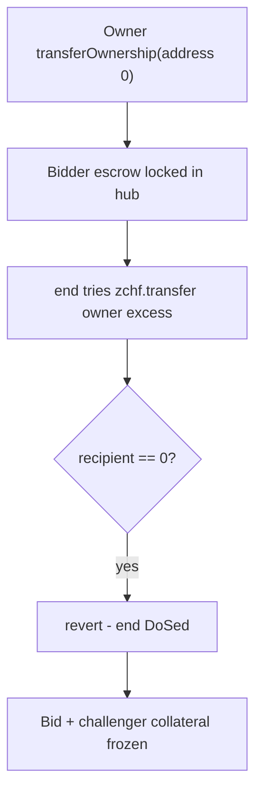

# Frankencoin — Transfer position ownership to address(0) DoSes end()

> **Vulnerability classes:** vuln/frozen-funds · vuln/ownership-transfer · vuln/dos-resistance

> **Reproduction:** self-contained Foundry PoC with **only `forge-std`** — no fork, no RPC.
> Full trace: [output.txt](output.txt). PoC:
> [test/20019-h-04-transfer-position-ownership-to-addr0-to-dos-end-challen.sol](test/20019-h-04-transfer-position-ownership-to-addr0-to-dos-end-challen.sol).

<!-- non-defihacklabs -->
<!-- source-auditvault: https://github.com/Auditware/AuditVault/blob/main/findings/20019-h-04-transfer-position-ownership-to-addr0-to-dos-end-challen.md -->
<!-- date: 2023-04 -->

---

## Key info

| | |
|---|---|
| **Impact** | **HIGH** — position owner sets `owner = address(0)`; `MintingHub.end` refunds excess bid to owner and reverts on ZCHF's zero-address guard, permanently locking the winning bid and the challenger's escrowed collateral |
| **Protocol** | [Frankencoin](https://frankencoin.com) |
| **Vulnerable code** | `MintingHub.end` → `zchf.transfer(owner, excess)` + ERC20 `_transfer` `require(recipient != address(0))`; enabler: unbounded `transferOwnership` |
| **Bug class** | Ownership transfer to zero → settlement DoS → frozen funds |
| **Finding** | Code4rena — Frankencoin, 2023-04 · #20019 · reporter **__141345__** |
| **Report** | [code4rena.com/reports/2023-04-frankencoin](https://code4rena.com/reports/2023-04-frankencoin) |
| **Source** | [AuditVault](https://github.com/Auditware/AuditVault/blob/main/findings/20019-h-04-transfer-position-ownership-to-addr0-to-dos-end-challen.md) |
| **Status** | Audit finding — confirmed by Frankencoin |
| **Compiler** | `^0.8.24` (PoC) |

---

## TL;DR

1. Owner about to lose a challenge calls `transferOwnership(address(0))`.
2. Winning bid creates an excess refund path in `end()`.
3. `zchf.transfer(owner, excess)` reverts because recipient is zero.
4. Bid ZCHF and challenger collateral stay locked in the hub forever.

## The vulnerable code

```solidity
// MintingHub.end — excess refund
if (effectiveBid > fundsNeeded) {
    // @> VULN: reverts when owner is address(0)
    zchf.transfer(owner, effectiveBid - fundsNeeded);
}

// ERC20._transfer
function _transfer(address sender, address recipient, uint256 amount) internal virtual {
    require(recipient != address(0)); // zero-address guard
    ...
}
```

**Fix:** disallow `transferOwnership(address(0))`; optionally skip/burn excess when owner is zero.

## Root cause

Settlement always tries to refund excess bid to the current position owner. Ownership is transferable to the zero address, and the ZCHF ERC20 forbids transfers to zero — so a malicious (or desperate) owner can brick every `end()` that would pay them a refund.

## Attack walkthrough

1. Challenge + winning bid escrowed (period 0 so `end` is immediate).
2. Owner calls `transferOwnership(address(0))`.
3. Anyone calls `end()` → excess refund reverts.
4. Bid and challenger collateral remain in the hub; challenge never clears.

## Diagrams



## Impact

- Successful bidder loses the bid fund (locked, unrecoverable via `end`).
- Challenger loses escrowed collateral and challenge reward.
- Liquidation / challenge settlement for that position is permanently bricked when excess would be refunded.

## Taxonomy

- genome: frozen-funds, ownership-transfer, dos-resistance, reward-accounting
- sector: lending, token
- severity: high
- platform: code4rena

## Sources

- [AuditVault finding #20019](https://github.com/Auditware/AuditVault/blob/main/findings/20019-h-04-transfer-position-ownership-to-addr0-to-dos-end-challen.md)
- [Code4rena report 2023-04-frankencoin](https://code4rena.com/reports/2023-04-frankencoin)
- Reduced from [code-423n4/2023-04-frankencoin](https://github.com/code-423n4/2023-04-frankencoin) `MintingHub.end` + `ERC20._transfer` + position ownership transfer
