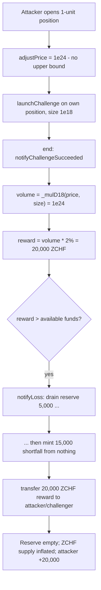
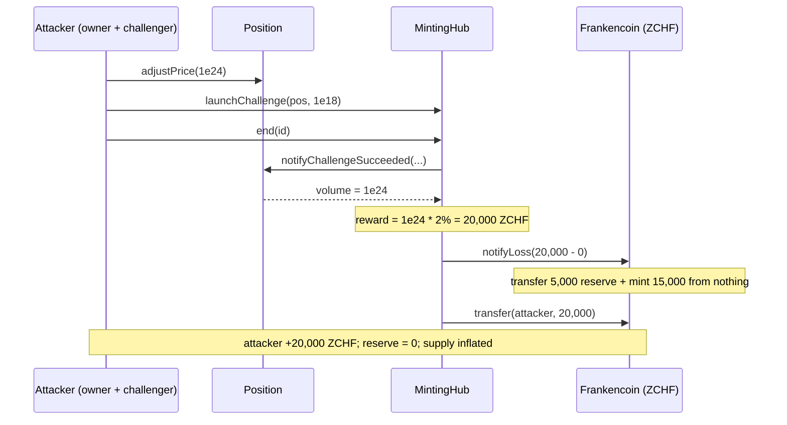

# Frankencoin — CHALLENGER_REWARD can be used to drain reserves and free-mint ZCHF

> **Vulnerability classes:** vuln/logic/reward-calculation · vuln/access-control/unbounded-parameter · vuln/loss-of-funds/direct-drain

> **Reproduction:** a self-contained Foundry PoC that compiles & runs in an
> isolated project with **only `forge-std`** — no fork, no RPC, no `anvil_state`.
> Full trace: [output.txt](output.txt). PoC:
> [test/20021-h-06-challenger-reward-can-be-used-to-drain-reserves-and-fre.sol](test/20021-h-06-challenger-reward-can-be-used-to-drain-reserves-and-fre.sol).

<!-- non-defihacklabs -->
<!-- source-auditvault: https://github.com/Auditware/AuditVault/blob/main/findings/20021-h-06-challenger-reward-can-be-used-to-drain-reserves-and-fre.md -->
<!-- date: 2023-04 -->

---

## Key info

| | |
|---|---|
| **Impact** | **HIGH** — an attacker opens a 1-unit position with an absurdly high self-reported liquidation price, self-challenges it, and collects a 2%-of-volume "challenger reward" that drains the entire reserve and free-mints the remaining shortfall as ZCHF |
| **Protocol** | [Frankencoin](https://frankencoin.com) — a collateralized, decentralized stablecoin (ZCHF) with an auction-based liquidation mechanism |
| **Vulnerable code** | `MintingHub.end` — `reward = (volume * CHALLENGER_REWARD) / 1000_000`, fed by `Position.notifyChallengeSucceeded`'s `volumeZCHF = _mulD18(price, _size)` with an owner-controlled, **unbounded** `price` |
| **Bug class** | Reward computed from an unbounded, attacker-controlled parameter; loss covered by minting |
| **Finding** | Code4rena — Frankencoin, 2023-04 · #20021 · reporter **Emmanuel** |
| **Report** | [code4rena.com/reports/2023-04-frankencoin](https://code4rena.com/reports/2023-04-frankencoin) |
| **Source** | [AuditVault](https://github.com/Auditware/AuditVault/blob/main/findings/20021-h-06-challenger-reward-can-be-used-to-drain-reserves-and-fre.md) |
| **Status** | Audit finding — caught in review (not exploited on-chain). Confirmed by the Frankencoin team as *"probably the most important issue revealed during the audit."* Reproduced here as a standalone local PoC. |
| **Compiler** | `^0.8.24` (PoC) |

This is an **audit finding**, not a historical on-chain incident. The PoC keeps
the two blamed lines (`reward = (volume * CHALLENGER_REWARD) / 1000_000` and
`volumeZCHF = _mulD18(price, _size)`) verbatim, plus a faithful reduction of
`Frankencoin.notifyLoss`, so the drain-and-free-mint becomes a measurable ZCHF
loss.

---

## TL;DR

1. `Position` records a liquidation `price` that the owner sets — at open time via
   `_liqPrice`, or later via `adjustPrice`. **There is no upper bound.**
2. When a challenge ends, `MintingHub.end` pays the challenger
   `reward = (volume * CHALLENGER_REWARD) / 1000_000`, where
   `volume = _mulD18(price, size)`. The reward therefore scales linearly with the
   attacker-controlled `price`.
3. The attacker opens a 1-unit position with an astronomical price, launches a
   challenge on it **with itself as challenger**, and ends it in the same block
   (challenge period 0).
4. The reward dwarfs any real collateral. Because neither the position nor a bid
   covers it, `Frankencoin.notifyLoss` transfers out the **entire reserve** and
   then **mints the shortfall from nothing**.
5. The attacker walks away with 20,000 ZCHF for a 1-unit position; the reserve is
   empty and ZCHF total supply is inflated by the minted shortfall.

---

## The vulnerable code

The challenger reward, sized by the position's self-reported volume (verbatim,
`MintingHub.end`):

```solidity
uint256 reward = (volume * CHALLENGER_REWARD) / 1000_000; // @> attacker-controlled `volume`
uint256 fundsNeeded = reward + repayment;
if (effectiveBid > fundsNeeded){
    zchf.transfer(owner, effectiveBid - fundsNeeded);
} else if (effectiveBid < fundsNeeded){
    zchf.notifyLoss(fundsNeeded - effectiveBid); // ensure we have enough to pay everything
}
zchf.transfer(challenge.challenger, reward); // pay out the challenger reward
```

`volume` comes straight from the unbounded price (verbatim,
`Position.notifyChallengeSucceeded`):

```solidity
uint256 volumeZCHF = _mulD18(price, _size); // @> price is owner-set with no upper cap
```

And `price` is set with no bound (verbatim, `Position.adjustPrice`):

```solidity
function adjustPrice(uint256 newPrice) public onlyOwner noChallenge {
    ...
    price = newPrice; // @> no maximum
    emitUpdate();
}
```

The loss is covered by minting (verbatim, `Frankencoin.notifyLoss`):

```solidity
function notifyLoss(uint256 _amount) override external minterOnly {
    uint256 reserveLeft = balanceOf(address(reserve));
    if (reserveLeft >= _amount){
        _transfer(address(reserve), msg.sender, _amount);
    } else {
        _transfer(address(reserve), msg.sender, reserveLeft);
        _mint(msg.sender, _amount - reserveLeft); // @> free-mint the shortfall
    }
}
```

---

## Root cause

The challenger reward is a fixed percentage of a *volume* that the position owner
alone determines and can inflate without limit. Because the protocol's design
guarantees the reward will be paid (falling back to `notifyLoss` → reserve drain →
mint), an attacker who is both the position owner and the challenger can convert an
arbitrarily large self-reported price directly into ZCHF at the system's expense.

## Preconditions

- Anyone can open a position and set an arbitrary `_liqPrice` (or raise it later
  with `adjustPrice`) — permissionless.
- `_challengeSeconds` can be 0, so the position can be challenged and ended in one
  block (the finding also notes the position can be challenged before its start
  time).
- A non-empty reserve / working `notifyLoss` mint path (the value at risk).

## Attack walkthrough

From [output.txt](output.txt), with a reserve pre-seeded to 5,000 ZCHF:

1. Attacker owns a position and calls `adjustPrice(1e24)` — an astronomical
   liquidation price with no cap enforced.
2. Attacker launches a challenge on its own position with a 1-unit challenge size
   (challenger == attacker).
3. Attacker calls `end`. `notifyChallengeSucceeded` returns
   `volume = _mulD18(1e24, 1e18) = 1e24`.
4. `reward = 1e24 * 20000 / 1_000_000 = 2e22 = 20,000 ZCHF`. Funds needed (20,000)
   exceed the reserve (5,000), so `notifyLoss` empties the reserve and **mints the
   15,000 shortfall from nothing**.
5. **HARM:** the attacker/challenger receives the full 20,000 ZCHF for a 1-unit
   position; the reserve is drained to zero and ZCHF total supply is inflated by
   the minted shortfall. A control assertion confirms that at a *sane* price the
   reward is a negligible fraction of the reserve.

## Diagrams





## Remediation

Restrict when challenges can be started so a position can only be challenged when
it was once validly priced, and bound how much the liquidation price can change per
adjustment (e.g., a maximum percentage step). This prevents a freshly-created or
just-repriced position from being self-challenged at an arbitrary price.

## How to reproduce

```bash
cd ~/RustroverProjects/audits/evm-hack-registry/20021-h-06-challenger-reward-can-be-used-to-drain-reserves-and-fre_exp
forge test -vvv
# Fully local — no fork, no RPC, no anvil_state required.
# Expected: both tests PASS:
#   test_challengerReward_drainsReserve_and_freeMints (attack: +20,000 ZCHF, reserve drained, supply inflated)
#   test_saneReward_isBounded                         (control: sane price -> negligible reward)
```

PoC source: [test/20021-h-06-challenger-reward-can-be-used-to-drain-reserves-and-fre.sol](test/20021-h-06-challenger-reward-can-be-used-to-drain-reserves-and-fre.sol)
— the verbatim reward / volume / notifyLoss lines plus the self-challenge attack
and a control test.

> Note: the reserve size (5,000), inflated price (1e24) and 1-unit challenge size
> are reduced-model parameters chosen for clean arithmetic (real Frankencoin's
> reward magnitude depends on live reserve/equity state, out of scope). The
> `reward = (volume * CHALLENGER_REWARD) / 1000_000` and
> `volumeZCHF = _mulD18(price, _size)` lines and the reserve-drain-then-mint
> `notifyLoss` behavior are faithful; the exact +20,000 magnitude validates the
> model.

---

*Reference: finding **#20021** by **Emmanuel** in the [Code4rena Frankencoin audit (Apr 2023)](https://code4rena.com/reports/2023-04-frankencoin) · curated by [AuditVault](https://github.com/Auditware/AuditVault/blob/main/findings/20021-h-06-challenger-reward-can-be-used-to-drain-reserves-and-fre.md)*
