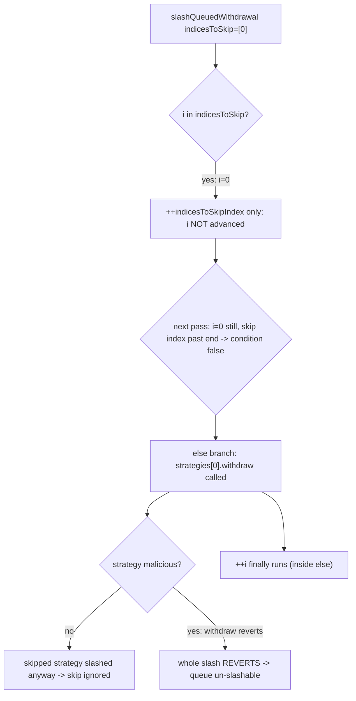
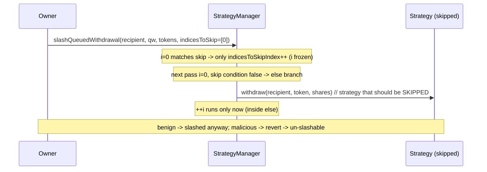

# EigenLayer — impossible to slash queued withdrawals containing a malicious strategy (misplaced ++i)

> **Vulnerability classes:** vuln/logic/loop-increment-misplacement · vuln/dos/unslashable-withdrawal · vuln/loss-of-funds/slashing-evasion

> **Reproduction:** a self-contained Foundry PoC that compiles & runs in an
> isolated project with **only `forge-std`** — no fork, no RPC, no `anvil_state`.
> Full trace: [output.txt](output.txt). PoC:
> [test/20057-h-02-it-is-impossible-to-slash-queued-withdrawals-that-conta_exp.sol](test/20057-h-02-it-is-impossible-to-slash-queued-withdrawals-that-conta_exp.sol).

<!-- non-defihacklabs -->
<!-- source-auditvault: https://github.com/Auditware/AuditVault/blob/main/findings/20057-h-02-it-is-impossible-to-slash-queued-withdrawals-that-conta.md -->
<!-- date: 2023-04 -->

---

## Key info

| | |
|---|---|
| **Impact** | **HIGH** — an adversary creates a queued withdrawal containing a malicious strategy that can NEVER be slashed; the shares escape slashing and the withdrawal can later be completed |
| **Protocol** | [EigenLayer](https://www.eigenlayer.xyz) — restaking (StrategyManager slashing / withdrawal queue) |
| **Vulnerable code** | `StrategyManager.slashQueuedWithdrawal` — the `++i` increment nested inside the loop's `else` branch |
| **Bug class** | Misplaced loop increment: `indicesToSkip` is silently ignored |
| **Finding** | Code4rena — EigenLayer, 2023-04 · #20057 · reporter **volodya** |
| **Report** | [code4rena.com/reports/2023-04-eigenlayer](https://code4rena.com/reports/2023-04-eigenlayer) |
| **Source** | [AuditVault](https://github.com/Auditware/AuditVault/blob/main/findings/20057-h-02-it-is-impossible-to-slash-queued-withdrawals-that-conta.md) |
| **Status** | Audit finding — caught in review (not exploited on-chain). Reproduced here as a standalone local PoC. Confirmed by EigenLayer; judge agreed HIGH. |
| **Compiler** | `^0.8.24` (PoC) |

This is an **audit finding**, not a historical on-chain incident. The PoC keeps the
vulnerable `slashQueuedWithdrawal` loop verbatim and replaces the surrounding
withdrawal-root / frozen-operator / EigenPod machinery (irrelevant to the loop bug)
with minimal faithful mocks: a benign strategy that pays out its underlying 1:1 on
withdraw, and a malicious strategy whose `withdraw` always reverts.

---

## TL;DR

1. `slashQueuedWithdrawal(recipient, queuedWithdrawal, tokens, indicesToSkip)` lets the
   owner **skip** strategies in a queued withdrawal — designed so that a malicious
   strategy (whose `withdraw` reverts) can be skipped while the rest are slashed.
2. The loop's `++i` is nested **inside the `else` branch**. When index `i` is in
   `indicesToSkip`, only `indicesToSkipIndex` advances — `i` stays put.
3. Next iteration: `i` is unchanged but `indicesToSkipIndex` moved on, so the skip
   condition is now false → the `else` runs and `strategies[i].withdraw()` is called
   on the strategy that was supposed to be skipped.
4. The `indicesToSkip` parameter is therefore **completely ignored**. A benign
   strategy the owner asked to skip is slashed anyway; a **malicious** strategy makes
   the whole slash **revert**, so the queued withdrawal can **never** be slashed.
5. The adversary parks funds behind a reverting strategy, defeats the slasher, and
   later completes the withdrawal — recovering funds that should have been slashed.

---

## The vulnerable code

`StrategyManager.slashQueuedWithdrawal` (loop copied verbatim; the `@>` line is the bug):

```solidity
uint256 indicesToSkipIndex = 0;
uint256 strategiesLength = queuedWithdrawal.strategies.length;
for (uint256 i = 0; i < strategiesLength;) {
    // check if the index i matches one of the indices specified in the `indicesToSkip` array
    if (indicesToSkipIndex < indicesToSkip.length && indicesToSkip[indicesToSkipIndex] == i) {
        unchecked { ++indicesToSkipIndex; }
    } else {
        if (queuedWithdrawal.strategies[i] == beaconChainETHStrategy) {
            _withdrawBeaconChainETH(queuedWithdrawal.depositor, recipient, queuedWithdrawal.shares[i]);
        } else {
            // tell the strategy to send the appropriate amount of funds to the recipient
            queuedWithdrawal.strategies[i].withdraw(recipient, tokens[i], queuedWithdrawal.shares[i]);
        }
        unchecked {
            ++i;   // @> VULN: increment lives INSIDE the else — a skipped index never advances `i`
        }
    }
}
```

Because `++i` only runs on the non-skipped path, an index that is skipped is
re-visited on the next iteration with `i` unchanged, the skip condition now false, and
the strategy is processed anyway.

---

## Root cause

The developer intended `++i` to run every iteration but placed it inside the `else`
block alongside the withdraw call. Solidity's `for (…;)` has no built-in increment, so
a skipped iteration leaves `i` frozen. The result is that `indicesToSkip` — the exact
mechanism meant to let owners route around a malicious strategy — is a no-op.

## Attack walkthrough

From [output.txt](output.txt):

**Part 1 (proves the skip is ignored, and the `++i` line executes):**
1. A queued withdrawal holds one **benign** strategy funded with `1e18`.
2. The owner calls `slashQueuedWithdrawal` with `indicesToSkip = [0]` — the only
   strategy, so *nothing* should be withdrawn.
3. Due to the bug, `strategies[0].withdraw()` runs anyway and the recipient receives
   the full `1e18`. **The skip was ignored.**

**Part 2 (proves the real-world consequence):**
4. A queued withdrawal holds one **malicious** strategy (`withdraw` reverts).
5. The owner calls `slashQueuedWithdrawal` with `indicesToSkip = [0]`, correctly naming
   the malicious strategy to skip.
6. The ignored skip forces `malicious.withdraw()` to run → the entire slash **reverts**.
   The queued withdrawal can **never** be slashed and its `5e18` shares are untouched.

**HARM:** slashing is defeated. A malicious strategy embedded in a withdrawal queue
makes that queue permanently un-slashable; the adversary later completes the
withdrawal and keeps funds that should have been burned.

## Diagrams





## Remediation

Move `++i` out of the `else` branch so the counter advances on every iteration:

```diff
        } else {
            ...
            queuedWithdrawal.strategies[i].withdraw(recipient, tokens[i], queuedWithdrawal.shares[i]);
-           unchecked { ++i; }
        }
+       unchecked { ++i; }
    }
```

## How to reproduce

```bash
cd ~/RustroverProjects/audits/evm-hack-registry/20057-h-02-it-is-impossible-to-slash-queued-withdrawals-that-conta_exp
forge test -vvv
# Fully local — no fork, no RPC, no anvil_state required.
# Expected: test PASSES — skip ignored (recipient gets the skipped strategy's funds)
#           AND slash of a malicious-strategy queue reverts (shares un-slashable).
```

PoC source: [test/20057-h-02-it-is-impossible-to-slash-queued-withdrawals-that-conta_exp.sol](test/20057-h-02-it-is-impossible-to-slash-queued-withdrawals-that-conta_exp.sol)
— the verbatim vulnerable loop plus a two-part demonstration and a forge-std driver.

> Note: the 1:1 share→token payout and the reverting-strategy mock are reduced-model
> stand-ins for EigenLayer's StrategyBase and an arbitrary malicious strategy (the real
> system's withdrawal-root/frozen-operator machinery is out of scope). The magnitudes
> validate the model; the loop bug and the verbatim vulnerable `++i` line are faithful.

---

*Reference: finding **#20057** ([H-02]) by **volodya** in the [Code4rena EigenLayer contest (Apr 2023)](https://code4rena.com/reports/2023-04-eigenlayer) · curated by [AuditVault](https://github.com/Auditware/AuditVault/blob/main/findings/20057-h-02-it-is-impossible-to-slash-queued-withdrawals-that-conta.md)*
