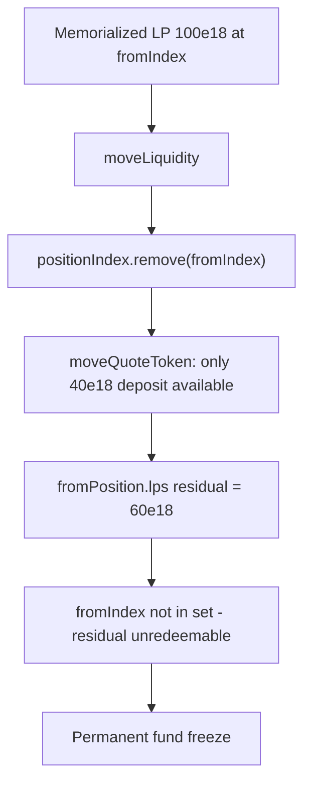

# Ajna Protocol — PositionManager's `moveLiquidity` freezes residual LP on partial moves

> **Vulnerability classes:** vuln/dos/frozen-funds · impact/locked-funds
>
> **Reproduction:** self-contained Foundry PoC with **only `forge-std`** — no fork.
> Full trace: [output.txt](output.txt).

<!-- non-defihacklabs -->
<!-- source-auditvault: https://github.com/Auditware/AuditVault/blob/main/findings/20069-h-01-positionmanagers-moveliquidity-can-freeze-funds-by-remo.md -->
<!-- date: 2023-05 -->

---

## Key info

| | |
|---|---|
| **Impact** | **HIGH** — residual LP after a partial `moveQuoteToken` is permanently frozen |
| **Protocol** | [Ajna Protocol](https://www.ajna.finance/) — PositionManager |
| **Vulnerable code** | `PositionManager.moveLiquidity` — unconditional `positionIndex.remove(fromIndex)` |
| **Bug class** | State desync: index dropped before partial LP reduction completes |
| **Finding** | Code4rena — Ajna, 2023-05 · #20069 · [H-01] · reporter **hyh** |
| **Report** | [code4rena.com/reports/2023-05-ajna](https://code4rena.com/reports/2023-05-ajna) |
| **Source** | [AuditVault](https://github.com/Auditware/AuditVault/blob/main/findings/20069-h-01-positionmanagers-moveliquidity-can-freeze-funds-by-remo.md) |
| **Compiler** | `^0.8.24` (PoC) |

## TL;DR

1. `moveLiquidity` removes `fromIndex` from `positionIndexes` **before** calling `pool.moveQuoteToken`.
2. `moveQuoteToken` can move only part of the requested quote when deposit is the binding constraint.
3. `fromPosition.lps` is reduced by the partial amount but the index is already gone.
4. Residual LP is untracked → redeem/move paths cannot touch it → **permanent freeze**.

## The vulnerable code

```solidity
// remove bucket index from which liquidity is moved from tracked positions
if (!positionIndex.remove(params_.fromIndex)) revert RemovePositionFailed(); // @> VULN
// ... later ...
fromPosition.lps -= vars.lpbAmountFrom; // residual may remain > 0
```

## Root cause

The index set is updated as if the move were always complete. Liquidity constraints in the pool make partial moves real; the PositionManager does not re-check residual LP before dropping the index.

## Attack walkthrough

1. Memorialized position holds 100e18 LP; bucket deposit available is only 40e18.
2. Owner calls `moveLiquidity` → index removed, only 40e18 LP moved.
3. 60e18 residual remains at `fromIndex` with no set membership → redeem freezes.

## Diagrams



## Impact

Permanent freeze of residual LP for the NFT beneficiary whenever a partial quote move occurs.

## Sources

- AuditVault finding: https://github.com/Auditware/AuditVault/blob/main/findings/20069-h-01-positionmanagers-moveliquidity-can-freeze-funds-by-remo.md
- Report: https://code4rena.com/reports/2023-05-ajna
- Repo@commit: code-423n4/2023-05-ajna@276942bc2f97488d07b887c8edceaaab7a5c3964 (`ajna-core/src/PositionManager.sol`)

Taxonomy: `[[frozen-funds]]` · `[[locked-funds]]` · `severity/high` · `sector/lending`
