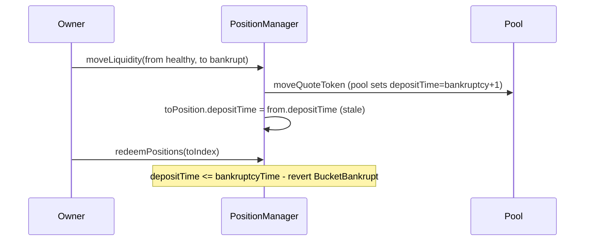

# Ajna Protocol — PositionManager's `moveLiquidity` freezes LP via wrong deposit time

> **Vulnerability classes:** impact/loss-of-funds/locked-funds · frozen-funds
>
> **Reproduction:** self-contained Foundry PoC with **only `forge-std`** — no fork.
> Full trace: [output.txt](output.txt).

<!-- non-defihacklabs -->
<!-- source-auditvault: https://github.com/Auditware/AuditVault/blob/main/findings/20070-h-02-positionmanagers-moveliquidity-can-set-wrong-deposit-ti.md -->
<!-- date: 2023-05 -->

---

## Key info

| | |
|---|---|
| **Impact** | **HIGH** — moved LP permanently frozen when destination bucket is bankrupt vs stale depositTime |
| **Protocol** | [Ajna Protocol](https://www.ajna.finance/) — PositionManager |
| **Vulnerable code** | `toPosition.depositTime = vars.depositTime` (source copy) |
| **Bug class** | Incorrect time inheritance across bucket bankruptcy |
| **Finding** | Code4rena — Ajna, 2023-05 · #20070 · [H-02] · reporter **hyh** |
| **Report** | [code4rena.com/reports/2023-05-ajna](https://code4rena.com/reports/2023-05-ajna) |
| **Source** | [AuditVault](https://github.com/Auditware/AuditVault/blob/main/findings/20070-h-02-positionmanagers-moveliquidity-can-set-wrong-deposit-ti.md) |
| **Compiler** | `^0.8.24` (PoC) |

## TL;DR

1. `moveLiquidity` copies `fromPosition.depositTime` onto `toPosition`.
2. Destination bucket may have `bankruptcyTime > from.depositTime`.
3. Pool-side LenderActions renews deposit time past bankruptcy; PositionManager does not.
4. `redeemPositions` then reverts `BucketBankrupt` — moved funds frozen.

## The vulnerable code

```solidity
// update position deposit time to the from bucket deposit time
toPosition.depositTime = vars.depositTime; // @> VULN
```

## Root cause

Source deposit time is a valid liveness certificate only for the source bucket. Copying it to an arbitrary destination ignores that bucket's bankruptcy clock. LenderActions already computes the correct destination time; PositionManager does not.

## Attack walkthrough

1. Healthy LP at fromIndex with depositTime=100.
2. toIndex has bankruptcyTime=500.
3. After move, PositionManager stamps depositTime=100; pool would use 501.
4. redeem reverts because 100 <= 500.

## Diagrams



## Impact

Permanent loss of access to moved LP whenever destination bankruptcy exceeds the copied source deposit time — a common operation with no exotic prerequisites.

## Sources

- AuditVault: https://github.com/Auditware/AuditVault/blob/main/findings/20070-h-02-positionmanagers-moveliquidity-can-set-wrong-deposit-ti.md
- Report: https://code4rena.com/reports/2023-05-ajna
- Repo@commit: code-423n4/2023-05-ajna@276942bc2f97488d07b887c8edceaaab7a5c3964

Taxonomy: `[[frozen-funds]]` · `[[locked-funds]]` · `severity/high` · `sector/lending`
