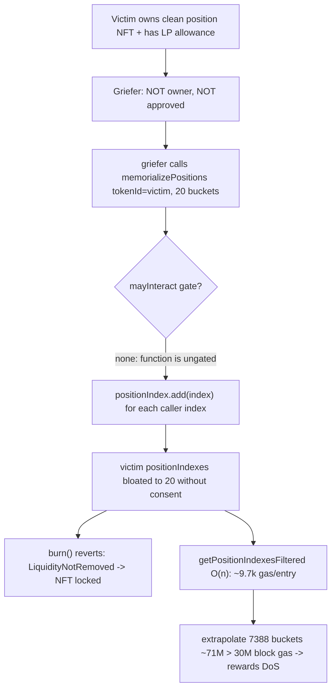
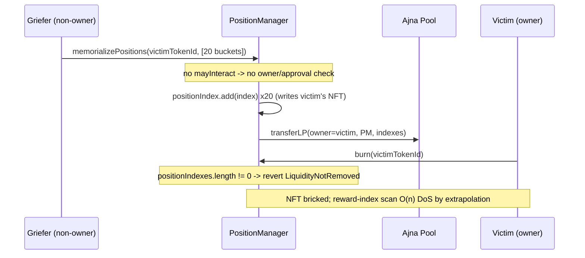

# Ajna Protocol — Position NFT can be spammed with insignificant positions by anyone until rewards DoS

> **Vulnerability classes:** vuln/access-control/missing-authorization · vuln/dos/griefing · vuln/logic/reward-calculation

> **Reproduction:** a self-contained Foundry PoC that compiles & runs in an
> isolated project with **only `forge-std`** — no fork, no RPC, no `anvil_state`.
> Full trace: [output.txt](output.txt). PoC:
> [test/20071-h-03-position-nft-can-be-spammed-with-insignificant-position_exp.sol](test/20071-h-03-position-nft-can-be-spammed-with-insignificant-position_exp.sol).

<!-- non-defihacklabs -->
<!-- source-auditvault: https://github.com/Auditware/AuditVault/blob/main/findings/20071-h-03-position-nft-can-be-spammed-with-insignificant-position.md -->
<!-- date: 2023-05 -->

---

## Key info

| | |
|---|---|
| **Impact** | **HIGH** — a permissionless third party attaches insignificant positions to any user's position NFT, bricking the NFT (cannot be burned) and DoSing its rewards (the O(n) reward-index scan exceeds the block gas limit) |
| **Protocol** | [Ajna Protocol](https://www.ajna.finance/) — permissionless lending (PositionManager / RewardsManager) |
| **Vulnerable code** | `PositionManager.memorializePositions` — `external`, **no `mayInteract` owner/approval gate** |
| **Bug class** | Missing authorization: any caller can write attacker-chosen bucket indexes into any tokenId's `positionIndexes` set |
| **Finding** | Code4rena — Ajna, 2023-05 · #20071 · [H-03] · reporter **ToonVH** |
| **Report** | [code4rena.com/reports/2023-05-ajna](https://code4rena.com/reports/2023-05-ajna) |
| **Source** | [AuditVault](https://github.com/Auditware/AuditVault/blob/main/findings/20071-h-03-position-nft-can-be-spammed-with-insignificant-position.md) |
| **Status** | Audit finding — confirmed by Ajna. Reproduced here as a standalone local PoC. |
| **Compiler** | `^0.8.24` (PoC) |

This is an **audit finding**, not a historical on-chain incident. The PoC keeps the
vulnerable `memorializePositions` body verbatim (no access-control modifier), plus
`burn()` and the O(n) `getPositionIndexesFiltered()` verbatim, and reduces the Ajna
pool to a minimal LP-accounting mock so the griefing + DoS become measurable locally.

---

## TL;DR

1. `PositionManager.memorializePositions` is `external` and — unlike `burn()`,
   `moveLiquidity()` and `reedemPositions()`, which are all gated by `mayInteract`
   (owner-or-approved) — has **no access control at all**.
2. Its loop does `positionIndex.add(index)` for every caller-supplied bucket index,
   writing them into `positionIndexes[tokenId]` for a `tokenId` **the caller does
   not own**.
3. A griefer therefore attaches arbitrary *insignificant* (1 wei) positions to
   anyone's NFT. The set grows unbounded (up to the number of price buckets).
4. **Harm #1 (liveness):** `burn()` reverts with `LiquidityNotRemoved()` while any
   position is attached — the rightful owner can no longer burn their own NFT.
5. **Harm #2 (rewards DoS):** `getPositionIndexesFiltered()` — used by
   `RewardsManager.calculateRewards` — iterates the whole set. At ~9.7k gas/entry
   (cold), extrapolated over the buckets an attacker can attach it exceeds the 30M
   block gas limit, so the owner can never compute/claim rewards.

---

## The vulnerable code

`memorializePositions` — no `mayInteract`, writes caller-chosen indexes to any NFT (verbatim):

```solidity
function memorializePositions(MemorializePositionsParams calldata params_) external {
    EnumerableSet.UintSet storage positionIndex = positionIndexes[params_.tokenId];
    ...
    for (uint256 i = 0; i < indexesLength; ) {
        index = params_.indexes[i];
        positionIndex.add(index);   // @> caller-chosen index written to ANY owner's NFT with NO auth check
        ...
    }
    pool.transferLP(owner, address(this), params_.indexes);
    ...
}
```

Compare the gated sibling `burn()` — which is where the lock manifests (verbatim):

```solidity
function burn(BurnParams calldata params_) external mayInteract(params_.pool, params_.tokenId) {
    if (positionIndexes[params_.tokenId].length() != 0) revert LiquidityNotRemoved();
    ...
}
```

---

## Root cause

`memorializePositions` trusts the caller to be acting for the NFT owner but never
checks it. Every other position-mutating entry point carries the `mayInteract`
modifier (owner-or-approved); this one does not. Because the set of bucket indexes
is caller-controlled and the set is unbounded, a third party gains full write access
to another user's NFT state — enough to both brick `burn()` and inflate the
reward-index scan past the block gas limit.

## Attack walkthrough

From [output.txt](output.txt), with a victim who has legitimately supplied dust LP
and granted the manager the usual pre-memorialize allowance:

1. The griefer (this Exploit / attacker) is **not** the NFT owner and holds no
   approval (`isApprovedOrOwner` returns false).
2. It calls `memorializePositions(tokenId = victim's, indexes = 20 buckets)`.
   With no gate, the call proceeds.
3. `positionIndex.add(index)` records all 20 attacker-chosen indexes into the
   victim's `positionIndexes` set; `transferLP` cements them.
4. **Harm:** the victim's `burn()` now reverts (`LiquidityNotRemoved`), and the cold
   reward-index scan costs ~9.7k gas/entry → extrapolated over Ajna's 7388 price
   buckets ≈ **71M gas > 30M block limit**, a permanent rewards DoS.

A control test confirms the same `burn()` revert happens for the *rightful* owner
too — proving it is the **bloat** (not an auth error) that bricks the NFT.

## Diagrams





## Impact

- **Liveness:** the owner cannot burn their own position NFT for as long as a
  griefer keeps positions attached (permissionless, repeatable).
- **Rewards DoS:** `RewardsManager.calculateRewards` /
  `_calculateAndClaimRewards` depend on `getPositionIndexesFiltered`, whose O(n)
  cost is attacker-controlled; once the set is large enough the reward path exceeds
  the block gas limit and the owner can never claim rewards.
- **Integrity:** a third party fully controls the contents of another user's NFT
  position set.

## Remediation

Gate `memorializePositions` with `mayInteract` (require `msg.sender` is the NFT
owner or approved), or enforce a minimum position value to make the griefing
economically unattractive. Ajna confirmed the finding.

## How to reproduce

```bash
cd ~/RustroverProjects/audits/evm-hack-registry/20071-h-03-position-nft-can-be-spammed-with-insignificant-position_exp
forge test -vv
# Fully local — no fork, no RPC, no anvil_state required.
# Expected: 3 tests PASS:
#   test_control_ownerAuthorizedButBloated_burnReverts (control: burn reverts once positions exist)
#   test_spam_byAnyone_bricksNFT                        (non-owner bloats NFT; owner burn bricked)
#   test_rewards_DoS_coldScan_exceedsBlockGas           (~9.7k gas/entry -> extrapolated 71M > 30M)
```

> Note: the reduced pool models LP accounting only (real Ajna is a Fenwick-tree
> pool, out of scope). The 7388-bucket extrapolation is Ajna's `MAX_FENWICK_INDEX`;
> the O(n)-per-entry scan and the verbatim ungated `memorializePositions` are
> faithful. The reward DoS is asserted via the sanctioned sample-and-extrapolate
> method; the NFT burn lock is asserted deterministically.

---

## Sources

- **AuditVault finding:** <https://github.com/Auditware/AuditVault/blob/main/findings/20071-h-03-position-nft-can-be-spammed-with-insignificant-position.md>
- **Contest report:** <https://code4rena.com/reports/2023-05-ajna>
- **Reduced source provenance:** `code-423n4/2023-05-ajna@276942bc2f97488d07b887c8edceaaab7a5c3964` — `ajna-core/src/PositionManager.sol` (`memorializePositions` L170-216, `burn` L142-154, `getPositionIndexesFiltered` L466-485)

*Reference: finding **#20071** [H-03] by **ToonVH** in the [Code4rena Ajna review (May 2023)](https://code4rena.com/reports/2023-05-ajna) · curated by [AuditVault](https://github.com/Auditware/AuditVault/blob/main/findings/20071-h-03-position-nft-can-be-spammed-with-insignificant-position.md)*
