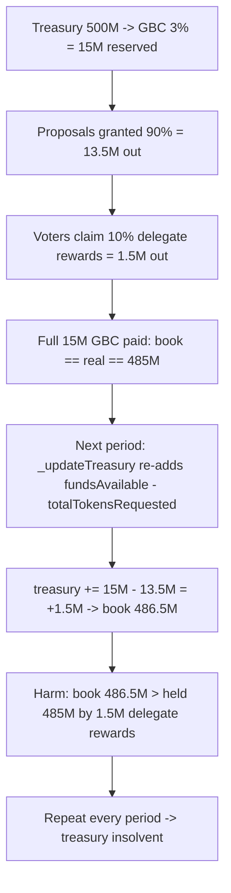

# Ajna Grants — Delegation rewards are not counted toward granting fund

> **Vulnerability classes:** vuln/accounting/double-count · vuln/logic/reward-calculation · vuln/loss-of-funds/treasury-insolvency

> **Reproduction:** a self-contained Foundry PoC that compiles & runs in an
> isolated project with **only `forge-std`** — no fork, no RPC, no `anvil_state`.
> Full trace: [output.txt](output.txt). PoC:
> [test/20072-h-04-delegation-rewards-are-not-counted-toward-granting-fund_exp.sol](test/20072-h-04-delegation-rewards-are-not-counted-toward-granting-fund_exp.sol).

<!-- non-defihacklabs -->
<!-- source-auditvault: https://github.com/Auditware/AuditVault/blob/main/findings/20072-h-04-delegation-rewards-are-not-counted-toward-granting-fund.md -->
<!-- date: 2023-05 -->

---

## Key info

| | |
|---|---|
| **Impact** | **HIGH** — the grant treasury books ~10% of every period's budget that it does not actually hold; compounded over periods it becomes insolvent and cannot honor all grants/rewards |
| **Protocol** | [Ajna Protocol](https://www.ajna.finance/) — Ajna Grants (StandardFunding treasury) |
| **Vulnerable code** | `StandardFunding._updateTreasury` — `treasury += (fundsAvailable - totalTokensRequested)` |
| **Bug class** | Accounting double-count: the 10% voter (delegate) reward slice is re-added to the treasury book even though it was paid out |
| **Finding** | Code4rena — Ajna, 2023-05 · #20072 · [H-04] · reporter **REACH** |
| **Report** | [code4rena.com/reports/2023-05-ajna](https://code4rena.com/reports/2023-05-ajna) |
| **Source** | [AuditVault](https://github.com/Auditware/AuditVault/blob/main/findings/20072-h-04-delegation-rewards-are-not-counted-toward-granting-fund.md) |
| **Status** | Audit finding — severity raised to High by the judge; confirmed by Ajna (dup #263). Reproduced here as a standalone local PoC. |
| **Compiler** | `^0.8.24` (PoC) |

This is an **audit finding**, not a historical on-chain incident. The PoC keeps the
vulnerable `_updateTreasury` line, the `_getDelegateReward` 10%-of-GBC formula, and
the `startNewDistributionPeriod` GBC math verbatim, and reduces the screening/funding
voting machinery to a direct setup of its result so the drift becomes a measurable
book-vs-balance mismatch.

---

## TL;DR

1. Each quarter a Global Budget Constraint (**GBC** = 3% of the treasury) is reserved
   as `fundsAvailable`. It splits **90% for proposals** and **10% for voter
   (delegate) rewards**.
2. Proposals may request at most 90% (`tokensRequested <= fundsAvailable * 9/10`);
   voters claim the other 10% via `claimDelegateReward`.
3. When the period ends, `_updateTreasury` re-adds the *unused* funds:
   `treasury += (fundsAvailable - totalTokensRequested)`. With proposals taking 90%,
   this re-adds ~10% — **the delegate-reward slice** — back to the treasury book.
4. But that 10% was **already paid out** to voters. The treasury's booked balance
   therefore drifts **above** the AJNA it actually holds by exactly the delegate
   rewards, every period.
5. In the PoC: GBC = 15M, delegate rewards = 1.5M. After one period the treasury
   books **486.5M** while holding only **485M** — over-accounted by **1.5M AJNA**.
   Compounded, the treasury eventually cannot honor its grants (insolvency).

---

## The vulnerable code

`_updateTreasury` — re-adds the 10% that was paid to voters (verbatim):

```solidity
// readd non distributed tokens to the treasury
treasury += (fundsAvailable - totalTokensRequested); // @> fundsAvailable=100%, totalTokensRequested<=90% -> re-adds the 10% delegate reward
```

The 10% is genuinely paid out (`_getDelegateReward`, verbatim):

```solidity
// delegateeReward = 10 % of GBC distributed as per delegatee Voting power allocated
rewards_ = Maths.wdiv(
    Maths.wmul(currentDistribution_.fundsAvailable, votingPowerAllocatedByDelegatee),
    currentDistribution_.fundingVotePowerCast
) / 10;
```

---

## Root cause

`fundsAvailable` represents 100% of the GBC, but only up to 90% (`totalTokensRequested`)
is spent on proposals. The remaining slice `fundsAvailable - totalTokensRequested`
includes the 10% reserved for — and actually paid as — delegate rewards.
`_updateTreasury` re-books all of it as "unused", so the treasury double-counts the
delegate rewards: they leave the contract *and* are added back to the book.

## Attack walkthrough

From [output.txt](output.txt), starting from a 500M AJNA treasury:

1. `startNewDistributionPeriod` reserves GBC = 3% × 500M = **15M** into `fundsAvailable`;
   treasury book → 485M (real balance still 500M).
2. A funded proposal requesting 90% (**13.5M**) is executed → 13.5M leaves.
3. Three voters claim the 10% (**1.5M** total) → 1.5M leaves. Now the full 15M GBC has
   been paid out and **book == real balance == 485M**.
4. `startNewDistributionPeriod` (period 2) calls `_updateTreasury(period 1)`:
   `treasury += (15M − 13.5M) = 1.5M` → book climbs to 486.5M.
5. **Harm:** booked (free + reserved) = **486.5M** but only **485M** AJNA is held —
   over-accounted by exactly the **1.5M** delegate rewards. Repeated every period the
   treasury books grants it cannot honor.

## Diagrams



## Impact

- **Treasury insolvency drift:** each period the treasury books ~10% of the GBC it
  does not hold. Over multiple periods the booked balance diverges arbitrarily far
  from reality, so eventually a grant or delegate-reward claim cannot be paid.
- **Inflated future budgets:** the next GBC is computed as 3% of the *inflated*
  treasury, propagating the error.

## Remediation

Re-add only the granted principal, e.g. `treasury += (fundsAvailable * 9/10 -
totalTokensRequested)`, or explicitly subtract the delegate rewards that were paid.
Ajna confirmed the finding (dup #263); the judge raised it to High.

## How to reproduce

```bash
cd ~/RustroverProjects/audits/evm-hack-registry/20072-h-04-delegation-rewards-are-not-counted-toward-granting-fund_exp
forge test -vv
# Fully local — no fork, no RPC, no anvil_state required.
# Expected: both tests PASS; logs show booked 486.5M vs held 485M (1.5M phantom).
```

> Note: the reduced GrantFund replaces the screening/funding/slate voting machinery
> with a direct setup of its result (a funded slate + voter power) and strips the
> block-number challenge-period gating (which would need cheatcodes); the
> `_updateTreasury` bug, the `_getDelegateReward` 10% formula, and the
> `startNewDistributionPeriod` GBC math are verbatim, so the 1.5M over-accounting is
> faithful.

---

## Sources

- **AuditVault finding:** <https://github.com/Auditware/AuditVault/blob/main/findings/20072-h-04-delegation-rewards-are-not-counted-toward-granting-fund.md>
- **Contest report:** <https://code4rena.com/reports/2023-05-ajna>
- **Reduced source provenance:** `code-423n4/2023-05-ajna@276942bc2f97488d07b887c8edceaaab7a5c3964` — `ajna-grants/src/grants/base/StandardFunding.sol` (`_updateTreasury` L197-220, `_getDelegateReward` L280-296, `startNewDistributionPeriod` L119-160)

*Reference: finding **#20072** [H-04] by **REACH** in the [Code4rena Ajna review (May 2023)](https://code4rena.com/reports/2023-05-ajna) · curated by [AuditVault](https://github.com/Auditware/AuditVault/blob/main/findings/20072-h-04-delegation-rewards-are-not-counted-toward-granting-fund.md)*
