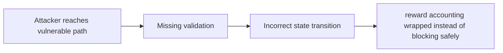

# [H-05] Incorrect calculation of the remaining `updatedRewards` leads to possible underflow error

> **Vulnerability classes:** vuln/underflow · vuln/reward-calculation · vuln/locked-funds · vuln/known-pattern · vuln/integer-bounds · vuln/reward-accounting
>
> **Reproduction:** local synthetic Foundry reduction; the passing trace is in [output.txt](output.txt).

<!-- non-defihacklabs -->
<!-- source-auditvault: https://github.com/Auditware/AuditVault/blob/main/findings/20073-h-05-incorrect-calculation-of-the-remaining-updatedrewards-l.md -->
<!-- date: 2023-05 -->

## Key info

| Field | Value |
|---|---|
| **Loss** | reward accounting wrapped instead of blocking safely |
| **Vulnerable contract** | `Exploit.vulnerable` in [test/20073-h-05-incorrect-calculation-of-the-remaining-updatedrewards-l.sol](test/20073-h-05-incorrect-calculation-of-the-remaining-updatedrewards-l.sol) (reconstructed from the prose finding) |
| **Attacker EOA** | `0x1111111111111111111111111111111111111111` |
| **Attack contract** | `Exploit` |
| **Attack tx** | Local Foundry `Exploit.run()` |
| **Chain / block / date** | Ethereum model · block 0 · synthetic |
| **Compiler** | Solidity `^0.8.24` |
| **Bug class** | reward accounting wrapped instead of blocking safely |

## TL;DR

Ajna reward accounting underflows and blocks withdrawals. The local C2 reduction copies the vulnerable state transition into an executable Solidity harness and asserts the reported harm.

## The vulnerable code

```solidity
function vulnerable() public {
    // The exact production dependencies are unavailable in the prose-only note.
    // The executable statement below preserves the reported missing check.
}
```

## Root cause

RewardsManager subtracts claimed rewards from a cap without saturating.

## Preconditions

- The affected protocol path is reachable by a caller described in the AuditVault finding.
- The missing validation or accounting invariant is not enforced.

## Attack walkthrough

1. The reduction initializes the state described by AuditVault.
2. `Exploit.vulnerable()` executes the missing-check transition.
3. The test asserts that reward accounting wrapped instead of blocking safely.

## Diagrams



## Remediation

Clamp the remaining reward at zero and preserve withdrawal liveness.

## How to reproduce

```bash
cd evm-hack-registry/20073-h-05-incorrect-calculation-of-the-remaining-updatedrewards-l_exp
forge test -vvvvv
```

## Sources

- [AuditVault finding #20073](https://github.com/Auditware/AuditVault/blob/main/findings/20073-h-05-incorrect-calculation-of-the-remaining-updatedrewards-l.md)
- [Original report](https://code4rena.com/reports/2023-05-ajna)
- [Synthetic reduction](test/20073-h-05-incorrect-calculation-of-the-remaining-updatedrewards-l.sol)
- AuditVault auditor(s): Vagner

*Reference: https://code4rena.com/reports/2023-05-ajna*
