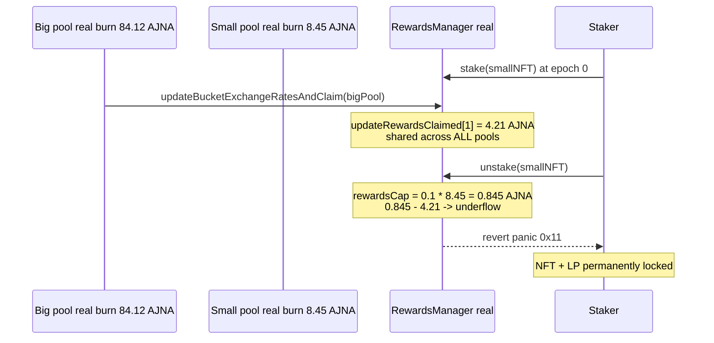

# Ajna H-05 — cross-pool reward-cap underflow bricks unstake / claimRewards

Real, local (no-fork) reproduction. It deploys the **real** audited Ajna
`ERC20PoolFactory` / `PositionManager` / `RewardsManager` / two `ERC20Pool`s
(vendored unmodified under `src/ajna/`), drives **real reserve-auction burns** in
both pools, and shows a legitimate staker's NFT getting permanently locked by an
arithmetic underflow in the audited `RewardsManager`.

```bash
_shared/run-poc/run_poc.sh 20073-h-05-incorrect-calculation-of-the-remaining-updatedrewards-l_exp -vvvvv
```

Sources: [AuditVault finding #20073](https://github.com/Auditware/AuditVault/blob/main/findings/20073-h-05-incorrect-calculation-of-the-remaining-updatedrewards-l.md), [Ajna repository](https://github.com/code-423n4/2023-05-ajna) @ commit `276942bc2f97488d07b887c8edceaaab7a5c3964`.

## Root cause

`RewardsManager` tracks the rewards handed out **per epoch across ALL pools**:

```solidity
mapping(uint256 => uint256) public rewardsClaimed;        // epoch => rewards claimed  (all pools)
mapping(uint256 => uint256) public updateRewardsClaimed;  // epoch => update rewards    (all pools)
```

but the reward **cap** it compares against is computed from a **single pool's**
burn (`src/ajna/src/RewardsManager.sol:719-725`):

```solidity
uint256 rewardsCap            = Maths.wmul(UPDATE_CAP, totalBurned);          // THIS pool only
uint256 rewardsClaimedInEpoch = updateRewardsClaimed[curBurnEpoch];          // ALL pools
if (rewardsClaimedInEpoch + updatedRewards_ >= rewardsCap) {
    updatedRewards_ = rewardsCap - rewardsClaimedInEpoch;                     // @audit underflow if global > per-pool cap
}
```

The same bug exists in `_calculateNewRewards` (`RewardsManager.sol:546-549`,
`newRewards_ = rewardsCapped - rewardsClaimedInEpoch_`). When a large pool has
pushed the shared `updateRewardsClaimed[epoch]` above a *small* pool's per-pool
`rewardsCap`, the subtraction underflows (Solidity 0.8 panic `0x11`) and reverts.
Because this code runs inside `stake` / `unstake` / `claimRewards` /
`updateBucketExchangeRatesAndClaim`, every one of those actions reverts for the
small pool — the staked NFT (an LP position) is permanently trapped.

## Exploit walkthrough (concrete numbers from the passing test)

1. A staker stakes a real LP-NFT in a **big** pool and a **small** pool (epoch 0).
2. Both pools run a **real reserve-auction burn** -> burn epoch 1:
   * big pool burns **84.12 AJNA**  -> per-pool cap `0.1 * 84.12 = 8.41 AJNA`
   * small pool burns **8.45 AJNA** -> per-pool cap `0.1 * 8.45 = 0.845 AJNA`
3. `updateBucketExchangeRatesAndClaim(bigPool)` records the shared tracker
   `updateRewardsClaimed[1] = 4.21 AJNA`.
4. The small pool staker calls `unstake` -> `_updateBucketExchangeRates` computes
   `rewardsCap(0.845) - updateRewardsClaimed[1](4.21)` -> **arithmetic underflow -> revert**.
   `claimRewards` reverts identically.

**Harm:** the small pool staker's NFT stays locked in `RewardsManager`
(`ownerOf == RewardsManager`); they can never unstake or claim. A baseline
snapshot in the test confirms the same `unstake` succeeds when the shared tracker
is still 0, isolating the cross-pool contamination as the cause.



## Fix

Saturate instead of subtracting: if `rewardsClaimedInEpoch >= rewardsCap`, set the
increment to `0` rather than computing `rewardsCap - rewardsClaimedInEpoch`
(apply at both `RewardsManager.sol:549` and `:725`).
