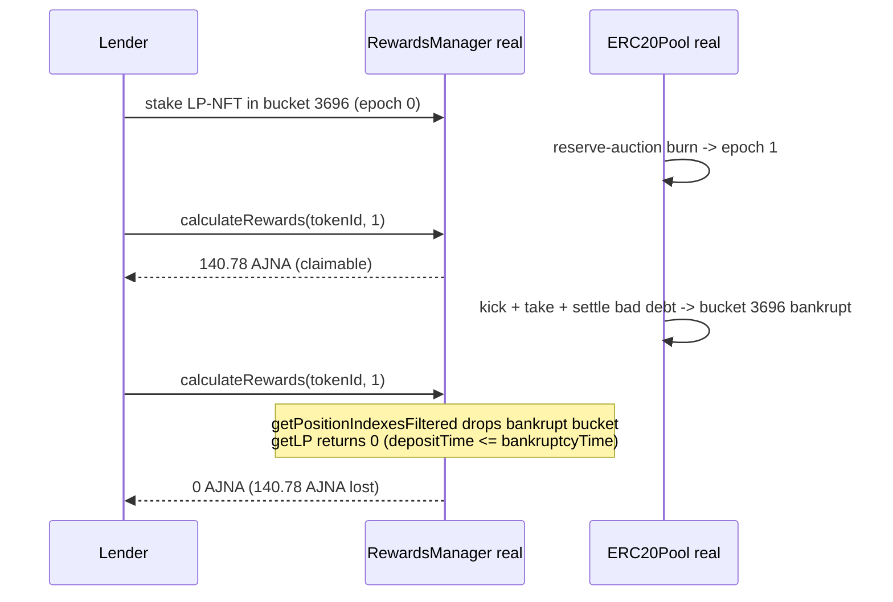

# Ajna H-06 — a bankrupt bucket wipes a lender's already-earned staking rewards

<!-- source-auditvault: https://github.com/Auditware/AuditVault/blob/main/findings/20074-h-06-the-lender-could-possibly-lose-unclaimed-rewards-in-cas.md -->

Real, local (no-fork) reproduction. It deploys the **real** audited Ajna
`ERC20PoolFactory` / `PositionManager` / `RewardsManager` / `ERC20Pool`
(vendored unmodified under `src/ajna/`), stakes a real LP position, accrues
**real, claimable AJNA rewards** through a real reserve-auction burn, then drives
a **real liquidation + settle** that bankrupts the staked bucket — and shows the
already-earned rewards collapse to zero.

```bash
_shared/run-poc/run_poc.sh 20074-h-06-the-lender-could-possibly-lose-unclaimed-rewards-in-cas_exp -vvvvv
```

Sources: [AuditVault finding #20074](https://github.com/Auditware/AuditVault/blob/main/findings/20074-h-06-the-lender-could-possibly-lose-unclaimed-rewards-in-cas.md), [Ajna repository](https://github.com/code-423n4/2023-05-ajna) @ commit `276942bc2f97488d07b887c8edceaaab7a5c3964`.

## Root cause

When a bucket goes bankrupt after a lender's deposit, `PositionManager` treats the
whole tracked position as gone — `getPositionIndexesFiltered` filters the bucket
out and `getLP` returns `0` whenever `depositTime <= bankruptcyTime`
(`src/ajna/src/PositionManager.sol`), and `memorializePositions` zeroes
`position.lps` (L192-199):

```solidity
if (position.depositTime != 0) {
    if (_bucketBankruptAfterDeposit(pool, index, position.depositTime)) {
        position.lps = 0;   // @audit wipes tracked LP without ever claiming rewards
    }
}
```

`RewardsManager.calculateRewards` / `_calculateAndClaimRewards` iterate over
`getPositionIndexesFiltered(tokenId)`. So the moment the bucket is marked bankrupt,
the position's rewards drop to `0` — **including rewards that were already earned
and claimable while the bucket was solvent.** Claiming rewards has no bankruptcy
requirement, but the position is erased before those rewards can be claimed, so
they are lost. (Sponsor acknowledged the behaviour is by-design/coupling-avoidance;
it is reported as H-06.)

## Exploit walkthrough (concrete numbers from the passing test)

1. A lender mints an LP-NFT in the top bucket (index 3696) and stakes it (epoch 0).
2. Deep book liquidity + two borrowers are set up; interest accrues for 400 days.
3. A **real reserve-auction burn** advances the pool to burn epoch 1. The staked
   position now has real, claimable rewards:
   `calculateRewards(tokenId, 1) = ` **140.78 AJNA**.
4. A **real liquidation** of the large borrower (`kick` -> `take` -> `settle`)
   consumes the top bucket's deposit and marks it **bankrupt**.
5. The exact same query now returns `calculateRewards(tokenId, 1) = ` **0**, and
   `getLP(tokenId, 3696) = 0`. Unstaking pays the staker **0 AJNA**.

**Harm:** the lender loses **140.78 AJNA** of rewards they had already earned while
the bucket was solvent (measured claimable in step 3, wiped in step 4).



## Fix

Claim (or credit) a staked position's outstanding rewards before the bankrupt
bucket's LP is zeroed / filtered out, so already-earned rewards are not lost when a
bucket goes bankrupt.
