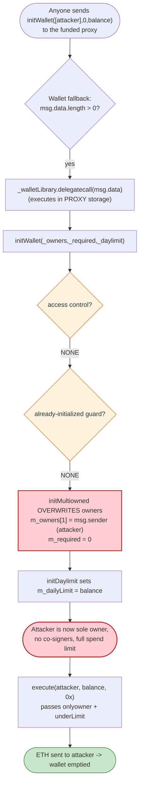
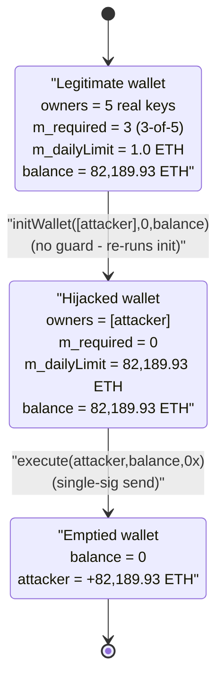

# Parity Multisig First Hack (July 2017) — Unprotected `initWallet` Re-initialization

> **Vulnerability classes:** vuln/access-control/missing-modifier · vuln/access-control/uninitialized-owner

> **Reproduction:** the PoC compiles & runs in an isolated Foundry project at
> [this project folder](.) (the main DeFiHackLabs repo contains several unrelated PoCs
> that do not whole-compile, so this one was extracted).
> Full verbose trace: [output.txt](output.txt).
> Verified vulnerable source: [WalletLibrary.sol](sources/WalletLibrary_a65749/WalletLibrary.sol),
> proxy wallet: [Wallet.sol](sources/Wallet_BEc591/Wallet.sol).

---

## Key info

| | |
|---|---|
| **Loss (this wallet)** | **82,189.93 ETH** drained from a single victim wallet in the PoC |
| **Loss (incident total)** | ~**153,037 ETH** (~$30M at the time) across three wallets drained in the campaign |
| **Vulnerable contract** | `WalletLibrary` (shared delegatecall logic) — [`0xa657491C1e7F16AdB39B9b60E87BbB8d93988bc3`](https://etherscan.io/address/0xa657491C1e7F16AdB39B9b60E87BbB8d93988bc3#code) |
| **Victim contract** | `Wallet` proxy — [`0xBEc591De75b8699A3Ba52F073428822d0Bfc0D7e`](https://etherscan.io/address/0xBEc591De75b8699A3Ba52F073428822d0Bfc0D7e#code) |
| **Attacker EOA** | `0xB3764761E297D6f121e79C32A65829Cd1dDb4D32` |
| **Attacker contract** | N/A (called directly from the EOA) |
| **Attack tx** | [`0x9dbf0326a03a2a3719c27be4fa69aacc9857fd231a8d9dcaede4bb083def75ec`](https://etherscan.io/tx/0x9dbf0326a03a2a3719c27be4fa69aacc9857fd231a8d9dcaede4bb083def75ec) (re-init) / [`0xeef10fc5170f669b86c4cd0444882a96087221325f8bf2f55d6188633aa7be7c`](https://etherscan.io/tx/0xeef10fc5170f669b86c4cd0444882a96087221325f8bf2f55d6188633aa7be7c) (drain) |
| **Chain / block / date** | Ethereum mainnet / fork block 4,043,799 / **July 19, 2017** |
| **Compiler** | Solidity `v0.4.9+commit.364da425`, optimizer **on, 200 runs** |
| **Bug class** | Missing access control on an "initializer" — unprotected re-initialization → owner takeover |

---

## TL;DR

The Parity multisig wallet was a thin **proxy** (`Wallet`) that held the ETH and forwarded every
unrecognized call, via `delegatecall`, to a single shared logic contract (`WalletLibrary`). The
intent was that the proxy's constructor would call `initWallet(...)` **once** to set up owners and
the daily limit.

But `initWallet` — and the `initMultiowned` / `initDaylimit` functions it calls — were **plain
public functions with no access control and no "already initialized" guard**
([WalletLibrary.sol:216-219](sources/WalletLibrary_a65749/WalletLibrary.sol#L216-L219),
[:107-117](sources/WalletLibrary_a65749/WalletLibrary.sol#L107-L117)). Because the proxy's
fallback blindly `delegatecall`s any calldata into the library
([Wallet.sol:428-429](sources/Wallet_BEc591/Wallet.sol#L428-L429)), **anyone** could send
`initWallet([attacker], 0, ...)` to a fully-funded, already-live wallet. That call re-ran
initialization **in the proxy's own storage**, overwriting the real owners with the attacker and
setting `m_required = 0`.

With the attacker now the sole owner and a daily limit set to the entire balance, a single
`execute(attacker, balance, "")` call passed the `onlyowner` and `underLimit` checks and wired the
whole balance to the attacker. In the PoC the drained wallet held **82,189.93 ETH**; the broader
July 2017 incident drained ~**153,037 ETH** total.

---

## Background — Parity's proxy-library architecture

To save deployment gas, each user's Parity multisig was a tiny `Wallet` proxy contract whose only
real logic was a fallback that delegated to one **shared** `WalletLibrary` deployed once on mainnet.

```solidity
// Wallet.sol — the proxy
address constant _walletLibrary = 0xa657491c1e7f16adb39b9b60e87bbb8d93988bc3;

// gets called when no other function matches
function() payable {
    if (msg.value > 0)
        Deposit(msg.sender, msg.value);
    else if (msg.data.length > 0)
        _walletLibrary.delegatecall(msg.data);   // ← forwards ARBITRARY calldata
}
```
([Wallet.sol:423-430](sources/Wallet_BEc591/Wallet.sol#L423-L430))

Because the call is a `delegatecall`, the library's code executes **against the proxy's storage**.
The proxy and library declare the same leading storage layout
(`m_required`, `m_numOwners`, `m_dailyLimit`, `m_spentToday`, `m_lastDay`, `uint[256] m_owners`, …),
so any state-changing library function the attacker reaches edits *the proxy's* owner set and limits
directly.

The proxy was *supposed* to be configured exactly once, at deployment, by its constructor:

```solidity
function Wallet(address[] _owners, uint _required, uint _daylimit) {
    bytes4 sig = bytes4(sha3("initWallet(address[],uint256,uint256)"));
    address target = _walletLibrary;
    ...
    assembly { ... delegatecall(sub(gas, 10000), target, 0x0, add(argsize, 0x4), 0x0, 0x0) }
}
```
([Wallet.sol:399-419](sources/Wallet_BEc591/Wallet.sol#L399-L419))

The fatal assumption was that `initWallet` would *only ever* be reached through this constructor.
Nothing in the library enforced that.

---

## The vulnerable code

### 1. `initWallet` is public and unguarded

```solidity
// constructor - just pass on the owner array to the multiowned and the limit to daylimit
function initWallet(address[] _owners, uint _required, uint _daylimit) {
    initDaylimit(_daylimit);
    initMultiowned(_owners, _required);
}
```
([WalletLibrary.sol:214-219](sources/WalletLibrary_a65749/WalletLibrary.sol#L214-L219))

There is **no** `onlyowner`, **no** `onlymanyowners`, and **no** `if (m_numOwners > 0) throw;`
re-init guard. It is a normal `public` function (the default visibility in Solidity 0.4.9). The
naming and comment call it a "constructor," but to the EVM it is simply a callable function.

### 2. The setup functions it calls clobber owner state

```solidity
function initMultiowned(address[] _owners, uint _required) {
    m_numOwners = _owners.length + 1;
    m_owners[1] = uint(msg.sender);                 // ← msg.sender becomes owner #1
    m_ownerIndex[uint(msg.sender)] = 1;
    for (uint i = 0; i < _owners.length; ++i) {
        m_owners[2 + i] = uint(_owners[i]);
        m_ownerIndex[uint(_owners[i])] = 2 + i;
    }
    m_required = _required;                          // ← attacker chooses required = 0
}
```
([WalletLibrary.sol:105-117](sources/WalletLibrary_a65749/WalletLibrary.sol#L105-L117))

```solidity
function initDaylimit(uint _limit) {
    m_dailyLimit = _limit;                           // ← attacker sets limit = whole balance
    m_lastDay = today();
}
```
([WalletLibrary.sol:200-204](sources/WalletLibrary_a65749/WalletLibrary.sol#L200-L204))

Re-calling these **overwrites** the legitimate owner list rather than appending to it, makes the
caller `msg.sender` an owner, and lets the caller pick `m_required` and `m_dailyLimit`.

### 3. `execute` then trusts the freshly-rewritten state

```solidity
function execute(address _to, uint _value, bytes _data) external onlyowner returns (bytes32 o_hash) {
    if ((_data.length == 0 && underLimit(_value)) || m_required == 1) {
        ...
        if (!_to.call.value(_value)(_data)) throw;   // ← sends _value to _to
        SingleTransact(msg.sender, _value, _to, _data, created);
    } else { ... /* multisig path */ }
}
```
([WalletLibrary.sol:230-255](sources/WalletLibrary_a65749/WalletLibrary.sol#L230-L255))

`onlyowner` now passes (attacker is owner #1). The first branch fires because `_data.length == 0`
and `underLimit(_value)` returns true (the daily limit was set to the full balance), so the wallet
performs an immediate single-transaction send of the entire balance to the attacker — no
co-signers required.

```solidity
function underLimit(uint _value) internal onlyowner returns (bool) {
    if (today() > m_lastDay) { m_spentToday = 0; m_lastDay = today(); }
    if (m_spentToday + _value >= m_spentToday && m_spentToday + _value <= m_dailyLimit) {
        m_spentToday += _value;
        return true;                                 // ← passes: limit == balance
    }
    return false;
}
```
([WalletLibrary.sol:338-351](sources/WalletLibrary_a65749/WalletLibrary.sol#L338-L351))

---

## Root cause — why it was possible

The vulnerability is a textbook **uninitialized/ re-initializable proxy**: an initializer function
that *behaves* like a constructor but is a plain public function with no guard, sitting behind a
proxy that forwards arbitrary calldata to it.

Four design facts compose into total loss:

1. **No access control on `initWallet`.** It can be called by anyone, any number of times, at any
   point in the wallet's life. ([WalletLibrary.sol:216](sources/WalletLibrary_a65749/WalletLibrary.sol#L216))
2. **No "already initialized" latch.** `initMultiowned` does not check `m_numOwners == 0` before
   overwriting the owner table, so a second call replaces (not augments) the real owners.
   ([WalletLibrary.sol:107-117](sources/WalletLibrary_a65749/WalletLibrary.sol#L107-L117))
3. **The proxy forwards everything via `delegatecall`.** `Wallet`'s fallback delegatecalls *any*
   non-empty calldata into the library, so the attacker's `initWallet(...)` runs against the
   *funded proxy's* storage. ([Wallet.sol:428-429](sources/Wallet_BEc591/Wallet.sol#L428-L429))
4. **Owner-set, required-sigs, and daily-limit are all attacker-chosen during init.** By passing
   `_required = 0` and `_daylimit = balance`, the attacker simultaneously becomes the sole owner,
   removes any multisig requirement, and raises the spend limit to the whole balance — turning a
   3-of-5 multisig into a 1-of-1 wallet they control.

The "constructor" comment in the source ([WalletLibrary.sol:214](sources/WalletLibrary_a65749/WalletLibrary.sol#L214),
[:200](sources/WalletLibrary_a65749/WalletLibrary.sol#L200),
[:105](sources/WalletLibrary_a65749/WalletLibrary.sol#L105)) reflects the *intended* lifecycle,
not the *enforced* one — the EVM has no concept of "this is a constructor, only callable once."

---

## Preconditions

- The victim is a live, funded Parity `Wallet` proxy pointing at the shared `WalletLibrary`.
- The proxy fallback forwards arbitrary calldata into the library via `delegatecall` (always true
  for this wallet design). ([Wallet.sol:428-429](sources/Wallet_BEc591/Wallet.sol#L428-L429))
- `initWallet` carries no re-init guard and no access control (always true in this library
  version). ([WalletLibrary.sol:216](sources/WalletLibrary_a65749/WalletLibrary.sol#L216))
- No working capital, flash loan, market manipulation, or special timing required — the attacker
  simply sends two ordinary transactions.

---

## Step-by-step attack walkthrough

All figures are read directly from the `-vvvvv` trace in [output.txt](output.txt). The PoC reproduces
the attack against a single wallet holding **82,189.93 ETH** (`82,189,932,605,820,062,911,880` wei).

| # | Step | Call | Storage / balance effect |
|---|------|------|--------------------------|
| 0 | **Baseline** | `VICTIM_WALLET.balance` | 82,189.93 ETH; `isOwner(attacker) == false`; `m_required = 3`, `m_numOwners = 5` ([output.txt:18-23](output.txt)) |
| 1 | **Re-initialize** | `initWallet([attacker], 0, 82189.93e18)` (hits proxy fallback → `delegatecall` into library) | slot `0` `m_required`: `3 → 0`; slot `1` `m_numOwners`: `5 → 2`; slot `2` `m_dailyLimit`: `1.0 ETH → 82,189.93 ETH`; owner slots `6`/`7` overwritten with attacker; `m_ownerIndex[attacker] → 2` ([output.txt:28-39](output.txt)) |
| 2 | **Confirm takeover** | `isOwner(attacker)` | now returns **`true`** ([output.txt:40-45](output.txt)) |
| 3 | **Drain** | `execute(attacker, 82189.93e18, "")` | `onlyowner` ✓, `underLimit` ✓ → `attacker.call.value(82189.93e18)()`; emits `SingleTransact(attacker, 82189.93e18, attacker, 0x, 0x0)`; `m_spentToday` set to balance ([output.txt:46-54](output.txt)) |
| 4 | **Settle** | assertions | `VICTIM_WALLET.balance == 0`; `attacker.balance` increased by exactly 82,189.93 ETH ([output.txt:57-60](output.txt)) |

The decoded storage diff from step 1 (raw slots in [output.txt:30-37](output.txt)):

| Slot | Field | Before | After | Meaning |
|------|-------|--------|-------|---------|
| `0` | `m_required` | `3` | `0` | multisig threshold removed |
| `1` | `m_numOwners` | `5` | `2` | owner count reset to attacker + 1 |
| `2` | `m_dailyLimit` | `0x…0de0b6b3a7640000` = 1.0 ETH | `0x…11678671d4114063cd88` = 82,189.93 ETH | spend cap raised to entire balance |
| `6`,`7` | `m_owners[...]` | real owners | `0xb376…4d32` (attacker) | owner table overwritten |
| `0xe484…fa26` | `m_ownerIndex[attacker]` | `0` | `2` | attacker registered as owner |
| `4` | `m_lastDay` | `17315` | `17366` | `today()` refreshed by `initDaylimit` |

### Profit / loss accounting

| | ETH |
|---|---:|
| Victim wallet balance before | 82,189.93 |
| Victim wallet balance after | 0.00 |
| Attacker balance gained | **+82,189.93** |
| Attacker capital risked | 0 (only gas) |

The attacker walks off with 100% of the wallet's balance for the cost of two transactions. In the
real-world July 2017 campaign this same flaw was used against multiple wallets for an aggregate of
~153,037 ETH.

---

## Diagrams

### Sequence of the attack

```mermaid
sequenceDiagram
    autonumber
    actor A as "Attacker (EOA)"
    participant W as "Wallet proxy (holds ETH)"
    participant L as "WalletLibrary (shared logic)"

    Note over W: 82,189.93 ETH<br/>m_required = 3, m_numOwners = 5<br/>attacker is NOT an owner

    rect rgb(255,235,238)
    Note over A,L: Step 1 — re-initialize an already-live wallet
    A->>W: "initWallet([attacker], 0, balance)"
    W->>L: "delegatecall(msg.data)  (runs in proxy storage)"
    L->>L: "initDaylimit(balance): m_dailyLimit = balance"
    L->>L: "initMultiowned([attacker],0): m_owners[1]=attacker, m_required=0"
    Note over W: owners overwritten -> attacker is sole owner<br/>m_required = 0, m_dailyLimit = balance
    end

    rect rgb(227,242,253)
    Note over A,L: Step 2 — verify takeover
    A->>W: "isOwner(attacker)"
    W->>L: "delegatecall"
    L-->>A: "true"
    end

    rect rgb(232,245,233)
    Note over A,L: Step 3 — drain via single transaction
    A->>W: "execute(attacker, balance, 0x)"
    W->>L: "delegatecall"
    L->>L: "onlyowner OK; underLimit(balance) OK"
    L->>A: "call.value(balance)()  -> 82,189.93 ETH"
    L-->>W: "emit SingleTransact"
    end

    Note over W: balance = 0
    Note over A: "+82,189.93 ETH"
```

### Why re-initialization is takeover



### Ownership state before vs. after `initWallet`



---

## Remediation

1. **Guard the initializer against re-entry.** Add an explicit one-time latch, e.g. the
   pre-OpenZeppelin pattern `if (m_numOwners > 0) throw;` at the top of `initMultiowned` (or an
   `initialized` boolean / `initializer` modifier in modern code). Re-running setup on a live wallet
   must be impossible.
2. **Restrict who may initialize.** Even with a latch, initialization should be callable only by a
   trusted deployer/factory, not via the proxy's arbitrary-calldata fallback. Treat any "constructor
   look-alike" function as security-critical.
3. **Do not let the proxy forward arbitrary calldata to setup functions.** The fallback should
   forward only the *operational* method selectors (execute/confirm/owner management), never the
   `init*` family. Whitelist forwardable selectors instead of delegating everything.
4. **Separate the library's own initialization from per-proxy initialization.** (Parity's *second*
   2017 hack — the November "suicide" — was the flip side of this: the shared library itself was
   left uninitialized and someone took it over and `kill()`ed it. Both stem from treating public
   functions as constructors.)
5. **Use a battle-tested proxy/initializer framework.** Modern equivalents (OpenZeppelin
   `Initializable`/`initializer`, transparent/UUPS proxies with `_disableInitializers()` in the
   implementation's constructor) exist precisely to make this entire bug class unreachable.

---

## How to reproduce

The PoC was extracted into a standalone Foundry project (the umbrella DeFiHackLabs repo has several
unrelated PoCs that fail to compile under `forge test`'s whole-project build):

```bash
cd 2017-07-Parity_first_hack_exp
ETH_RPC_URL=<ethereum-archive-rpc> forge test --mt testExploit -vvvvv
```

- RPC: an **Ethereum archive** endpoint is required — the fork pins block **4,043,799** (July 2017),
  so the node must serve historical state at that block. Most pruned public RPCs will fail with
  `missing trie node` / `header not found`.
- The test asserts the wallet starts with exactly `82,189,932,605,820,062,911,880` wei, that the
  attacker is not initially an owner, then performs `initWallet` + `execute`, and finally asserts the
  wallet balance is `0` and the attacker gained the full amount.

Expected tail (see [output.txt:62-65](output.txt)):

```
Suite result: ok. 1 passed; 0 failed; 0 skipped; finished in 3.79s (2.45s CPU time)

Ran 1 test suite ...: 1 tests passed, 0 failed, 0 skipped (1 total tests)
```

---

*References: OpenZeppelin post-mortem — https://www.openzeppelin.com/news/on-the-parity-wallet-multisig-hack-405a8c12e8f7 ·
Haseeb Qureshi, "A hacker stole $31M of Ether" — https://haseebq.com/a-hacker-stole-31m-of-ether/*
