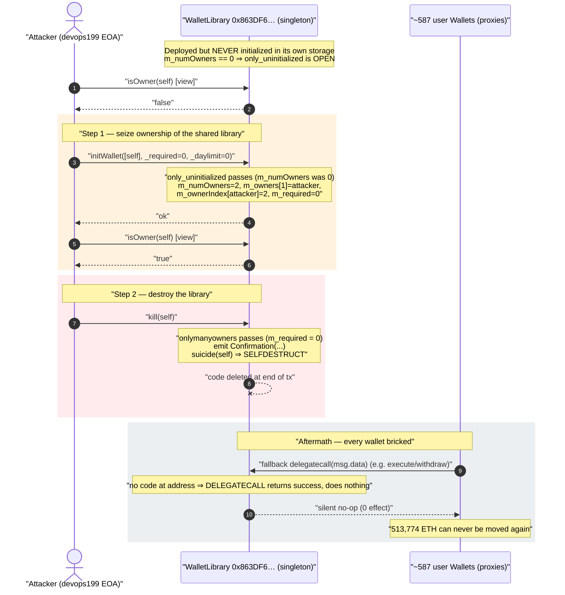
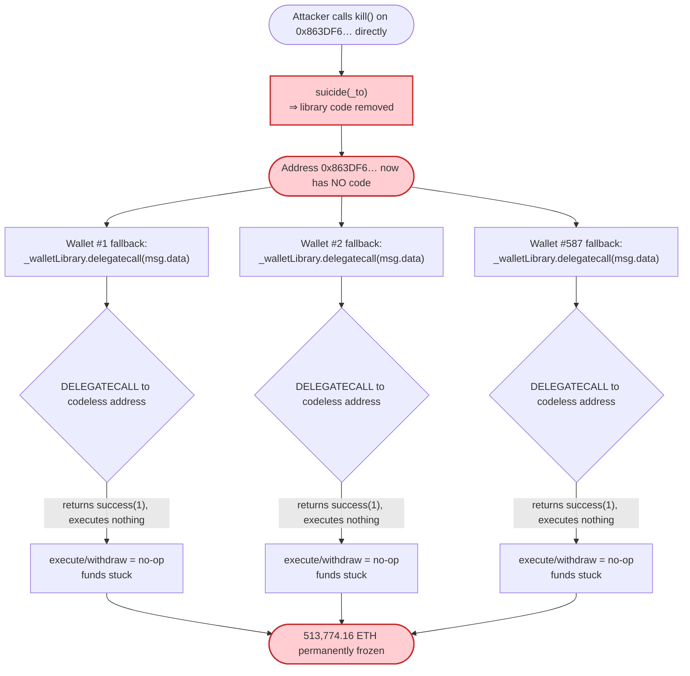
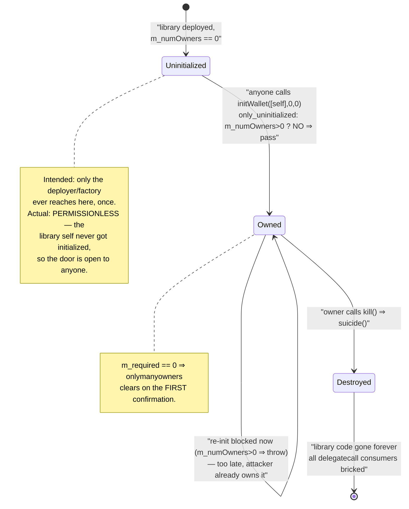

# Parity WalletLibrary `kill` — Uninitialized Shared Library Self-Destruct (the "devops199" freeze)

> **Reproduction:** the PoC compiles & runs in an isolated Foundry project at
> [this project folder](.) (the umbrella DeFiHackLabs repo
> contains many unrelated PoCs that do not whole-compile, so this one was extracted).
> Full verbose trace: [output.txt](output.txt).
> Verified vulnerable source: [WalletLibrary.sol](sources/WalletLibrary_863DF6/WalletLibrary.sol).

---

## Key info

| | |
|---|---|
| **Loss** | **513,774.16 ETH** permanently frozen across ~587 Parity multisig wallets (≈ **$150–300M** at the time; well over **$1B** at later prices). Not stolen — *bricked*. |
| **Vulnerable contract** | `WalletLibrary` — [`0x863DF6BFa4469f3ead0bE8f9F2AAE51c91A907b4`](https://etherscan.io/address/0x863DF6BFa4469f3ead0bE8f9F2AAE51c91A907b4#code) |
| **Victims** | Every Parity multisig `Wallet` deployed after the 2017-07 patch — they all `delegatecall` into this single shared library |
| **Attacker EOA** | `devops199` — `0xae7168deb525862f4fee37d987a971b385b96952` |
| **Attack txs** | `initWallet`: [`0x05f71e1b...`](https://etherscan.io/tx/0x05f71e1b2cb4f03e547739db15d080fd30c989eda04d37ce6264c5686e0722c9) → `kill`: [`0x47f7cff7...`](https://etherscan.io/tx/0x47f7cff7a5e671884629c93b368cb18f58a993f4b19c2a53a8662e3f1482f690) |
| **Chain / block / date** | Ethereum mainnet / 4,501,735 (PoC fork) / **2017-11-06** (incident block ≈ 4,501,969) |
| **Compiler** | Solidity **v0.4.10+commit.f0d539ae**, optimizer enabled (200 runs) — see [_meta.json](sources/WalletLibrary_863DF6/_meta.json) |
| **Bug class** | Uninitialized contract + missing initialization guard on a *shared* `delegatecall` library + un-gated `suicide`/`selfdestruct` |

---

## TL;DR

Parity's multisig wallets were thin proxies: each user's `Wallet` held only state and forwarded
every call via `delegatecall` into one **shared, singleton** `WalletLibrary` deployed at
`0x863DF6…907b4`. The library's owner-initialization function — `initWallet` →
`initMultiowned` — was guarded only by `only_uninitialized`, which checks `m_numOwners > 0`
([WalletLibrary.sol:215](sources/WalletLibrary_863DF6/WalletLibrary.sol#L215)).

The library contract itself was **never initialized in its own storage**, so its own
`m_numOwners` was `0`. Anyone could therefore call `initWallet` *directly on the library
contract* and become its sole owner. Once an owner, the attacker called `kill`, which is gated by
`onlymanyowners` and simply runs `suicide(_to)`
([WalletLibrary.sol:225-227](sources/WalletLibrary_863DF6/WalletLibrary.sol#L225-L227)).

`suicide` (now `selfdestruct`) deleted the library's code. From that moment, **every** Parity
multisig that `delegatecall`ed into `0x863DF6…` was calling into an address with no code — every
`isOwner`, `execute`, `confirm`, withdraw, etc. became a no-op/failure. The 513,774 ETH sitting in
those wallets could no longer be moved. The funds were not extracted; they were **permanently locked**.

The PoC reproduces the full two-step attack against the real on-chain library at fork block
4,501,735: `initWallet([attacker],0,0)` makes `address(this)` an owner, then `kill(address(this))`
self-destructs the library.

---

## Background — how Parity multisigs were wired

After a July 2017 hack of the *old* monolithic Parity multisig (the "first Parity hack",
153,037 ETH), Parity refactored to a **library/proxy** pattern to save deployment gas and shrink the
attack surface of each wallet:

```
 user's Wallet (one per user)            shared WalletLibrary (ONE copy on mainnet)
 ┌──────────────────────────┐            ┌──────────────────────────────────────┐
 │ storage: m_owners,        │  delegatecall │ code: initWallet, kill, execute,   │
 │          m_required, ...   │ ───────────▶ │       isOwner, confirmAndCheck...  │
 │ code: fallback →           │            │ storage: ITS OWN (separate) slots    │
 │   _walletLibrary.delegate  │            │   ← never initialized → m_numOwners=0│
 └──────────────────────────┘            └──────────────────────────────────────┘
```

The `Wallet` constructor `delegatecall`s `initWallet` so that *the wallet's* storage gets the
owners written ([WalletLibrary.sol:402-422](sources/WalletLibrary_863DF6/WalletLibrary.sol#L402-L422)).
Because `delegatecall` runs the library's code **in the caller's storage context**, this correctly
initialized each user wallet.

The fatal oversight: the library contract `0x863DF6…907b4` is *also* just a regular deployed
contract with its own storage, and **nobody ever called `initWallet` on it in its own context**.
A contract whose `initWallet` has never run keeps `m_numOwners == 0`, which is exactly the condition
`only_uninitialized` treats as "free to initialize."

---

## The vulnerable code

### 1. The initialization guard checks a storage slot that is zero on the library itself

```solidity
// throw unless the contract is not yet initialized.
modifier only_uninitialized { if (m_numOwners > 0) throw; _; }

function initWallet(address[] _owners, uint _required, uint _daylimit) only_uninitialized {
    initDaylimit(_daylimit);
    initMultiowned(_owners, _required);
}
```

[WalletLibrary.sol:215-222](sources/WalletLibrary_863DF6/WalletLibrary.sol#L215-L222)

```solidity
function initMultiowned(address[] _owners, uint _required) only_uninitialized {
    m_numOwners = _owners.length + 1;
    m_owners[1] = uint(msg.sender);          // ← caller becomes owner #1
    m_ownerIndex[uint(msg.sender)] = 1;
    for (uint i = 0; i < _owners.length; ++i) {
        m_owners[2 + i] = uint(_owners[i]);
        m_ownerIndex[uint(_owners[i])] = 2 + i;
    }
    m_required = _required;                   // ← attacker passes 0
}
```

[WalletLibrary.sol:107-117](sources/WalletLibrary_863DF6/WalletLibrary.sol#L107-L117)

`initWallet`/`initMultiowned` are **public, unprotected functions with no constructor and no
deployment-time initialization of the library's own storage**. There is no `internal` keyword, no
`onlyowner`, nothing — only the `m_numOwners > 0` self-check, which is `false` on the never-used
library.

### 2. `kill` is reachable by any owner and runs raw `suicide`

```solidity
// kills the contract sending everything to `_to`.
function kill(address _to) onlymanyowners(sha3(msg.data)) external {
    suicide(_to);
}
```

[WalletLibrary.sol:225-227](sources/WalletLibrary_863DF6/WalletLibrary.sol#L225-L227)

`onlymanyowners` only requires that `m_required` confirmations be gathered. The attacker set
`m_required = 0` during `initWallet`, so a single call clears the threshold immediately:

```solidity
function confirmAndCheck(bytes32 _operation) internal returns (bool) {
    uint ownerIndex = m_ownerIndex[uint(msg.sender)];
    if (ownerIndex == 0) return;             // attacker IS owner #1 ⇒ passes
    var pending = m_pending[_operation];
    if (pending.yetNeeded == 0) {
        pending.yetNeeded = m_required;      // = 0
        ...
    }
    uint ownerIndexBit = 2**ownerIndex;
    if (pending.ownersDone & ownerIndexBit == 0) {
        Confirmation(msg.sender, _operation);
        if (pending.yetNeeded <= 1) {        // 0 <= 1 ⇒ TRUE on first call
            ...
            return true;                     // ⇒ kill body runs
        }
        ...
    }
}
```

[WalletLibrary.sol:287-322](sources/WalletLibrary_863DF6/WalletLibrary.sol#L287-L322)

---

## Root cause — why it was possible

This is a composition of three independent design errors, each individually survivable, fatal in
combination:

1. **A shared, mutable library with public initializer and no self-initialization.**
   The single `WalletLibrary` instance was deployed but never had `initWallet` executed against its
   *own* storage. Its `m_numOwners` stayed `0`, so the `only_uninitialized` guard
   ([:215](sources/WalletLibrary_863DF6/WalletLibrary.sol#L215)) was permanently "open" — the guard
   was meant to prevent *re-initialization*, but a never-initialized contract is, by definition, in
   the initializable state. The initializer should have been `internal` (callable only via
   `delegatecall` from a wallet) or the library should have been self-initialized/locked at deploy time.

2. **`kill`/`suicide` was callable on the library at all.**
   A library that exists only to be `delegatecall`ed has no legitimate reason to expose a
   `suicide`. Even gated behind ownership, leaving a live `selfdestruct` on the singleton meant a
   single compromised owner could delete code that *hundreds of unrelated contracts depend on*.
   `delegatecall` provides no protection here: the attacker initialized and then `kill`ed the library
   **in the library's own context** (calling the library address directly, not through any wallet).

3. **`delegatecall` to a non-existent address silently no-ops.**
   In the EVM, a `CALL`/`DELEGATECALL` to an address with no code returns *success* (`1`) and does
   nothing. After `suicide` removed the library's bytecode, every Parity wallet's fallback
   `_walletLibrary.delegatecall(msg.data)`
   ([:432](sources/WalletLibrary_863DF6/WalletLibrary.sol#L432)) succeeded-as-no-op: `isOwner`
   returned garbage/false, `execute` did nothing, and no funds could ever leave. The wallets weren't
   broken loudly; they were silently turned into one-way deposit boxes.

The attacker (`devops199`) later stated this was accidental — they were "experimenting" and called
`kill` not realizing it would brick every wallet. Whether accidental or not, the contract permitted
it: **the bug is that a permissionless caller could take ownership of shared infrastructure and
destroy it.**

> Critically, note what `initMultiowned` does *not* do: there is no check that `_owners` is
> non-empty, no check that `_required > 0`, and no check that the *deployer*/factory is the caller.
> The attacker simply passed `_owners = [self]`, `_required = 0`, `_daylimit = 0`.

---

## Preconditions

- The `WalletLibrary` instance has **never been initialized in its own storage** (`m_numOwners == 0`).
  This was true on mainnet because the library was only ever `delegatecall`ed by wallets — never
  initialized directly. The PoC confirms this at fork block 4,501,735: the first `isOwner(attacker)`
  returns `false` and `initWallet` succeeds (the `only_uninitialized` guard does not throw).
- The attacker is an ordinary EOA; **no special role, capital, or flash loan is required.** Gas only.
- `kill` requires `m_required` confirmations, but the attacker sets `m_required = 0` during
  `initWallet`, so one call suffices.

---

## Step-by-step attack walkthrough (with ground-truth values from the trace)

All storage-slot and return values below are taken directly from
[output.txt](output.txt).

| # | Call | Args | Effect (from trace) |
|---|------|------|---------------------|
| 0 | `isOwner(attacker)` [staticcall] | `0x7FA9…1496` (PoC `address(this)`) | `← false` — attacker is *not* yet an owner |
| 1 | `initWallet(owners, _required, _daylimit)` | `owners=[0x7FA9…1496]`, `_required=0`, `_daylimit=0` | Library accepted it (guard open). Storage writes: `@1 (m_numOwners) 0→2`; `@6,@7 (m_owners[1],m_owners[2]) 0→0x…7FA9…1496`; `@4 (m_lastDay) 0→17476`; `@0x1135…f535 (m_ownerIndex[attacker]) 0→2` |
| 2 | `isOwner(attacker)` [staticcall] | `0x7FA9…1496` | `← true` — **attacker is now an owner of the shared library** |
| 3 | `assertTrue(isowner)` | — | passes |
| 4 | `kill(attacker)` | `_to = 0x7FA9…1496` | `onlymanyowners` passes (m_required=0). Emits `Confirmation(owner, operation=0x0e6751db…6a7c)`; storage `@263 (m_pending index) 0→1`; ends in **`← [SelfDestruct]`** — the library deletes its own code |
| 5 | `isOwner(attacker)` [staticcall] | `0x7FA9…1496` | `← true` — selfdestruct's code-removal is deferred to end of tx, so the in-tx read still hits live code; *after the tx*, the address has no code and every call is a silent no-op |

> **In-tx vs. post-tx:** within the same transaction, `SELFDESTRUCT` schedules code deletion for the
> *end* of the transaction, which is why step 5's `isOwner` still returns `true`. On mainnet the
> `kill` was in its **own** transaction (`0x47f7cff7…`), so when the *next* wallet tried to
> `delegatecall` the library, the code was already gone. The PoC's final `isOwner` documents the
> deferred-deletion semantics; the brick takes effect across transaction boundaries.

The attacker's two real mainnet transactions:
1. `initWallet` — [`0x05f71e1b2cb4f03e547739db15d080fd30c989eda04d37ce6264c5686e0722c9`](https://etherscan.io/tx/0x05f71e1b2cb4f03e547739db15d080fd30c989eda04d37ce6264c5686e0722c9) — became owner of `0x863DF6…`.
2. `kill` — [`0x47f7cff7a5e671884629c93b368cb18f58a993f4b19c2a53a8662e3f1482f690`](https://etherscan.io/tx/0x47f7cff7a5e671884629c93b368cb18f58a993f4b19c2a53a8662e3f1482f690) — `suicide`d the library.

---

## Profit / loss accounting

This was a **griefing / destruction** event, not a theft. No ETH moved to the attacker.

| Item | Amount |
|---|---:|
| ETH the attacker gained | **0** |
| ETH the attacker spent | gas for 2 txs (≈ negligible) |
| ETH permanently frozen across ~587 multisig wallets | **513,774.16 ETH** |
| Notable single victim | Polkadot/Web3 Foundation presale multisig: **306,276 ETH** frozen |
| USD value (Nov 2017, ETH ≈ $300) | ≈ **$150M** (and over **$1B** at later prices) |

The funds remain irrecoverable to this day absent a hard-fork-level state change (EIP-999, proposing
to restore the library's code, was never adopted).

---

## Diagrams

### Sequence of the attack



### Why one `suicide` froze hundreds of wallets



### The guard logic that failed (state view of `initWallet`)



---

## Remediation

1. **Self-initialize and lock shared libraries at deploy time.** The singleton `WalletLibrary`
   should have had its own `initWallet` invoked (or a constructor that set `m_numOwners`/a
   `initialized` latch) at deployment, so `only_uninitialized` would correctly reject any later
   public `initWallet`. The OpenZeppelin `Initializable` pattern (`_disableInitializers()` in the
   implementation's constructor) exists precisely to close this hole.
2. **Make initializers `internal`/non-callable on the library.** An init routine meant to run only
   via `delegatecall` from a wallet should not be a public entry point on the library address. Mark
   it `internal`, or guard it on `address(this) != <library address>` / a deployer check.
3. **Never expose `selfdestruct` on shared infrastructure.** A library `delegatecall`ed by many
   contracts must not contain a reachable `suicide`/`selfdestruct`. If destruction is needed, it
   belongs only in the per-user proxy acting on the proxy's own (isolated) state, never on the shared
   code.
4. **Defend against codeless `delegatecall`.** Proxies should verify the implementation has code
   (`extcodesize(target) > 0`) before delegating, and revert otherwise — turning a silent brick into
   a loud, recoverable failure (and surfacing the problem immediately).
5. **Treat un-gated state-mutating + destructive functions as critical by default.** Any function
   that (a) writes ownership/authorization state or (b) destroys the contract must have explicit,
   audited access control that does not depend on a storage slot that can legitimately be zero.

---

## How to reproduce

The PoC was extracted into a standalone Foundry project (the umbrella DeFiHackLabs repo has many
unrelated PoCs that fail to compile under a single `forge build`):

```bash
_shared/run_poc.sh 2017-11-Parity_kill_exp -vvvvv
```

- RPC: an **Ethereum mainnet archive** endpoint is required (the fork block 4,501,735 is from
  November 2017; pruned nodes will fail with `header not found` / `missing trie node`). The test
  uses the `mainnet` alias from `foundry.toml`.
- Result: `[PASS] testExploit()`. The trace shows `initWallet` flipping `isOwner` from `false` →
  `true`, followed by `kill` ending in `← [SelfDestruct]`.

Expected tail:

```
Ran 1 test for test/Parity_kill_exp.sol:ContractTest
[PASS] testExploit() (gas: 216749)
...
  [60402] WalletLibrary::kill(ContractTest: [0x7FA9385bE102ac3EAc297483Dd6233D62b3e1496])
    ├─ emit Confirmation(owner: ..., operation: 0x0e6751db...6a7c)
    └─ ← [SelfDestruct]
Suite result: ok. 1 passed; 0 failed; 0 skipped
```

---

*References: Parity Security Alert (2017-11-08); the second Parity multisig incident ("devops199").
SlowMist Hacked — https://hacked.slowmist.io/ (Parity Wallet, Ethereum, 513,774 ETH frozen).*
