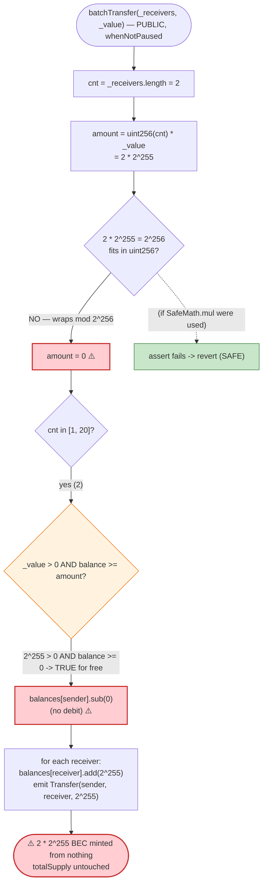
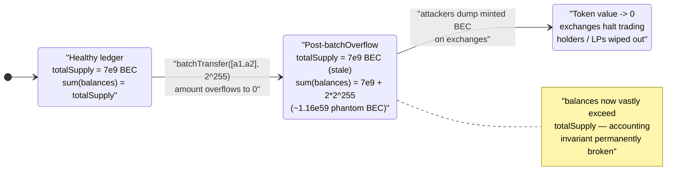

# BEC (BeautyChain) Exploit — `batchTransfer()` Integer-Overflow Infinite Mint (`batchOverflow`)

> **Vulnerability classes:** vuln/arithmetic/overflow · vuln/logic/missing-check

> **Reproduction:** the PoC compiles & runs in an isolated Foundry project at
> [this project folder](.) (the umbrella DeFiHackLabs repo
> contains many unrelated PoCs that do not whole-compile, so this one was extracted).
> Full verbose trace: [output.txt](output.txt).
> Verified vulnerable source: [BecToken.sol](sources/BecToken_C5d105/BecToken.sol).

---

## Key info

| | |
|---|---|
| **Loss** | Token economically destroyed — `2 × 2^255 ≈ 1.16 × 10^59` BEC minted from thin air (each attacker received `5.79 × 10^58` BEC, ~`8.27 × 10^48`× the entire 7,000,000,000-token legit supply). Exchanges halted BEC trading; market cap (~$70M+ at the time) collapsed to zero. |
| **Vulnerable contract** | `BecToken` (BeautyChain, BEC) — [`0xC5d105E63711398aF9bbff092d4B6769C82F793D`](https://etherscan.io/address/0xC5d105E63711398aF9bbff092d4B6769C82F793D#code) |
| **Victim** | Every BEC holder / liquidity provider on every exchange listing BEC |
| **Attacker EOA / tx sender** | `0xb4D30Cac5124b46C2Df0CF3e3e1Be05f42119033` (the original on-chain attacker; the two receivers below were credited the minted tokens) |
| **Minted-token recipients** | `0xb4D30Cac5124b46C2Df0CF3e3e1Be05f42119033` and `0x0e823fFE018727585EaF5Bc769Fa80472F76C3d7` |
| **Attack tx** | [`0xad89ff16fd1ebe3a0a7cf4ed282302c06626c1af33221ebe0d3a470aba4a660f`](https://etherscan.io/tx/0xad89ff16fd1ebe3a0a7cf4ed282302c06626c1af33221ebe0d3a470aba4a660f) |
| **Chain / block / date** | Ethereum mainnet / fork block **5,483,642** / **April 22, 2018** |
| **Compiler** | Source pragma `^0.4.16`; verified deploy **v0.4.19+commit.c4cbbb05**, optimizer **off** (PoC re-compiles the harness under Solc 0.8.34, but exercises the deployed bytecode via fork) |
| **Bug class** | Unchecked integer **multiplication overflow** (`cnt * _value`) — pre-0.8 arithmetic, missing `SafeMath.mul`, the canonical *batchOverflow* (CVE-2018-10299) |

---

## TL;DR

`BecToken.batchTransfer()` computes the total amount to debit as a plain multiplication:

```solidity
uint256 amount = uint256(cnt) * _value;     // ← NO SafeMath, can overflow
require(_value > 0 && balances[msg.sender] >= amount);
balances[msg.sender] = balances[msg.sender].sub(amount);
```

The author wrapped every *other* arithmetic operation in `SafeMath` (`.sub`, `.add`) but wrote
`cnt * _value` as a **bare `*`** ([BecToken.sol:257](sources/BecToken_C5d105/BecToken.sol#L257)).
On Solidity 0.4.x there are no automatic overflow checks, so an attacker chooses inputs that make the
product wrap around `2^256` to **zero**:

- `cnt = 2` (two receivers)
- `_value = type(uint256).max / 2 + 1 = 2^255`
- `amount = 2 × 2^255 = 2^256 ≡ 0 (mod 2^256)`

Now the balance check `balances[msg.sender] >= amount` becomes `balances[msg.sender] >= 0` — **always
true** even with a zero balance — and the debit `balances[msg.sender].sub(0)` removes nothing. The loop
then **credits each of the two receivers a full `_value = 2^255 ≈ 5.79 × 10^58` BEC**, conjured out of
nothing. The PoC confirms both attacker accounts go from `0` to
`57,896,044,618,658,097,711,785,492,504,343,953,926,634,992,332,820,282,019,728.792…` BEC.

That is roughly `8.27 × 10^48` times the entire legitimate 7-billion-token supply — to *each* receiver.
BEC became worthless within hours; major exchanges suspended deposits/withdrawals and the token never
recovered.

---

## Background — what BEC was

BeautyChain (BEC) was an ERC-20 token launched in early 2018, briefly one of the larger-cap tokens
on OKEx. The token contract ([BecToken.sol](sources/BecToken_C5d105/BecToken.sol)) is a textbook
OpenZeppelin-style stack of that era:

- `SafeMath` library ([:7-31](sources/BecToken_C5d105/BecToken.sol#L7-L31)) with `mul/div/sub/add`.
- `BasicToken` / `StandardToken` ([:49-147](sources/BecToken_C5d105/BecToken.sol#L49-L147)) — normal
  ERC-20 transfer/approve/transferFrom, each using `SafeMath`.
- `Pausable` ([:195-233](sources/BecToken_C5d105/BecToken.sol#L195-L233)) — owner-controlled emergency
  stop.
- `PausableToken` ([:241-268](sources/BecToken_C5d105/BecToken.sol#L241-L268)) — the standard methods
  plus a **convenience extension `batchTransfer()`** to airdrop the same `_value` to up to 20 receivers
  in one call. This non-standard helper is where the bug lives.
- `BecToken` ([:275-299](sources/BecToken_C5d105/BecToken.sol#L275-L299)) — names the token
  (`"BeautyChain"`, `BEC`, 18 decimals) and mints `7,000,000,000 × 10^18` BEC to the deployer.

Relevant on-chain facts at the fork block:

| Parameter | Value |
|---|---|
| `name` / `symbol` / `decimals` | BeautyChain / BEC / 18 |
| `totalSupply` | `7,000,000,000 × 10^18` BEC |
| `paused` | `false` (so `whenNotPaused` is satisfied) |
| Attacker BEC balance before | **0** (no balance required — that's the whole point) |

`totalSupply` is a public `uint256` set once in the constructor and **never updated by `batchTransfer`**
— so even the protocol's own accounting becomes incoherent after the attack (balances vastly exceed
`totalSupply`).

---

## The vulnerable code

`batchTransfer` ([BecToken.sol:255-267](sources/BecToken_C5d105/BecToken.sol#L255-L267)):

```solidity
function batchTransfer(address[] _receivers, uint256 _value) public whenNotPaused returns (bool) {
    uint cnt = _receivers.length;
    uint256 amount = uint256(cnt) * _value;            // ⚠️ BARE * — no SafeMath.mul, can overflow
    require(cnt > 0 && cnt <= 20);
    require(_value > 0 && balances[msg.sender] >= amount);  // ⚠️ if amount wraps to 0, this passes for free

    balances[msg.sender] = balances[msg.sender].sub(amount); // .sub(0) → no debit
    for (uint i = 0; i < cnt; i++) {
        balances[_receivers[i]] = balances[_receivers[i]].add(_value); // each gets full _value
        Transfer(msg.sender, _receivers[i], _value);
    }
    return true;
}
```

Note the asymmetry: `.sub` and `.add` are `SafeMath` calls (line 261, 263), but the **product on
line 257 is a plain `*`**. `SafeMath.mul` ([:8-12](sources/BecToken_C5d105/BecToken.sol#L8-L12)) exists
in the same file and would have thrown (`assert(a == 0 || c / a == b)`) — it simply was not used here.

The `require(_value > 0 …)` ([:259](sources/BecToken_C5d105/BecToken.sol#L259)) only checks `_value`,
not `amount`, so a huge `_value` whose *product* wraps to zero sails through.

---

## Root cause — why it was possible

Pre-0.8 Solidity performs **modular (wrapping) arithmetic** with no implicit overflow trap. The defense
of that era was to route every operation through `SafeMath`. BEC did so consistently — except for the
single multiplication that computes the batch total.

The exploit chain is purely arithmetic:

1. Attacker calls `batchTransfer([r1, r2], 2^255)`. `cnt = 2`.
2. `amount = 2 * 2^255`. In `uint256`, `2 * 2^255 = 2^256`, which reduces **mod `2^256` to `0`**.
3. `require(cnt > 0 && cnt <= 20)` → `2` passes.
4. `require(_value > 0 && balances[msg.sender] >= amount)` → `2^255 > 0` ✓ and `0 >= 0` ✓ — passes
   **regardless of the sender's balance**.
5. `balances[msg.sender].sub(0)` → sender loses nothing.
6. The loop credits each receiver `balances[r_i].add(2^255)` — minting `2^255` BEC to each, twice, for a
   total of `2^256` newly-minted BEC, while `totalSupply` is untouched.

There is **no access control** needed (anyone can call `batchTransfer`), **no capital** needed (the
sender starts with 0), and the only state gate, `whenNotPaused`, was satisfied. The bug is a single
missing `SafeMath.mul` and a balance check that validates the wrong (already-overflowed) quantity.

---

## Preconditions

- `paused == false` (the `whenNotPaused` modifier on `batchTransfer`). True at the time of the attack.
- `2 ≤ cnt ≤ 20` — the attacker uses `cnt = 2`, the minimum count whose product with `2^255` wraps to 0.
- A `_value` such that `cnt * _value ≡ 0 (mod 2^256)`. For `cnt = 2`, `_value = 2^255` works exactly
  (`type(uint256).max / 2 + 1`). The PoC uses precisely this value
  ([BEC_exp.sol:35](test/BEC_exp.sol#L35)).
- **No** balance, **no** allowance, **no** privileged role required. The sender begins with `0` BEC.

---

## Step-by-step attack walkthrough (with on-chain numbers from the trace)

All figures below are taken directly from the `Transfer` events and `balanceOf` returns in
[output.txt](output.txt).

The single attack call is `batchTransfer([attacker1, attacker2], 2^255)` where
`2^255 = 57896044618658097711785492504343953926634992332820282019728792003956564819968`.

| # | Step | Computation | Result |
|---|------|-------------|--------|
| 0 | **Initial** — read attacker balances | `balanceOf(attacker1) = balanceOf(attacker2) = 0` | Both attackers hold **0 BEC** |
| 1 | `cnt = _receivers.length` | `2` | passes `cnt > 0 && cnt <= 20` |
| 2 | `amount = cnt * _value` | `2 × 2^255 = 2^256 ≡ 0 (mod 2^256)` | **`amount = 0`** (overflow) |
| 3 | `require(_value > 0 && balances[msg.sender] >= amount)` | `2^255 > 0` ✓, `0 >= 0` ✓ | **check passes for free** |
| 4 | `balances[msg.sender] = balances[msg.sender].sub(amount)` | `.sub(0)` | sender debited **nothing** |
| 5 | loop i=0: `balances[attacker1].add(_value)` + `Transfer(sender→attacker1, 2^255)` | `0 + 2^255` | attacker1 credited **2^255 BEC** |
| 6 | loop i=1: `balances[attacker2].add(_value)` + `Transfer(sender→attacker2, 2^255)` | `0 + 2^255` | attacker2 credited **2^255 BEC** |
| 7 | **Final** — read attacker balances | `balanceOf(attacker1) = balanceOf(attacker2) = 2^255` | Each holds `5.79 × 10^58` BEC |

The trace shows exactly this: two `Transfer` events each carrying value
`57896044618658097711785492504343953926634992332820282019728792003956564819968`
(`5.789e76` wei = `5.789e58` whole BEC), zero storage change for the sender's balance slot, and both
recipient slots flipped from `0` to `0x8000…0000` (`= 2^255`).

The two storage writes confirm the mint (and confirm `cnt = 2`):

```
storage changes:
  @ 0x3be1…9486: 0 → 0x8000000000000000000000000000000000000000000000000000000000000000   (attacker1 balance = 2^255)
  @ 0x619a…183f: 0 → 0x8000000000000000000000000000000000000000000000000000000000000000   (attacker2 balance = 2^255)
```

`0x8000…0000` is `2^255`, matching `type(uint256).max / 2 + 1`.

### Profit / loss accounting

| Quantity | Value |
|---|---:|
| BEC held by each attacker **before** | 0 |
| BEC minted to attacker1 | `2^255` ≈ `5.79 × 10^58` |
| BEC minted to attacker2 | `2^255` ≈ `5.79 × 10^58` |
| **Total newly minted** | `2^256` ≈ `1.16 × 10^59` |
| Legitimate total supply (`7e9 × 10^18`) | `7 × 10^27` |
| Minted / legitimate supply ratio | ~`1.65 × 10^31`× total (each attacker alone holds ~`8.27 × 10^48`× the legit supply) |
| Sender's balance debited | **0** (the wrap defeated the debit) |

The "profit" is not denominated in another asset as in an AMM drain — the attacker materialized more
BEC than could ever be backed, then dumped it on exchanges before trading was halted. The economic loss
is the **destruction of the entire token's value**: any holder's BEC, and any quote-asset liquidity
paired against BEC on exchanges, became unredeemable.

---

## Diagrams

### Sequence of the attack

```mermaid
sequenceDiagram
    autonumber
    actor A as "Attacker (0 BEC)"
    participant T as "BecToken"
    participant S as "balances mapping"

    Note over A,T: tradingEnabled n/a — only gate is whenNotPaused (paused = false)

    A->>T: "batchTransfer([attacker1, attacker2], 2^255)"
    activate T
    T->>T: "cnt = 2"
    T->>T: "amount = 2 * 2^255 = 2^256 -> wraps to 0"
    T->>T: "require(cnt in [1,20]) -> OK (cnt = 2)"
    T->>T: "require(_value > 0 && balance >= amount) -> 0 >= 0 OK"
    T->>S: "balances[sender] = balances[sender].sub(0)  (no debit)"
    loop "for each of 2 receivers"
        T->>S: "balances[receiver] = balances[receiver].add(2^255)"
        T-->>A: "emit Transfer(sender -> receiver, 2^255)"
    end
    deactivate T

    Note over S: "attacker1 = 2^255, attacker2 = 2^255 (minted from nothing)"
    Note over A: "Both balances = 5.79e58 BEC; totalSupply unchanged -> accounting broken"
```

### Where the overflow defeats the guard



### Token-supply state: legitimate vs. post-attack



---

## Why these magic numbers

- **`cnt = 2`** — the smallest receiver count that, multiplied by an attacker-chosen `_value`, can wrap
  to zero. With two receivers the required `_value` is exactly `2^256 / 2 = 2^255`, a clean half of the
  word, and it stays within `cnt <= 20`.
- **`_value = type(uint256).max / 2 + 1 = 2^255`** — chosen so the product `cnt * _value = 2 * 2^255`
  equals `2^256`, the exact overflow point that reduces to `0`. Any pair `(cnt, _value)` with
  `cnt * _value ≡ 0 (mod 2^256)` works; `(2, 2^255)` is the canonical minimal choice.
- **No starting balance** — the overflow turns the `balances[msg.sender] >= amount` check into
  `>= 0`, so the attack needs no BEC and no capital at all.

---

## Remediation

1. **Use checked multiplication.** Replace `uint256 amount = uint256(cnt) * _value;` with
   `uint256 amount = SafeMath.mul(cnt, _value);` (the library is already in the file). On Solidity ≥ 0.8
   the bare `*` already reverts on overflow, which is why this exact bug class largely disappeared after
   the 0.8 migration.
2. **Validate the actual debit, not a pre-overflowed quantity.** Even with the multiplication fixed, the
   invariant to assert is `balances[msg.sender] >= cnt * _value` computed safely; never let an arithmetic
   result that *can* wrap feed a `require` that gates fund movement.
3. **Maintain supply coherence.** `batchTransfer` debits the sender and credits receivers but `totalSupply`
   is never touched; a fixed version is fine because the sum is conserved, but contracts should assert
   `sum(balances) == totalSupply` in invariant tests so a minting bug like this is caught immediately.
4. **Audit every non-standard ERC-20 extension.** The standard `transfer`/`transferFrom` were correctly
   `SafeMath`-guarded; the bug lived only in the bolted-on `batchTransfer` helper. Custom convenience
   functions deserve the same scrutiny — and ideally fuzzing/overflow checks — as the core methods.
5. **Prefer audited libraries / modern compilers.** Compiling under Solidity ≥ 0.8 (with explicit
   `unchecked` blocks only where intentional) makes this entire class of overflow mint impossible by
   default.

---

## How to reproduce

The PoC was extracted into a standalone Foundry project (the umbrella DeFiHackLabs repo has many
unrelated PoCs that fail to compile under a whole-project `forge build`):

```bash
_shared/run_poc.sh 2018-04-BEC_exp -vvvvv
```

- RPC: forks **Ethereum mainnet at block 5,483,642** (`foundry.toml` `mainnet` endpoint). The deployed
  BEC bytecode at `0xC5d105…F793D` is exercised directly, so any mainnet endpoint serving state at that
  block works.
- Result: `[PASS] testExploit()` — both attacker balances jump from `0` to `2^255` BEC.

Expected tail:

```
Ran 1 test for test/BEC_exp.sol:ContractTest
[PASS] testExploit() (gas: 84028)
Logs:
  Before Exploit, Attacker1 BEC Balance: 0.000000000000000000
  Before Exploit, Attacker2 BEC Balance: 0.000000000000000000
  After Exploit, Attacker1 BEC Balance: 57896044618658097711785492504343953926634992332820282019728.792003956564819968
  After Exploit, Attacker2 BEC Balance: 57896044618658097711785492504343953926634992332820282019728.792003956564819968

Suite result: ok. 1 passed; 0 failed; 0 skipped; finished in 2.73s (1.13s CPU time)
```

---

*Reference: the original "batchOverflow" (CVE-2018-10299), April 22, 2018. Attack tx
`0xad89ff16fd1ebe3a0a7cf4ed282302c06626c1af33221ebe0d3a470aba4a660f`. PeckShield disclosure; SlowMist
Hacked archive — https://hacked.slowmist.io/ (BEC / BeautyChain, Ethereum).*
