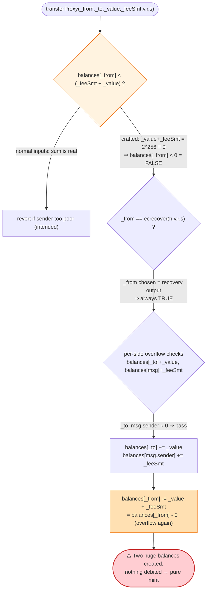
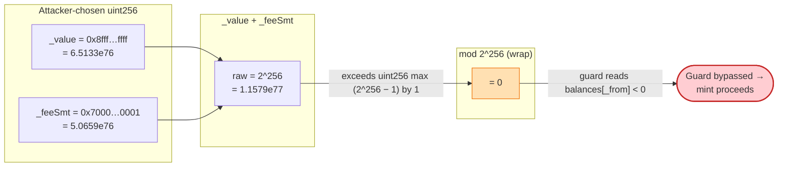

# SmartMesh (SMT) Exploit — `transferProxy` Integer-Overflow Mint (`proxyOverflow` / CVE-2018-10376)

> **Reproduction:** the PoC compiles & runs in an isolated Foundry project at
> [this project folder](.) (the umbrella DeFiHackLabs repo contains many unrelated PoCs
> that do not whole-compile, so this one was extracted).
> Full verbose trace: [output.txt](output.txt).
> Verified vulnerable source (Etherscan-fetched): [SMT.sol](sources/SMT_55f939/SMT.sol).

---

## Key info

| | |
|---|---|
| **Loss** | The bug **minted ~5.07 × 10⁵⁸ SMT out of thin air** (`50,659,039,041,325,835,497,812,305,941,300,959,685,805,618,291,217,746,767,262.69` SMT) — an unbounded amount that destroyed SMT's value. Headline figure quoted historically: **~$140M** market cap wiped. |
| **Vulnerable contract** | `SMT` (SmartMesh Token) — [`0x55F93985431Fc9304077687a35A1BA103dC1e081`](https://etherscan.io/address/0x55f93985431fc9304077687a35a1ba103dc1e081#code) |
| **Victim** | Every SMT holder / exchange — the supply was diluted into meaninglessness | 
| **Attacker EOA** | [`0xd6a09bdb29e1eafa92a30373c44b09e2e2e0651e`](https://etherscan.io/address/0xd6a09bdb29e1eafa92a30373c44b09e2e2e0651e) |
| **Signing key used in PoC** | `_from = _to = 0xDF31A499A5A8358b74564f1e2214B31bB34Eb46F` (the address recovered from the forged signature) |
| **Attack tx** | [`0x1abab4c8db9a30e703114528e31dee129a3a758f7f8abc3b6494aad3d304e43f`](https://etherscan.io/tx/0x1abab4c8db9a30e703114528e31dee129a3a758f7f8abc3b6494aad3d304e43f) |
| **Chain / block / date** | Ethereum mainnet / fork block **5,499,034** / **April 2018** |
| **Compiler** | Solidity **v0.4.18** (`+commit.9cf6e910`), optimizer **off**, `runs 200` (per [`_meta.json`](sources/SMT_55f939/_meta.json)) |
| **Bug class** | Unchecked integer **overflow** in a guard expression (pre-0.8 arithmetic, no SafeMath) → unauthorized mint |

---

## TL;DR

`SMT.transferProxy()` lets a relayer broadcast a signed transfer on behalf of a token holder and
collect a fee. Its very first sanity check is:

```solidity
if (balances[_from] < _feeSmt + _value) revert();   // SMT.sol:206
```

Both `_feeSmt` and `_value` are attacker-controlled `uint256`. By choosing
`_value = 0x8fff…ffff` and `_feeSmt = 0x7000…0001` so that **`_value + _feeSmt == 2²⁵⁶`**, the sum
**wraps to 0**. The guard then reads `balances[_from] < 0`, which is impossible, so the check passes
even though `_from` holds nothing. The function proceeds to:

- credit `_to` with the colossal `_value`,
- credit the relayer (`msg.sender`) with the colossal `_feeSmt`,
- and "debit" `_from` by `_value + _feeSmt`, which *also* overflows back to **0**, so `_from`'s balance
  never goes negative and never underflows.

Net effect: **two gigantic balances are created from nothing and no balance is reduced** — a pure
mint. In the reproduced transaction the relayer walks away with `_feeSmt ≈ 5.07 × 10⁵⁸ SMT`, starting
from a balance of **0**.

There is one extra twist that made the attack *trivial to relay*: the signature verifier
(`ecrecover`) is only used to derive `_from`. The attacker simply picks **whatever address `ecrecover`
happens to return** for their pre-chosen `(_v, _r, _s)` and uses that as `_from`. Since the overflow
makes `_from`'s real balance irrelevant, the "signer" never needs to own any tokens or even exist as a
funded account.

---

## Background — what `transferProxy` is for

SMT is a vanilla 2017-era ERC-20 (`StandardToken`) with a **meta-transaction / gasless-relay** feature
bolted on. The idea (documented in the source comment at [SMT.sol:192-202](sources/SMT_55f939/SMT.sol#L192-L202)):

> *"When some users of the ethereum account has no ether, he or she can authorize the agent for
> broadcast transactions, and agents may charge agency fees."*

So a token holder signs `keccak256(_from, _to, _value, _feeSmt, nonce)` off-chain, hands the signature
to a relayer, and the relayer calls `transferProxy`. The contract:

1. checks the holder can cover `value + fee`,
2. verifies the signature recovers to `_from`,
3. moves `_value` to `_to`, pays `_feeSmt` to the relayer (`msg.sender`), and debits `_from`.

This is a perfectly reasonable pattern — except every arithmetic step is **unchecked** (Solidity 0.4.x
has no built-in overflow protection and the contract imports **no SafeMath**). The single most
security-critical line, the balance guard, adds two attacker-supplied 256-bit numbers *before*
comparing — and that addition can overflow.

---

## The vulnerable code

From [`sources/SMT_55f939/SMT.sol`](sources/SMT_55f939/SMT.sol), the relevant function in full:

```solidity
// SMT.sol:203
function transferProxy(address _from, address _to, uint256 _value, uint256 _feeSmt,
    uint8 _v, bytes32 _r, bytes32 _s) public transferAllowed(_from) returns (bool){

    if(balances[_from] < _feeSmt + _value) revert();            // L206 ⚠️ overflow in the guard

    uint256 nonce = nonces[_from];
    bytes32 h = keccak256(_from,_to,_value,_feeSmt,nonce);
    if(_from != ecrecover(h,_v,_r,_s)) revert();                // L210 ⚠️ _from is *defined by* the signature

    if(balances[_to] + _value < balances[_to]                   // L212 per-side overflow checks…
        || balances[msg.sender] + _feeSmt < balances[msg.sender]) revert();
    balances[_to] += _value;                                    // L214 huge credit to _to
    Transfer(_from, _to, _value);

    balances[msg.sender] += _feeSmt;                            // L217 huge credit to relayer
    Transfer(_from, msg.sender, _feeSmt);

    balances[_from] -= _value + _feeSmt;                        // L220 ⚠️ _value+_feeSmt overflows to 0 → no debit
    nonces[_from] = nonce + 1;
    return true;
}
```

Three lines conspire:

- **[L206](sources/SMT_55f939/SMT.sol#L206)** — `_feeSmt + _value` is computed in `uint256`. The
  attacker chooses the two addends to sum to `2²⁵⁶`, which wraps to `0`. `balances[_from] < 0` is
  always false ⇒ the guard is bypassed.
- **[L212](sources/SMT_55f939/SMT.sol#L212)** — these *per-side* checks (`balances[_to] + _value <
  balances[_to]`) only catch an overflow on each individual credit. With `_to` and `msg.sender`
  starting near `0`, adding a single huge `_value`/`_feeSmt` does **not** overflow either side
  individually, so both checks pass.
- **[L220](sources/SMT_55f939/SMT.sol#L220)** — the debit recomputes `_value + _feeSmt`, which again
  overflows to `0`, so `balances[_from] -= 0`. The sender loses nothing; the protocol just printed
  tokens.

### The signature check is not a real authorization

[L209-L210](sources/SMT_55f939/SMT.sol#L209-L210) computes
`h = keccak256(_from,_to,_value,_feeSmt,nonce)` and requires `_from == ecrecover(h,_v,_r,_s)`.
Because `_from` is itself a **function argument**, the attacker does not need a private key for any
victim. They pick arbitrary `(_v, _r, _s)`, let `ecrecover` deterministically spit out *some* address,
and pass that exact address as `_from`. The check `_from == ecrecover(...)` then trivially holds. In
the trace, `ecrecover(...) → 0xDF31A499A5A8358b74564f1e2214B31bB34Eb46F`, and the PoC uses that very
address as `_from`/`_to`. The overflow makes `_from`'s real (zero) balance irrelevant, so this
"self-recovered" address needs no funds at all.

---

## Root cause — why it was possible

> **Adding two unbounded, attacker-controlled `uint256` values inside a security guard, in an
> environment with wrapping arithmetic and no SafeMath.**

The guard at L206 was *intended* to mean "the sender must own at least `value + fee`." In wrapping
arithmetic, `value + fee` is not the mathematical sum — it is `(value + fee) mod 2²⁵⁶`. The attacker
selects `value` and `fee` so that this modular sum is `0`, turning a "must have enough" check into a
"must have less than zero" check that no balance can fail.

Compounding factors:

1. **No SafeMath / pre-0.8 compiler.** Solidity 0.4.18 silently wraps on overflow. A `SafeMath.add`
   in the guard (and in the debit) would have reverted on the wrap.
2. **The same overflowing expression is reused for the debit (L220),** so the supposed cost to the
   sender also vanishes. There is no net conservation of supply — the function is an unguarded mint.
3. **`ecrecover` is mis-used as authorization.** Because `_from` is supplied by the caller and merely
   compared to the recovery result, the signature proves nothing about ownership; it is satisfiable by
   construction. Even without the overflow this is fragile, and the overflow removes the only thing
   (`balances[_from]`) that gated the amount.
4. **`totalSupply` is never updated** by `transferProxy`, so the minted tokens are "invisible" to the
   supply accounting — balances exceed `totalSupply` by an astronomical margin, breaking every
   downstream assumption (exchanges, explorers, AMMs).

This is the canonical **`proxyOverflow`** bug (catalogued as **CVE-2018-10376**), which hit SMT and a
sister contract (BeautyChain / BEC, the `batchOverflow` variant) in April 2018 and forced major
exchanges to halt all ERC-20 deposits.

---

## Preconditions

- `transferEnabled == true` **or** `_from` is on the `exclude` list. The `transferAllowed(_from)`
  modifier ([SMT.sol:116-125](sources/SMT_55f939/SMT.sol#L116-L125)) asserts `transferEnabled` for
  non-excluded addresses. SMT had transfers live by April 2018, so this was satisfied on-chain. (In the
  forked PoC the call passes, confirming the gate was open at block 5,499,034.)
- The attacker can choose any `(_value, _feeSmt)` whose **sum equals `2²⁵⁶`** (i.e. wraps to 0). The
  PoC uses `_value = 0x8fff…ffff`, `_feeSmt = 0x7000…0001`.
- A `(_v, _r, _s)` triple is required only so that `ecrecover` returns a deterministic address; that
  returned address is then reused as `_from`/`_to`. No victim key, no victim balance, **no capital, and
  no flash loan** are needed.

That is the entire setup. The exploit is a **single call** to `transferProxy` with crafted integers.

---

## Step-by-step attack walkthrough (ground truth from the trace)

The pair `_value + _feeSmt = 2²⁵⁶` is the engine. All figures below are taken directly from
[output.txt](output.txt). `WAD = 10¹⁸` (SMT has 18 decimals).

| # | Step (in `testExploit`) | Value (raw `uint256`) | What the contract does | Result |
|---|---|---:|---|---|
| 0 | Read attacker balance | `0` | `SMT.balanceOf(SmartMesh test contract)` | `0` SMT ([output.txt:18-22](output.txt)) |
| 1 | Call `transferProxy(_from, _to, _value, _feeSmt, v, r, s)` with `_from = _to = 0xDF31…B46F` | — | enter function | — |
| 2 | Guard `balances[_from] < _feeSmt + _value` | `_value + _feeSmt = 2²⁵⁶ ≡ 0` | `0 < 0` is **false** ⇒ no revert | **bypassed** |
| 3 | `ecrecover(h, 27, r, s)` | — | returns `0xDF31…B46F` ([output.txt:24-25](output.txt)) | `_from == ecrecover` ⇒ check passes |
| 4 | Credit `_to` | `_value = 65,133,050,195,990,359,925,758,679,067,386,948,167,464,366,374,422,817,272,194,891,004,451,135,422,463` (`0x8fff…ffff`) | `balances[_to] += _value` ([SMT.sol:214](sources/SMT_55f939/SMT.sol#L214)) | `Transfer(_from→_to, _value)` ([output.txt:26](output.txt)) |
| 5 | Pay relayer `msg.sender` | `_feeSmt = 50,659,039,041,325,835,497,812,305,941,300,959,685,805,618,291,217,746,767,262,693,003,461,994,217,473` (`0x7000…0001`) | `balances[msg.sender] += _feeSmt` ([SMT.sol:217](sources/SMT_55f939/SMT.sol#L217)) | `Transfer(_from→SmartMesh, _feeSmt)` ([output.txt:27](output.txt)) |
| 6 | "Debit" `_from` | `_value + _feeSmt ≡ 0` | `balances[_from] -= 0` ([SMT.sol:220](sources/SMT_55f939/SMT.sol#L220)) | `_from` balance **unchanged** (no underflow) |
| 7 | Bump nonce | — | `nonces[_from] = nonce + 1` | returns `true` ([output.txt:32](output.txt)) |
| 8 | Read attacker balance again | — | `SMT.balanceOf(SmartMesh)` | **`_feeSmt`** = `5.065903904132583e+58` SMT ([output.txt:35-39](output.txt)) |

Two things make this airtight in the trace:

- The two `Transfer` events (lines 26-27) emit **exactly `_value` and `_feeSmt`** — the values the
  attacker chose — confirming both giant credits landed.
- The storage diff at [output.txt:28-31](output.txt) shows only **nonce** and **the two credited
  balance slots** changing; no slot is *decreased*. The mint is conservation-free.

Because the PoC sets `_to == _from`, the `_value` credit (step 4) is parked on `0xDF31…B46F`, while the
relayer credit `_feeSmt` (step 5) lands on the test contract — which is why the logged "After exploit
SMT Balance" equals `_feeSmt`, not `_value + _feeSmt`. Either credit alone is already an unbounded mint;
a real attacker would simply set `msg.sender`/`_to` to addresses they control.

### Profit / loss accounting

| Quantity | Value |
|---|---:|
| Attacker SMT **before** | `0` |
| Attacker SMT **after** (relayer credit `_feeSmt`) | `5.0659 × 10⁵⁸ SMT` |
| Additional SMT credited to `_to` (`_value`) | `6.5133 × 10⁵⁸ SMT` |
| `_value + _feeSmt` (total conjured) | **`2²⁵⁶` exactly** = `1.1579 × 10⁷⁷` base units |
| Cost to attacker | gas only (no capital, no flash loan, no victim key) |
| Cost to `_from` | **0** (debit overflowed to 0) |
| Loss to ecosystem | SMT supply rendered meaningless; historical headline **~$140M** market cap, exchanges froze ERC-20 deposits |

`2²⁵⁶` is **one greater than `uint256` max** (`2²⁵⁶ − 1`), which is precisely why the sum wraps to `0` —
the smallest possible overflow, chosen deliberately.

---

## Diagrams

### Sequence of the attack

```mermaid
sequenceDiagram
    autonumber
    actor A as "Attacker (relayer = msg.sender)"
    participant S as "SMT token (0x55F9…e081)"
    participant E as "ecrecover precompile"

    Note over A: Pick (_v,_r,_s); let _from = ecrecover output<br/>Pick _value=0x8fff…ffff, _feeSmt=0x7000…0001<br/>so that _value + _feeSmt = 2^256 (wraps to 0)

    A->>S: "transferProxy(_from, _to, _value, _feeSmt, v, r, s)"
    Note over S: "Guard: balances[_from] < _feeSmt + _value<br/>= balances[_from] < 0  ⇒ FALSE (bypassed)"
    S->>E: "ecrecover(keccak256(_from,_to,_value,_feeSmt,nonce), v, r, s)"
    E-->>S: "0xDF31…B46F  (== _from)  ⇒ sig check passes"
    Note over S: "balances[_to]      += _value      (6.51e58 SMT)<br/>balances[msg.sender] += _feeSmt    (5.07e58 SMT)<br/>balances[_from]    -= _value+_feeSmt = 0  (no debit)"
    S-->>A: "return true"
    Note over A: "Relayer balance: 0 → 5.07e58 SMT<br/>Minted from nothing"
```

### The flaw inside `transferProxy`



### Why the addends sum to zero (modular arithmetic)



---

## Remediation

1. **Use checked arithmetic / SafeMath everywhere.** The root fix is to compute `_feeSmt + _value` (and
   the debit) with overflow protection:
   ```solidity
   // pre-0.8: use SafeMath
   uint256 total = _feeSmt.add(_value);     // reverts on overflow
   require(balances[_from] >= total);
   ...
   balances[_from] = balances[_from].sub(total);
   ```
   On Solidity ≥ 0.8 the `+` and `-` revert on overflow/underflow automatically, which alone closes the
   bug. (SMT was compiled with 0.4.18, where this protection did not exist.)
2. **Compare without adding when possible.** Avoid summing two unbounded values inside a guard. E.g.
   `require(balances[_from] >= _value && balances[_from] - _value >= _feeSmt);` cannot overflow.
3. **Fix the authorization model.** Do not let the caller supply `_from` and then merely compare it to
   `ecrecover`. Derive the signer *from* the signature (`signer = ecrecover(...)`) and treat that as
   `_from`, and bind the signed hash to this contract (chainId + contract address, à la EIP-712) to
   prevent cross-contract/cross-chain replay.
4. **Maintain supply invariants.** A transfer path must conserve total balances: `Δbalances` should sum
   to zero. An assertion or formal invariant (`sum(balances) == totalSupply`) would have made this mint
   impossible to ship unnoticed.
5. **Defense in depth.** Cap per-call `_value`/`_feeSmt`, and reject `_value == 0`/degenerate inputs.
   None of these are substitutes for (1), but they shrink the blast radius.

---

## How to reproduce

The PoC was extracted into a standalone Foundry project (the umbrella DeFiHackLabs repo has many
unrelated PoCs that fail to compile under a whole-project `forge build`):

```bash
_shared/run_poc.sh 2018-04-SmartMesh_exp --mt testExploit -vvvvv
```

- RPC: an **Ethereum mainnet archive** endpoint is required (fork block **5,499,034**, April 2018);
  most pruned public RPCs will fail to serve historical state at that block.
- The test (`test/SmartMesh_exp.sol`) makes a single `transferProxy` call with the crafted integers and
  logs the relayer's SMT balance before and after.

Expected tail (from [output.txt](output.txt)):

```
Ran 1 test for test/SmartMesh_exp.sol:SmartMesh
[PASS] testExploit() (gas: 118064)
Logs:
  Attacker Before exploit SMT Balance: 0.000000000000000000
  Attacker After exploit SMT Balance: 50659039041325835497812305941300959685805618291217746767262.693003461994217473

Suite result: ok. 1 passed; 0 failed; 0 skipped
```

The "After" balance equals `_feeSmt` (the relayer credit) — an unbounded mint from a zero starting
balance, with no capital and no victim key.

---

*Bug class: `proxyOverflow` / CVE-2018-10376 (sibling of BeautyChain/BEC `batchOverflow`,
CVE-2018-10299). April 2018, Ethereum mainnet.*
