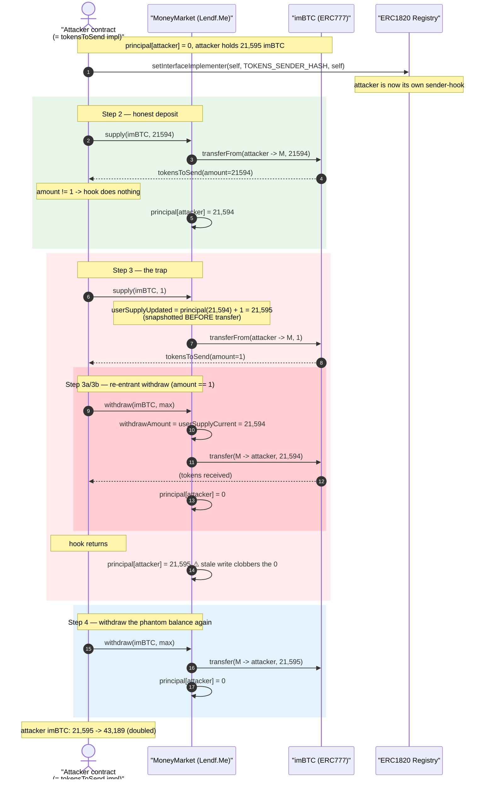
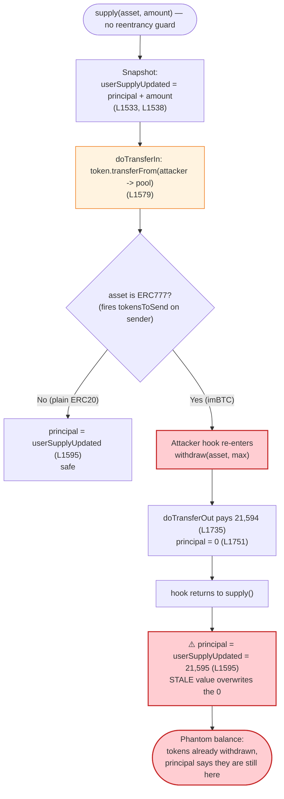
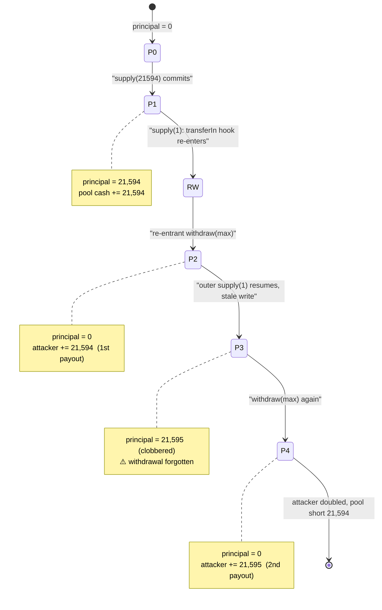

# Lendf.Me Exploit — ERC777 Re-Entrancy on a Checks-Effects-Interactions Violation in `supply()`/`withdraw()`

> **Reproduction:** the PoC compiles & runs in an isolated Foundry project at
> [this project folder](.) (the umbrella DeFiHackLabs repo contains many unrelated PoCs
> that do not whole-compile, so this one was extracted).
> Full verbose trace: [output.txt](output.txt).
> Verified vulnerable source: [MoneyMarket.sol](sources/MoneyMarket_0eEe3E/MoneyMarket.sol) ·
> ERC777 token: [IMBTC.sol](sources/IMBTC_3212b2/IMBTC.sol).

---

## Key info

| | |
|---|---|
| **Loss (real incident)** | **~$25,000,000** — virtually the entire Lendf.Me protocol (all supported assets) drained April 19, 2020. The on-chain PoC here reproduces the *mechanism* with a tiny 21,594-unit imBTC dust amount (the attacker's own balance) to prove fund doubling. |
| **Vulnerable contract** | `MoneyMarket` (Lendf.Me, a dForce fork of Compound v1) — [`0x0eEe3E3828A45f7601D5F54bF49bB01d1A9dF5ea`](https://etherscan.io/address/0x0eEe3E3828A45f7601D5F54bF49bB01d1A9dF5ea#code) |
| **Re-entrancy vehicle** | imBTC (The Tokenized Bitcoin, an **ERC777** token, 8 decimals) — [`0x3212b29E33587A00FB1C83346f5dBFA69A458923`](https://etherscan.io/address/0x3212b29E33587A00FB1C83346f5dBFA69A458923#code) |
| **ERC1820 registry** | `0x1820a4B7618BdE71Dce8cdc73aAB6C95905faD24` (used to register the attacker's `tokensToSend` hook) |
| **Attacker EOA** | `0xA9BF70A420d364e923C74448D9D817d3F2A77822` |
| **Real-incident example tx** | [`0xae7d664bdfcc54220df4f18d339005c6faf6e62c9ca79c56387bc0389274363b`](https://etherscan.io/tx/0xae7d664bdfcc54220df4f18d339005c6faf6e62c9ca79c56387bc0389274363b) |
| **Chain / fork block / date** | Ethereum mainnet / **9,899,725** / April 19, 2020 |
| **Compiler** | `MoneyMarket`: Solidity **v0.4.24** (optimizer, 200 runs); imBTC: v0.5.0; PoC harness: 0.8.10 |
| **Bug class** | Cross-function re-entrancy (CEI violation) via ERC777 sender callback (`tokensToSend`) |

---

## TL;DR

Lendf.Me's `MoneyMarket` (a fork of Compound v1) records each supplier's balance in
`supplyBalances[user][asset].principal`. Both `supply()` and `withdraw()` perform the **external token
transfer before they write that balance to storage** — a textbook checks-effects-interactions (CEI)
violation ([`supply` transfers at L1579, writes principal at L1595](sources/MoneyMarket_0eEe3E/MoneyMarket.sol#L1579);
[`withdraw` transfers at L1735, writes principal at L1751](sources/MoneyMarket_0eEe3E/MoneyMarket.sol#L1735)).

For a normal ERC20 this is harmless — `transfer`/`transferFrom` is a leaf call. But **imBTC is an
ERC777 token**, and ERC777 invokes the *sender's* `tokensToSend` hook **before** moving balances
([`IMBTC.sol:862`](sources/IMBTC_3212b2/IMBTC.sol#L862)). By registering itself as its own
`tokensToSend` implementer through the ERC1820 registry, the attacker gets a callback in the middle of
Lendf.Me's `supply()` — at a moment when its own `supplyBalances` entry is still **stale** (not yet
updated for the in-progress supply). From inside that hook the attacker calls `withdraw(max)`, pulling
out a balance it has not actually deposited yet, then lets the outer `supply()` finish — which
**overwrites** `principal` with a stale (too-large) value, erasing the record of the re-entrant
withdrawal.

The net effect is that the attacker's `supplyBalances.principal` is double-counted: they withdraw the
same supplied amount twice. In the PoC the attacker turns **21,595 imBTC units into 43,189** (an exact
≈2× — minus rounding), draining the protocol's cash. In the live incident the attacker repeated this
across every market and walked off with the entire ~$25M TVL.

---

## Background — what Lendf.Me / MoneyMarket does

`MoneyMarket` is dForce's Lendf.Me lending pool, a near-verbatim fork of **Compound v1**. Suppliers
deposit assets via `supply(asset, amount)` and are credited a `principal` balance; they later redeem via
`withdraw(asset, amount)`. The protocol tracks per-user balances in:

```solidity
struct Balance { uint principal; uint interestIndex; }
mapping(address => mapping(address => Balance)) public supplyBalances; // MoneyMarket.sol:700
```

Token movement is wrapped in two helpers that the protocol assumes are "leaf" calls:

- [`doTransferIn(asset, from, amount)`](sources/MoneyMarket_0eEe3E/MoneyMarket.sol#L396) → calls
  `token.transferFrom(from, this, amount)`.
- [`doTransferOut(asset, to, amount)`](sources/MoneyMarket_0eEe3E/MoneyMarket.sol#L451) → calls
  `token.transfer(to, amount)`.

Crucially, `withdraw()` enforces solvency by computing the user's `userSupplyCurrent` from
`supplyBalance.principal` *at entry* and refusing to release more than that
([L1654, L1682](sources/MoneyMarket_0eEe3E/MoneyMarket.sol#L1654)). So the only way to over-withdraw is
to make `principal` lie — which is exactly what the re-entrant overwrite achieves.

### Why imBTC is special — ERC777 sender hook

imBTC ("The Tokenized Bitcoin") is not a plain ERC20; it is an **ERC777** token. ERC777 transfers
notify the *sender* via a `tokensToSend` callback **before** balances change:

```solidity
function _transferFrom(address holder, address recipient, uint256 amount) internal returns (bool) {
    ...
    _callTokensToSend(spender, holder, recipient, amount, "", "");   // IMBTC.sol:862  ← hook fires FIRST
    _move(spender, holder, recipient, amount, "", "");               // IMBTC.sol:864  ← balances move AFTER
    _approve(holder, spender, _allowances[holder][spender].sub(amount));
    _callTokensReceived(spender, holder, recipient, amount, "", "", false);
    return true;
}
```

`_callTokensToSend` looks up the holder's hook implementer in the ERC1820 registry and, if one is
registered, calls it. The attacker registers **itself** as the implementer for its own address
([PoC L54](test/LendfMe_exp.sol#L54)), so during Lendf.Me's `doTransferIn` (a `transferFrom` with the
attacker as `holder`/sender), control returns to the attacker's `tokensToSend` — mid-`supply()`.

---

## The vulnerable code

### `supply()` — transfer in BEFORE state write

```solidity
function supply(address asset, uint amount) public returns (uint) {
    ...
    // userSupplyUpdated is computed from the user's CURRENT principal, up front:
    (err, localResults.userSupplyCurrent) = calculateBalance(balance.principal, balance.interestIndex, localResults.newSupplyIndex); // L1533
    (err, localResults.userSupplyUpdated) = add(localResults.userSupplyCurrent, amount);                                            // L1538

    /////////////////////////
    // EFFECTS & INTERACTIONS
    // (No safe failures beyond this point)

    err = doTransferIn(asset, msg.sender, amount);   // ⚠️ L1579 — ERC777 hook re-enters HERE
    ...
    // Save user updates  — runs AFTER the external call:
    balance.principal      = localResults.userSupplyUpdated;   // ⚠️ L1595 — overwrites with a STALE value
    balance.interestIndex  = localResults.newSupplyIndex;      //    L1596
    ...
}
```

[MoneyMarket.sol:1504-1601](sources/MoneyMarket_0eEe3E/MoneyMarket.sol#L1504-L1601)

`userSupplyUpdated` is snapshotted from `balance.principal` at L1533/L1538 **before** `doTransferIn`.
If the attacker re-enters during the transfer and zeroes their `principal` (via `withdraw`), L1595 still
writes back the *pre-snapshot* value `userSupplyCurrent + amount`, silently restoring the principal the
re-entrant `withdraw` just consumed.

### `withdraw()` — transfer out BEFORE state write

```solidity
function withdraw(address asset, uint requestedAmount) public returns (uint) {
    ...
    (err, localResults.userSupplyCurrent) = calculateBalance(supplyBalance.principal, ...);  // L1654 reads principal
    // withdrawAmount capped at userSupplyCurrent (L1665 / L1682) — cannot exceed CURRENT principal
    ...
    /////////////////////////
    // EFFECTS & INTERACTIONS
    err = doTransferOut(asset, msg.sender, localResults.withdrawAmount);   // ⚠️ L1735 — sends tokens out FIRST
    ...
    supplyBalance.principal = localResults.userSupplyUpdated;              // ⚠️ L1751 — state write AFTER
}
```

[MoneyMarket.sol:1630-1757](sources/MoneyMarket_0eEe3E/MoneyMarket.sol#L1630-L1757)

Both functions place the only state mutation that protects accounting **after** the external call. There
is **no re-entrancy guard** anywhere in `MoneyMarket` — Compound v1 (and this fork) relied on the
assumption that ERC20 transfers are non-reentrant. imBTC breaks that assumption.

---

## Root cause — why it was possible

The bug is the composition of three facts:

1. **CEI violation.** `supply()` and `withdraw()` both compute the new `principal` from the value read at
   function entry, then perform the token transfer, then commit `principal`. The "interactions" step sits
   *between* the read and the write of the security-critical state. A re-entrant call that runs during the
   transfer sees the **old** `principal` and can act on it, and its own state changes are then clobbered by
   the outer frame's stale write.

2. **ERC777 turns a transfer into a re-entrancy point.** Because imBTC fires `tokensToSend` on the sender
   *before* moving balances ([IMBTC.sol:862](sources/IMBTC_3212b2/IMBTC.sol#L862)), `doTransferIn` /
   `doTransferOut` are no longer leaf calls — they hand control to attacker code while the lending pool is
   in a half-updated state.

3. **Attacker-controlled hook via ERC1820.** Any account can register an arbitrary `tokensToSend`
   implementer for itself in the global ERC1820 registry. The attacker registers its own contract
   ([PoC L54](test/LendfMe_exp.sol#L54)), guaranteeing it receives the callback.

> **The killer line is L1595 in `supply()`:** `balance.principal = localResults.userSupplyUpdated;`.
> `userSupplyUpdated` was frozen *before* the transfer-in callback ran. The re-entrant `withdraw` inside
> that callback set `principal = 0` and paid out the tokens — but this line restores `principal` to its
> pre-withdraw value, so the protocol believes the attacker still has a full balance it has already taken
> out. The attacker then withdraws it a second time.

This is the canonical "ERC777 + Compound-style CEI" bug; it is the same class that hit Uniswap V1's
imBTC pool in the *same week*.

---

## Preconditions

- The lending market must support an ERC777 asset that invokes a sender hook on transfer (imBTC). Lendf.Me
  had whitelisted imBTC as a supported market.
- No re-entrancy guard on `supply`/`withdraw` (none exists in this MoneyMarket fork).
- The attacker registers itself as its own `tokensToSend` implementer in ERC1820
  ([PoC L54](test/LendfMe_exp.sol#L54)).
- The attacker needs only a *seed* amount of the ERC777 asset (here 21,595 imBTC units of its own) plus
  enough protocol cash to redeem against. No flash loan is required — the doubling is intrinsic to the
  accounting bug. In the live incident the attacker iterated to scale the seed up and drain all markets.

---

## Step-by-step attack walkthrough (with ground-truth values from the trace)

The PoC drives the attack from a helper contract (`LendfMeExploit`) that *is* the registered
`tokensToSend` implementer. All numbers below are read directly from
[output.txt](output.txt); the security-critical slot is
`supplyBalances[attacker][imBTC].principal` =
`0xfecfd3b695cab06e789b541836c6501d818a5bb52531086cc2ac3bddbd420d91`.

| # | Action (call) | Trace ref | `principal` slot | Attacker imBTC | Victim (pool) imBTC | Notes |
|---|---------------|-----------|-----------------:|---------------:|--------------------:|-------|
| 0 | **Initial** (after EOA→exploit transfer of 21,595) | [L96-L111](output.txt) | 0 | 21,595 | 29,134,710,218 | exploit holds the whole seed |
| 1 | `setInterfaceImplementer(self, TOKENS_SENDER_HASH, self)` registers the ERC777 sender hook | [L87-L91](output.txt) | 0 | 21,595 | 29,134,710,218 | arms the re-entrancy |
| 2 | `supply(imBTC, 21594)` → `doTransferIn` moves 21,594 in, then writes principal | [L114-L158](output.txt) | **0 → 21,594** | 1 | 29,134,731,812 | normal deposit; pool cash +21,594 |
| 3 | `supply(imBTC, 1)` begins; `doTransferIn` does `transferFrom(attacker→pool, 1)`, firing the sender hook | [L159-L181](output.txt) | 21,594 | 1 → 0 | — | hook entered with stale principal = 21,594 |
| 3a | …inside the hook (`amount == 1`): re-entrant **`withdraw(imBTC, max)`** | [PoC L43-L45](test/LendfMe_exp.sol#L43); trace [L182](output.txt) | — | — | — | withdraws full current principal |
| 3b | re-entrant `withdraw` `doTransferOut`s 21,594 to attacker, then zeroes principal | [L206](output.txt), [L221](output.txt) | **21,594 → 0** | +21,594 | 29,134,710,218 | attacker reclaims its deposit early |
| 3c | hook returns; outer `supply(1)` resumes and commits its **stale** `userSupplyUpdated` | [L236](output.txt) | **0 → 21,595** | — | — | ⚠️ principal restored to 21,595 (21,594 + 1) — the re-entrant withdrawal is forgotten |
| 4 | outer call: **`withdraw(imBTC, max)`** withdraws the phantom 21,595 again | [L240-L277](output.txt) | **21,595 → 0** | +21,595 | 29,134,688,624 | second payout against the same deposit |
| 5 | exploit transfers all imBTC back to the attacker EOA | [L280-L292](output.txt) | 0 | — | — | settle |
| 6 | **Final** | [L294-L299](output.txt) | 0 | **43,189** | 29,134,688,624 | attacker doubled; pool lost 21,594 |

**The doubling, precisely:** the attacker deposited 21,594 + 1 = 21,595 units total (steps 2 + 3),
yet received 21,594 (step 3b) + 21,595 (step 4) = **43,189** back. The protocol's cash fell by the
re-entrant 21,594 units it paid out without ever decrementing the attacker's recorded balance.

---

## Profit / loss accounting (imBTC, 8 decimals)

| Flow | Amount (imBTC units) |
|---|---:|
| Attacker deposits — `supply(21594)` | −21,594 |
| Attacker deposits — `supply(1)` | −1 |
| Re-entrant `withdraw` payout (step 3b) | +21,594 |
| Outer `withdraw(max)` payout (step 4) | +21,595 |
| **Net to attacker** | **+21,594** |

- Attacker balance: **21,595 → 43,189** (≈ ×2). Net gain **+21,594 units** (= 0.00021594 imBTC in the PoC scope).
- Victim/pool imBTC balance: **29,134,710,218 → 29,134,688,624** = **−21,594 units**, exactly the attacker's gain.
- In the live April 2020 incident the attacker repeated this loop with progressively larger seeds across
  every Lendf.Me market, draining ~**$25M** of total value locked (imBTC, WETH, USDT, USDC, DAI, HBTC,
  HUSD, BUSD, PAX, TUSD, etc.). The funds were later returned by the hacker.

> The PoC deliberately uses a dust seed to *demonstrate the doubling invariant cheaply*. The exploit's
> profit is unbounded by design: it scales linearly with the seed, and the seed can itself be sourced from
> the protocol's own liquidity by chaining iterations.

---

## Diagrams

### Sequence — re-entrancy inside `supply(1)`



### The CEI flaw inside `supply()` / `withdraw()`



### Phantom-balance state machine (the `principal` slot)



---

## Remediation

1. **Restore checks-effects-interactions order.** Update `supplyBalances[...].principal` and
   `market.totalSupply` **before** calling `doTransferIn` / `doTransferOut`. In `supply()`, move the L1585-1596
   state writes above L1579; in `withdraw()`, move L1741-1752 above L1735. Then a re-entrant call sees the
   already-decremented balance and cannot double-count.
2. **Add a global re-entrancy guard.** A `nonReentrant` mutex on every state-mutating entry point
   (`supply`, `withdraw`, `borrow`, `repayBorrow`, `liquidate`) defeats this regardless of token semantics.
   This is the minimal, surgical fix and is what dForce ultimately added.
3. **Treat ERC777 (and any callback-bearing token) as hostile.** Do not whitelist tokens that invoke
   sender/recipient hooks unless every interaction is guard-protected and CEI-correct. ERC777's
   `tokensToSend`/`tokensReceived` callbacks turn ordinary transfers into re-entrancy surfaces.
4. **Snapshot-then-commit on the SAME side of the external call.** The deeper lesson: never read a
   security-critical state variable, perform an external call, and then write that variable using the
   pre-call snapshot. Either re-read after the call or (better) commit before it.
5. **Use balance deltas, not assumptions.** Computing `userSupplyUpdated` from a pre-transfer snapshot is
   fragile; measuring actual `getCash` deltas and reconciling them post-interaction would have surfaced the
   discrepancy.

---

## How to reproduce

The PoC was extracted into a standalone Foundry project (the umbrella DeFiHackLabs repo has many unrelated
PoCs that fail to whole-compile under `forge test`):

```bash
_shared/run_poc.sh 2020-04-LendfMe_exp --mt testExploit -vvvvv
```

- **RPC:** an Ethereum **archive** endpoint is required (fork block 9,899,725, April 2020). Most pruned
  public RPCs will fail with `header not found` / `missing trie node`.
- The harness registers itself as the imBTC `tokensToSend` implementer via the real mainnet ERC1820
  registry, then performs `supply(21594) → supply(1) [re-enters withdraw] → withdraw(max)`.

Expected tail:

```
Ran 1 test for test/LendfMe_exp.sol:LendfMeExploit
[PASS] testExploit() (gas: 629115)
Logs:
  [Before Attack]Victim imBTC Balance : : 29134710218
  [Before Attack]Attacker imBTC Balance : : 21595
  --------------------------------------------------------------
  [After Attack]Victim imBTC Balance : : 29134688624
  [After Attack]Attacker imBTC Balance : : 43189
```

The attacker's imBTC balance doubles (21,595 → 43,189) and the victim pool's balance falls by exactly the
gain (29,134,710,218 → 29,134,688,624, −21,594), confirming the re-entrant double-withdrawal.

---

*References: PeckShield — "Uniswap/Lendf.Me Hacks: Root Cause and Loss Analysis"
(https://peckshield.medium.com/uniswap-lendf-me-hacks-root-cause-and-loss-analysis-50f3263dcc09);
SlowMist Hacked (Lendf.Me, Ethereum, ~$25M, funds later returned).*
