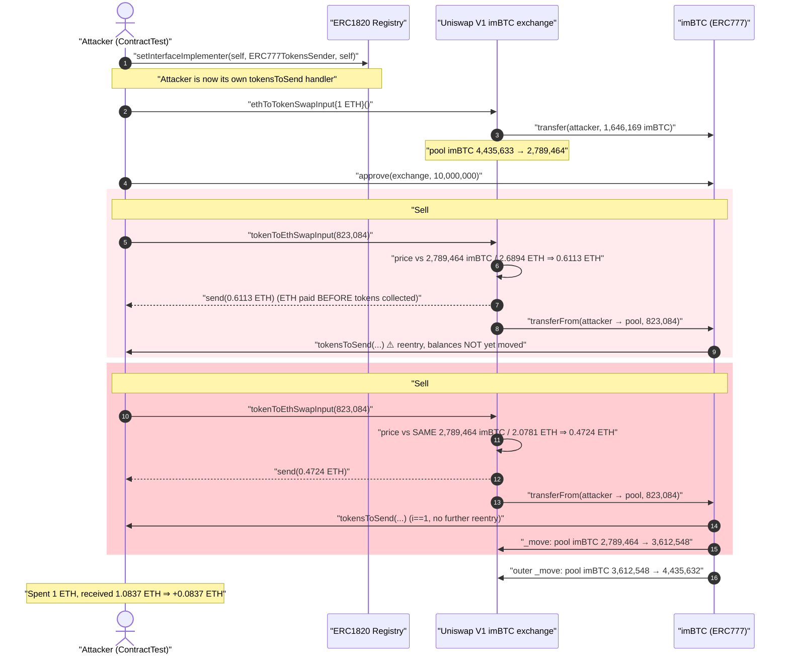
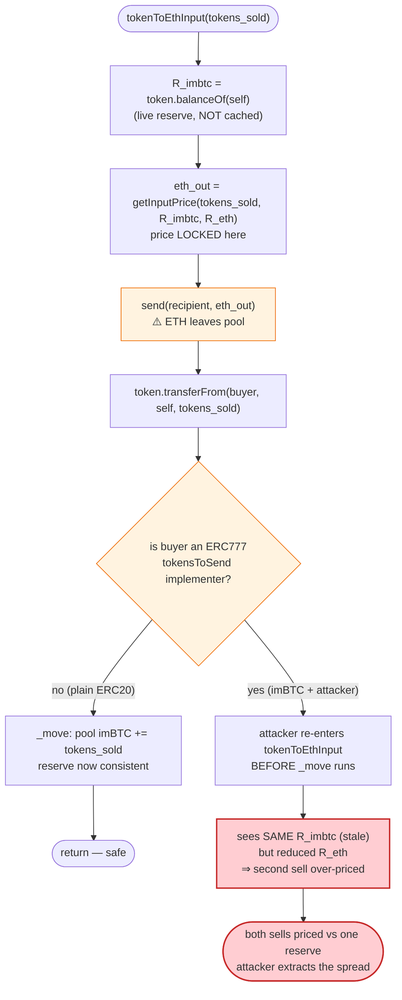
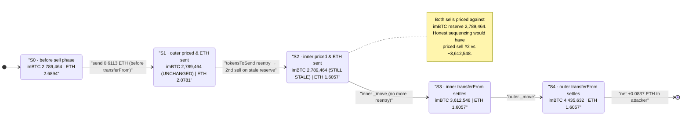

# Uniswap V1 × imBTC (ERC777) — Reentrancy Reserve-Pricing Drain

> One-line summary: imBTC is an ERC777 token; its `tokensToSend` hook lets a seller re-enter the Uniswap V1 imBTC exchange **mid-swap, before the pool's token reserve has been updated**, so two consecutive sells are both priced against the same stale reserve and the attacker walks off with the difference.

> **Reproduction:** the PoC compiles & runs in an isolated Foundry project at
> [this project folder](.) (the umbrella DeFiHackLabs repo contains many unrelated
> PoCs that do not whole-compile, so this one was extracted).
> Full verbose trace: [output.txt](output.txt).
> Verified vulnerable sources: [Uniswap V1 exchange (Vyper)](sources/Vyper_contract_FFcf45/Vyper_contract.sol) ·
> [imBTC ERC777 token](sources/IMBTC_3212b2/IMBTC.sol).

---

## Key info

| | |
|---|---|
| **Loss (this PoC tx)** | **+0.0837168576630010 ETH** profit from 1 ETH of working capital — the live April-2020 campaign drained ~**1,278 ETH (~$300K)** across many such loops |
| **Vulnerable contract** | Uniswap V1 imBTC exchange (Vyper) — [`0xFFcf45b540e6C9F094Ae656D2e34aD11cdfdb187`](https://etherscan.io/address/0xFFcf45b540e6C9F094Ae656D2e34aD11cdfdb187) |
| **Enabling token** | imBTC (ERC777) — [`0x3212b29E33587A00FB1C83346f5dBFA69A458923`](https://etherscan.io/address/0x3212b29E33587A00FB1C83346f5dBFA69A458923) |
| **Victim** | Liquidity providers of the imBTC Uniswap V1 pool |
| **ERC1820 registry** | [`0x1820a4B7618BdE71Dce8cdc73aAB6C95905faD24`](https://etherscan.io/address/0x1820a4B7618BdE71Dce8cdc73aAB6C95905faD24) |
| **Reference attack tx** | [`0x32c83905db61047834f29385ff8ce8cb6f3d24f97e24e6101d8301619efee96e`](https://etherscan.io/tx/0x32c83905db61047834f29385ff8ce8cb6f3d24f97e24e6101d8301619efee96e) |
| **Chain / block / date** | Ethereum mainnet / fork at **9,894,153** / **18 April 2020** |
| **Compiler** | exchange: `vyper:0.1.0b4` (optimizer 1 run); imBTC: `solc 0.5.0` |
| **Bug class** | Cross-contract reentrancy via ERC777 transfer hook + check-effects-interaction violation (state read/priced before reserve update) |

---

## TL;DR

The Uniswap V1 exchange prices a token→ETH sell by reading the pool's **current** token balance (`self.token.balanceOf(self)`) as the input reserve, paying out ETH, and only **afterwards** pulling the seller's tokens in via `transferFrom`
([Vyper_contract.sol:202-211](sources/Vyper_contract_FFcf45/Vyper_contract.sol#L202-L211)). That ordering — pay first, collect later — is the classic check-effects-interaction violation, and on its own it is "safe enough" only because a plain ERC20 `transferFrom` cannot call back into anyone.

imBTC is **not** a plain ERC20 — it is an **ERC777** token. Its `transferFrom` invokes the sender's `tokensToSend` hook ([IMBTC.sol:856-871](sources/IMBTC_3212b2/IMBTC.sol#L856-L871), [IMBTC.sol:1040-1054](sources/IMBTC_3212b2/IMBTC.sol#L1040-L1054)) **before** moving any balances. The attacker registers itself as its own `ERC777TokensSender` in the ERC1820 registry, so during the exchange's `transferFrom` the attacker regains control **after the first sell has already paid out ETH but before the pool's imBTC reserve has grown.**

Re-entering `tokenToEthSwapInput` at that moment, the second sell is priced against the **identical, stale `token_reserve`** that the first sell saw. Two 823,084-imBTC sells therefore both receive a "first sell" price; the attacker collects **1.0837 ETH** for tokens it had just bought for **1.0 ETH**, pocketing the spread.

---

## Background

### Uniswap V1 pricing

A V1 exchange is an ETH/token constant-product pool. For an exact-input sell it computes output from the live reserves with a 0.3% fee ([Vyper_contract.sol:104-111](sources/Vyper_contract_FFcf45/Vyper_contract.sol#L104-L111)):

```
input_amount_with_fee = input_amount * 997
output = (input_amount_with_fee * output_reserve) / (input_reserve * 1000 + input_amount_with_fee)
```

The token-side reserve is read **on the fly** as `self.token.balanceOf(self)` — the exchange does not cache its own reserve, it trusts the token's reported balance at the instant of the call.

### imBTC = ERC777

imBTC ([IMBTC.sol](sources/IMBTC_3212b2/IMBTC.sol)) is OpenZeppelin's ERC777 with ERC20 compatibility. ERC777 adds *transfer hooks*: before debiting a sender, the token asks the ERC1820 registry whether `from` has registered an `ERC777TokensSender` implementer, and if so calls `implementer.tokensToSend(...)` ([IMBTC.sol:1040-1054](sources/IMBTC_3212b2/IMBTC.sol#L1040-L1054)). Any contract can register itself for the hash `keccak256("ERC777TokensSender")` = `0x29ddb589…abe895` ([IMBTC.sol:622-623](sources/IMBTC_3212b2/IMBTC.sol#L622-L623)) and thereby get a synchronous callback in the middle of every transfer that debits it.

On-chain facts at fork block 9,894,153 (read directly from the trace):

| Quantity | Value |
|---|---|
| Pool imBTC reserve before the attack | **4,435,633** imBTC (8-dec) |
| Pool imBTC reserve at the start of the sell phase | **2,789,464** imBTC |
| Pool ETH reserve at the start of the sell phase | **2.6894341655996975** ETH |
| `TOKENS_SENDER_INTERFACE_HASH` | `0x29ddb589b1fb5fc7cf394961c1adf5f8c6454761adf795e67fe149f658abe895` |

---

## The vulnerable code

### 1. Sell path pays ETH *before* collecting tokens

[`tokenToEthInput`](sources/Vyper_contract_FFcf45/Vyper_contract.sol#L202-L211):

```python
@private
def tokenToEthInput(tokens_sold, min_eth, deadline, buyer, recipient) -> uint256(wei):
    assert deadline >= block.timestamp and (tokens_sold > 0 and min_eth > 0)
    token_reserve: uint256 = self.token.balanceOf(self)                       # ← reserve read (CHECK)
    eth_bought: uint256 = self.getInputPrice(tokens_sold, token_reserve,
                                             as_unitless_number(self.balance)) # ← price locked in
    wei_bought: uint256(wei) = as_wei_value(eth_bought, 'wei')
    assert wei_bought >= min_eth
    send(recipient, wei_bought)                                               # ⚠️ EFFECT/INTERACTION #1: ETH paid out
    assert self.token.transferFrom(buyer, self, tokens_sold)                  # ⚠️ INTERACTION #2: pulls tokens — reentrant!
    log.EthPurchase(buyer, tokens_sold, wei_bought)
    return wei_bought
```

Two problems compound here:

1. **`token_reserve` is read from `balanceOf` and never re-validated.** Nothing updates a cached reserve; the pool's idea of "how much imBTC do I hold" only changes when `transferFrom` finally lands.
2. **`send()` runs before `transferFrom()`.** ETH leaves the pool *before* the seller's imBTC arrives. With a normal ERC20 this is merely sub-optimal; with ERC777 the second interaction (`transferFrom`) hands control to the attacker while the reserve is still stale.

[`tokenToEthSwapInput`](sources/Vyper_contract_FFcf45/Vyper_contract.sol#L220-L222) is the public entry the attacker calls; it forwards straight into the private function above with no reentrancy guard (Vyper 0.1.0b4 / Uniswap V1 had none).

### 2. imBTC's `transferFrom` calls back the sender *before* moving balances

[`_transferFrom`](sources/IMBTC_3212b2/IMBTC.sol#L856-L871):

```solidity
function _transferFrom(address holder, address recipient, uint256 amount) internal returns (bool) {
    require(recipient != address(0), "ERC777: transfer to the zero address");
    require(holder  != address(0), "ERC777: transfer from the zero address");
    address spender = msg.sender;

    _callTokensToSend(spender, holder, recipient, amount, "", "");   // ⚠️ hook fires FIRST — reentry point
    _move(spender, holder, recipient, amount, "", "");               //   balances move only AFTER the hook
    _approve(holder, spender, _allowances[holder][spender].sub(amount));
    _callTokensReceived(spender, holder, recipient, amount, "", "", false);
    return true;
}
```

[`_callTokensToSend`](sources/IMBTC_3212b2/IMBTC.sol#L1040-L1054):

```solidity
function _callTokensToSend(address operator, address from, address to, uint256 amount, ...) internal {
    address implementer = _erc1820.getInterfaceImplementer(from, TOKENS_SENDER_INTERFACE_HASH);
    if (implementer != address(0)) {
        IERC777Sender(implementer).tokensToSend(operator, from, to, amount, userData, operatorData); // ← attacker code runs here
    }
}
```

Because `_callTokensToSend` runs **before** `_move`, the attacker’s `tokensToSend` executes while the pool still holds the pre-sell imBTC balance — exactly the reserve the first sell already priced against.

---

## Root cause

Two independently-reasonable design choices combine into a critical bug:

1. **Uniswap V1 reads the token reserve live and pays out before settling the inbound token transfer** (check-effects-interaction inverted, no reentrancy guard). The "input reserve" used to price a sell is `balanceOf(self)` *captured before the seller's tokens have actually been received*.
2. **imBTC (ERC777) hands the sender a synchronous callback inside `transferFrom`, before debiting them.** This turns "the exchange calls a token" into "the exchange calls the attacker."

The attacker stitches them together: during the exchange's `transferFrom` for sell #1, the `tokensToSend` callback re-enters `tokenToEthSwapInput` for sell #2. At that instant:

- The pool has **already sent ETH** for sell #1 (so the ETH reserve has shrunk — sell #2 sees that),
- but the pool has **not yet received imBTC** for sell #1 (so the imBTC reserve is unchanged — sell #2 prices against the *same stale* `token_reserve` as sell #1).

The constant-product curve assumes each trade updates *both* reserves before the next trade is priced. Reentrancy decouples them: the token reserve is frozen across two sells while only the ETH reserve moves. Two sells get the favorable "thin-trade" slippage of one, and the attacker captures the difference between the two ETH payouts and the single ETH they paid to acquire the imBTC.

> This is the canonical "ERC777 + AMM reentrancy" vulnerability. It is the same root cause that later forced Uniswap to add reentrancy locks in V2 and motivated industry-wide warnings about callback-bearing tokens in AMMs.

---

## Preconditions

- **The traded token must invoke a sender-controlled callback during transfer.** imBTC (ERC777) satisfies this via `tokensToSend`. A plain ERC20 would make the attack impossible.
- **The attacker must register itself as `ERC777TokensSender`** for its own address in the ERC1820 registry ([test/uniswap-erc777.sol:36-37](test/uniswap-erc777.sol#L36-L37)). This is permissionless — anyone may set their own implementer.
- **The exchange must price/pay before settling the inbound transfer and lack a reentrancy guard.** Uniswap V1 `tokenToEthInput` satisfies this ([Vyper_contract.sol:202-211](sources/Vyper_contract_FFcf45/Vyper_contract.sol#L202-L211)).
- **Working capital** to buy imBTC and seed the sell. In the PoC this is just **1 ETH**; the loop is self-funding and was repeated many times in the live campaign.

---

## Step-by-step attack walkthrough

All numbers below are taken directly from the verbose trace ([output.txt](output.txt)). The attacker contract is `0x7FA9385bE102ac3EAc297483Dd6233D62b3e1496` (the PoC `ContractTest`); the exchange is `0xFFcf45b…dfdb187`; imBTC is `0x3212b29E…458923`.

| # | Action | imBTC reserve (pool) | ETH reserve (pool) | Attacker effect |
|---|--------|---------------------:|-------------------:|-----------------|
| 0 | **Register hook** — `ERC1820.setInterfaceImplementer(attacker, keccak256("ERC777TokensSender"), attacker)` | 4,435,633 | — | Attacker now receives `tokensToSend` callbacks ([output.txt:15-19](output.txt)) |
| 1 | **Buy imBTC** — `ethToTokenSwapInput{value:1 ETH}` | 4,435,633 → **2,789,464** | grows by 1 ETH | Attacker receives **1,646,169** imBTC ([output.txt:20-38](output.txt)) |
| 2 | **Approve** exchange to spend 10,000,000 imBTC | 2,789,464 | — | allowance set ([output.txt:39-43](output.txt)) |
| 3 | **Sell #1 (outer)** — `tokenToEthSwapInput(823,084,…)` prices vs reserve **2,789,464 imBTC / 2.6894 ETH** → owed **0.6113410521277045 ETH** | 2,789,464 (unchanged yet) | 2.6894 → **2.0781** after `send()` | Exchange `send()`s 0.6113 ETH, then calls `transferFrom` ([output.txt:44-50](output.txt)) |
| 4 | **Reentry via `tokensToSend`** — attacker’s hook fires *inside* `transferFrom`, before any imBTC moved | **still 2,789,464** (stale!) | 2.0781 | Attacker re-enters `tokenToEthSwapInput(823,084,…)` ([output.txt:51-55](output.txt)) |
| 5 | **Sell #2 (inner)** — prices vs the **same stale 2,789,464 imBTC**, ETH reserve now 2.0781 → owed **0.4723758055352966 ETH** | 2,789,464 | 2.0781 → 1.6057 after inner `send()` | Inner `send()` pays 0.4724 ETH ([output.txt:56-77](output.txt)) |
| 6 | **Inner `transferFrom` settles** — `i==1`, hook does not re-enter again; 823,084 imBTC moves in | 2,789,464 → **3,612,548** | 1.6057 | inner swap complete ([output.txt:60-80](output.txt)) |
| 7 | **Outer `transferFrom` settles** — the other 823,084 imBTC moves in | 3,612,548 → **4,435,632** | 1.6057 | outer swap complete ([output.txt:81-93](output.txt)) |
| 8 | **Done** | 4,435,632 | 1.6057 | Attacker spent 1 ETH (step 1), received 0.6113 + 0.4724 = **1.0837 ETH** |

Net ETH profit logged: **0.083716857663001059 ETH** ([output.txt:94](output.txt)).

### The arithmetic, verified to the wei

Using the V1 input-price formula `out = (in·997·R_eth) / (R_imbtc·1000 + in·997)` with `in = 823,084`:

- **Outer sell** priced at `R_imbtc = 2,789,464`, `R_eth = 2,689,434,165,599,697,537` wei →
  `out = 611,341,052,127,704,462` wei (trace: `611,341,052,127,704,463`, off-by-one rounding). The pool then `send()`s this, dropping its ETH balance.
- **Inner (reentrant) sell** priced at the **identical** `R_imbtc = 2,789,464` (stale — outer `_move` hasn't run) and `R_eth = 2,078,093,113,471,993,074` wei (= outer reserve − outer payout) →
  `out = 472,375,805,535,296,594` wei (trace: `472,375,805,535,296,596`).

Both sells used `R_imbtc = 2,789,464`. Had the protocol updated the reserve between them, the second sell would have priced against `R_imbtc ≈ 3,612,548` and yielded far less ETH. That stale-reserve reuse is the entire profit.

---

## Profit / loss accounting

| Flow | ETH |
|---|---:|
| Spent — buy 1,646,169 imBTC (step 1) | −1.000000000000000000 |
| Received — outer sell of 823,084 imBTC | +0.611341052127704463 |
| Received — inner (reentrant) sell of 823,084 imBTC | +0.472375805535296596 |
| **Net profit** | **+0.083716857663001059** |

The attacker sold back 1,646,168 imBTC (essentially the entire amount it had just bought) but, by pricing both halves against the pre-sell reserve, extracted **8.37%** more ETH than the round-trip should have returned. The surplus is paid out of the liquidity providers' ETH reserve (the pool's ETH balance fell from 2.6894 to 1.6057 ETH while it only re-acquired the imBTC it had sold for 1 ETH). Repeating the loop compounds the drain — the live April-2020 incident bled the pool of roughly 1,278 ETH.

---

## Diagrams

### Sequence of the attack



### Why the stale reserve is the bug



### Reserve state across the reentrant sells



---

## Remediation

1. **Add a reentrancy guard to all swap entry points.** A mutex around `tokenToEthInput` / `ethToTokenInput` / `tokenToTokenInput` makes the reentry impossible regardless of token semantics. (Uniswap V2 adopted exactly this `lock` modifier.)
2. **Follow checks-effects-interactions: settle the inbound transfer before paying out.** Pull the seller's tokens (`transferFrom`) **and re-read / commit the reserve** *before* `send()`ing ETH. If tokens arrive first, the reserve the next trade prices against is already correct even under reentry.
3. **Price against cached reserves, not live `balanceOf`.** Maintain stored `reserve0/reserve1` updated atomically per trade (again, the V2 model), so an attacker cannot exploit the gap between "balance read" and "balance updated."
4. **Treat ERC777 / callback tokens as hostile in AMMs.** Either reject tokens that invoke sender/recipient hooks, or ensure every external token interaction is wrapped by a reentrancy lock. ERC777's `tokensToSend`/`tokensReceived` give arbitrary code execution to counterparties mid-transfer.
5. **(Token side) avoid unguarded sender callbacks for value-bearing transfers,** or require that the implementer be the holder's own contract under controlled conditions — though the durable fix belongs in the AMM, since the token behavior is standard ERC777.

---

## How to reproduce

The PoC was extracted into a standalone Foundry project (the umbrella DeFiHackLabs repo has many unrelated PoCs that fail to whole-compile under `forge test`):

```bash
_shared/run_poc.sh 2020-04-uniswap-erc777 --mt testExploit -vvvvv
```

- RPC: an Ethereum **archive** endpoint is required (fork block 9,894,153 is from April 2020); `foundry.toml` is configured with a `mainnet` alias that serves historical state at that block. Most pruned public RPCs fail with `missing trie node` / `header not found`.
- The PoC registers itself as the `ERC777TokensSender` implementer, buys imBTC with 1 ETH, then sells 823,084 imBTC — the `tokensToSend` callback re-enters once more (`i < 1`) to perform the second, stale-priced sell.

Expected tail ([output.txt](output.txt)):

```
Ran 1 test for test/uniswap-erc777.sol:ContractTest
[PASS] testExploit() (gas: 254764)
Logs:
  My ETH Profit: 0.083716857663001059
Suite result: ok. 1 passed; 0 failed; 0 skipped
```

---

*References: imBTC Uniswap V1 reentrancy (Apr 18 2020). PeckShield / ConsenSys / OpenZeppelin post-mortems on ERC777 + Uniswap V1 reentrancy; original Uniswap-V1 reentrancy disclosure (Apr 2019).*
