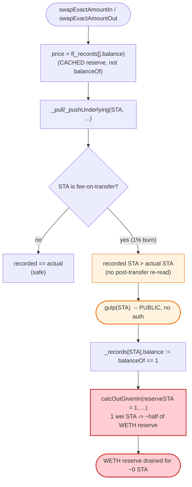

# Balancer × Statera (STA) Exploit — Deflationary-Token Reserve Desync via `gulp()`

> **Vulnerability classes:** vuln/oracle/spot-price · vuln/defi/slippage · vuln/governance/flash-loan-attack

> **Reproduction:** the PoC compiles & runs in an isolated Foundry project at
> [this project folder](.) (the umbrella DeFiHackLabs repo contains many unrelated PoCs that do
> not whole-compile, so this one was extracted). Full verbose trace:
> [output.txt](output.txt). Verified vulnerable sources:
> [BPool.sol](sources/BPool_0e511A/BPool.sol) and
> [Statera.sol](sources/Statera_a7DE08/Statera.sol).

---

## Key info

| | |
|---|---|
| **Loss** | ~**455.87 WETH** (≈ the pool's entire WETH reserve, ~$104k at the time) drained from the Balancer STA/WETH pool |
| **Vulnerable contract** | `BPool` (Balancer pool) — [`0x0e511Aa1a137AaD267dfe3a6bFCa0b856C1a3682`](https://etherscan.io/address/0x0e511Aa1a137AaD267dfe3a6bFCa0b856C1a3682#code) |
| **Trigger token** | `Statera` (STA), deflationary ERC20 — [`0xa7DE087329BFcda5639247F96140f9DAbe3DeED1`](https://etherscan.io/address/0xa7DE087329BFcda5639247F96140f9DAbe3DeED1#code) |
| **Victim pool** | Balancer STA/WETH `BPool` (multi-token Balancer pool holding STA + WETH) |
| **Flash-loan source** | dYdX `SoloMargin` — [`0x1E0447b19BB6EcFdAe1e4AE1694b0C3659614e4e`](https://etherscan.io/address/0x1E0447b19BB6EcFdAe1e4AE1694b0C3659614e4e) |
| **Attacker EOA / contract** | exploit contract `BalancerExp` (PoC harness address `0x7FA9385bE102ac3EAc297483Dd6233D62b3e1496`) |
| **Original attack tx** | [`0x013be97768b702fe8eccef1a40544d5ecb3c1961ad5f87fee4d16fdc08c78106`](https://etherscan.io/tx/0x013be97768b702fe8eccef1a40544d5ecb3c1961ad5f87fee4d16fdc08c78106) |
| **Chain / fork block / date** | Ethereum mainnet / 10,355,806 / June 28, 2020 |
| **Compiler** | `BPool` Solidity v0.5.12 (optimizer, 2000 runs); `Statera` v0.5.0 (optimizer, 200 runs) |
| **Bug class** | Deflationary (fee-on-transfer) token incompatibility → recorded-vs-actual balance desync → AMM price/invariant manipulation |

---

## TL;DR

Balancer's `BPool` keeps an **internal accounting balance** for each bound token in
`_records[token].balance` and prices every swap from that *recorded* number rather than the pool's
*actual* on-chain token balance ([BPool.sol `swapExactAmountIn`](sources/BPool_0e511A/BPool.sol)).
The pool also exposes a **permissionless** `gulp(token)` that overwrites the recorded balance with
the real ERC20 `balanceOf` ([BPool.sol `gulp`](sources/BPool_0e511A/BPool.sol)).

Statera (STA) is a **deflationary** token: every `transfer`/`transferFrom` silently **burns 1%** of
the moved amount ([Statera.sol:111-126](sources/Statera_a7DE08/Statera.sol#L111-L126)), so the
recipient always receives less than the sender sent. Balancer never re-reads the actual received
amount after a transfer, so its recorded STA balance **drifts above the truth** every time STA moves
through the pool.

The attacker weaponizes this with a dYdX flash loan:

1. **Borrow** 104,331.30 WETH from dYdX SoloMargin.
2. **Repeatedly swap WETH↔STA** through the pool. Each STA leg burns 1% of the STA in flight, so the
   pool's *real* STA balance shrinks far faster than its *recorded* balance — but the attacker keeps
   pushing WETH in, inflating the recorded (and real) WETH reserve.
3. **`swapExactAmountOut`** to pull the pool's *recorded* STA reserve down to essentially **1 wei**,
   then call **`gulp(STA)`** so the recorded balance == actual balance == **1**.
4. With the STA reserve recorded as `1`, the weighted-pool pricing makes **1 wei of STA** worth an
   enormous amount of WETH. The attacker sells **1 wei of STA → ~30,264 WETH**, then calls `gulp(STA)`
   to reset the recorded STA reserve back to 1, and repeats. Each 1-wei sale drains **~half** the
   remaining WETH reserve. Twenty such "1 wei + gulp" cycles siphon out **60,528 WETH** of accumulated
   reserve.
5. **Repay** the 104,331.30 WETH flash loan and walk away with **~455.87 WETH** — essentially the
   pool's entire original WETH liquidity — plus 2,342,412 leftover STA.

The root cause is the same class as later token/AMM desync hacks (e.g. BYToken): **the AMM trusts a
cached balance instead of the post-transfer actual balance, and a fee-on-transfer token breaks that
assumption.**

---

## Background — Balancer `BPool` accounting and `gulp()`

A Balancer `BPool` is a weighted constant-mean-market-maker. For each bound token it stores a
`Record` ([BPool.sol](sources/BPool_0e511A/BPool.sol)):

```solidity
struct Record {
    bool bound;
    uint index;
    uint denorm;   // denormalized weight
    uint balance;  // ← ACCOUNTING balance used for ALL pricing
}
```

Pricing functions (`calcSpotPrice`, `calcOutGivenIn`, `calcInGivenOut` in
[BMath.sol](sources/BPool_0e511A/BPool.sol)) all read `inRecord.balance` / `outRecord.balance` —
the **recorded** numbers — never `IERC20(token).balanceOf(pool)`.

After computing a trade, `swapExactAmountIn` updates the records by the **intended** amounts and then
moves tokens:

```solidity
inRecord.balance  = badd(inRecord.balance, tokenAmountIn);   // assumes pool received exactly tokenAmountIn
outRecord.balance = bsub(outRecord.balance, tokenAmountOut); // assumes pool sent exactly tokenAmountOut
...
_pullUnderlying(tokenIn, msg.sender, tokenAmountIn);   // transferFrom — may deliver LESS for fee-on-transfer
_pushUnderlying(tokenOut, msg.sender, tokenAmountOut); // transfer    — recipient gets LESS for fee-on-transfer
```

The "absorb" helper `gulp` exists to reconcile drift by force-overwriting the record with reality —
and it is **public with no access control**:

```solidity
// Absorb any tokens that have been sent to this contract into the pool
function gulp(address token) external _logs_ _lock_ {
    require(_records[token].bound, "ERR_NOT_BOUND");
    _records[token].balance = IERC20(token).balanceOf(address(this));  // recorded := actual
}
```

`gulp` was intended for honest donations ("someone sent tokens to the pool, fold them into the
reserve"). Against a deflationary token it becomes the attacker's most precise tool: it lets them
**snap the recorded reserve to a tiny actual balance at will**, then trade against that artificially
small reserve.

Statera (STA) is the deflationary token. Its transfer logic burns 1% on every move:

```solidity
// Statera.sol
function cut(uint256 value) public view returns (uint256) {
    uint256 roundValue = value.ceil(basePercent);
    uint256 cutValue   = roundValue.mul(basePercent).div(10000); // 1% (basePercent = 100)
    return cutValue;
}

function transfer(address to, uint256 value) public returns (bool) {
    uint256 tokensToBurn     = cut(value);            // 1% burned
    uint256 tokensToTransfer = value.sub(tokensToBurn); // 99% delivered
    _balances[msg.sender] = _balances[msg.sender].sub(value);
    _balances[to]         = _balances[to].add(tokensToTransfer);
    _totalSupply          = _totalSupply.sub(tokensToBurn);
    ...
}
```

So a Balancer `_pushUnderlying(STA, attacker, X)` actually credits the attacker `0.99·X`, and the
pool's real STA balance falls by `X` while the record falls by `X` too — but on the way back in, a
`_pullUnderlying(STA, attacker, Y)` only deposits `0.99·Y` into the pool while the record is increased
by the full `Y`. Recorded STA **runs ahead of actual STA**, and `gulp(STA)` lets the attacker collapse
the recorded reserve to the tiny actual value whenever it suits them.

---

## The vulnerable code

### 1. Pricing reads the cached record, not the real balance

[BPool.sol `swapExactAmountIn`](sources/BPool_0e511A/BPool.sol):

```solidity
Record storage inRecord  = _records[address(tokenIn)];
Record storage outRecord = _records[address(tokenOut)];

require(tokenAmountIn <= bmul(inRecord.balance, MAX_IN_RATIO), "ERR_MAX_IN_RATIO");

tokenAmountOut = calcOutGivenIn(
    inRecord.balance, inRecord.denorm,
    outRecord.balance, outRecord.denorm,
    tokenAmountIn, _swapFee
);                                      // ← out is a function of the RECORDED reserves

inRecord.balance  = badd(inRecord.balance, tokenAmountIn);
outRecord.balance = bsub(outRecord.balance, tokenAmountOut);

_pullUnderlying(tokenIn, msg.sender, tokenAmountIn);    // STA → only 99% actually arrives
_pushUnderlying(tokenOut, msg.sender, tokenAmountOut);  // STA → only 99% actually delivered
```

There is **no post-transfer balance check** (the modern fix is "measure `balanceOf` before and after,
use the delta"). The record and reality diverge.

### 2. `gulp()` is a permissionless reserve-resync primitive

[BPool.sol `gulp`](sources/BPool_0e511A/BPool.sol):

```solidity
function gulp(address token) external _logs_ _lock_ {
    require(_records[token].bound, "ERR_NOT_BOUND");
    _records[token].balance = IERC20(token).balanceOf(address(this));
}
```

Calling `gulp(STA)` when the pool's *actual* STA balance is `1` forces `outRecord.balance = 1`.
With a recorded reserve of `1`, `calcOutGivenIn(1, wIn, reserveWETH, wOut, 1, fee)` returns a huge
WETH output for a 1-wei STA input — the entire pricing curve is anchored on a fictitiously empty STA
side.

### 3. The deflationary `transfer`/`transferFrom` that drives the drift

[Statera.sol:111-155](sources/Statera_a7DE08/Statera.sol#L111-L155) (the 1% burn on each transfer,
shown above).

---

## Root cause — why it was possible

Balancer's pricing math is sound *only under the assumption that `_records[token].balance` equals the
pool's real token balance*. Two design choices break that assumption against STA:

1. **Cached accounting balance.** Every swap computes price from `_records[].balance` and updates it by
   the *intended* transfer amount, never by the *actual* amount received. For a fee-on-transfer token,
   intended ≠ actual on **every** transfer, so the record drifts.
2. **Permissionless `gulp()`.** `gulp(token)` overwrites the record with the live `balanceOf`. Intended
   as a benign "absorb donations" feature, it instead gives an attacker a precise lever to **set the
   recorded reserve equal to a tiny real balance**, on demand, with no authorization and no cost.

Composed together: the attacker uses normal swaps + the 1% burn to shrink the pool's *real* STA to
~1 wei while inflating the WETH reserve with their borrowed capital, calls `gulp(STA)` to make the
*recorded* STA reserve equal that 1 wei, and then trades 1-wei-of-STA-at-a-time against the wildly
mispriced curve — each trade extracting roughly half the WETH reserve, with a `gulp(STA)` after each
to reset the STA reserve to 1 for the next round.

> **The same primitive class as BYToken:** an AMM that trusts a stored reserve (`_records[].balance`
> here; the pair's `reserve` after `sync()` there) instead of the post-transfer actual balance, where a
> token operation lets one side of the reserve be deleted/desynced "for free", collapsing the invariant
> in the attacker's favor.

---

## Preconditions

- The Balancer pool contains a **fee-on-transfer / deflationary** token (STA, 1% burn).
- `BPool` prices from the **cached record**, and `gulp()` is **public** (both true here).
- The pool is finalized / `_publicSwap == true` so anyone may swap (true — the swaps succeed in the
  trace with no `ERR_SWAP_NOT_PUBLIC`).
- Working capital to dominate the pool. The attacker borrowed **104,331.30 WETH** via dYdX
  ([test/Balancer_20200628_exp.sol:164-188](test/Balancer_20200628_exp.sol#L164-L188)); the entire
  position unwinds inside one transaction, so it is **flash-loanable** and self-funding.

---

## Attack walkthrough (with on-chain numbers from the trace)

All figures are taken from the `LOG_SWAP` / `gulp` / `getBalance` entries in
[output.txt](output.txt). The pool's recorded WETH reserve starts at **455.92 WETH**
(first `gulp(WETH)` then `getBalance(WETH)` returns `455924126729217697715`).

### Phase A — borrow and warm up (`callFunction`, [test/Balancer_20200628_exp.sol:190-229](test/Balancer_20200628_exp.sol#L190-L229))

| # | Step | Trace evidence | Effect |
|---|------|----------------|--------|
| 1 | **Flash loan** 104,331.30 WETH from dYdX SoloMargin | `SoloMargin::operate(... value: 104331302777663079074413 ...)` | Attacker funded with 104,331.30 WETH. |
| 2 | `gulp(WETH)` then read recorded WETH reserve | `getBalance(WETH) → 455.92 WETH` | Establishes the pool's WETH side = ~455.92 WETH. |
| 3 | **Buy STA** with `MaxinRatio − 1e18` WETH (≈226.96 WETH) | `LOG_SWAP WETH→STA in 226.96, out 792,467 STA`; STA `transfer` delivers only `784,542` (1% = 7,924 burned) | Pool pushes out STA; attacker actually receives 99% of it. |
| 4 | **Sell that STA back** for WETH | `LOG_SWAP STA→WETH in 784,542, out 222.41 WETH` | On the way in, 1% of STA burns; recorded STA balance now exceeds actual. WETH reserve grows. |

### Phase B — pump the WETH reserve, burn down the STA reserve

The PoC then runs a sized ladder of WETH→STA buys (50%, 25%, then `10%·i` up to 95% of
`bmul(getBalance(WETH), MAX_IN_RATIO)`), each followed by selling the received STA back. Because every
STA hop burns 1% **and** the attacker keeps injecting their borrowed WETH, the recorded **WETH reserve
ratchets up** while the **real STA reserve collapses**. The trace shows `getBalance(WETH)` climbing
monotonically:

| `getBalance(WETH)` checkpoint (trace) | WETH reserve |
|---|---:|
| initial | 455.92 |
| after early hops | 487.99 → 536.79 → 617.31 → 740.77 → 925.97 |
| mid ladder | 1,203.76 → 1,625.07 → 2,275.10 → 3,355.77 → 4,949.76 |
| late ladder | 7,300.90 → 10,768.83 → 15,884.02 → 23,428.93 → **34,557.67** |

By the end of the ladder the recorded WETH reserve is ~34,557 WETH (all attacker capital), and the STA
reserve is tiny.

### Phase C — collapse the STA reserve to 1 wei, then drain (the exploit core)

| # | Step | Trace evidence | Pool recorded STA | WETH out |
|---|------|----------------|------------------:|---------:|
| 5 | **`swapExactAmountOut`** WETH→STA, requesting `balanceOf(BPool) − 1` STA out | `LOG_SWAP in 9,555.98 WETH, out 3,543.11 STA`; STA `transfer` leaves pool `balanceOf == 1` | 1 | — |
| 6 | **`gulp(STA)`** → record := actual | `Statera::balanceOf(BPool) → 1`; record `…→ 1` | **1** | — |
| 7 | **Sell 1 wei STA** | `LOG_SWAP STA→WETH in 1, out 30,264.27 WETH` | 2 (record bumps to 2) | **30,264.27** |
| 8 | **`gulp(STA)`** resets record to actual `1` | `balanceOf(BPool) → 1`; record `2 → 1` | **1** | — |
| 9 | Sell 1 wei STA again | `LOG_SWAP in 1, out 15,132.13 WETH` | 1 (after gulp) | **15,132.13** |
| … | repeat "sell 1 wei + gulp" 20× total | each output halves: 7,566 → 3,783 → 1,892 → 945 → … → 0.057 WETH | 1 | — |

The 20 one-wei sales (each followed by `gulp(STA)`) form a geometric series — every sale pulls almost
exactly **half** of the remaining WETH reserve:

```
30,264.27 → 15,132.13 → 7,566.07 → 3,783.03 → 1,891.52 → 945.76 → 472.88 → 236.44
→ 118.22 → 59.11 → 29.55 → 14.78 → 7.39 → 3.69 → 1.85 → 0.92 → 0.46 → 0.23 → 0.115 → 0.0577
```

Total extracted by the 20 drain swaps: **60,528.48 WETH**.

**Why "1 wei drains half":** with the recorded STA reserve `= 1` and a sizeable WETH reserve, the
weighted-pool output `calcOutGivenIn(reserveSTA=1, …, reserveWETH, …, in=1, fee)` is dominated by the
`1 - (reserveIn/(reserveIn+adjustedIn))^(wIn/wOut)` term. With `reserveIn = 1` and `adjustedIn ≈ 1`,
that fraction is ≈ ½, so a single wei of STA buys roughly half the WETH reserve. After each sale the
record ticks to 2, so the attacker `gulp`s it back to 1 and the next wei again buys ~half of what
remains.

### Phase D — repay and profit

| # | Step | Trace evidence |
|---|------|----------------|
| 10 | **Repay** the dYdX flash loan | `WETH9::transferFrom(attacker → SoloMargin, 104331302777663079074415)` (loan + 2 wei dust) |
| 11 | **Final balances** | `[After Attack] Attacker WETH Balance : 455.87`; `Attacker STA Balance : 2,342,412.70` |

---

## Profit / loss accounting

| Item | Amount |
|---|---:|
| Pool WETH reserve at start (the prize) | ~455.92 WETH |
| Flash loan borrowed (dYdX) | 104,331.30 WETH |
| WETH pushed into pool across the ladder + `swapExactAmountOut` | ≈ pool reserve growth to ~34,557 WETH (attacker capital) |
| WETH extracted by the 20 one-wei drain sales | **60,528.48 WETH** |
| Flash loan repaid | 104,331.30 WETH (+2 wei) |
| **Attacker net WETH profit** | **≈ 455.87 WETH** |
| Leftover STA held by attacker | 2,342,412.70 STA |

The net WETH profit (**455.87**) matches the pool's **original WETH reserve (455.92)** almost to the
wei — confirming the attacker simply walked off with the entire WETH side of the honest pool while
recovering 100% of their borrowed capital. (The tiny difference is swap-fee dust paid back into the
pool during the ladder.)

---

## Diagrams

### Sequence of the attack

```mermaid
sequenceDiagram
    autonumber
    actor A as "Attacker (BalancerExp)"
    participant D as "dYdX SoloMargin"
    participant B as "Balancer BPool"
    participant S as "Statera (STA, 1% burn)"

    Note over B: "Recorded reserves<br/>WETH 455.92 | STA large<br/>price keyed off RECORD, not balanceOf"

    rect rgb(255,243,224)
    Note over A,S: "Phase A - borrow & warm up"
    A->>D: "operate(): flash-borrow 104,331.30 WETH"
    D-->>A: "104,331.30 WETH"
    A->>B: "gulp(WETH); getBalance(WETH) = 455.92"
    end

    rect rgb(232,245,233)
    Note over A,S: "Phase B - pump WETH reserve, burn down STA"
    loop "WETH->STA then STA->WETH ladder"
        A->>B: "swapExactAmountIn(WETH -> STA)"
        B->>S: "transfer STA (1% burned to recipient)"
        A->>B: "swapExactAmountIn(STA -> WETH)"
        B->>S: "transferFrom STA (1% burned into pool)"
    end
    Note over B: "Recorded WETH reserve climbs to ~34,557<br/>real STA reserve collapses"
    end

    rect rgb(227,242,253)
    Note over A,S: "Phase C - collapse STA reserve to 1, then drain"
    A->>B: "swapExactAmountOut(WETH -> STA, out = balanceOf-1)"
    Note over B: "pool STA balanceOf == 1"
    A->>B: "gulp(STA)  => recorded STA := 1"
    loop "20x  (sell 1 wei + gulp)"
        A->>B: "swapExactAmountIn(STA, 1) -> ~half of WETH reserve"
        B-->>A: "WETH out (30,264 -> 15,132 -> 7,566 -> ...)"
        A->>B: "gulp(STA)  => recorded STA := 1 again"
    end
    end

    rect rgb(255,235,238)
    Note over A,S: "Phase D - repay & profit"
    A->>D: "repay 104,331.30 WETH"
    Note over A: "Net +455.87 WETH (the pool's entire WETH side)"
    end
```

### Recorded vs. actual STA balance desync

```mermaid
stateDiagram-v2
    [*] --> Synced
    Synced: "Synced<br/>recorded STA == actual STA"
    Drift: "Drift<br/>recorded STA &gt; actual STA<br/>(1% burned on every transfer)"
    Collapsed: "Collapsed<br/>swapExactAmountOut leaves actual == 1"
    Anchored: "Anchored<br/>gulp(STA): recorded := 1"
    Drained: "Drained<br/>sell 1 wei -&gt; ~half of WETH reserve"

    Synced --> Drift: "WETH&lt;-&gt;STA swaps, fee-on-transfer"
    Drift --> Collapsed: "swapExactAmountOut(out = balanceOf-1)"
    Collapsed --> Anchored: "gulp(STA)  (permissionless)"
    Anchored --> Drained: "swapExactAmountIn(STA, 1)"
    Drained --> Anchored: "gulp(STA) resets record to 1 (x20)"
    Drained --> [*]: "WETH reserve emptied, repay loan"
```

### Where the invariant breaks inside `BPool`



---

## Why each magic number

- **`MaxinRatio = bmul(getBalance(WETH), MAX_IN_RATIO)`** ([test:197](test/Balancer_20200628_exp.sol#L197)):
  `MAX_IN_RATIO = BONE/2` is the Balancer per-swap input cap (50% of the recorded reserve). The PoC
  sizes each WETH buy as a fraction of this cap so swaps never revert with `ERR_MAX_IN_RATIO`, while
  pushing the maximum WETH into the pool to inflate its reserve.
- **The 50%/25%/`10%·i`/95% ladder** ([test:201-214](test/Balancer_20200628_exp.sol#L201-L214)):
  progressively larger WETH injections that grow the recorded WETH reserve from 455.92 to ~34,557 WETH
  while repeated 1%-burn STA round-trips shrink the real STA reserve.
- **`swapExactAmountOut(weth, ~∞, sta, balanceOf(bpool)−1, ~∞)`** ([test:218-220](test/Balancer_20200628_exp.sol#L218-L220)):
  buys *all but 1 wei* of the pool's remaining real STA, leaving `balanceOf(BPool) == 1`.
- **`gulp(sta)`** after each step ([test:221,227](test/Balancer_20200628_exp.sol#L221)):
  forces `_records[STA].balance := 1`, anchoring the pricing curve on a near-empty STA side.
- **`swapExactAmountIn(sta, 1, weth, …)` × 20** ([test:224-228](test/Balancer_20200628_exp.sol#L224-L228)):
  each 1-wei STA sale pulls ~half the WETH reserve (geometric: 30,264 → 15,132 → 7,566 → …); the
  trailing `gulp(sta)` resets the record to 1 so the next wei again buys ~half of what remains.

---

## Remediation

1. **Measure actual received/sent amounts, never trust intended amounts.** On every swap, read
   `balanceOf(pool)` before and after the transfer and use the **delta** to update reserves. This is
   the canonical fix-on-transfer-token fix and defeats the entire desync.
2. **Whitelist tokens; ban fee-on-transfer / rebasing tokens** from pools whose math assumes
   `transfer(x)` moves exactly `x`. Balancer's `BPool` math is only correct for "standard" ERC20s.
3. **Remove or gate `gulp()`.** A permissionless "set recorded reserve to actual balanceOf" primitive
   is a weapon whenever recorded ≠ actual. If reconciliation is needed, make it move *both* sides
   consistently and restrict who can call it / when.
4. **Bound single-swap reserve impact.** Reject swaps whose output exceeds a small fraction of the
   reserve, and reject pricing when a recorded reserve is implausibly small (e.g. `1 wei`), so a
   near-empty side cannot be traded against.
5. **Invariant assertion after each swap.** Assert that the post-swap recorded reserves are consistent
   with the real `balanceOf` (within a tight tolerance); revert on large divergence.

---

## How to reproduce

The PoC was extracted into a standalone Foundry project (the umbrella DeFiHackLabs repo has many
unrelated PoCs that fail `forge test`'s whole-project build):

```bash
_shared/run_poc.sh 2020-06-Balancer_20200628_exp -vvvvv
```

- RPC: an **Ethereum mainnet archive** endpoint is required — the fork pins block **10,355,806**
  (June 28, 2020), so most pruned public RPCs will fail with `header not found` / `missing trie node`.
  `foundry.toml` is configured with a working archive endpoint under the `mainnet` alias.
- Result: `[PASS] testExploit()`. The logs show the attacker WETH balance going from **0** before to
  **~455.87 WETH** after, plus ~2,342,412 leftover STA.

Expected tail (from [output.txt](output.txt)):

```
    ├─ emit log_named_decimal_uint(key: "[After Attack] Attacker WETH Balance : ", val: 455866402218883570637 [4.558e20], decimals: 18)
    ├─ emit log_named_decimal_uint(key: "[After Attack] Attacker STA Balance : ", val: 2342412696483126504723721 [2.342e24], decimals: 18)
    └─ ← [Stop]

Suite result: ok. 1 passed; 0 failed; 0 skipped; finished in 11.47s (10.09s CPU time)
Ran 1 test suite in 22.88s (11.47s CPU time): 1 tests passed, 0 failed, 0 skipped (1 total tests)
```

---

*References: original attack tx
[`0x013be97768b702fe8eccef1a40544d5ecb3c1961ad5f87fee4d16fdc08c78106`](https://etherscan.io/tx/0x013be97768b702fe8eccef1a40544d5ecb3c1961ad5f87fee4d16fdc08c78106);
Balancer post-mortem on the STA/STONK deflationary-token incident (June 28-29, 2020). This is the
canonical "fee-on-transfer token vs. AMM recorded-balance" vulnerability class.*
