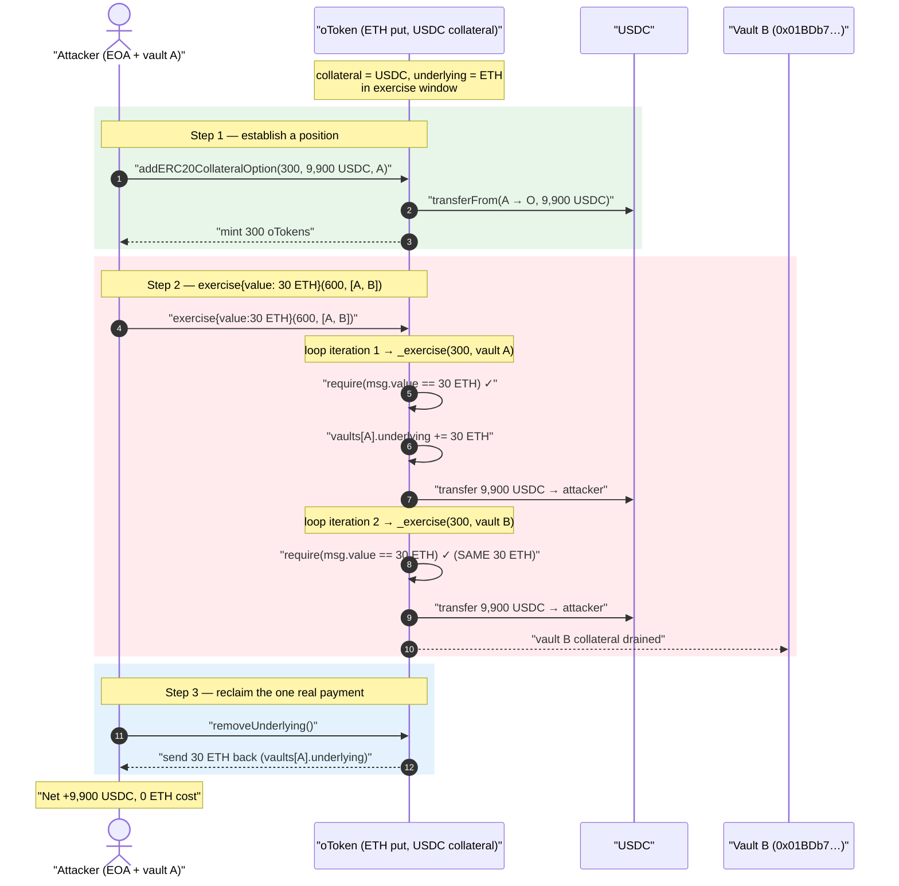
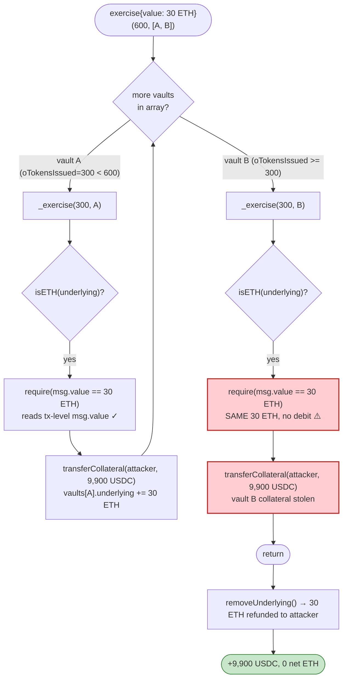
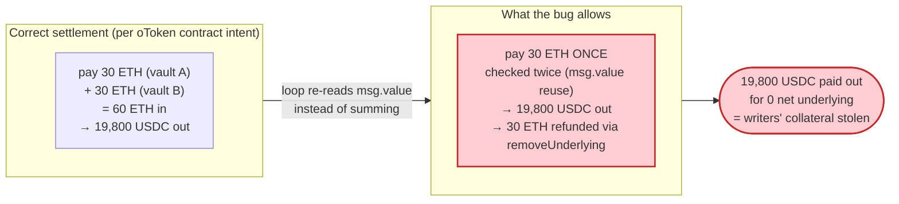

# Opyn ETH Put Exploit — Reused `msg.value` Across a Multi-Vault `exercise()` Loop

> **Vulnerability classes:** vuln/logic/incorrect-order-of-operations · vuln/logic/state-update

> One ETH-underlying payment is checked against **each** vault inside a single
> `exercise()` call, so the attacker collects collateral from N vaults while paying the
> underlying only once — and then withdraws even that single payment back.

> **Reproduction:** the PoC compiles & runs in an isolated Foundry project at
> [this project folder](.) (the umbrella DeFiHackLabs repo contains many unrelated PoCs
> that do not whole-compile, so this one was extracted).
> Full verbose trace: [output.txt](output.txt).
> Verified vulnerable source (Etherscan): [sources/oToken_951D51/oToken.sol](sources/oToken_951D51/oToken.sol).

---

## Key info

| | |
|---|---|
| **Loss** | ~$371K total drained across the attack campaign; this single reproduced tx nets the attacker **+9,900 USDC** of collateral for free |
| **Vulnerable contract** | `oToken` (Opyn ocDai/oETH-style put) — [`0x951D51bAeFb72319d9FBE941E1615938d89ABfe2`](https://etherscan.io/address/0x951D51bAeFb72319d9FBE941E1615938d89ABfe2#code) |
| **Victim** | Every vault owner who collateralized this oETH put with USDC (collateral is taken from their vaults during the duplicated exercise) |
| **Attacker EOA** | [`0xe7870231992Ab4b1A01814FA0A599115FE94203f`](https://etherscan.io/address/0xe7870231992Ab4b1A01814FA0A599115FE94203f) |
| **Second vault drained** | `0x01BDb7Ada61C82E951b9eD9F0d312DC9Af0ba0f2` |
| **Attack tx (reference)** | [`0x56de6c4bd906ee0c067a332e64966db8b1e866c7965c044163a503de6ee6552a`](https://etherscan.io/tx/0x56de6c4bd906ee0c067a332e64966db8b1e866c7965c044163a503de6ee6552a) |
| **Chain / fork block / date** | Ethereum mainnet / 10,592,516 / Aug 4, 2020 |
| **Compiler** | Solidity v0.5.10, optimizer **200 runs** ([_meta.json](sources/oToken_951D51/_meta.json)) |
| **Bug class** | Double-spend via reused `msg.value` in a loop (per-iteration payment validation, no aggregate accounting) |
| **Post-mortem** | https://medium.com/opyn/opyn-eth-put-exploit-post-mortem-1a009e3347a8 |

---

## TL;DR

Opyn's `oToken` is a collateralized options contract. For an **ETH-underlying put**, exercising
an option means: the holder hands the contract the protected **underlying (ETH)** and, in return,
receives **collateral (USDC)** out of a writer's vault.

The public `exercise(oTokensToExercise, vaultsToExerciseFrom[])`
([oToken.sol:1491-1516](sources/oToken_951D51/oToken.sol#L1491-L1516)) lets a caller spread one
exercise across **multiple vaults** by looping and calling the internal `_exercise()` once per
vault. The ETH payment is validated **inside** `_exercise()` with
`require(msg.value == amtUnderlyingToPay)`
([oToken.sol:1874-1875](sources/oToken_951D51/oToken.sol#L1874-L1875)).

Because `msg.value` is the *same value for the whole transaction* but the loop re-runs that check
once per vault, a single ETH payment satisfies the requirement for **every** vault. The attacker:

1. Mints a small position (`addERC20CollateralOption`) so they own a vault and hold oTokens.
2. Calls `exercise{value: 30 ETH}(600 oTokens, [vaultA, vaultB])`. The loop calls `_exercise(300, vaultA)`
   then `_exercise(300, vaultB)`. **Each** call checks `msg.value == 30 ETH` and passes, so the attacker
   receives **9,900 USDC from vault A and 9,900 USDC from vault B** — 19,800 USDC — for one 30-ETH payment.
3. Calls `removeUnderlying()` to pull back the 30 ETH that got booked to *their own* vault.

Net: the attacker paid 9,900 USDC of collateral in step 1, collected 19,800 USDC in step 2, and
recovered all 30 ETH in step 3 → **+9,900 USDC, zero net ETH cost.** Repeated and scaled across the
protocol's vaults, this drained the entire ETH-put collateral pool.

---

## Background — how Opyn options settle

`oToken` (here a USDC-collateralized ETH put) tracks one `Vault` per writer
([oToken.sol:1095-1100](sources/oToken_951D51/oToken.sol#L1095-L1100)):

```solidity
struct Vault {
    uint256 collateral;     // USDC backing this writer's options
    uint256 oTokensIssued;  // how many oTokens this vault is on the hook for
    uint256 underlying;     // ETH accrued to this vault when its options are exercised
    bool owned;
}
```

- **Writers** call `addERC20CollateralOption` / `issueOTokens` to lock USDC collateral and mint oTokens.
- **Holders** call `exercise()` during the exercise window: they surrender the **underlying ETH** the
  put protects and receive **`strikePrice × oTokens` worth of USDC collateral** taken from a vault.
- The ETH the holder pays in is *credited to the exercised vault's* `vault.underlying`
  ([oToken.sol:1846](sources/oToken_951D51/oToken.sol#L1846)); the writer can later withdraw it via
  `removeUnderlying()`.

The whole settlement is conservation-based: the ETH a holder pays should equal the ETH credited to
the vaults whose collateral was paid out. The bug breaks exactly that conservation.

The on-chain figures decoded from this transaction's trace ([output.txt](output.txt)):

| Quantity | Trace value | Meaning |
|---|---|---|
| Attacker USDC balance before | `68504683582` | 68,504.68 USDC |
| Collateral deposited in step 1 | `9900000000` | 9,900 USDC |
| oTokens minted in step 1 | `300000000` (3e8) | 300 oTokens |
| `exercise` oTokens requested | `600000000` (6e8) | 600 oTokens, split 300 + 300 across two vaults |
| ETH sent with `exercise` | `30000000000000000000` | 30 ETH (= `amtUnderlyingToPay` for 300 oTokens) |
| Collateral paid out per vault | `9900000000` ×2 | 9,900 USDC × 2 = **19,800 USDC** |
| ETH refunded by `removeUnderlying` | `30000000000000000000` | 30 ETH back to attacker |
| Attacker USDC balance after | `78404683582` | 78,404.68 USDC |
| **Profit** | — | **+9,900 USDC** |

---

## The vulnerable code

### 1. The public loop — one call, many vaults, one `msg.value`

[oToken.sol:1491-1516](sources/oToken_951D51/oToken.sol#L1491-L1516):

```solidity
function exercise(
    uint256 oTokensToExercise,
    address payable[] memory vaultsToExerciseFrom
) public payable {
    for (uint256 i = 0; i < vaultsToExerciseFrom.length; i++) {
        address payable vaultOwner = vaultsToExerciseFrom[i];
        require(hasVault(vaultOwner), "Cannot exercise from a vault that doesn't exist");
        Vault storage vault = vaults[vaultOwner];
        if (oTokensToExercise == 0) {
            return;
        } else if (vault.oTokensIssued >= oTokensToExercise) {
            _exercise(oTokensToExercise, vaultOwner);   // ⚠️ _exercise re-checks the SAME msg.value
            return;
        } else {
            oTokensToExercise = oTokensToExercise.sub(vault.oTokensIssued);
            _exercise(vault.oTokensIssued, vaultOwner);  // ⚠️ ...and again on the next iteration
        }
    }
    ...
}
```

There is **no aggregate ETH accounting** — the function never sums the underlying owed across all the
vaults it touches, never tracks how much of `msg.value` has already been consumed, and never refunds a
balance. It simply delegates to `_exercise()` per vault.

### 2. The per-vault check that reads `msg.value` again every iteration

[oToken.sol:1816-1899](sources/oToken_951D51/oToken.sol#L1816-L1899), the relevant lines:

```solidity
function _exercise(uint256 oTokensToExercise, address payable vaultToExerciseFrom) internal {
    ...
    // amount of ETH this single vault's exercise requires
    uint256 amtUnderlyingToPay = underlyingRequiredToExercise(oTokensToExercise);
    vault.underlying = vault.underlying.add(amtUnderlyingToPay);   // credited to THIS vault
    ...
    uint256 amtCollateralToPay = calculateCollateralToPay(oTokensToExercise, Number(1, 0));
    ...
    vault.collateral = vault.collateral.sub(totalCollateralToPay);
    vault.oTokensIssued = vault.oTokensIssued.sub(oTokensToExercise);

    // 4.1 Transfer in underlying
    if (isETH(underlying)) {
        require(msg.value == amtUnderlyingToPay, "Incorrect msg.value");  // ⚠️ THE BUG
    } else {
        require(underlying.transferFrom(msg.sender, address(this), amtUnderlyingToPay), ...);
    }
    // 4.2 burn oTokens
    _burn(msg.sender, oTokensToExercise);
    // 4.3 Pay out collateral
    transferCollateral(msg.sender, amtCollateralToPay);   // attacker receives USDC, every iteration
    ...
}
```

`msg.value` is a **transaction-level constant** — every read of it inside the same call returns the
same number. For a non-ETH underlying, `transferFrom` actually *moves* tokens each iteration, so paying
twice really costs twice. But for an **ETH underlying** the contract only *compares* `msg.value`; it
never debits anything per iteration. So the identical 30-ETH comparison passes for every vault, while
`transferCollateral` faithfully pays out USDC each time.

### 3. The escape hatch that returns even the single payment

[oToken.sol:1521-1533](sources/oToken_951D51/oToken.sol#L1521-L1533):

```solidity
function removeUnderlying() public {
    require(hasVault(msg.sender), "Vault does not exist");
    Vault storage vault = vaults[msg.sender];
    require(vault.underlying > 0, "No underlying balance");

    uint256 underlyingToTransfer = vault.underlying;
    vault.underlying = 0;
    transferUnderlying(msg.sender, underlyingToTransfer);   // attacker withdraws the 30 ETH back
    emit RemoveUnderlying(underlyingToTransfer, msg.sender);
}
```

Because the loop processes the **attacker's own vault first**, the 30 ETH `amtUnderlyingToPay` gets
credited to `vaults[attacker].underlying`. The attacker is the vault owner, so `removeUnderlying()`
hands the 30 ETH straight back — making the single ETH payment free in net terms too.

---

## Root cause — why it was possible

The collateralized-options invariant is **conservation of underlying**: to pull `C` collateral out of
a vault, the exerciser must pay in the `U` underlying that the vault's options protect. `exercise()`
violates it because the payment validation lives in the **inner, per-vault** function while the payment
medium (ETH `msg.value`) is **outer, per-transaction** and non-consumable.

Three design decisions compose into the double-spend:

1. **Payment checked per iteration, not per transaction.** `_exercise()` does
   `require(msg.value == amtUnderlyingToPay)` for *one* vault's worth of underlying. The caller-facing
   `exercise()` loops over many vaults but never aggregates the total underlying required, never tracks
   consumption of `msg.value`, and never refunds leftovers. There is no "running tally" of ETH spent.
2. **`msg.value` is not a debit.** Unlike a token `transferFrom` (which actually moves balance and
   would fail on a second draw without fresh allowance/balance), comparing `msg.value` is a read of an
   immutable transaction field. Reusing it across iterations is free.
3. **The single payment is refundable to the attacker.** The first vault in the array is the attacker's
   own, so the only ETH that *was* required gets booked to `vaults[attacker].underlying` and is
   reclaimable via `removeUnderlying()`. Even the one genuine payment costs nothing in net.

A correct implementation must either (a) compute the **total** underlying for the whole `exercise()`
call up front and require `msg.value == totalUnderlying`, refunding any excess, or (b) make the
underlying a pull-based token transfer for every iteration so the EVM enforces a real debit each time.

---

## Preconditions

- The oToken is in its **exercise window**: `block.timestamp ∈ [expiry − windowSize, expiry)`
  ([oToken.sol:1468-1471](sources/oToken_951D51/oToken.sol#L1468-L1471), enforced at
  [oToken.sol:1821-1824](sources/oToken_951D51/oToken.sol#L1821-L1824)). At the fork block this was true.
- The underlying is **ETH** (`isETH(underlying)` true), so settlement compares `msg.value` instead of
  pulling tokens. (For ERC20-underlying oTokens the loop would actually cost the attacker the underlying
  each time and the attack would not be free.)
- At least **two** vaults exist whose collateral the attacker can drain, and the attacker holds enough
  oTokens to exercise against each (`balanceOf(attacker) ≥ oTokensToExercise` is re-checked per call —
  here 600 oTokens covers the 300+300 split).
- The attacker owns a vault and lists it **first** in `vaultsToExerciseFrom`, so the single ETH payment
  lands in their own `vault.underlying` and is later refundable via `removeUnderlying()`.
- Capital is fully recoverable intra-transaction (the 9,900 USDC deposit is dwarfed by the 19,800 USDC
  payout, and the 30 ETH is returned), so the position is essentially **risk-free / flash-loanable**.

---

## Step-by-step attack walkthrough (ground-truth from the trace)

All figures are taken directly from the events and storage diffs in
[output.txt](output.txt). USDC has 6 decimals; the oToken position amounts are in oToken units
(3e8 = 300 oTokens, the protected amount being 30 ETH for 300 oTokens).

| # | Call | Observed effect (trace line) | Attacker USDC Δ |
|---|------|------------------------------|----------------:|
| 0 | `usdc.balanceOf(attacker)` | `68504683582` → 68,504.68 USDC ([L20-23](output.txt)) | — |
| 1 | `addERC20CollateralOption(300e6, 9.9e9, attacker)` | `transferFrom` attacker → oToken **9,900 USDC** collateral ([L29-37](output.txt)); `_mint` **300 oTokens** to attacker ([L39](output.txt)) | −9,900 |
| 2a | `exercise{value:30 ETH}(600e6, [attacker, 0x01BDb7…])` → `_exercise(300, attackerVault)` | burn 300 oTokens ([L48](output.txt)); `require(msg.value==30 ETH)` **passes**; `transfer` **9,900 USDC** oToken → attacker ([L49-56](output.txt)); 30 ETH credited to attacker's `vault.underlying` ([L72 slot …bf58 = 1a05…0000 = 30e18](output.txt)) | +9,900 |
| 2b | same call → `_exercise(300, 0x01BDb7…)` | burn 300 oTokens ([L58](output.txt)); `require(msg.value==30 ETH)` **passes again with the same 30 ETH**; `transfer` **9,900 USDC** oToken → attacker ([L59-66](output.txt)) | +9,900 |
| 3 | `removeUnderlying()` | `RemoveUnderlying(30 ETH, attacker)` ([L81](output.txt)); 30 ETH sent back to attacker's fallback ([L79](output.txt)); attacker's `vault.underlying` slot reset 30e18 → 0 ([L83](output.txt)) | 0 (ETH refund) |
| 4 | `usdc.balanceOf(attacker)` | `78404683582` → 78,404.68 USDC ([L85-88](output.txt)) | — |

**Reconciliation:** −9,900 (deposit) + 9,900 (vault A) + 9,900 (vault B) = **+9,900 USDC**, and the 30
ETH paid in step 2 is fully recovered in step 3. The two `Exercise` events at
[L57](output.txt) and [L67](output.txt) both carry `amtUnderlyingToPay = 30 ETH` and
`amtCollateralToPay = 9,900 USDC` — proof the contract believed it was paid 30 ETH **twice** when only
30 ETH ever entered the contract.

### Profit / loss accounting

| Flow | USDC | ETH |
|---|---:|---:|
| Step 1 — deposit collateral | −9,900 | 0 |
| Step 2a — collateral from attacker's own vault | +9,900 | −30 (paid once) |
| Step 2b — collateral from the second vault | +9,900 | 0 (no extra ETH actually charged) |
| Step 3 — `removeUnderlying` refund | 0 | +30 |
| **Net** | **+9,900 USDC** | **0 ETH** |

Logged result: `Attacker profit is  9900` ([output.txt L9, L91-92](output.txt)). In the live incident
the attacker repeated and scaled this across the protocol's ETH-put vaults, draining the bulk of the
collateral pool (~$371K).

---

## Diagrams

### Sequence of the attack



### Control flow: where the double-spend lives



### Conservation broken: ETH in vs. collateral out



---

## Remediation

1. **Aggregate the underlying for the whole call before charging it.** Compute the *total*
   `amtUnderlyingToPay` across every vault the loop will touch, then validate ETH **once** at the
   outer level: `require(msg.value == totalUnderlying)` (refunding any surplus). The per-vault
   `require(msg.value == amtUnderlyingToPay)` must be removed from `_exercise()`.
2. **Track consumed `msg.value` as a running balance.** If the payment must stay inside the loop, pass a
   mutable `remaining` accumulator into `_exercise()` and do `remaining = remaining.sub(amtUnderlyingToPay)`
   each iteration — letting SafeMath revert when the single payment is over-drawn. Comparing the
   immutable `msg.value` per iteration is never safe.
3. **Treat ETH underlying like a real debit.** The asymmetry between the ERC20 branch
   (`transferFrom`, a true balance move) and the ETH branch (a `msg.value` comparison) is the heart of
   the bug. Wrap ETH into WETH at entry and use `transferFrom`/internal accounting so every iteration
   actually consumes balance.
4. **Disallow exercising your own vault in the same call you withdraw from.** At minimum, do not let the
   single legitimate payment be siphoned back via `removeUnderlying()` in the same flow; require the
   underlying owed to writers be net-settled against the exerciser before any refund path.
5. **Add a conservation invariant / test.** Assert post-condition `Σ vault.underlying increases ==
   ETH actually received` for any multi-vault exercise; fuzz `exercise()` with arrays of length ≥ 2.

Opyn's actual fix (per the post-mortem) was to halt the contracts, migrate, and rewrite settlement so
the underlying payment is validated against the full exercise amount rather than per-vault.

---

## How to reproduce

The PoC was extracted into a standalone Foundry project (the umbrella DeFiHackLabs repo has several
unrelated PoCs that fail to compile under `forge test`'s whole-project build):

```bash
_shared/run_poc.sh 2020-08-Opyn_exp -vvvvv
```

- RPC: an Ethereum **archive** endpoint is required (fork block 10,592,516, Aug 2020). `foundry.toml`'s
  `mainnet` alias must point at an archive node that serves historical state at that block.
- Test entry point: [test/Opyn_exp.sol](test/Opyn_exp.sol) — `test_attack()`.
- Result: `[PASS] test_attack()` with `Attacker profit is 9900` (USDC).

Expected tail:

```
Ran 1 test for test/Opyn_exp.sol:ContractTest
[PASS] test_attack() (gas: 214568)
Logs:
  Attacker USDC balance before is     68504
  ------EXPLOIT-----
  Attacker USDC balance after is      78404
  Attacker profit is                   9900

Suite result: ok. 1 passed; 0 failed; 0 skipped
```

---

*References: Opyn ETH Put Exploit Post-Mortem — https://medium.com/opyn/opyn-eth-put-exploit-post-mortem-1a009e3347a8.
Reference attack tx: `0x56de6c4bd906ee0c067a332e64966db8b1e866c7965c044163a503de6ee6552a`.*
