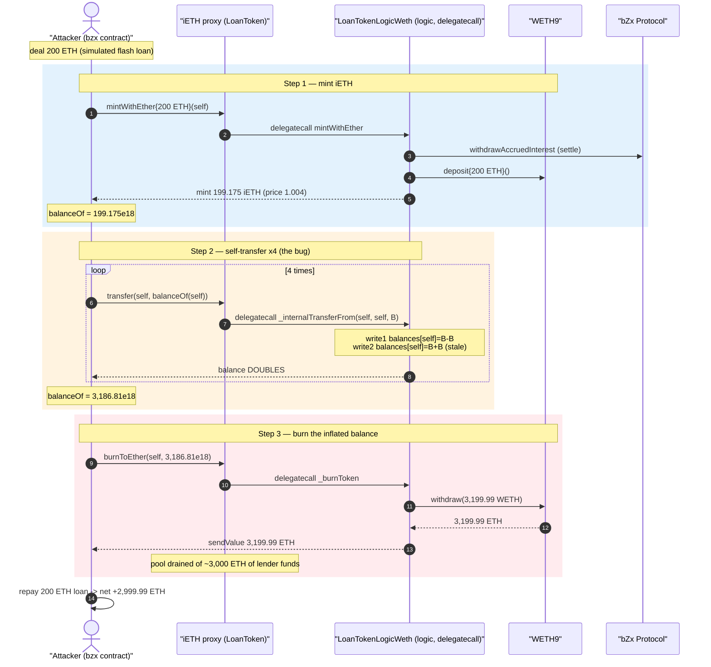
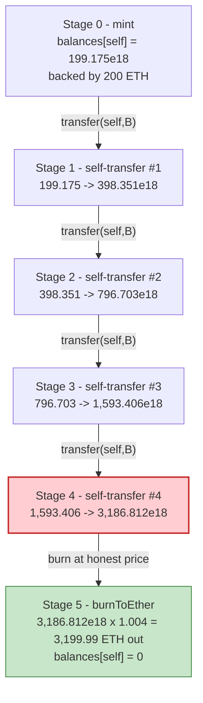
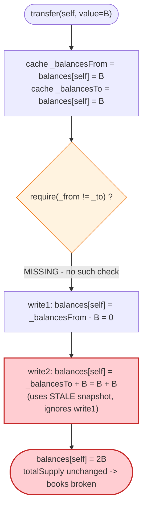

# bZx (iETH) Exploit — Self-Transfer Balance Duplication in `_internalTransferFrom`

> **Reproduction:** the PoC compiles & runs in an isolated Foundry project at
> [this project folder](.) (the umbrella DeFiHackLabs repo contains several
> unrelated PoCs that do not whole-compile, so this one was extracted).
> Full verbose trace: [output.txt](output.txt).
> Verified vulnerable source: [LoanTokenLogicWeth.sol](sources/LoanTokenLogicWeth_dE744d/LoanTokenLogicWeth.sol).

---

## Key info

| | |
|---|---|
| **Loss** | ~2,388 ETH at the time (the public bZx Sep-2020 incident; this PoC mints 200 ETH of iETH, inflates it to 3,186 iETH, and burns it for **3,200 ETH** out of the pool — net **+3,000 ETH** profit on 200 ETH of capital) |
| **Vulnerable contract (proxy)** | `LoanToken` (iETH) — [`0xB983E01458529665007fF7E0CDdeCDB74B967Eb6`](https://etherscan.io/address/0xB983E01458529665007fF7E0CDdeCDB74B967Eb6) |
| **Vulnerable contract (logic)** | `LoanTokenLogicWeth` — [`0xdE744d544A9d768e96C21B5F087Fc54b776E9b25`](https://etherscan.io/address/0xde744d544a9d768e96c21b5f087fc54b776e9b25#code) |
| **Underlying / pool asset** | WETH — `0xC02aaA39b223FE8D0A0e5C4F27eAD9083C756Cc2` (pool held ~3,137 WETH + ~3,994 WETH out on loan) |
| **bZx Protocol** | `0xD8Ee69652E4e4838f2531732a46d1f7F584F0b7f` |
| **Attacker EOA** | [`0xd1c0f1316140D6bF1a9e2Eea8a227dAD151F69b7`](https://etherscan.io/address/0xd1c0f1316140D6bF1a9e2Eea8a227dAD151F69b7) |
| **Attack tx** | [`0x85dc2a433fd9eaadaf56fd8156c956da23fc17e5ef83955c7e2c4c37efa20bb5`](https://etherscan.io/tx/0x85dc2a433fd9eaadaf56fd8156c956da23fc17e5ef83955c7e2c4c37efa20bb5) |
| **Chain / fork block / date** | Ethereum mainnet / 10,852,715 (fork = attack block − 1) / September 13, 2020 |
| **Compiler (victim)** | Solidity 0.5.17 (PoC harness built with 0.8.34) |
| **Bug class** | Accounting bug — ERC20 self-transfer balance duplication (stale read-modify-write in `_internalTransferFrom`) |

---

## TL;DR

bZx's interest-bearing token (`iETH`) inherits an ERC20 `_internalTransferFrom`
([LoanTokenLogicWeth.sol:1125-1168](sources/LoanTokenLogicWeth_dE744d/LoanTokenLogicWeth.sol#L1125-L1168))
that caches **both** the sender's and the receiver's balances into local variables,
then writes them back sequentially:

```solidity
uint256 _balancesFrom = balances[_from];   // cache
uint256 _balancesTo   = balances[_to];     // cache
...
balances[_from] = _balancesFrom.sub(_value);  // write 1
...
balances[_to]   = _balancesTo.add(_value);     // write 2 — uses the STALE cache
```

There is **no `require(_from != _to)`** guard. When a holder transfers tokens **to
itself**, write 2 overwrites write 1 using the *pre-debit* snapshot `_balancesTo`,
so the debit is silently discarded and the holder's balance becomes
`oldBalance + _value` — i.e. it **doubles**. `totalSupply` is untouched, so the
token's books no longer add up.

The attacker:

1. **Mints** 200 ETH of iETH → receives `199.175e18` iETH.
2. **Self-transfers** the full balance to itself **4 times** via `transfer(self, balance)`.
   Each call doubles the balance: `199 → 398 → 797 → 1,593 → 3,186` iETH.
3. **Burns** the inflated `3,186.81e18` iETH via `burnToEther`, which pays out at the
   real token price (`1.004e18`) → **3,199.99 ETH** redeemed from the pool's WETH.

Net: **200 ETH in, 3,200 ETH out**, a profit of **~3,000 ETH** drawn straight from
honest lenders' deposits. The PoC returns its 200 ETH "flash loan" and keeps 3,000 ETH.

---

## Background — what the iETH token is

bZx is a margin-lending protocol. Lenders deposit an asset (here WETH/ETH) into a
`LoanToken` pool and receive a rebasing-by-price **iToken** (`iETH`) that represents
their share. The exchange rate (`tokenPrice`) rises as borrowers pay interest, so
`burn` redeems `iETH × tokenPrice` of the underlying.

- `LoanToken` ([source](sources/LoanToken_B983E0/LoanToken.sol)) is a thin
  delegatecall **proxy**. All logic lives in the implementation
  `LoanTokenLogicWeth` ([source](sources/LoanTokenLogicWeth_dE744d/LoanTokenLogicWeth.sol)),
  which extends `LoanTokenLogicStandard` → `AdvancedToken` → `AdvancedTokenStorage`.
- `mintWithEther(receiver)` ([:2180-2191](sources/LoanTokenLogicWeth_dE744d/LoanTokenLogicWeth.sol#L2180-L2191))
  wraps the sent ETH into WETH and credits `iETH` at the current price.
- `burnToEther(receiver, burnAmount)` ([:2193-2211](sources/LoanTokenLogicWeth_dE744d/LoanTokenLogicWeth.sol#L2193-L2211))
  burns `iETH`, withdraws the equivalent WETH to ETH, and forwards it.
- The ERC20 surface — `transfer` / `transferFrom` — is implemented in the shared base
  `LoanTokenLogicStandard` via `_internalTransferFrom`.

On-chain state at the fork block (read from the trace):

| Parameter | Value |
|---|---|
| `tokenPrice` | `1004138330262567597` ≈ **1.004 ETH/iETH** |
| Pool WETH balance (`_underlyingBalance`) | `3137669335902226642428` ≈ **3,137.67 WETH** (before mint) → **3,337.67 WETH** after the 200 ETH deposit |
| `totalAssetBorrow` (principal out on loan) | `3994666515783181854156` ≈ **3,994.67 WETH** |
| Attacker starting ETH | **0** (PoC `deal`s 200 ETH as a simulated flash loan) |

The pool's `_burnToken` only requires that the redeemed amount fits inside the
*currently liquid* WETH balance (`require(loanAmountPaid <= loanAmountAvailableInContract)`),
so as long as the inflated burn (3,200 ETH) is ≤ the ~3,337 ETH sitting in the
contract, the redemption succeeds and drains real lender funds.

---

## The vulnerable code

### 1. The transfer routine writes back a stale snapshot

`LoanTokenLogicStandard._internalTransferFrom`
([LoanTokenLogicWeth.sol:1125-1168](sources/LoanTokenLogicWeth_dE744d/LoanTokenLogicWeth.sol#L1125-L1168)):

```solidity
function _internalTransferFrom(
    address _from,
    address _to,
    uint256 _value,
    uint256 _allowanceAmount)
    internal
    returns (bool)
{
    if (_allowanceAmount != uint256(-1)) {
        allowed[_from][msg.sender] = _allowanceAmount.sub(_value, "14");
    }

    uint256 _balancesFrom = balances[_from];   // ← snapshot of sender
    uint256 _balancesTo   = balances[_to];     // ← snapshot of receiver (STALE for self-xfer)

    require(_to != address(0), "15");

    uint256 _balancesFromNew = _balancesFrom
        .sub(_value, "16");
    balances[_from] = _balancesFromNew;        // ← write 1: debit sender

    uint256 _balancesToNew = _balancesTo
        .add(_value);
    balances[_to] = _balancesToNew;            // ← write 2: credit receiver from STALE snapshot
    ...
    emit Transfer(_from, _to, _value);
    return true;
}
```

When `_from == _to`, both `_balancesFrom` and `_balancesTo` equal the same starting
value `B`. Write 1 sets `balances[self] = B - value`. Write 2 then **overwrites** it
with `_balancesTo + value = B + value`, computed from the snapshot taken *before*
write 1. The debit is lost; the net result is `balances[self] = B + value`.

There is **no `require(_from != _to)`** anywhere in the function.

### 2. The public `transfer` reaches it with the value set to the full balance

`transfer` ([:1093-1105](sources/LoanTokenLogicWeth_dE744d/LoanTokenLogicWeth.sol#L1093-L1105))
passes `uint256(-1)` as the allowance (so no allowance check runs) and forwards
`_value = balance` straight to the buggy routine:

```solidity
function transfer(address _to, uint256 _value) external returns (bool) {
    return _internalTransferFrom(msg.sender, _to, _value, uint256(-1));
}
```

So `loanToken.transfer(self, balanceOf(self))` doubles the caller's `iETH` balance,
and it can be repeated for exponential growth.

### 3. Burn redeems the inflated balance at the honest price

`_burnToken` ([:1522-1551](sources/LoanTokenLogicWeth_dE744d/LoanTokenLogicWeth.sol#L1522-L1551))
prices the burn off the *current* `tokenPrice` and only checks against the liquid balance:

```solidity
uint256 loanAmountOwed = burnAmount.mul(currentPrice).div(WEI_PRECISION);
uint256 loanAmountAvailableInContract = _underlyingBalance();
loanAmountPaid = loanAmountOwed;
require(loanAmountPaid <= loanAmountAvailableInContract, "37");
```

`burnToEther` then `withdraw`s that WETH to ETH and `sendValue`s it to the attacker
([:2193-2211](sources/LoanTokenLogicWeth_dE744d/LoanTokenLogicWeth.sol#L2193-L2211)).

---

## Root cause — why it was possible

The classic correct ERC20 transfer is `balances[_from] -= v; balances[_to] += v;`,
which is **self-transfer-safe** because the second statement reads the *already
debited* storage value. bZx broke that property by caching **both** balances up front
and writing them back from the snapshots:

> For a self-transfer the two cached values alias the same storage slot. Sequential
> "write debit, then write credit-from-stale-snapshot" turns a no-op into a
> `+value` mint of `iETH`, while `totalSupply` stays fixed.

Three compounding design facts make it catastrophic:

1. **No `_from != _to` guard.** Self-transfers are permitted and follow the buggy path.
2. **The bug mints share-tokens without minting the underlying.** Each duplication
   creates `iETH` that is fully backed by *other lenders'* WETH at redemption time.
3. **Burn trusts the token balance as ground truth.** `_burnToken` redeems whatever
   `iETH` the caller holds at `tokenPrice`; it never reconciles `Σ balances` against
   `totalSupply` or against the pool's actual underlying. The inflated balance is
   indistinguishable from a legitimate one.

This is a self-contained accounting bug: no oracle, no flash-loan dependency, no
external protocol. The only capital needed is enough ETH to seed the first mint, and
even that is recovered intra-transaction.

---

## Preconditions

- The pool must hold enough **liquid** WETH to satisfy the inflated burn
  (`require(loanAmountPaid <= _underlyingBalance())`). At the fork block the pool held
  ~3,337 WETH after the deposit, comfortably covering the 3,200 ETH redemption.
- A small amount of seed ETH to mint the initial `iETH`. In the live attack this was a
  modest position; the PoC `deal`s 200 ETH and returns it at the end, so the attack is
  effectively **zero-capital / flash-loanable**.
- No timing, no role, no governance state. The attack is permissionless and a single
  transaction.

---

## Attack walkthrough (with on-chain numbers from the trace)

All figures below are taken directly from the `balanceOf` returns, `Transfer`/`Mint`/`Burn`
events, and storage-slot writes in [output.txt](output.txt). The attacker's `iETH`
balance lives in storage slot
`0x16102f891729262ce67210a124a159646f7714794acb4ed5a594ecb524124440`; you can watch it
double on each self-transfer.

| # | Step (PoC line) | Call | iETH balance after | Storage-slot value |
|---|------|------|-----------------:|---|
| 0 | seed | `deal(this, 200 ETH)` | 0 | — |
| 1 | [:34](test/bzx_exp.sol#L34) | `mintWithEther{value:200 ETH}` → mints `199.175e18` iETH | **199.175** | `0x…f316` |
| 2 | [:39](test/bzx_exp.sol#L39) | `transfer(self, 199.175e18)` | **398.351** | `0x…e62c` (×2) |
| 3 | [:39](test/bzx_exp.sol#L39) | `transfer(self, 398.351e18)` | **796.703** | `0x…cc58` (×2) |
| 4 | [:39](test/bzx_exp.sol#L39) | `transfer(self, 796.703e18)` | **1,593.406** | `0x…98b0` (×2) |
| 5 | [:39](test/bzx_exp.sol#L39) | `transfer(self, 1,593.406e18)` | **3,186.812** | `0x…3160` (×2) |
| 6 | [:43](test/bzx_exp.sol#L43) | `burnToEther(self, 3,186.812e18)` → `3,186.812 × 1.004138 = 3,199.99…` ETH | 0 | slot → `0` |
| 7 | [:45](test/bzx_exp.sol#L45) | repay 200 ETH "flash loan" to `0x0` | — | — |

The decisive trace fragments:

- **Mint** (line 1614): `emit Mint(... tokenAmount: 199175744986951054102, assetAmount: 2e20, price: 1004138330262567597)`.
- **Self-transfer #1** (lines 1633-1635): `emit Transfer(from: bzx, to: bzx, value: 199175744986951054102)` and the slot moves
  `0x…0acc1e64c98d01f316` → `0x…15983cc9931a03e62c` — exactly **double** (`199.175e18 → 398.351e18`).
  Note `from == to == bzx`.
- After four self-transfers `balanceOf(bzx)` returns `3186811919791216865632` (line 1684) ≈ **3,186.81 iETH**.
- **Burn** (lines 1695-1697): `emit Burn(... tokenAmount: 3186811919791216865632, assetAmount: 3199999999999999999994 ...)`,
  then `WETH9::withdraw(3199999999999999999994)` — **3,199.99 ETH** withdrawn from the pool.
- **Final ETH balance** (line 1714): attacker holds `2999999999999999999994` wei after repaying the 200 ETH loan
  = **2,999.99 ETH** profit. Header log: `Attacker After exploit ETH Balance: 2999.99…`.

### Why "double" and not "+value"

Each self-transfer sets `value = balanceOf(self) = B`. The bug makes the result
`B + value = B + B = 2B`, so four iterations give `199.175 × 2⁴ = 3,186.8` iETH. The
PoC's loop runs `i = 0..3` (4 iterations); combined with the original minted balance,
the attacker ends with `199.175 × 16 = 3,186.81` iETH that is only backed by 200 ETH
of real deposit.

### Profit accounting (ETH)

| Direction | Amount |
|---|---:|
| Spent — initial mint (seed) | 200.000 |
| Received — `burnToEther` payout | 3,199.999… |
| Repaid — return seed "flash loan" | −200.000 |
| **Net profit** | **+2,999.999…** |

The ~3,000 ETH extracted is real WETH that belonged to honest lenders in the iETH pool.

---

## Diagrams

### Sequence of the attack



### Balance evolution under the self-transfer bug



### The flaw inside `_internalTransferFrom` (self-transfer path)



---

## Remediation

1. **Use storage-direct decrement/increment, not cached snapshots.** Replace the
   read-both-then-write-both pattern with:
   ```solidity
   balances[_from] = balances[_from].sub(_value, "16");
   balances[_to]   = balances[_to].add(_value);
   ```
   Reading `balances[_to]` *after* the debit makes self-transfers a correct no-op.
2. **Add an explicit `require(_from != _to)` guard** (or early-return) at the top of
   `_internalTransferFrom`, as defense in depth even with the corrected ordering.
   This is the fix bZx actually shipped.
3. **Reconcile share accounting on burn.** A burn that pays out underlying should be
   reconcilable against `totalSupply` and the pool's actual reserves; an invariant
   check (`Σ balances == totalSupply`) or a sanity bound on per-account redemption
   would have caught the inflated balance.
4. **Fuzz/invariant-test the ERC20 surface for self-transfers and zero-value
   transfers.** A single property test asserting "transfer(self, x) leaves balance and
   totalSupply unchanged" would have surfaced this immediately.

---

## How to reproduce

The PoC was extracted into a standalone Foundry project (the umbrella DeFiHackLabs
repo has several unrelated PoCs that fail to compile under a whole-project `forge build`):

```bash
_shared/run_poc.sh 2020-09-bzx_exp --mt testExploit -vvvvv
```

- RPC: an Ethereum **archive** endpoint is required (fork block 10,852,715, Sep 2020).
  Most public RPCs prune state this old and fail with `header not found` / `missing trie node`.
- Result: `[PASS] testExploit()` — attacker turns 200 ETH into ~3,200 ETH, netting ~3,000 ETH.

Expected tail:

```
Ran 1 test for test/bzx_exp.sol:bzx
[PASS] testExploit() (gas: 354804)
Logs:
  Attacker Before exploit ETH Balance: 0.000000000000000000
  Attacker After exploit ETH Balance: 2999.999999999999999994

Suite result: ok. 1 passed; 0 failed; 0 skipped; finished in 7.22s
```

---

*Reference: bZx iETH duplicate/self-transfer incident, Ethereum mainnet, September 13, 2020 (~2,388 ETH stolen across attackers; this PoC reproduces the core balance-duplication primitive).*
