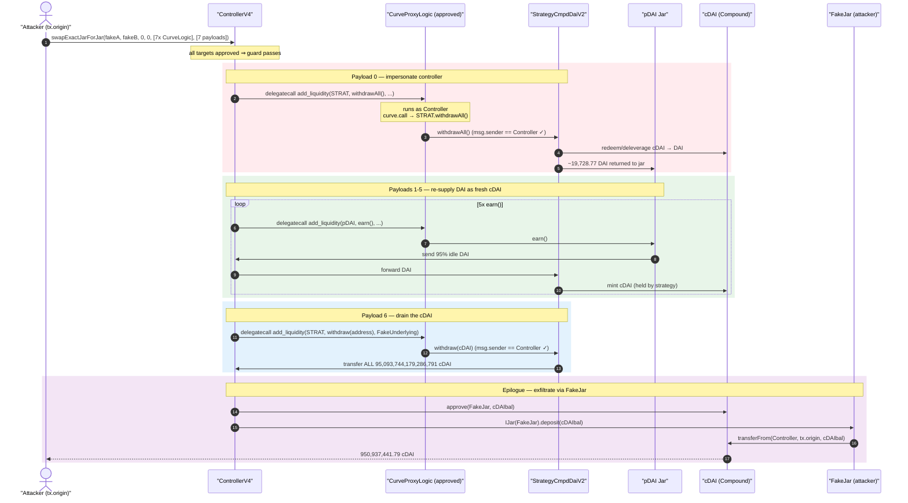
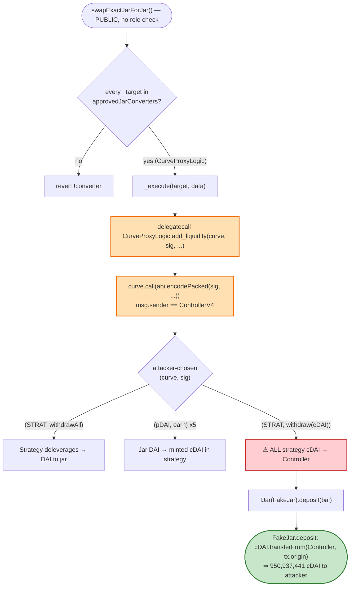
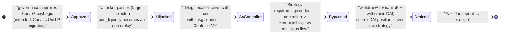

# Pickle Finance Exploit — Arbitrary `delegatecall` Through an Approved Jar Converter Drains the DAI pToken Strategy

> **Reproduction:** the PoC compiles & runs in an isolated Foundry project at
> [this project folder](.) (the umbrella DeFiHackLabs repo contains many unrelated
> PoCs that do not whole-compile, so this one was extracted).
> Full verbose trace: [output.txt](output.txt).
> Verified vulnerable source:
> [ControllerV4 `swapExactJarForJar` / `_execute`](sources/ControllerV4_684725/src_controller-v4.sol#L249-L368)
> and the approved converter
> [`CurveProxyLogic.add_liquidity`](sources/StrategyCmpdDaiV2_Cd892a/src_proxy-logic_curve.sol#L27-L54).

---

## Key info

| | |
|---|---|
| **Loss** | ~$19.7M (in the live attack, across multiple pTokens). This PoC reproduces the DAI-jar leg: **950,937,441.79 cDAI** (`95,093,744,179,286,791` raw, 8-dec) — the entire `StrategyCmpdDaiV2` cDAI position, ≈ 33,056 DAI of free jar liquidity plus the deleveraged Compound position |
| **Vulnerable contract** | `ControllerV4` — [`0x6847259b2B3A4c17e7c43C54409810aF48bA5210`](https://etherscan.io/address/0x6847259b2B3A4c17e7c43C54409810aF48bA5210#code) |
| **Attack primitive** | Approved jar converter `CurveProxyLogic` — [`0x6186E99D9CFb05E1Fdf1b442178806E81da21dD8`](https://etherscan.io/address/0x6186E99D9CFb05E1Fdf1b442178806E81da21dD8#code) |
| **Victim** | `pDAI` PickleJar — [`0x6949Bb624E8e8A90F87cD2058139fcd77D2F3F87`](https://etherscan.io/address/0x6949Bb624E8e8A90F87cD2058139fcd77D2F3F87) and `StrategyCmpdDaiV2` — [`0xCd892a97951d46615484359355e3Ed88131f829D`](https://etherscan.io/address/0xCd892a97951d46615484359355e3Ed88131f829D#code) |
| **Attacker EOA** | `0xbac8a476b95ec741e56561a66231f92bc88bb3a8` |
| **Attacker contract** | `0x2b0b02ce19c322b4dd55a3949b4fb6e9377f7913` |
| **Attack tx** | [`0xe72d4e7ba9b5af0cf2a8cfb1e30fd9f388df0ab3da79790be842bfbed11087b0`](https://etherscan.io/tx/0xe72d4e7ba9b5af0cf2a8cfb1e30fd9f388df0ab3da79790be842bfbed11087b0) |
| **Chain / block / date** | Ethereum mainnet / fork 11,303,122 / **2020-11-21** |
| **Compiler** | Solidity v0.6.7 (`b8d736ae`), optimizer 1 / 200 runs |
| **Bug class** | Arbitrary-call via attacker-controlled `delegatecall` (confused deputy) → access-control bypass on a privileged strategy |

---

## TL;DR

`ControllerV4.swapExactJarForJar()` lets a caller pass an array of `_targets`/`_data` pairs that
the Controller will run with `delegatecall` inside `_execute()`
([controller-v4.sol:336-368](sources/ControllerV4_684725/src_controller-v4.sol#L336-L368)). The only
restriction is that each target must be an **approved jar converter**.

`CurveProxyLogic` is one such approved converter. Its `add_liquidity()` ends with
`(bool success, ) = curve.call(callData)` — where **`curve`** (the target contract) and
**`curveFunctionSig`** (the 4-byte selector) are *fully attacker-controlled function arguments*
([curve.sol:27-54](sources/StrategyCmpdDaiV2_Cd892a/src_proxy-logic_curve.sol#L27-L54)).

Because `CurveProxyLogic.add_liquidity` is reached via `delegatecall` from the Controller, that
`curve.call(...)` executes **with `msg.sender == ControllerV4`**. The attacker has therefore turned
an approved "helper" into a universal proxy: *the Controller will call any function on any contract.*

Every privileged function on the DAI strategy/jar is gated by `require(msg.sender == controller)` (or
`== strategist || == governance`). By chaining seven crafted `add_liquidity` payloads the attacker makes
the Controller call, **in order**:

1. `StrategyCmpdDaiV2.withdrawAll()` — deleverages the whole Compound position back to DAI in the jar.
2. `pDAI.earn()` ×5 — re-supplies that DAI into Compound, minting fresh cDAI **into the strategy**.
3. `StrategyCmpdDaiV2.withdraw(address cdai)` — the "rescue stray tokens" function, which sends the
   *entire* cDAI balance to the Controller.

The cDAI now sits in the Controller. `swapExactJarForJar` finishes by depositing the proceeds into the
user-supplied `_toJar` and crediting `msg.sender`. The attacker supplies a **`FakeJar`** whose
`deposit()` simply runs `_token.transferFrom(controller, tx.origin, amount)` — walking the Controller's
950,937,441 cDAI straight to the attacker EOA.

---

## Background — Pickle's jar / controller / strategy architecture

Pickle Finance (a Yearn-style yield aggregator) splits responsibilities across three contracts per
asset:

- **PickleJar (`pToken`)** — the user-facing vault. Users `deposit()` DAI and receive `pDAI` shares;
  `earn()` pushes idle DAI to the controller for deployment
  ([pickle-jar.sol:71-94](sources/StrategyCmpdDaiV2_Cd892a/src_pickle-jar.sol#L71-L94)).
- **ControllerV4** — the router/treasurer. Holds approvals, routes funds between jars and strategies,
  and exposes `swapExactJarForJar()` to migrate a position from one jar to another via "converters"
  ([controller-v4.sol:249-334](sources/ControllerV4_684725/src_controller-v4.sol#L249-L334)).
- **StrategyCmpdDaiV2** — the yield engine. Supplies DAI to Compound's cDAI market and recursively
  leverages it ([strategy-cmpd-dai-v2.sol:262-335](sources/StrategyCmpdDaiV2_Cd892a/src_strategies_compound_strategy-cmpd-dai-v2.sol#L262-L335)).

The trust model is straightforward: **only the Controller may move strategy funds.** The strategy's
withdrawal functions all begin with `require(msg.sender == controller, "!controller")`
([strategy-base.sol:140-200](sources/StrategyCmpdDaiV2_Cd892a/src_strategies_strategy-base.sol#L140-L200)).
The whole exploit is about *impersonating the Controller.*

On-chain state at the fork block (read from the trace):

| Parameter | Value |
|---|---|
| DAI idle in `pDAI` jar | `33,056,685,566,163,458,742,326` ≈ **33,056.69 DAI** |
| Strategy cDAI position (final, after re-supply) | `95,093,744,179,286,791` ≈ **950,937,441.79 cDAI** |
| cDAI exchange rate (Compound) | `207,814,085,948,154,928,…` (≈ 0.02078 DAI/cDAI) |
| Approved converter (`CurveProxyLogic`) | `0x6186E99D9CFb05E1Fdf1b442178806E81da21dD8` |

---

## The vulnerable code

### 1. The Controller `delegatecall`s into attacker-named approved converters

```solidity
function swapExactJarForJar(
    address _fromJar, address _toJar,
    uint256 _fromJarAmount, uint256 _toJarMinAmount,
    address payable[] calldata _targets,
    bytes[] calldata _data
) external returns (uint256) {
    require(_targets.length == _data.length, "!length");
    for (uint256 i = 0; i < _targets.length; i++) {
        require(_targets[i] != address(0), "!converter");
        require(approvedJarConverters[_targets[i]], "!converter"); // ← ONLY guard
    }
    ...
    // Executes sequence of logic
    for (uint256 i = 0; i < _targets.length; i++) {
        _execute(_targets[i], _data[i]);     // ← attacker-chosen calldata
    }
    ...
}
```
([controller-v4.sol:249-317](sources/ControllerV4_684725/src_controller-v4.sol#L249-L317))

```solidity
function _execute(address _target, bytes memory _data) internal returns (bytes memory response) {
    require(_target != address(0), "!target");
    assembly {
        let succeeded := delegatecall(sub(gas(), 5000), _target,  // ⚠️ DELEGATECALL
                                      add(_data, 0x20), mload(_data), 0, 0)
        ...
    }
}
```
([controller-v4.sol:336-368](sources/ControllerV4_684725/src_controller-v4.sol#L336-L368))

The Controller assumes an approved converter is a *trusted, fixed-purpose* helper. But it `delegatecall`s
it with **arbitrary calldata**, so what the converter *does* is decided entirely by the caller.

### 2. The approved converter performs an attacker-parameterised low-level `call`

```solidity
function add_liquidity(
    address curve,                 // ⚠️ attacker-controlled target
    bytes4  curveFunctionSig,      // ⚠️ attacker-controlled selector
    uint256 curvePoolSize,
    uint256 curveUnderlyingIndex,
    address underlying
) public {
    uint256 underlyingAmount = IERC20(underlying).balanceOf(address(this));
    uint256[] memory liquidity = new uint256[](curvePoolSize);
    liquidity[curveUnderlyingIndex] = underlyingAmount;
    bytes memory callData = abi.encodePacked(curveFunctionSig, liquidity, uint256(0));
    ...
    (bool success, ) = curve.call(callData);   // ⚠️ Controller calls anyone, anything
    require(success, "!success");
}
```
([curve.sol:27-54](sources/StrategyCmpdDaiV2_Cd892a/src_proxy-logic_curve.sol#L27-L54))

Run via `delegatecall`, `address(this)` and `msg.sender` here are the **Controller's**. The
"curve pool" is whatever address the attacker passes, and the function "selector" is whatever 4 bytes
the attacker passes. The trailing `uint256[] + uint256(0)` argument tail is harmless for the
no-argument / single-address functions the attacker targets.

### 3. Every privileged sink the attacker invokes trusts `msg.sender == controller`

```solidity
// StrategyBase — the cDAI-stealing functions
function withdraw(IERC20 _asset) external returns (uint256 balance) {     // 0x51cff8d9
    require(msg.sender == controller, "!controller");
    require(want != address(_asset), "want");          // _asset = cDAI ≠ DAI ✓
    balance = _asset.balanceOf(address(this));
    _asset.safeTransfer(controller, balance);          // ← sends ALL cDAI to controller
}
function withdrawAll() external returns (uint256 balance) {                // 0x853828b6
    require(msg.sender == controller, "!controller");
    _withdrawAll();                                    // deleverage → DAI to jar
    ...
}
```
([strategy-base.sol:140-200](sources/StrategyCmpdDaiV2_Cd892a/src_strategies_strategy-base.sol#L140-L200))

---

## Root cause — why it was possible

The bug is a textbook **confused deputy via arbitrary `delegatecall`**, made exploitable by a chain of
unsafe design choices:

1. **`delegatecall` with caller-supplied calldata.** `_execute` runs an approved converter, but lets the
   caller dictate *which function and arguments* run. A converter is only safe if its behaviour is fixed;
   `CurveProxyLogic` parameterises both the call target and the selector.
2. **An approved converter that makes a fully parameterised low-level `call`.** `add_liquidity`'s
   `curve.call(abi.encodePacked(curveFunctionSig, …))` is an *open relay* — combined with (1) it lets the
   Controller call **any function on any address**. Effectively `approvedJarConverters[CurveProxyLogic]`
   grants the Controller's identity to anyone.
3. **Authorization keyed solely on `msg.sender == controller`.** The strategy/jar have no notion of
   *which* controller flow is calling — so the Controller acting as a malicious proxy is
   indistinguishable from a legitimate migration. `withdraw(address)` ("rescue stray tokens") will hand
   over the entire core cDAI position because the asset (cDAI) merely has to differ from `want` (DAI).
4. **Caller-supplied `_toJar` is trusted to be a real jar.** `swapExactJarForJar` ends by calling
   `IJar(_toJar).deposit(_toBal)` on an address the attacker chose
   ([controller-v4.sol:319-331](sources/ControllerV4_684725/src_controller-v4.sol#L319-L331)). The
   attacker's `FakeJar.deposit()` is the exfiltration hatch — it `transferFrom`s the Controller's cDAI to
   `tx.origin`.

Any single mitigation (fixed converter behaviour, no `delegatecall`, a stricter `withdraw` guard, or jar
allow-listing) would have broken the chain.

---

## Preconditions

- `CurveProxyLogic` is an **approved jar converter** (`approvedJarConverters[0x6186…] == true`). It was,
  for legitimate Curve→Uni LP migration.
- The DAI jar/strategy holds value — idle DAI in the jar and a leveraged cDAI position in the strategy.
  Both true at block 11,303,122.
- `swapExactJarForJar` is **permissionless** — no role check, anyone can call it
  ([controller-v4.sol:249](sources/ControllerV4_684725/src_controller-v4.sol#L249)).
- No working capital, flash loan, or price manipulation needed. The attack is a pure access-control
  bypass; the PoC funds nothing — it only deploys two fake helper contracts (`FakeJar`, `FakeUnderlying`).

---

## Attack walkthrough (with on-chain numbers from the trace)

The attacker calls `swapExactJarForJar(fakeJarA, fakeJarB, 0, 0, targets[7], datas[7])`
([Pickle_exp.sol:49](test/Pickle_exp.sol#L49)). All seven `targets[i]` are `CurveProxyLogic`; the
`datas[i]` are `add_liquidity(target, selector, 1, 0, underlying)` payloads whose embedded
`target`/`selector` redirect the Controller's identity. The decoded sequence from
[output.txt:40-2560](output.txt):

| # | `add_liquidity(curve, sig, …)` payload | What the Controller is forced to call | Effect (trace value) |
|---|---|---|---|
| 0 | `(STRAT, 0x853828b6=withdrawAll())` | `StrategyCmpdDaiV2.withdrawAll()` | Deleverages the Compound position; redeems cDAI → DAI; ~**19,728.77 DAI** minted/freed back into the `pDAI` jar; jar DAI now ≈ 52,785 (33,056 idle + freed) |
| 1 | `(pDAI, 0xd389800f=earn())` | `pDAI.earn()` | Jar sends 95% of idle DAI (**18,773.73 DAI**) → Controller → strategy → `cDAI.mint` |
| 2 | `(pDAI, earn())` | `pDAI.earn()` | **938.69 DAI** re-supplied |
| 3 | `(pDAI, earn())` | `pDAI.earn()` | **46.93 DAI** re-supplied |
| 4 | `(pDAI, earn())` | `pDAI.earn()` | **2.35 DAI** re-supplied |
| 5 | `(pDAI, earn())` | `pDAI.earn()` | **0.117 DAI** re-supplied — the 5 earns drain the jar's DAI into cDAI held by the strategy |
| 6 | `(STRAT, 0x51cff8d9=withdraw(address), underlying=FakeUnderlying→cDAI)` | `StrategyCmpdDaiV2.withdraw(cDAI)` | Strategy sends its **entire** cDAI balance `95,093,744,179,286,791` (950,937,441.79 cDAI) → Controller |
| 7 | *(epilogue, in `swapExactJarForJar` itself)* | `IJar(FakeJarB).deposit(_toBal)` | `FakeJar.deposit` → `cDAI.transferFrom(Controller, tx.origin, 95,093,744,179,286,791)` → **attacker EOA** |

A few subtleties confirmed in the trace:

- **The `withdraw(IERC20)` selector is `0x51cff8d9`** (Solidity picks the `address`-typed overload for the
  external ABI). The PoC passes a `FakeUnderlying` for `underlying`, whose `balanceOf(controller)`
  returns garbage and whose `approve/allowance` are no-ops — irrelevant, because the targeted `withdraw`
  reads `_asset.balanceOf(address(this))` on the **real** cDAI, not on `underlying`
  ([Pickle_exp.sol:60-64](test/Pickle_exp.sol#L60-L64), [output.txt:2511-2535](output.txt)).
- **Why `withdraw(cDAI)` passes the `want` guard:** `want == DAI`, asset `== cDAI`, so
  `require(want != _asset)` holds and the full cDAI balance is transferred to the controller
  ([strategy-base.sol:140-145](sources/StrategyCmpdDaiV2_Cd892a/src_strategies_strategy-base.sol#L140-L145)).
- **The exfiltration hatch:** `FakeJar.deposit(amount)` is `_token.transferFrom(msg.sender, tx.origin, amount)`
  ([Pickle_exp.sol:129-133](test/Pickle_exp.sol#L129-L133)). When the Controller calls it (and has just
  `approve`d the FakeJar for its cDAI at [output.txt:~2580](output.txt)), the cDAI lands on `tx.origin`,
  the attacker EOA `0x1804c8…` (the PoC's `DefaultSender`).

### Profit accounting

| | cDAI (8-dec) | ≈ DAI value |
|---|---:|---:|
| Attacker cDAI before | 0 | 0 |
| Attacker cDAI after | **95,093,744,179,286,791** (950,937,441.79) | ≈ **33,000+ DAI of jar** + the leveraged cDAI position |
| Net profit | the entire DAI-strategy cDAI position | this PoC leg of a ~$19.7M multi-jar drain |

Trace tail confirms: `After exploiting, Attacker cDAI Balance: 950937441.79286791`
([output.txt — final logs](output.txt)).

---

## Diagrams

### Sequence of the attack



### Control / identity hijack



### Why the access control fails — confused deputy



---

## Why each payload

- **`withdrawAll()` (payload 0):** the strategy's leveraged cDAI is not directly transferable as a clean
  balance; calling `withdrawAll()` first deleverages (redeem/repay loop) and returns DAI to the jar so it
  can be re-minted into a single, fully-owned cDAI lump.
- **`earn()` ×5 (payloads 1-5):** each `earn()` moves only `available() = 95%` of the jar's *current*
  idle DAI ([pickle-jar.sol:67-75](sources/StrategyCmpdDaiV2_Cd892a/src_pickle-jar.sol#L67-L75)).
  Five iterations geometrically drain the jar (95% → 99.75% → …), re-supplying essentially all DAI into
  Compound so the maximum cDAI accrues to the strategy before the grab.
- **`withdraw(address)` (payload 6):** the "inCaseStrategyTokenGetStuck" rescue path. It transfers the
  strategy's **whole** balance of any non-`want` token to the controller — and cDAI is non-`want`.
- **`FakeJar` / `FakeUnderlying`:** the `_toJar` deposit and the `underlying.balanceOf` lookups are the
  only places the Controller calls back into attacker code; the fakes turn the final `deposit` into a
  `transferFrom(...tx.origin...)` exfiltration and keep the surrounding bookkeeping from reverting.

---

## Remediation

1. **Never `delegatecall` (or low-level `call`) with caller-supplied calldata.** Replace the generic
   `_execute(target, data)` with **typed, fixed-signature** converter calls (e.g.,
   `IConverter(target).convert(...)`). A converter's behaviour must not be selectable by the caller.
2. **Remove open relays from converters.** `CurveProxyLogic.add_liquidity` must hard-code the curve pool
   interface it integrates with and never accept an arbitrary `(curve, selector)` pair. If a low-level
   call is unavoidable, allow-list the exact `(target, selector)` combinations.
3. **Strengthen privileged sinks beyond `msg.sender == controller`.** The rescue function
   `withdraw(IERC20)` should refuse to move the strategy's *core* yield-bearing token (cDAI), not only the
   underlying `want`. Restrict it to explicitly stray/airdropped assets, and prefer governance/timelock
   over the permissionless controller flow.
4. **Validate `_fromJar` / `_toJar` against the controller's `jars` registry** so `swapExactJarForJar`
   cannot deposit proceeds into an attacker-deployed `FakeJar`.
5. **Gate `swapExactJarForJar` itself** (or at least the converter-execution loop) and add reentrancy /
   balance-invariant checks so a "swap" cannot net-extract core protocol assets.

---

## How to reproduce

```bash
_shared/run_poc.sh 2020-11-Pickle_exp --mt testExploit -vvvvv
```

- RPC: an **Ethereum archive** endpoint is required (fork block 11,303,122, Nov 2020). Most public
  pruned RPCs will fail with `missing trie node`; use an archive provider.
- Result: `[PASS] testExploit()`.

Expected tail:

```
Ran 1 test for test/Pickle_exp.sol:AttackContract
[PASS] testExploit() (gas: 3713582)
Logs:
  Before exploiting, Attacker cDAI Balance: 0.00000000
  DAI balance on pDAI 33056685566163458742326
  After exploiting, Attacker cDAI Balance: 950937441.79286791

Suite result: ok. 1 passed; 0 failed; 0 skipped
```

---

*References: samczsun's reference exploit — https://github.com/banteg/evil-jar/blob/master/reference/samczsun.sol ;
DeFiHackLabs (Pickle Finance, Ethereum, ~$19.7M, 2020-11-21).*
