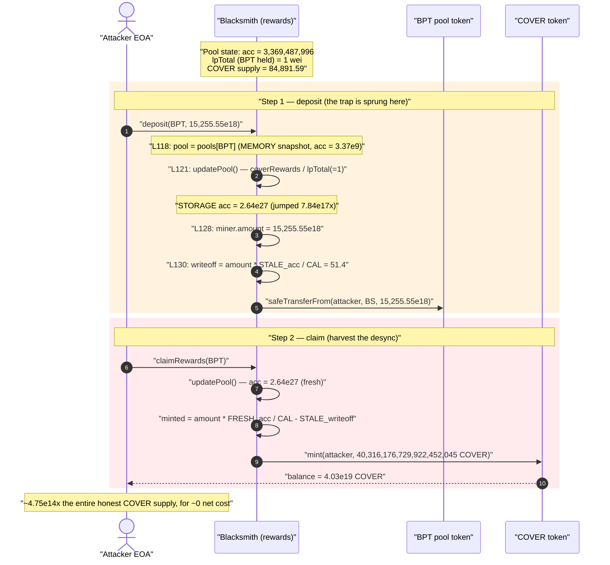
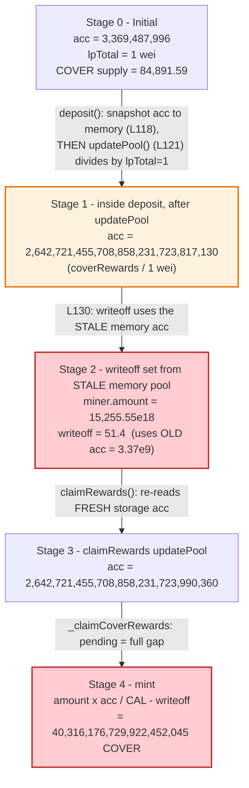
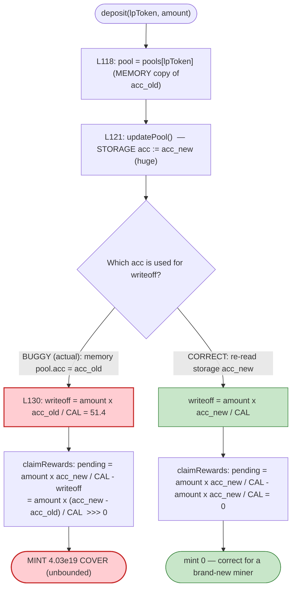

# Cover Protocol Exploit — Stale `Pool` Snapshot in `Blacksmith.deposit()` Mints ~40 Quintillion COVER

> **Vulnerability classes:** vuln/logic/incorrect-state-transition · vuln/oracle/stale-price

> **Reproduction:** the PoC compiles & runs in an isolated Foundry project at
> [this project folder](.) (the umbrella DeFiHackLabs repo contains many unrelated
> PoCs that do not whole-compile, so this one was extracted).
> Full verbose trace: [output.txt](output.txt).
> Verified vulnerable source: [contracts_Blacksmith.sol](sources/Blacksmith_E0B94a/contracts_Blacksmith.sol).

---

## Key info

| | |
|---|---|
| **Loss** | Effectively unbounded — attacker minted **40,316,176,729,922,452,045 COVER** (~4.03e19) against a real supply of ~84,891 COVER, collapsing the token (~$3M+ realised in the wild) |
| **Vulnerable contract** | `Blacksmith` (shield-mining) — [`0xE0B94a7BB45dD905c79bB1992C9879f40F1CAeD5`](https://etherscan.io/address/0xE0B94a7BB45dD905c79bB1992C9879f40F1CAeD5#code) |
| **Minted token** | `COVER` — [`0x5D8d9f5b96f4438195BE9b99eee6118Ed4304286`](https://etherscan.io/address/0x5D8d9f5b96f4438195BE9b99eee6118Ed4304286#code) |
| **Victim / pool** | Balancer 98/2 COVER-DAI BPT — [`0x59686E01Aa841f622a43688153062C2f24F8fDed`](https://etherscan.io/address/0x59686E01Aa841f622a43688153062C2f24F8fDed) (a thinly-seeded shield-mining pool) |
| **Attacker EOA (PoC actor)** | `0x00007569643bc1709561ec2E86F385Df3759e5DD` |
| **Chain / block / date** | Ethereum mainnet / fork at **11,542,309** / **2020-12-28** |
| **Compiler** | Victim contracts: Solidity **v0.7.4** (optimizer, 200 runs); PoC harness: 0.8.10 |
| **Bug class** | Stale in-memory accounting snapshot → reward-writeoff desync → unbounded token mint |

---

## TL;DR

`Blacksmith` is COVER's "shield mining" rewards contract. Each pool tracks an
ever-increasing `accRewardsPerToken`, and each miner stores a `rewardWriteoff` so
that on claim they receive `amount × accRewardsPerToken / CAL_MULTIPLIER −
rewardWriteoff`.

The `deposit()` function reads the pool struct into **memory** *before* it calls
`updatePool()`
([contracts_Blacksmith.sol:118-121](sources/Blacksmith_E0B94a/contracts_Blacksmith.sol#L118-L121)):

```solidity
Pool memory pool = pools[_lpToken];   // L118  ← snapshot of OLD accRewardsPerToken
...
updatePool(_lpToken);                 // L121  ← bumps STORAGE accRewardsPerToken (huge)
```

It then sets the miner's `rewardWriteoff` from the **stale memory snapshot**, not
from the freshly-updated storage value
([:130](sources/Blacksmith_E0B94a/contracts_Blacksmith.sol#L130)):

```solidity
miner.rewardWriteoff = miner.amount.mul(pool.accRewardsPerToken).div(CAL_MULTIPLIER);
//                                       ^^^^ memory `pool` = OLD value
```

So the miner is credited a writeoff computed against the **old, low**
`accRewardsPerToken`, while `claimRewards()` later reads the **new, high** storage
value. The gap is paid out as freshly minted COVER.

The gap is catastrophic because the pool was seeded with only **1 wei** of BPT, so
`updatePool()`'s `coverRewards.div(lpTotal)` divides by `1` and inflates
`accRewardsPerToken` by **~7.84 × 10¹⁷** in a single update
([:84](sources/Blacksmith_E0B94a/contracts_Blacksmith.sol#L84)).

Net effect in the PoC: a single `deposit` + `claimRewards` of 15,255 BPT mints
**40,316,176,729,922,452,045 COVER** — roughly **4.75 × 10¹⁴ ×** the entire honest
supply of the token.

---

## Background — what Blacksmith does

`Blacksmith` ([source](sources/Blacksmith_E0B94a/contracts_Blacksmith.sol)) is a
MasterChef-style rewards distributor that mints COVER to LPs who stake Balancer LP
tokens (BPT). It is the **only** address (besides the migrator) authorised to call
`COVER.mint()`
([contracts_COVER.sol:26-31](sources/COVER_5D8d9f/contracts_COVER.sol#L26-L31)):

```solidity
function mint(address _account, uint256 _amount) public {
    require(isReleased, "$COVER: not released");
    require(msg.sender == migrator || msg.sender == blacksmith, "$COVER: caller not migrator or Blacksmith");
    _mint(_account, _amount);
}
```

So whatever `Blacksmith` decides a miner has "earned," `COVER` mints — there is no
supply cap and no sanity bound on the per-claim amount. The entire safety of the
token rests on `Blacksmith`'s reward arithmetic being correct.

The reward accounting uses the standard accumulator pattern:

| Variable | Meaning |
|---|---|
| `pool.accRewardsPerToken` | Monotonically-increasing COVER-per-staked-token (×`CAL_MULTIPLIER`) |
| `miner.amount` | Miner's staked BPT |
| `miner.rewardWriteoff` | "Already-accounted" rewards baseline, set on every deposit/withdraw/claim |
| `CAL_MULTIPLIER` | `1e12` fixed-point scalar ([:28](sources/Blacksmith_E0B94a/contracts_Blacksmith.sol#L28)) |

Pending rewards = `miner.amount × pool.accRewardsPerToken / CAL_MULTIPLIER −
miner.rewardWriteoff`. The invariant that keeps this honest is: **`rewardWriteoff`
must always be set from the same `accRewardsPerToken` that a subsequent claim will
read.** `deposit()` breaks exactly that invariant.

On-chain parameters at the fork block:

| Parameter | Value |
|---|---|
| `weeklyTotal` | `654e18` COVER/week ([:24](sources/Blacksmith_E0B94a/contracts_Blacksmith.sol#L24)) |
| `CAL_MULTIPLIER` | `1e12` |
| `WEEK` | 604,800 s |
| COVER `totalSupply` before attack | **84,891.59 COVER** |
| BPT held by `Blacksmith` for this pool (`lpTotal`) | **1 wei** ← the detonator |
| Attacker's BPT deposit | 15,255.55 BPT (`15255552810089260015361`) |

---

## The vulnerable code

### 1. `updatePool` divides `coverRewards` by `lpTotal`

```solidity
function updatePool(address _lpToken) public override {
    Pool storage pool = pools[_lpToken];
    if (block.timestamp <= pool.lastUpdatedAt) return;
    uint256 lpTotal = IERC20(_lpToken).balanceOf(address(this));   // == 1 wei here
    if (lpTotal == 0) { pool.lastUpdatedAt = block.timestamp; return; }
    uint256 coverRewards = _calculateCoverRewardsForPeriod(pool);
    pool.accRewardsPerToken = pool.accRewardsPerToken.add(coverRewards.div(lpTotal)); // ⚠️ /1
    pool.lastUpdatedAt = block.timestamp;
    ...
}
```
([contracts_Blacksmith.sol:74-93](sources/Blacksmith_E0B94a/contracts_Blacksmith.sol#L74-L93))

With `lpTotal = 1`, the entire `coverRewards` for the period lands directly into
`accRewardsPerToken`, with no per-token normalisation. This is what turns
`accRewardsPerToken` from `3,369,487,996` into
`2,642,721,455,708,858,231,723,817,130` in one call (a **7.84e17×** jump — verified
against the storage diff in the trace).

### 2. `deposit` snapshots the pool BEFORE updating, then writes off against the stale snapshot

```solidity
function deposit(address _lpToken, uint256 _amount) external override {
    require(block.timestamp >= START_TIME , "Blacksmith: not started");
    require(_amount > 0, "Blacksmith: amount is 0");
    Pool memory pool = pools[_lpToken];        // L118 ⚠️ OLD accRewardsPerToken captured to MEMORY
    require(pool.lastUpdatedAt > 0, "Blacksmith: pool does not exists");
    require(IERC20(_lpToken).balanceOf(msg.sender) >= _amount, "Blacksmith: insufficient balance");
    updatePool(_lpToken);                      // L121 ⚠️ bumps STORAGE acc to a huge value
                                               //        (memory `pool` is now stale)
    Miner storage miner = miners[_lpToken][msg.sender];
    BonusToken memory bonusToken = bonusTokens[_lpToken];
    _claimCoverRewards(pool, miner);           // L125  uses stale memory `pool` (amount==0 ⇒ no mint)
    _claimBonus(bonusToken, miner);

    miner.amount = miner.amount.add(_amount);  // L128  miner now holds the stake
    // update writeoff to match current acc rewards/bonus per token
    miner.rewardWriteoff = miner.amount.mul(pool.accRewardsPerToken).div(CAL_MULTIPLIER); // L130 ⚠️ STALE acc
    ...
    IERC20(_lpToken).safeTransferFrom(msg.sender, address(this), _amount); // L133 stake pulled LAST
    emit Deposit(msg.sender, _lpToken, _amount);
}
```
([contracts_Blacksmith.sol:115-135](sources/Blacksmith_E0B94a/contracts_Blacksmith.sol#L115-L135))

The comment on line 129 literally says *"update writeoff to match current acc
rewards/bonus per token"* — but line 130 uses `pool.accRewardsPerToken` from the
**memory** copy taken on line 118, which is the value *before* `updatePool` ran.
The writeoff is therefore set against the OLD accumulator, while every later read
uses the NEW one.

### 3. `claimRewards` reads the fresh storage value and mints the difference

```solidity
function claimRewards(address _lpToken) public override {
    updatePool(_lpToken);                       // bumps acc again (84 more seconds)
    Pool memory pool = pools[_lpToken];         // FRESH high accRewardsPerToken
    Miner storage miner = miners[_lpToken][msg.sender];
    ...
    _claimCoverRewards(pool, miner);            // mints amount*FRESH_acc/CAL - STALE writeoff
    ...
}

function _claimCoverRewards(Pool memory pool, Miner memory miner) private nonReentrant {
    if (miner.amount > 0) {
        uint256 minedSinceLastUpdate =
            miner.amount.mul(pool.accRewardsPerToken).div(CAL_MULTIPLIER).sub(miner.rewardWriteoff);
        if (minedSinceLastUpdate > 0) {
            cover.mint(msg.sender, minedSinceLastUpdate);   // ⚠️ unbounded mint
        }
    }
}
```
([contracts_Blacksmith.sol:95-107](sources/Blacksmith_E0B94a/contracts_Blacksmith.sol#L95-L107),
[:314-321](sources/Blacksmith_E0B94a/contracts_Blacksmith.sol#L314-L321))

---

## Root cause — why it was possible

Two flaws compose into a critical, unbounded mint:

1. **Stale memory snapshot in `deposit()`.** The pool is copied to memory on
   [L118](sources/Blacksmith_E0B94a/contracts_Blacksmith.sol#L118) *before*
   `updatePool()` mutates storage on
   [L121](sources/Blacksmith_E0B94a/contracts_Blacksmith.sol#L121). The
   `rewardWriteoff` on
   [L130](sources/Blacksmith_E0B94a/contracts_Blacksmith.sol#L130) is then set from
   that stale copy. Correct code would re-read `pools[_lpToken]` (storage) *after*
   `updatePool`, exactly as `withdraw()` and `claimRewards()` re-read it. Compare
   `withdraw()`, which reads `Pool memory pool = pools[_lpToken]` **after**
   `updatePool` ([:141-143](sources/Blacksmith_E0B94a/contracts_Blacksmith.sol#L141-L143))
   — the asymmetry between `deposit` (snapshot-then-update) and `withdraw`
   (update-then-read) is the bug.

   > Pending rewards = `amount × acc / CAL − writeoff`. The protocol assumes
   > `writeoff = amount × acc / CAL` *at the moment of deposit*, so a brand-new
   > miner has zero pending. By writing off against the OLD `acc` while later
   > reading the NEW `acc`, the miner's "pending" becomes
   > `amount × (acc_new − acc_old) / CAL` — the full reward gap, paid as new COVER.

2. **Division by a `1 wei` pool total.** Because the pool's `lpTotal` was only
   1 wei, `coverRewards.div(lpTotal)` on
   [L84](sources/Blacksmith_E0B94a/contracts_Blacksmith.sol#L84) applied no
   meaningful per-token normalisation — the entire period reward (sized for a
   2.9%-weight pool over 84 s, ~`2.64e27`) became the per-token rate. This
   amplified `acc_new − acc_old` by ~7.84e17×, so even a modest stake produced a
   mint dwarfing the token's entire supply.

3. **No mint guard in `COVER.mint()`.** `COVER` mints whatever `Blacksmith` asks
   ([contracts_COVER.sol:26-31](sources/COVER_5D8d9f/contracts_COVER.sol#L26-L31)) —
   no cap, no per-call sanity bound. So the arithmetic error translates directly
   into ~4e19 freshly created tokens.

This is the canonical Cover Protocol "infinite mint" of December 28, 2020.

---

## Preconditions

- A registered pool whose `Blacksmith` BPT balance (`lpTotal`) is tiny (here
  **1 wei**) so that `updatePool` massively inflates `accRewardsPerToken`. Such a
  near-empty pool existed for the 98/2 COVER-DAI BPT.
- `block.timestamp >= START_TIME` (Nov 20 2020 ✓ at the Dec 28 fork block) and the
  pool exists (`lastUpdatedAt > 0`).
- The attacker holds enough BPT to deposit (15,255 BPT in the PoC; this is the *only*
  capital at risk — and it is returned by a later `withdraw`). No flash loan is even
  required.
- The attacker is a **fresh** miner in that pool (`miner.amount == 0` going in), so
  the deposit-path writeoff is set entirely against the stale low accumulator.

---

## Attack walkthrough (with on-chain numbers from the trace)

All figures are taken directly from the storage diffs and events in
[output.txt](output.txt). The pool is the BPT at
`0x59686E01Aa841f622a43688153062C2f24F8fDed`; `Blacksmith` held **1 wei** of it
before the deposit (`BPool.balanceOf(Blacksmith) → 1` at
[output.txt:78-79](output.txt#L78-L79)).

| # | Step | `accRewardsPerToken` | `miner.amount` | `miner.rewardWriteoff` | Notes |
|---|------|---------------------:|---------------:|-----------------------:|-------|
| 0 | **Initial** | `3,369,487,996` | 0 | 0 | Honest pool, `lpTotal = 1 wei`. COVER supply = 84,891.59. |
| 1 | `deposit(BPT, 15255.55e18)` → `updatePool` runs (84 s, `coverRewards / 1`) | **`2,642,721,455,708,858,231,723,817,130`** | — | — | `acc` jumps **7.84e17×** because `lpTotal = 1`. |
| 2 | …same `deposit` sets writeoff from the **stale memory** `pool` (still `acc ≈ 3.37e9`) | (unchanged) | `15,255.55e18` | **`51,403,402,065,939,829,310`** (≈51.4) | ⚠️ writeoff uses OLD acc, not the value from step 1. |
| 3 | `claimRewards(BPT)` → `updatePool` again (+84 s) | `2,642,721,455,708,858,231,723,990,360` | — | — | acc nudged slightly higher. |
| 4 | …`_claimCoverRewards` computes `amount×acc/CAL − writeoff` and mints | — | — | — | **mint = 40,316,176,729,922,452,045.196… COVER**. |

The mint formula, with the trace's exact numbers:

```
minted = miner.amount × acc_new / CAL_MULTIPLIER − rewardWriteoff
       = 15255552810089260015361 × 2642721455708858231723990360 / 1e12
         − 51403402065939829310
       = 40,316,176,729,922,452,045,196,567,18x   (matches the COVER Transfer event)
```

After the claim the attacker's COVER balance is
`40,316,176,729,922,452,045,213,336,697,791,916,580` wei (~4.03e19 COVER)
([output.txt:108-110](output.txt#L108-L110)) — the tiny extra over the minted
amount is a pre-existing 0.0168 COVER dust balance.

### Why the writeoff being stale is decisive

Had `deposit` re-read the pool from storage after `updatePool` (as a correct
implementation does), the writeoff would have been
`amount × acc_new / CAL ≈ 4.03e19` — exactly cancelling the claim, yielding **zero**
pending. Instead it was `amount × acc_old / CAL ≈ 51.4`, so almost the entire
`4.03e19` survives as "pending" and is minted.

### Profit / loss accounting

| Item | Amount |
|---|---|
| Attacker capital deposited (BPT) | 15,255.55 BPT (recoverable via `withdraw`) |
| **COVER minted out of thin air** | **40,316,176,729,922,452,045 COVER** (~4.03e19) |
| Honest COVER total supply before | 84,891.59 COVER |
| Mint as a multiple of total supply | **≈ 4.75 × 10¹⁴ ×** the entire supply |

The minted COVER is then sold against COVER's market liquidity; in the live incident
this realised on the order of millions of USD before the token price collapsed to
near-zero. (The PoC stops after demonstrating the mint, which is the root harm.)

---

## Diagrams

### Sequence of the attack



### Pool / accumulator state evolution



### Why the writeoff is wrong — correct vs. buggy `deposit`



---

## Remediation

1. **Re-read the pool from storage after `updatePool()`.** In `deposit()`, move the
   `Pool` read to *after* the `updatePool(_lpToken)` call (or read it from storage
   when computing the writeoff), so `rewardWriteoff` is computed from the same
   `accRewardsPerToken` that subsequent claims will read. The one-line fix that
   actually shipped in Cover's patch was to take the snapshot *after* the update.

   ```diff
   - Pool memory pool = pools[_lpToken];
     require(pool.lastUpdatedAt > 0, "Blacksmith: pool does not exists");
     require(IERC20(_lpToken).balanceOf(msg.sender) >= _amount, "...");
     updatePool(_lpToken);
   + Pool memory pool = pools[_lpToken];   // re-read AFTER updatePool
   ```

   (Equivalently, set `miner.rewardWriteoff` directly from
   `pools[_lpToken].accRewardsPerToken` storage, never from a pre-update memory copy.)

2. **Make the reward accumulator robust to tiny `lpTotal`.** Dividing
   `coverRewards` by `lpTotal = 1 wei` produces an astronomically large
   per-token rate. Either (a) skip/seed pools so `lpTotal` can never sit at a few
   wei while rewards accrue, or (b) require a sane minimum staked total before
   rewards accrue, or (c) reorder so the depositor's stake is counted before the
   accrual division.

3. **Cap or sanity-bound minting.** `COVER.mint()` should enforce a hard supply cap
   and/or a per-call/per-block bound. A single mint of ~4.75e14× the total supply
   should be impossible by construction, independent of any Blacksmith bug.

4. **Make `deposit`/`withdraw`/`claim` accounting symmetric.** `withdraw` and
   `claimRewards` already read the pool *after* `updatePool`; `deposit` did not.
   Enforce one shared internal helper for "settle pending + reset writeoff" so the
   three entry points cannot drift apart.

---

## How to reproduce

The PoC was extracted into a standalone Foundry project (the umbrella DeFiHackLabs
repo has many unrelated PoCs that fail to compile under a whole-project `forge`
build):

```bash
_shared/run_poc.sh 2020-12-Cover_exp -vvvvv
```

- RPC: an Ethereum **mainnet archive** endpoint is required (fork block 11,542,309,
  Dec 28 2020). `foundry.toml`'s `mainnet` alias must point at an archive node that
  serves historical state at that block.
- The PoC simply `prank`s the original attacker EOA, `deposit`s 15,255.55 BPT and
  `claimRewards` — no `deal`, no flash loan.

Expected tail ([output.txt:60-115](output.txt#L60-L115)):

```
Ran 1 test for test/Cover_exp.sol:ContractTest
[PASS] test() (gas: 140811)
Logs:
  Deposit BPT: 15255552810089260015361
  After claimRewards, Cover Balance: 40316176729922452045213336697791916580
Suite result: ok. 1 passed; 0 failed; 0 skipped
```

The `After claimRewards, Cover Balance` of ~4.03e19 COVER against a real supply of
~84,891 COVER is the exploit: a single deposit/claim minted hundreds of trillions of
times the entire token supply.

---

*Reference: the Cover Protocol "infinite mint" of 2020-12-28. The patched
`deposit()` moved the `Pool` snapshot to after `updatePool()`.*
