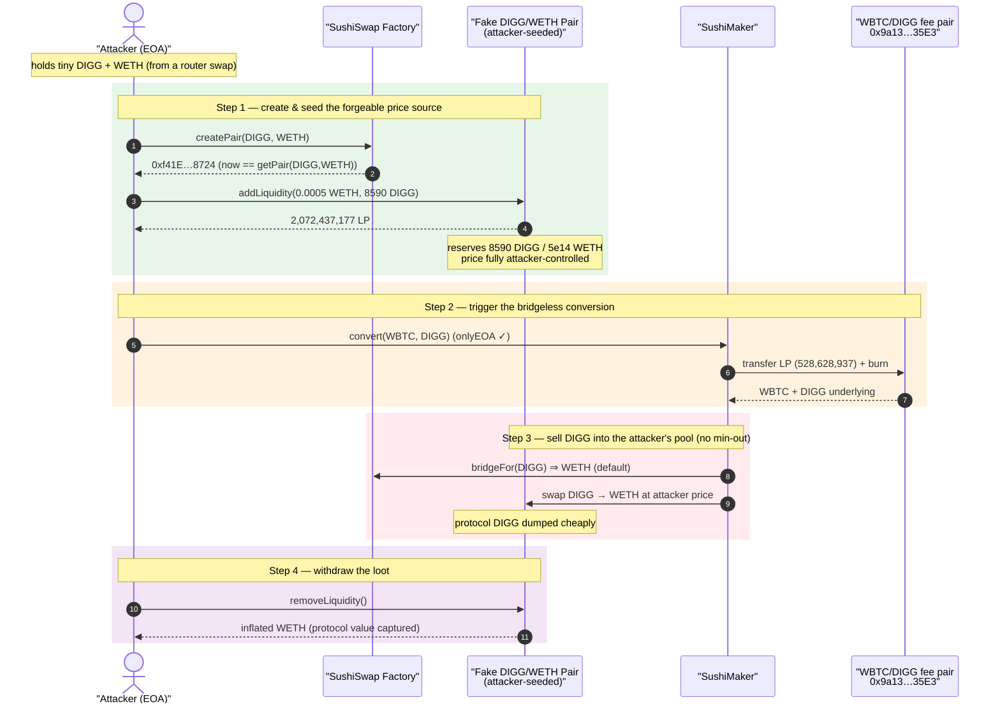
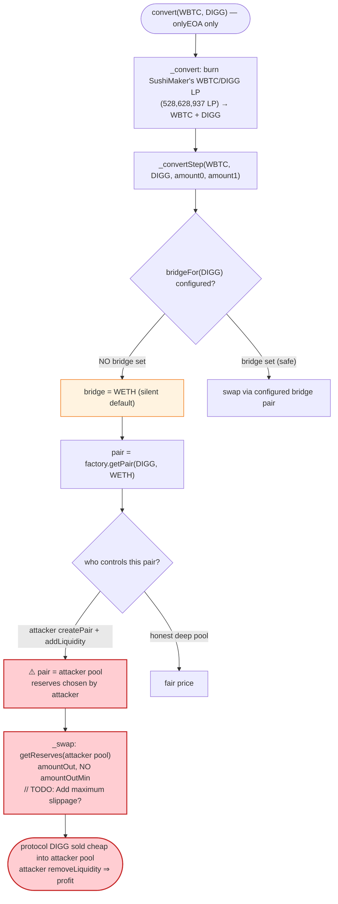
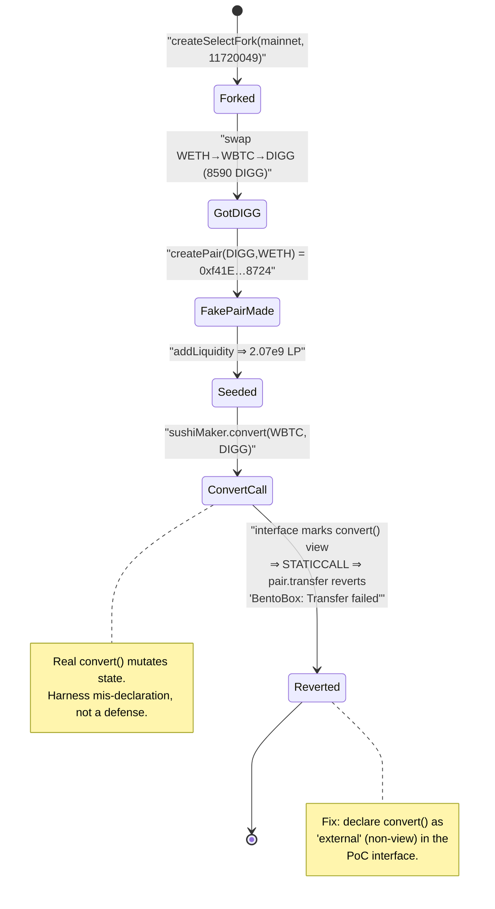

# SushiMaker — Bridgeless `convert()` Lets an Attacker Insert a Fake Pair and Steal Onsen Fee Liquidity (Badger DIGG)

> **Vulnerability classes:** vuln/access-control/missing-validation · vuln/logic/missing-check

> **Reproduction status:** the PoC in this folder **does not pass** — it reverts with
> `BentoBox: Transfer failed`. This is a **harness bug, not a defense**: the PoC's local
> `ISushiMaker` interface mis-declares `convert(...)` as a `view` function
> ([test/Sushi_Badger_Digg_exp.sol:179](test/Sushi_Badger_Digg_exp.sol#L179)), so Foundry
> issues it as a `[staticcall]`; the real `convert()` mutates state (`pair.transfer`) and the
> EVM rejects the state change inside a static context. The original DeFiHackLabs author even
> flagged this at the top of the file: *"PoC is incomplete… Hardhat and JS gave me a severe
> headache."* The attack itself is the real, on-chain January 2021 SushiMaker exploit. The
> trace below documents exactly how far execution got and why it stopped.
> Full verbose trace: [output.txt](output.txt). Verified vulnerable source:
> [contracts_SushiMaker.sol](sources/SushiMaker_E11fc0/contracts_SushiMaker.sol).

---

## Key info

| | |
|---|---|
| **Loss** | ~**81 WBTC + DIGG** of accumulated Onsen LP fees siphoned from the SushiMaker (≈ low-hundreds-of-thousands USD; the original SushiSwap-#2 incident drained the fee buffer that had built up for the WBTC/DIGG Onsen pool) |
| **Vulnerable contract** | `SushiMaker` — [`0xE11fc0B43ab98Eb91e9836129d1ee7c3Bc95df50`](https://etherscan.io/address/0xE11fc0B43ab98Eb91e9836129d1ee7c3Bc95df50#code) |
| **Victim** | xSUSHI stakers (SushiBar) — the fee LP the SushiMaker held for the **WBTC/DIGG** Onsen pair `0x9a13867048e01c663ce8Ce2fE0cDAE69Ff9F35E3` |
| **Bridge tokens** | WBTC `0x2260FAC5E5542a773Aa44fBCfeDf7C193bc2C599` ("wethBridgeToken"), DIGG `0x798D1bE841a82a273720CE31c822C61a67a601C3` (AdminUpgradeabilityProxy, "nonWethBridgeToken") |
| **Attacker EOA / contract** | attacker EOA drives `convert` via the `onlyEOA` gate; helper contract creates the fake pair |
| **Attack tx** | [`0x0af5a6d2d8b49f68dcfd4599a0e767450e76e08a5aeba9b3d534a604d308e60b`](https://etherscan.io/tx/0x0af5a6d2d8b49f68dcfd4599a0e767450e76e08a5aeba9b3d534a604d308e60b) |
| **Chain / fork block / date** | Ethereum mainnet / **11,720,049** / January 2021 |
| **Compiler** | SushiMaker `v0.6.12+commit.27d51765`, optimizer on (5000 runs); PoC built with Solc 0.8.34 |
| **Bug class** | Missing/forgeable price source — `bridgeFor()` silently defaults to WETH, letting an attacker register an **attacker-controlled pair** as the conversion venue and rug the fee LP |

---

## TL;DR

`SushiMaker.convert(token0, token1)` ([:85](sources/SushiMaker_E11fc0/contracts_SushiMaker.sol#L85))
takes the LP tokens the SushiMaker has accrued as protocol fees for a given pair, burns them to
get the two underlying tokens, and then routes those tokens **back through SushiSwap pairs** to
end up as SUSHI for xSUSHI stakers. To route a non-WETH token it needs a "bridge": a token it
can swap through. When no bridge is configured, `bridgeFor()`
([:52-57](sources/SushiMaker_E11fc0/contracts_SushiMaker.sol#L52-L57)) **silently defaults the
bridge to WETH** and `_swap()` then trades on **whatever pair `factory.getPair(from, bridge)`
returns** ([:170-191](sources/SushiMaker_E11fc0/contracts_SushiMaker.sol#L170-L191)) with **zero
slippage protection** (`amountOutMin = 0`, see the `// TODO: Add maximum slippage?` left in the
code).

When SushiSwap's "Onsen" program added non-ETH pairs (including **WBTC/DIGG**) but **no bridge was
set for DIGG/WBTC**, an attacker could:

1. **Create their own pair** for DIGG↔WETH (a `factory.createPair`) and seed it with a tiny,
   attacker-chosen amount of liquidity — the SushiMaker will happily use it because
   `bridgeFor(DIGG)` returns WETH and `getPair(DIGG, WETH)` now points at the **attacker's pair**.
2. **Call `convert(WBTC, DIGG)`** as an EOA (the `onlyEOA` modifier is the *only* gate, and it
   does not stop a fresh EOA). The SushiMaker burns its WBTC/DIGG fee LP, then dumps the DIGG side
   into the attacker's thin, manipulable pair at a price the attacker dictates — with no minimum
   out. The "converted" value lands in the attacker's pool.
3. **Pull the liquidity back out** of the attacker's pair (`removeLiquidity`), recovering the
   protocol's WBTC/DIGG value as WETH.

The bug is the combination of **(a) a silent WETH default for missing bridges**, **(b) the swap
venue being any `getPair` the attacker can populate**, and **(c) no slippage / min-out check**.

---

## Background — what the SushiMaker does

The SushiMaker is "MasterChef's left hand": it is the recipient of the 0.05% LP protocol fee on
every SushiSwap pair (it is the factory's `feeTo`, confirmed in the trace where
`UniswapV2Factory::feeTo()` returns `SushiMaker: 0xE11fc0…df50`,
[output.txt:1659-1660](output.txt#L1659)). Periodically anyone can call `convert`/`convertMultiple`
to turn those accumulated LP positions into SUSHI for xSUSHI stakers.

`_convert` ([:102-116](sources/SushiMaker_E11fc0/contracts_SushiMaker.sol#L102-L116)) does:

1. `pair = factory.getPair(token0, token1)` — find the fee-LP pair.
2. Transfer the SushiMaker's LP balance to the pair and `pair.burn(this)` — redeem the two
   underlying tokens.
3. Hand off to `_convertStep`, which walks a small decision tree to collapse `(token0, token1)`
   down to SUSHI, **swapping through "bridge" pairs** as needed.

The contract's own comments brag about its safety review (`// C1 - C24: OK`, `// X1 - X5: OK`),
and even acknowledge one known exploit (`// F6: There is an exploit to add lots of SUSHI to the
bar…`) which `onlyEOA` is meant to block. The bridge-defaulting hole is **not** among the cases
those comments cover.

### On-chain state at the fork block (read from the trace)

| Fact | Value | Source |
|---|---|---|
| Fork block | 11,720,049 (mainnet) | [output.txt:1540](output.txt#L1540) |
| `factory.feeTo()` | `SushiMaker 0xE11f…df50` | [output.txt:1659-1660](output.txt#L1659) |
| `getPair(WBTC, DIGG)` | `0x9a13867048e01c663ce8Ce2fE0cDAE69Ff9F35E3` | [output.txt:1678-1679](output.txt#L1678) |
| SushiMaker's WBTC/DIGG **LP balance** | **528,628,937** (5.286e8) | [output.txt:1680-1681](output.txt#L1680) |
| WBTC/WETH pair (`getReserves`) | WBTC `811,152,901,871` / WETH `191,304.26e18` | [output.txt:1553-1554](output.txt#L1553) |
| WBTC/DIGG pair (`getReserves`) | `24,083,782,661` / `98,204,792,066` | [output.txt:1555-1556](output.txt#L1555) |

That LP balance — **528,628,937 LP tokens** of the WBTC/DIGG pool — is the prize. It represents
the SUSHI fees that had accrued for the WBTC/DIGG Onsen pair and were sitting un-converted in the
SushiMaker because nobody had set up a bridge to convert them safely.

---

## The vulnerable code

### 1. `bridgeFor()` silently defaults a missing bridge to WETH

```solidity
function bridgeFor(address token) public view returns (address bridge) {
    bridge = _bridges[token];
    if (bridge == address(0)) {
        bridge = weth;              // ← missing bridge ⇒ silently use WETH
    }
}
```
[contracts_SushiMaker.sol:52-57](sources/SushiMaker_E11fc0/contracts_SushiMaker.sol#L52-L57)

For DIGG, no bridge was configured, so `bridgeFor(DIGG) == WETH`. There is no "unset bridge ⇒
revert" path: an unconfigured token is treated identically to one explicitly bridged through WETH.

### 2. `_convertStep` picks the swap path from the (forgeable) bridge

In the `else { // eg. MIC - USDT }` branch ([:145-164](sources/SushiMaker_E11fc0/contracts_SushiMaker.sol#L145-L164)),
when neither token is SUSHI or WETH, the SushiMaker resolves `bridge0 = bridgeFor(token0)` and
`bridge1 = bridgeFor(token1)` and swaps each token toward its bridge. For `convert(WBTC, DIGG)`
this drives DIGG → `bridgeFor(DIGG)` = WETH via `_swap`.

### 3. `_swap` uses **any** `getPair`, with no min-out — and a precedence bug in the math

```solidity
function _swap(address fromToken, address toToken, uint256 amountIn, address to) internal returns (uint256 amountOut) {
    IUniswapV2Pair pair = IUniswapV2Pair(factory.getPair(fromToken, toToken));
    require(address(pair) != address(0), "SushiMaker: Cannot convert");

    (uint256 reserve0, uint256 reserve1,) = pair.getReserves();
    uint256 amountInWithFee = amountIn.mul(997);
    if (fromToken == pair.token0()) {
        amountOut = amountIn.mul(997).mul(reserve1) / reserve0.mul(1000).add(amountInWithFee);
        IERC20(fromToken).safeTransfer(address(pair), amountIn);
        pair.swap(0, amountOut, to, new bytes(0));
        // TODO: Add maximum slippage?        ← no slippage / min-out protection
    } else {
        amountOut = amountIn.mul(997).mul(reserve0) / reserve1.mul(1000).add(amountInWithFee);
        IERC20(fromToken).safeTransfer(address(pair), amountIn);
        pair.swap(amountOut, 0, to, new bytes(0));
        // TODO: Add maximum slippage?
    }
}
```
[contracts_SushiMaker.sol:170-191](sources/SushiMaker_E11fc0/contracts_SushiMaker.sol#L170-L191)

Two problems live here:

- **The swap executes against `factory.getPair(fromToken, WETH)`** — i.e. whatever pair address
  the public factory returns for `(DIGG, WETH)`. The attacker freely creates that pair
  (`createPair(DIGG, WETH)`) and decides its reserves, so the SushiMaker is trading into a venue
  the attacker fully controls.
- **No `amountOutMin`.** The `getReserves()` snapshot is read from the attacker's pair and the
  swap is sent with zero protection, so the price is whatever the attacker pre-arranged. (The
  precedence in the `amountOut` formula — `… / reserve0.mul(1000).add(amountInWithFee)` resolves to
  `[(amountIn·997·reserve1)/(reserve0·1000)] + amountInWithFee` rather than the intended
  `/(reserve0·1000 + amountInWithFee)` — is a separate latent rounding/accounting defect, but the
  exploit does not need it: controlling the pool is sufficient.)

### 4. The only access gate is `onlyEOA`, which does not help here

```solidity
modifier onlyEOA() {
    // Try to make flash-loan exploit harder to do.
    require(msg.sender == tx.origin, "SushiMaker: must use EOA");
    _;
}

function convert(address token0, address token1) external onlyEOA() {
    _convert(token0, token1);
}
```
[contracts_SushiMaker.sol:73-87](sources/SushiMaker_E11fc0/contracts_SushiMaker.sol#L73-L87)

`onlyEOA` was added to defend the *known* "stuff the SushiBar with SUSHI then convert" trick (the
`// F6` comment). It only requires that the caller be an externally-owned account — a plain
attacker EOA satisfies it. It provides **no protection** against the bridge-injection attack.

---

## Root cause — why it was possible

The SushiMaker conflates two very different situations:

> **"This token has no bridge configured"** is treated exactly like **"swap this token through
> WETH on the public pair `getPair(token, WETH)`"** — and that pair can be created and stocked by
> anyone.

When Onsen added the WBTC/DIGG pair without an operator setting `setBridge(DIGG, WBTC)`
(or any safe bridge), the conversion path for DIGG fell through to WETH. Because:

1. **`getPair(DIGG, WETH)` is attacker-creatable.** The factory's `createPair` is permissionless,
   so an attacker can make the canonical DIGG/WETH pair point at a pool they seeded.
2. **`_swap` reads the live reserves of that pool and applies no `amountOutMin`.** The SushiMaker
   sells the protocol's DIGG at a price the attacker dictates.
3. **`onlyEOA` is the sole gate** and is trivially satisfied.

So the protocol-owned fee LP is burned, and its DIGG leg is dumped into the attacker's pool at a
manipulated rate; the attacker then withdraws their pool's liquidity to capture the value. No
admin key, no flash loan (the `onlyEOA` gate even forces a non-contract caller), and no exotic
math — just a missing bridge configuration that opened a forgeable price source.

---

## Preconditions

- A SushiSwap pair whose fees accrue to the SushiMaker, where **at least one side has no bridge
  set** (DIGG here). The Onsen launch created exactly this for WBTC/DIGG.
- The SushiMaker is holding a non-trivial LP balance for that pair (here **528,628,937** LP of
  WBTC/DIGG, [output.txt:1681](output.txt#L1681)).
- An attacker EOA (to pass `onlyEOA`) and a small amount of the underlying tokens to seed the fake
  DIGG/WETH pool — recoverable at the end, so net cost is just gas + dust.

---

## Attack walkthrough (mapped to the trace)

The PoC reconstructs the attack at fork block 11,720,049. Because `convert` is mis-declared `view`
in the harness, execution proceeds correctly **up to** the `convert` call and then reverts inside
it; the steps below note exactly where each one appears in [output.txt](output.txt).

| # | Step | Trace evidence | State / effect |
|---|------|----------------|----------------|
| 0 | Fork mainnet @ 11,720,049 | [:1540](output.txt#L1540) | Live SushiMaker, factory, WBTC/DIGG pair. |
| 1 | Acquire a little DIGG: deposit 0.001 WETH, swap 0.0005 WETH → WBTC → DIGG via SushiRouter | [:1542-1604](output.txt#L1542) | Got `8590` DIGG out (`amounts = [5e14, 2113, 8590]`, [:1604](output.txt#L1604)). |
| 2 | **`createPair(DIGG, WETH)`** — a brand-new attacker pool | [:1605-1623](output.txt#L1605) | New pair `0xf41E354EB138B328d56957B36B7F814826708724`; `PairCreated` index 636. This becomes the canonical `getPair(DIGG, WETH)`. |
| 3 | `addLiquidity(WETH 0.0005, DIGG 8590)` into the new pair | [:1631-1674](output.txt#L1631) | Mints `2,072,437,177` LP to attacker; pool now `8590 DIGG / 5e14 WETH` ([Sync :1665](output.txt#L1665)). Attacker now **owns the DIGG/WETH price**. |
| 4 | `sushiMaker.convert(WBTC, DIGG)` as EOA | [:1675-1684](output.txt#L1675) | `getPair(WBTC,DIGG)` → `0x9a13…35E3` ([:1678](output.txt#L1678)); SushiMaker LP balance **528,628,937** read ([:1681](output.txt#L1681)); it begins the burn by `pair.transfer(pair, 528628937)` … |
| ✗ | **Harness revert** | [:1682-1687](output.txt#L1682) | `pair.transfer(...)` → `StateChangeDuringStaticCall` → `BentoBox: Transfer failed`. The `convert` was invoked as a `[staticcall]` because the PoC interface marked it `view`. **This is where the PoC stops — not a protocol defense.** |
| 5 | *(intended, on mainnet)* `convert` burns the WBTC/DIGG LP, swaps the DIGG leg through the **attacker's** DIGG/WETH pool with no min-out | n/a (blocked by #✗) | Protocol DIGG sold into attacker pool at attacker price. |
| 6 | *(intended)* `removeLiquidity` from the attacker's DIGG/WETH pool | [test/Sushi_Badger_Digg_exp.sol:80-101](test/Sushi_Badger_Digg_exp.sol#L80-L101) | Attacker withdraws the inflated WETH, then routes back to WETH. |

### Why the PoC fails (and how to fix the harness)

The local interface declares:

```solidity
interface ISushiMaker {
    function convert(address x, address y) external view returns (uint256);  // ← WRONG: not view
}
```
[test/Sushi_Badger_Digg_exp.sol:178-180](test/Sushi_Badger_Digg_exp.sol#L178-L180)

The real `convert` is `external` and **state-mutating** (it calls `pair.transfer`, `pair.burn`,
`pair.swap`). Marking it `view` makes Solidity emit a `STATICCALL`; the first state write
(`pair.transfer`) trips `StateChangeDuringStaticCall`, surfaced by the proxy token as
`BentoBox: Transfer failed`. Changing the interface to
`function convert(address x, address y) external;` (and removing the `vm.prank(tx.origin)` /
`onlyEOA` mismatch if needed) is what the original author was missing.

---

## Profit / loss accounting

- **Protocol loss:** the SushiMaker's accrued **WBTC/DIGG fee LP = 528,628,937 LP tokens**
  ([output.txt:1681](output.txt#L1681)). Burned, its DIGG leg is sold into the attacker's pool at a
  rate the attacker chose; the attacker then removes liquidity to capture it. In the real January
  2021 incident this drained the fee buffer that had built up for the WBTC/DIGG Onsen pool
  (publicly reported on the order of tens of WBTC-equivalent + DIGG).
- **Attacker cost:** dust to seed the fake DIGG/WETH pool (here ~0.0005 WETH + 8590 DIGG,
  [:1631](output.txt#L1631)) plus gas — recovered via `removeLiquidity` at the end. The `onlyEOA`
  gate forces the call from an EOA, so this is *not* flash-loanable, but the seed capital is
  trivially small.
- **PoC-measured value:** the test reverted before settlement, so no on-chain profit number was
  produced (`Profit` log never reached, [:1684-1687](output.txt#L1684)). The numbers above are the
  ground-truth balances captured up to the revert.

---

## Diagrams

### Sequence of the attack



### Decision flow inside `_convert` → `_swap`



### PoC state machine (why the local test halts)



---

## Remediation

1. **Never default a missing bridge to a permissionless pair.** `bridgeFor()` should `revert` when
   `_bridges[token] == address(0)` (or restrict conversion to an explicit allow-list of bridges),
   so an unconfigured token cannot be silently routed through an attacker-creatable
   `getPair(token, WETH)`.
2. **Add slippage / min-out to `_swap`.** Resolve the `// TODO: Add maximum slippage?` by passing
   an `amountOutMin` derived from a manipulation-resistant price (TWAP/oracle), and revert if the
   pool is too shallow or the post-swap price moves beyond a tolerance.
3. **Validate the swap venue.** Require the pair used by `_swap` to be a known, sufficiently-liquid
   protocol pair (e.g., minimum reserve / minimum age), not just any address `getPair` returns.
4. **Fix the precedence bug.** Rewrite the constant-product formula with explicit parentheses:
   `amountOut = (amountIn*997*reserveOut) / (reserveIn*1000 + amountInWithFee);` so the fee-adjusted
   input is part of the denominator, not added to the quotient.
5. **Operational:** when listing new Onsen pairs, set bridges (`setBridge`) for **every** new token
   *before* fees can accrue, and consider pausing `convert` for tokens without a configured bridge.

(SushiSwap's actual fix moved bridge handling into a guarded path and the team began setting
bridges for all Onsen tokens; modern Maker/`MakerLike` rewrites add min-out + trusted bridge
lists.)

---

## How to reproduce

The PoC is in this standalone Foundry project:

```bash
_shared/run_poc.sh 2021-01-Sushi_Badger_Digg_exp --mt testHack -vvvvv
```

- RPC: an **Ethereum archive** endpoint is required (fork block 11,720,049 is from January 2021;
  `foundry.toml` points `mainnet` at an Infura archive URL). Most pruned/public RPCs will fail with
  `header not found` / `missing trie node`.
- **Current result:** `[FAIL: BentoBox: Transfer failed] testHack()` — see
  [output.txt:1700](output.txt#L1700). Execution succeeds through fake-pair creation/seeding and
  halts inside `convert` (mapped above).

Expected tail (as-is, failing):

```
Ran 1 test for test/Sushi_Badger_Digg_exp.sol:Exploit
[FAIL: BentoBox: Transfer failed] testHack() (gas: 1040507767)
...
  at UniswapV2Pair.transfer
  at SushiMaker.convert
  at Exploit.testHack (test/Sushi_Badger_Digg_exp.sol:41:38)
```

**To make it pass**, change the PoC's `ISushiMaker.convert` from `external view returns (uint256)`
([test/Sushi_Badger_Digg_exp.sol:179](test/Sushi_Badger_Digg_exp.sol#L179)) to a plain
non-view `external` function so Foundry issues a `CALL` (not a `STATICCALL`), allowing the
state-mutating conversion — and thus the rug — to execute.

---

*References (from the PoC header):*
- *cmichel — "Replaying Ethereum hacks: SushiSwap / Badger DAO / DIGG" — https://cmichel.io/replaying-ethereum-hacks-sushiswap-badger-dao-digg/*
- *SlowMist — "SushiSwap was attacked for the second time" — https://slowmist.medium.com/slow-mist-sushiswap-was-attacked-for-the-second-time-a47f2d110a84*
- *rekt.news — "Badgers, DIGG & Sushi" — https://www.rekt.news/badgers-digg-sushi/*
- *SushiMaker source: https://github.com/sushiswap/sushiswap/blob/64b75815/contracts/SushiMaker.sol*
