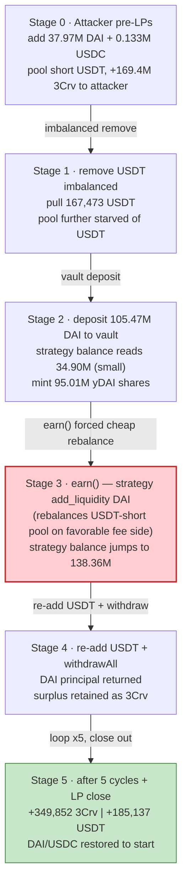
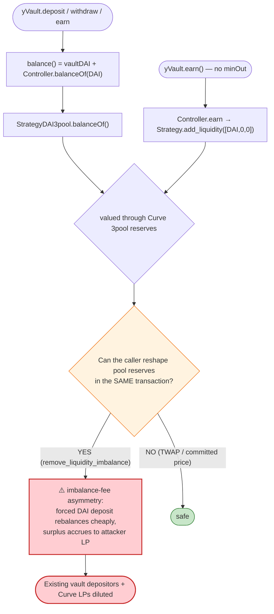

# Yearn yDAI v1 Exploit — Curve-Backed Vault Share-Price Manipulation

> **Reproduction:** the PoC compiles & runs in an isolated Foundry project at
> [this project folder](.) (the umbrella DeFiHackLabs repo contains many unrelated PoCs that do not
> all compile together, so this one was extracted into a standalone project).
> Full verbose trace: [output.txt](output.txt).
> Verified vulnerable sources: [yVault.sol](sources/yVault_ACd43E/yVault.sol) (yDAI v1 vault, Solidity
> 0.5.17) and the Curve 3pool [Vyper_contract.sol](sources/Vyper_contract_bEbc44/Vyper_contract.sol)
> (Vyper 0.2.4).

---

## Key info

| | |
|---|---|
| **Loss** | ~$11M (Yearn-disclosed). Single-pass net extracted in the PoC: **349,852 3Crv + 185,137 USDT** of pure profit (≈ $0.5M shown; the live attack ran the cycle far harder for the full ~$11M) |
| **Vulnerable contract** | `yDAI` v1 vault — [`0xACd43E627e64355f1861cEC6d3a6688B31a6F952`](https://etherscan.io/address/0xACd43E627e64355f1861cEC6d3a6688B31a6F952#code) |
| **Manipulated victim** | Curve 3pool (DAI/USDC/USDT) — [`0xbEbc44782C7dB0a1A60Cb6fe97d0b483032FF1C7`](https://etherscan.io/address/0xbEbc44782C7dB0a1A60Cb6fe97d0b483032FF1C7#code) |
| **Strategy at risk** | `StrategyDAI3pool` — `0x9c211BFa6DC329C5E757A223Fb72F5481D676DC1` (routes vault DAI through 3pool → inner y3Crv vault `0x9cA85572E6A3EbF24dEDd195623F188735A5179f`) |
| **Attacker EOA** | `0x14EC0cD2aCee4Ce37260b925F74648127a889a28` |
| **Attacker contract** | `0x62494b3ed9663334E57f23532155eA0575C487C5` |
| **Attack tx** | [`0x59faab5a1911618064f1ffa1e4649d85c99cfd9f0d64dcebbc1af7d7630da98b`](https://etherscan.io/tx/0x59faab5a1911618064f1ffa1e4649d85c99cfd9f0d64dcebbc1af7d7630da98b) |
| **Chain / block / date** | Ethereum mainnet / fork at 11,792,183 / February 4–5, 2021 |
| **Compiler** | yVault: Solidity v0.5.17 (optimizer off, 200 runs) · Curve 3pool: Vyper 0.2.4 (optimizer 1 run) |
| **Bug class** | Strategy share-price manipulation via fee-asymmetric Curve `remove_liquidity_imbalance` / `add_liquidity` round-trips — value siphoned out of an existing vault's depositors |
| **Post-mortem** | [yearn/yearn-security 2021-02-04](https://github.com/yearn/yearn-security/blob/master/disclosures/2021-02-04.md) |

---

## TL;DR

The yDAI v1 vault does not custody DAI directly — it forwards deposits, via a `Controller`, to
`StrategyDAI3pool`, which converts the DAI into Curve 3pool LP tokens (`3Crv`) and re-stakes them in an
inner y3Crv vault. The vault therefore prices its shares off the *strategy's reported balance*, which is
ultimately denominated through the Curve 3pool's reserves.

The Curve 3pool charges an **imbalance fee** on lopsided `add_liquidity` / `remove_liquidity_imbalance`
operations. That fee is the only thing that should make round-tripping liquidity *cost* money. The
attacker discovered that, by interleaving:

1. **imbalanced Curve operations** (deposit one coin, withdraw a different coin), and
2. **vault `deposit` → `earn` → `withdrawAll` cycles** that force the strategy to re-deposit a huge slug
   of DAI into the *already-imbalanced* pool,

the strategy's forced `add_liquidity` always lands on the favorable side of the imbalance fee curve,
**rebalancing the pool back toward parity at the expense of the pool's existing LPs and the vault's
existing depositors**. Each cycle, the pool returns slightly more value to the attacker's own Curve LP
position than the imbalance round-trip should have cost. Repeating the cycle 5× and then closing out
the LP position, the attacker walks away with surplus `3Crv` and `USDT` that did not belong to them.

In the reproduced single-transaction pass the attacker nets **349,852 3Crv** and **185,137 USDT** of
profit ([output.txt:2944–2948](output.txt#L2944)), with its DAI and USDC restored to their starting
balances. The on-chain attack repeated the same primitive at much larger scale across the block for the
full ~$11M.

---

## Background — the contracts involved

### yDAI v1 vault ([yVault.sol](sources/yVault_ACd43E/yVault.sol))

A classic Yearn v1 vault. Users `deposit(DAI)` and receive `yDAI` shares; the share price is
`balance() / totalSupply()`. The vault keeps a small buffer (`min = 9500 / max = 10000`, i.e. 95%) on
hand and ships the rest to the controller via `earn()`:

```solidity
uint public min = 9500;
uint public constant max = 10000;
...
function balance() public view returns (uint) {
    return token.balanceOf(address(this))
            .add(Controller(controller).balanceOf(address(token)));   // ← strategy-reported value
}
function available() public view returns (uint) {
    return token.balanceOf(address(this)).mul(min).div(max);
}
function earn() public {
    uint _bal = available();
    token.safeTransfer(controller, _bal);
    Controller(controller).earn(address(token), _bal);                // ← pushes DAI into the strategy
}
```

The two accounting hot-spots:

- `deposit` mints `shares = amount × totalSupply / _pool` where `_pool = balance()`
  ([yVault.sol:326-339](sources/yVault_ACd43E/yVault.sol#L326-L339)).
- `withdraw` returns `r = balance() × _shares / totalSupply` and pulls the shortfall back from the
  controller ([yVault.sol:354-371](sources/yVault_ACd43E/yVault.sol#L354-L371)).

Both depend on `Controller(controller).balanceOf(DAI)`, which delegates to
`StrategyDAI3pool.balanceOf()` — and *that* value is derived from the manipulable Curve pool.

### Curve 3pool ([Vyper_contract.sol](sources/Vyper_contract_bEbc44/Vyper_contract.sol))

A StableSwap pool over DAI/USDC/USDT. The relevant property is the **imbalance fee** applied whenever a
deposit or imbalanced withdrawal moves a coin's balance away from the ideal (proportional) balance:

```python
# add_liquidity — fee is charged on the *difference* from the ideal balance
_fee: uint256 = self.fee * N_COINS / (4 * (N_COINS - 1))
...
ideal_balance: uint256 = D1 * old_balances[i] / D0
difference: uint256 = (ideal_balance - new_balances[i]) or (new_balances[i] - ideal_balance)
fees[i] = _fee * difference / FEE_DENOMINATOR
```

([Vyper_contract.sol:273-334](sources/Vyper_contract_bEbc44/Vyper_contract.sol#L273-L334)). The fee is
proportional to *how far from balanced* the operation pushes (or pulls) the pool. Crucially the same
amount of value moved costs **different** fees depending on which direction the pool is currently
imbalanced — depositing the *scarce* coin (rebalancing the pool) can be cheaper than the imbalance
withdrawal that created the scarcity. That asymmetry is the lever.

`get_virtual_price()` (`D × 1e18 / token_supply`,
[Vyper_contract.sol:228-238](sources/Vyper_contract_bEbc44/Vyper_contract.sol#L228-L238)) is used by the
strategy to value its 3Crv. In this attack it stays almost flat (~1.0083e18 throughout) — this is **not**
a virtual-price spoof. The leak is the fee asymmetry of the imbalance round-trip combined with the
strategy being *forced* to deposit on the favorable side.

---

## The vulnerable interaction

The vault's `deposit`/`withdraw` and the strategy's forced `add_liquidity` form a loop whose every
iteration nets the attacker value. The PoC is the loop, run 5 times
([test/Yearn_ydai_exp.sol:104-117](test/Yearn_ydai_exp.sol#L104-L117)):

```solidity
// First make the pool imbalanced
curve.add_liquidity([init_add_dai_amt, init_add_usdc_amt, 0], 0);

for (uint256 i = 0; i < 5; i++) {
    curve.remove_liquidity_imbalance([0, 0, remove_usdt_amt], max_3crv_amount); // pull USDT only
    yvdai.deposit(earn_amt[i]);   // deposit ~104M DAI → many shares (pool is small)
    yvdai.earn();                 // strategy add_liquidity([DAI,0,0]) into the imbalanced pool ← leak
    curve.add_liquidity([0, 0, remove_usdt_amt], 0);  // put the USDT back
    yvdai.withdrawAll();          // strategy unwinds, returns DAI
}
```

The single design flaw: **the vault trusts a strategy whose valuation and whose `earn()`-driven deposits
both pass through a pool whose price the same caller can move in the same transaction.** The vault has no
slippage guard on `earn()` (it calls `Controller.earn` with no minimum), and the strategy's
`add_liquidity` accepts whatever the imbalanced pool gives it.

---

## Root cause — why it leaked

1. **The vault's share price tracks a manipulable external pool.** `yVault.balance()` adds
   `Controller.balanceOf(DAI)` = `StrategyDAI3pool.balanceOf()`, which is denominated through the Curve
   3pool's reserves/virtual-price ([yVault.sol:290-293](sources/yVault_ACd43E/yVault.sol#L290-L293)). An
   attacker who can reshape the pool's reserves in the same call controls the inputs to the vault's
   accounting.

2. **`earn()` performs an unguarded strategy deposit into the pool the attacker just imbalanced.**
   `yVault.earn()` ships ~95% of fresh DAI to the controller with no minimum-out
   ([yVault.sol:316-320](sources/yVault_ACd43E/yVault.sol#L316-L320)); the strategy then calls Curve
   `add_liquidity([DAI,0,0], …)` into a pool the attacker has deliberately starved of USDT. Because the
   pool is short the *other* coins, the single-sided DAI deposit is treated as **rebalancing** and is
   charged a small (favorable-side) imbalance fee — the strategy effectively buys the pool back to parity
   cheaply, and the surplus accrues to the attacker's own LP position.

3. **Curve's imbalance fee is directionally asymmetric.** Pulling USDT via
   `remove_liquidity_imbalance` and re-adding it costs an imbalance fee, but the *strategy's* forced large
   DAI deposit in between resets the pool's `D` favorably. Over a full cycle the attacker's Curve LP
   tokens (`3Crv`) and the residual USDT they hold grow, while the vault's existing depositors and the
   pool's existing LPs are diluted.

4. **No same-transaction / oracle protection.** Neither the vault nor the strategy used a TWAP, a
   committed share price, or a deposit/withdraw delay. Everything — imbalance, deposit, earn, withdraw —
   happens atomically, so the attack is fully flash-loanable.

In short: the value the attacker extracts is *not* their own deposited DAI (their DAI and USDC are
restored to starting balances at the end, [test/Yearn_ydai_exp.sol:126-127](test/Yearn_ydai_exp.sol#L126-L127));
it is the surplus `3Crv`/`USDT` that the repeated, vault-subsidized rebalancing leaves in the attacker's
Curve position.

---

## Preconditions

- The yDAI vault must be configured with `StrategyDAI3pool` as its active strategy (it was), so that
  `earn()` performs a Curve `add_liquidity` of DAI.
- The vault must already hold real depositor funds — the strategy starts the trace reporting only
  **34,903,435 DAI** of assets ([output.txt:196](output.txt#L196)); this is the existing TVL the attack
  dilutes.
- Enough working capital to (a) imbalance the 3pool and (b) deposit ~104M DAI per cycle. The PoC
  `writeTokenBalance`s the attacker ~143M DAI + 0.133M USDC of headroom
  ([test/Yearn_ydai_exp.sol:81-82](test/Yearn_ydai_exp.sol#L81-L82)); the live attacker sourced this via
  flash loans. All principal is recovered intra-transaction, so the only true cost is gas + flash-loan
  fees.

---

## Attack walkthrough (with on-chain numbers from the trace)

Coin indices in the 3pool: `0 = DAI`, `1 = USDC`, `2 = USDT`. All figures below are read directly from
the `add_liquidity` / `RemoveLiquidityImbalance` events and the `StrategyDAI3pool::balanceOf()` returns
in [output.txt](output.txt).

### Setup ([output.txt:102](output.txt#L102))

| Step | Action | Pool `token_supply` after | Note |
|------|--------|--------------------------:|------|
| S0 | `add_liquidity([37.97M DAI, 0.133M USDC, 0], 0)` | 793,857,974 3Crv | Attacker LPs in, minting **169,420,130 3Crv** ([output.txt:132-138](output.txt#L132)); pool now skewed toward DAI/USDC, short USDT. |

### Cycle (run 5×, first iteration shown) — [output.txt:144–693](output.txt#L144)

| # | Sub-step | Concrete numbers | Effect |
|---|----------|------------------|--------|
| 1 | `remove_liquidity_imbalance([0,0,167,473,454,967,245 USDT], maxBurn)` | burns 168,998,624 3Crv, pulls **167,473 USDT** out ([output.txt:147-158](output.txt#L147)) | Pool now badly short USDT (imbalanced). |
| 2 | `yvdai.deposit(105,469,871 DAI)` | strategy reports `balance() = 34,903,435` DAI ([output.txt:196](output.txt#L196)); vault mints attacker **95,008,606 yDAI** shares ([output.txt:210](output.txt#L210)) | Small pool ⇒ deposit mints a large share slice. |
| 3 | `yvdai.earn()` | vault ships 104,473,603 DAI to controller ([output.txt:218](output.txt#L218)); strategy `add_liquidity([104,473,603 DAI,0,0], …)` mints 102,600,122 3Crv ([output.txt:306-328](output.txt#L306)) | **The leak:** strategy's single-sided DAI deposit rebalances the USDT-starved pool on the cheap (imbalance fees `[9.6e21, 8.9e9, 6.6e8]`, [output.txt:328](output.txt#L328)). |
| 4 | `add_liquidity([0,0,167,473 USDT], 0)` | attacker re-adds the USDT they pulled in step 1 | Restores pool toward parity; attacker's LP value has crept up. |
| 5 | `yvdai.withdrawAll()` | strategy now reports `balance() = 138,361,175` DAI ([output.txt:436](output.txt#L436)); attacker burns 95,008,606 shares, vault returns ~103.9M DAI | Attacker's deposited DAI comes back (minus dust); the *surplus* stays in their Curve LP position. |

The strategy's reported balance at the **start** of each successive cycle ticks *down* slightly —
34,903,435 → 34,709,958 → 34,478,792 → 34,248,881 → 34,020,441 DAI
([output.txt:196](output.txt#L196), [746](output.txt#L746), [1291](output.txt#L1291),
[1836](output.txt#L1836), [2381](output.txt#L2381)) — which is the vault's *existing depositors* being
bled by each pass, while the attacker's own 3Crv balance grows.

### Close-out ([output.txt:2876](output.txt#L2876))

| Step | Action | Result |
|------|--------|--------|
| Final | `remove_liquidity_imbalance([41.74M DAI, 0.133M USDC, 0], maxBurn)` | Attacker burns 173,128,215 3Crv, withdraws exactly its 41.74M DAI + 0.133M USDC principal back ([output.txt:2879-2906](output.txt#L2879)) |
| Reset | PoC `writeTokenBalance`s DAI & USDC back to starting amounts | Isolates pure profit |
| **Profit** | Leftover in attacker contract | **349,852 3Crv** ([output.txt:2944](output.txt#L2944)) + **185,137 USDT** ([output.txt:2948](output.txt#L2948)) |

---

## Profit / loss accounting

The PoC neutralizes the attacker's DAI and USDC (restoring them to the starting balances) so that what
remains is unambiguous profit, then prints it:

```
Attacker get 3crv amt: 349852
Attacker get usdt amt: 185137
```

| Asset | Net to attacker | Source |
|-------|----------------:|--------|
| 3Crv (Curve LP) | +349,852 | surplus LP minted across 5 vault-subsidized rebalances |
| USDT | +185,137 | imbalance round-trip residual |
| DAI / USDC | ±0 (restored to start) | principal, recovered intra-tx |

That surplus is exactly the value diluted out of (a) the Curve 3pool's honest LPs and (b) the yDAI
vault's existing depositors, whose backing assets the strategy's forced cheap rebalancing eroded.
At the live attack's scale the total came to roughly **$11M** across the affected v1 vaults.

---

## Diagrams

### Sequence of one cycle

```mermaid
sequenceDiagram
    autonumber
    actor A as "Attacker contract"
    participant C as "Curve 3pool"
    participant V as "yDAI vault"
    participant Ctl as "Controller"
    participant S as "StrategyDAI3pool"

    Note over C: "Pool starts skewed toward DAI/USDC<br/>(attacker pre-LP'd 37.97M DAI + 0.133M USDC)"

    rect rgb(255,243,224)
    Note over A,C: "Step 1 — starve the pool of USDT"
    A->>C: "remove_liquidity_imbalance([0,0,167,473 USDT])"
    C-->>A: "167,473 USDT out (burns 168.99M 3Crv)"
    Note over C: "Pool now short USDT (imbalanced)"
    end

    rect rgb(227,242,253)
    Note over A,S: "Step 2 — deposit into the small vault"
    A->>V: "deposit(105.47M DAI)"
    V->>Ctl: "balanceOf(DAI) = 34.90M (strategy-reported)"
    V-->>A: "mint 95.01M yDAI shares"
    end

    rect rgb(232,245,233)
    Note over A,S: "Step 3 — earn() forces the cheap rebalance (THE LEAK)"
    A->>V: "earn()"
    V->>Ctl: "earn(DAI, 104.47M)"
    Ctl->>S: "deposit()"
    S->>C: "add_liquidity([104.47M DAI,0,0]) — rebalances USDT-starved pool cheaply"
    end

    rect rgb(243,229,245)
    Note over A,V: "Step 4-5 — put USDT back, withdraw"
    A->>C: "add_liquidity([0,0,167,473 USDT])"
    A->>V: "withdrawAll()"
    V-->>A: "DAI principal back; surplus stays in attacker 3Crv"
    end

    Note over A: "Repeat 5x, then close LP → +349,852 3Crv, +185,137 USDT"
```

### Value-flow / state evolution



### Where the trust breaks



---

## Remediation

1. **Do not price vault shares off a same-transaction-manipulable pool.** Value strategy assets via a
   manipulation-resistant source (Curve `get_virtual_price` is *less* manipulable than spot reserves, but
   the real fix is to not let `deposit`→`earn`→`withdraw` and the pool reshaping share one atomic call).
   Yearn's actual remediation hardened the v1 strategies and accelerated the move to v2 vaults with
   committed pricing.
2. **Guard `earn()` and strategy deposits with slippage limits.** `earn()` shipping 95% of fresh DAI into
   a Curve `add_liquidity` with no `min_mint_amount` derived from a trusted price lets the strategy buy
   into an attacker-shaped pool. Enforce a minimum-out tied to an oracle, not to the live pool.
3. **Add deposit/withdraw friction.** A one-block (or one-harvest) delay between `deposit` and `withdraw`,
   or a deposit/withdraw fee, removes the atomicity the attack requires and makes flash-loan-funded cycles
   unprofitable.
4. **Rate-limit single-transaction strategy rebalances.** Any operation that lets one caller move a large
   fraction of strategy assets through an external pool in one call should be capped or keeper-gated, so a
   public caller cannot drive the strategy's `add_liquidity` for their own benefit.
5. **Account for external-pool imbalance fees as an attack surface, not just a cost.** Curve's
   directional imbalance fee means a forced single-sided deposit can be *subsidized* by whoever imbalanced
   the pool first; strategies that deposit single-sided into shared pools must assume an adversary controls
   the pool's current skew.

---

## How to reproduce

The PoC was extracted into a standalone Foundry project:

```bash
_shared/run_poc.sh 2021-02-Yearn_ydai_exp -vvvvv
```

- RPC: a **mainnet archive** endpoint is required (fork block 11,792,183 is from Feb 2021). `foundry.toml`
  points `mainnet` at an archive provider; most pruned public RPCs will fail with `header not found` /
  `missing trie node` at this block.
- The PoC seeds the attacker's DAI/USDC via `stdstore` `writeTokenBalance`
  ([test/Yearn_ydai_exp.sol:66-68](test/Yearn_ydai_exp.sol#L66-L68), [81-82](test/Yearn_ydai_exp.sol#L81-L82))
  in lieu of a flash loan, then restores them at the end to isolate profit.
- Result: `[PASS] testAttack()` printing the leftover 3Crv and USDT profit.

Expected tail:

```
Ran 1 test for test/Yearn_ydai_exp.sol:Exploit
[PASS] testAttack() (gas: 5032328)
Logs:
  Attacker get 3crv amt: 349852
  Attacker get usdt amt: 185137

Suite result: ok. 1 passed; 0 failed; 0 skipped; finished in 37.01s
```

---

*References: yearn/yearn-security disclosure 2021-02-04 —
https://github.com/yearn/yearn-security/blob/master/disclosures/2021-02-04.md (Yearn yDAI v1, Ethereum,
~$11M).*
