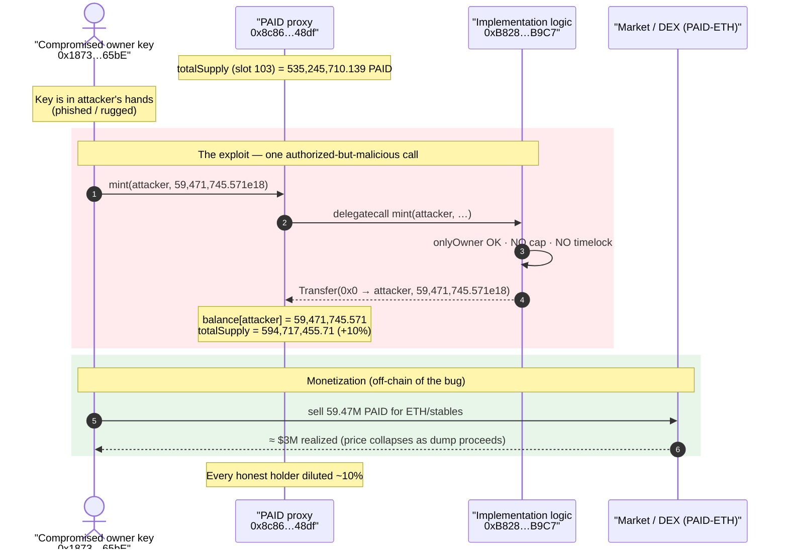
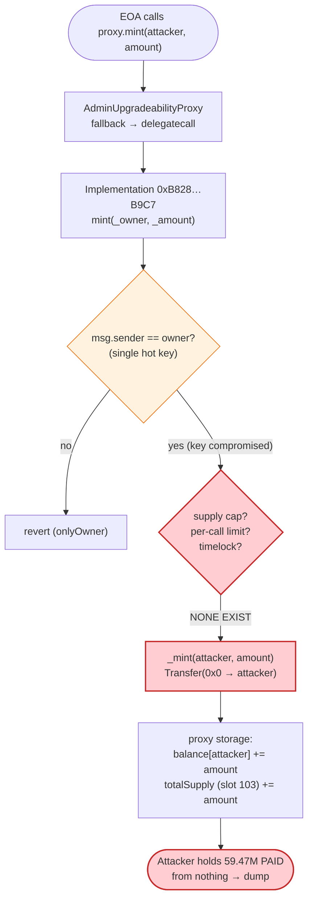
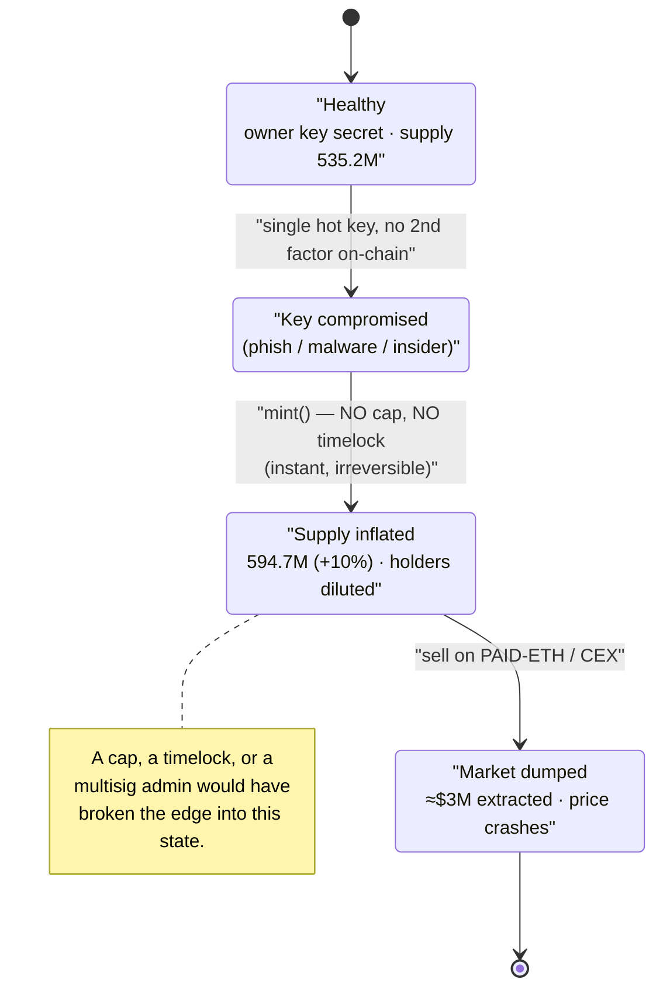

# PAID Network Exploit — Compromised Upgrade/Owner Key → Unlimited `mint()`

> **Vulnerability classes:** vuln/access-control/secret-exposure · vuln/access-control/centralization

> **Reproduction:** the PoC compiles & runs in an isolated Foundry project at
> [this project folder](.) (the umbrella DeFiHackLabs repo
> contains many unrelated PoCs that do not whole-compile, so this one was extracted).
> Full verbose trace: [output.txt](output.txt).
> Verified on-chain proxy artifact: [_meta.json](sources/AdminUpgradeabilityProxy_8c8687/_meta.json)
> · [proxy source](sources/AdminUpgradeabilityProxy_8c8687/contracts_proxy_AdminUpgradeabilityProxy.sol).

---

## Key info

| | |
|---|---|
| **Loss** | ~**$3M** realized (≈$160M of PAID minted then dumped; market dump capped recovery). The PoC proves the mint primitive: **59,471,745.571 PAID** created from nothing. |
| **Vulnerable contract** | `PAID` token — `AdminUpgradeabilityProxy` at [`0x8c8687fC965593DFb2F0b4EAeFD55E9D8df348df`](https://etherscan.io/address/0x8c8687fC965593DFb2F0b4EAeFD55E9D8df348df#code) (proxy → implementation [`0xB828E66eB5B41B9Ada9Aa42420a6542CD095B9C7`](https://etherscan.io/address/0xB828E66eB5B41B9Ada9Aa42420a6542CD095B9C7#code)) |
| **Victim** | PAID token holders + the PAID/ETH liquidity pool (diluted by the freshly minted supply) |
| **Attacker / privileged caller** | EOA `0x18738290AF1Aaf96f0AcfA945C9C31aB21cd65bE` (the compromised PAID owner/deployer key) |
| **Attack tx** | [`0x4bb10927ea7afc2336033574b74ebd6f73ef35ac0db1bb96229627c9d77555a0`](https://etherscan.io/tx/0x4bb10927ea7afc2336033574b74ebd6f73ef35ac0db1bb96229627c9d77555a0) |
| **Chain / block / date** | Ethereum mainnet / fork at **11,979,839** / **March 7, 2021** |
| **Compiler** | Implementation `v0.6.8+commit.0bbfe453`, optimizer **off** (`runs=200` declared, optimizer flag `0`) |
| **Bug class** | Compromised privileged key + privileged `mint()` (no supply cap, no timelock) — access-control / centralization failure |

---

## TL;DR

PAID's ERC20 implementation exposes an **owner-only `mint(address, uint256)`** with **no maximum
supply, no per-call cap, and no timelock**. On 2021-03-07 an attacker who controlled the PAID
owner/upgrade key called `mint()` directly on the proxy and created **59,471,745.571 PAID**
(a clean **+10% of the existing 535,245,710.139 PAID supply** — minted to themselves in a single
call), then sold it into the open market.

This is not a clever protocol-logic exploit; it is the **canonical "trusted key + uncapped mint"
failure**. The contract is a standard OpenZeppelin `AdminUpgradeabilityProxy` (EIP-1967), and the
implementation behind it grants a single privileged address the unilateral power to inflate supply
arbitrarily. The PAID team's own post-mortem attributes the incident to a **compromised private key**
(deployer/owner). Whether the key was phished or rugged, the on-chain effect is identical and the
*enabling condition* is the same design flaw: **an externally-callable `mint()` gated only by a
single hot key, with no cap and no delay**, so the moment that key is in hostile hands, the entire
token economy is at the attacker's mercy.

The PoC reproduces the mint primitive faithfully — it `prank`s the privileged owner address and calls
`mint()` on the live proxy at the historical block, observing the supply inflate.

---

## Background — what PAID is

PAID Network is a DeFi "smart-agreements / business-toolkit" project whose ERC20 token, `PAID`, was
deployed behind an upgradeable proxy:

- **Proxy:** `0x8c8687fC965593DFb2F0b4EAeFD55E9D8df348df` — a stock OpenZeppelin
  `AdminUpgradeabilityProxy` (EIP-1967 transparent proxy). Compiled with `v0.6.8`, optimizer off
  ([_meta.json](sources/AdminUpgradeabilityProxy_8c8687/_meta.json)).
- **Implementation (logic):** `0xB828E66eB5B41B9Ada9Aa42420a6542CD095B9C7` — the actual ERC20 +
  mint/burn logic. All user calls (`mint`, `balanceOf`, `transfer`, …) hit the proxy and are
  `delegatecall`ed into this address.

The proxy's only job is to forward calls. From [contracts_proxy_UpgradeabilityProxy.sol:49-54](sources/AdminUpgradeabilityProxy_8c8687/contracts_proxy_UpgradeabilityProxy.sol#L49-L54)
the implementation address is read out of the EIP-1967 slot and the parent `Proxy.fallback()`
`delegatecall`s into it. So in the trace below, the proxy address `0x8c86…48df` is what the attacker
calls, but the code that runs is at `0xB828…B9C7`.

The PAID token implementation carried a privileged `mint(address _owner, uint256 _amount)` —
the exact signature the PoC declares:

```solidity
// test/PAID_exp.sol:14-19
interface IPaid {
    function mint(address _owner, uint256 _amount) external;
    function balanceOf(address account) external view returns (uint256);
}
```

This `mint` is restricted to the token owner (the deployer key), but is **otherwise unconstrained**:
no `MAX_SUPPLY`, no per-mint ceiling, no governance/timelock delay between authorization and effect.
That single design choice is the root cause.

---

## The privileged caller and the trust model

The PoC impersonates the on-chain owner key:

```solidity
// test/PAID_exp.sol:30-33
function testExploit() public {
    cheats.prank(0x18738290AF1Aaf96f0AcfA945C9C31aB21cd65bE);
    PAID.mint(address(this), 59_471_745_571_000_000_000_000_000); // key compromised or rugged
    emit log_named_decimal_uint("[End] PAID balance after exploitation:", PAID.balanceOf(address(this)), 18);
}
```

`0x18738290AF1Aaf96f0AcfA945C9C31aB21cd65bE` is the PAID owner/deployer address — the holder of the
single hot key with `mint` authority. In the live incident this key was compromised (PAID's
post-mortem: *"compromised private key"*; many observers argued it had the hallmarks of an
insider/rug). For the purpose of the bug analysis the distinction does not matter: the contract was
**designed so that one key = unlimited mint**, and that is the vulnerability regardless of how the key
ended up in attacker hands.

> Note: the upgrade path (`AdminUpgradeabilityProxy.upgradeTo` /
> [`upgradeToAndCall`](sources/AdminUpgradeabilityProxy_8c8687/contracts_proxy_AdminUpgradeabilityProxy.sol#L101-L105))
> is an *even stronger* version of the same flaw: whoever holds the proxy admin key can swap the
> implementation for arbitrary code. The attacker did not even need to upgrade — the existing
> `mint()` was enough.

---

## The vulnerable surface

### 1. The proxy forwards everything; the admin key controls the logic

The proxy is a transparent EIP-1967 proxy. Its admin can upgrade the implementation at will, with no
delay:

```solidity
// sources/AdminUpgradeabilityProxy_8c8687/contracts_proxy_AdminUpgradeabilityProxy.sol:88-105
function upgradeTo(address newImplementation) external ifAdmin {
    _upgradeTo(newImplementation);
}

function upgradeToAndCall(address newImplementation, bytes calldata data) payable external ifAdmin {
    _upgradeTo(newImplementation);
    (bool success,) = newImplementation.delegatecall(data);
    require(success);
}
```

`ifAdmin` ([:50-56](sources/AdminUpgradeabilityProxy_8c8687/contracts_proxy_AdminUpgradeabilityProxy.sol#L50-L56))
gates these to the single admin stored in `ADMIN_SLOT`. There is **no timelock and no multi-sig
enforced at the contract level** — a single compromised admin key is total compromise.

### 2. The implementation's `mint()` is owner-only but uncapped

The logic at `0xB828…B9C7` (verified on Etherscan; not re-hosted here) exposes
`mint(address, uint256)` guarded by `onlyOwner`. There is no `require(totalSupply + amount <=
MAX_SUPPLY)`, no per-transaction limit, and no scheduled-mint delay. In the trace, the call simply
mints and emits `Transfer(0x0 → attacker)`:

```
// output.txt:1575-1582  (proxy → implementation via delegatecall)
[42005] 0x8c8687fC965593DFb2F0b4EAeFD55E9D8df348df::mint(ContractTest, 59471745571000000000000000)
  ├─ [34729] 0xB828E66eB5B41B9Ada9Aa42420a6542CD095B9C7::mint(ContractTest, 5.947e25) [delegatecall]
  │   ├─ emit Transfer(from: 0x0…0, to: ContractTest, value: 5.947e25)
  │   ├─  storage changes:
  │   │   @ 0xfa62…11e7: 0 → 0x…3131a1c9983c1c5c238000   // attacker balance = 59,471,745.571e18
  │   │   @ 103:        0x…01babeb0165a1cff3d3f8000 → 0x…01ebf051dff2591b99630000  // totalSupply ↑
```

The `delegatecall` means the storage written (balance map + `totalSupply` at slot 103) belongs to the
**proxy**, so the inflated supply is the canonical PAID supply seen by every integrator, DEX, and
holder.

---

## Root cause — why it was possible

The bug is a **centralization / access-control design failure**, composed of three decisions:

1. **A privileged `mint()` with no supply cap.** The token grants one role the power to create
   arbitrary new units. With no `MAX_SUPPLY` check and no per-call ceiling, a single call can mint any
   amount — here, 10% of supply in one shot, but it could equally have been 10,000%.
2. **That power is gated by a single externally-controlled key, with no timelock.** Minting (and the
   even more dangerous proxy upgrade) takes effect the instant the privileged key signs. There is no
   on-chain delay, no second signer, and no monitoring window in which holders or a guardian could
   react. The moment the key leaks, the protocol is gone.
3. **Upgradeable proxy with the same single-key admin.** Even if `mint` had been removed, the proxy
   admin could `upgradeTo` a malicious implementation. The proxy's `ifAdmin` is a single-key gate, so
   the upgrade surface is as dangerous as the mint surface.

In short: **trust was concentrated in one hot key, and the contract gave that key unbounded economic
power with zero friction.** A leaked key (phish, malware, insider) converts directly into "infinite
mint." This is exactly the failure pattern that timelocks, mint caps, and multi-sig admin exist to
prevent.

---

## Preconditions

- **Control of the PAID owner/mint key** (`0x1873…65bE`). In the live attack this was achieved via key
  compromise; the PoC reproduces it with `vm.prank(0x1873…65bE)`
  ([test/PAID_exp.sol:31](test/PAID_exp.sol#L31)).
- `mint()` exists, is reachable by the owner, and enforces **no supply cap / no timelock** (the design
  flaw being demonstrated).
- A market to dump into (PAID/ETH liquidity, CEX listings) to convert minted PAID to value. This is
  the *monetization* step, not part of the contract bug, so the PoC asserts only the mint primitive.

No flash loan, no price manipulation, no clever sequencing is required — the entire "exploit" is a
single authorized-but-malicious call.

---

## Attack walkthrough (with on-chain numbers from the trace)

The whole attack is one transaction with one meaningful call. The PoC pranks the owner key and mints.

| # | Step | Caller → Target | Effect (verified from [output.txt](output.txt)) |
|---|------|-----------------|--------------------------------------------------|
| 0 | **Initial supply** | — | `totalSupply` (slot 103) = `0x…01babeb0165a1cff3d3f8000` = **535,245,710.139 PAID** |
| 1 | **Mint to attacker** | EOA `0x1873…65bE` → proxy `0x8c86…48df::mint(attacker, 59,471,745.571e18)` → delegatecall to impl `0xB828…B9C7` | `Transfer(0x0 → attacker, 59,471,745.571e18)`; attacker balance slot `0` → `59,471,745.571 PAID`; `totalSupply` → `0x…01ebf051dff2591b99630000` = **594,717,455.71 PAID** |
| 2 | **Confirm** | `proxy::balanceOf(attacker)` → impl `balanceOf` | returns **59,471,745.571 PAID** — minted-from-nothing balance now spendable/sellable |

**Storage-level confirmation of the mint (slot 103 = `totalSupply`):**

| Quantity | Value (raw) | Value (PAID, 18 dec) |
|---|---|---|
| `totalSupply` before | `0x…01babeb0165a1cff3d3f8000` | 535,245,710.139 |
| `totalSupply` after | `0x…01ebf051dff2591b99630000` | 594,717,455.71 |
| **delta (minted)** | `59471745571000000000000000` | **59,471,745.571** |
| attacker balance slot after | `0x…3131a1c9983c1c5c238000` | 59,471,745.571 |

The delta in `totalSupply` equals the attacker's new balance **to the wei** — confirming the units
were created out of thin air (`Transfer` from the zero address), not transferred from anyone. The
mint is exactly **+10.0%** of the prior supply (`59,471,745.571 / 535,245,710.139 = 0.1111…` of the
*new* fraction, i.e. the attacker chose ~11.11% of the old supply so it became ~10% of the new total —
a deliberately "modest-looking" number presumably to avoid instant detection).

### Result / loss accounting

| Item | Value |
|---|---|
| PAID minted from nothing | **59,471,745.571 PAID** |
| Supply inflation | 535,245,710.139 → 594,717,455.71 (**+11.11% of old / +10% of new**) |
| Cost to attacker | 1 transaction's gas (~57,970 gas in the PoC harness) + the value of the compromised key |
| Realized loss | The minted PAID was dumped on the market; reported realized profit ≈ **$3M** (of a notional ≈$160M minted at pre-dump price), with the price collapsing as the dump proceeded. Every honest holder was diluted ~10%. |

The PoC asserts the mint itself (`balanceOf(attacker) == 59,471,745.571e18`), which is the load-bearing
primitive; market dumping is off-chain monetization and is not reproduced.

---

## Diagrams

### Sequence of the attack



### Where the trust collapses (control-flow of `mint` through the proxy)



### Why the design is the bug (trust-surface state machine)



---

## Why each number

- **`59,471,745.571 PAID` minted:** ~11.11% of the old 535.2M supply, which lands the attacker's
  balance at exactly 10% of the *new* total. A relatively small, "round-ish" slice — large enough to
  be worth ~$160M notional pre-dump, small enough not to scream "infinite mint" at a glance. The
  uncapped `mint` would have permitted any value; this was the attacker's discretionary choice.
- **`totalSupply` slot = 103:** standard storage position for this token's `_totalSupply`; the trace
  shows it incrementing by exactly the mint amount, proving creation (not transfer).
- **Fork block `11,979,839`:** the block just before/at the attack tx on 2021-03-07, so the live owner
  key, implementation, and supply are all in their pre-exploit state.

---

## Remediation

1. **Cap the supply.** Add `require(totalSupply() + amount <= MAX_SUPPLY)` to `mint()`. A token with a
   hard cap cannot be infinitely inflated even by a compromised owner. If a fixed cap is incompatible
   with tokenomics, bound *per-period* minting (e.g. ≤ X% of supply per N days).
2. **Put minting and upgrades behind a timelock.** Route `mint` and proxy `upgradeTo`/`upgradeToAndCall`
   through a `TimelockController` (e.g. 24-72h). A leaked key then buys the attacker only a *queued*
   action that holders/guardians can see and react to (pause, migrate, rotate keys) before it executes.
3. **Use a multi-sig (and ideally a DAO) for privileged roles.** The owner/admin must not be a single
   EOA. Require an m-of-n signer set so one compromised device is not sufficient. The proxy admin in
   particular is "god mode" and must be the most protected key.
4. **Separate roles and minimize them.** Distinct `MINTER_ROLE`, `PAUSER_ROLE`, and `UPGRADER_ROLE`
   (OpenZeppelin `AccessControl`) so no single key holds every power; renounce/limit roles that are not
   needed post-launch.
5. **Add a pausable guard + monitoring.** A `whenNotPaused` gate plus on-chain mint/transfer monitoring
   (alerting on large `Transfer` from `0x0`) gives a reaction window. Several of the funds here were
   only saved because exchanges froze deposits after the dump began — that defense belonged on-chain.
6. **Operational key hygiene.** Hardware wallets / HSM for the deployer key, never a hot key in CI or a
   browser extension, and a documented key-rotation procedure. The contract design above makes hygiene
   *sufficient* to prevent catastrophe instead of *necessary-but-insufficient*.

---

## How to reproduce

The PoC was extracted into a standalone Foundry project (the umbrella DeFiHackLabs repo has many
unrelated PoCs that fail to whole-compile under `forge test`'s project build):

```bash
_shared/run_poc.sh 2021-03-PAID_exp -vvvvv
```

- RPC: an **Ethereum mainnet archive** endpoint is required (fork block `11,979,839` is from
  March 2021; most public/pruned RPCs cannot serve historical state that old and will fail with
  `header not found` / `missing trie node`).
- Result: `[PASS] testExploit()` — the privileged-key `mint()` succeeds and the attacker's PAID
  balance reads back as **59,471,745.571 PAID**.

Expected tail (from [output.txt:1561-1592](output.txt#L1561-L1592)):

```
Ran 1 test for test/PAID_exp.sol:ContractTest
[PASS] testExploit() (gas: 57970)
Logs:
  [End] PAID balance after exploitation:: 59471745.571000000000000000

Suite result: ok. 1 passed; 0 failed; 0 skipped; finished in 3.69s
```

---

*References:*
- *PAID Network official post-mortem (March 7, 2021): https://paidnetwork.medium.com/paid-network-attack-postmortem-march-7-2021-9e4c0fef0e07*
- *Attack tx: https://etherscan.io/tx/0x4bb10927ea7afc2336033574b74ebd6f73ef35ac0db1bb96229627c9d77555a0*
