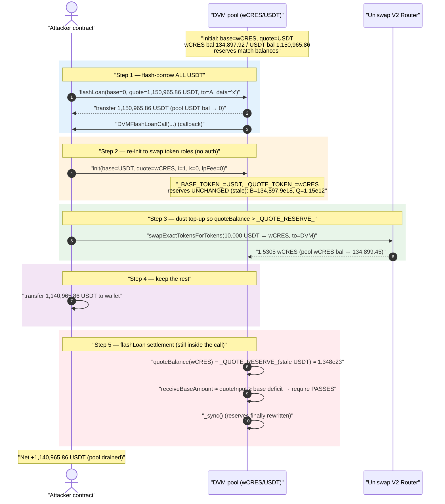
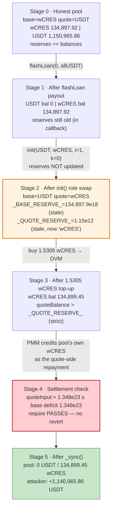
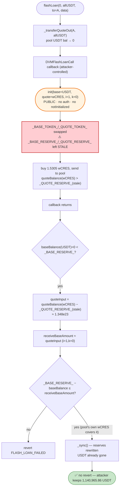

# DODO DVM Flashloan Exploit — Unprotected `init()` Reinterprets Pool Reserves

> **Reproduction:** the PoC compiles & runs in an isolated Foundry project at
> [this project folder](.) (the umbrella DeFiHackLabs repo contains several
> unrelated PoCs that do not whole-compile, so this one was extracted).
> Full verbose trace: [output.txt](output.txt).
> Verified vulnerable source: [sources/DVM_051EBD/DVM.sol](sources/DVM_051EBD/DVM.sol).

---

## Key info

| | |
|---|---|
| **Loss** | ~$1,140,965 — **1,140,965.86 USDT** drained from one wCRES/USDT DVM pool (the campaign hit several DODO V2 pools; this PoC reproduces the wCRES/USDT pool) |
| **Vulnerable contract** | `DVM` (DODO Vending Machine) — [`0x051EBD717311350f1684f89335bed4ABd083a2b6`](https://etherscan.io/address/0x051EBD717311350f1684f89335bed4ABd083a2b6#code) |
| **Victim pool / tokens** | base = wCRES [`0xa0afAA285Ce85974c3C881256cB7F225e3A1178a`](https://etherscan.io/address/0xa0afAA285Ce85974c3C881256cB7F225e3A1178a), quote = USDT [`0xdAC17F958D2ee523a2206206994597C13D831ec7`](https://etherscan.io/address/0xdAC17F958D2ee523a2206206994597C13D831ec7) |
| **Attacker EOA** | `0x368A6558211E0A833B30C7c46c63733Cab251Fc2` (one of several involved) |
| **Attack tx (this pool)** | `0xde4c34c4ed6f5f8f7af0eb35e7d7eb6b6c8ab92d…` (DODO disclosed multiple txs across pools) |
| **Chain / block / date** | Ethereum mainnet / PoC forks at **block 12,000,000** / **March 8–9, 2021** |
| **Compiler** | DVM deployed with Solidity v0.6.9 |
| **Bug class** | Missing access control + missing re-init guard on `init()`; stale stored reserves reinterpreted after a token-pair swap |

---

## TL;DR

DODO V2's `DVM` (Vending Machine) pool exposes
[`init(...)`](sources/DVM_051EBD/DVM.sol#L1415-L1465) as an `external` function
with **no access control and no "already initialized" guard**. `init` overwrites
`_BASE_TOKEN_`, `_QUOTE_TOKEN_`, `_I_`, `_K_`, and the fee parameters — but it
**does not touch the stored reserves** `_BASE_RESERVE_` / `_QUOTE_RESERVE_`.

The attacker:

1. Flash-borrows **all 1,150,965.86 USDT** out of the pool via
   [`flashLoan(0, quoteAmount, …)`](sources/DVM_051EBD/DVM.sol#L1217-L1275).
2. In the callback, calls `init()` to **swap the token roles**: now `_BASE_TOKEN_ = USDT`,
   `_QUOTE_TOKEN_ = wCRES`, with a degenerate price curve (`i = 1`, `k = 0`). The
   stored reserves stay frozen at the *old* values (`_BASE_RESERVE_ = old wCRES
   reserve`, `_QUOTE_RESERVE_ = old USDT reserve = 1,150,965,863,028`).
3. The pool still holds its ~134,897.9 wCRES. Because wCRES is now the **quote
   token**, the flashLoan settlement reads `quoteBalance = wCRES.balanceOf(pool)`
   ≈ 1.348e23 against a stale `_QUOTE_RESERVE_` of only 1.15e12 — so the pool
   thinks the attacker "paid in" essentially the entire wCRES balance as quote
   input, more than enough to cover the borrowed USDT.
4. To make `quoteBalance > _QUOTE_RESERVE_` strictly hold (so the "sell quote"
   branch fires), the attacker tops up the pool with a **negligible 1.53 wCRES**
   bought on Uniswap for 10,000 USDT, and walks away with the remaining
   **1,140,965.86 USDT**.

No real value is ever returned to the pool. The flashLoan repayment check is
satisfied entirely by the pool's own pre-existing wCRES being re-labelled as the
quote-side input.

---

## Background — what DODO V2 `DVM` does

DODO's "Vending Machine" (`DVM`) is a single-pool PMM (Proactive Market Maker)
AMM. Each pool has a base token and a quote token, stores two reserves
(`_BASE_RESERVE_`, `_QUOTE_RESERVE_` — `uint112`, packed in one slot), and prices
trades with a custom curve parameterised by `_I_` (price) and `_K_` (curve
slippage). Pools are deployed as **proxies/clones by a factory and then
`init`-ed** to set their tokens and curve.

The `DVM` exposes a `flashLoan` that optimistically sends out the requested base
and/or quote, fires a callback, and then checks that the pool was made whole —
not by tracking who paid what, but by **re-deriving the implied input from the
post-callback token balances vs. the stored reserves**, and asking the PMM
whether that input is enough to cover the deficit.

On-chain state of this pool at the fork block (read directly from the trace):

| Parameter | Value |
|---|---|
| `_BASE_TOKEN_` (before) | wCRES (18 decimals) |
| `_QUOTE_TOKEN_` (before) | USDT (6 decimals) |
| `_BASE_RESERVE_` (pool wCRES) | **134,897,917,762,348,532,103,754** (≈ 134,897.92 wCRES) |
| `_QUOTE_RESERVE_` (pool USDT) | **1,150,965,863,028** (≈ 1,150,965.86 USDT) |
| Pool wCRES balance | 134,897,917,762,348,532,103,754 (matches reserve) |
| Pool USDT balance | 1,150,965,863,028 (matches reserve) |

The entire 1.15M USDT quote reserve is the prize.

---

## The vulnerable code

### 1. `init()` — `external`, no auth, no re-init guard, never sets reserves

[sources/DVM_051EBD/DVM.sol#L1415-L1465](sources/DVM_051EBD/DVM.sol#L1415-L1465):

```solidity
function init(
    address maintainer,
    address baseTokenAddress,
    address quoteTokenAddress,
    uint256 lpFeeRate,
    address mtFeeRateModel,
    uint256 i,
    uint256 k,
    bool isOpenTWAP
) external {                                            // ⚠️ external, NO onlyOwner / NO notInitialized
    require(baseTokenAddress != quoteTokenAddress, "BASE_QUOTE_CAN_NOT_BE_SAME");
    _BASE_TOKEN_  = IERC20(baseTokenAddress);           // ⚠️ token roles overwritten
    _QUOTE_TOKEN_ = IERC20(quoteTokenAddress);

    require(i > 0 && i <= 10**36);
    _I_ = i;                                            // ⚠️ price overwritten (set to 1)
    require(k <= 10**18);
    _K_ = k;                                            // ⚠️ curve overwritten (set to 0)

    _LP_FEE_RATE_       = lpFeeRate;                     // ⚠️ fee zeroed
    _MT_FEE_RATE_MODEL_ = IFeeRateModel(mtFeeRateModel);
    _MAINTAINER_        = maintainer;
    // ... name/symbol/decimals/DOMAIN_SEPARATOR ...
    // NOTE: _BASE_RESERVE_ and _QUOTE_RESERVE_ are NEVER assigned here.
}
```

Compare with the contract's *own* notion of an init guard, which `init` ignores:

```solidity
bool internal _INITIALIZED_;
modifier notInitialized() {
    require(!_INITIALIZED_, "DODO_INITIALIZED");
    _;
}
function initOwner(address newOwner) public notInitialized { _INITIALIZED_ = true; ... }
```

The `notInitialized` modifier exists (line 32) and is applied to `initOwner`, but
**`init()` does not use it** and never sets `_INITIALIZED_`. So `init` can be
called any number of times, on a live pool, by anyone.

### 2. `flashLoan()` — settlement reads stored reserves against current balances

[sources/DVM_051EBD/DVM.sol#L1217-L1275](sources/DVM_051EBD/DVM.sol#L1217-L1275):

```solidity
function flashLoan(uint256 baseAmount, uint256 quoteAmount, address assetTo, bytes calldata data)
    external preventReentrant
{
    _transferBaseOut(assetTo, baseAmount);
    _transferQuoteOut(assetTo, quoteAmount);            // send out the borrowed USDT

    if (data.length > 0)
        IDODOCallee(assetTo).DVMFlashLoanCall(msg.sender, baseAmount, quoteAmount, data);  // ← attacker calls init() here

    uint256 baseBalance  = _BASE_TOKEN_.balanceOf(address(this));   // _BASE_TOKEN_ is now USDT  → 0
    uint256 quoteBalance = _QUOTE_TOKEN_.balanceOf(address(this));  // _QUOTE_TOKEN_ is now wCRES → 1.348e23

    require(
        baseBalance >= _BASE_RESERVE_ || quoteBalance >= _QUOTE_RESERVE_,   // 1.348e23 >= 1.15e12  → TRUE
        "FLASH_LOAN_FAILED"
    );

    if (baseBalance < _BASE_RESERVE_) {                                     // 0 < oldWcresReserve → TRUE
        uint256 quoteInput = quoteBalance.sub(uint256(_QUOTE_RESERVE_));    // 1.348e23 - 1.15e12 ≈ 1.348e23
        (uint256 receiveBaseAmount, ) = querySellQuote(tx.origin, quoteInput);
        require(uint256(_BASE_RESERVE_).sub(baseBalance) <= receiveBaseAmount, "FLASH_LOAN_FAILED");  // PASSES
        ...
    }
    ...
    _sync();                                            // only NOW are reserves rewritten from balances
}
```

The settlement logic never asks "did you return the USDT you borrowed?" It asks
"given the current balances and the stored reserves, does the PMM price say the
implied input covers the implied deficit?" By swapping the token roles via
`init`, the attacker makes the pool's own untouched wCRES balance *count as the
quote-side payment*.

### 3. `getPMMState()` — uses the stale reserves verbatim

[sources/DVM_051EBD/DVM.sol#L849-L858](sources/DVM_051EBD/DVM.sol#L849-L858):

```solidity
function getPMMState() public view returns (PMMPricing.PMMState memory state) {
    state.i = _I_;            // = 1 after init
    state.K = _K_;            // = 0 after init  → constant-price curve
    state.B = _BASE_RESERVE_; // = old wCRES reserve (stale)
    state.Q = _QUOTE_RESERVE_;// = old USDT reserve (stale, = 1.15e12)
    ...
}
```

With `k = 0` and `i = 1`, the PMM degenerates to a 1:1 constant price, so
`querySellQuote(quoteInput) ≈ quoteInput`. Since `quoteInput ≈ 1.348e23` and the
base deficit is `_BASE_RESERVE_ − baseBalance ≈ 1.348e23`, the repayment check
`deficit <= receiveBaseAmount` passes with margin.

---

## Root cause — why it was possible

Three independent flaws compose into a one-transaction, ~$1.14M theft:

1. **`init()` is permissionless and re-callable.** It is `external` with no
   `onlyOwner`/factory check and does not consume the `notInitialized` guard. A
   live, funded pool can be re-initialized by anyone, at any time —
   [DVM.sol:1424](sources/DVM_051EBD/DVM.sol#L1424).
2. **`init()` mutates token roles and curve params but not reserves.** After the
   call, `_BASE_TOKEN_`/`_QUOTE_TOKEN_` describe a *new* pair, while
   `_BASE_RESERVE_`/`_QUOTE_RESERVE_` still hold the *old* pair's numbers. The
   reserves are silently stale and now denominated in the wrong token —
   [DVM.sol:1426-1427](sources/DVM_051EBD/DVM.sol#L1426-L1427) vs. the absent
   reserve assignment.
3. **`flashLoan()` proves repayment from balances-vs-stored-reserves, not from
   tracked deltas of the actually-borrowed asset.** Because the pool's
   pre-existing wCRES is re-labelled as "quote," it is counted as the attacker's
   quote-side input — [DVM.sol:1239-1242](sources/DVM_051EBD/DVM.sol#L1239-L1242).

The attacker chose `i = 1, k = 0` so the constant-price PMM credits
`receiveBaseAmount ≈ quoteInput`, maximising the implied repayment. The single
`require(... != ...)` they still had to satisfy was `quoteBalance >
_QUOTE_RESERVE_` strictly; the pool already held vastly more wCRES than the stale
1.15e12 quote reserve, so even a **1.53 wCRES** top-up (bought for 10,000 USDT on
Uniswap) made every branch pass.

---

## Preconditions

- A `DVM` pool whose `init()` lacks access control / re-init protection
  (the entire DODO V2 `DVM`/`DPP` family at the time).
- The pool holds a non-trivial reserve of one token (here 1.15M USDT quote) and a
  large balance of the other (here 134,897 wCRES base).
- Capital to fund the dust top-up (10,000 USDT here; recoverable — the whole
  operation nets positive in one tx, so it is **flash-loanable / self-financing**:
  the borrowed USDT itself funds the Uniswap purchase).
- No oracle or external price check anywhere in `flashLoan` settlement — it trusts
  its own stored reserves, which `init` rendered meaningless.

---

## Attack walkthrough (with on-chain numbers from the trace)

All figures are taken directly from [output.txt](output.txt). USDT has 6
decimals; wCRES has 18.

| # | Step | Pool USDT bal | Pool wCRES bal | Stored `_BASE_RESERVE_` / `_QUOTE_RESERVE_` | Effect |
|---|------|--------------:|---------------:|--------------------------------------------|--------|
| 0 | **Initial** | 1,150,965.86 USDT | 134,897.92 wCRES | base=134,897.92 wCRES, quote=1,150,965.86 USDT | Honest pool (base=wCRES, quote=USDT). |
| 1 | **`flashLoan(0, 1,150,965,863,028, attacker, "x")`** — borrow ALL USDT | **0** | 134,897.92 | unchanged (still old values) | Pool sends out the entire USDT reserve; callback fires. |
| 2 | **In callback: `init(USDT, wCRES, lpFee=0, i=1, k=0)`** | 0 | 134,897.92 | unchanged | Token roles swap: now base=USDT, quote=wCRES. Reserves stay frozen → reinterpreted as base=134,897.92 (in wCRES units) / quote=1,150,965,863,028 (now read as wCRES). |
| 3 | **Buy 1.5305 wCRES on Uniswap for 10,000 USDT**, send to pool | 0 (10k spent) | 134,899.45 | unchanged | `quoteBalance (wCRES)` now strictly > stale `_QUOTE_RESERVE_`; makes the settlement branch fire. |
| 4 | **Keep remaining 1,140,965.86 USDT**, send to wallet | 0 | 134,899.45 | unchanged | Attacker pockets borrowed USDT minus the 10k swap cost. |
| 5 | **`flashLoan` settlement resumes** | 0 | 134,899.45 | `_sync()` finally rewrites reserves | `quoteInput = quoteBalance − _QUOTE_RESERVE_ ≈ 1.348e23`; `receiveBaseAmount ≈ 1.348e23 ≥ base deficit 1.348e23` → **check PASSES**, no revert. |

### The settlement arithmetic (verified against the trace)

After `init`, in [flashLoan](sources/DVM_051EBD/DVM.sol#L1239-L1242):

```
baseBalance   = USDT.balanceOf(pool)  = 0
quoteBalance  = wCRES.balanceOf(pool) = 134,899,448,310,314,856,073,562   (old wCRES 134,897.9e18 + 1.5305e18 bought)
_BASE_RESERVE_  = 134,897,917,762,348,532,103,754                          (stale: old wCRES reserve)
_QUOTE_RESERVE_ =          1,150,965,863,028                               (stale: old USDT reserve)

branch: baseBalance (0) < _BASE_RESERVE_  → TRUE
  quoteInput        = quoteBalance − _QUOTE_RESERVE_
                    = 134,899,448,310,314,856,073,562 − 1,150,965,863,028
                    = 134,899,448,309,163,890,210,534           ← DODOSwap.fromAmount in trace
  receiveBaseAmount ≈ quoteInput (i=1, k=0 constant price)
                    = 134,897,917,762,348,532,103,754           ← DODOSwap.toAmount in trace
  require( _BASE_RESERVE_ − baseBalance  <=  receiveBaseAmount )
        ( 134,897,917,762,348,532,103,754  <=  134,899,448,309,163,890,210,534 )  → PASSES
```

The `DODOSwap` event in the trace (`fromToken: wCRES, toToken: USDT,
fromAmount: 134,899,448,309,163,890,210,534, toAmount: 134,897,917,762,348,532,103,754`)
is the on-chain receipt of the pool convincing itself that the attacker "sold"
the pool's own wCRES back to it to repay the USDT.

### Profit accounting (USDT)

| Direction | Amount (USDT) |
|---|---:|
| Borrowed from pool (quoteAmount) | 1,150,965.863028 |
| Spent buying 1.5305 wCRES on Uniswap to satisfy `quoteBalance > _QUOTE_RESERVE_` | 10,000.000000 |
| **Net USDT walked away with** | **1,140,965.863028** |
| wCRES profit | 0 (the 1.5305 wCRES was donated to the pool) |

The PoC asserts `usdtProfit > 0` and logs `USDT profit: 1140965863028`
(1,140,965.86 USDT), matching `borrowed − swapCost` to the wei.

---

## Diagrams

### Sequence of the attack



### Pool state / reserve-vs-balance evolution



### The flaw inside `init` + `flashLoan`



---

## Remediation

1. **Lock down `init()`.** Make it callable exactly once and only by the trusted
   factory: apply the existing `notInitialized` modifier and set `_INITIALIZED_ =
   true` (mirroring `initOwner`), or restrict the caller to the factory address.
   This single fix kills the attack. *(DODO's actual hotfix added an
   initialization guard so `init` cannot be re-invoked on a live pool.)*
2. **Never let token-pair / curve parameters change while reserves persist.** If a
   re-init were ever legitimate, it must atomically reset reserves to match the
   new tokens' real balances (or refuse if any balance is non-zero). Stale
   reserves denominated in a now-different token are the proximate cause.
3. **Settle flash loans against tracked deltas of the actually-borrowed asset,**
   not against `balanceOf − storedReserve` of whatever token currently occupies
   the role. Record the pre-callback balance of each borrowed token and require
   `postBalance >= preBalance + fee` for that exact token.
4. **Validate curve sanity at settlement.** A pool servicing a flash loan with
   `i = 1, k = 0` and a quote reserve nine orders of magnitude below its quote
   balance is self-evidently mis-configured; defensive bounds (or simply
   disallowing parameter changes mid-flashloan via reentrancy/CEI ordering on
   `init`) would have blocked it.

---

## How to reproduce

The PoC was extracted into a standalone Foundry project (the umbrella
DeFiHackLabs repo has unrelated PoCs that fail to compile under a whole-project
`forge build`):

```bash
_shared/run_poc.sh 2021-03-dodo_flashloan_exp --mt testExploit -vvvvv
```

- RPC: an **Ethereum archive** endpoint is required (the PoC forks at block
  **12,000,000**, March 2021). `foundry.toml` aliases `mainnet` to an archive
  provider that serves historical state; pruned full nodes fail with
  `missing trie node` / `header not found`.
- Result: `[PASS] testExploit()` with `USDT profit: 1140965863028`
  (1,140,965.86 USDT).

Expected tail (see [output.txt](output.txt)):

```
Ran 1 test for test/dodo_flashloan_exp.sol:ContractTest
[PASS] testExploit() (gas: 280923)
Logs:
  [*] DVM wCRES balance: 134897917762348532103754
  [*] DVM USDT balance: 1150965863028
  [cb] USDT borrowed: 1150965863028
  [cb] wCRES now in DVM: 134899448310314856073562
  [cb] USDT remaining in this contract: 1140965863028
  [cb] USDT sent to mywallet: 1140965863028
  [*] USDT profit: 1140965863028
  [*] wCRES profit: 0
Suite result: ok. 1 passed; 0 failed; 0 skipped
```

---

*Reference: DODO V2 flashloan incident, March 2021 (~$3.8M total across multiple
DVM pools; this PoC reproduces the wCRES/USDT pool, ~$1.14M). The root cause was
the publicly-callable, unguarded `init()` on freshly-cloned/live `DVM` pools.*
