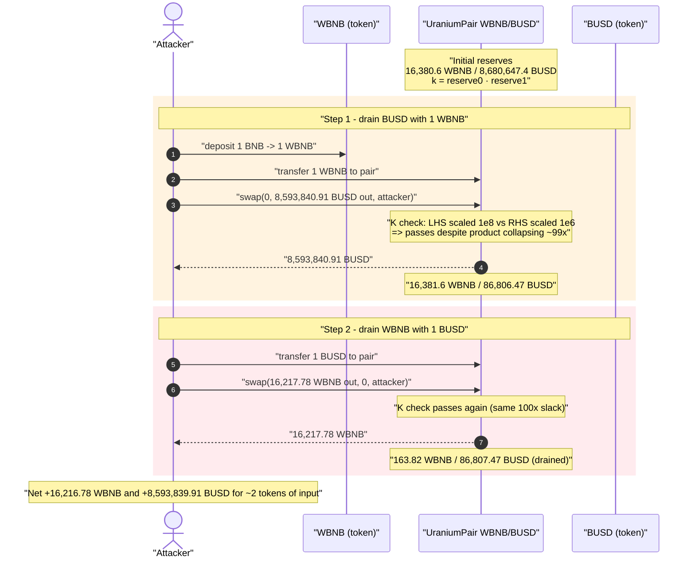
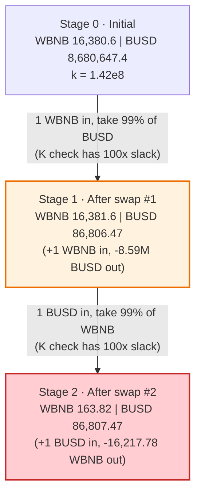
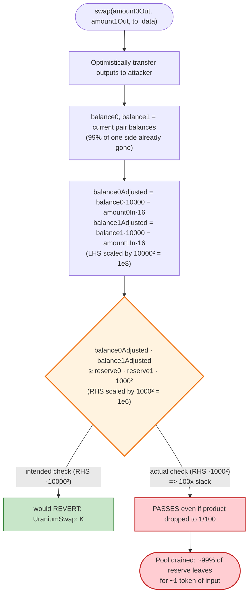
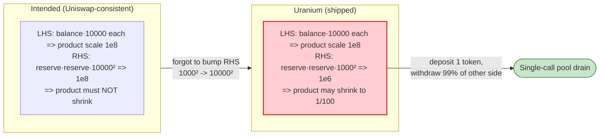

# Uranium Finance Exploit — Broken Constant-Product `K` Check (100× Slack in `swap()`)

> **Reproduction:** the PoC compiles & runs in an isolated Foundry project at
> [this project folder](.) (the umbrella DeFiHackLabs repo contains many
> unrelated PoCs that do not whole-compile, so this one was extracted).
> Full verbose trace: [output.txt](output.txt).
> Verified vulnerable source: [UraniumPair.sol](sources/UraniumPair_9B9baD/home_camille_Project_swap_uranium_swap-core_contracts_UraniumPair.sol).

---

## Key info

| | |
|---|---|
| **Loss** | ~$50M total across all pairs. This PoC drains a single WBNB/BUSD pair for **8,593,840 BUSD + 16,217.78 WBNB** (≈ $13.1M from that one pool) |
| **Vulnerable contract** | `UraniumPair` (AMM pair implementation) — e.g. WBNB/BUSD pair [`0x9B9baD4c6513E0fF3fB77c739359D59601c7cAfF`](https://bscscan.com/address/0x9B9baD4c6513E0fF3fB77c739359D59601c7cAfF#code) |
| **Factory** | `UraniumFactory` — [`0xA943eA143cd7E79806d670f4a7cf08F8922a454F`](https://bscscan.com/address/0xA943eA143cd7E79806d670f4a7cf08F8922a454F#code) |
| **Victim pool (this PoC)** | WBNB/BUSD pair `0x9B9baD4c6513E0fF3fB77c739359D59601c7cAfF` |
| **Attacker EOA** | `0xc47bdd0a852a88a019385ea3ff57cf8de79f019d` |
| **Attacker contract** | `0x2b528a28451e9853f51616f3b0f6d82af8bea6ae` |
| **Attack tx** | [`0x5a504fe72ef7fc76dfeb4d979e533af4e23fe37e90b5516186d5787893c37991`](https://bscscan.com/tx/0x5a504fe72ef7fc76dfeb4d979e533af4e23fe37e90b5516186d5787893c37991) |
| **Chain / block / date** | BSC / fork at 6,920,000 / April 28, 2021 |
| **Compiler** | Solidity v0.5.16+commit.9c3226ce, optimizer **999999 runs** |
| **Bug class** | Broken AMM invariant — `K` (constant-product) check uses the wrong magic constant, leaving 100× of slack |

---

## TL;DR

Uranium Finance forked Uniswap V2 / PancakeSwap and lowered the swap fee from 0.30% to
0.16%. To do this they changed the fee constant in `UraniumPair.swap()` from `1000` to `10000`
in the *balance-adjustment* terms — but **forgot to change the matching constant in the
constant-product (`K`) check on the right-hand side**, which still uses `1000**2`
([UraniumPair.sol:180-182](sources/UraniumPair_9B9baD/home_camille_Project_swap_uranium_swap-core_contracts_UraniumPair.sol#L180-L182)):

```solidity
uint balance0Adjusted = balance0.mul(10000).sub(amount0In.mul(16));  // scaled by 10000
uint balance1Adjusted = balance1.mul(10000).sub(amount1In.mul(16));  // scaled by 10000
require(balance0Adjusted.mul(balance1Adjusted) >= uint(_reserve0).mul(_reserve1).mul(1000**2), 'UraniumSwap: K');
//                                  ^ LHS scaled by 10000² = 1e8        ^ RHS scaled by 1000² = 1e6
```

The left-hand side is scaled by `10000² = 1e8`; the right-hand side by `1000² = 1e6`. The two
sides differ by a factor of **100**. The check therefore passes as long as

> `balance0 · balance1  ≥  (reserve0 · reserve1) / 100`

i.e. an attacker may **shrink the pool's constant product `k` to as little as 1/100 of its prior
value and the swap still succeeds**. In practice this means: deposit **1 token** of one side, and
withdraw **~99% of the other side's entire reserve** — the post-swap `k` lands right at the
1/100 floor, the check passes, and the pool is drained in a single `swap()` call.

The PoC does exactly this twice against the WBNB/BUSD pair:

1. Send **1 WBNB** to the pair, call `swap()` to pull out **8,593,840 BUSD** (≈99% of the BUSD reserve).
2. Send **1 BUSD** to the pair, call `swap()` to pull out **16,217.78 WBNB** (≈99% of the WBNB reserve).

Net: the attacker walks away with almost the entire pool for ~2 tokens of input.

---

## Background — what `UraniumPair` is

`UraniumPair` is a near-verbatim fork of the Uniswap V2 / PancakeSwap pair contract. It holds two
ERC20 reserves (`reserve0`, `reserve1`), prices swaps purely from those reserves, and enforces the
constant-product invariant `x · y ≥ k` **inside `swap()`** so that every swap leaves the product no
smaller than before (modulo fees). All the other plumbing — `mint`, `burn`, `sync`, `skim`,
`_update`, price accumulators — is standard.

The single design change Uranium made was the **fee**. Uniswap V2 charges 0.30%, encoded in `swap()`
as:

```solidity
// Canonical Uniswap V2:
uint balance0Adjusted = balance0.mul(1000).sub(amount0In.mul(3));   // 0.3% fee, scale 1000
uint balance1Adjusted = balance1.mul(1000).sub(amount1In.mul(3));
require(balance0Adjusted.mul(balance1Adjusted) >= uint(_reserve0).mul(_reserve1).mul(1000**2));
```

Note the consistency in Uniswap: the balances are scaled by `1000`, the product by `1000² = 1000**2`,
so both sides of the comparison live in the same `1e6` scale and the inequality is dimensionally sound.

Uranium wanted a **0.16% fee**, so they multiplied balances by `10000` and subtracted `amountIn·16`
(`16/10000 = 0.16%`). But they left the right-hand side's scale factor at `1000**2`. That single
omission is the entire bug.

The on-chain state of the WBNB/BUSD pair at the fork block (read from the trace's pre-swap balances):

| Reserve | Value |
|---|---|
| `token0` | WBNB — `0xbb4CdB9CBd36B01bD1cBaEBF2De08d9173bc095c` |
| `token1` | BUSD — `0xe9e7CEA3DedcA5984780Bafc599bD69ADd087D56` |
| `reserve0` (WBNB) | ≈ **16,380.6 WBNB** |
| `reserve1` (BUSD) | ≈ **8,680,647.4 BUSD** |
| `k = reserve0 · reserve1` | ≈ 1.42 × 10⁸ (in token units) |

---

## The vulnerable code

[UraniumPair.sol:159-187](sources/UraniumPair_9B9baD/home_camille_Project_swap_uranium_swap-core_contracts_UraniumPair.sol#L159-L187):

```solidity
function swap(uint amount0Out, uint amount1Out, address to, bytes calldata data) external lock {
    require(amount0Out > 0 || amount1Out > 0, 'UraniumSwap: INSUFFICIENT_OUTPUT_AMOUNT');
    (uint112 _reserve0, uint112 _reserve1,) = getReserves();
    require(amount0Out < _reserve0 && amount1Out < _reserve1, 'UraniumSwap: INSUFFICIENT_LIQUIDITY');

    uint balance0;
    uint balance1;
    {
    address _token0 = token0;
    address _token1 = token1;
    require(to != _token0 && to != _token1, 'UraniumSwap: INVALID_TO');
    if (amount0Out > 0) _safeTransfer(_token0, to, amount0Out); // optimistically transfer tokens out
    if (amount1Out > 0) _safeTransfer(_token1, to, amount1Out); // optimistically transfer tokens out
    if (data.length > 0) IUraniumCallee(to).pancakeCall(msg.sender, amount0Out, amount1Out, data);
    balance0 = IERC20(_token0).balanceOf(address(this));
    balance1 = IERC20(_token1).balanceOf(address(this));
    }
    uint amount0In = balance0 > _reserve0 - amount0Out ? balance0 - (_reserve0 - amount0Out) : 0;
    uint amount1In = balance1 > _reserve1 - amount1Out ? balance1 - (_reserve1 - amount1Out) : 0;
    require(amount0In > 0 || amount1In > 0, 'UraniumSwap: INSUFFICIENT_INPUT_AMOUNT');
    {
    uint balance0Adjusted = balance0.mul(10000).sub(amount0In.mul(16));          // ⚠️ scale 10000
    uint balance1Adjusted = balance1.mul(10000).sub(amount1In.mul(16));          // ⚠️ scale 10000
    require(balance0Adjusted.mul(balance1Adjusted) >= uint(_reserve0).mul(_reserve1).mul(1000**2), 'UraniumSwap: K');
    //                                                                            ^^^^^^^ ⚠️ scale 1000² — WRONG, should be 10000² (1e8)
    }

    _update(balance0, balance1, _reserve0, _reserve1);
    emit Swap(msg.sender, amount0In, amount1In, amount0Out, amount1Out, to);
}
```

The two adjusted balances are each scaled by `10000`, so their product is scaled by `1e8`. The
reserve product on the right is scaled by `1000**2 = 1e6`. The intended invariant — "the
fee-adjusted product after the swap must be ≥ the product before" — would require both sides at the
**same** scale (`10000**2`).

---

## Root cause — why it was possible

Strip the fee terms (they are negligible here) and the check is effectively:

```
balance0·10000 · balance1·10000   ≥   reserve0 · reserve1 · 1000²
        balance0 · balance1 · 1e8 ≥   reserve0 · reserve1 · 1e6
        balance0 · balance1       ≥  (reserve0 · reserve1) / 100
```

So the post-swap product is allowed to be **as low as 1% of the pre-swap product** and the `require`
still passes. The honest invariant (`balance0·balance1 ≥ reserve0·reserve1`) has been silently
relaxed by a factor of 100.

Concretely, an attacker can:

- put **1 wei / 1 token** of `token0` into the pool (`amount0In ≈ 1`), and
- withdraw `amount1Out` such that the new `balance1 = reserve1 − amount1Out` makes the product land
  at the 1/100 floor.

Setting `balance0 ≈ reserve0` (we add a negligible 1 token) and solving
`balance0 · balance1 ≥ (reserve0·reserve1)/100`:

```
balance1  ≥  reserve1 / 100
```

So the attacker can drain the BUSD reserve down to ~1% of its starting value — i.e. take out **~99%
of the entire BUSD side** — for a single WBNB of input. Then repeat in the other direction to drain
the WBNB side. No flash loan, no price manipulation, no special role: just two ordinary `swap()`
calls with the output amounts set to 99% of the opposing reserve.

The comment in the original PoC ([Uranium_exp.sol:21-23](test/Uranium_exp.sol#L21-L23)) sums it up:

> *"the magic value for fee calculation is 10000 instead of the original 1000. The check does not
> apply the new magic value and instead uses the original 1000. This means that the K after a swap
> is guaranteed to be 100 times larger than the K before the swap when no token balance changes have
> occurred."* — i.e. the swap is permitted to destroy up to 99% of `k`.

---

## Preconditions

- **None beyond having a tiny amount of the input token.** The bug is in the core `swap()` math, so
  any externally-funded pair is drainable.
- The PoC starts by wrapping **1 BNB → 1 WBNB** ([Uranium_exp.sol:46-49](test/Uranium_exp.sol#L46-L49))
  as the seed input. That single WBNB plus a single BUSD (recovered from the first swap) is all the
  capital required. The attack is not even flash-loan-shaped — the input cost is trivial relative to
  the drained reserves.
- The pool must hold real reserves (it did: ~16,380 WBNB and ~8.68M BUSD).

---

## Attack walkthrough (with on-chain numbers from the trace)

The pair `0x9B9baD…cAfF` has `token0 = WBNB`, `token1 = BUSD`, so `reserve0 = WBNB`,
`reserve1 = BUSD`. All figures are taken directly from the `Transfer` / `Swap` / `Sync` events in
[output.txt](output.txt) (lines 1574-1654).

The PoC's `takeFunds()` helper ([Uranium_exp.sol:51-64](test/Uranium_exp.sol#L51-L64)) does:
transfer `amount` of the input token to the pair, then call `pair.swap()` asking for **99% of the
pair's balance of the *output* token**.

| # | Step | WBNB reserve | BUSD reserve | Effect |
|---|------|-------------:|-------------:|--------|
| 0 | **Initial** | 16,380.6 | 8,680,647.4 | Honest pool, `k ≈ 1.42e8`. |
| 1 | **Wrap** 1 BNB → 1 WBNB (attacker funding) | 16,380.6 | 8,680,647.4 | Attacker now holds 1 WBNB. |
| 2 | **Transfer** 1 WBNB into the pair → pair WBNB balance = 16,381.6 | 16,380.6 | 8,680,647.4 | Pre-swap input deposited. |
| 3 | **`swap(0, 8,593,840.91 BUSD, attacker)`** — pull 99% of BUSD out for 1 WBNB in | **16,381.6** | **86,806.47** | `K` check passes despite product collapsing ~99×. Attacker gets 8,593,840.91 BUSD. |
| 4 | **Transfer** 1 BUSD into the pair | 16,381.6 | 86,807.47 | Pre-swap input for the reverse drain. |
| 5 | **`swap(16,217.78 WBNB, 0, attacker)`** — pull 99% of WBNB out for 1 BUSD in | **163.82** | **86,807.47** | `K` check passes again. Attacker gets 16,217.78 WBNB. |
| 6 | **Final** | 163.82 | 86,807.47 | Pool drained: ~99% of both reserves gone. |

### Verifying the `K` check passes in step 3 (the heart of the bug)

Pre-swap reserves: `_reserve0 = 16,380.6` WBNB, `_reserve1 = 8,680,647.4` BUSD.
After step 3: `balance0 = 16,381.6` WBNB (we added 1), `balance1 = 86,806.47` BUSD (we removed 99%).

- LHS ≈ `balance0·10000 · balance1·10000 = 16,381.6e4 · 86,806.47e4 ≈ 1.422e18`
- RHS ≈ `_reserve0 · _reserve1 · 1e6 = 16,380.6 · 8,680,647.4 · 1e6 ≈ 1.422e17`

LHS (1.42e18) ≥ RHS (1.42e17) holds **with a full order of magnitude to spare**, because the LHS is
scaled 100× more than the RHS. A correct check (`·10000**2 = 1e8` on the RHS) would have demanded
LHS ≥ 1.42e19 — and the swap would have reverted with `UraniumSwap: K`. The trace confirms the swap
did **not** revert: see the `Swap` event at [output.txt:1610](output.txt#L1610) and the post-swap
`Sync(reserve0: 16,381.6 WBNB, reserve1: 86,806.47 BUSD)` at [output.txt:1609](output.txt#L1609).

The reverse drain (step 5) is symmetric: 1 BUSD in, 16,217.78 WBNB out, `Sync(reserve0: 163.82 WBNB,
reserve1: 86,807.47 BUSD)` at [output.txt:1641](output.txt#L1641), `Swap` at
[output.txt:1642](output.txt#L1642).

### Profit accounting

| Asset | Spent | Received | Net |
|---|---:|---:|---:|
| WBNB | 1 (the wrapped seed) + 0 | 16,217.78 | **+16,216.78 WBNB** |
| BUSD | 1 (recycled from swap 1) | 8,593,840.91 | **+8,593,839.91 BUSD** |

Final attacker balances confirmed in the trace:
- BUSD: `8,593,839,914,617,657,945,464,294` wei = **8,593,839.91 BUSD** ([output.txt:1647](output.txt#L1647))
- WBNB: `16,217,779,701,592,608,421,862` wei = **16,217.78 WBNB** ([output.txt:1651](output.txt#L1651))

At ~$600/BNB and $1/BUSD in April 2021, this single pair yielded roughly **$13.1M** in value
(8.59M BUSD + 16,217.78 × ~$280 BNB... using the period's ~$280–$600 BNB range, the BUSD alone is
$8.6M and the WBNB $4.5–9.7M). Across all Uranium pools the total loss was ~$50M.

---

## Diagrams

### Sequence of the attack



### Pool state evolution



### The flaw inside `swap()` — scale mismatch in the `K` check



### Why the math breaks: scale of each side of the inequality



---

## Remediation

1. **Fix the scale.** The right-hand side must use the same scale as the adjusted balances. With
   balances scaled by `10000`, the reserve product must be scaled by `10000**2`:

   ```diff
   - require(balance0Adjusted.mul(balance1Adjusted) >= uint(_reserve0).mul(_reserve1).mul(1000**2), 'UraniumSwap: K');
   + require(balance0Adjusted.mul(balance1Adjusted) >= uint(_reserve0).mul(_reserve1).mul(10000**2), 'UraniumSwap: K');
   ```

   This restores the invariant `balance0·balance1 ≥ reserve0·reserve1` (net of the 0.16% fee), so a
   swap can never reduce `k`.

2. **Treat the fee numerator and denominator as a single coupled change.** The `swap()` math has two
   coupled magic numbers — the per-side scale (`10000`) and the squared product scale (`10000**2`).
   Any change to the fee must update both. Encode the fee once as named constants
   (`FEE_DENOMINATOR`, `FEE_NUMERATOR`) and derive `FEE_DENOMINATOR**2` from it, so the two can never
   drift apart.

3. **Add an invariant test that no swap reduces `k`.** A single property test — "for any swap with a
   positive input, `balanceAfter0·balanceAfter1 ≥ reserveBefore0·reserveBefore1`" — would have caught
   this immediately. Fork-based and fuzz tests asserting the constant-product invariant are mandatory
   for any AMM fork.

4. **Diff against the upstream contract before deploying a fork.** This bug is a one-character
   omission in an otherwise byte-identical Uniswap V2 fork. A mechanical diff of `swap()` against the
   canonical implementation, with every changed constant justified, would have flagged the
   inconsistent scale factors.

---

## How to reproduce

The PoC was extracted into a standalone Foundry project (the umbrella DeFiHackLabs repo has many
unrelated PoCs that fail to compile under `forge test`'s whole-project build):

```bash
_shared/run_poc.sh 2021-04-Uranium_exp --mt testExploit -vvvvv
```

- RPC: a **BSC archive** endpoint is required (the fork block 6,920,000 is from April 2021).
  `foundry.toml` uses `https://bsc-mainnet.public.blastapi.io`; most public BSC RPCs prune state this
  old and fail with `header not found` / `missing trie node`.
- Result: `[PASS] testExploit()`.

Expected tail ([output.txt:1561-1658](output.txt#L1561-L1658)):

```
Ran 1 test for test/Uranium_exp.sol:Exploit
[PASS] testExploit() (gas: 154840)
Logs:
  WBNB start :  1000000000000000000
  BUSD STOLEN :  8593839914617657945464294
  WBNB STOLEN :  16217779701592608421862

Suite result: ok. 1 passed; 0 failed; 0 skipped; finished in 5.28s
```

- `BUSD STOLEN = 8,593,839.91 BUSD` and `WBNB STOLEN = 16,217.78 WBNB`, drained from the WBNB/BUSD
  pair for an input of 1 WBNB + 1 BUSD — confirming the broken `K` check let the attacker take ~99%
  of both reserves in two swaps.

---

*References: FrankResearcher — https://twitter.com/FrankResearcher/status/1387347025742557186 ·
Immunefi PoC writeup — https://medium.com/immunefi/building-a-poc-for-the-uranium-heist-ec83fbd83e9f
(Uranium Finance, BSC, ~$50M).*
