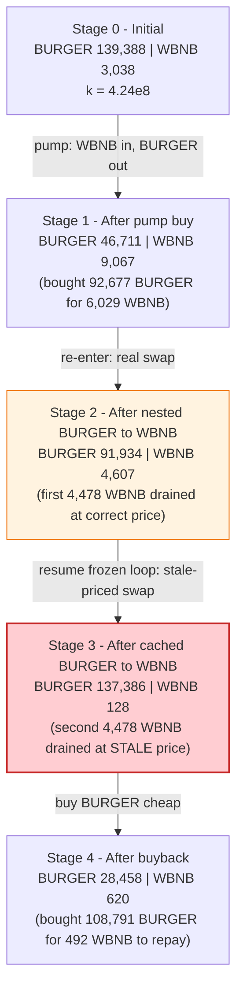
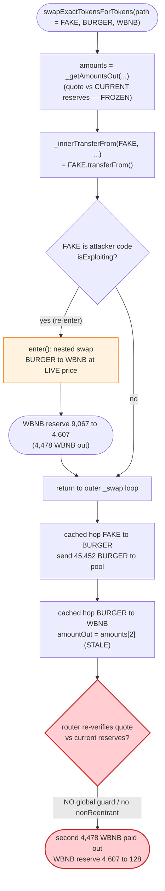
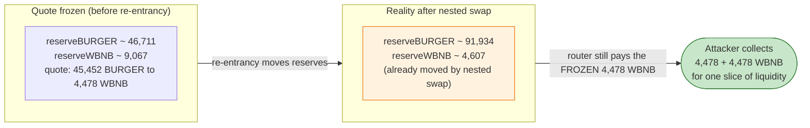

# BurgerSwap (Demax) Exploit — Re-entrant Multi-Hop Swap Drains the WBNB Side of the Pool Twice

> **Vulnerability classes:** vuln/reentrancy/cross-function · vuln/governance/flash-loan-attack

> **Reproduction:** the PoC compiles & runs in an isolated Foundry project at
> [this project folder](.) (the umbrella DeFiHackLabs repo contains many
> unrelated PoCs that do not compile together, so this one was extracted).
> Full verbose trace: [output.txt](output.txt).
> Verified vulnerable source: [DemaxPlatform.sol](sources/DemaxPlatform_Bf6527/DemaxPlatform.sol).

---

## Key info

| | |
|---|---|
| **Loss** | ~**$3.2M** — attacker walked off with **110,564 BURGER + 2,398 WBNB** (net) after repaying a 6,065 WBNB flash loan |
| **Vulnerable contract** | `DemaxPlatform` (BurgerSwap router) — [`0xBf6527834dBB89cdC97A79FCD62E6c08B19F8ec0`](https://bscscan.com/address/0xBf6527834dBB89cdC97A79FCD62E6c08B19F8ec0#code) |
| **Victim pool** | BURGER/WBNB Demax pair — [`0x7ac55ac530f2C29659573Bde0700c6758D69e677`](https://bscscan.com/address/0x7ac55ac530f2C29659573Bde0700c6758D69e677) (`token0 = BURGER`, `token1 = WBNB`) |
| **Flash-loan source** | PancakeSwap USDT/WBNB pair — `0x16b9a82891338f9bA80E2D6970FddA79D1eb0daE` |
| **Attacker EOA** | `0x6c9f2b95ca3432e5ec5bcd9c19de0636a23a4994` |
| **Attacker contract** | `0xae0f538409063e66ff0e382113cb1a051fc069cd` |
| **Attack tx** | [`0xac8a739c1f668b13d065d56a03c37a686e0aa1c9339e79fcbc5a2d0a6311e333`](https://bscscan.com/tx/0xac8a739c1f668b13d065d56a03c37a686e0aa1c9339e79fcbc5a2d0a6311e333) |
| **Chain / block / date** | BSC / 7,781,159 / **May 28, 2021** |
| **Compiler** | Solidity **v0.6.6** (`DemaxPlatform`, optimizer 200 runs) |
| **Bug class** | Cross-function read-only / state re-entrancy in a router that caches AMM quotes across hops and lacks a re-entrancy guard |

---

## TL;DR

BurgerSwap's `DemaxPlatform` router executes a multi-hop swap in two distinct phases:

1. It **pre-computes all output amounts up-front** from the *current* reserves
   (`_getAmountsOut`, [DemaxPlatform.sol:692-706](sources/DemaxPlatform_Bf6527/DemaxPlatform.sol#L692-L706), called at
   [:811](sources/DemaxPlatform_Bf6527/DemaxPlatform.sol#L811)).
2. It then walks the path hop-by-hop in `_swap`
   ([:744-768](sources/DemaxPlatform_Bf6527/DemaxPlatform.sol#L744-L768)), pulling the input token from the user with
   `_innerTransferFrom` ([:825-833](sources/DemaxPlatform_Bf6527/DemaxPlatform.sol#L825-L833)), which fires a
   `transferNotify` callback to a *configurable* transfer listener.

There is **no re-entrancy guard** anywhere on the swap path. The attacker deploys a
**fake ERC20 (`FAKE`)** whose `transferFrom` re-enters the router mid-swap. By routing
a `FAKE -> BURGER -> WBNB` swap, the attacker makes the router:

- pull `FAKE` from itself, which **re-enters** and performs a *real* `BURGER -> WBNB`
  swap against the live BURGER/WBNB pool — draining **4,478 WBNB**, and then
- return to the original (now stale) loop and execute the cached `BURGER -> WBNB`
  hop, draining **another 4,478 WBNB at the pre-re-entrancy price** even though the
  pool's WBNB reserve had already collapsed.

The same liquidity is therefore sold for WBNB **twice**. The pool's WBNB reserve falls
from ~9,067 to **128**, and the attacker repays the flash loan and walks off with the
pool's WBNB plus tens of thousands of BURGER. The PoC reproduces `BURGER exploited:
110564` / `WBNB exploited: 2398`.

---

## Background — what DemaxPlatform does

`DemaxPlatform` ([source](sources/DemaxPlatform_Bf6527/DemaxPlatform.sol)) is BurgerSwap's
Uniswap-V2-style router ("Demax"). It is the only contract that is allowed to drive the
Demax pairs (each `DemaxPair` checks `msg.sender == platform()` before swapping). It differs
from a vanilla V2 router in two security-relevant ways:

- **It charges a `DGAS` fee and "notifies" a transfer listener on every token movement.**
  Both `_innerTransferFrom` ([:825](sources/DemaxPlatform_Bf6527/DemaxPlatform.sol#L825)) and `_swap`
  ([:763-765](sources/DemaxPlatform_Bf6527/DemaxPlatform.sol#L763-L765)) call
  `_transferNotify` ([:967-974](sources/DemaxPlatform_Bf6527/DemaxPlatform.sol#L967-L974)), which calls an
  external `IDemaxTransferListener(TRANSFER_LISTENER).transferNotify(...)`. More importantly,
  the *input token's own* `transferFrom` is called via
  `TransferHelper.safeTransferFrom` ([:831](sources/DemaxPlatform_Bf6527/DemaxPlatform.sol#L831)), and that token
  can be **anything the attacker registers** (BurgerSwap permissionlessly creates pairs / adds tokens
  on first `addLiquidity`, as seen at [output.txt:265-472](output.txt)).
- **It caches amounts across hops.** `swapExactTokensForTokens`
  ([:802-823](sources/DemaxPlatform_Bf6527/DemaxPlatform.sol#L802-L823)) computes the entire `amounts[]`
  array once at [:811](sources/DemaxPlatform_Bf6527/DemaxPlatform.sol#L811), *before* any token moves, then passes that
  frozen array into `_swap` ([:820](sources/DemaxPlatform_Bf6527/DemaxPlatform.sol#L820)) where each hop blindly uses
  `amounts[i+1]` ([:756](sources/DemaxPlatform_Bf6527/DemaxPlatform.sol#L756)) as the exact output to request from the pair.

On-chain state of the victim BURGER/WBNB pair at fork block 7,781,159 (decoded from
`getReserves()` at [output.txt:41](output.txt)):

| Reserve | Value |
|---|---|
| `reserve0` (BURGER) | **139,388.56 BURGER** |
| `reserve1` (WBNB) | **3,038.76 WBNB** |
| `k = r0·r1` | ≈ 4.236e8 |

> Note: by the time the attacker reaches the double-spend, the pool already holds far more
> WBNB than 3,038 — the attacker first *pumps* WBNB into the pool by buying BURGER, so the
> WBNB reserve at the moment of the double-drain is **9,067 WBNB** (see the walkthrough).

---

## The vulnerable code

### 1. Amounts are frozen before any token moves

```solidity
function swapExactTokensForTokens(
    uint256 amountIn,
    uint256 amountOutMin,
    address[] calldata path,
    address to,
    uint256 deadline
) external ensure(deadline) returns (uint256[] memory amounts) {
    uint256 percent = _getSwapFeePercent();
    amounts = _getAmountsOut(amountIn, path, percent);   // ← (A) quote uses CURRENT reserves
    require(amounts[amounts.length - 1] >= amountOutMin, '...INSUFFICIENT_OUTPUT_AMOUNT');
    address pair = DemaxSwapLibrary.pairFor(FACTORY, path[0], path[1]);
    _innerTransferFrom(                                   // ← (B) pulls path[0]; for FAKE this RE-ENTERS
        path[0], msg.sender, pair,
        SafeMath.mul(amountIn, SafeMath.sub(PERCENT_DENOMINATOR, percent)) / PERCENT_DENOMINATOR
    );
    _swap(amounts, path, to);                             // ← (C) executes hops with the STALE quote from (A)
    _innerTransferFrom(path[0], msg.sender, pair, SafeMath.mul(amounts[0], percent) / PERCENT_DENOMINATOR);
    _swapFee(amounts, path, percent);
}
```
[DemaxPlatform.sol:802-823](sources/DemaxPlatform_Bf6527/DemaxPlatform.sol#L802-L823)

### 2. The hop loop blindly requests the cached output from each pair

```solidity
function _swap(uint256[] memory amounts, address[] memory path, address _to) internal {
    require(!isPause, "DEMAX PAUSED");
    require(swapPrecondition(path[path.length - 1]), '...');
    for (uint256 i; i < path.length - 1; i++) {
        (address input, address output) = (path[i], path[i + 1]);
        ...
        uint256 amountOut = amounts[i + 1];              // ← uses the frozen quote, not live reserves
        (uint256 amount0Out, uint256 amount1Out) = input == token0
            ? (uint256(0), amountOut) : (amountOut, uint256(0));
        address to = i < path.length - 2 ? DemaxSwapLibrary.pairFor(FACTORY, output, path[i + 2]) : _to;
        IDemaxPair(DemaxSwapLibrary.pairFor(FACTORY, input, output)).swap(amount0Out, amount1Out, to, new bytes(0));
        ...
    }
}
```
[DemaxPlatform.sol:744-768](sources/DemaxPlatform_Bf6527/DemaxPlatform.sol#L744-L768)

### 3. The re-entrancy door: input token's own `transferFrom`

```solidity
function _innerTransferFrom(address token, address from, address to, uint256 amount) internal {
    TransferHelper.safeTransferFrom(token, from, to, amount);  // ← token.transferFrom() — attacker-controlled for FAKE
    _transferNotify(from, to, token, amount);
}
```
[DemaxPlatform.sol:825-833](sources/DemaxPlatform_Bf6527/DemaxPlatform.sol#L825-L833)

Note the **complete absence of a `nonReentrant` modifier**: there is no lock guarding
`swapExactTokensForTokens` / `_swap`, and the individual `DemaxPair.swap` calls happen one
at a time across the loop, so a nested router call can freely operate on the same pair *in
between* the cached hops.

---

## Root cause — why it was possible

A correct V2 router is safe even though it pre-computes amounts, because each pair's
`swap()` enforces the constant-product invariant `x·y ≥ k` against its *own current*
balances at call time: if the reserves moved between quote and execution, the pair's
`swap` would revert (`K` check). BurgerSwap breaks this safety in two compounding ways:

1. **Cached quote + no re-entrancy guard.** The router freezes the multi-hop output amounts
   ([:811](sources/DemaxPlatform_Bf6527/DemaxPlatform.sol#L811)) and then *re-enters itself* through the attacker's
   `FAKE.transferFrom` before the cached hops run. The pair's per-call `K` check does not
   save the protocol here, because the **two BURGER→WBNB sales happen in two separate top-level
   `swap()` calls** — the inner (nested) one and the outer (cached) one — and each one is
   internally consistent. There is no global invariant that says "the BURGER reserve I quoted
   against is the BURGER reserve I'm selling into." The router trusts its own stale `amounts[]`.

2. **The input token is attacker code.** Because BurgerSwap lets anyone register a token and
   create a pair, the attacker controls the very function (`FAKE.transferFrom`) the router calls
   first inside the swap. The exact same finding shape appears in the Impossible Finance and
   several other 2021 router exploits.

Concretely, the path `FAKE -> BURGER -> WBNB` weaponizes this:

> Hop 0 of the cached loop pulls `FAKE` from the attacker (`_innerTransferFrom`,
> [:814](sources/DemaxPlatform_Bf6527/DemaxPlatform.sol#L814)). That call lands in `FAKE.transferFrom`, which
> re-enters the router with a *fresh*, correctly-priced `BURGER -> WBNB` swap that drains the
> live WBNB reserve. When the original loop resumes, hop 1 (`BURGER -> WBNB`) requests the
> **cached** WBNB output computed before the re-entrancy — selling the same liquidity into the
> already-drained pool at the old price, pulling a second, equal chunk of WBNB.

The pool's WBNB reserve is sold **twice for the price of once**.

---

## Preconditions

- The attacker can register an arbitrary token and create a Demax pair for it (permissionless
  `addLiquidity` path — [output.txt:265-472](output.txt) shows `FAKE/BURGER` being created on the fly).
- The router has no re-entrancy guard on `swapExactTokensForTokens` / `_swap`.
- Working capital in WBNB to (a) pump BURGER price up first and (b) seed the FAKE/BURGER pool.
  This is fully recovered intra-transaction, so the whole attack is **flash-loanable** — the
  PoC borrows **6,047 WBNB** from the PancakeSwap USDT/WBNB pair via `swap(...) + pancakeCall`
  ([BurgerSwap_exp.sol:33](test/BurgerSwap_exp.sol#L33)).

---

## Attack walkthrough (with on-chain numbers from the trace)

All figures below are decoded directly from the `Sync` / `Swap` events in
[output.txt](output.txt). For the BURGER/WBNB pair, `reserve0 = BURGER`, `reserve1 = WBNB`.

| # | Step (trace ref) | BURGER reserve0 | WBNB reserve1 | Effect |
|---|------|-----------:|-------------:|--------|
| 0 | **Initial** ([:41](output.txt)) | 139,388.56 | 3,038.76 | Honest pool, `k ≈ 4.24e8`. |
| 1 | **Flash-borrow** 6,047 WBNB from PancakeSwap USDT/WBNB ([BurgerSwap_exp.sol:33](test/BurgerSwap_exp.sol#L33)) | — | — | Working capital. |
| 2 | **Pump:** swap 6,029 WBNB (net) → 92,677 BURGER ([Swap@76](output.txt)) | 46,711.51 | 9,067.75 | BURGER bought out of the pool; WBNB reserve inflated to **9,067**. |
| 3 | **Create FAKE/BURGER pair**, add 100 FAKE ↔ 45,452 BURGER liquidity ([:265-472](output.txt)) | — | — | FAKE has a re-entrant `transferFrom`. |
| 4 | **`enableExploit()`** then call `swapExactTokensForTokens(1 FAKE, [FAKE, BURGER, WBNB])` ([:532](output.txt)) | — | — | Router freezes `amounts[]` against the 46,711/9,067-ish state. |
| 5 | Router pulls 0.997 FAKE → triggers `FAKE.transferFrom` → **re-enter `enter()`** ([:545-546](output.txt)) | — | — | Inside the cached swap, before its own hops run. |
| 6 | **(nested) swap 45,316 BURGER → 4,478.57 WBNB** ([Swap@596](output.txt)) | 91,934.08 | **4,607.32** | First, correctly-priced drain. WBNB reserve halved. |
| 7 | re-entrancy returns; **cached hop FAKE→BURGER** sends 45,452 BURGER to the pool ([Swap@765](output.txt)) | — | — | BURGER reserve refilled by the FAKE pool's output. |
| 8 | **cached hop BURGER→WBNB at STALE price → 4,478.57 WBNB** ([Swap@812](output.txt)) | 137,386.08 | **128.76** | ⚠️ **Same 4,478 WBNB pulled again**; WBNB reserve collapses to **128**. |
| 9 | **Buyback** to repay flash loan: swap 492.2 WBNB → 108,791 BURGER ([Swap@1073](output.txt)) | 28,458.72 | 620.96 | Cheap BURGER (pool is BURGER-heavy). |
| 10 | **Repay** 6,065.33 WBNB (= 6,047·1000/997) to PancakeSwap ([:1247](output.txt)) | — | — | Flash loan + 0.3% fee. |

**The double-spend, side by side** — both sells output the *identical* `4478568384980737...` WBNB:

| | BURGER in | WBNB out | Pool WBNB before → after |
|---|---:|---:|---|
| (6) nested, correct price | 45,315.644 | **4,478.5683849807376** | 9,067.75 → 4,607.32 |
| (8) cached, stale price | 45,452.000 | **4,478.5683849807374** | 4,607.32 → **128.76** |

The second sale receives essentially the same WBNB as the first despite the pool already
being half-empty — proof the router used the pre-re-entrancy quote.

---

## Profit / loss accounting

| Item | WBNB |
|---|---:|
| Flash-loan borrowed | 6,047.13 |
| Flash-loan repaid (0.3% fee) | 6,065.33 |
| WBNB pulled from pool: 2 × 4,478.57 | 8,957.14 |
| WBNB spent pumping (step 2) | 6,028.99 |
| WBNB spent on buyback (step 9) | 492.20 |
| **Net WBNB kept** | **≈ 2,398.13** |
| **BURGER kept** | **110,564.05** |

The PoC's closing logs confirm the spoils:

```
BURGER exploited: 110564
WBNB exploited: 2398
```

At late-May-2021 prices (WBNB ≈ $370, BURGER ≈ $9-10), the combined haul of ~2,398 WBNB
plus ~110,564 BURGER is in line with the **~$3.2M** loss attributed to this incident.

---

## Diagrams

### Sequence of the attack

```mermaid
sequenceDiagram
    autonumber
    actor A as "Attacker contract"
    participant FL as "PancakeSwap USDT/WBNB (flash loan)"
    participant R as "DemaxPlatform (router)"
    participant BW as "BURGER/WBNB pair (victim)"
    participant FK as "FAKE token"
    participant FB as "FAKE/BURGER pair"

    A->>FL: "swap() → borrow 6,047 WBNB"
    FL-->>A: "pancakeCall(...)"

    rect rgb(255,243,224)
    Note over A,BW: "Step 2 — pump BURGER price"
    A->>R: "swap 6,029 WBNB → BURGER"
    R->>BW: "swap()"
    Note over BW: "46,711 BURGER / 9,067 WBNB"
    end

    rect rgb(232,245,233)
    Note over A,FB: "Step 3 — seed re-entrant token"
    A->>R: "addLiquidity(FAKE, BURGER, 100, 45,452)"
    R->>FB: "create FAKE/BURGER pair"
    A->>FK: "enableExploit()"
    end

    rect rgb(255,235,238)
    Note over A,BW: "Steps 4-8 — the re-entrant double-spend"
    A->>R: "swap 1 FAKE, path = [FAKE, BURGER, WBNB]"
    Note over R: "amounts[] FROZEN here (quote vs current reserves)"
    R->>FK: "_innerTransferFrom: FAKE.transferFrom()"
    FK->>A: "transferFrom hook → enter()"
    A->>R: "(nested) swap 45,316 BURGER → WBNB"
    R->>BW: "swap() — REAL price"
    BW-->>A: "4,478.57 WBNB out (9,067 → 4,607)"
    Note over R: "re-entrancy returns; resume FROZEN loop"
    R->>BW: "cached hop FAKE→BURGER: send 45,452 BURGER"
    R->>BW: "cached hop BURGER→WBNB at STALE quote"
    BW-->>A: "4,478.57 WBNB out AGAIN (4,607 → 128)"
    end

    rect rgb(227,242,253)
    Note over A,BW: "Steps 9-10 — settle"
    A->>R: "buy back 108,791 BURGER for 492 WBNB"
    A->>FL: "repay 6,065 WBNB"
    end

    Note over A: "Net +2,398 WBNB and +110,564 BURGER (≈ $3.2M)"
```

### Pool state evolution (BURGER/WBNB victim pair)



### The flaw inside `swapExactTokensForTokens` / `_swap`



### Why it is theft: one liquidity slice, sold twice



---

## Remediation

1. **Add a global re-entrancy guard to the router.** A single `nonReentrant` modifier on
   `swapExactTokensForTokens` / `swapTokensForExactTokens` / `_swap` would make the nested
   `enter()` swap revert, eliminating the double-spend entirely. This is the root fix.
2. **Do not cache quotes across hops in the presence of external calls.** Re-read each pair's
   reserves immediately before requesting its output, or push input tokens to the pair and let
   the pair compute the output (the modern V2 pattern), so a hop can never settle against a
   reserve state that differs from the one it was quoted against.
3. **Treat the input token's transfer as untrusted.** Because BurgerSwap permits arbitrary
   token registration, every `token.transferFrom` inside a swap is an external call to
   attacker code. Pull all required input *before* doing any pricing-sensitive work, follow
   strict checks-effects-interactions, and never re-enter the swap engine from a transfer
   callback.
4. **Remove / harden the `transferNotify` listener hook.** The `_transferNotify` external call
   on every transfer is an additional re-entrancy surface; if it must stay, it should be a
   trusted, immutable contract and must run after all state-affecting work, behind the guard.
5. **Validate output against live reserves.** After each hop, assert the WBNB actually
   received equals the amount the pair's *current* reserves can justify (i.e. re-run
   `getAmountOut` against post-call reserves), reverting on mismatch.

---

## How to reproduce

The PoC was extracted into a standalone Foundry project (the umbrella DeFiHackLabs repo has
many unrelated PoCs that fail to compile together under one `forge test` build):

```bash
_shared/run_poc.sh 2021-05-BurgerSwap_exp --mt testExploit -vvvvv
```

- RPC: a **BSC archive** endpoint is required (fork block 7,781,159 is from May 2021).
  `foundry.toml` uses `https://bsc-mainnet.public.blastapi.io`, which serves historical state at
  that block; most pruned public BSC RPCs fail here with `header not found` / `missing trie node`.
- Result: `[PASS] testExploit()` with `BURGER exploited: 110564` and `WBNB exploited: 2398`.

Expected tail:

```
Ran 1 test for test/BurgerSwap_exp.sol:Exploit
[PASS] testExploit() (gas: 7277280)
Logs:
  BURGER exploited: 110564
  WBNB exploited: 2398
```

---

*References:*
- *Lunaray — BurgerSwap attack analysis: https://lunaray.medium.com/burgerswap-attack-analysis-c0345541d69*
- *QuillAudits — BurgerSwap flash-loan attack analysis: https://quillhashteam.medium.com/burgerswap-flash-loan-attack-analysis-888b1911daef*
- *SlowMist Hacked — https://hacked.slowmist.io/ (BurgerSwap, BSC, ~$3.2M).*
