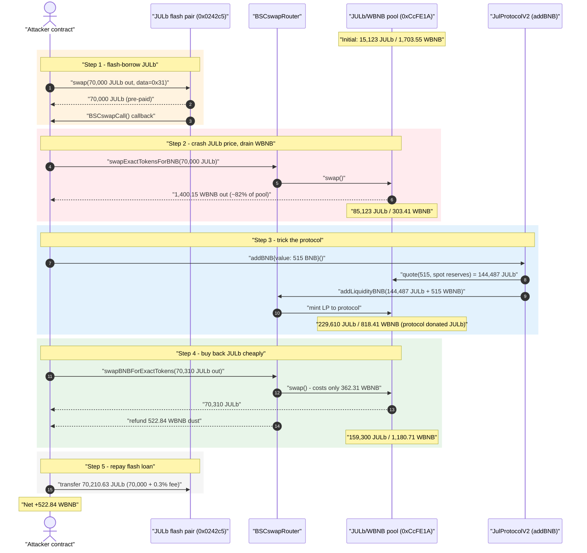
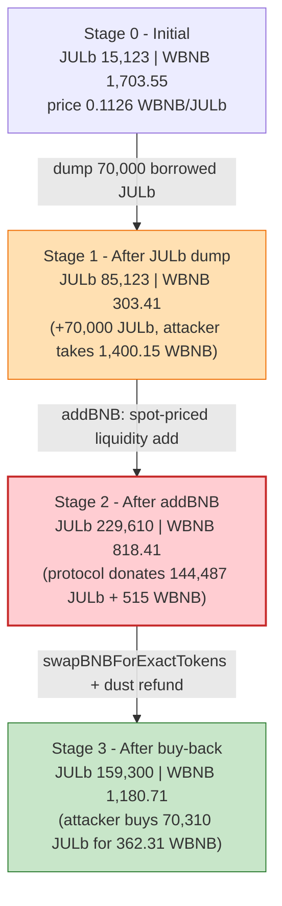
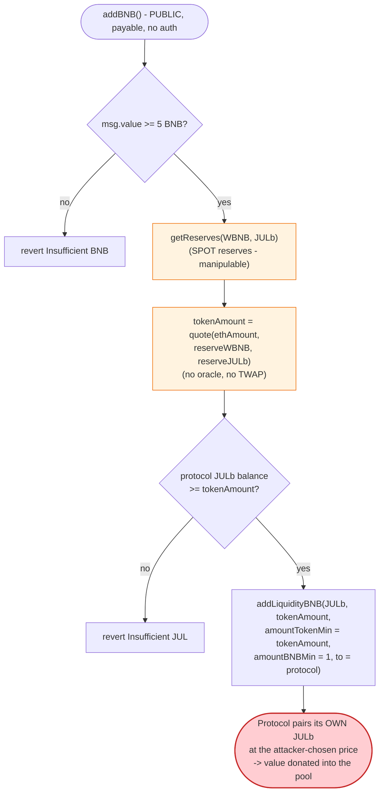

# JulSwap (JulProtocolV2) Exploit — Spot-Price Manipulation of `addBNB()` Liquidity Provisioning

> **Vulnerability classes:** vuln/oracle/spot-price · vuln/governance/flash-loan-attack

> **Reproduction:** the PoC compiles & runs in an isolated Foundry project at
> [this project folder](.) (the umbrella DeFiHackLabs repo contains many
> unrelated PoCs that do not whole-compile, so this one was extracted).
> Full verbose trace: [output.txt](output.txt).
> Verified vulnerable source: [JulProtocolV2.sol](sources/JulProtocolV2_41a2F9/JulProtocolV2.sol).

---

## Key info

| | |
|---|---|
| **Loss** | **522.84 WBNB** drained in the reproduced tx (~$155K–$190K @ ~$300–370/BNB late-May-2021). DeFiHackLabs lists cumulative damage at ~$1.5M. |
| **Vulnerable contract** | `JulProtocolV2` — [`0x41a2F9AB325577f92e8653853c12823b35fb35c4`](https://bscscan.com/address/0x41a2F9AB325577f92e8653853c12823b35fb35c4#code) (the `addBNB()` yield-deposit entry point) |
| **Token** | `JULb` / `ERC677BridgeToken` — [`0x32dFFc3fE8E3EF3571bF8a72c0d0015C5373f41D`](https://bscscan.com/address/0x32dffc3fe8e3ef3571bf8a72c0d0015c5373f41d#code) |
| **Victim pool** | JULb/WBNB BSCswap pair — `0xCcFE1A5b6e4aD16A4e41A9142673dEc829f39402` |
| **Flash-loan source** | JULb-paired BSCswap pair — `0x0242c5C11E3eaeb53298b45C7395DbaDc8a120E7` |
| **Router** | BSCswapRouter02 — `0xbd67d157502A23309Db761c41965600c2Ec788b2` |
| **Attacker EOA** | [`0xc3bc29941677db01b9645f7b8b72d27e3ba75372`](https://bscscan.com/address/0xc3bc29941677db01b9645f7b8b72d27e3ba75372) |
| **Attacker contract** | [`0x7c591aab9429af81287951872595a17d5837ce03`](https://bscscan.com/address/0x7c591aab9429af81287951872595a17d5837ce03) |
| **Attack tx** | [`0x1751268e620767ff117c5c280e9214389b7c1961c42e77fc704fd88e22f4f77a`](https://bscscan.com/tx/0x1751268e620767ff117c5c280e9214389b7c1961c42e77fc704fd88e22f4f77a) |
| **Chain / block / date** | BSC / 7,785,586 / **2021-05-27** (~22:56 UTC) |
| **Compiler** | Solidity v0.6.12, optimizer 1000 runs |
| **Bug class** | AMM spot-price manipulation — liquidity provisioning sized from instantaneous reserves with no slippage / oracle guard |

---

## TL;DR

`JulProtocolV2.addBNB()` is a "yield deposit": a user sends BNB, and the protocol pairs the user's BNB
with **the protocol's own JULb inventory** to add liquidity to the JULb/WBNB BSCswap pool. The amount
of JULb to pair is computed from the pool's **instantaneous spot reserves**
([JulProtocolV2.sol:989-1006](sources/JulProtocolV2_41a2F9/JulProtocolV2.sol#L989-L1006)) with the
router's minimum-amount guards hard-coded to `1`
([:1004-1006](sources/JulProtocolV2_41a2F9/JulProtocolV2.sol#L1004-L1006)). There is no TWAP, no
oracle, and no caller-supplied slippage bound.

The attacker manipulates that spot price inside one atomic transaction:

1. **Flash-borrow 70,000 JULb** from an unrelated JULb pair (`0x0242c5…`) via a Uniswap-V2 flash swap.
2. **Dump the 70,000 JULb** into the JULb/WBNB pool through `swapExactTokensForBNB`, crashing the JULb
   price and **extracting 1,400.15 WBNB** — ~82% of the pool's entire WBNB reserve.
3. **Call `addBNB{value: 515 ether}()`.** Because JULb is now artificially cheap, the protocol values
   its inventory at the crashed price and dumps **144,487 JULb + 515 WBNB** into the depleted pool —
   donating its JULb to refill the pool's token side that the attacker just drained.
4. **Buy the JULb back cheaply** (`swapBNBForExactTokens`: 362.31 WBNB → 70,310 JULb), repay the
   70,210 JULb flash loan, and pocket the BNB difference.

Net: the attacker walks off with **522.84 WBNB**, funded by the protocol's own JULb inventory being
dumped into the pool at a manipulated rate.

---

## Background — what `JulProtocolV2.addBNB()` does

`JulProtocolV2` ([source](sources/JulProtocolV2_41a2F9/JulProtocolV2.sol)) is a BNB-staking / yield
product layered on top of the BSCswap (a SushiSwap/Uniswap-V2 fork) JULb/WBNB pool. Its central
deposit function is `addBNB()`:

- The depositor sends BNB (`msg.value >= 5 BNB`,
  [:982](sources/JulProtocolV2_41a2F9/JulProtocolV2.sol#L982)).
- The protocol reads the **current** pool reserves and computes how much JULb to pair with that BNB
  using the constant-product `quote()`
  ([:989-995](sources/JulProtocolV2_41a2F9/JulProtocolV2.sol#L989-L995)).
- The protocol **uses its OWN JULb balance** to fund that token side
  ([:997-1002](sources/JulProtocolV2_41a2F9/JulProtocolV2.sol#L997-L1002)) and adds liquidity, minting
  the LP **to itself** (`spender = address(this)`,
  [:1000-1006](sources/JulProtocolV2_41a2F9/JulProtocolV2.sol#L1000-L1006)).
- The depositor's "balance" is recorded as the BNB they put in, to accrue interest later
  ([:1008-1016](sources/JulProtocolV2_41a2F9/JulProtocolV2.sol#L1008-L1016)).

On-chain state at the fork block (from the trace):

| Item | Value |
|---|---|
| Pool JULb reserve (`reserve0`) | **15,123.22 JULb** |
| Pool WBNB reserve (`reserve1`) | **1,703.55 WBNB** |
| Spot price | ~0.1126 WBNB / JULb |
| `JulProtocolV2` JULb inventory | **148,525 JULb** (available to be paired) |
| Router min-amount guards in `addBNB` | hard-coded **`1`** |

The pool's `token0 = JULb`, `token1 = WBNB` (since `0x32dF… < 0xbb4C…`).

---

## The vulnerable code

`addBNB()` ([:973-1017](sources/JulProtocolV2_41a2F9/JulProtocolV2.sol#L973-L1017)):

```solidity
function addBNB() public payable returns (uint256 amountToken, uint256 amountBNB, uint256 liquidity) {
    require(msg.value >= MINIMUM_DEPOSIT_AMOUNT, "Insufficient BNB");

    uint ethAmount = msg.value;

    uint reserveA;
    uint reserveB;
    (reserveA, reserveB) = BSCswapLibrary.getReserves(BSCSWAP_FACTORY, WBNB, TOKEN); // ⚠️ SPOT reserves

    uint tokenAmount = BSCswapLibrary.quote(ethAmount, reserveA, reserveB);          // ⚠️ spot-priced size

    uint256 balance = JulToken.balanceOf(address(this));
    require(balance >= tokenAmount, "Insufficient JUL token amount");                // protocol funds the JUL side

    address payable spender = address(this);
    JulToken.approve(router02Address, tokenAmount);

    (amountToken, amountBNB, liquidity) = bscswapRouter02.addLiquidityBNB{value: ethAmount}(
        TOKEN, tokenAmount, tokenAmount, 1, spender, block.timestamp                 // ⚠️ amountTokenMin = tokenAmount, amountBNBMin = 1, LP minted to protocol
    );
    ...
}
```

`quote()` ([BSCswapLibrary, JulProtocolV2.sol:815-819](sources/JulProtocolV2_41a2F9/JulProtocolV2.sol#L815-L819))
is the standard constant-product ratio, evaluated on whatever the reserves happen to be at call time:

```solidity
function quote(uint amountA, uint reserveA, uint reserveB) internal pure returns (uint amountB) {
    require(amountA > 0, 'BSCswapLibrary: INSUFFICIENT_AMOUNT');
    require(reserveA > 0 && reserveB > 0, 'BSCswapLibrary: INSUFFICIENT_LIQUIDITY');
    amountB = amountA.mul(reserveB) / reserveA;     // amountB = ethAmount * reserveJUL / reserveWBNB
}
```

---

## Root cause — why it was possible

A Uniswap-V2/BSCswap pool's reserves are *spot* state: anyone can shove them around inside a single
transaction with a swap and then move them back. `addBNB()` trusts that spot state in two compounding
ways:

1. **The JULb contribution is sized from the manipulated spot ratio.** After the attacker crashes the
   JULb price, `quote(515 BNB, reserveWBNB=303.41, reserveJUL=85,123)` returns **144,487 JULb** — the
   protocol is tricked into pairing ~10× more JULb than it would at the honest price.
2. **There is no slippage / sanity bound on the protocol side.** The call passes
   `addLiquidityBNB(TOKEN, tokenAmount, /*amountTokenMin=*/tokenAmount, /*amountBNBMin=*/1, …)`. Min-amounts
   are not protecting the *protocol's* economics against price manipulation — they only protect the
   add-liquidity ratio from racing. The protocol has **no concept of "is this price reasonable?"**
   because it never consults a manipulation-resistant oracle (a TWAP, Chainlink feed, or a stored
   reference price).

Because the protocol pairs **its own inventory** at the attacker-chosen price, the deposit is
effectively the protocol *donating JULb into the pool at a discount*. Combined with the attacker having
already drained the BNB side, the protocol's JULb donation lets the attacker re-buy the token cheaply
and recover its flash loan, banking the BNB it extracted.

The three design decisions that compose into the bug:

1. **Spot-reserve pricing** with no oracle.
2. **Protocol funds the token side from its own balance** — so a mispriced add is a direct loss of
   protocol-owned value, not the user's.
3. **Permissionless, atomic deposit** — `addBNB()` is callable by anyone in the same transaction as the
   price manipulation, so the manipulated state and the deposit happen atomically and the manipulation
   is undetectable.

---

## Preconditions

- The JULb/WBNB pool has live WBNB reserves to drain (1,703.55 WBNB here).
- `JulProtocolV2` holds a meaningful JULb inventory to be mispaired (148,525 JULb here).
- Access to a JULb flash-loan source — the attacker uses a Uniswap-V2 **flash swap** from a second
  JULb pair (`0x0242c5…`), borrowing 70,000 JULb and repaying 70,210.63 JULb (0.3% fee) at the end of
  the same transaction. No upfront capital in JULb is required.
- Enough working BNB to fund `addBNB` (515) and the buy-back (362.31). In the live attack this was
  bootstrapped from the 1,400.15 WBNB extracted in step 2; the PoC seeds the attacker via `deal`.

---

## Attack walkthrough (with on-chain numbers from the trace)

All figures are taken directly from the `getReserves`/`Sync`/`Swap` events in
[output.txt](output.txt). Pool `token0 = JULb`, `token1 = WBNB`.

| # | Step | JULb reserve | WBNB reserve | Effect |
|---|------|-------------:|-------------:|--------|
| 0 | **Initial** (honest pool) | 15,123.22 | 1,703.55 | Spot price ≈ 0.1126 WBNB/JULb. |
| 1 | **Flash-borrow 70,000 JULb** from `0x0242c5…` via `swap(70000,0,attacker,"1")` → triggers `BSCswapCall` | — | — | Attacker now holds 70,000 JULb to deploy. |
| 2 | **Dump 70,000 JULb → WBNB** (`swapExactTokensForBNB`), withdraw to BNB | 85,123.22 | 303.41 | Attacker **extracts 1,400.15 WBNB** (~82% of pool WBNB); JULb price crashed ~5.6×. |
| 3 | **`addBNB{value: 515}`** — `quote(515, WBNB=303.41, JULb=85,123)` = **144,487 JULb**; protocol pairs 144,487 JULb + 515 WBNB | 229,610.82 | 818.41 | Protocol **donates 144,487 JULb** into the pool at the crashed price; LP minted to protocol. |
| 4 | **`swapBNBForExactTokens`** — buy exactly 70,310.63 JULb for 362.31 WBNB | 159,300.19 | 1,180.71 | Attacker re-acquires the JULb cheaply; router refunds **522.84 WBNB** dust. |
| 5 | **Repay flash loan**: transfer 70,210.63 JULb back to `0x0242c5…` | — | — | Flash swap settled (70,000 borrowed + 0.3% fee); ~100 JULb dust remains. |

### Step-by-step (call-level, from the trace)

1. **`BSCswapPair(0x0242c5).swap(70_000e18, 0, attacker, "1")`** — non-empty `data` makes this a
   **flash swap**: 70,000 JULb is transferred to the attacker *before* repayment, then the pair calls
   back `BSCswapCall(...)` on the attacker ([output.txt:47-57](output.txt)).
2. Inside `BSCswapCall` ([JulSwap_exp.sol:66-84](test/JulSwap_exp.sol#L66-L84)):
   - `approve(Router, max)` then **`swapExactTokensForBNB(70_000 JULb → WBNB)`** on the JULb/WBNB pool.
     The pool returns **1,400.15 WBNB** (verified: `getAmountOut(70000, 15123.22, 1703.55)=1400.147`),
     unwrapped to native BNB and sent to the attacker ([output.txt:63-100](output.txt)). Pool is now
     **85,123 JULb / 303.41 WBNB**.
   - **`JulProtocolV2.addBNB{value: 515 ether}()`** ([output.txt:101-158](output.txt)). The protocol
     reads the *manipulated* reserves and quotes **144,487.6 JULb** for 515 BNB
     (verified: `515 * 85123.22 / 303.41 = 144487.6`), approves it, and calls `addLiquidityBNB`. The
     pool absorbs **144,487 JULb + 515 WBNB**, becoming **229,610.82 JULb / 818.41 WBNB**; LP is minted
     to the protocol.
   - **`swapBNBForExactTokens{value: 885.15 ether}(70_310.63 JULb out, [WBNB,JULb], attacker)`**
     ([output.txt:159-194](output.txt)). Buying 70,310.63 JULb requires only **362.31 WBNB**
     (verified: `getAmountIn(70310.63, 818.41, 229610.82)=362.309`); the router refunds the unused
     **522.84 WBNB** to the attacker ([output.txt:192](output.txt)).
   - **`JULb.transfer(0x0242c5, 70_210.63 JULb)`** repays the flash swap (70,000 + 0.3% fee)
     ([output.txt:195-204](output.txt)).
3. Final attacker BNB balance: **522.838342910629238613 BNB**
   ([output.txt:216](output.txt)).

### Profit accounting (native BNB through the attacker contract)

| Direction | Amount (BNB) |
|---|---:|
| **In** — step 2 swap (70,000 JULb → BNB) | +1,400.146882 |
| **Out** — `addBNB` deposit | −515.000000 |
| **Out** — `swapBNBForExactTokens` value sent | −885.146882 |
| **In** — router dust refund | +522.838343 |
| **Net profit** | **+522.838343** |

The 70,000 JULb flash loan is fully repaid (70,210.63 JULb) out of the 70,310.63 JULb bought in step 4,
leaving ~100 JULb of dust. The entire BNB profit therefore comes from the **protocol's JULb inventory**
being dumped into the pool at the manipulated price.

---

## Diagrams

### Sequence of the attack



### Pool state evolution



### The flaw inside `addBNB()`



---

## Why each magic number

- **`swap(70,000 JULb, 0, attacker, "1")`** — borrowing 70,000 JULb via flash swap is sized so that, after
  dumping it, the pool's WBNB is drained to ~303 WBNB and JULb price is crashed ~5.6× — large enough that
  the subsequent `addBNB` quote inflates the protocol's JULb contribution dramatically, but small enough
  that the 0.3% flash fee (210.63 JULb) is comfortably repaid from the buy-back.
- **`addBNB{value: 515 ether}`** — 515 BNB is the deposit whose spot-quote (`515 × 85,123 / 303.41`) pulls
  **144,487 JULb** out of the protocol's 148,525-JULb inventory — i.e., nearly the protocol's entire JULb
  balance is dumped into the pool.
- **`swapBNBForExactTokens(70,310.63 JULb, value: 885.15)`** — buys back enough JULb to repay the
  70,210.63-JULb flash debt (plus ~100 JULb dust); only 362.31 of the 885.15 BNB sent is actually needed,
  so 522.84 BNB is refunded — the realized profit.
- **`transfer(0x0242c5, 70,210.63 JULb)`** — exact flash-swap repayment (70,000 principal + 0.3% fee).

---

## Remediation

1. **Do not size protocol-funded liquidity from spot reserves.** `addBNB()` must value JULb against a
   **manipulation-resistant price** — a Uniswap-V2 TWAP, a Chainlink/oracle feed, or a stored reference
   price updated out-of-band — not the instantaneous `getReserves()`/`quote()` of the very pool being
   added to.
2. **Add real slippage protection on the protocol's side.** The hard-coded `amountBNBMin = 1` provides
   no economic protection. At minimum, bound the JULb contribution to a sane band around the
   oracle price and revert if the spot price deviates beyond a threshold (a price-deviation circuit
   breaker).
3. **Reject same-block manipulation.** Because the manipulation and the deposit are atomic, consider
   enforcing that the pool's spot price matches its TWAP within a tolerance at the time of the deposit;
   reject the call otherwise.
4. **Reconsider funding the token side from protocol inventory.** Having the protocol pair its own
   JULb against arbitrary user BNB at an attacker-chosen ratio is a structural risk. If users must
   supply BNB only, the protocol should buy JULb at the oracle price (or require users to supply both
   sides) rather than donating inventory at the spot ratio.
5. **Cap single-deposit pool impact.** Any single `addBNB` that would move the pool's reserves by more
   than a small percentage, or consume an outsized fraction of the protocol's JULb inventory, should
   revert pending review.

---

## How to reproduce

The PoC was extracted into a standalone Foundry project (the umbrella DeFiHackLabs repo has many
unrelated PoCs that fail to compile under `forge test`'s whole-project build):

```bash
_shared/run_poc.sh 2021-05-JulSwap_exp --mt testExploit -vvvvv
```

- RPC: a **BSC archive** endpoint is required (the fork block 7,785,586 is from May 2021).
  `foundry.toml` is configured with a BSC endpoint that serves historical state at that block; most
  public BSC RPCs prune it and fail with `header not found` / `missing trie node`.
- Result: `[PASS] testExploit()` — attacker BNB balance goes from `0` to `522.838342910629238613`.

Expected tail ([output.txt:3-7](output.txt), [:216-221](output.txt)):

```
Ran 1 test for test/JulSwap_exp.sol:JulSwap
[PASS] testExploit() (gas: 469535)
Logs:
  Attacker Before exploit BNB Balance: 0.000000000000000000
  Attacker After exploit BNB Balance: 522.838342910629238613
...
Suite result: ok. 1 passed; 0 failed; 0 skipped
```

---

*Reference: DeFiHackLabs — JulSwap / JulProtocolV2, BSC, 2021-05-27. Total reported damage ~$1.5M;
single reproduced tx nets 522.84 WBNB.*
