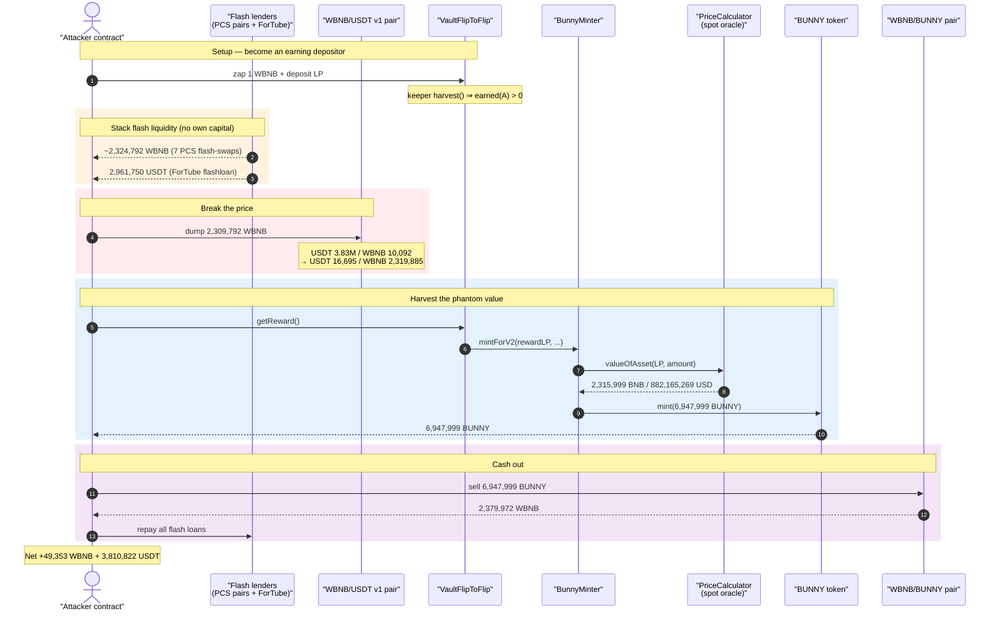
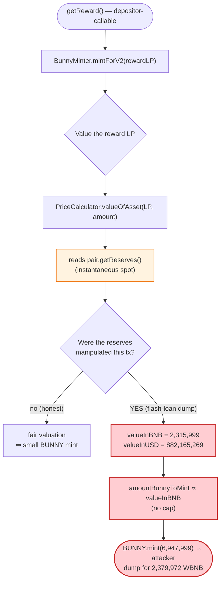
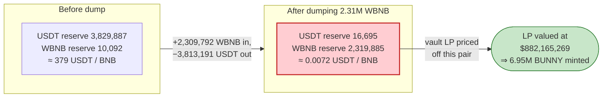

# PancakeBunny Exploit — Flash-Loan LP Price-Oracle Manipulation Mints Unlimited BUNNY

> **Vulnerability classes:** vuln/oracle/price-manipulation · vuln/governance/flash-loan-attack

> **Reproduction:** the PoC compiles & runs in an isolated Foundry project at
> [this project folder](.). Full verbose trace: [output.txt](output.txt).
> The vulnerable logic lives in PancakeBunny's off-source `BunnyMinter` /
> `PriceCalculator` (proxies behind [VaultFlipToFlip](sources/AdminUpgradeabilityProxy_633e53/AdminUpgradeabilityProxy.sol)
> and the `BunnyZap` [proxy](sources/AdminUpgradeabilityProxy_dC2bBB/AdminUpgradeabilityProxy.sol));
> the BUNNY token itself is [BunnyToken.sol](sources/BunnyToken_C9849E/BunnyToken.sol).

---

## Key info

| | |
|---|---|
| **Loss** | ~$45M at the time — attacker walked away with **≈49,353.77 WBNB + 3,810,822.52 USDT** profit (the rest of the minted BUNNY collapsed its own market) |
| **Vulnerable contract** | `BunnyMinter` (`mintForV2`) at `0x8cB88701790F650F273c8BB2Cc4c5f439cd65219` + `PriceCalculatorBSC.valueOfAsset` at [`0x542c06a5dc3f27e0fbDc9FB7BC6748f26d54dDb0`](https://bscscan.com/address/0x542c06a5dc3f27e0fbDc9FB7BC6748f26d54dDb0) |
| **Reward token** | BUNNY — [`0xC9849E6fdB743d08fAeE3E34dd2D1bc69EA11a51`](https://bscscan.com/address/0xC9849E6fdB743d08fAeE3E34dd2D1bc69EA11a51#code) |
| **Victim vault** | `VaultFlipToFlip` (WBNB/USDT) — [`0x633e538EcF0bee1a18c2EDFE10C4Da0d6E71e77B`](https://bscscan.com/address/0x633e538EcF0bee1a18c2EDFE10C4Da0d6E71e77B) |
| **Manipulated pool** | PancakeSwap **v1** WBNB/USDT pair — `0x20bCC3b8a0091dDac2d0BC30F68E6CBb97de59Cd` |
| **Dump venue** | WBNB/BUNNY pair — `0x7Bb89460599Dbf32ee3Aa50798BBcEae2A5F7f6a` |
| **Attacker EOA** | `0x158C20b3650de9C8d49c00C97550d8eD9C0F7e0D` |
| **Attacker contract** | `0xa9bf70a420d364e923c74448d9d817d3f2a77822` |
| **Attack tx (zap)** | [`0x88fcffc3256faac76cde4bbd0df6ea3603b1438a5a0409b2e2b91e7c2ba3371a`](https://bscscan.com/tx/0x88fcffc3256faac76cde4bbd0df6ea3603b1438a5a0409b2e2b91e7c2ba3371a) |
| **Attack tx (drain)** | [`0x897c2de73dd55d7701e1b69ffb3a17b0f4801ced88b0c75fe1551c5fcce6a979`](https://bscscan.com/tx/0x897c2de73dd55d7701e1b69ffb3a17b0f4801ced88b0c75fe1551c5fcce6a979) |
| **Chain / fork block / date** | BSC / 7,556,330 → 7,556,391 / May 19–20, 2021 |
| **Compiler** | BUNNY token: Solidity v0.6.12 (optimizer, 200 runs); PoC harness: `>=0.7.0 <0.9.0` |
| **Bug class** | DeFi price-oracle manipulation — spot-reserve LP valuation used to size minted rewards |

---

## TL;DR

PancakeBunny's `VaultFlipToFlip` pays its yield in the protocol's own **BUNNY** governance
token. The number of BUNNY minted to a depositor is computed by asking the protocol's
`PriceCalculator.valueOfAsset()` *"how much BNB/USD is this LP position worth?"* — and that
price is read **directly from PancakeSwap pair reserves** (`getReserves()`), i.e. an
instantaneous, fully manipulable spot price.

The attacker:

1. Becomes a depositor in `VaultFlipToFlip` with a tiny 1 WBNB position, so it is owed a
   non-zero reward (`flip.earned(attacker) > 0`).
2. Takes **flash loans** — seven WBNB flash swaps from PancakeSwap pairs (using the
   `swap`-with-callback trick), plus a **2,961,750 USDT** flash loan from ForTube Bank — to
   amass **≈2,324,792 WBNB** of working capital.
3. **Manipulates the WBNB/USDT price**: dumps ~2,309,792 WBNB into the v1 WBNB/USDT pair,
   collapsing its WBNB reserve up and USDT reserve down to **WBNB 2,319,885 / USDT 16,695**.
   This makes the vault's WBNB/USDT LP look astronomically valuable when priced off that pair.
4. Calls **`flip.getReward()`**. The vault values the attacker's reward LP via the now-broken
   oracle and **mints `6,947,999.34` BUNNY** to the attacker — for a position that was worth a
   few dollars.
5. **Dumps all 6,947,999 BUNNY** into the WBNB/BUNNY pool for **2,379,972 WBNB**, repays every
   flash loan, and keeps the difference.

Net booked profit in the PoC: **49,353.77 WBNB and 3,810,822.52 USDT**
([output.txt:23-24](output.txt#L23)).

---

## Background — how PancakeBunny rewards work

PancakeBunny ("Bunny") is a yield-aggregator on BSC. Users deposit LP tokens (e.g. the
PancakeSwap WBNB/USDT Cake-LP) into a *vault* such as `VaultFlipToFlip`
([proxy](sources/AdminUpgradeabilityProxy_633e53/AdminUpgradeabilityProxy.sol),
`0x633e538…`). The vault farms PancakeSwap, periodically **`harvest()`**s the farm rewards,
and re-stakes them. On top of the underlying yield, Bunny pays a *protocol incentive* in its
own **BUNNY** token whenever a user calls **`getReward()`**.

The amount of BUNNY minted is meant to be proportional to the *USD value of the performance
fee* the user generated. To convert "an LP-token amount" into "a USD/BNB value", the minter
(`BunnyMinter`, `0x8cB8…`) calls into a shared **`PriceCalculator`**
(`0x542c06a5…`, impl `0x81EF2BC1…`). For an LP ("Cake-LP") asset, `valueOfAsset()`:

- reads `pair.getReserves()` and `pair.totalSupply()`,
- derives the BNB price of each underlying token from **PancakeSwap pair reserves** (with a
  Chainlink feed only for the final BNB→USD conversion),
- and returns `(valueInBNB, valueInUSD)` for the given LP amount.

That spot-reserve read is the entire vulnerability: **the "oracle" is a single AMM pair's
current reserves, which any flash-loan-funded actor can move at will inside one transaction.**

The on-chain facts at the fork block:

| Fact | Value |
|---|---|
| Attacker's vault deposit | 1 WBNB zapped → LP, then `flip.deposit()` |
| Reward LP being valued at drain | `159,475,427,091,202` wei of WBNB/USDT v2 Cake-LP (~0.00016 LP) |
| WBNB/USDT **v1** pair reserves *before* manipulation | USDT 3,829,887.39 / WBNB 10,092.84 (≈ 379 USDT per BNB) |
| WBNB/USDT v1 reserves *after* dumping 2.31M WBNB | USDT 16,695.47 / WBNB 2,319,885.48 |
| `valueOfAsset(rewardLP)` returned | **valueInBNB = 2,315,999.78**, **valueInUSD = 882,165,269.14** |
| BUNNY minted to attacker | **6,947,999.342557183172425788** |

A reward position worth a handful of dollars was valued at **$882 million**, and BUNNY was
minted accordingly.

---

## The vulnerable code

The exploited `BunnyMinter` / `PriceCalculatorBSC` bytecode is not in this project's verified
`sources/` (only the BUNNY token and the three proxy shells are). The mechanism is fully
recoverable from the trace, and the public post-mortems confirm the shape. The relevant
sequence inside `getReward()` is, in pseudo-Solidity:

```solidity
// VaultFlipToFlip.getReward()  (impl 0xd415e6CaA8…, via proxy 0x633e538…)
function getReward() external {
    uint reward = earned(msg.sender);              // performance-fee LP owed to user
    ...
    // hand the reward LP to the minter to convert into BUNNY:
    minter.mintForV2(asset, withdrawalFee, performanceFee, msg.sender, ...);
}

// BunnyMinter.mintForV2(asset, _withdrawalFee, _performanceFee, to, ...)
function mintForV2(address asset, uint, uint feeSum, address to, uint) external onlyMinter {
    // pull the LP fee, break it into underlying via the BunnyZap/router:
    uint bunnyBNBAmount = _zapAssetsToBunnyBNB(asset, feeSum);   // removeLiquidity + zapInToken
    ...
    // ⚠️ value the resulting position via the SPOT-reserve oracle:
    (uint valueInBNB, ) = priceCalculator.valueOfAsset(bunnyBNBpair, bunnyBNBAmount);
    uint amountBunnyToMint = amountBunnyToMintForBunnyBNB(valueInBNB); // ∝ valueInBNB
    bunny.mint(amountBunnyToMint);     // ⚠️ unbounded mint sized by a manipulable price
    bunny.transfer(to, amountBunnyToMint);
}
```

and the oracle itself:

```solidity
// PriceCalculatorBSC.valueOfAsset(asset, amount)  (impl 0x81EF2BC1…)
function valueOfAsset(address asset, uint amount) public view returns (uint valueInBNB, uint valueInUSD) {
    if (isLP(asset)) {                                  // symbol() == "Cake-LP"
        (uint r0, uint r1, ) = IPair(asset).getReserves();   // ⚠️ instantaneous spot reserves
        uint totalSupply     = IPair(asset).totalSupply();
        // value = 2 * (reserveOfBNBside priced from the *other* pair's reserves) * amount / totalSupply
        ...
        // the BNB price of the non-BNB token is itself read from a PancakeSwap pair's reserves
    }
    // only the final BNB→USD step uses a Chainlink feed (latestRoundData)
}
```

In the trace you can watch the oracle do exactly this at
[output.txt:986-1003](output.txt#L986): it reads the LP `getReserves()`
(`2,387,677e18 , 22,447e18`), reads `totalSupply()` (`217,689e18`), pulls a Chainlink
`latestRoundData()` only for BNB→USD, and returns the inflated
`(2,315,999.78e18 BNB, 882,165,269.14e18 USD)`. `BunnyMinter` then calls
`BUNNY.mint(6,947,999.34e18)` at [output.txt:1004-1005](output.txt#L1004).

The BUNNY token's mint is a thin owner-only wrapper — the *minter contract* is the owner, so
once the minter is convinced to mint a huge number, the token complies unconditionally:

```solidity
// sources/BunnyToken_C9849E/BunnyToken.sol:882-884
function mint(address _to, uint256 _amount) public onlyOwner {
    _mint(_to, _amount);
}
```

[sources/BunnyToken_C9849E/BunnyToken.sol:882-884](sources/BunnyToken_C9849E/BunnyToken.sol#L882-L884)

---

## Root cause — why it was possible

A constant-product AMM pair only enforces `x·y ≥ k` *inside its own `swap()`*. Its
**instantaneous reserves are not a price** — they are a position that any actor with enough
transient capital can shove arbitrarily far for the duration of one transaction, then restore.

`PriceCalculator.valueOfAsset()` treats those reserves as ground truth, and `BunnyMinter`
multiplies that truth straight into a `mint()` amount with **no upper bound, no TWAP, no
sanity ceiling**. Composed, the four design decisions that turn this into a critical bug:

1. **Spot-reserve oracle.** The USD/BNB value of an LP reward is read from live
   `getReserves()`, so a flash-loan swap that distorts the WBNB/USDT pair distorts the
   valuation 1:1.
2. **Manipulable pair is flash-loan-reachable.** The attacker funded the manipulation entirely
   with flash loans (PancakeSwap flash-swaps + a ForTube Bank USDT flash loan), so **no capital
   was at risk** — the loans are repaid in the same transaction from the proceeds.
3. **Reward size is unbounded and linear in the manipulated price.** `amountBunnyToMint ∝
   valueInBNB`, with no cap relative to the user's actual deposit, TVL, or supply. An 882-million-
   dollar valuation yields ~6.95M freshly minted BUNNY.
4. **Newly minted reward is immediately liquid.** BUNNY can be dumped into the WBNB/BUNNY pool
   in the same transaction, converting the mint into real WBNB before the price recovers.

The only honest signal in the whole path — the Chainlink BNB/USD feed — is used merely for the
final BNB→USD display conversion and never gates the mint, so it provides no protection.

---

## Preconditions

- Attacker must be an *earning* depositor so `earned(attacker) > 0`. The PoC zaps 1 WBNB into
  the vault and has the **keeper `harvest()`** the vault one block later so a fee accrues
  ([test/PancakeBunny_exp.sol:77-89](test/PancakeBunny_exp.sol#L77-L89)). On the live chain the
  attacker simply waited for a real `harvest()`.
- Access to flash liquidity large enough to move the WBNB/USDT pair: PancakeSwap flash-swaps
  across 7 pairs + a **2,961,750 USDT** ForTube Bank flash loan
  ([test/PancakeBunny_exp.sol:139-141](test/PancakeBunny_exp.sol#L139-L141)). Everything is
  repaid intra-transaction, so the attack is essentially capital-free.
- `getReward()` is callable by the attacker for its own position (permissionless for
  depositors).

---

## Attack walkthrough (with on-chain numbers from the trace)

| # | Step | Concrete numbers (from [output.txt](output.txt)) | Effect |
|---|------|---|---|
| 0 | **Set up vault position** — zap 1 WBNB → WBNB/USDT v2 LP, `flip.deposit(lp)` | 1 WBNB in; vault LP minted | Attacker becomes an earning depositor |
| 1 | **Keeper harvest** (1 block later) | `flip.harvest()` succeeds | `earned(attacker) > 0` ([test:86-89](test/PancakeBunny_exp.sol#L86-L89)) |
| 2 | **Stack flash loans** — 7 PancakeSwap flash-swaps via `swap()`+`pancakeCall` | WBNB balance → **2,324,792.64** ([output.txt:13](output.txt#L13)) | Working WBNB amassed |
| 3 | **ForTube USDT flash loan** | **2,961,750.45 USDT** borrowed ([output.txt:14](output.txt#L14)) | Extra ammo |
| 4 | **Re-zap 15,000 WBNB** into the vault LP + donate it to the pair | `zapInToken(WBNB, 15,000e18)` ([output.txt:507](output.txt#L507)) | Inflates the reward LP's perceived size |
| 5 | **Manipulate price** — dump **2,309,792.64 WBNB** into v1 WBNB/USDT | v1 reserves USDT 3,829,887 / WBNB 10,092 → **USDT 16,695 / WBNB 2,319,885** ([output.txt:608](output.txt#L608), [:628](output.txt#L628)) | WBNB priced ≈0 in USDT terms; LP looks gigantic |
| 6 | **`getReward()`** — vault values reward LP via spot oracle | `valueOfAsset` → **2,315,999.78 BNB / 882,165,269 USD** ([output.txt:1003](output.txt#L1003)); `BUNNY.mint(6,947,999.34)` ([output.txt:1004](output.txt#L1004)) | **6.95M BUNNY minted from thin air** |
| 7 | **Dump BUNNY** — sell 6,947,999.34 BUNNY into WBNB/BUNNY | out = **2,379,972.96 WBNB** ([output.txt:1063](output.txt#L1063)) | Mint converted to real WBNB |
| 8 | **Repay all flash loans** (PCS swaps + ForTube USDT) | balances reconciled ([output.txt:22](output.txt#L22)) | Loans closed |
| 9 | **Keep profit** | **+49,353.77 WBNB**, **+3,810,822.52 USDT** ([output.txt:23-24](output.txt#L23)) | Attacker exit |

### Profit accounting

| Item | Amount |
|---|---:|
| WBNB amassed via flash loans | 2,324,792.64 WBNB |
| USDT borrowed (ForTube) | 2,961,750.45 USDT |
| WBNB obtained by dumping minted BUNNY | 2,379,972.96 WBNB |
| USDT obtained by dumping WBNB into v1 | 6,774,942.37 USDT (gross, pre-repay) |
| **Booked profit (PoC)** | **49,353.77 WBNB + 3,810,822.52 USDT** |

The minted BUNNY (6.95M) is the *source* of the value: it was created against an
$882M phantom valuation and liquidated for ~2.38M WBNB, the bulk of which becomes the
attacker's profit after the flash loans are repaid.

---

## Diagrams

### Sequence of the attack



### Where the trust breaks



### WBNB/USDT v1 pair: honest vs. manipulated price



---

## Why each magic number

- **`createSelectFork("bsc", 7_556_330)` then `roll(7_556_391)`:** pins state to the real
  attack window and advances ~61 blocks so the keeper `harvest()` produces a non-zero
  `earned()` for the attacker ([test:53](test/PancakeBunny_exp.sol#L53), [test:83-84](test/PancakeBunny_exp.sol#L83-L84)).
- **7 PancakeSwap flash-swaps (`pairs[0..6]`):** each `pair.swap(.., amountOut-1, ..)` with a
  `pancakeCall` callback borrows almost the entire WBNB side of a pair; chaining 7 pairs
  amasses ~2.32M WBNB without holding any. Repayment is
  `amountIn = amountOut*10000/9975 + 1` (the 0.25% PancakeSwap fee) ([test:146](test/PancakeBunny_exp.sol#L146)).
- **`2_961_750_450987026369366661` USDT ForTube flash loan:** sized to fully crash the
  WBNB/USDT v1 pair's USDT side after the WBNB dump ([test:139](test/PancakeBunny_exp.sol#L139)).
- **`zapInToken(WBNB, 15_000e18)` + transferring the LP to the pair:** seeds/inflates the LP
  position whose value the oracle will read, maximizing the minted BUNNY ([test:180-182](test/PancakeBunny_exp.sol#L180-L182)).
- **Dumping all WBNB into v1 (`wbnbAmount = balance − 15_000e18`):** moves the v1 spot price so
  far that the vault LP is valued at ~$882M ([test:176](test/PancakeBunny_exp.sol#L176), [:187-191](test/PancakeBunny_exp.sol#L187-L191)).

---

## Remediation

1. **Never price assets off instantaneous AMM reserves.** Replace `getReserves()`-based
   `valueOfAsset` with a **manipulation-resistant oracle**: Chainlink for the priced legs, or a
   PancakeSwap **TWAP** with a meaningful window, so a single-transaction reserve shove cannot
   move the reported price.
2. **Cap the mint.** `amountBunnyToMint` must be bounded relative to the user's *actual*
   contributed value, the vault's TVL, and BUNNY supply — never an unbounded linear function of
   an external price. A per-call and per-block emission ceiling alone would have neutered this.
3. **Sanity-check the price against an independent source.** Cross-check the AMM-derived value
   against the Chainlink BNB/USD feed (already imported!) and revert on a large divergence;
   here the spot value was ~10⁶× the fair value.
4. **Make flash-loan manipulation unprofitable.** Settle reward valuation on EMA/TWAP state from
   *before* the current transaction, or require a minimum holding period between deposit and
   `getReward()` so transient reserve distortions cannot be harvested in one block.
5. **Defense in depth on liquidity routing.** `_zapAssetsToBunnyBNB`'s reliance on live router
   prices (`getAmountOut` off current reserves) should likewise use protected pricing.

---

## How to reproduce

The PoC was extracted into a standalone Foundry project (the umbrella DeFiHackLabs repo has
many unrelated PoCs that fail to compile under a whole-project `forge build`):

```bash
_shared/run_poc.sh 2021-05-PancakeBunny_exp --mt testExploit -vvvvv
```

- RPC: a **BSC archive** endpoint is required (fork block 7,556,330 is from May 2021; most
  public BSC RPCs prune that far back and fail with `header not found` / `missing trie node`).
- Result: `[PASS] testExploit()`.

Expected tail ([output.txt:1-24](output.txt#L1)):

```
Ran 1 test for test/PancakeBunny_exp.sol:ContractTest
[PASS] testExploit() (gas: 2396276)
  ...
  After collecting rewards, BUNNY balance of attacker:: 6947999.342557183172425788
  ...
  Collected WBNB profit:: 49353.769042816198281617
  Collected USDT profit:: 3810822.521729391192447942
Suite result: ok. 1 passed; 0 failed; 0 skipped
```

---

*References: PancakeBunny post-mortem — https://pancakebunny.medium.com/hello-bunny-fam-a7bf0c7a07ba ·
cmichel — https://cmichel.io/bsc-pancake-bunny-exploit-post-mortem/ ·
rekt.news — https://rekt.news/pancakebunny-rekt/*
