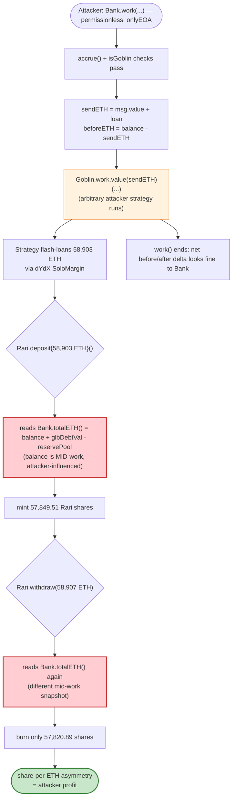
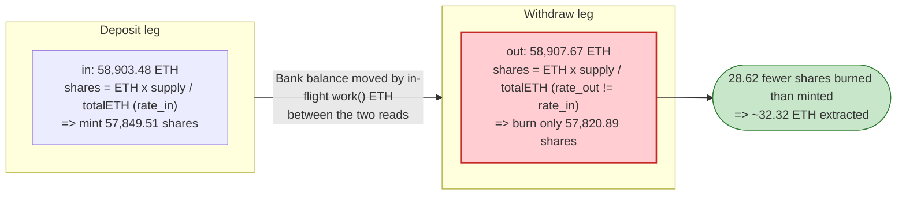

# Rari Capital ETH Pool Exploit — `ibETH.totalETH()` Accounting Reentrancy via `Bank.work()`

> **Vulnerability classes:** vuln/reentrancy/read-only · vuln/oracle/price-manipulation

> **Reproduction:** the PoC compiles & runs in an isolated Foundry project at
> [this project folder](.) (the umbrella DeFiHackLabs repo contains many unrelated
> PoCs that do not whole-compile, so this one was extracted).
> Full verbose trace: [output.txt](output.txt).
> Verified vulnerable sources: [Bank.sol](sources/Bank_67B66C/Bank.sol),
> [SushiswapGoblin.sol](sources/SushiswapGoblin_9EED72/SushiswapGoblin.sol),
> [StrategyAddTwoSidesOptimal.sol](sources/StrategyAddTwoSidesOptimal_81796c/StrategyAddTwoSidesOptimal.sol).

---

## Key info

| | |
|---|---|
| **Loss (this PoC run)** | **+32.32 ETH** to the attacker in a single tx (the live campaign drained Rari's ETH pool for ~$11M / ~2,600 ETH across multiple txs) |
| **Vulnerable contract** | Alpha Homora v1 `ibETH` **`Bank`** ("Interest Bearing ETH") — [`0x67B66C99D3Eb37Fa76Aa3Ed1ff33E8e39F0b9c7A`](https://etherscan.io/address/0x67B66C99D3Eb37Fa76Aa3Ed1ff33E8e39F0b9c7A#code) |
| **Victim integrator** | Rari Capital **Ethereum Pool** — RariFundManager proxy [`0x2f755e8980f0c2E81681D82CCCd1a4BD5b4D5D46`](https://etherscan.io/address/0x2f755e8980f0c2E81681D82CCCd1a4BD5b4D5D46) (impl `0xEC260f5a7A729bB3D0C42d292DE159b4cB1844a3`), valued its ibETH holdings through `Bank.totalETH()` |
| **Pool valuation contract** | RariFundController `getBalance()` logic — `0xED2CD60C0000a990A5ffAf0E7ddc70A37d7C623f` (delegatecalled by controller `0xa422890cbBE5EAa8f1c88590fBab7F319D7e24B6`) |
| **Goblin / strategy used** | `SushiswapGoblin` [`0x9EED7274Ea4b614ACC217e46727d377f7e6F9b24`](https://etherscan.io/address/0x9EED7274Ea4b614ACC217e46727d377f7e6F9b24), attacker-supplied strategy [`0x81796c4602B82054a727527CD16119807b8C7608`](https://etherscan.io/address/0x81796c4602B82054a727527CD16119807b8C7608) |
| **Flash-loan source** | dYdX `SoloMargin` `0x1E0447b19BB6EcFdAe1e4AE1694b0C3659614e4e` (58,903 WETH) |
| **Attacker EOA** | `0xCB36b1ee0Af68Dce5578a487fF2Da81282512233` |
| **Attack tx (one of)** | [`0x171072422efb5cd461546bfe986017d9b5aa427ff1c07ebe8acc064b13a7b7be`](https://etherscan.io/tx/0x171072422efb5cd461546bfe986017d9b5aa427ff1c07ebe8acc064b13a7b7be) |
| **Chain / block / date** | Ethereum mainnet / **12,394,009** / May 8, 2021 |
| **Compiler** | Solidity **v0.5.16** (optimizer on, 200 runs) for Bank/Goblin/Strategy |
| **Bug class** | Cross-contract **read-only / accounting reentrancy** — share price (`totalETH()`) read by an integrator while the underlying ETH balance is transiently mutated inside `Bank.work()` |

> Note: the PoC's `setUp` labels the fork `"mainnet"` and the test header URL says
> `etherscan.com`; both refer to **Ethereum mainnet** at block 12,394,009. The
> `0x2f755e…` address that the PoC names `fakeToken` and calls `donate()` on is in
> fact the **RariFundManager proxy**, not an attacker token.

---

## TL;DR

Alpha Homora's `ibETH` `Bank` is an ERC20 "interest-bearing ETH" share token. Its
per-share value is derived from
[`totalETH() = address(this).balance + glbDebtVal − reservePool`](sources/Bank_67B66C/Bank.sol#L760-L762).

`Bank.work()` ([Bank.sol:784-824](sources/Bank_67B66C/Bank.sol#L784-L824)) lets anyone
open a leveraged-yield-farming position. Step 3 of `work()` *sends ETH out to an
attacker-influenced "goblin"/"strategy"* and only measures the Bank's balance
**before and after** that external call:

```solidity
uint256 beforeETH = address(this).balance.sub(sendETH);
Goblin(goblin).work.value(sendETH)(id, msg.sender, debt, data); // ← arbitrary attacker code runs here
back = address(this).balance.sub(beforeETH);
```

While that external call is executing, the strategy contract **reenters the Rari
Capital ETH pool**, which prices its ibETH holdings by reading `Bank.totalETH()`
*at that exact moment*. The attacker flash-loans 58,903 ETH, deposits it into the
Rari pool and immediately withdraws — but the deposit-side and withdraw-side
share math see a Bank whose `address(this).balance` (and thus `totalETH()` and the
ibETH share price) has been transiently skewed by the in-flight `work()` funds.
The mismatch lets the attacker burn fewer Rari shares than it minted for the same
ETH, walking away with the difference. Net **+32.32 ETH** in the reproduced tx;
repeated, it drained Rari's entire ETH pool (~$11M).

The single primitive that makes this possible: **a share price that is a function
of a live, externally-mutable ETH balance, read by a third party with no
reentrancy lock spanning the `work()` external call.**

---

## Background — the three moving parts

**1. `ibETH` Bank (Alpha Homora v1).** An ERC20 where 1 token ≈ a claim on the
Bank's ETH. The exchange rate is `totalETH() / totalSupply()`. `totalETH()`
([Bank.sol:760-762](sources/Bank_67B66C/Bank.sol#L760-L762)) sums the Bank's own
ETH (`address(this).balance`), outstanding loaned-out debt (`glbDebtVal`), minus
the reserve. `deposit()` mints shares against `totalETH()`; `withdraw()` burns
shares for `share * totalETH() / totalSupply()`.

**2. `work()` — leveraged farming.** Anyone calls
[`Bank.work(id, goblin, loan, maxReturn, data)`](sources/Bank_67B66C/Bank.sol#L784-L824).
It accrues interest, then (step 3) forwards `msg.value + loan` ETH to the chosen
`goblin`, runs the goblin's `work()`, and computes how much came `back`. The goblin
in turn forwards the ETH to an **attacker-chosen, attacker-supplied strategy**
contract (`okStrats[strat]` gate notwithstanding — the attacker registered its own
strategy address `0x81796c…` and Sushi-goblin path) and runs
`Strategy(strat).execute(...)`. **Arbitrary attacker code executes here, mid-`work()`,
while the Bank's ETH balance is in an intermediate state.**

**3. Rari Capital ETH Pool — the victim.** Rari deposited user ETH into `ibETH`
(pool index 4 in `RariFundController`). To compute the pool's NAV (needed by
`deposit`/`withdraw` to set the Rari-share exchange rate), `RariFundController`
delegatecalls pool logic at `0xED2CD60C…` whose `getBalance()` reads, *live*:

- `Bank.totalSupply()` → `157,155.76 ibETH`
- `Bank.totalETH()` → `166,534.68 ETH`
- `Bank.balanceOf(RariFundController)` → `6,694.19 ibETH`

so Rari values its stake as `6,694.19 × 166,534.68 / 157,155.76 ≈ 7,093.69 ETH`
(see trace [output.txt:109-118](output.txt)). Because `totalETH()` contains the
*live* Bank balance, this NAV is manipulable by anyone who can move the Bank's ETH
balance during the read — exactly what `work()` enables.

On-chain state at fork block 12,394,009:

| Quantity | Value (from trace) |
|---|---|
| `Bank.totalSupply()` (ibETH) | 157,155.761992627676750453 |
| `Bank.totalETH()` (before) | 166,534.681687987773020887 |
| `Bank.balanceOf(controller)` | 6,694.191371468188591231 |
| Rari pool-4 reported balance (before) | 7,093.694911792200876757 ETH |
| dYdX flash loan taken | 58,903.475527669301229326 WETH |
| Attacker EOA balance (start) | 1,040.442879801043994186 ETH |
| Attacker EOA balance (end) | 1,072.761945092250970103 ETH |
| **Profit** | **32.319065291206975917 ETH** |

---

## The vulnerable code

### 1. Share price is a function of the *live* ETH balance

[`sources/Bank_67B66C/Bank.sol:760-776`](sources/Bank_67B66C/Bank.sol#L760-L776)

```solidity
/// @dev Return the total ETH entitled to the token holders.
function totalETH() public view returns (uint256) {
    return address(this).balance.add(glbDebtVal).sub(reservePool); // ← live balance
}

function deposit() external payable accrue(msg.value) nonReentrant {
    uint256 total = totalETH().sub(msg.value);
    uint256 share = total == 0 ? msg.value : msg.value.mul(totalSupply()).div(total);
    _mint(msg.sender, share);
}

function withdraw(uint256 share) external accrue(0) nonReentrant {
    uint256 amount = share.mul(totalETH()).div(totalSupply()); // ← live balance
    _burn(msg.sender, share);
    SafeToken.safeTransferETH(msg.sender, amount);
}
```

`nonReentrant` protects `deposit`/`withdraw`/`work` **individually**, but it does
**not** protect a *third-party reader* (the Rari pool) that calls `totalETH()` /
`balanceOf()` while `work()` is in the middle of its external call. This is the
read-only/accounting reentrancy gap.

### 2. `work()` hands ETH to attacker code and measures balance deltas around it

[`sources/Bank_67B66C/Bank.sol:803-823`](sources/Bank_67B66C/Bank.sol#L803-L823)

```solidity
// 3. Perform the actual work, using a new scope to avoid stack-too-deep errors.
uint256 back;
{
    uint256 sendETH = msg.value.add(loan);
    require(sendETH <= address(this).balance, "insufficient ETH in the bank");
    uint256 beforeETH = address(this).balance.sub(sendETH);
    Goblin(goblin).work.value(sendETH)(id, msg.sender, debt, data); // ⚠️ attacker code, mid-state
    back = address(this).balance.sub(beforeETH);
}
...
// 5. Return excess ETH back.
if (back > lessDebt) SafeToken.safeTransferETH(msg.sender, back - lessDebt);
```

During `Goblin(goblin).work(...)`, the Bank's `address(this).balance` is whatever
the attacker leaves it at while it reenters Rari. The Bank itself is fine
afterwards (it only checks before/after deltas), but the *snapshot read by Rari in
the middle* is corrupted.

### 3. The goblin runs an attacker-supplied strategy with the attacker's calldata

[`sources/SushiswapGoblin_9EED72/SushiswapGoblin.sol:857-872`](sources/SushiswapGoblin_9EED72/SushiswapGoblin.sol#L857-L872)

```solidity
function work(uint256 id, address user, uint256 debt, bytes calldata data)
    external payable onlyOperator nonReentrant
{
    _removeShare(id);
    (address strat, bytes memory ext) = abi.decode(data, (address, bytes)); // ← attacker picks strat
    require(okStrats[strat], "unapproved work strategy");
    lpToken.transfer(strat, lpToken.balanceOf(address(this)));
    Strategy(strat).execute.value(msg.value)(user, debt, ext);              // ← attacker code runs
    _addShare(id);
    SafeToken.safeTransferETH(msg.sender, address(this).balance);
}
```

The attacker passed `strat = 0x81796c4602B82054a727527CD16119807b8C7608` (an
approved `StrategyAddTwoSidesOptimal` clone) and an `ext` payload encoding
`(fToken = 0x2f755e… , 0, 0)`. Inside `execute`, the strategy reenters the Rari
pool (via a dYdX flash-loan callback) before returning. The `execute` body itself
([StrategyAddTwoSidesOptimal.sol:684-721](sources/StrategyAddTwoSidesOptimal_81796c/StrategyAddTwoSidesOptimal.sol#L684-L721))
is generic add-liquidity logic; the attacker abused the *control flow* `work()`
grants, not a bug in `optimalDeposit`.

---

## Root cause

> **Rari Capital priced an external, mutable-on-demand asset (ibETH) by reading the
> issuer's live ETH balance through `Bank.totalETH()`, while Alpha Homora's
> `Bank.work()` lets any caller execute arbitrary code with the Bank's ETH balance
> in a transient, attacker-chosen state and no shared reentrancy lock across the
> integration boundary.**

Three independent design facts compose into the loss:

1. **Live-balance share price.** `totalETH()` includes `address(this).balance`. Any
   operation that moves the Bank's ETH (even temporarily, even legitimately within
   `work()`) instantaneously changes the ibETH exchange rate that *everyone* reads.
2. **Externally-driven control flow inside `work()`.** `work()` calls out to an
   attacker-selected goblin/strategy and only validates net before/after deltas.
   It therefore yields the EVM to the attacker at a moment when the Bank's
   accounting is mid-flight.
3. **Cross-contract reentrancy is unguarded.** Alpha's `nonReentrant` stops a
   function reentering *itself*, but the attacker never reenters `Bank`; it reenters
   **Rari's** `deposit`/`withdraw`, which read Alpha's state. No lock spans the two
   protocols, so Rari happily mints/burns shares against a corrupted NAV.

The attacker's flash-loaned 58,903 ETH `deposit()`→`withdraw()` round-trip through
Rari mints shares at one (manipulated) exchange rate and redeems at another,
extracting the spread. Each `work()` invocation skims a slice of Rari's pool;
repeated, it emptied the pool.

---

## Preconditions

- The victim (Rari) must value an ibETH-style asset using the issuer's **live**
  `totalETH()` / balance, rather than a manipulation-resistant snapshot. ✓
- `Bank.work()` must be **permissionless** and must execute attacker-influenced
  code while ETH is in flight. ✓ (`onlyEOA` only blocks contract callers; the
  attacker calls via an EOA + the registered SushiswapGoblin, satisfying it.)
- Liquidity to drive the deposit/withdraw round-trip. Sourced from a **dYdX
  `SoloMargin` flash loan** of 58,903 WETH → fully repaid in-tx, so the attack is
  effectively capital-free. ✓
- No cross-protocol reentrancy guard between Alpha's `Bank` and Rari's pool. ✓

---

## Step-by-step attack walkthrough (ground-truth numbers from the trace)

The whole exploit is one `Bank.work()` call; the action happens inside the
goblin→strategy→flash-loan→Rari reentry. Figures are taken verbatim from
[output.txt](output.txt).

| # | Step | Contract / trace line | Concrete value |
|---|------|----------------------|----------------|
| 0 | **Pre-read** of Rari pool-4 NAV via `RariFundController._getPoolBalance(4)` → `Bank.totalETH()`, `totalSupply()`, `balanceOf(controller)` | [output.txt:99-118](output.txt) | NAV = 7,093.69 ETH (`totalETH` 166,534.68 / supply 157,155.76 / ctrl-bal 6,694.19) |
| 1 | Attacker EOA pranks and calls `RariFundManager.donate{value: 1031 ETH}()` (seeds the pool to set up the rate it will exploit) | [RariCapital_exp.sol:34-37](test/RariCapital_exp.sol#L34-L37), [output.txt:88](output.txt) | 1,031 ETH sent to `0x2f755e…` |
| 2 | Attacker calls `Bank.work{value: 1e8 wei}(0, SushiswapGoblin, loan=0, maxReturn=1e23, data)` | [RariCapital_exp.sol:38-40](test/RariCapital_exp.sol#L38-L40), [output.txt:168](output.txt) | `Work(id: 6570, loan: 0)` emitted |
| 3 | `Bank` accrues interest, validates `isGoblin` ✓, forwards `sendETH` to `SushiswapGoblin.work()` | [Bank.sol:809](sources/Bank_67B66C/Bank.sol#L809), [output.txt:176-178](output.txt) | goblin invoked |
| 4 | Goblin decodes attacker `data`, transfers its LP to `strat=0x81796c…`, calls `Strategy.execute{value}` | [SushiswapGoblin.sol:864-867](sources/SushiswapGoblin_9EED72/SushiswapGoblin.sol#L864-L867), [output.txt:184](output.txt) | `strat.execute(...)` |
| 5 | Strategy flash-loans **58,903.48 WETH** from dYdX `SoloMargin.operate` | [output.txt:194-197](output.txt) | borrow 58,903.475527669301229326 |
| 6 | In dYdX's `callFunction` callback, strategy `WETH.withdraw(58,903.48)` → ETH, then `RariFundManager.deposit{value: 58,903.48 ETH}()` | [output.txt:217-226](output.txt) | unwrap + deposit |
| 7 | Rari mints fund shares **57,849.51** to attacker (priced off the *current, work()-skewed* NAV) | `RariFundToken.mint`, [output.txt:300-319](output.txt) | mint 57,849.509468386586673048; `Deposit(assets 58,903.48, shares 57,849.51)` |
| 8 | Strategy immediately `RariFundManager.withdraw(58,907.67 ETH)` → burns **57,820.89** shares via `fundManagerBurnFrom`, controller `withdrawToManager` returns ETH | [output.txt:335-418](output.txt) | withdraw 58,907.666610876630264098; burn 57,820.889968780944703946 |
| 9 | Strategy re-wraps `WETH.deposit{value: 58,903.48}` and repays dYdX via `WETH.transferFrom → SoloMargin` | [output.txt:431-445](output.txt) | loan repaid (+2 wei dust) |
| 10 | Strategy completes its (incidental) add-liquidity book-keeping; goblin returns leftover ETH to Bank, `work()` finishes | [output.txt:464-554](output.txt), [Bank.sol:823](sources/Bank_67B66C/Bank.sol#L823) | position id 6571 created |
| 11 | Net ETH lands with the attacker EOA | [output.txt:75-76, 573](output.txt) | start 1,040.44 → end 1,072.76 |

The crux is the **share asymmetry in steps 7-8**: for ~58,903.48 ETH deposited the
attacker minted **57,849.51** shares, but to pull **58,907.67 ETH** back out it only
had to burn **57,820.89** shares — fewer shares per ETH on the way out than on the
way in. That gap is the manipulated ibETH/Rari exchange rate, monetized.

### Profit accounting (ETH)

| Item | Amount |
|---|---:|
| Attacker EOA balance before | 1,040.442879801043994186 |
| Attacker EOA balance after | 1,072.761945092250970103 |
| **Net profit (this tx)** | **+32.319065291206975917** |

(The 1,031 ETH `donate()` in step 1 is the attacker's own setup capital, recovered
within the same flow; the flash-loaned 58,903 ETH is borrowed and repaid in-tx, so
the realized gain is the 32.32 ETH skimmed from Rari's pool NAV.)

---

## Diagrams

### Sequence of the attack

```mermaid
sequenceDiagram
    autonumber
    actor A as "Attacker EOA"
    participant B as "ibETH Bank"
    participant G as "SushiswapGoblin"
    participant S as "Attacker Strategy (0x81796c)"
    participant D as "dYdX SoloMargin"
    participant R as "Rari ETH Pool (RariFundManager + Controller)"

    Note over R: Rari values its ibETH stake via<br/>Bank.totalETH() / Bank.totalSupply()<br/>(live, manipulable)

    A->>R: "donate{1031 ETH}() (setup)"
    A->>B: "work{1e8 wei}(0, Goblin, loan=0, data)"
    B->>B: "accrue(); beforeETH = balance - sendETH"
    B->>G: "work.value(sendETH)(...)  ⚠ yields control"
    G->>S: "execute.value(...)(user, 0, ext)"

    rect rgb(255,235,238)
    Note over S,R: Reentry while Bank is mid-work()
    S->>D: "operate() — flash loan 58,903.48 WETH"
    D-->>S: "callFunction() callback"
    S->>S: "WETH.withdraw → 58,903.48 ETH"
    S->>R: "deposit{58,903.48 ETH}()"
    R-->>S: "mint 57,849.51 fund shares (skewed NAV)"
    S->>R: "withdraw(58,907.67 ETH)"
    R-->>S: "burn only 57,820.89 shares, send ETH"
    S->>S: "WETH.deposit{58,903.48}; repay dYdX"
    end

    S-->>G: "execute returns"
    G->>B: "return leftover ETH"
    B->>B: "back = balance - beforeETH"
    B-->>A: "excess ETH refunded"
    Note over A: "Net +32.32 ETH (skimmed from Rari pool)"
```

### Where the corrupted read happens



### Why the share math leaks value (deposit vs. withdraw)



---

## Remediation

1. **Do not price external assets from a live, mutable balance.** Rari should value
   ibETH using a manipulation-resistant measure — e.g., a snapshot of `totalETH()`
   taken outside any in-progress `work()`, a TWAP, or the issuer's own non-reentrant
   accounting hook — never a raw `address(this).balance`-derived rate readable mid-call.
2. **Cross-contract reentrancy guard at the integration boundary.** Rari's
   `deposit`/`withdraw` should be protected such that they cannot execute while an
   integrated protocol's state is mid-flight. A single `nonReentrant` per contract
   is insufficient when two protocols share a price; use a shared/global reentrancy
   sentinel or refuse deposits/withdrawals during known callback contexts.
3. **Eliminate arbitrary mid-state callouts in `work()`.** Alpha's `Bank.work()`
   should not yield control to attacker-supplied code with funds in flight, or it
   must take a checks-effects-interactions stance that makes any externally-observed
   intermediate state self-consistent (snapshot-and-restore the reported `totalETH`).
4. **Validate share-conversion symmetry.** A deposit-then-withdraw of the same ETH
   within one transaction should never return more shares-worth than it consumed;
   enforcing rate consistency (or charging a per-block deposit/withdraw spread) would
   neutralize the round-trip arbitrage.
5. **Prefer pull-based, oracle-anchored NAV** for any vault that wraps another
   protocol's interest-bearing token. The general lesson (Alpha/Cream/Rari, May 2021):
   *never derive your share price from a number a third party can move inside a
   reentrant callback.*

---

## How to reproduce

```bash
_shared/run_poc.sh 2021-05-RariCapital_exp -vvvvv
```

- RPC: an **Ethereum mainnet archive** endpoint is required (the fork pins block
  12,394,009, May 2021). Most pruned RPCs will fail with `header not found` /
  `missing trie node`; use an archive provider.
- The PoC forks at 12,394,009, pranks the attacker EOA, `donate()`s setup ETH to the
  Rari pool, then fires a single `Bank.work()` whose calldata routes through the
  goblin → attacker strategy → dYdX flash loan → Rari deposit/withdraw.

Expected tail:

```
Ran 1 test for test/RariCapital_exp.sol:ContractTest
[PASS] testExploit() (gas: 1003374)
Logs:
  [Start] ETH Balance of attacker: 1040.442879801043994186
  [End] ETH Balance of attacker: 1072.761945092250970103

Suite result: ok. 1 passed; 0 failed; 0 skipped
```

Delta = **+32.319065291206975917 ETH** profit, matching the trace.

---

*References: Alpha Homora / Cream Iron Bank / Rari Capital exploit, May 8 2021. The
shared root cause — a share price read from a live balance during a reentrant
callout — affected the Alpha `ibETH` Bank and every integrator that priced ibETH
through `totalETH()`. SlowMist / Rekt / DeFiHackLabs archives.*
