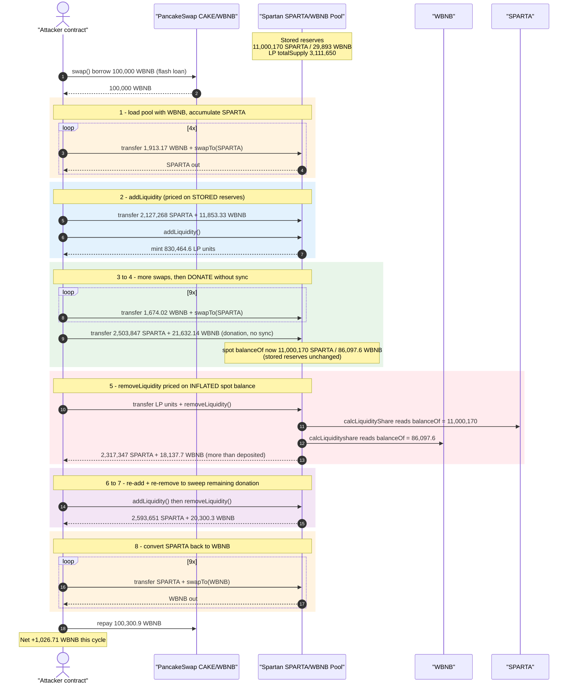
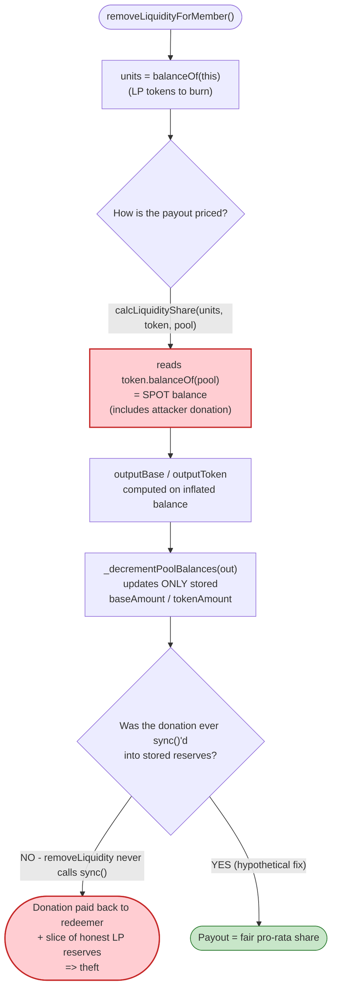
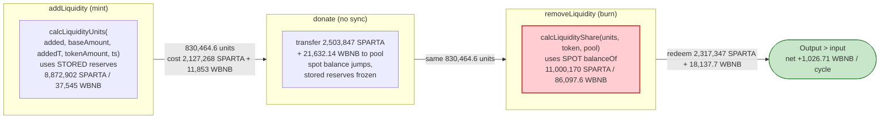

# Spartan Protocol Exploit — LP-Share Inflation via Spot-Balance Accounting + Unsynced Donation

> **Reproduction:** the PoC compiles & runs in an isolated Foundry project at
> [this project folder](.) (the umbrella DeFiHackLabs repo contains many
> unrelated PoCs that do not whole-compile, so this one was extracted).
> Full verbose trace: [output.txt](output.txt).
> Verified vulnerable source: [Pool.sol](sources/Pool_3de669/Pool.sol).

---

## Key info

| | |
|---|---|
| **Loss** | **~$30.5M** (≈ 29,604 WBNB drained over ~8 repeated cycles). The extracted single-cycle PoC realizes **1,026.71 WBNB profit**. |
| **Vulnerable contract** | `Pool` (SpartanPoolV1) — [`0x3de669c4F1f167a8aFBc9993E4753b84b576426f`](https://bscscan.com/address/0x3de669c4F1f167a8aFBc9993E4753b84b576426f#code) |
| **Victim pool** | SPARTA/WBNB Spartan pool — `0x3de669c4F1f167a8aFBc9993E4753b84b576426f` |
| **Base / Token** | BASE = SPARTA `0xE4Ae305ebE1AbE663f261Bc00534067C80ad677C`; TOKEN = WBNB `0xbb4CdB9CBd36B01bD1cBaEBF2De08d9173bc095c` |
| **Attacker EOA** | `0x3b6e77722e2bbe97c1cfa337b42c0939aeb83671` |
| **Attacker contract** | `0x288315639c1145f523af6d7a5e4ccf8238cd6a51` |
| **Attack tx** | [`0xb64ae25b0d836c25d115a9368319902c972a0215bd108ae17b1b9617dfb93af8`](https://explorer.phalcon.xyz/tx/bsc/0xb64ae25b0d836c25d115a9368319902c972a0215bd108ae17b1b9617dfb93af8) |
| **Chain / block / date** | BSC / fork at block 7,048,832 / May 2, 2021 |
| **Compiler** | Pool: Solidity v0.6.8, optimizer **1 run** (200 runs in metadata) |
| **Bug class** | AMM LP-share inflation: liquidity-share math reads **spot `balanceOf`** instead of synced reserves, combined with a `removeLiquidity()` that never re-syncs donated balances |
| **Flash-loan source** | PancakeSwap CAKE/WBNB pair `0x0eD7e52944161450477ee417DE9Cd3a859b14fD0` — 100,000 WBNB |

---

## TL;DR

Spartan's `Pool` keeps two notions of its holdings:

- **Stored reserves** `baseAmount` (SPARTA) and `tokenAmount` (WBNB) — updated by swaps and by `addLiquidity`/`removeLiquidity` accounting.
- **Spot balances** `balanceOf(BASE/TOKEN, pool)` — the real ERC-20 balances, which anyone can inflate by simply `transfer`-ing tokens to the pool ("donating").

The flaw: `removeLiquidityForMember()` computes the amount an LP gets back via
`UTILS.calcLiquidityShare(units, token, pool, member)`
([Pool.sol:235-245](sources/Pool_3de669/Pool.sol#L235-L245)), and that helper
prices each LP unit against the pool's **spot `balanceOf`** — *not* against the
stored reserves. Worse, `removeLiquidity()` decrements the *stored* reserves but
**never `sync()`s the donated spot balance into them first**, so a donation made
immediately before a redemption is paid straight back out to the redeemer plus a
share of the honest LPs' capital.

The attack (one cycle), all numbers from [output.txt](output.txt):

1. **Flash-borrow** 100,000 WBNB from the PancakeSwap CAKE/WBNB pair.
2. **Swap WBNB → SPARTA** repeatedly to load the pool with WBNB and accumulate SPARTA.
3. **`addLiquidity`** a balanced chunk (2,127,268 SPARTA + 11,853.33 WBNB) → mint **830,464.6 LP units** against the *then-current* reserves.
4. **Swap more WBNB → SPARTA** (lower slippage), then **donate** a large SPARTA + WBNB lump (2,503,847 SPARTA + 21,632.14 WBNB) directly to the pool *without syncing*.
5. **`removeLiquidity`** those same 830,464.6 units. Because the share is priced on the donation-inflated **spot balance** (11,000,170 SPARTA / 86,097.6 WBNB), the redemption returns **2,317,347 SPARTA + 18,137.7 WBNB** — more than the deposit.
6. **`addLiquidity` again** to re-capture the donated tokens still sitting in the pool, then **`removeLiquidity` again** (1,325,391 units → 2,593,651 SPARTA + 20,300.3 WBNB).
7. **Swap the recovered SPARTA back to WBNB**, repay the flash loan (100,300.9 WBNB), and keep the surplus.

Net for the single PoC cycle: **+1,026.71 WBNB**. The live attacker repeated the
loop ~8 times to drain ~$30.5M.

---

## Background — how the Spartan `Pool` works

Spartan Protocol V1 is a single-sided / "continuous liquidity" AMM. Each `Pool`
([Pool.sol:85](sources/Pool_3de669/Pool.sol#L85)) pairs a fixed BASE token
(SPARTA) with one TOKEN (here WBNB) and itself is an iBEP20 whose units represent
LP shares.

Two state variables track reserves:

```solidity
uint public baseAmount;    // stored SPARTA reserve
uint public tokenAmount;   // stored WBNB  reserve
```
([Pool.sol:101-102](sources/Pool_3de669/Pool.sol#L101-L102))

The pool detects deposits by **diffing the spot balance against the stored
reserve** ([Pool.sol:269-286](sources/Pool_3de669/Pool.sol#L269-L286)):

```solidity
function _getAddedBaseAmount() internal view returns(uint256 _actual){
    uint _baseBalance = iBEP20(BASE).balanceOf(address(this));
    if(_baseBalance > baseAmount){ _actual = _baseBalance.sub(baseAmount); }
    else { _actual = 0; }
}
```

Swaps update the stored reserves through `_setPoolAmounts`
([Pool.sol:319-322](sources/Pool_3de669/Pool.sol#L319-L322)). There is a public
`sync()` ([Pool.sol:207-210](sources/Pool_3de669/Pool.sol#L207-L210)) that snaps
the stored reserves to the spot balances — but, crucially, the *liquidity*
functions never call it, and they trust the spot balance only in one direction.

On-chain pool state at the fork block (from the first swap's
`calcSwapOutput` arguments in the trace):

| Reserve | Value at start |
|---|---|
| `baseAmount` (SPARTA, stored) | ≈ **11,000,170 SPARTA** |
| `tokenAmount` (WBNB, stored) | ≈ **29,893.32 WBNB** |
| Pool LP `totalSupply` | ≈ **3,111,650 units** |

---

## The vulnerable code

### 1. Removing liquidity prices shares off the *spot* balance

```solidity
function removeLiquidityForMember(address member) public returns (uint outputBase, uint outputToken) {
    uint units = balanceOf(address(this));
    outputBase  = _DAO().UTILS().calcLiquidityShare(units, BASE,  address(this), member);   // ⚠️ spot-balance share
    outputToken = _DAO().UTILS().calcLiquidityShare(units, TOKEN, address(this), member);   // ⚠️ spot-balance share
    _decrementPoolBalances(outputBase, outputToken);   // decrements STORED reserves
    _burn(address(this), units);
    iBEP20(BASE).transfer(member, outputBase);
    iBEP20(TOKEN).transfer(member, outputToken);
    ...
}
```
([Pool.sol:235-245](sources/Pool_3de669/Pool.sol#L235-L245))

`UTILS.calcLiquidityShare(units, token, pool, member)` is the external utility
contract at `0xCaF0366aF95E8A03E269E52DdB3DbB8a00295F91`. Its on-chain behavior is
visible in the trace: for each call it reads
`token.balanceOf(pool)` and `pool.totalSupply()`, i.e. it prices the LP units
against the **current ERC-20 balance** of the pool, **not** against `baseAmount` /
`tokenAmount`. From the first redemption in the trace:

```
calcLiquidityShare(830464.6 units, SPARTA, pool, attacker)
  → SPARTA.balanceOf(pool)  = 11,000,170   ← includes the donation
  → pool.totalSupply()      = 3,111,650
  → returns 2,317,347 SPARTA

calcLiquidityShare(830464.6 units, WBNB, pool, attacker)
  → WBNB.balanceOf(pool)    = 86,097.6     ← includes the donation
  → returns 18,137.7 WBNB
```

### 2. `removeLiquidity()` never `sync()`s the donation into reserves

```solidity
// Sync internal balances to actual
function sync() public {
    baseAmount  = iBEP20(BASE).balanceOf(address(this));
    tokenAmount = iBEP20(TOKEN).balanceOf(address(this));
}
```
([Pool.sol:207-210](sources/Pool_3de669/Pool.sol#L207-L210))

`sync()` exists and is public, but **the protocol only calls it when it wants
to.** A direct token `transfer` into the pool raises the spot balance without
touching `baseAmount` / `tokenAmount`. `addLiquidity` partially closes this gap
(it credits the donor with LP units for the diff via `_getAddedBaseAmount`), but
`removeLiquidity` does **not** sync first — it computes the share on the inflated
spot balance and then decrements only the stored reserves. The donated tokens
therefore become "free liquidity" attributed to whatever LP units are redeemed in
the same call.

### 3. The unit/share asymmetry

- **Mint** path (`addLiquidityForMember`,
  [Pool.sol:219-227](sources/Pool_3de669/Pool.sol#L219-L227)) values a deposit via
  `calcLiquidityUnits(addedBase, baseAmount, addedToken, tokenAmount, totalSupply)`
  — using the **stored** `baseAmount`/`tokenAmount`.
- **Burn** path (`removeLiquidityForMember`) values the redemption via
  `calcLiquidityShare(...)` — using the **spot** `balanceOf`.

Minting against stored reserves and burning against spot balances is exactly the
inconsistency the attacker monetizes: deposit while reserves are "honest," donate
to pump the spot balance, then redeem the same units against the pumped balance.

---

## Root cause — why it was possible

A Uniswap-V2-style pool is safe against donations because it computes LP
redemptions against the *same* reserve figures it updates on every state change,
and (in V2) reserves are read from `getReserves()` which lags raw balances until a
`sync`/`mint`/`burn`. Spartan breaks this in two compounding ways:

> **(a) Redemption value is read from `balanceOf(pool)` (spot), which any caller
> can inflate by donating tokens. (b) `removeLiquidity()` decrements only the
> stored `baseAmount`/`tokenAmount` and never `sync()`s the donation into them
> first — so the donated balance is paid out to the redeemer instead of being
> distributed across all LPs or reverted.**

Concretely, four design facts combine into a critical, flash-loanable theft:

1. **Spot-balance share accounting.** `calcLiquidityshare` prices units on
   `token.balanceOf(pool)`. Inflate the balance → inflate the redemption.
2. **No pre-redemption `sync()`.** `removeLiquidity()` trusts the inflated spot
   balance for the *output* but updates only the stored reserves for *bookkeeping*,
   so the surplus is never reconciled.
3. **Mint vs. burn valuation mismatch.** Deposits are valued against stored
   reserves; withdrawals against spot balances. Donating between the two captures
   the difference.
4. **Permissionless `addLiquidity`/`removeLiquidity` + direct ERC-20 `transfer`.**
   Nothing stops an attacker from transferring tokens straight to the pool and
   then immediately redeeming — and the whole sequence is atomic, so a flash loan
   supplies the working capital with zero principal risk.

---

## Preconditions

- A live SPARTA/WBNB Spartan pool with meaningful liquidity (≈ 11M SPARTA /
  ≈ 30k WBNB at the fork block).
- Working capital large enough to (i) accumulate a balanced LP position and
  (ii) make a donation large relative to the pool. This is supplied by a
  **100,000 WBNB flash loan** from the PancakeSwap CAKE/WBNB pair
  ([Spartan_exp.sol:29](test/Spartan_exp.sol#L29)), repaid at +0.3% within the
  same transaction — so the attacker needs **no principal**.
- No timing/oracle/authorization gate exists on `addLiquidity`/`removeLiquidity`
  or on direct token transfers into the pool, so the entire loop runs atomically.

---

## Attack walkthrough (with on-chain numbers from the trace)

All figures are pulled directly from [output.txt](output.txt). Stored reserves
are `baseAmount` (SPARTA) / `tokenAmount` (WBNB); the bug lives in the gap between
those and the pool's spot `balanceOf`.

| # | Step ([Spartan_exp.sol](test/Spartan_exp.sol)) | What happens | Key trace values |
|---|---|---|---|
| 0 | **Flash loan** ([L29](test/Spartan_exp.sol#L29)) | Borrow 100,000 WBNB from CAKE/WBNB pair via `swap()` callback | `amount1Out = 100,000 WBNB` |
| 1 | **4× WBNB→SPARTA** ([L34-37](test/Spartan_exp.sol#L34-L37)) | Push 4 × 1,913.17 WBNB through `swapTo(SPARTA)`, accumulate SPARTA, load pool with WBNB | first swap: `calcSwapOutput(1913.17, X=29,893.3 WBNB, Y=11,000,170 SPARTA)` → 621,864 SPARTA out |
| 2 | **addLiquidity** ([L40-42](test/Spartan_exp.sol#L40-L42)) | Deposit 2,127,268 SPARTA + 11,853.33 WBNB → mint LP units **against stored reserves** (8,872,902 SPARTA / 37,545.99 WBNB) | `calcLiquidityUnits(...)` → **830,464.6 units** |
| 3 | **9× WBNB→SPARTA** ([L45-48](test/Spartan_exp.sol#L45-L48)) | Continue swapping (9 × 1,674.02 WBNB) for lower slippage; grow SPARTA stack | pool reserves climb |
| 4 | **Donate** ([L51-52](test/Spartan_exp.sol#L51-L52)) | `transfer` 2,503,847 SPARTA + 21,632.14 WBNB **straight into the pool — no `sync()`** | pool spot now SPARTA = 11,000,170, WBNB = 86,097.6 |
| 5 | **removeLiquidity #1** ([L55-56](test/Spartan_exp.sol#L55-L56)) | Redeem the 830,464.6 units; share priced on **inflated spot balance** | `calcLiquidityShare(830464.6, SPARTA)` reads `balanceOf=11,000,170`, `ts=3,111,650` → **2,317,347 SPARTA**; `(…, WBNB)` reads `balanceOf=86,097.6` → **18,137.7 WBNB** |
| 6 | **addLiquidity #2** ([L59](test/Spartan_exp.sol#L59)) | Re-deposit to re-capture the donated tokens still in the pool | `calcLiquidityUnits(...)` → **1,325,391.6 units** |
| 7 | **removeLiquidity #2** ([L62-63](test/Spartan_exp.sol#L62-L63)) | Redeem again against the (still spot-priced) balances | `calcLiquidityShare(1,325,391.6, SPARTA)` reads `balanceOf=8,682,822` → **2,593,651 SPARTA**; `(…, WBNB)` reads `balanceOf=67,959.9` → **20,300.3 WBNB** |
| 8 | **9× SPARTA→WBNB** ([L66-70](test/Spartan_exp.sol#L66-L70)) | Dump the recovered SPARTA back to WBNB in 10% slices | final sell: `Swapped(SPARTA→WBNB, 491,099 SPARTA → 1,331.85 WBNB)` |
| 9 | **Repay** ([L75](test/Spartan_exp.sol#L75)) | Return `100,000 × 1000/997 = 100,300.9 WBNB` to CAKE pair | `transfer(CAKE_WBNB, 100,300.9 WBNB)` |
| 10 | **Settle** ([L77](test/Spartan_exp.sol#L77)) | Attacker WBNB balance after repay | **1,026.71 WBNB** → logs `1026 WBNB profit` |

**The core leak (step 2 vs. step 5):** the attacker deposited
**2,127,268 SPARTA + 11,853.33 WBNB** for 830,464.6 units, then redeemed those
same units for **2,317,347 SPARTA + 18,137.7 WBNB**. Both outputs exceed the
deposit because the redemption was priced on the post-donation spot balance, while
the deposit was priced on the pre-donation stored reserves. The donation isn't
"lost" — it is partly returned to the donor *and* augmented with a slice of the
honest LPs' reserves, because `removeLiquidity` decrements only the stored
`baseAmount`/`tokenAmount`, leaving the over-payment to come out of real
liquidity.

### Profit accounting (single PoC cycle, WBNB)

| Direction | Amount (WBNB) |
|---|---:|
| Flash loan borrowed | 100,000.00 |
| Flash loan repaid (0.3% fee) | 100,300.90 |
| **Net WBNB extracted from the pool (after fee, after SPARTA round-trips)** | **+1,026.71** |

The end-of-trace `console.log("%s WBNB profit", 1026)` confirms the attacker
contract holds **1,026.71 WBNB** after repaying the loan. The historical incident
repeated the loop ~8 times to realize the full ~$30.5M.

---

## Diagrams

### Sequence of one exploit cycle



### Where the value leaks: stored reserve vs. spot balance



### Deposit-vs-redeem valuation mismatch



---

## Why each magic number

- **100,000 WBNB flash loan** ([L29](test/Spartan_exp.sol#L29)): working capital
  sized to make a donation large relative to the pool's ≈30k WBNB / 11M SPARTA
  reserves while still repaying `×1000/997` from the proceeds.
- **4 × 1,913.17 WBNB** ([L34-37](test/Spartan_exp.sol#L34-L37)): pre-load the
  pool's WBNB side and accumulate SPARTA so the attacker can deposit a balanced LP
  position in step 2.
- **2,127,268 SPARTA + 11,853.33 WBNB deposit** ([L40-41](test/Spartan_exp.sol#L40-L41)):
  the LP stake whose units (830,464.6) will later be redeemed against an inflated
  balance. Sized so the position is large enough to harvest a meaningful slice of
  the donation + honest reserves.
- **9 × 1,674.02 WBNB** ([L45-48](test/Spartan_exp.sol#L45-L48)): extra swaps in
  step 3 keep per-swap slippage low while continuing to feed WBNB in and pull
  SPARTA out.
- **Donation 2,503,847 SPARTA + 21,632.14 WBNB** ([L51-52](test/Spartan_exp.sol#L51-L52)):
  the un-synced lump that inflates the pool's spot `balanceOf`, which the very next
  `removeLiquidity()` prices against. This is the heart of the exploit.

---

## Remediation

1. **Price LP shares off synced reserves, not spot balances.** `calcLiquidityShare`
   must use the pool's accounted `baseAmount` / `tokenAmount`, never
   `token.balanceOf(pool)`. Spot balance is attacker-controllable via a bare
   `transfer`.
2. **`sync()` (or skim) before any reserve-dependent computation.** If the protocol
   insists on reading raw balances, `removeLiquidity()`/`addLiquidity()` must first
   reconcile spot ↔ stored so a donation cannot be redeemed in the same call.
   Better: make `sync()` distribute or escheat unexpected balances to *all* LPs,
   not to the next redeemer.
3. **Use one consistent valuation for mint and burn.** Deposits are valued against
   stored reserves; redemptions must be too. The mint/burn asymmetry is what makes
   the donate-then-redeem round trip profitable.
4. **Treat unsolicited token transfers as untrusted.** Any AMM that derives value
   from `balanceOf(self)` should either lock reserves to internal accounting or
   skim donations to a protocol-owned sink, exactly as Uniswap V2 separates
   `reserve` from `balance` and only updates reserves through `mint/burn/swap/sync`.
5. **Add invariant checks.** After `removeLiquidity`, assert that the value paid
   out does not exceed `units / totalSupply` of the *stored* reserves; revert
   otherwise.

---

## How to reproduce

The PoC was extracted into a standalone Foundry project (the umbrella DeFiHackLabs
repo has many unrelated PoCs that fail to compile under a whole-project
`forge test`, so this one was isolated):

```bash
_shared/run_poc.sh 2021-05-Spartan_exp -vvvvv
```

- RPC: a **BSC archive** endpoint is required — the fork pins block
  **7,048,832** (May 2021), which most public BSC RPCs have pruned. The project's
  `foundry.toml` points the `bsc` alias at an archive endpoint that serves
  historical state at that block.
- Result: `[PASS] testExploit()` logging `1026 WBNB profit` for the single cycle
  reproduced here (the live incident looped ~8× for ~$30.5M).

Expected tail:

```
Ran 1 test for test/Spartan_exp.sol:Exploit
[PASS] testExploit() (gas: 946649)
  1026 WBNB profit
Suite result: ok. 1 passed; 0 failed; 0 skipped
```

---

*References:*
*Amber Group — "Exploiting Spartan Protocol's LP Share Calculation Flaws"
(https://medium.com/amber-group/exploiting-spartan-protocols-lp-share-calculation-flaws-391437855e74);*
*rekt.news — "Spartan, REKT" (https://rekt.news/spartan-rekt/).*
