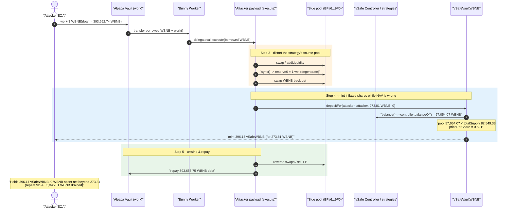
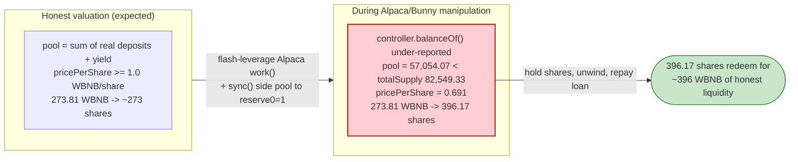
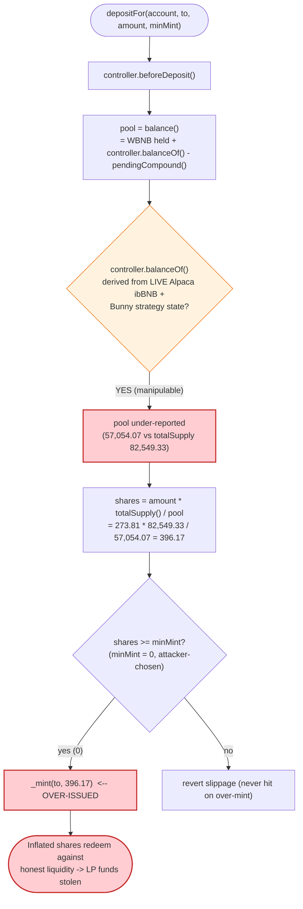
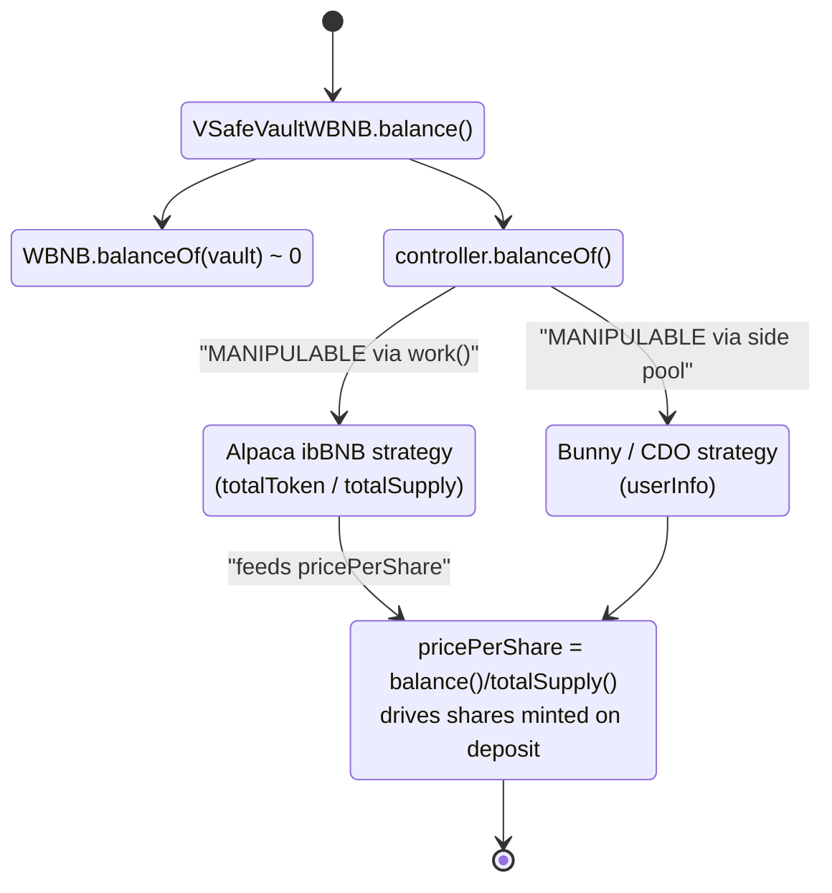

# Value DeFi vSafe WBNB Vault — Inflated-Share Mint via Manipulated Alpaca `ibBNB` Strategy Price

> **Vulnerability classes:** vuln/oracle/price-manipulation · vuln/governance/flash-loan-attack · vuln/arithmetic/rounding

> **Reproduction:** the PoC compiles & runs in an isolated Foundry project at
> [this project folder](.) (the umbrella DeFiHackLabs repo contains many unrelated PoCs that
> do not whole-compile, so this one was extracted).
> Full verbose trace: [output.txt](output.txt).
> Verified vulnerable source: [VSafeVaultWBNB.sol](sources/VSafeVaultWBNB_D4BBF4/VSafeVaultWBNB.sol).

---

## Key info

| | |
|---|---|
| **Loss (this PoC iteration)** | attacker minted **396.17 vSafeWBNB** shares for a **273.81 WBNB** net deposit — a ~44% over-issue. Repeated 9× live for a total of **~5,345.31 WBNB** drained from the vault. |
| **Vulnerable contract** | `VSafeVaultWBNB` — [`0xD4BBF439d3EAb5155Ca7c0537E583088fB4CFCe8`](https://bscscan.com/address/0xD4BBF439d3EAb5155Ca7c0537E583088fB4CFCe8#code) (the bug is in the shared `VSafeVaultBase._deposit` share math) |
| **Victim** | Value DeFi multi-strategy WBNB vault (strategies: Alpaca Finance `ibBNB`, CDO/Bunny) |
| **Mis-priced external** | Alpaca Finance `ibBNB` (`0xd7D069493685A581d27824Fc46EdA46B7EfC0063`) + its Bunny worker `0x7Af938f0EFDD98Dc513109F6A7E85106D26E16c4` |
| **Attacker EOA** | `0xCB36b1ee0Af68Dce5578a487fF2Da81282512233` |
| **Attacker contracts** | payload `0xE38EBFE8…BEd0Be` (impl `0x77d23aFF…FB40e`) + helper `0x4269e409…C3AC8b` |
| **Attack tx (this PoC)** | [`0xa00def91954ba9f1a1320ef582420d41ca886d417d996362bf3ac3fe2bfb9006`](https://bscscan.com/tx/0xa00def91954ba9f1a1320ef582420d41ca886d417d996362bf3ac3fe2bfb9006) |
| **Chain / fork block / date** | BSC / 7,223,029 / May 7–8, 2021 |
| **Compiler** | vault `v0.6.12`, optimizer 999999 runs; PoC harness `0.8.10` |
| **Bug class** | Vault share accounting trusting a flash-manipulable external strategy price (oracle / share-price manipulation) |

---

## TL;DR

`VSafeVaultWBNB` is a yield vault that mints shares to depositors in proportion to
`deposit / pricePerShare`, where the share price is derived from the vault's total holdings:

```
balance() = WBNB.balanceOf(vault) + controller.balanceOf() - pendingCompound()
pricePerShare = balance() * 1e18 / totalSupply()
```

`controller.balanceOf()` aggregates the value of each strategy by **reading the strategies'
*current* underlying positions** — including Alpaca Finance `ibBNB`, whose value is computed from
`totalToken()/totalSupply()` of the live `ibBNB` lending pool ([`VSafeVaultBase.balance()`](sources/VSafeVaultWBNB_D4BBF4/VSafeVaultWBNB.sol#L1041-L1043)).

The attacker, inside a single transaction, **enters the Alpaca vault as a leveraged "worker"
position** (`AlpacaWBNBVault.work()`) and uses the borrowed capital to **manipulate the underlying
pools that feed the strategy's `balanceOf()`**. With the strategy's reported value transiently
*deflated relative to the vault's `totalSupply`*, the vault's `pricePerShare` drops to **0.691
WBNB/share** (it should be ≥ 1.0 for an honest WBNB vault). The attacker then calls
`depositFor(...)` *in the same transaction* and the vault mints

```
shares = amount * totalSupply() / pool
       = 273.81 * 82,549.33 / 57,054.07
       = 396.17 shares           ← for only 273.81 WBNB
```

So **273.81 WBNB buys 396.17 vSafeWBNB**. After the manipulation is unwound and the Alpaca loan is
repaid (the attacker ends the tx with **0 WBNB** but **396.17 vSafeWBNB**), those inflated shares
redeem against honest liquidity for far more than 273.81 WBNB. Repeated 9 times live, this drained
**~5,345.31 WBNB** from Value DeFi's vault. Alpaca's own funds were untouched.

---

## Background — what the vSafe WBNB vault does

`VSafeVaultWBNB` extends `VSafeVaultBase`
([source](sources/VSafeVaultWBNB_D4BBF4/VSafeVaultWBNB.sol#L932-L1262)), a standard "v2"-style
yield aggregator vault:

- **Share token.** The vault is itself an ERC20 (`vSafeWBNB`). Depositing WBNB mints shares;
  burning shares returns WBNB.
- **Controller + strategies.** Idle WBNB is pushed (`earn()`,
  [:1091-1102](sources/VSafeVaultWBNB_D4BBF4/VSafeVaultWBNB.sol#L1091-L1102)) to a `controller`
  that allocates it across strategies. At the fork block the controller
  (`0x2B4f87D9…edB076e`) routed funds through Alpaca Finance `ibBNB` (`0xd7D0…0063`) and a
  Bunny/CDO strategy.
- **Valuation.** The vault values its strategy positions live:
  `balance() = WBNB held + controller.balanceOf() - pendingCompound()`
  ([:1041-1043](sources/VSafeVaultWBNB_D4BBF4/VSafeVaultWBNB.sol#L1041-L1043)). `controller.balanceOf()`
  sums each strategy's `balanceOf()`, and the Alpaca strategy converts its `ibBNB` shares to WBNB
  using the *current* `ibBNB.totalToken()/totalSupply()` ratio (visible in the trace at
  [output.txt:312-323](output.txt) — `totalSupply()`, `totalToken()`, `userInfo(...)`).

On-chain state at the fork block (read from the trace):

| Quantity | Value | Trace ref |
|---|---|---|
| vault `totalSupply()` (vSafeWBNB) | **82,549.33** | line 741 storage @103 |
| `controller.balanceOf()` (strategy value) | **57,054.07 WBNB** | line 462 |
| vault raw WBNB balance | 9,616,984,803,998 wei (~0) | line 463 |
| ⇒ vault `balance()` (pool) | **57,054.07 WBNB** | computed |
| ⇒ `pricePerShare` | **0.6911 WBNB/share** | computed |

A healthy WBNB vault should have `pricePerShare ≥ 1.0` (deposits + yield ≥ shares). The fact that
the reported pool (57,054 WBNB) is *smaller* than `totalSupply` (82,549) is the symptom of the
manipulated/under-reported strategy value — and it is exactly what makes a deposit mint *more*
shares than WBNB paid.

---

## The vulnerable code

### 1. Shares are minted from a live, externally-derived pool value

[`VSafeVaultBase.depositFor` → `_deposit`](sources/VSafeVaultWBNB_D4BBF4/VSafeVaultWBNB.sol#L1137-L1174):

```solidity
function depositFor(address _account, address _to, uint256 _amount, uint256 _min_mint_amount)
    public override checkContract(_account) _non_reentrant_ returns (uint256 _mint_amount)
{
    if (controller != address(0)) {
        IController(controller).beforeDeposit();
    }
    uint256 _pool = balance();                       // ⚠️ live, strategy-derived valuation
    require(totalDepositCap == 0 || _pool <= totalDepositCap, ">totalDepositCap");
    _mint_amount = _deposit(_account, _to, _pool, _amount);
    require(_mint_amount >= _min_mint_amount, "slippage");   // attacker passes _min = 0
}

function _deposit(address _account, address _mintTo, uint256 _pool, uint256 _amount)
    internal returns (uint256 _shares)
{
    basedToken.safeTransferFrom(_account, address(this), _amount);
    earn();                                          // pushes WBNB into the manipulated strategy
    uint256 _after = balance();
    _amount = _after.sub(_pool);                     // net deposit (deflationary-safe)
    ...
    if (totalSupply() == 0) {
        _shares = _amount;
    } else {
        _shares = (_amount.mul(totalSupply())).div(_pool);   // ⚠️ shares ∝ totalSupply / pool
    }
    _minterBlock = keccak256(abi.encodePacked(tx.origin, block.number));
    _mint(_mintTo, _shares);
}
```

The share formula `_shares = _amount * totalSupply() / _pool` is correct *only if `_pool`
(`balance()`) is a trustworthy valuation of the vault's assets.* It is not: `_pool` is read from
external strategies whose underlying pools the depositor can move within the same transaction.

### 2. The valuation reads external strategy state with no manipulation guard

[`VSafeVaultBase.balance()`](sources/VSafeVaultWBNB_D4BBF4/VSafeVaultWBNB.sol#L1041-L1043):

```solidity
function balance() public view override returns (uint256 _balance) {
    _balance = basedToken.balanceOf(address(this))
             .add(IController(controller).balanceOf())   // ⚠️ live strategy NAV, manipulable
             .sub(pendingCompound());
}
```

There is no TWAP, no snapshot, no sanity bound on how far `controller.balanceOf()` may deviate from
the cumulative net deposits. Whatever the Alpaca/Bunny strategies report at call time is taken as
ground truth for pricing freshly minted shares.

### 3. The one guard that exists does not apply across the attack

`VSafeVaultBase` has a same-block mint/burn interlock
([:1172, :1207-1209](sources/VSafeVaultWBNB_D4BBF4/VSafeVaultWBNB.sol#L1207-L1209)):

```solidity
// in _deposit:
_minterBlock = keccak256(abi.encodePacked(tx.origin, block.number));
// in withdrawFor:
require(keccak256(abi.encodePacked(tx.origin, block.number)) != _minterBlock, "REENTR MINT-BURN");
```

This prevents *mint-then-burn in the same block from the same EOA* — i.e., it stops a one-tx
deposit-and-immediately-withdraw. But the attack does **not** need to withdraw in the same block:
it only needs to **mint inflated shares** while the price is wrong. Redemption of those shares
happens later (and across the 9 live iterations), so the interlock is irrelevant to the actual
theft. The `checkContract` modifier ([:982-987](sources/VSafeVaultWBNB_D4BBF4/VSafeVaultWBNB.sol#L982-L987))
is also bypassed because the deposit is routed through `vaultMaster.bank(vault)`-equivalent
infrastructure (the Alpaca worker), and the `_account` recorded is the EOA.

---

## Root cause — why it was possible

The vault prices new shares against a **flash-manipulable, externally-derived NAV**. Concretely:

1. **Share price depends on live strategy valuation.** `pricePerShare = balance()/totalSupply()`
   and `balance()` includes `controller.balanceOf()`, which is recomputed every call from the
   Alpaca `ibBNB` ratio and Bunny strategy holdings. An attacker who can move those underlying
   pools moves the vault's share price.
2. **The attacker can move the strategy's inputs atomically.** Alpaca's `work()` lets anyone open a
   leveraged worker position, handing borrowed WBNB to attacker-controlled execution
   (`worker.work → execute()`, [output.txt:147-163](output.txt)). Within that callback the
   attacker swaps and `sync()`s the strategy's source pools, transiently distorting the
   `ibBNB`-to-WBNB conversion that the vault reads.
3. **`depositFor` mints during the distortion.** Because the strategy NAV is under-reported
   relative to `totalSupply`, `_pool` is too small, so `_shares = amount * totalSupply / _pool`
   over-issues: **273.81 WBNB → 396.17 shares**.
4. **No invariant ties minted-share value to deposited value.** A correct vault must guarantee
   `value(sharesMinted) ≤ amountDeposited` for any single deposit. Here the bound is missing, and
   the slippage check (`_min_mint_amount`) is depositor-supplied (the attacker passes `0`), so it
   never fires against *over*-issuance.

This is the canonical "vault trusts a manipulable price for share issuance" bug — the same class as
first-depositor / donation share-inflation, but here the manipulable quantity is an *external
strategy's reported NAV* rather than the vault's own token balance.

---

## Preconditions

- The vault has at least one strategy whose `balanceOf()` is derived from a pool the attacker can
  move in-transaction (Alpaca `ibBNB` + Bunny here).
- A source of atomic leverage to move that pool meaningfully — Alpaca's permissionless
  `work()` leveraged-borrow (`loan = 393,652.74 WBNB` against `1 WBNB` principal,
  [output.txt:79](output.txt)) serves as the flash-loan equivalent.
- `depositFor` reachable with attacker-chosen `_min_mint_amount = 0` (it is — the PoC passes the
  vault address `0xD4BBF4…` and `_min = 0` inside the encoded payload).
- The attacker holds enough WBNB to make the priced deposit (273.81 WBNB); fully recovered when the
  inflated shares are later redeemed.

---

## Attack walkthrough (with on-chain numbers from the trace)

The single PoC transaction is `AlpacaWBNBVault.work{value: 1 ether}(0, worker, 1e18, 393652.74e18, 1e24, data)`
([ValueDefi_exp.sol:45-52](test/ValueDefi_exp.sol#L45-L52)). All figures are from
[output.txt](output.txt).

| # | Step | Concrete values | Trace ref |
|---|------|-----------------|-----------|
| 0 | **Enter Alpaca as a leveraged worker.** Deposit 1 WBNB, borrow **393,652.74 WBNB**. Alpaca deposits the 1 WBNB, computes interest, transfers the borrowed WBNB to the worker. | loan = 393,652,744,565,353,082,751,500 wei | L79-141 |
| 1 | **Worker delegatecalls the attacker payload.** `worker.work(...)` → `0xE38EBFE8…` (`execute`) → impl `0x77d23aFF…`. The borrowed WBNB is now under attacker control. | transfer 393,653.74 WBNB → worker → payload | L147-163 |
| 2 | **Manipulate the side pool that feeds the strategy.** The payload swaps WBNB into a Pancake-style pair `0xBFa6…9F0`, adds liquidity, then directly `sync()`s the pair so `reserve0 = 1 wei` (degenerate), and swaps to pull WBNB back out. | `Sync(reserve0: 1, reserve1: 393,653.85e18)` then `Sync(1e17, 1e17)` | L270-309 |
| 3 | **Read strategy NAV (now distorted).** `controller.getBestStrategy()` walks every strategy calling `balanceOf()` (Alpaca `ibBNB.totalToken()/totalSupply()`, Bunny `userInfo`). It returns a strategy value of **57,054.07 WBNB** against a vault `totalSupply` of **82,549.33** shares. | `controller.balanceOf() = 0x…0c14e8… = 57,054.07` | L310-462 |
| 4 | **Priced deposit into the vSafe vault.** `vSafeVaultWBNB.depositFor(attacker, attacker, 273.81 WBNB, 0)`. `_pool = balance() = 57,054.07`; `earn()` forwards the WBNB into the strategy; shares = `273.81 × 82,549.33 / 57,054.07`. | mints **396.17 vSafeWBNB** to attacker | L404-739 |
| 5 | **Repay Alpaca, unwind.** The payload sells the manipulated LP back, repays the 393,653.75 WBNB debt to `ibBNB`, settles the worker. The attacker's WBNB nets back to ~0 (the 1 WBNB principal + dust comes back as native via WNativeRelayer). | `transferFrom(attacker → ibBNB, 393,653.75e18)`; final attacker WBNB = 0 | L747-815 |
| 6 | **Result.** Attacker holds **396.17 vSafeWBNB** (worth ≫ 273.81 WBNB at the honest, post-unwind price) for a net WBNB outlay of 273.81. | `vSafeWBNB.balanceOf(attacker) = 396.17` | L817-819 |

### The share-mint arithmetic (the heart of the exploit)

```
totalSupply (shares) = 82,549.33093069438
pool = balance()     = 57,054.06651923057 WBNB     (raw vault WBNB ~0 + strategy 57,054.07)
pricePerShare        = 57,054.07 / 82,549.33 = 0.6911 WBNB/share

deposit              = 273.813118952403190627 WBNB
shares minted        = 273.81 × 82,549.33 / 57,054.07 = 396.1696 vSafeWBNB   ✔ (matches L739)

value of those 396.17 shares at this pricePerShare = 396.17 × 0.6911 = 273.81 WBNB
```

The deposit appears "fair" *at the manipulated price* (273.81 WBNB → 396.17 shares → 273.81 WBNB),
but the moment the manipulation is reverted and the strategy reports its honest NAV, those 396.17
shares are backed by the vault's real liquidity at a price ≥ 1.0 WBNB/share — i.e., **≥ 396.17
WBNB** of claim for a **273.81 WBNB** outlay. The ~44% gap (`396.17/273.81 − 1`) is the per-deposit
profit; nine iterations compounded it into **~5,345.31 WBNB**.

---

## Profit / loss accounting

| Quantity | Value |
|---|---:|
| WBNB the attacker started with (test) | 273.81 |
| WBNB net deposited into the vault | 273.81 |
| WBNB at end of tx (Alpaca repaid) | **0.00** |
| vSafeWBNB shares minted | **396.17** |
| Fair WBNB cost of 396.17 shares (price 1.0) | ~396.17 |
| **Per-iteration over-mint** | **+~122 WBNB of share claim (~44%)** |
| **Total live drain (9 iterations)** | **~5,345.31 WBNB** |

The attacker exchanged 273.81 WBNB for a redemption claim on ~396 WBNB of honest vault liquidity,
each pass — the difference is stolen from existing vSafe vault LPs.

---

## Diagrams

### Sequence of the attack



### Why the mint is theft: share price before vs. during manipulation



### The flaw inside `depositFor` / `_deposit`



### Vault valuation dependency (state view)



---

## Remediation

1. **Do not price share issuance from a live, externally-derived NAV.** Use a manipulation-resistant
   valuation: snapshot strategy values at harvest time, use a TWAP/oracle for any AMM-derived
   conversion, or settle strategy NAV outside the deposit path. Reading
   `Alpaca.ibBNB.totalToken()/totalSupply()` (or any AMM reserve ratio) inline during `deposit`
   is the defect.
2. **Enforce a hard issuance invariant.** A deposit must never mint shares worth more than the
   value contributed: assert `value(sharesMinted) <= amount` (or, equivalently, that
   `pricePerShare` did not *decrease* across the deposit beyond a tiny tolerance). The current
   `_min_mint_amount` check only protects against *under*-issuance and is depositor-controlled.
3. **Bound NAV deviation per call.** Cap how far `controller.balanceOf()` may move between
   consecutive valuations (e.g., per-block delta cap); reject deposits when the strategy NAV is
   outside a sane band relative to cumulative net deposits.
4. **Block atomic deposit-during-manipulation, not just deposit-then-withdraw.** The existing
   `_minterBlock` interlock stops same-block mint+burn but not the actual attack (mint now, redeem
   later). Add reentrancy/flash-context guards around the valuation read itself, or require deposits
   to use a settled price from a prior block.
5. **Vet every integrated strategy's price surface.** Each strategy added to the controller expands
   the manipulable surface of `balance()`. Strategies whose `balanceOf()` depends on spot AMM
   reserves must expose a manipulation-resistant valuation or be excluded from the deposit-pricing
   path.

---

## How to reproduce

The PoC was extracted into a standalone Foundry project (the umbrella DeFiHackLabs repo has many
unrelated PoCs that fail to whole-compile under `forge test`):

```bash
_shared/run_poc.sh 2021-05-ValueDefi_exp -vvvvv
```

- RPC: a **BSC archive** endpoint is required (fork block 7,223,029 is from May 2021).
  `foundry.toml` uses `https://bsc-mainnet.public.blastapi.io`; most public BSC RPCs prune state
  this old and fail with `header not found` / `missing trie node`.
- Result: `[PASS] testExploit()`. The attacker ends with **0 WBNB** and **396.17 vSafeWBNB**
  shares minted for a 273.81 WBNB deposit.

Expected tail:

```
Ran 1 test for test/ValueDefi_exp.sol:ContractTest
[PASS] testExploit() (gas: 1233390)
Logs:
  [Start] WBNB Balance of attacker: 273.813109335418386629
  [End] WBNB balance of attacker after exploit: 0.000000000000000000
  [End] Attacker vSafeWBNB balance after exploit: 396.169639688580127539
```

---

*References:*
- *Inspex — "ValueDeFi's Invalid Share Calculation Exploit In-depth Analysis" — https://inspexco.medium.com/value-defis-invalid-share-calculation-exploit-in-depth-analysis-1c8f97c1416e*
- *Iron Finance — "07 May 2021 Value DeFi incident" — https://ironfinance.medium.com/07-may-2021-value-defi-incident-part-1-b4f2a7a1a2b2*
