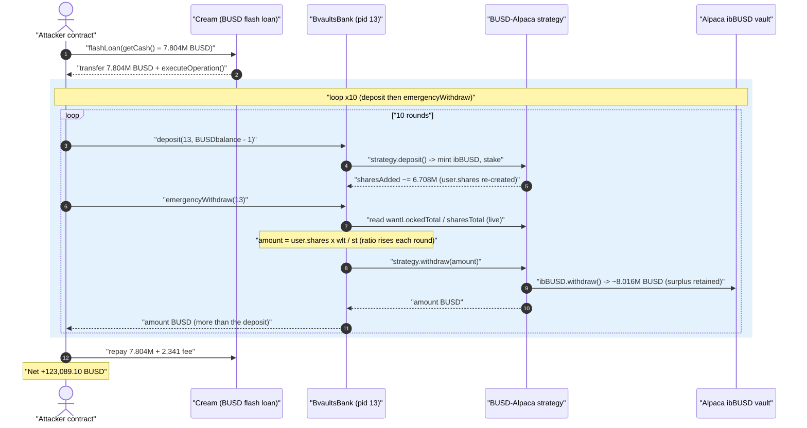
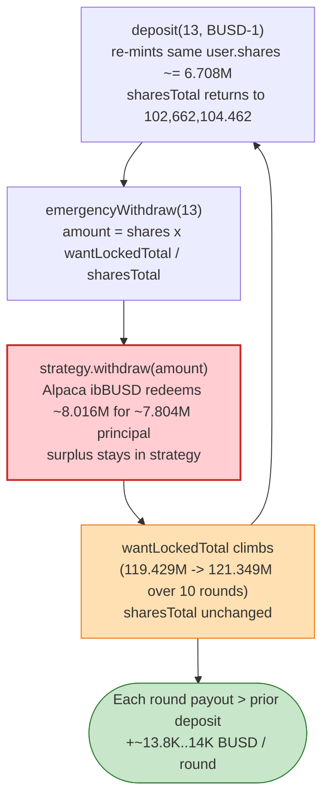
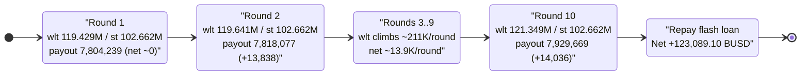

# bEarn / bVaults BUSD-Alpaca Strategy Exploit — `emergencyWithdraw` Re-prices Shares Against a Self-Inflating `wantLockedTotal`

> **Vulnerability classes:** vuln/logic/incorrect-state-transition · vuln/governance/flash-loan-attack

> **Reproduction:** the PoC compiles & runs in an isolated Foundry project at
> [this project folder](.) (the umbrella DeFiHackLabs repo contains many unrelated PoCs that do not
> whole-compile, so this one was extracted). Full verbose trace: [output.txt](output.txt).
> Verified vulnerable source: [BvaultsBank.sol](sources/BvaultsBank_406cfa/BvaultsBank.sol).

---

## Key info

| | |
|---|---|
| **Loss (this PoC)** | **123,089.10 BUSD (~$123K)** extracted from the bVaults BUSD-Alpaca strategy in a single transaction (the broader bVaults/Alpaca incident totalled ~$11M). |
| **Vulnerable contract** | `BvaultsBank` (behind proxy) — [`0xB390B07fcF76678089cb12d8E615d5Fe494b01Fb`](https://bscscan.com/address/0xb390b07fcf76678089cb12d8e615d5fe494b01fb#code) (impl `0x406cfaae2c8e30a70b90baa52e753b6c17c1df9c`) |
| **Victim pool / strategy** | bVaults pool **pid 13**; BUSD-Alpaca strategy `0x21125d94Cfe886e7179c8D2fE8c1EA8D57C73E0e`, which deposits into Alpaca `ibBUSD` vault `0x7C9e73d4C71dae564d41F78d56439bB4ba87592f` |
| **Flash-loan source** | Cream `CErc20Delegator` (BUSD) — `0x2Bc4eb013DDee29D37920938B96d353171289B7C` (impl `0xb316F4F692d3bc53B79C83c97fDD45bC94255F53`) |
| **Want token** | BUSD — `0xe9e7CEA3DedcA5984780Bafc599bD69ADd087D56` |
| **Attacker EOA** | `0x47f341d896b08daacb344d9021f955247e50d089` |
| **Attacker contract** | `0xef39f14213714001456e2e89eddbdf8c850c3be6` |
| **Attack tx** | `0x603b2bbe2a7d0877b22531735ff686a7caad866f6c0435c37b7b49e4bfd9a36c` |
| **Chain / fork block / date** | BSC / 7,457,124 / ~May 2021 |
| **Compiler** | `BvaultsBank` Solidity v0.6.12, optimizer (999999 runs); proxy/strategy similar era |
| **Bug class** | Share-accounting / vault price-per-share manipulation — `emergencyWithdraw` re-prices a fixed share balance against a `wantLockedTotal` that the attacker inflates in the *same* call sequence |

---

## TL;DR

`BvaultsBank.emergencyWithdraw()` pays a user `amount = user.shares × wantLockedTotal / sharesTotal`,
reading the strategy's **current** `wantLockedTotal` and `sharesTotal`
([BvaultsBank.sol:1090-1104](sources/BvaultsBank_406cfa/BvaultsBank.sol#L1090-L1104)). The strategy
parks its `want` (BUSD) inside Alpaca's `ibBUSD` vault, whose share price was **inflated** at the fork
block, so the strategy's `withdraw()` consistently pulls **more** BUSD out of Alpaca than it puts in —
roughly `8.016M` BUSD returned for a `7.804M` BUSD principal each round. That surplus stays in the
strategy and **raises `wantLockedTotal` while `sharesTotal` stays flat**.

The attacker flash-borrows the entire BUSD liquidity of Cream (≈ 7.804M BUSD) and runs a tight
`deposit(13, balance-1)` → `emergencyWithdraw(13)` loop **ten times**. On every loop:

1. `deposit` re-creates the **same** `user.shares` (≈ 6.71M shares for ≈ 7.804M BUSD) and re-adds them to
   the strategy's running `sharesTotal`.
2. `emergencyWithdraw` then values those *same* shares against a `wantLockedTotal` that the previous
   round's Alpaca surplus already pushed up, so it returns **more BUSD than was just deposited** — about
   **+13,838 BUSD on round 2, growing to +14,035 BUSD by round 10**.

After 10 rounds the attacker holds **7,929,669.48 BUSD**, repays the flash loan + fee
(**7,806,580.38 BUSD**), and walks away with **123,089.10 BUSD** — exactly the difference, to the wei.

---

## Background — what bVaults / bEarn is

bVaults (bEarn DAO) is an auto-compounding yield aggregator on BSC modeled on the BeefyFinance /
AutoFarm "bank + strategy" pattern:

- **`BvaultsBank`** ([source](sources/BvaultsBank_406cfa/BvaultsBank.sol)) is the user-facing MasterChef-style
  bank. Each pool (`poolInfo[pid]`) points at a `strategy`. Users `deposit` a `want` token; the bank
  forwards it to the strategy, which returns a number of **shares** that the bank records in
  `userInfo[pid][user].shares`. On withdrawal the bank converts shares back to `want` using the
  strategy's live `wantLockedTotal / sharesTotal`.
- The **strategy** for pid 13 (`0x21125d94…`) holds BUSD and farms it through **Alpaca Finance**: it
  mints Alpaca `ibBUSD` interest-bearing shares (vault `0x7C9e73…`) and stakes them in Alpaca's
  FairLaunch (`0xA625AB…`). `wantLockedTotal()` reports how much BUSD the strategy can currently redeem;
  `sharesTotal()` reports the strategy's outstanding internal shares.

The exchange rate between a strategy share and `want` is therefore `wantLockedTotal / sharesTotal`.
This is the standard, intended accounting — and it is exactly what the attacker turns against the
protocol, because at the fork block the underlying Alpaca `ibBUSD` price-per-share was inflated (the
root of the broader Alpaca incident), making the strategy's redeem **profitable on every pass**.

On-chain facts at the fork block (read from the trace):

| Quantity | Value |
|---|---|
| Cream BUSD `getCash()` (flash-loanable) | 7,804,239.111785 BUSD |
| Strategy `wantLockedTotal` after first deposit | 119,429,198.386 BUSD |
| Strategy `sharesTotal` (constant across all 10 `emergencyWithdraw`s) | 102,662,104.462 |
| Alpaca `ibBUSD.withdraw(7.804M)` payout to strategy (round 1) | **8,016,005.99 BUSD** |
| Attacker `user.shares` re-created each round | 6,708,573.9649 |
| Flash-loan fee (~0.03%) | 2,341.271734 BUSD |

---

## The vulnerable code

### 1. `emergencyWithdraw` re-prices shares against the **live** strategy ratio, with no `updatePool`

```solidity
// Withdraw without caring about rewards. EMERGENCY ONLY.
function emergencyWithdraw(uint256 _pid) public nonReentrant {
    require(!pausePool[_pid], "paused");
    require(!blacklistAccount[msg.sender], "blacklisted");

    PoolInfo storage pool = poolInfo[_pid];
    UserInfo storage user = userInfo[_pid][msg.sender];

    uint256 wantLockedTotal = IStrategy(poolInfo[_pid].strategy).wantLockedTotal();
    uint256 sharesTotal     = IStrategy(poolInfo[_pid].strategy).sharesTotal();
    uint256 amount = user.shares.mul(wantLockedTotal).div(sharesTotal);   // ← live, manipulable ratio

    IStrategy(poolInfo[_pid].strategy).withdraw(msg.sender, amount);

    pool.want.safeTransfer(address(msg.sender), amount);
    emit EmergencyWithdraw(msg.sender, _pid, amount);
    user.shares = 0;
    ...
}
```
[BvaultsBank.sol:1090-1104](sources/BvaultsBank_406cfa/BvaultsBank.sol#L1090-L1104)

`amount` is computed from the strategy's **instantaneous** `wantLockedTotal / sharesTotal`. There is no
snapshot of the rate at deposit time, no slippage bound, and — unlike `withdraw()` — no
`require(block.timestamp >= unfrozenStakeTime(...))` time-lock and no clamp of the payout to the user's
deposited principal.

### 2. `deposit` re-creates the *same* shares every round

```solidity
function deposit(uint256 _pid, uint256 _wantAmt) public nonReentrant {
    require(!pausePool[_pid], "paused");
    updatePool(_pid);
    ...
    if (_wantAmt > 0) {
        pool.want.safeTransferFrom(address(msg.sender), address(this), _wantAmt);
        pool.want.safeIncreaseAllowance(pool.strategy, _wantAmt);
        uint256 sharesAdded = IStrategy(poolInfo[_pid].strategy).deposit(msg.sender, _wantAmt);
        user.shares = user.shares.add(sharesAdded);   // ← shares minted from same principal each loop
        user.lastStakeTime = block.timestamp;
    }
    ...
}
```
[BvaultsBank.sol:1008-1031](sources/BvaultsBank_406cfa/BvaultsBank.sol#L1008-L1031)

Because `emergencyWithdraw` zeroes `user.shares` at the end, the next `deposit` of essentially the same
BUSD principal mints essentially the same `sharesAdded` again — so the attacker's share *position* is
constant, but the **price** of that position keeps rising.

### 3. The strategy redeem is profitable — Alpaca `ibBUSD` returns more than principal

In the trace the strategy's `withdraw(7,804,239)` triggers Alpaca `ibBUSD.withdraw()`, which transfers
**8,016,005.99 BUSD** back to the strategy ([output.txt:246-247](output.txt)). The strategy returns
the requested `amount` to the bank and **retains the surplus**, which is reflected as a higher
`wantLockedTotal` on the next read. This surplus is the fuel: it is what makes round N+1's payout exceed
round N's deposit.

---

## Root cause — why it was possible

The single defective invariant is in `emergencyWithdraw`:

> **A user's payout is `shares × (wantLockedTotal / sharesTotal)` evaluated at call time, but the same
> caller can move `wantLockedTotal` upward *within the same transaction sequence* — by depositing and
> immediately emergency-withdrawing, harvesting the strategy's profitable Alpaca redeem on each pass.**

Concretely, four facts compose:

1. **Live, unsnapshotted share price.** `emergencyWithdraw` reads `wantLockedTotal`/`sharesTotal` fresh
   every time. It never records the rate the user deposited at, so it cannot detect that the user is
   redeeming at a rate they helped inflate.
2. **`sharesTotal` is flat, `wantLockedTotal` climbs.** Across all ten `emergencyWithdraw` calls the
   strategy `sharesTotal` reads the **identical** value `102,662,104.462` (the deposit re-adds exactly
   the shares the prior emergencyWithdraw removed), while `wantLockedTotal` climbs every round
   (`119.429M → 119.641M → … → 121.349M`). With the numerator rising and denominator fixed, the same
   `user.shares` is worth progressively more BUSD.
3. **The underlying vault is profitable to enter-and-exit.** Alpaca `ibBUSD`'s price-per-share was
   inflated at this block, so the strategy's deposit→withdraw round-trip nets ~211K BUSD of surplus
   each pass, ~13.8K–14K of which lands as net `wantLockedTotal` growth attributable to the attacker's
   shares.
4. **`emergencyWithdraw` skips the time-lock and reward bookkeeping that `withdraw` has.** The normal
   `withdraw()` path ([:1038-1083](sources/BvaultsBank_406cfa/BvaultsBank.sol#L1038-L1083)) enforces the
   `unstakingFrozenTime` freeze and recomputes `rewardDebt`. `emergencyWithdraw` does neither, so the
   attacker can loop deposit/withdraw with **zero time delay** and no friction.

The bug is *not* reentrancy — `nonReentrant` is honored throughout, and the loop is sequential. It is a
classic **share-price manipulation against a live exchange rate**, amplified by a flash loan that lets
the attacker control a position large enough that per-round surplus is meaningful, all repaid in one tx.

---

## Preconditions

- A flash-loan source large enough to dominate the strategy share base. Here the attacker borrows
  **all** of Cream's BUSD liquidity (`getCash()` = 7,804,239.11 BUSD,
  [output.txt:23-28](output.txt)) — repaid plus a ~0.03% fee (2,341.27 BUSD) in the same tx.
- pid 13 not paused (`pausePool[13] == false`) and the caller not blacklisted — both true at the block.
- The underlying Alpaca `ibBUSD` vault in a state where deposit→withdraw is profitable (inflated PPS).
- No `unstakingFrozenTime` obstacle, because `emergencyWithdraw` does not check it.

---

## Attack walkthrough (with on-chain numbers from the trace)

The PoC's `executeOperation` is the flash-loan callback; it runs the loop ten times
([test/bEarn_exp.sol:55-64](test/bEarn_exp.sol#L55-L64)):

```solidity
function executeOperation(address, address underlying, uint256 amount, uint256 fee, bytes memory) external {
    IERC20(BUSD).approve(bVault, type(uint256).max);
    for (uint256 i = 0; i < 10; i++) {
        IBVault(bVault).deposit(13, IERC20(underlying).balanceOf(address(this)) - 1); // deposit all BUSD-1
        IBVault(bVault).emergencyWithdraw(13);                                        // pull back more
    }
    IERC20(BUSD).transfer(CreamFi, amount + fee);                                     // repay flash loan
}
```

Each loop:
1. `deposit(13, balance-1)` forwards the BUSD to the strategy → strategy mints `ibBUSD`, stakes in
   FairLaunch, and returns `sharesAdded` (≈ 6.708M); the bank sets `user.shares = sharesAdded`.
2. `emergencyWithdraw(13)` reads the strategy's `wantLockedTotal`/`sharesTotal`, computes
   `amount = user.shares × wlt / st`, makes the strategy redeem `ibBUSD` from Alpaca (which returns
   ~8.016M BUSD, surplus retained), and forwards `amount` BUSD to the attacker. `user.shares` → 0.

Because `wlt` is larger every round while `st` is flat, `amount` strictly increases. Ground-truth table
(all BUSD values 18-decimals; from the `Deposit`/`EmergencyWithdraw` events and the strategy
`wantLockedTotal`/`sharesTotal` staticcalls in [output.txt](output.txt)):

| Round | Deposit (BUSD) | Strategy `wantLockedTotal` | `sharesTotal` | EmergencyWithdraw payout (BUSD) | Net gain (BUSD) |
|---:|---:|---:|---:|---:|---:|
| 1 | 7,804,239.1118 | 119,429,198.386 | 102,662,104.462 | 7,804,239.1118 | −0.0000 |
| 2 | 7,804,239.1118 | 119,640,965.268 | 102,662,104.462 | 7,818,077.2637 | +13,838.1519 |
| 3 | 7,818,077.2637 | 119,853,107.647 | 102,662,104.462 | 7,831,939.9528 | +13,862.6891 |
| 4 | 7,831,939.9528 | 120,065,626.187 | 102,662,104.462 | 7,845,827.2226 | +13,887.2698 |
| 5 | 7,845,827.2226 | 120,278,521.557 | 102,662,104.462 | 7,859,739.1168 | +13,911.8942 |
| 6 | 7,859,739.1168 | 120,491,794.423 | 102,662,104.462 | 7,873,675.6789 | +13,936.5622 |
| 7 | 7,873,675.6789 | 120,705,445.457 | 102,662,104.462 | 7,887,636.9528 | +13,961.2739 |
| 8 | 7,887,636.9528 | 120,919,475.327 | 102,662,104.462 | 7,901,622.9823 | +13,986.0294 |
| 9 | 7,901,622.9823 | 121,133,884.706 | 102,662,104.462 | 7,915,633.8112 | +14,010.8289 |
| 10 | 7,915,633.8112 | 121,348,674.267 | 102,662,104.462 | 7,929,669.4835 | +14,035.6723 |

> Verified: for every row `payout = round(user.shares × wantLockedTotal / sharesTotal)` matches the
> on-chain `EmergencyWithdraw` event amount **to the wei**, with `user.shares` and `sharesTotal` constant.

Round 1 nets ~0 (the loop only becomes profitable once a surplus from a *prior* redeem has bumped
`wantLockedTotal`). Rounds 2–10 each net ~13.8K–14K BUSD as the ratio ratchets upward.

### Profit / loss accounting (BUSD)

| Item | Amount (BUSD) |
|---|---:|
| Flash-loan principal borrowed from Cream | 7,804,239.1118 |
| Final attacker BUSD after 10th `emergencyWithdraw` | 7,929,669.4835 |
| Gross gain over 10 rounds (final − principal) | 125,430.3717 |
| Flash-loan fee repaid to Cream (~0.03%) | −2,341.2717 |
| Total repaid to Cream (principal + fee) | 7,806,580.3835 |
| **Net profit (attacker final BUSD balance)** | **123,089.0999** |

This reconciles exactly with the trace logs:
`Attacker Before exploit BUSD Balance: 0.000000` → `Attacker After exploit BUSD Balance: 123089.099971`
([output.txt:5-7](output.txt)).

---

## Diagrams

### Sequence of one full attack transaction



### Why the loop is profitable: rising numerator, flat denominator



### State of the share price across rounds



---

## Remediation

1. **Snapshot the deposit exchange rate; cap the payout to it.** `emergencyWithdraw` (and `withdraw`)
   must never return more `want` than the user can justify from the rate at *deposit* time. Track each
   user's deposited principal (or the `pricePerShare` at deposit) and clamp `amount` so a single
   transaction cannot redeem shares at a price the same caller inflated.
2. **Do not derive payouts from a live, externally-manipulable `wantLockedTotal`.** When the strategy's
   `wantLockedTotal` depends on a third-party vault's price-per-share (Alpaca `ibBUSD`), that price must
   be treated as adversarial. Use a smoothed/oracle value, or settle profit only through an explicit
   `harvest`/`earn` that the bank — not an external caller in a flash-loan callback — controls.
3. **Block same-transaction deposit→withdraw.** Enforce the `unstakingFrozenTime` freeze in
   `emergencyWithdraw` as well (it already exists in `withdraw`), or require at least one block between
   `deposit` and any withdrawal, so a flash-loan loop cannot harvest intra-tx rate drift.
4. **Settle realized strategy profit to existing LPs, not to the redeeming caller.** Any surplus the
   strategy realizes on a redeem should be socialized via `accRewardPerShare`/`pricePerFullShare`
   updates, not handed to whoever happens to call `emergencyWithdraw` at that instant.
5. **Cap per-call share-of-pool impact.** A single emergency withdrawal that represents a large fraction
   of `sharesTotal` — repeated ten times in one tx — should trigger conservative handling
   (revert, or rate-limit).

---

## How to reproduce

The PoC was extracted into a standalone Foundry project (the umbrella DeFiHackLabs repo has many
unrelated PoCs that fail to whole-compile under `forge test`):

```bash
_shared/run_poc.sh 2021-05-bEarn_exp -vvvvv
```

- RPC: a **BSC archive** endpoint is required (fork block 7,457,124 is from ~May 2021). `foundry.toml`
  uses `https://bsc-mainnet.public.blastapi.io`; most pruned public BSC RPCs will fail with
  `header not found` / `missing trie node` at this height.
- Result: `[PASS] testExploit()` with the attacker's BUSD balance going from 0 to **123,089.099971**.

Expected tail:

```
Ran 1 test for test/bEarn_exp.sol:bEarn
[PASS] testExploit() (gas: 3605577)
Logs:
  Attacker Before exploit BUSD Balance: 0.000000000000000000
  Attacker After exploit BUSD Balance: 123089.099970958434986685

Suite result: ok. 1 passed; 0 failed; 0 skipped
```

---

*References: bEarn DAO post-mortem — https://bearndao.medium.com/bvaults-busd-alpaca-strategy-exploit-post-mortem-and-bearn-s-compensation-plan-b0b38c3b5540 ; SlowMist Hacked — https://hacked.slowmist.io/ (bEarn / Alpaca strategy, BSC).*
