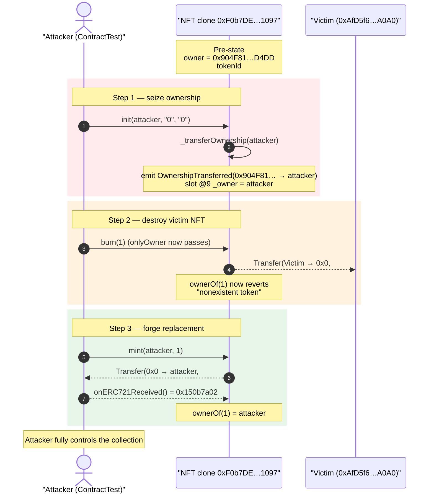
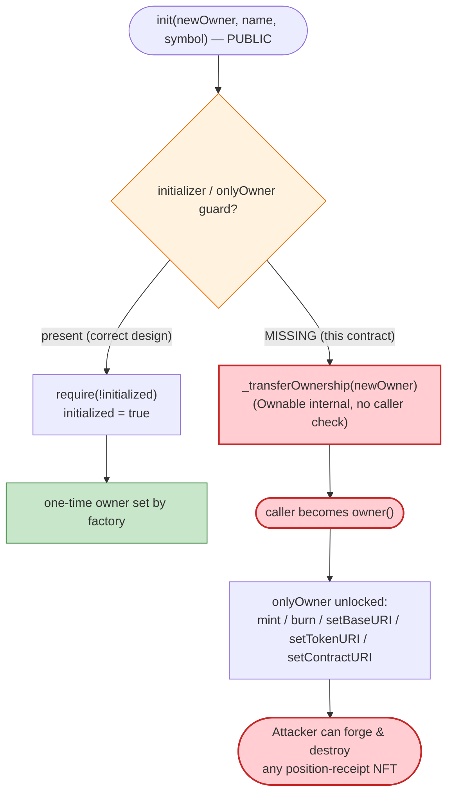
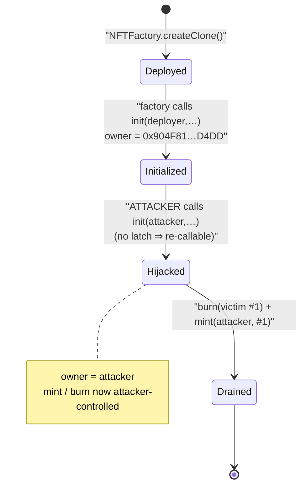

# 88mph NFT Exploit — Unprotected `init()` Lets Anyone Seize Ownership of a Live NFT Clone

> **Reproduction:** the PoC compiles & runs in an isolated Foundry project at
> [this project folder](.) (the umbrella DeFiHackLabs repo contains many
> unrelated PoCs that do not whole-compile, so this one was extracted).
> Full verbose trace: [output.txt](output.txt).
> Verified vulnerable source: [contracts_NFT.sol](sources/NFT_F0b7DE/contracts_NFT.sol).

---

## Key info

| | |
|---|---|
| **Loss** | No direct fund loss in this PoC; the bug grants **full control of a deployed NFT contract** (arbitrary `mint`/`burn`, URI rewrite, ownership theft). 88mph's NFTs are receipt tokens that represent fixed-rate deposit positions, so the practical impact is the ability to forge/destroy position-bearing NFTs. |
| **Vulnerable contract** | `NFT` clone — [`0xF0b7DE03134857391d8D43Ed48e20EDF21461097`](https://etherscan.io/address/0xF0b7DE03134857391d8D43Ed48e20EDF21461097#code) |
| **Vulnerable function** | `NFT.init(address,string,string)` — [contracts_NFT.sol:39-57](sources/NFT_F0b7DE/contracts_NFT.sol#L39-L57) |
| **Legitimate owner (pre-exploit)** | `0x904F81EFF3c35877865810CCA9a63f2D9cB7D4DD` (88mph deployer/factory caller) |
| **Attacker (PoC test contract)** | `ContractTest` — `0x7FA9385bE102ac3EAc297483Dd6233D62b3e1496` |
| **Original holder of NFT #1** | `0xAfD5f60aA8eb4F488eAA0eF98c1C5B0645D9A0A0` |
| **Chain / fork block** | Ethereum mainnet / **12,516,705** (≈ May 2021) |
| **Compiler** | Solidity **v0.5.17** (`+commit.d19bba13`), optimizer enabled, **200 runs** (per [`_meta.json`](sources/NFT_F0b7DE/_meta.json)) |
| **Bug class** | Missing initializer / access-control guard on a clone's `init()` (CWE-665 improper initialization → privilege escalation) |

---

## TL;DR

88mph mints ERC721 "receipt" NFTs from a `CloneFactory`. Each NFT is an EIP-1167 minimal-proxy
clone of a single `NFT` template. Because clones have no constructor, the template exposes a public
`init()` that the factory calls once to set the owner. But `init()` has **no `initializer` guard and
no `onlyOwner` check** — it can be called by *anyone, at any time, on an already-deployed clone*,
and it unconditionally runs `_transferOwnership(newOwner)`
([contracts_NFT.sol:44](sources/NFT_F0b7DE/contracts_NFT.sol#L44)).

The PoC simply calls `mphNFT.init(address(this), "0", "0")` on the live, already-initialized NFT at
`0xF0b7DE…1097`, instantly becoming `owner()`. From there every `onlyOwner` function is the
attacker's: it `burn`s a third party's NFT #1 (originally owned by `0xAfD5f6…A0A0`) and then `mint`s
a fresh NFT #1 to itself. The on-chain trace shows ownership storage flipping and token #1 being
destroyed and recreated under the attacker.

---

## Background — what the `NFT` contract is

88mph (`DInterest` fixed-rate deposit protocol) represents user positions as ERC721 NFTs. Rather
than deploy a full ERC721 per pool, it uses a factory + minimal-proxy (EIP-1167) clone pattern:

- [`NFTFactory`](sources/NFT_F0b7DE/contracts_NFTFactory.sol) holds a `template` address and exposes
  `createClone(name, symbol)` which deploys a clone via
  [`CloneFactory.createClone`](sources/NFT_F0b7DE/contracts_libs_CloneFactory.sol#L32-L41) and then
  calls `clone.init(msg.sender, name, symbol)`
  ([contracts_NFTFactory.sol:16-31](sources/NFT_F0b7DE/contracts_NFTFactory.sol#L16-L31)).
- The clone delegatecalls into the `NFT` template's logic (note in the trace every call to the clone
  resolves as a `[delegatecall]` into the implementation — the classic EIP-1167 signature).
- The clone's *storage* (owner, name, symbol, token registry) lives in the clone itself, set entirely
  through `init()` because a clone never runs the template's constructor.

The clone at `0xF0b7DE…1097` is a deployed, in-use NFT contract: at the fork block it already had an
owner (`0x904F81…D4DD`) and at least one minted token (#1, owned by `0xAfD5f6…A0A0`).

---

## The vulnerable code

### `init()` — public, no guard, transfers ownership unconditionally

From [contracts_NFT.sol:39-57](sources/NFT_F0b7DE/contracts_NFT.sol#L39-L57):

```solidity
function init(
    address newOwner,
    string calldata tokenName,
    string calldata tokenSymbol
) external {
    _transferOwnership(newOwner);          // ⚠️ no initializer flag, no onlyOwner — anyone, anytime
    _tokenName = tokenName;
    _tokenSymbol = tokenSymbol;

    // register the supported interfaces to conform to ERC721 via ERC165
    _registerInterface(_INTERFACE_ID_ERC721_METADATA);
    _registerInterface(_INTERFACE_ID_ERC165);
    _registerInterface(_INTERFACE_ID_ERC721);
}
```

There is **no** `require(!initialized)` / `initializer` modifier and **no** `onlyOwner`. The function
is `external` and re-entrant by design — every field it sets can be overwritten on any subsequent
call.

### The owner gate it defeats

`init()` calls `Ownable._transferOwnership`, which itself performs no caller check (it is `internal`
and trusts its callers) — from
[openzeppelin_contracts_ownership_Ownable.sol:72-76](sources/NFT_F0b7DE/openzeppelin_contracts_ownership_Ownable.sol#L72-L76):

```solidity
function _transferOwnership(address newOwner) internal {
    require(newOwner != address(0), "Ownable: new owner is the zero address");
    emit OwnershipTransferred(_owner, newOwner);
    _owner = newOwner;
}
```

The intended public entry to change ownership, `transferOwnership`, **is** `onlyOwner`
([:65-67](sources/NFT_F0b7DE/openzeppelin_contracts_ownership_Ownable.sol#L65-L67)). `init()` is the
hole: it reaches the same `internal` mutator while bypassing that modifier entirely.

### The privileged functions that ownership unlocks

From [contracts_NFT.sol:79-100](sources/NFT_F0b7DE/contracts_NFT.sol#L79-L100):

```solidity
function mint(address to, uint256 tokenId) external onlyOwner { _safeMint(to, tokenId); }
function burn(uint256 tokenId)             external onlyOwner { _burn(tokenId); }
function setContractURI(string calldata newURI) external onlyOwner { _contractURI = newURI; }
function setTokenURI(uint256 tokenId, string calldata newURI) external onlyOwner { _setTokenURI(tokenId, newURI); }
function setBaseURI(string calldata newURI) external onlyOwner { _setBaseURI(newURI); }
```

Once the attacker is `owner`, all five are theirs — most damagingly arbitrary `mint`/`burn` of any
`tokenId`, including ones already held by honest users.

---

## Root cause — why it was possible

Minimal-proxy clones cannot use constructors, so the initialization logic must live in a regular
function (`init`). The cardinal rule of that pattern is: **an `init`/initializer function must be
callable exactly once, and only by the deployer/factory.** This contract violates *both* halves of
that rule:

1. **No "already-initialized" latch.** There is no `initialized` boolean (the PoC's own comment even
   shows the *correct* pattern from `MPHToken.init()`:
   `require(!initialized, "..."); initialized = true;`). Without it, `init()` is a permanent,
   public "make-me-owner" button on every clone.
2. **No caller restriction.** Even a one-shot `init` should restrict who may call it (factory only,
   or `onlyOwner` after the first call). Here `init` is fully permissionless.

The `NFTFactory` calls `init` immediately after `createClone`
([contracts_NFTFactory.sol:23-27](sources/NFT_F0b7DE/contracts_NFTFactory.sol#L23-L27)), so under
honest usage `init` runs once with the right owner. But nothing on the clone *remembers* that it ran.
An attacker just calls `init` again on the live clone and takes over. This is the canonical
"unprotected initializer" privilege-escalation bug for upgradeable/clone contracts.

---

## Preconditions

- The target is a deployed `NFT` clone (EIP-1167 minimal proxy of the `NFT` template). ✓ — the live
  contract at `0xF0b7DE…1097`.
- `init()` exposed without an initializer/access guard. ✓ — see source above.
- No special timing, capital, or role is required. **Anyone** can call `init()` at any time; gas is
  the only cost (the PoC's `testExploit` consumes ~110k gas total).

---

## Step-by-step attack walkthrough (ground-truth from the trace)

All values below are taken directly from [output.txt](output.txt) (the `-vvvvv` run) and the PoC
[test/88mph_exp.sol](test/88mph_exp.sol).

| # | Action (call) | Result observed in trace | State change |
|---|---------------|--------------------------|--------------|
| 0 | `mphNFT.owner()` (read) | `0x904F81EFF3c35877865810CCA9a63f2D9cB7D4DD` | legitimate owner before attack |
| 1 | `mphNFT.init(attacker, "0", "0")` | `emit OwnershipTransferred(0x904F81…D4DD → ContractTest)`; storage `@9` (Ownable `_owner`) flips `…904f81…` → `…7fa9385b…` | **attacker is now `owner()`** |
| 2 | `mphNFT.owner()` (read) | `ContractTest 0x7FA9385bE102ac3EAc297483Dd6233D62b3e1496` | ownership confirmed stolen |
| 3 | `mphNFT.ownerOf(1)` (read) | `0xAfD5f60aA8eb4F488eAA0eF98c1C5B0645D9A0A0` | NFT #1 held by an unrelated victim |
| 4 | `mphNFT.burn(1)` (now `onlyOwner` passes) | `emit Transfer(0xAfD5f6…A0A0 → 0x0, tokenId 1)`; owner slot for #1 zeroed; balance slot `3 → 2` | **victim's NFT #1 destroyed** |
| 5 | `mphNFT.ownerOf(1)` | `[Revert] ERC721: owner query for nonexistent token` | confirms #1 no longer exists |
| 6 | `mphNFT.mint(attacker, 1)` | `emit Transfer(0x0 → ContractTest, tokenId 1)`; `onERC721Received` returns `0x150b7a02`; balance slot `0 → 1`, owner slot for #1 set to attacker | **attacker re-mints #1 to itself** |
| 7 | `mphNFT.ownerOf(1)` (read) | `ContractTest 0x7FA9385bE102ac3EAc297483Dd6233D62b3e1496` | attacker now holds #1 |

The single decisive step is **#1**: calling `init` on a contract that was already initialized in
production. Steps 4-7 merely demonstrate the consequences of holding `owner` — destroying an honest
user's receipt NFT and forging a replacement.

> Storage-slot evidence in the trace:
> - `@ 9: …904f81eff3…  → …7fa9385be102…` — Ownable's `_owner` (slot 9) overwritten in step 1.
> - `@ 0xcc69885f… : …afd5f60a… → 0` then `0 → …7fa9385b…` — the ERC721 `_tokenOwner[1]` mapping slot, zeroed on burn and re-set on mint.
> - `@ 0x902e1d43… : 3 → 2` then `@ 0x1da434b7… : 0 → 1` — owner/recipient ERC721 balance counters decrementing the victim and incrementing the attacker.

---

## Impact / loss accounting

This PoC demonstrates *capability*, not a dollar drain, so there is no WBNB/ETH P&L table. The
realized impact of owning the NFT clone is:

| Capability gained | Mechanism | Consequence |
|---|---|---|
| Arbitrary `burn(tokenId)` | `onlyOwner` now satisfied | Destroy any user's position-receipt NFT (shown: victim's #1 burned). |
| Arbitrary `mint(to, tokenId)` | `onlyOwner` now satisfied | Forge receipt NFTs, including re-minting a just-burned id to oneself (shown: #1 minted to attacker). |
| `setBaseURI` / `setTokenURI` / `setContractURI` | `onlyOwner` now satisfied | Rewrite metadata of the entire collection. |
| Permanent ownership | `_owner` slot overwritten | Lock out the legitimate operator (or renounce to brick the collection). |

Because 88mph NFTs are receipt tokens tied to fixed-rate deposit positions, the ability to mint/burn
them at will undermines the integrity of position ownership and any downstream system (e.g. a
fractionalizer or marketplace) that trusts these NFTs as authentic position proofs.

---

## Diagrams

### Sequence of the attack



### Why `init()` is the hole (control flow vs. the intended one-shot pattern)



### Clone deployment vs. exploit (state of the clone)



---

## Remediation

1. **Add a one-shot initializer latch.** Gate `init()` with a boolean exactly as 88mph's own
   `MPHToken.init()` does (the PoC comment quotes it): `require(!initialized, "NFT: initialized");
   initialized = true;`. This is the minimal fix and closes the bug.
2. **Restrict who may initialize.** Even one-shot, `init()` should only be callable by the factory
   (e.g. store the factory address in the template's immutable/storage and `require(msg.sender ==
   factory)`), so a front-runner cannot initialize a freshly-deployed clone with their own owner.
3. **Use a vetted initializer pattern.** Inherit OpenZeppelin's upgradeable `Initializable` and apply
   the `initializer` modifier to `init()` instead of hand-rolling the guard; it handles re-entrancy
   and re-initialization edge cases correctly.
4. **Have the factory initialize atomically and verify.** `NFTFactory.createClone` already calls
   `init` right after deployment — once a latch exists, that single in-constructor-equivalent call is
   the only one that will ever succeed, eliminating the race entirely.
5. **Defense in depth on ownership transfer.** Consider a two-step ownership transfer
   (`transferOwnership` + `acceptOwnership`) so that even an accidental ownership change cannot
   silently hand control to an attacker-chosen address.

---

## How to reproduce

The PoC was extracted into a standalone Foundry project (the umbrella DeFiHackLabs repo does not
whole-compile under `forge test`):

```bash
_shared/run_poc.sh 2021-06-88mph_exp --mt testExploit -vvvvv
```

- RPC: an Ethereum **mainnet** endpoint with state at block `12,516,705` (an archive node, since the
  fork block is from ~May 2021). The test uses `createSelectFork("mainnet", 12_516_705)`.
- Result: `[PASS] testExploit()` — ownership is stolen via `init()`, victim NFT #1 is burned, and a
  replacement #1 is minted to the attacker.

Expected tail:

```
Ran 1 test for test/88mph_exp.sol:ContractTest
[PASS] testExploit() (gas: 109781)
Logs:
  Before exploiting, NFT contract owner: 0x904F81EFF3c35877865810CCA9a63f2D9cB7D4DD
  After exploiting, NFT contract owner: 0x7FA9385bE102ac3EAc297483Dd6233D62b3e1496
  NFT Owner of #1:  0xAfD5f60aA8eb4F488eAA0eF98c1C5B0645D9A0A0
  After burning: NFT Owner of #1:  0x0000000000000000000000000000000000000000
  After exploiting: NFT Owner of #1:  0x7FA9385bE102ac3EAc297483Dd6233D62b3e1496

Suite result: ok. 1 passed; 0 failed; 0 skipped
```

---

*Bug class: unprotected `init()` on an EIP-1167 clone → ownership hijack → arbitrary mint/burn of
88mph position-receipt NFTs. Affected contract: `NFT` clone
[`0xF0b7DE03134857391d8D43Ed48e20EDF21461097`](https://etherscan.io/address/0xF0b7DE03134857391d8D43Ed48e20EDF21461097#code).*
