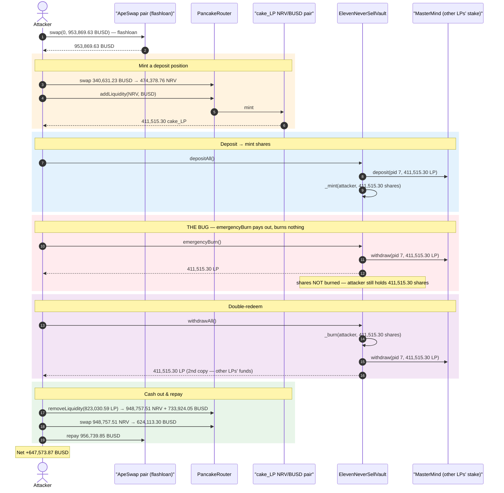
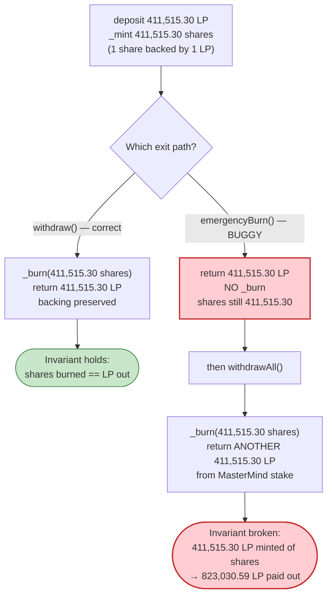

# Eleven Finance Exploit — `emergencyBurn()` Pays Out Underlying Without Burning Vault Shares

> **Reproduction:** the PoC compiles & runs in an isolated Foundry project at
> [this project folder](.) (the umbrella DeFiHackLabs repo contains several unrelated PoCs that do
> not whole-compile, so this one was extracted). Full verbose trace:
> [output.txt](output.txt). Verified vulnerable source:
> [ElevenNeverSellVault.sol](sources/ElevenNeverSellVault_27DD6E/ElevenNeverSellVault.sol).

---

## Key info

| | |
|---|---|
| **Loss** | ~$647.5K — **647,573.87 BUSD** net profit drained from other vault depositors |
| **Vulnerable contract** | `ElevenNeverSellVault` (`11nrvbusd`) — [`0x27DD6E51BF715cFc0e2fe96Af26fC9DED89e4BE8`](https://bscscan.com/address/0x27DD6E51BF715cFc0e2fe96Af26fC9DED89e4BE8#code) |
| **Victim** | The vault itself + its MasterMind/MasterChef stake (other LPs' NRV/BUSD `cake_LP` deposits) — `cake_LP` pair `0x401479091d0F7b8AE437Ee8B054575cd33ea72Bd` |
| **Flashloan source** | ApeSwap NRV/BUSD pair — `0x51e6D27FA57373d8d4C256231241053a70Cb1d93` |
| **Attacker EOA (pranked)** | `0xc71e2F581b77De945C8A7A191b0B238c81f11eD6` |
| **Attack tx** | `0x6450d8f4db09972853e948bee44f2cb54b9df786dace774106cd28820e906789` |
| **Chain / block / date** | BSC / 8,530,973 / June 22, 2021 |
| **Vault compiler** | Solidity v0.6.12, optimizer **disabled** |
| **Bug class** | Broken share accounting — emergency-exit path returns underlying without burning shares (double-redemption) |

---

## TL;DR

`ElevenNeverSellVault` is a yield-aggregator vault: deposit `cake_LP` (NRV/BUSD PancakeSwap LP),
receive `11nrvbusd` vault shares 1:1; the vault stakes your LP in Nerve's MasterMind MasterChef to
farm rewards. Withdrawing burns your shares and returns the LP.

The vault also exposes a public **`emergencyBurn()`**
([ElevenNeverSellVault.sol:1127-1133](sources/ElevenNeverSellVault_27DD6E/ElevenNeverSellVault.sol#L1127-L1133)):

```solidity
function emergencyBurn() public {
    uint balan = balanceOf(msg.sender);                 // your share balance
    uint avai = available();
    if(avai<balan) IMasterMind(mastermind).withdraw(nrvPid, (balan.sub(avai)));
    token.safeTransfer(msg.sender, balan);              // ⚠️ pays out underlying LP...
    emit Withdrawn(msg.sender, balan, block.number);
}                                                        // ⚠️ ...but NEVER calls _burn()!
```

It pays the caller `balanceOf(msg.sender)` units of underlying LP **but never burns the caller's
vault shares**. Contrast the legitimate `withdraw()`
([:1117-1125](sources/ElevenNeverSellVault_27DD6E/ElevenNeverSellVault.sol#L1117-L1125)) which *does*
`_burn(msg.sender, _shares)`.

So after `emergencyBurn()` the attacker holds **both** their LP back **and** their full share balance.
A second call to `withdrawAll()` then burns those shares for a **second** payout — and because the
vault's own LP balance is now zero, that second payout is pulled straight out of the MasterMind stake,
i.e. **out of the LP that other depositors put in**.

The attacker used a 953,869.63 BUSD flashloan from ApeSwap to mint a large share position, double-redeemed
it via `emergencyBurn()` + `withdrawAll()`, removed liquidity, repaid the loan, and walked away with
**647,573.87 BUSD**.

---

## Background — what the vault does

`ElevenNeverSellVault`
([source](sources/ElevenNeverSellVault_27DD6E/ElevenNeverSellVault.sol)) is a standard "moo-vault"
style yield optimizer:

- **Underlying token (`token`)** is the Nerve NRV/BUSD `cake_LP` at
  `0x401479091d0F7b8AE437Ee8B054575cd33ea72Bd`.
- **`deposit(_amount)`**
  ([:1093-1100](sources/ElevenNeverSellVault_27DD6E/ElevenNeverSellVault.sol#L1093-L1100)) pulls LP from
  the user, `_mint`s an equal number of `11nrvbusd` shares (the vault hard-codes
  `getPricePerFullShare()` to `1e18` — shares are 1:1 with LP), and forwards the LP into Nerve's
  MasterMind MasterChef (`pid 7`) to farm NRV.
- **`withdraw(_shares)`**
  ([:1117-1125](sources/ElevenNeverSellVault_27DD6E/ElevenNeverSellVault.sol#L1117-L1125)) burns the
  caller's shares, withdraws the matching LP from MasterMind if the vault doesn't hold enough locally,
  and returns the LP.
- **`emergencyBurn()`**
  ([:1127-1133](sources/ElevenNeverSellVault_27DD6E/ElevenNeverSellVault.sol#L1127-L1133)) is meant to be
  a "panic exit" that skips the reward-claim bookkeeping in `claim()`/`updateDebt()` and just hands the
  user their underlying back.

The intended invariant is the one every share-vault relies on:

> **`totalSupply()` of shares is always backed 1:1 by underlying LP held by the vault (locally + staked
> in MasterMind).** Every unit of underlying returned to a user MUST be matched by an equal number of
> shares burned.

`emergencyBurn()` breaks exactly this invariant.

On-chain state at the fork block (read from the trace):

| Parameter | Value |
|---|---|
| Vault underlying (`token`) | NRV/BUSD `cake_LP` |
| `getPricePerFullShare()` | hard-coded `1e18` (shares 1:1 with LP) |
| Vault's LP staked in MasterMind (pid 7) | ≈ 14,503,826 LP ([deposit trace](output.txt)) |
| `cake_LP` reserves (NRV / BUSD) | 6,418,974.70 NRV / 4,257,890.39 BUSD |
| ApeSwap NRV/BUSD pair BUSD balance (flashloan capacity) | > 953,869 BUSD |

The vault held millions of LP from other users staked in MasterMind — that is the pool the attacker
ultimately stole from. The double-redemption magnitude was bounded only by the attacker's flashloaned
working capital.

---

## The vulnerable code

### 1. The legitimate exit burns shares

```solidity
// ElevenNeverSellVault.sol:1117-1125
function withdraw(uint256 _shares) public {
    claim(msg.sender);
    _burn(msg.sender, _shares);                 // ✅ shares destroyed
    uint avai = available();
    if(avai<_shares) IMasterMind(mastermind).withdraw(nrvPid, (_shares.sub(avai)));
    token.safeTransfer(msg.sender, _shares);    // underlying returned
    emit Withdrawn(msg.sender, _shares, block.number);
    updateDebt(msg.sender);
}
```

### 2. The emergency exit does NOT burn shares

```solidity
// ElevenNeverSellVault.sol:1127-1133
function emergencyBurn() public {               // "Burn" in the name — but nothing is burned
    uint balan = balanceOf(msg.sender);
    uint avai = available();
    if(avai<balan) IMasterMind(mastermind).withdraw(nrvPid, (balan.sub(avai)));
    token.safeTransfer(msg.sender, balan);      // ⚠️ underlying out
    emit Withdrawn(msg.sender, balan, block.number);
    // ⚠️ NO _burn(msg.sender, balan); — the misleading name hides a missing line
}
```

`_burn` exists and works
([:652-660](sources/ElevenNeverSellVault_27DD6E/ElevenNeverSellVault.sol#L652-L660)) — `withdraw()`
calls it, `emergencyBurn()` simply forgot to. The function's *name* ("emergencyBurn") promises a burn
that the *body* never performs.

### 3. `deposit` mints shares 1:1 with deposited LP

```solidity
// ElevenNeverSellVault.sol:1093-1100
function deposit(uint _amount) public {
    claim(msg.sender);
    token.safeTransferFrom(msg.sender, address(this), _amount);
    _mint(msg.sender, _amount);                 // shares == LP deposited
    IMasterMind(mastermind).deposit(nrvPid, IERC20(token).balanceOf(address(this)));
    emit Deposited(msg.sender, _amount, block.number);
    updateDebt(msg.sender);
}
```

So 411,515.30 LP deposited → 411,515.30 shares minted. The bug then lets those same shares be redeemed
**twice**.

---

## Root cause — why it was possible

A share-vault's safety depends on a single conservation law: **underlying out ⇔ shares burned, in equal
measure.** Every well-formed exit path must destroy shares proportional to the value it pays out, or the
backing collapses.

`emergencyBurn()` pays out underlying along a path that destroys **zero** shares:

> It transfers `balanceOf(msg.sender)` LP to the caller (sourcing the shortfall from the MasterMind
> stake, i.e. other users' funds) and then returns — leaving the caller's full share balance intact.
> The caller now holds value worth `balan` LP **and** `balan` redeemable shares: a 2× claim on `balan`
> of underlying.

Concretely:

1. **Missing `_burn`.** The whole bug is one absent line. `withdraw()` burns;
   `emergencyBurn()` doesn't. The shares survive the "emergency exit" and remain fully redeemable.
2. **Public, unrestricted entry point.** `emergencyBurn()` is `public` with no access control and no
   `claim`/`updateDebt` bookkeeping that might have re-derived a consistent state. Anyone can call it on
   their own position.
3. **Shortfall is silently funded from the shared pool.** When `available()` (the vault's local LP) is
   less than the payout, both `emergencyBurn()` and `withdraw()` pull the difference from MasterMind via
   `IMasterMind(mastermind).withdraw(nrvPid, …)`. That stake is the *commingled* deposit of every vault
   user, so the second (un-backed) redemption is paid with other depositors' principal.
4. **1:1 share pricing with no supply-vs-assets reconciliation.** `getPricePerFullShare()` is hard-coded
   to `1e18` and there is no check that `totalSupply()` matches LP under management. Nothing in the
   contract ever notices that, after `emergencyBurn()`, shares outnumber the LP backing them.

Composed: deposit → `emergencyBurn()` (get LP back, keep shares) → `withdrawAll()` (burn the kept shares
for a second LP payout, funded from the shared MasterMind stake). The attacker simply scaled this with a
flashloan so the "deposit" was as large as available liquidity allowed.

---

## Preconditions

- The vault has LP staked in MasterMind belonging to other depositors (so the second, un-backed payout
  has something to drain). True here — millions of LP were staked.
- Ability to acquire LP to deposit. The attacker minted it on the fly with a flashloan of 953,869.63
  BUSD from ApeSwap, swapped part to NRV, and `addLiquidity`'d into the `cake_LP` pair — all repaid in
  the same transaction, so the attack is **flashloan-funded and atomic** (no real capital at risk).
- No `nonReentrant` or access-control obstacle — `emergencyBurn()` and `withdrawAll()` are both public.

---

## Attack walkthrough (with on-chain numbers from the trace)

All figures are taken directly from the `Transfer`/`Mint`/`Burn`/`Swap`/`Withdraw` events in
[output.txt](output.txt). BUSD, NRV, and `cake_LP` are all 18-decimal tokens. In the `cake_LP` pair,
`token0 = NRV`, `token1 = BUSD`.

| # | Step | Effect (concrete numbers) |
|---|------|---------------------------|
| 0 | **Flashloan** — ApeSwap pair `swap(0, 953,869.63 BUSD)` → attacker; repaid at end | Attacker receives **953,869.63 BUSD** working capital ([test/Eleven_exp.sol:62](test/Eleven_exp.sol#L62)) |
| 1 | **Swap** 340,631.23 BUSD → 474,378.76 NRV on `cake_LP` (reserves start 6,418,974.70 NRV / 4,257,890.39 BUSD) | Attacker now holds 474,378.76 NRV + 613,238.40 BUSD |
| 2 | **addLiquidity** 474,378.76 NRV + 366,962.03 BUSD → mints **411,515.30 `cake_LP`** to attacker | Attacker holds 411,515.30 LP (the deposit basis) |
| 3 | **`depositAll()`** → `_mint` **411,515.30 shares**; LP forwarded into MasterMind pid 7 | Attacker: 411,515.30 shares; vault local LP back to 0, stake +411,515.30 |
| 4 | **`emergencyBurn()`** — `balan = 411,515.30` shares; withdraws 411,515.30 LP from MasterMind, `safeTransfer`s it to attacker; **shares NOT burned** | Attacker: **411,515.30 LP back + still 411,515.30 shares** ([:354-381](output.txt)) |
| 5 | **`withdrawAll()`** — `_burn(411,515.30)` shares, withdraws **another** 411,515.30 LP from MasterMind, returns it | Attacker: **823,030.59 LP total** (2× the deposit); shares now 0 ([:382-547](output.txt)) |
| 6 | **removeLiquidity** 823,030.59 LP → 948,757.51 NRV + 733,924.05 BUSD | Attacker holds 948,757.51 NRV + 1,347,162.45 BUSD |
| 7 | **Swap** 948,757.51 NRV → 624,113.30 BUSD on `cake_LP` | Attacker holds **1,358,037.35 BUSD** |
| 8 | **Repay flashloan** — transfer 956,739.85 BUSD back to ApeSwap pair | Remaining: **647,573.87 BUSD profit** |

The decisive moment is the transition from step 4 to step 5: the attacker has already received their
411,515.30 LP back in step 4, yet step 5 hands them an *equal second copy* — because the un-burned shares
from step 4 are still fully redeemable. That second copy is LP that belonged to other depositors, drawn
from the MasterMind stake.

### Why step 4's shares survive (trace evidence)

In the `emergencyBurn()` sub-trace ([output.txt:354-381](output.txt)) you can see:
- `MasterMind.withdraw(7, 411,515.30 LP)` → LP returned to vault, then
- `token.transfer(attacker, 411,515.30 LP)` → LP sent to attacker,
- `emit Withdrawn(attacker, 411,515.30, block)` —

but there is **no `Transfer(attacker → 0x0, …)`** event for the vault's `11nrvbusd` share token. The
share-burn `Transfer(from: attacker, to: 0x0)` only appears later, inside `withdrawAll()`
([output.txt:516](output.txt)) — proving the shares were redeemed exactly once on paper while the
underlying was paid out twice.

---

## Profit / loss accounting (BUSD, 18 decimals)

| Direction | Amount (BUSD) |
|---|---:|
| Flashloan received | 953,869.63 |
| Final BUSD held before repayment | 1,358,037.35 |
| Flashloan repayment (with fee) | −956,739.85 |
| **Net profit** | **+647,573.87** |

`attacker BUSD balance before is 0` → `attacker BUSD balance after is 647573`
([output.txt head](output.txt)). The ~647.5K BUSD profit is precisely the value of the **second,
un-backed LP redemption** (411,515.30 LP ≈ the duplicated claim), net of swap fees and the flashloan
premium. The loss falls on the remaining vault depositors, whose staked LP in MasterMind was used to pay
the attacker's duplicate claim.

---

## Diagrams

### Sequence of the attack



### Share-vs-underlying conservation: intended vs. exploited



### Where the missing burn lives

```mermaid
stateDiagram-v2
    [*] --> Holding: depositAll() mints 411,515.30 shares
    Holding --> AfterEmergency: emergencyBurn()
    note right of AfterEmergency
        token.safeTransfer(msg.sender, balan)  ✅ ran
        _burn(msg.sender, balan)               ❌ MISSING
        ⇒ underlying paid, shares retained
    end note
    AfterEmergency --> Drained: withdrawAll()
    note right of Drained
        _burn(msg.sender, _shares)  ✅ ran (too late)
        2nd payout funded from MasterMind
        ⇒ other depositors robbed
    end note
    Drained --> [*]
```



---

## Why each magic number

- **Flashloan 953,869.63 BUSD** — sized to mint the largest deposit position the `cake_LP` pair and the
  vault's stake could support, maximizing the duplicated payout while remaining repayable in one tx.
- **Swap1 340,631.23 BUSD → 474,378.76 NRV, then addLiquidity 474,378.76 NRV + 366,962.03 BUSD** — split
  so the resulting LP mint (411,515.30) is the deposit basis. NRV and BUSD legs are balanced to the
  pool's instantaneous ratio so `addLiquidity` mints cleanly with minimal leftover.
- **411,515.30 shares / LP** — the unit of fraud: minted once, redeemed twice (823,030.59 LP out).
- **removeLiquidity 823,030.59 LP** — exactly the 2× duplicated LP, converted back to NRV + BUSD.
- **Repay 956,739.85 BUSD** — the 953,869.63 principal plus PancakeSwap's ~0.3% flashloan-style fee.

---

## Remediation

1. **Burn shares in `emergencyBurn()`.** Add the one missing line so the emergency path matches
   `withdraw()`:
   ```solidity
   function emergencyBurn() public {
       uint balan = balanceOf(msg.sender);
       _burn(msg.sender, balan);              // ← the fix
       uint avai = available();
       if (avai < balan) IMasterMind(mastermind).withdraw(nrvPid, balan.sub(avai));
       token.safeTransfer(msg.sender, balan);
       emit Withdrawn(msg.sender, balan, block.number);
   }
   ```
   Burn **before** the external `MasterMind.withdraw`/`safeTransfer` (checks-effects-interactions) so no
   reentrant re-entry can observe stale share state.
2. **Maintain a hard supply-vs-assets invariant.** After any exit, assert that `totalSupply()` of shares
   still corresponds to LP under management (local + staked). A vault that can pay out more underlying
   than it has shares burned is fundamentally broken; an explicit invariant check would have reverted
   this attack.
3. **Avoid `getPricePerFullShare()` hard-coded to `1e18`.** Price shares against actual assets under
   management (`balance()`); a 1:1 hard-code hides under-collateralization and removes the natural
   reconciliation that would expose a missing burn.
4. **Consolidate exit paths.** Two near-identical exit functions invite exactly this class of "one path
   forgot a step" bug. Route emergency exits through the same share-burning core as `withdraw()`.
5. **Audit every state-mutating helper against the conservation law.** Any function that returns
   underlying must burn proportional shares; any function that mints shares must take proportional
   underlying. Make this a mechanically checkable property, not a per-function review.

---

## How to reproduce

The PoC was extracted into a standalone Foundry project (the umbrella DeFiHackLabs repo has several
unrelated PoCs that fail to compile under `forge test`'s whole-project build):

```bash
_shared/run_poc.sh 2021-06-Eleven_exp --match-test testExploit -vvvvv
```

- RPC: a **BSC archive** endpoint is required (fork block 8,530,973 is from June 2021; most public BSC
  RPCs prune state that old and fail with `header not found` / `missing trie node`).
- Result: `[PASS] testExploit()` — attacker BUSD balance goes from `0` to `647573`.

Expected tail:

```
Ran 1 test for test/Eleven_exp.sol:Eleven
[PASS] testExploit() (gas: 1098820)
Logs:
  -------Start exploit-------
  attacker BUSD balance before is 0
  received BUSD flashloan for 953869
  -------Finish exploit-------
  attacker BUSD balance after is 647573

Suite result: ok. 1 passed; 0 failed; 0 skipped
```

---

*References: PeckShield — Eleven Finance Incident Root Cause Analysis
(https://peckshield.medium.com/eleven-finance-incident-root-cause-analysis-123b5675fa76);
attack tx `0x6450d8f4db09972853e948bee44f2cb54b9df786dace774106cd28820e906789`.*
