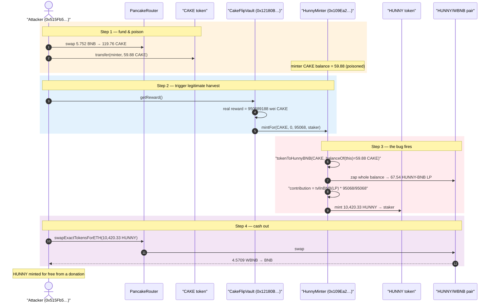
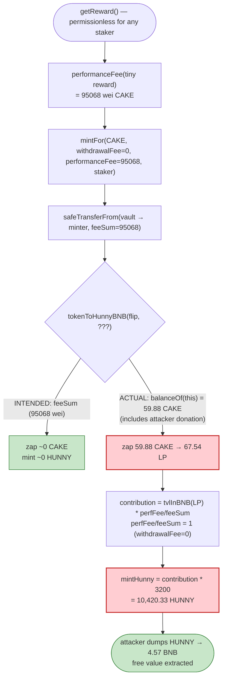
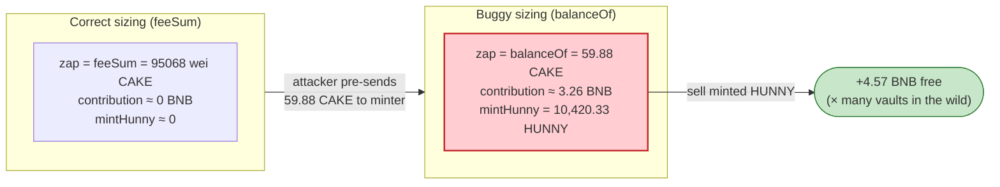

# PancakeHunny Exploit — `mintFor()` Reward Inflation via `balanceOf(this)` Donation

> **Vulnerability classes:** vuln/logic/reward-calculation · vuln/oracle/spot-price

> **Reproduction:** the PoC compiles & runs in an isolated Foundry project at
> [this project folder](.) (the umbrella DeFiHackLabs repo
> contains many unrelated PoCs that do not whole-compile, so this one was extracted).
> Full verbose trace: [output.txt](output.txt).
> Verified vulnerable source: [HunnyMinter.sol](sources/HunnyMinter_109Ea2/HunnyMinter.sol),
> [CakeFlipVault.sol](sources/CakeFlipVault_12180B/CakeFlipVault.sol).

---

## Key info

| | |
|---|---|
| **Loss** | ~**$700K–$1M** drained from PancakeHunny vaults in the live incident (this replay demonstrates the mint-inflation primitive on the CAKE-BNB Hive vault) |
| **Vulnerable contract** | `HunnyMinter` — [`0x109Ea28dbDea5E6ec126FbC8c33845DFe812a300`](https://bscscan.com/address/0x109Ea28dbDea5E6ec126FbC8c33845DFe812a300#code) |
| **Vulnerable function** | `mintFor()` — [HunnyMinter.sol:2965-2981](sources/HunnyMinter_109Ea2/HunnyMinter.sol#L2965-L2981) |
| **Victim vault used in PoC** | `CakeFlipVault` (CAKE-BNB Hive) — [`0x12180BB36DdBce325b3be0c087d61Fce39b8f5A4`](https://bscscan.com/address/0x12180BB36DdBce325b3be0c087d61Fce39b8f5A4#code) |
| **Profit token** | HUNNY — `0x565b72163f17849832A692A3c5928cc502f46D69` |
| **HUNNY/WBNB pair** | `0x36118142F8C21a1F3fd806D4A34F56f51F33504F` |
| **Attacker EOA** | `0x515Fb5a7032CdD688B292086cf23280bEb9E31B6` (the staking account that holds a CakeFlipVault position) |
| **Attacker contract** | `0xb9b0090aaa81f374d66d94a8138d80caa2002950` |
| **Attack tx** | [`0x765de8357994a206bb90af57dcf427f48a2021f2f28ca81f2c00bc3b9842be8e`](https://bscscan.com/tx/0x765de8357994a206bb90af57dcf427f48a2021f2f28ca81f2c00bc3b9842be8e) |
| **Chain / block / date** | BSC / 7,962,338 / June 3, 2021 |
| **Compiler** | Solidity v0.6.12, optimizer 200 runs |
| **Bug class** | Accounting flaw — reward minting derived from `balanceOf(this)` instead of the declared fee amount (donation-poisonable "profit") |

---

## TL;DR

`HunnyMinter.mintFor()` is the routine every PancakeHunny vault calls to (a) zap the harvested
*performance fee* into a HUNNY-BNB LP position for the staking pool and (b) **mint fresh HUNNY** to the
staker proportional to the BNB value of that fee. The amount of HUNNY minted is computed from the
**entire CAKE balance the minter currently holds**, not from the fee the vault actually paid in:

```solidity
uint hunnyBNBAmount = tokenToHunnyBNB(flip, IBEP20(flip).balanceOf(address(this)));  // ⚠️ balanceOf, not feeSum
...
uint contribution = helper.tvlInBNB(flipToken, hunnyBNBAmount).mul(_performanceFee).div(feeSum);
uint mintHunny    = amountHunnyToMint(contribution);   // contribution * 3200 HUNNY/BNB
```
([HunnyMinter.sol:2969-2976](sources/HunnyMinter_109Ea2/HunnyMinter.sol#L2969-L2976))

Because BEP20 tokens can be **transferred to any address by anyone**, the attacker simply sends a large
slug of CAKE directly to the minter contract *before* triggering a harvest. When the vault's
`getReward()` then calls `mintFor(CAKE, 0, performanceFee, ...)` with a tiny real `performanceFee`,
the minter zaps **its whole (donated) CAKE balance** into LP and mints HUNNY as if that entire balance
were protocol profit. The freshly-minted HUNNY is then dumped on PancakeSwap for BNB.

In this replay the attacker turns a **59.88 CAKE donation** (the real performance fee was a microscopic
`95068` wei of CAKE) into **10,420.33 HUNNY** minted to itself, then sells that HUNNY for **4.57 WBNB** —
HUNNY conjured essentially for free. In the live incident this primitive was run at scale against
multiple Hive vaults for a combined ~$700K–$1M loss.

---

## Background — what PancakeHunny does

PancakeHunny is a BSC yield optimizer ("Hive" vaults). Users deposit a LP/asset; the vault stakes it
into the underlying farm (PancakeSwap MasterChef), and on every harvest/withdraw it skims a
**performance fee** (30%) and a **withdrawal fee** (0.5%). Those fees are forwarded to the central
`HunnyMinter`, which:

1. **Zaps** the fee tokens into a HUNNY-BNB LP token and donates that LP to the HUNNY staking pool
   (`notifyRewardAmount`) — this is how stakers' yield is paid.
2. **Mints fresh HUNNY** to the harvesting user as an additional incentive, sized to the BNB value of
   the *performance fee* at the rate `HUNNY_PER_PROFIT_BNB = 3200e18` (3200 HUNNY per BNB of profit,
   [Constants @ HunnyMinter.sol:1435](sources/HunnyMinter_109Ea2/HunnyMinter.sol#L1435)).

Only whitelisted vaults may call the minter (`onlyMinter`,
[HunnyMinter.sol:2868-2871](sources/HunnyMinter_109Ea2/HunnyMinter.sol#L2868-L2871)). The vaults are
trusted; the flaw is that the *amount* minted is computed from a value the attacker can inflate without
going through the vault at all.

Relevant constants at the fork block:

| Parameter | Value |
|---|---|
| `PERFORMANCE_FEE` | 3000 bps = **30%** |
| `FEE_MAX` | 10000 |
| `HUNNY_PER_PROFIT_BNB` | **3200e18** (3200 HUNNY minted per 1 BNB of "profit") |
| `hunnyPerProfitBNB` | 3200e18 |

---

## The vulnerable code

### 1. `mintFor()` sizes the mint from `balanceOf(this)`

```solidity
function mintFor(address flip, uint _withdrawalFee, uint _performanceFee, address to, uint) override external onlyMinter {
    uint feeSum = _performanceFee.add(_withdrawalFee);
    IBEP20(flip).safeTransferFrom(msg.sender, address(this), feeSum);          // pulls the REAL fee (tiny)

    uint hunnyBNBAmount = tokenToHunnyBNB(flip, IBEP20(flip).balanceOf(address(this)));  // ⚠️ ZAPS WHOLE BALANCE
    address flipToken = hunnyBNBFlipToken();
    IBEP20(flipToken).safeTransfer(hunnyPool, hunnyBNBAmount);
    IStakingRewards(hunnyPool).notifyRewardAmount(hunnyBNBAmount);

    uint contribution = helper.tvlInBNB(flipToken, hunnyBNBAmount).mul(_performanceFee).div(feeSum); // ⚠️ value of whole balance
    uint mintHunny = amountHunnyToMint(contribution);
    mint(mintHunny, to);                                                       // ⚠️ mints HUNNY to the staker

    oracle.update();
}
```
([HunnyMinter.sol:2965-2981](sources/HunnyMinter_109Ea2/HunnyMinter.sol#L2965-L2981))

The developer comment in the PoC header even flags it: *"incorrect use balanceOf."*

The intended computation was to zap **only `feeSum`** (the tokens the vault just paid in) and to mint
HUNNY for **only `_performanceFee`** worth of BNB. Instead:

- `tokenToHunnyBNB(flip, balanceOf(this))` converts the **entire** CAKE balance the minter holds — which
  includes any tokens donated to it — into HUNNY-BNB LP.
- `contribution = tvlInBNB(LP-from-whole-balance) * _performanceFee / feeSum`. When the vault passes
  `_withdrawalFee = 0`, then `_performanceFee == feeSum`, so the ratio is **1** and `contribution`
  equals the BNB value of the **entire donated balance**.

### 2. `amountHunnyToMint()` and the mint multiplier

```solidity
function amountHunnyToMint(uint bnbProfit) override view public returns(uint) {
    return bnbProfit.mul(hunnyPerProfitBNB).div(1e18);   // bnbProfit * 3200
}
```
([HunnyMinter.sol:2946-2948](sources/HunnyMinter_109Ea2/HunnyMinter.sol#L2946-L2948))

### 3. `tvlInBNB()` values the LP at full reserve worth

```solidity
function tvlInBNB(address _flip, uint amount) public view returns (uint) {
    ...
    if (_token0 == address(hunny) || _token1 == address(hunny)) {
        uint hunnyBalance = hunny.balanceOf(address(_flip)).mul(amount).div(IBEP20(_flip).totalSupply());
        uint priceInBNB = tokenPriceInBNB(address(hunny));
        return hunnyBalance.mul(priceInBNB).div(1e18).mul(2);   // 2x = both sides of the LP
    }
    ...
}
```
([HunnyMinter.sol:3281-3303](sources/HunnyMinter_109Ea2/HunnyMinter.sol#L3281-L3303))

### 4. How the vault calls it — `getReward()`

```solidity
function getReward() override public nonReentrant updateReward(msg.sender) {
    uint256 reward = rewards[msg.sender];
    if (reward > 0) {
        rewards[msg.sender] = 0;
        uint before = IBEP20(CAKE).balanceOf(address(this));
        rewardsToken.withdraw(reward);
        uint cakeBalance = IBEP20(CAKE).balanceOf(address(this)).sub(before);

        if (address(minter) != address(0) && minter.isMinter(address(this))) {
            uint performanceFee = minter.performanceFee(cakeBalance);          // 30% of a TINY reward
            minter.mintFor(CAKE, 0, performanceFee, msg.sender, depositedAt[msg.sender]);  // ⚠️ _withdrawalFee = 0
            cakeBalance = cakeBalance.sub(performanceFee);
        }

        IBEP20(CAKE).safeTransfer(msg.sender, cakeBalance);
        emit RewardPaid(msg.sender, cakeBalance);
    }
}
```
([CakeFlipVault.sol:1330-1347](sources/CakeFlipVault_12180B/CakeFlipVault.sol#L1330-L1347))

`getReward()` is **permissionless** for any account that holds a vault position, and it forwards
`_withdrawalFee = 0`, which is exactly the case that makes `_performanceFee / feeSum == 1`. The
attacker only needs a dust staking position to have a non-zero `rewards[msg.sender]`.

---

## Root cause — why it was possible

The intended invariant is: *HUNNY minted to a harvester == 3200 × (BNB value of the performance fee the
vault actually paid)*. Two independent decisions break it:

1. **`mintFor` uses `balanceOf(address(this))` instead of `feeSum`.** The minter assumes its CAKE balance
   contains *only* the fee just transferred in. But CAKE is a freely transferable BEP20: anyone can
   `transfer()` tokens straight to the minter. Those donated tokens are silently treated as protocol
   profit. This is a textbook **"`balanceOf` instead of received-amount" donation/poisoning bug**.

2. **The mint amount is derived from the same poisoned quantity.** Because `contribution` is the BNB
   value of the *whole* balance (and `_performanceFee/feeSum == 1` when `_withdrawalFee == 0`), the HUNNY
   minted scales with the donation, not with the real fee. The attacker thus mints `≈ 3200 × tvlInBNB(donation)`
   HUNNY to itself for the cost of the donation alone — and since the donation re-emerges as HUNNY-BNB LP
   + freshly minted HUNNY, the attacker recovers most of it and pockets the inflation.

In short: a value used to size a **mint** is computed from a balance the attacker controls without
authorization. The `onlyMinter` gate on `mintFor` is irrelevant — the attacker never calls `mintFor`
directly; they poison the balance and let the *legitimate* vault path call it for them.

---

## Preconditions

- Attacker holds (or creates) a position in any Hive vault so that `rewards[msg.sender] > 0` and
  `getReward()` reaches the `mintFor` branch. A dust deposit suffices.
- The minter is the current owner of the HUNNY token (so `isMinter` returns true and minting works),
  and `block.timestamp >= 1605585600` — both true in production
  ([isMinter @ HunnyMinter.sol:2935-2944](sources/HunnyMinter_109Ea2/HunnyMinter.sol#L2935-L2944)).
- CAKE to donate to the minter. The donation is largely recovered (it becomes HUNNY-BNB LP + minted
  HUNNY that the attacker dumps), so the attack is effectively self-funding and repeatable per vault.

---

## Attack walkthrough (with on-chain numbers from the trace)

All figures are taken directly from [output.txt](output.txt). The CAKE-BNB Hive vault
`0x12180BB...` is the victim in this replay; the attacker pranks the real staking account
`0x515Fb5a7...` that already holds a position.

| # | Step | On-chain values | Effect |
|---|------|-----------------|--------|
| 0 | **Fund** — `deposit{value: 5.752 BNB}` → WBNB, then swap 5.752 BNB → CAKE | received **119.7619 CAKE** ([:34-46](output.txt)) | Attacker acquires CAKE working capital. |
| 1 | **Donate half the CAKE to the minter** — `cake.transfer(hunnyMinter, 59.880957…)` | **59.880957483227401400 CAKE** sent to `0x109Ea2…` ([:54-59](output.txt)) | Minter's CAKE balance is now poisoned. |
| 2 | **Trigger harvest** — `cakeVault.getReward()` (as `0x515Fb5…`) | real reward withdrawn = `cakeBalance = 950689188` wei CAKE (≈9.5e-10 CAKE) ([:148-149](output.txt)) | Vault computes a *tiny* genuine fee. |
| 3 | **`performanceFee(950689188)` = `95068`** | `0x1735c` = **95068** wei CAKE ([:154-155](output.txt)) | `_performanceFee = feeSum = 95068`. |
| 4 | **Vault calls `mintFor(CAKE, 0, 95068, …)`** — pulls 95068 CAKE, then zaps **whole** minter balance | `balanceOf(minter)` read = **59.880957483227496468 CAKE** ([:167-168](output.txt)) | The entire 59.88 CAKE (donation + fee) is converted to HUNNY-BNB LP. |
| 5 | **Zap** — CAKE→HUNNY + CAKE→WBNB, then `addLiquidity` | LP minted = **67.5425 HUNNY-BNB** (`67542479851940178780`) → sent to hunnyPool ([:311-346](output.txt)) | Whole balance booked as "profit" for the pool. |
| 6 | **Mint** — `contribution = tvlInBNB(LP)·95068/95068`; `mintHunny = contribution·3200` | HUNNY minted to staker = **10,420.334114419164281600 HUNNY** ([:373-380](output.txt)) | HUNNY conjured from the donation's BNB value. |
| 7 | **Harvest dust + dev/lottery mints** | +15% dev mint 1563.05 HUNNY staked to dev ([:385-406](output.txt)); RewardPaid 950594120 wei CAKE to staker ([:418-424](output.txt)) | Side effects of `mint()`. |
| 8 | **Pull HUNNY out & dump** — staker → attacker, `swapExactTokensForETH(10420.33 HUNNY)` | sold for **4.570936969504711308 WBNB** → unwrapped to BNB ([:445-481](output.txt)) | Free BNB extracted from minted HUNNY. |

### The inflation math (step 6)

With `_withdrawalFee = 0`, `feeSum == _performanceFee = 95068`, so the multiplier
`_performanceFee / feeSum == 1`. Thus:

```
contribution  = tvlInBNB(HUNNY-BNB LP minted from 59.88 CAKE) * 95068 / 95068
              = tvlInBNB(whole donated balance)               ≈ BNB value of 59.88 CAKE worth of LP
mintHunny     = contribution * 3200                            = 10,420.33 HUNNY
```

Had the code used `feeSum` (95068 wei CAKE ≈ 9.5e-10 CAKE) as intended, `contribution` would have been
the BNB value of `95068` wei of CAKE — i.e. effectively **zero** HUNNY minted. The bug inflated the mint
by the ratio `donation / fee ≈ 59.88 CAKE / 9.5e-10 CAKE ≈ 6.3 × 10^10`.

### Profit accounting (this replay)

| Item | Amount |
|---|---:|
| Working capital — CAKE bought with 5.752 BNB | 119.76 CAKE |
| Donated to minter (poison) | 59.88 CAKE |
| **HUNNY minted to attacker (free)** | **10,420.33 HUNNY** |
| HUNNY sold for | **4.5709 WBNB** (unwrapped to BNB) |

The 4.57 BNB recovered from selling minted HUNNY is the **net value created out of thin air** by the
mint-inflation primitive in this single vault pass — on top of the donated CAKE largely returning to the
staking pool as LP. In the live incident the attacker repeated this against multiple Hive vaults and
across CAKE/flip tokens, for a combined ~$700K–$1M extracted.

---

## Diagrams

### Sequence of the attack



### State / data-flow of the flaw



### Why the donation poisons the mint



---

## Why each magic number

- **Donation = 59.88 CAKE (exactly half of the 119.76 CAKE bought):** the attacker keeps half as the
  amount it will need to balance the zap/route and donates the other half to the minter. The donation is
  the lever — `mintHunny` scales linearly with `tvlInBNB(donation)`. Larger donations mint proportionally
  more HUNNY (bounded only by HUNNY/WBNB pool depth when dumping).
- **Real reward `950689188` wei CAKE → `performanceFee = 95068`:** these tiny numbers are the *genuine*
  fee. They are irrelevant to the mint amount precisely because the bug ignores them — they only set
  `feeSum`, and since `_withdrawalFee = 0` the ratio `_performanceFee/feeSum` cancels to 1.
- **`× 3200` (`HUNNY_PER_PROFIT_BNB`):** the protocol's mint rate. Every BNB of (poisoned) "contribution"
  becomes 3200 HUNNY. With ~3.26 BNB of poisoned contribution this yields 10,420.33 HUNNY.

---

## Remediation

1. **Never size accounting from `balanceOf(this)`; use the amount actually received.** `mintFor` must zap
   and value **`feeSum`** (the tokens transferred in by the vault), not the contract's full balance:
   ```diff
   - uint hunnyBNBAmount = tokenToHunnyBNB(flip, IBEP20(flip).balanceOf(address(this)));
   + uint hunnyBNBAmount = tokenToHunnyBNB(flip, feeSum);
   ```
   This eliminates the donation lever entirely.
2. **Compute the mint from `_performanceFee` directly,** not from a ratio of the zapped balance:
   `contribution = tvlInBNB(flip, _performanceFee)` (value the fee, then zap), so any stray tokens cannot
   influence the mint.
3. **Sweep / ignore stray balances.** If the minter must hold transient balances, snapshot
   `balanceBefore`/`balanceAfter` around the `safeTransferFrom` and operate on the delta, the canonical
   defense against direct-donation accounting bugs.
4. **Bound the mint.** Cap HUNNY minted per harvest to a sane multiple of the on-chain reward emission, so
   even a mis-sized `contribution` cannot mint orders of magnitude beyond real yield.
5. **Treat freely transferable token balances as untrusted input.** Any `balanceOf(self)` read used in a
   value/price/mint computation is attacker-influenceable and should be audited as such.

---

## How to reproduce

The PoC was extracted into a standalone Foundry project (the umbrella DeFiHackLabs repo does not
whole-compile under `forge test`):

```bash
_shared/run_poc.sh 2021-06-PancakeHunny_exp --mt testExploit -vvvvv
```

- RPC: a **BSC archive** endpoint is required (fork block 7,962,338 is from June 2021). `foundry.toml`
  uses `https://bsc-mainnet.public.blastapi.io`; most pruned public BSC RPCs cannot serve historical
  state at that block and fail with `header not found` / `missing trie node`.
- Result: `[PASS] testExploit()`.

Expected tail (from [output.txt](output.txt)):

```
Ran 1 test for test/PancakeHunny_exp.sol:ContractTest
[PASS] testExploit() (gas: 1079540)
Logs:
  Swap cake, Cake Balance: 119.761914966454802925
  Hunny Balance: 10420.334114419164281600
  Swap WBNB, WBEB Balance: 5.752000000000000000

Suite result: ok. 1 passed; 0 failed; 0 skipped
```

The `Hunny Balance: 10420.33` line is the mint inflation: 10,420 HUNNY minted to the attacker as a
result of a 59.88-CAKE donation whose genuine performance fee was only `95068` wei of CAKE.

---

*Reference: PancakeHunny exploit, BSC, June 2021. The root cause — `mintFor()` deriving the minted
reward from `IBEP20(flip).balanceOf(address(this))` instead of the declared `feeSum` — is the
developer-annotated "incorrect use balanceOf" bug noted in the PoC header.*
