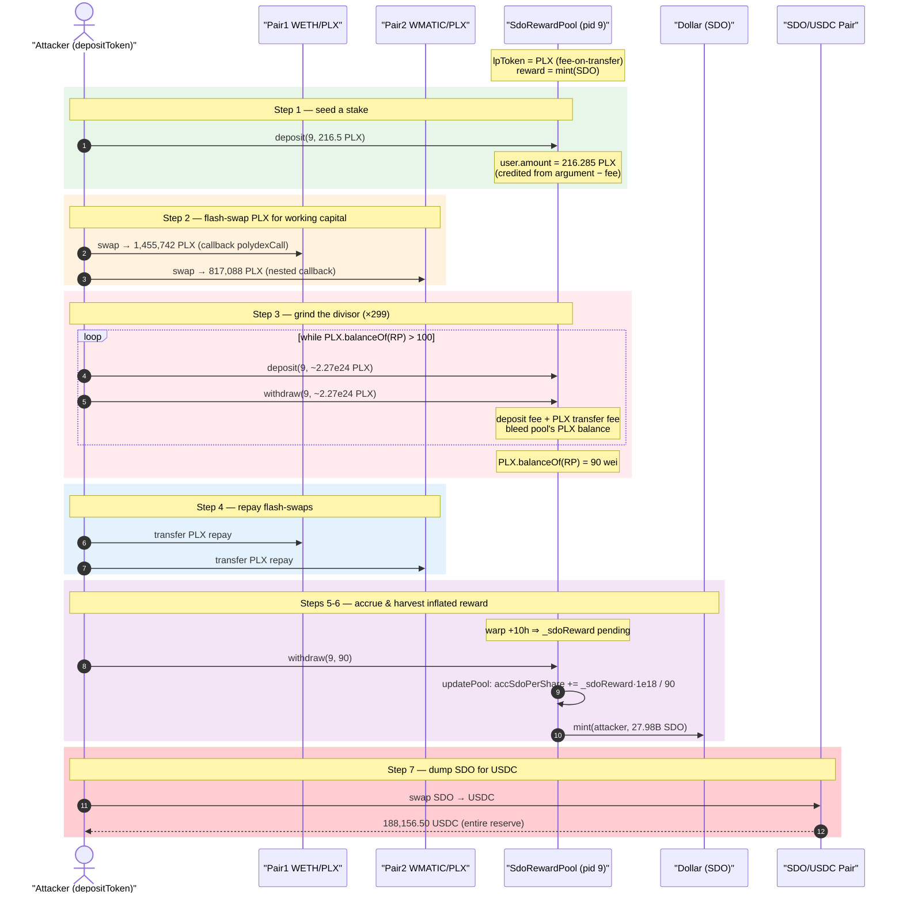
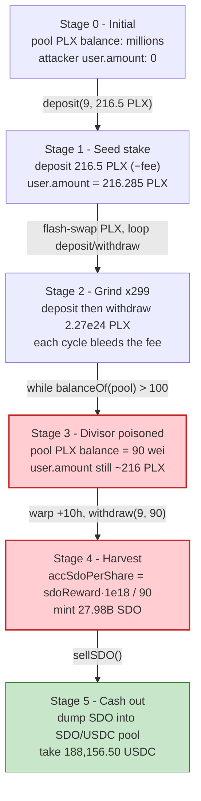
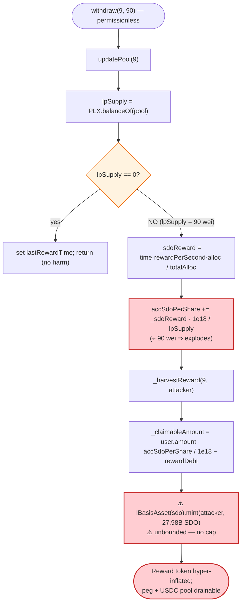

# SafeDollar (SDO) Exploit — MasterChef Reward Inflation via Drained `lpSupply` Divisor

> **Vulnerability classes:** vuln/logic/reward-calculation · vuln/governance/flash-loan-attack

> **Reproduction:** the PoC compiles & runs in an isolated Foundry project at
> [this project folder](.) (the umbrella DeFiHackLabs repo contains many
> unrelated PoCs that do not whole-compile under `forge test`, so this one was extracted).
> Full verbose trace: [output.txt](output.txt).
> Verified vulnerable sources: [SdoRewardPool.sol](sources/SdoRewardPool_17684f/SdoRewardPool.sol)
> and [Dollar.sol](sources/Dollar_86BC05/Dollar.sol).

---

## Key info

| | |
|---|---|
| **Loss** | **188,156.50 USDC** drained from the SDO/USDC pool (≈ the entire stablecoin peg backing). The reward farm minted **27,976,981,173.52 SDO** (`2.797e37` wei) out of thin air to do it. |
| **Vulnerable contract** | `SdoRewardPool` (MasterChef fork) — [`0x17684f4d5385FAc79e75CeafC93f22D90066eD5C`](https://polygonscan.com/address/0x17684f4d5385FAc79e75CeafC93f22D90066eD5C#code) |
| **Minted token** | `Dollar` / SDO — [`0x86BC05a6f65efdaDa08528Ec66603Aef175D967f`](https://polygonscan.com/address/0x86BC05a6f65efdaDa08528Ec66603Aef175D967f#code) (the reward pool is a `minter`) |
| **Victim pool / drained reserve** | SDO/USDC PolyDex pair `0x364A9222b1d9CE64725Cb3FfA32aF3Cf99d5BdE6` (188,156.5 USDC) |
| **Staked LP token (pid 9)** | PLX — `0x7A5dc8A09c831251026302C93A778748dd48b4DF` (a **fee-on-transfer** token) |
| **Attacker contract (test harness)** | `ContractTest` `0x7FA9385bE102ac3EAc297483Dd6233D62b3e1496`; inner `depositToken` clone `0xA9872307bCD06517E6B61901aC7ae67Ab5209511` |
| **Chain / fork block / date** | Polygon / 16,225,172 / **2021-06-28** |
| **Compiler** | SDO & pool: Solidity `v0.6.12+commit.27d51765`, optimizer **999999 runs** |
| **Bug class** | Reward-accounting divisor manipulation — `accRewardPerShare` computed from a **live, externally-shrinkable** `lpToken.balanceOf(pool)` |

---

## TL;DR

`SdoRewardPool` is a SushiSwap-MasterChef fork that **mints** SDO as a farming reward. For each pool it
computes `accSdoPerShare += sdoReward * 1e18 / lpSupply`, where
`lpSupply = pool.lpToken.balanceOf(address(this))`
([SdoRewardPool.sol:743](sources/SdoRewardPool_17684f/SdoRewardPool.sol#L743)). The divisor is the pool's
**current** balance of the staked token, read fresh on every `updatePool`.

The staked token for pid 9 is **PLX**, a *fee-on-transfer* token. The attacker exploits two facts:

1. Pool 9 charges a **deposit fee** (`depositFeeBP`) on entry, and PLX itself burns ~0.05% on every
   transfer. So **depositing then immediately withdrawing the same PLX shrinks the pool's PLX balance**
   each round-trip — the user gets back slightly less than they put in, and the difference leaves the
   pool's balance.
2. `lpSupply` is read from `balanceOf` at reward time, **not** from a tracked accounting variable.

By looping deposit→withdraw 299 times, the attacker grinds the pool's PLX balance from millions of tokens
down to **90 wei** while their own staked `user.amount` stays ~216 PLX. They then let ~10 hours of reward
time accrue and call `withdraw`. `updatePool` now divides a normal SDO emission by **90 wei**, producing a
gargantuan `accSdoPerShare`; `_harvestReward` mints **27.98 billion SDO** to the attacker
([SdoRewardPool.sol:752-755](sources/SdoRewardPool_17684f/SdoRewardPool.sol#L752-L755)).

The attacker dumps that SDO into the SDO/USDC pool and walks away with **188,156.50 USDC** — effectively
all of SDO's stablecoin liquidity. The over-mint also detonates SDO's supply, breaking its $1 peg.

---

## Background — what SdoRewardPool does

`SdoRewardPool` ([source](sources/SdoRewardPool_17684f/SdoRewardPool.sol)) is a textbook MasterChef farm.
SDO is emitted at `rewardPerSecond`, split across pools by `allocPoint`, and **minted** on harvest. The
core accounting is the standard `accRewardPerShare` pattern:

- **`updatePool`** ([:726-746](sources/SdoRewardPool_17684f/SdoRewardPool.sol#L726-L746)) advances a pool's
  accumulator:

  ```solidity
  uint256 lpSupply = pool.lpToken.balanceOf(address(this));          // ← LIVE balance
  ...
  uint256 _sdoReward = _time.mul(rewardPerSecond).mul(pool.allocPoint).div(totalAllocPoint);
  pool.accSdoPerShare = pool.accSdoPerShare.add(_sdoReward.mul(1e18).div(lpSupply));   // ÷ lpSupply
  ```

- **`pendingReward` / `_harvestReward`** then pay
  `user.amount * accSdoPerShare / 1e18 - user.rewardDebt`, **minting** SDO directly
  ([:752-755](sources/SdoRewardPool_17684f/SdoRewardPool.sol#L752-L755)):

  ```solidity
  uint256 _claimableAmount = user.amount.mul(pool.accSdoPerShare).div(1e18).sub(user.rewardDebt);
  if (_claimableAmount > 0) {
      IBasisAsset(sdo).mint(_account, _claimableAmount);            // ← unbounded mint
  }
  ```

- **`deposit`** ([:760-777](sources/SdoRewardPool_17684f/SdoRewardPool.sol#L760-L777)) takes a deposit fee
  in basis points and **credits `user.amount` from the function argument**, not from the actual received
  balance:

  ```solidity
  pool.lpToken.safeTransferFrom(msg.sender, address(this), _amount);
  if (pool.depositFeeBP > 0) {
      uint256 _depositFee = _amount.mul(pool.depositFeeBP).div(10000);
      pool.lpToken.safeTransfer(reserveFund, _depositFee);
      user.amount = user.amount.add(_amount).sub(_depositFee);
  }
  ```

The token being mined in pid 9 is **PLX**, which is *fee-on-transfer*. That is the linchpin: every PLX
movement into or out of the pool loses a little PLX, so the pool's `balanceOf` (the reward divisor) can be
driven arbitrarily low by an attacker who churns deposits and withdrawals — without ever losing meaningful
principal, because the per-round-trip loss is tiny.

On-chain parameters relevant at the fork block (read from the trace):

| Parameter | Value (from trace) |
|---|---|
| Mined LP token for pid 9 | PLX `0x7A5dc8…b4DF` (fee-on-transfer, ~0.05% per transfer) |
| Pool 9 `depositFeeBP` | ~2 bps observed effective loss (`fee = 0.0002 × amount`, e.g. `0.0433 PLX` on a `216.5 PLX` deposit) |
| Deposit-fee recipient (`reserveFund`) | `0xbfE6eE591D07829aEF24b519719F9031128d840E` |
| Pool PLX balance **before** the grind | millions of PLX (full pool) |
| Pool PLX balance **after** 299 round-trips | **90 wei** ([output.txt:20205](output.txt)) |
| Attacker tracked `user.amount` (pid 9) | **216.50 PLX** (`0x…bbc908b1709f435f4`) |
| Reward time accrued before harvest | ~10.07 h (`vm.warp` from `1624832516` → `1624868767`) |
| SDO minted on the harvest withdraw | **27,976,981,173.52 SDO** (`2.797e37` wei) |

---

## The vulnerable code

### 1. The reward divisor is a live, attacker-shrinkable balance

[SdoRewardPool.sol:726-746](sources/SdoRewardPool_17684f/SdoRewardPool.sol#L726-L746):

```solidity
function updatePool(uint256 _pid) public {
    PoolInfo storage pool = poolInfo[_pid];
    if (now <= pool.lastRewardTime) return;
    uint256 lpSupply = pool.lpToken.balanceOf(address(this));     // ⚠️ external, manipulable
    if (lpSupply == 0) { pool.lastRewardTime = now; return; }     // only guards == 0, not "tiny"
    ...
    if (totalAllocPoint > 0) {
        uint256 _time = now.sub(pool.lastRewardTime);
        uint256 _sdoReward = _time.mul(rewardPerSecond).mul(pool.allocPoint).div(totalAllocPoint);
        pool.accSdoPerShare = pool.accSdoPerShare.add(_sdoReward.mul(1e18).div(lpSupply));   // ÷ tiny
    }
    pool.lastRewardTime = now;
}
```

When `lpSupply` is 90 wei but `user.amount` is 216.5e18, the term `_sdoReward * 1e18 / lpSupply` explodes by
roughly `1e18 / 90 ≈ 1.1e16×` relative to a healthy pool, and `user.amount * accSdoPerShare / 1e18` then
mints SDO proportional to a stake that is ~`2.4e21×` larger than the divisor.

### 2. The reward is an *unbounded mint*, so there is no cap

[SdoRewardPool.sol:748-758](sources/SdoRewardPool_17684f/SdoRewardPool.sol#L748-L758):

```solidity
function _harvestReward(uint256 _pid, address _account) internal {
    UserInfo storage user = userInfo[_pid][_account];
    if (user.amount > 0) {
        PoolInfo storage pool = poolInfo[_pid];
        uint256 _claimableAmount = user.amount.mul(pool.accSdoPerShare).div(1e18).sub(user.rewardDebt);
        if (_claimableAmount > 0) {
            IBasisAsset(sdo).mint(_account, _claimableAmount);     // ⚠️ no per-pool / global cap
            emit RewardPaid(_account, _pid, _claimableAmount);
        }
    }
}
```

The pool is a registered `minter` on the SDO token (`Dollar.mint` is `onlyMinter`,
[Dollar.sol:1592-1598](sources/Dollar_86BC05/Dollar.sol#L1592-L1598)), so a corrupted `accSdoPerShare`
translates one-to-one into freshly minted SDO with no upper bound.

### 3. `deposit` credits the *argument*, while the pool's balance bleeds the fee

[SdoRewardPool.sol:760-777](sources/SdoRewardPool_17684f/SdoRewardPool.sol#L760-L777):

```solidity
pool.lpToken.safeTransferFrom(msg.sender, address(this), _amount);
if (pool.depositFeeBP > 0) {
    uint256 _depositFee = _amount.mul(pool.depositFeeBP).div(10000);
    pool.lpToken.safeTransfer(reserveFund, _depositFee);   // ← pool's PLX balance drops by the fee
    user.amount = user.amount.add(_amount).sub(_depositFee);
}
```

Because PLX is fee-on-transfer **and** the pool charges a deposit fee, each `deposit(amount)` followed by
`withdraw(amount)` returns slightly less PLX than entered and forwards the deposit fee to `reserveFund` —
both effects permanently remove PLX from the pool's `balanceOf`. There is no `lpSupply == 0` floor that
helps here: the grind stops at 90 wei (`> 0`), which is exactly where the divisor is most dangerous.

---

## Root cause — why it was possible

The pool measures "total shares" using `lpToken.balanceOf(address(this))` — an **externally controllable
quantity** — instead of an internally tracked `totalDeposited` accumulator. Three design facts compose into
a critical mint:

1. **Live-balance divisor.** `accSdoPerShare` is normalized by `balanceOf(pool)` read fresh in
   `updatePool`. Any actor who can move the pool's token balance can move the divisor.
2. **Fee-on-transfer staked token + deposit fee = a free balance grinder.** PLX loses tokens on every
   transfer, and the pool skims a deposit fee, so repeated deposit→withdraw cycles drain the pool's PLX
   while the attacker's recorded `user.amount` (set from the *argument*) barely moves. The attacker drives
   the divisor to 90 wei for negligible cost.
3. **Unbounded reward mint.** The reward is minted, not paid from a finite balance, so a corrupted
   per-share rate produces an effectively infinite payout. `_harvestReward` has no global/per-block cap and
   no sanity check that `_claimableAmount` is plausible relative to emissions.

Note the asymmetry that makes the attack profitable: `user.amount` is credited from the **function input
amount** minus the fee, but `lpSupply` is the **real post-fee balance**. Over many cycles these two
diverge — the attacker's recorded stake stays high while the divisor collapses — which is precisely the
inflation lever.

---

## Preconditions

- A pool whose staked token is **fee-on-transfer** (PLX) **and/or** charges a `depositFeeBP`, so that
  repeated deposit/withdraw monotonically shrinks `balanceOf(pool)`. Both are true for pid 9.
- The reward pool is a **minter** of the reward token (SDO), so inflated rewards are real minted supply.
- Non-zero `rewardPerSecond` and a non-trivial elapsed time so a normal `_sdoReward` is non-zero; the
  attack amplifies that emission by the tiny divisor. The PoC warps ~10 h to accrue rewards.
- Working capital in PLX to perform the grind. The PoC sources it with two PolyDex flash-swaps
  (`Pair1` WETH/PLX, `Pair2` WMATIC/PLX) so the operation is effectively **flash-loanable** and self-funded.

---

## Attack walkthrough (with on-chain numbers from the trace)

All figures are taken directly from [output.txt](output.txt). The attacker logic lives in
`ContractTest.testExploit` / `polydexCall` and the inner `depositToken` clone
([test/SafeDollar_exp.sol](test/SafeDollar_exp.sol)).

| # | Step | Concrete values (from trace) | Effect |
|---|------|------------------------------|--------|
| 0 | **Fork & fund.** Wrap 10,000 MATIC → WMATIC; read pair reserves. | Pair1 WETH/PLX reserves `1.455e24 PLX / 3.771 WETH`; Pair2 WMATIC/PLX `3,762 WMATIC / 8.17e23 PLX` | Setup. |
| 1 | **Seed a stake.** `depositToken` swaps 1 MATIC→PLX and `deposit(9, 216.50 PLX)`. | Deposit fee `0.0433 PLX` → tracked `user.amount = 216.285 PLX` ([output.txt:120-145](output.txt)) | Attacker now has a small recorded stake in pid 9. |
| 2 | **Flash-swap PLX out of both pairs.** `Pair1.swap` for `1,455,742.5 PLX`; inside `polydexCall`, `Pair2.swap` for `817,088.8 PLX`. | Attacker temporarily holds ~2.27M PLX | Working capital for the grind, to be repaid in the callback. |
| 3 | **Grind the divisor.** In `polydexCall` (Pair2 branch) loop `while (PLX.balanceOf(pool) > 100)`: `deposit(9, ~2.27e24)` then `withdraw(9, ~2.27e24)`, **299 times**. | Each cycle bleeds the deposit fee + PLX transfer fee out of the pool. Pool PLX falls from millions → **90 wei** ([output.txt:20205](output.txt)) | `lpSupply` (the reward divisor) is now 90 wei. |
| 4 | **Repay flash-swaps.** Transfer PLX back to Pair1/Pair2 (`amounts1 * 1000/995 + 1e18`, etc.). | Pairs made whole | Capital returned; grind cost is only the cumulative fees. |
| 5 | **Accrue rewards.** `vm.warp(+~10 h)` → `now = 1624868767`. | — | A normal `_sdoReward` is now pending, ready to be divided by 90 wei. |
| 6 | **Harvest the inflated reward.** `depositToken.withdrawPLX()` → `withdraw(9, 90)`. `updatePool` computes `accSdoPerShare` ÷ 90; `_harvestReward` mints to attacker. | `pendingReward` returns **2.797e37 SDO**; `Dollar.mint(depositToken, 27,976,981,173.52 SDO)` ([output.txt:20219-20222](output.txt)) | **27.98 billion SDO minted from nothing.** |
| 7 | **Dump SDO → USDC.** `sellSDO()` swaps `20,000,000,000,000e18` SDO (capped request) into the SDO/USDC pair `0x364A9222…`. | Pair held `188,156.5 USDC / 179,141 SDO`; swap returns **188,156,498,821** USDC units = **188,156.50 USDC** ([output.txt:20305-20318](output.txt)) | Pool USDC reserve emptied; attacker receives all of it. |

### Why "90 wei divisor" is catastrophic

A healthy pool with millions of PLX staked would mint `_sdoReward × user.amount / lpSupply` — a few SDO.
With `lpSupply = 90` wei and `user.amount ≈ 216.5e18`, the multiplier `user.amount / lpSupply ≈ 2.4e18`
turns a routine emission into **~28 billion SDO**. The `lpSupply == 0` early-return in `updatePool` does
**not** protect against this — the attack deliberately stops the grind at a tiny but non-zero balance
(`while (... > 100)`), keeping the pool "alive" so `updatePool` runs with the poisoned divisor.

---

## Profit / loss accounting

| Quantity | Value |
|---|---:|
| SDO minted by the corrupted reward (`Dollar.mint`) | **27,976,981,173.52 SDO** (`2.797e37` wei) |
| SDO the attacker actually needed to dump | a fraction of the mint (swap capped at the request size) |
| USDC extracted from the SDO/USDC pool | **188,156.498821 USDC** |
| PLX principal lost in the grind | only cumulative deposit + transfer fees (≈ negligible vs. payout) |
| Flash-swapped PLX | fully repaid in `polydexCall` |
| **Net attacker gain** | **≈ 188,156.50 USDC + 27.98B residual SDO** |

The SDO/USDC pool's entire USDC reserve (188,156.50 USDC) is the realized loss. Beyond that, minting
27.98 **billion** SDO against a token whose intended total supply was ~500k SDO
([Dollar.sol:1502](sources/Dollar_86BC05/Dollar.sol#L1502), `_mint(msg.sender, 500001 ether)`) annihilates
the SDO peg — a ~56,000× supply inflation.

Both PoC assertions confirm the outcome ([output.txt:6-7](output.txt)):

```
Attacker SDO profit after exploit:  27976981173522801436.089430834669358223   (×1e9 = 27.98B SDO)
Attacker USDC profit after exploit: 188156.498821
```

---

## Diagrams

### Sequence of the attack



### Pool-PLX-balance vs. reward-divisor evolution



### The flaw inside `updatePool` / `_harvestReward`



---

## Why each magic number

- **`deposit(9, 216.5 PLX)` seed:** establishes a non-trivial `user.amount` so that, after the divisor is
  poisoned, `user.amount × accSdoPerShare` is enormous. The exact size is unimportant — only that it stays
  large relative to the 90-wei divisor.
- **`while (PLX.balanceOf(pool) > 100)`:** the grind loop's exit condition. It stops just above zero so
  `updatePool` does **not** hit the `lpSupply == 0` early-return; the pool ends at **90 wei**, the most
  dangerous possible non-zero divisor.
- **299 iterations:** the number of deposit→withdraw round-trips required to bleed the pool from its full
  PLX balance down to ≤ 100 wei, given the per-cycle fee loss. (`deposit(9,…)` and `withdraw(9,…)` each
  appear 299 times in the trace, plus the single seed deposit and final harvest withdraw.)
- **`vm.warp(+~10 h)`:** advances `now` so `_time = now - lastRewardTime` yields a non-zero `_sdoReward`.
  The longer the window, the larger the base emission that gets amplified by the tiny divisor.
- **`sellSDO()` request `20,000,000,000,000e18`:** an intentionally oversized swap input so the AMM returns
  the **entire** USDC reserve of the SDO/USDC pair (188,156.50 USDC) regardless of exact SDO held.

---

## Remediation

1. **Track shares internally; never use `lpToken.balanceOf(this)` as the reward divisor.** Maintain a
   `pool.totalStaked` accumulator updated in `deposit`/`withdraw`, and normalize `accRewardPerShare` by
   that variable. This removes the attacker's ability to move the divisor at all.
2. **Use received-amount accounting for fee-on-transfer tokens.** Credit `user.amount` (and
   `totalStaked`) with `balanceAfter - balanceBefore` of the actual `safeTransferFrom`, not the
   `_amount` argument. This closes the gap between recorded stake and real balance.
3. **Disallow or specially handle fee-on-transfer / rebasing staked tokens.** If such tokens must be
   supported, the divisor and per-user shares must both be derived from real measured deltas, not balances
   or arguments.
4. **Bound the reward mint.** Cap `_claimableAmount` per harvest to a sane fraction of total emissions
   (e.g., `<= _sdoReward` accrued for that pool since the last update), and revert on absurd values. An
   unbounded `mint` driven by a single `div` is a critical amplifier.
5. **Add a sanity floor on `lpSupply`.** Treat a `lpSupply` far below `pool.totalStaked` (i.e., balance
   was siphoned out) as an anomaly and refuse to update `accRewardPerShare`, rather than only checking
   `== 0`.

---

## How to reproduce

The PoC was extracted into a standalone Foundry project (the umbrella DeFiHackLabs repo has many unrelated
PoCs that fail to compile under `forge test`'s whole-project build):

```bash
_shared/run_poc.sh 2021-06-SafeDollar_exp --mt testExploit -vvvvv
```

- RPC: a **Polygon archive** endpoint is required (fork block 16,225,172 is from June 2021).
  `foundry.toml` points `polygon` at an Infura endpoint; most pruned public RPCs will fail with
  `header not found` / `missing trie node` at that height.
- Result: `[PASS] testExploit()` with both profit logs.

Expected tail:

```
Ran 1 test for test/SafeDollar_exp.sol:ContractTest
[PASS] testExploit() (gas: 40362546)
Logs:
  Attacker SDO profit after exploit: 27976981173522801436.089430834669358223
  Attacker USDC profit after exploit: 188156.498821

Suite result: ok. 1 passed; 0 failed; 0 skipped
```

---

*Reference: SafeDollar (SDO) reward-pool exploit, Polygon, June 2021 — SlowMist / Rekt class
"share-inflation via manipulable `lpSupply`". The fee-on-transfer staked token (PLX) plus a deposit fee let
the attacker grind the reward divisor to 90 wei and mint ~28 billion SDO, draining the SDO/USDC pool of
~$188K USDC.*
