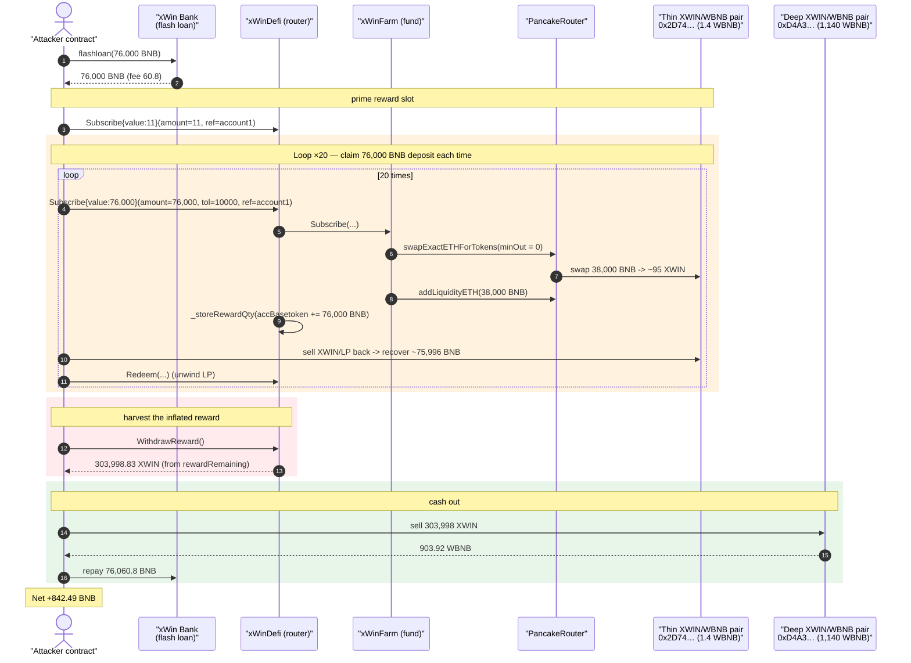
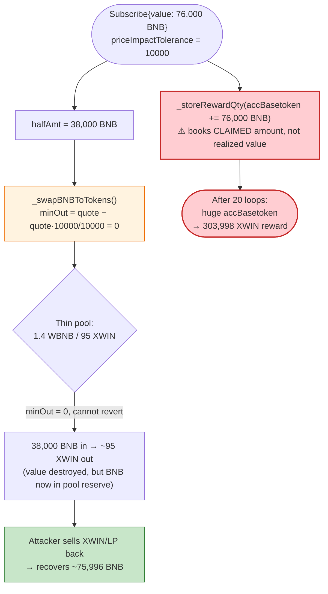
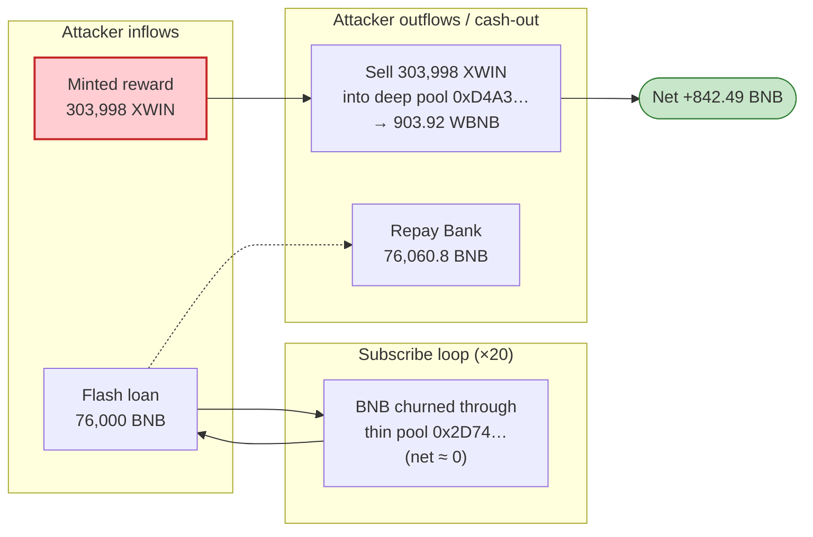

# xWin Finance Exploit — Disabled Slippage Control + `_tradeParams.amount`-Based Reward Inflation

> **Vulnerability classes:** vuln/defi/slippage · vuln/logic/reward-calculation · vuln/governance/flash-loan-attack

> **Reproduction:** the PoC compiles & runs in an isolated Foundry project at
> [this project folder](.) (the umbrella DeFiHackLabs repo does not whole-compile, so this PoC
> was extracted into a standalone project).
> Full verbose trace: [output.txt](output.txt).
> Verified vulnerable sources: [xWinDefi.sol](sources/xWinDefi_1Bf7fe/xWinDefi.sol) and
> the fund vault [xWinFarmVaultSingleFile.sol](sources/xWinFarm_8f52e0/xWinFarm.sol).

---

## Key info

| | |
|---|---|
| **Loss** | **842.49 BNB** of net profit to the attacker (≈ $176K at the June-2021 BNB price), funded by a 76,000 BNB flash loan; the protocol minted **303,998.83 XWIN** out of thin air to the attacker |
| **Vulnerable contracts** | `xWinDefi` protocol — [`0x1Bf7fe7568211ecfF68B6bC7CCAd31eCd8fe8092`](https://bscscan.com/address/0x1Bf7fe7568211ecfF68B6bC7CCAd31eCd8fe8092#code) ; `xWinFarm` fund — [`0x8f52e0C41164169818C1FB04B263FDC7c1e56088`](https://bscscan.com/address/0x8f52e0C41164169818C1FB04B263FDC7c1e56088#code) |
| **Victim pools** | XWIN/WBNB pair (thin) — `0x2D74b7DbF2835aCadd8d4eF75B841c01E1a68383` ; XWIN/WBNB pair (deep, where reward is cashed out) — `0xD4A3Dcf47887636B19eD1b54AAb722Bd620e5fb4` |
| **XWIN token** | [`0xd88ca08d8eec1E9E09562213Ae83A7853ebB5d28`](https://bscscan.com/address/0xd88ca08d8eec1E9E09562213Ae83A7853ebB5d28#code) |
| **Attacker EOA** | `0xb63f0d8b9aa0c4e68d5630f54bfefc6cf2c2ad19` |
| **Attacker contract** | `0x67d3737c410f4d206012cad5cb41b2e155061945` |
| **Attack tx** | [`0xba0fa8c150b2408eec9bbbbfe63f9ca63e99f3ff53ac46ee08d691883ac05c1d`](https://bscscan.com/tx/0xba0fa8c150b2408eec9bbbbfe63f9ca63e99f3ff53ac46ee08d691883ac05c1d) |
| **Flash-loan source** | xWin's own `Bank` (AdminUpgradeabilityProxy) — `0x0cEA0832e9cdBb5D476040D58Ea07ecfbeBB7672` (fee 8 bps = 60.8 BNB on 76,000 BNB) |
| **Chain / block / date** | BSC / fork at **8,589,725** / June 2021 |
| **Compiler** | Solidity **v0.6.12** (`xWinDefi`, `xWinFarm`), optimizer on |
| **Bug class** | Disabled slippage protection (`priceImpactTolerance = 10000` ⇒ `minOut = 0`) **chained with** reward accounting that credits the *claimed* deposit amount instead of the *realized* deposit value |
| **Reference** | PeckShield root-cause analysis — https://peckshield.medium.com/xwin-finance-incident-root-cause-analysis-71d0820e6bc1 |

---

## TL;DR

xWin pays an `XWIN`-token farming reward proportional to how much BNB a user deposits ("subscribes"
to a fund). The reward is booked against **`_tradeParams.amount`** — the BNB figure the *caller* says
they are depositing — at
[`xWinDefi.sol:1064`](sources/xWinDefi_1Bf7fe/xWinDefi.sol#L1064):

```solidity
_storeRewardQty(msg.sender, _tradeParams.amount, mintQty);
```

The fund's deposit path, `xWinFarm.Subscribe`, swaps half of the BNB into the fund's `farmToken`
(XWIN) and the other half into LP. That swap is supposed to be slippage-protected — but the minimum
output is computed as `quote − quote·priceImpactTolerance/10000`. The attacker passes
**`priceImpactTolerance = 10000`**, so the floor is `quote − quote = 0`
([`xWinFarm…:747`](sources/xWinFarm_8f52e0/xWinFarm.sol#L747)). The swap therefore **cannot revert no
matter how bad the price is.**

The attacker pushes ~76,000 BNB through a deliberately-thin XWIN/WBNB pool (only **1.4 WBNB / 95
XWIN** of liquidity). The swap returns a trivial amount of XWIN, but — crucially — the BNB they spent
is now sitting as that pool's WBNB reserve, so they immediately buy it back. Each loop is roughly
capital-neutral in BNB **yet credits the attacker with a 76,000-BNB "deposit" for reward purposes.**

After 20 loops the protocol's reward formula has accumulated a gigantic `accBasetoken`, and a single
`WithdrawReward()` mints the attacker **303,998.83 XWIN**
([output.txt:8173](output.txt)). They sell that XWIN into a *different,
deeper* XWIN/WBNB pool for **903.92 WBNB**, repay the flash loan (76,000 + 60.8 fee), and walk away
with **842.49 BNB** of pure profit.

---

## Background — how xWin farming rewards work

`xWinDefi` is the protocol router; `xWinFarm` is an individual fund/vault. A user "subscribes" by
sending BNB through `xWinDefi.Subscribe`, which forwards the BNB to the fund's own `Subscribe`, mints
fund LP units to the user, and — separately — books an `XWIN` farming reward.

The reward bookkeeping ([`xWinDefi.sol:1050-1068`](sources/xWinDefi_1Bf7fe/xWinDefi.sol#L1050-L1068)):

```solidity
function Subscribe(xWinLib.TradeParams memory _tradeParams) public nonReentrant onlyNonEmergency payable {
    require(isxwinFund[_tradeParams.xFundAddress] == true, "not xwin fund");
    ...
    TransferHelper.safeTransferBNB(_tradeParams.xFundAddress, _tradeParams.amount); // forward BNB to fund
    uint256 mintQty = _xWinFund.Subscribe(_tradeParams, msg.sender);

    if(rewardRemaining > 0){
        _storeRewardQty(msg.sender, _tradeParams.amount, mintQty);   // ⚠️ reward keyed on CLAIMED amount
        _updateReferralReward(_tradeParams, _xWinFund.getWhoIsManager());
    }
    emit _Subscribe(msg.sender, _tradeParams.xFundAddress, _tradeParams.amount, mintQty);
}
```

`_storeRewardQty` accumulates the claimed BNB amount into `accBasetoken`
([`xWinDefi.sol:1276-1293`](sources/xWinDefi_1Bf7fe/xWinDefi.sol#L1276-L1293)):

```solidity
function _storeRewardQty(address from, uint256 baseQty, uint256 mintQty) internal {
    xWinLib.xWinReward storage _xwinReward = xWinRewards[from];
    if(_xwinReward.blockstart == 0){
        _xwinReward.blockstart  = block.number;
        _xwinReward.accBasetoken = baseQty;          // baseQty == _tradeParams.amount
        _xwinReward.accMinttoken = mintQty;
        ...
    } else {
        uint blockdiff = block.number.sub(_xwinReward.blockstart);
        uint256 currentRealizedQty = _multiplier(_xwinReward.blockstart)
            .mul(rewardperuint).mul(blockdiff).mul(_xwinReward.accBasetoken).div(1e18).div(10000);
        _xwinReward.blockstart   = block.number;
        _xwinReward.accBasetoken = baseQty.add(_xwinReward.accBasetoken);   // ⚠️ accumulates claimed amount
        ...
    }
}
```

And the reward is realized in `GetEstimateReward`
([`xWinDefi.sol:1198-1206`](sources/xWinDefi_1Bf7fe/xWinDefi.sol#L1198-L1206)):

```solidity
function GetEstimateReward(address fromAddress) public view returns (uint256) {
    xWinLib.xWinReward memory _xwinReward = xWinRewards[fromAddress];
    if(_xwinReward.blockstart == 0) return 0;
    uint blockdiff = block.number.sub(_xwinReward.blockstart);
    uint256 currentRealizedQty = _multiplier(_xwinReward.blockstart)
        .mul(rewardperuint).mul(blockdiff)
        .mul(_xwinReward.accBasetoken).div(1e18).div(10000);   // ∝ accBasetoken
    uint256 allRealizedQty = currentRealizedQty.add(_xwinReward.previousRealizedQty);
    return (rewardRemaining >= allRealizedQty) ? allRealizedQty : rewardRemaining;
}
```

`WithdrawReward()` then transfers `XWIN` straight out of the protocol's reward pool
([`xWinDefi.sol:1261-1274`](sources/xWinDefi_1Bf7fe/xWinDefi.sol#L1261-L1274) →
`_sendRewards` [`:1325-1339`](sources/xWinDefi_1Bf7fe/xWinDefi.sol#L1325-L1339)). At the fork block
`rewardRemaining` was ≈ **6.0e25** (60M XWIN), so the 303,998 XWIN payout was easily covered.

The whole edifice trusts that `accBasetoken` reflects *actual economic value deposited*. It does not —
it reflects whatever number the caller put in `_tradeParams.amount`, and the fund's `Subscribe` does
nothing to verify that this BNB was deployed at a fair price.

---

## The vulnerable code

### 1. Slippage protection that can be disabled by the caller

`xWinFarm.Subscribe` swaps half of the deposit into the farm token via `_swapBNBToTokens`
([`xWinFarm…:732-750`](sources/xWinFarm_8f52e0/xWinFarm.sol#L732-L750)):

```solidity
function _swapBNBToTokens(address toDest, uint amountIn, uint deadline, address destAddress, uint priceImpactTolerance)
    internal returns (uint) {
    address[] memory path = new address[](2);
    path[0] = pancakeSwapRouter.WETH();
    path[1] = toDest;

    (uint reserveA, uint reserveB) = PancakeLibrary.getReserves(pancakeSwapRouter.factory(), pancakeSwapRouter.WETH(), farmToken);
    uint quote = PancakeLibrary.quote(amountIn, reserveA, reserveB);
    uint[] memory amounts = pancakeSwapRouter.swapExactETHForTokens{value: amountIn}(
        quote.sub(quote.mul(priceImpactTolerance).div(10000)),   // ⚠️ minOut = quote·(1 − tol/10000)
        path, destAddress, deadline);
    return amounts[amounts.length - 1];
}
```

`priceImpactTolerance` is denominated in basis points out of `10000`. The function does **not** bound
it. When the caller supplies `priceImpactTolerance = 10000`, the minimum-output term becomes
`quote − quote·10000/10000 = quote − quote = 0`. The swap is sent to PancakeSwap with `amountOutMin = 0`
and is therefore **immune to any slippage / sandwich / thin-pool loss** — exactly the protection it was
meant to provide.

The same defect is present in the redeem direction, `_swapTokenToBNB`
([`xWinFarm…:752-772`](sources/xWinFarm_8f52e0/xWinFarm.sol#L752-L772)).

### 2. The deposit path mints reward on the claimed amount, not the realized value

`xWinFarm.Subscribe` ([`xWinFarm…:888-912`](sources/xWinFarm_8f52e0/xWinFarm.sol#L888-L912)):

```solidity
function Subscribe(TradeParams memory _tradeParams, address _investorAddress)
    external onlyxWinProtocol payable returns (uint256) {
    uint256 halfAmt   = _tradeParams.amount.mul(5000).div(10000);
    uint256 swapOutput = _swapBNBToTokens(farmToken, halfAmt, _tradeParams.deadline, address(this), _tradeParams.priceImpactTolerance);
    uint amountBToGo  = _getQuoteAdjusted(halfAmt, swapOutput);
    (uint amountToken, uint amountBNB, uint liquidity) = _addLiquidityBNB(amountBToGo, halfAmt, _tradeParams.deadline);
    mint(_investorAddress, liquidity);
    if(performFarm) _addToPancakeFarm(liquidity);
    // refund leftovers
    if(_tradeParams.amount.sub(amountBNB).sub(halfAmt) > 0) TransferHelper.safeTransferBNB(_investorAddress, ...);
    if(swapOutput.sub(amountToken) > 0) TransferHelper.safeTransfer(farmToken, _investorAddress, ...);
    return liquidity;
}
```

The fund only mints `liquidity` (the LP units actually created), but the **protocol** books reward
against `_tradeParams.amount` regardless. The two numbers diverge massively when the swap executes at a
catastrophic price into a thin pool, which is precisely the condition the attacker engineers.

---

## Root cause — why it was possible

Two independent flaws compose into the exploit:

1. **Caller-controlled, unbounded slippage tolerance.** `priceImpactTolerance` is supposed to express
   "I accept at most X bps of price impact," but it is interpreted as a *direct discount on the
   minimum output*. Passing `10000` sets `minOut = 0`, fully disabling slippage protection. There is no
   upper-bound check (e.g. `require(priceImpactTolerance <= 1000)`), so a malicious caller can always
   neutralize the guard.

2. **Reward credited on the *claimed* deposit, not the *realized* one.** `_storeRewardQty` accrues
   `accBasetoken += _tradeParams.amount`. Because `minOut = 0` lets the half-swap burn value into a thin
   pool while the on-paper "deposit amount" stays at 76,000 BNB, the attacker can claim reward for
   value they never actually contributed to the fund.

The attacker glues these together with a thin XWIN/WBNB pool that they themselves feed and drain:

> Because `minOut = 0`, pushing 38,000 BNB into the 1.4-WBNB pool does not revert. The 38,000 BNB the
> swap deposits, plus the 38,000 BNB added as the other half of liquidity, become that pool's WBNB
> reserve — which the attacker then buys back by selling the tiny amount of XWIN/LP they received.
> The round trip is ~BNB-neutral, but each iteration tells the protocol "I just deposited 76,000 BNB,"
> inflating `accBasetoken` until the reward formula mints hundreds of thousands of XWIN.

Finally, the cash-out is itself enabled by xWin's own infrastructure: the **flash loan comes from
xWin's `Bank`** (`0x0cEA08…`), and the inflated XWIN is dumped into a *second*, deeper XWIN/WBNB pool
(`0xD4A3…`) that holds real WBNB liquidity.

---

## Preconditions

- `rewardRemaining > 0` in `xWinDefi` (≈ 60M XWIN available at the fork block ✓).
- A fund (`xWinFarm`) registered via `isxwinFund[...] == true` whose `farmToken` trades in a **thin**
  PancakeSwap pool (the XWIN/WBNB pair `0x2D74…` held only ~1.4 WBNB / ~95 XWIN).
- The ability to pass `priceImpactTolerance = 10000` to `Subscribe`/`Redeem` (no bound enforced).
- Working BNB capital to run the loop, fully recovered intra-transaction → **flash-loanable**. The PoC
  borrows 76,000 BNB from xWin's own `Bank` at an 8-bps fee (60.8 BNB).

---

## Attack walkthrough (with on-chain numbers from the trace)

All figures are taken from the `Sync` / `getReserves` events and call arguments in
[output.txt](output.txt). On the thin pair `0x2D74…`, `token0 = WBNB`,
`token1 = XWIN`.

| # | Step | Trace evidence | Effect |
|---|------|----------------|--------|
| 0 | **Flash loan 76,000 BNB** from xWin `Bank` (fee 60.8 BNB) | [output.txt:1601](output.txt) | Attacker holds 76,000 BNB, 0 of its own. |
| 1 | **Prime reward record** — `account1.subscribe()` calls `Subscribe{value: 11}` with `amount: 11` so `xWinRewards[account1].blockstart` is set | `_Subscribe(account1, fund, amt=11, mint=32)` [output.txt:1740](output.txt) | First reward slot initialized. |
| 2 | **Loop ×20** — for each iteration call `Subscribe{value: bnbBalance}` with `amount: bnbBalance ≈ 76,000 BNB`, `priceImpactTolerance: 10000`, `referral: account1` | `_Subscribe(attacker, fund, amt=7.599e22, mint≈1.13e19)` [output.txt:1863](output.txt) | Each loop credits `accBasetoken += ~76,000 BNB`. |
| 2a | Inside each `Subscribe`: `_swapBNBToTokens` swaps 38,000 BNB with **minOut = 0** into the 1.4-WBNB pool | `swapExactETHForTokens{value: 3.8e22}(0, …)` [output.txt:1760](output.txt) → `Sync(reserve0=3.8e22 WBNB, reserve1=3.524e15 XWIN)` [output.txt:1785](output.txt) | Pool now holds ~38,000 WBNB but the swap returned only ~95 XWIN. |
| 2b | `_addLiquidityBNB` adds the other 38,000 BNB | `addLiquidityETH{value:3.8e22}` [output.txt:1802](output.txt) → `Sync(reserve0=7.6e22 WBNB, …)` [output.txt:1835](output.txt) | Pool WBNB reserve ≈ **76,000 BNB** — all attacker money. |
| 2c | Attacker **sells its XWIN/leftovers back**, pulling the WBNB it just deposited | `0x2D74…swap(75995771742651118277985, 0, attacker, "")` [output.txt:1882](output.txt) → `WBNB.withdraw(7.599e22)` [output.txt:1900](output.txt) | Recovers ~75,996 BNB → loop is roughly BNB-neutral. |
| 2d | `redeem()` burns the LP units and returns the dust | `_Redeem(attacker, fund, 1.128e19, reward=0, ratio=6.84e17)` [output.txt:2068](output.txt) | Position unwound; next loop repeats with ~76,000 BNB again. |
| 3 | **Withdraw the inflated reward** — `account1.withdrawRewards()` → `xWinDefi.WithdrawReward()` | `XWIN.transfer(account1, 303998828123801504167818)` [output.txt:8173](output.txt) | Protocol mints/sends **303,998.83 XWIN** out of `rewardRemaining`. |
| 4 | **Cash out** — sell 303,998 XWIN into the *deep* pair `0xD4A3…` (1,140 WBNB / 79,222 XWIN) | `getReserves → 1.14e21, 7.922e22` [output.txt:8204](output.txt); `0xD4A3…swap(903920302108110265557, 0, attacker, "")` [output.txt:8208](output.txt) | Receives **903.92 WBNB**. |
| 5 | **Repay** flash loan 76,000 + 60.8 fee | `fallback{value: 76060800000000000000000}` to `Bank` [output.txt:8237](output.txt) | Loan settled. |
| 6 | **Final balance** | `log("Attacker BNB balance after exploit", 842490005742725033095)` [output.txt:8259](output.txt) | **+842.49 BNB profit.** |

### Why the loop is BNB-neutral but reward-positive

Each `Subscribe`:
- Spends ~76,000 BNB (38,000 swapped + 38,000 LP'd) — but every wei of it lands in the thin pool's WBNB
  reserve, which the attacker immediately reclaims in step 2c by selling the XWIN/LP back.
- The fund mints only ~11.3 LP units (worth pennies), so `mintQty` is tiny — but `_storeRewardQty`
  credits `accBasetoken` with the **full ~76,000 BNB** from `_tradeParams.amount`.

After 20 iterations the reward formula
`reward ∝ _multiplier(50000) · rewardperuint(95129375951) · blockdiff · accBasetoken`
has a colossal `accBasetoken`, yielding the 303,998 XWIN payout.

### Profit accounting (BNB)

| Item | Amount (BNB) |
|---|---:|
| Flash loan borrowed | 76,000.00 |
| Flash-loan fee (8 bps) | 60.80 |
| XWIN reward minted by protocol | 303,998.83 **XWIN** |
| WBNB received from selling reward into deep pool `0xD4A3…` | 903.92 |
| Repaid to `Bank` (principal + fee) | 76,060.80 |
| **Net attacker profit** | **+842.49 BNB** |

The loop's BNB churn nets out; the entire 842.49 BNB profit is the WBNB value extracted by dumping the
fraudulently-minted 303,998 XWIN, minus the 60.8 BNB flash-loan fee.

---

## Diagrams

### Sequence of the attack



### The flaw: claimed amount vs. realized value



### Value flow (where the 842.49 BNB comes from)



---

## Why each magic number

- **`priceImpactTolerance = 10000`** — the linchpin. It makes `minOut = quote − quote·10000/10000 = 0`,
  turning every protocol swap into a zero-slippage, never-reverting trade, regardless of pool depth.
- **`amount ≈ 76,000 BNB` per loop** — the entire flash loan is declared as the deposit each iteration.
  Because the BNB is reclaimed from the thin pool, the *same* 76,000 BNB is re-declared 20 times,
  compounding `accBasetoken`.
- **20 iterations** — enough loops to push the reward formula's `accBasetoken` term high enough that
  `GetEstimateReward` returns ~303,998 XWIN while staying under `rewardRemaining` (~60M XWIN).
- **Thin pool `0x2D74…` vs. deep pool `0xD4A3…`** — the thin pool is the *cheap* venue used to satisfy
  the protocol's swaps with `minOut = 0` and to recycle the BNB; the deep pool is where the
  fraudulently-minted XWIN is actually sold for real WBNB without crashing the price to zero.

---

## Remediation

1. **Bound `priceImpactTolerance`.** Enforce a hard cap (e.g. `require(priceImpactTolerance <= 300)` for
   3%) and interpret it consistently as a maximum acceptable price impact. A tolerance of 100% is never
   a legitimate user intent — it is a kill-switch on slippage protection.
2. **Compute slippage off an independent price, not the spot quote being traded into.** `quote` is read
   from the very pool the swap will move; deriving `minOut` from it lets thin/manipulated pools pass.
   Use a TWAP or oracle reference, and reject swaps whose realized output deviates beyond tolerance.
3. **Credit rewards on realized value, not the claimed `_tradeParams.amount`.** Base `accBasetoken` on
   the *actual* fund value added — e.g. `liquidity · unitPrice`, or the net BNB the fund verifiably
   deployed — so a value-destroying deposit cannot earn a full-amount reward.
4. **Refuse deposits into pathologically thin pools.** Require a minimum pool depth / minimum LP
   minted relative to the deposit, so 76,000 BNB cannot be "deposited" while only ~11 LP units are
   minted.
5. **Do not source the flash loan and the farming reward from the same protocol surface.** xWin's own
   `Bank` financed the attack; reentrancy/atomicity assumptions across `Bank`, `xWinDefi`, and
   `xWinFarm` should be reviewed so a single transaction cannot borrow, inflate reward state, and dump.

---

## How to reproduce

The PoC was extracted into a standalone Foundry project (the umbrella DeFiHackLabs repo has several
unrelated PoCs that fail under a whole-project `forge build`):

```bash
_shared/run_poc.sh 2021-06-xWin_exp --mt testExploit -vvvvv
```

- RPC: a **BSC archive** endpoint is required (fork block 8,589,725 is from June 2021).
  `foundry.toml` points `bsc` at `https://bsc-mainnet.public.blastapi.io`; most pruned public RPCs will
  fail with `header not found` / `missing trie node` at this depth.
- Result: `[PASS] testExploit()`.

Expected tail (from [output.txt](output.txt)):

```
Ran 1 test for test/xWin_exp.sol:XWinExpTest
[PASS] testExploit() (gas: 12615528)
  Attacker XWIN balance after exploit: 303998.828123801504167818
  Attacker BNB balance after exploit: 842.490005742725033095

Suite result: ok. 1 passed; 0 failed; 0 skipped
```

---

*Reference: PeckShield — "xWin Finance Incident: Root Cause Analysis" — https://peckshield.medium.com/xwin-finance-incident-root-cause-analysis-71d0820e6bc1*
