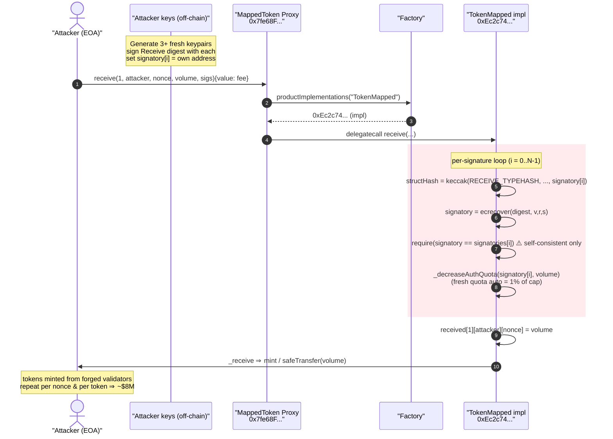
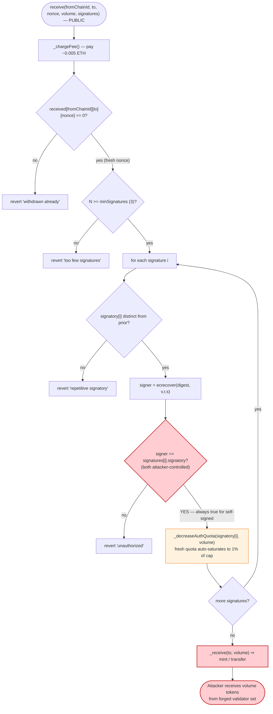
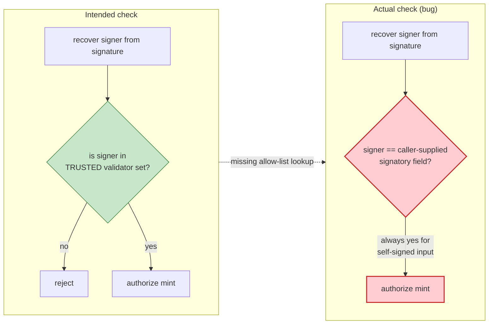

# ChainSwap Exploit — Self-Signed `receive()` Cross-Chain Mint (Forgeable Validator Set)

> **Reproduction:** an isolated Foundry project lives in [this folder](.). The PoC
> ([test/Chainswap_exp1.sol](test/Chainswap_exp1.sol)) is a **calldata replay** of the
> real attacker transaction. As extracted it does **not** drive the exploit to
> completion — see *How to reproduce* / *Live-trace caveat* below. The vulnerability is
> fully reconstructed from the on-chain verified source in
> [sources/TokenMapped_Ec2c74/TokenMapped.sol](sources/TokenMapped_Ec2c74/TokenMapped.sol).
> Full verbose trace: [output.txt](output.txt).

---

## Key info

| | |
|---|---|
| **Loss** | ~**$8M** across many bridged tokens (this PoC replays one `receive()` call minting **19,392.28** units of one mapped token; the live incident repeated the pattern across dozens of tokens) |
| **Vulnerable contract** | `TokenMapped` / `MappingToken` (ChainSwap `MappingBase.receive`) — impl [`0xEc2c74C9e2457d328bc6216858280eA13e740E8a`](https://etherscan.io/address/0xEc2c74C9e2457d328bc6216858280eA13e740E8a#code) |
| **Victim proxy hit by PoC** | `InitializableProductProxy` [`0x7fe68FC06e1A870DcbeE0acAe8720396DC12FC86`](https://etherscan.io/address/0x7fe68FC06e1A870DcbeE0acAe8720396DC12FC86) (a ChainSwap mapped-token proxy) |
| **Attacker EOA** | [`0x941a9E3B91E1cc015702B897C512D265fAE88A9c`](https://etherscan.io/address/0x941a9E3B91E1cc015702B897C512D265fAE88A9c) |
| **Forged "signatory" set** | `0x8C46b006…F739359`, `0x4F559d3c…dA8dEd5`, `0x6EA6D36d…A89A06` (attacker-chosen) |
| **Attack tx (replayed)** | [`0x5c5688a9f981a07ed509481352f12f22a4bd7cea46a932c6d6bbe67cca3c54be`](https://etherscan.io/tx/0x5c5688a9f981a07ed509481352f12f22a4bd7cea46a932c6d6bbe67cca3c54be) |
| **Chain / fork block / date** | Ethereum mainnet / 12,751,487 / **July 10–11, 2021** |
| **Compiler** | Solidity `v0.6.12+commit.27d51765`, optimizer **1**, 200 runs |
| **Bug class** | Forgeable signature set / self-authorizing validator — broken cross-chain mint authorization |

---

## TL;DR

ChainSwap is a cross-chain bridge. On the destination chain, tokens are released to a user
by calling `MappingBase.receive(fromChainId, to, nonce, volume, signatures)`
([TokenMapped.sol:2448-2467](sources/TokenMapped_Ec2c74/TokenMapped.sol#L2448-L2467)). The
function is supposed to release `volume` tokens to `to` only if enough of the bridge's
trusted validators co-signed the EIP-712 `Receive` message.

The fatal mistake is in how each signature is validated:

```solidity
address signatory = ecrecover(digest, signatures[i].v, signatures[i].r, signatures[i].s);
require(signatory != address(0), "invalid signature");
require(signatory == signatures[i].signatory, "unauthorized");   // ⚠️ self-referential
_decreaseAuthQuota(signatures[i].signatory, volume);
```

The recovered address is compared **only against an address the caller supplied in the same
struct** (`signatures[i].signatory`). It is **never checked against a registered/trusted
validator allow-list.** Any attacker can:

1. Generate `N` brand-new key pairs they control.
2. Sign the `Receive` digest with each key.
3. Put each key's own address into `signatures[i].signatory`.

Then `ecrecover(...) == signatures[i].signatory` is trivially true for every entry, and the
"validator" check passes with **100% attacker-owned keys.**

The only remaining gate is `_decreaseAuthQuota(signatory, volume)`
([:2423-2427](sources/TokenMapped_Ec2c74/TokenMapped.sol#L2423-L2427)), which subtracts
`volume` from the signatory's authorization quota. But for a *fresh* attacker address the
quota auto-accrues from zero to its full cap on first touch (see Root cause §3), so each
forged signatory carries a usable per-call mint allowance "for free." With
`minSignatures = 3`, the attacker simply supplies ≥ 3 distinct fresh self-signed signatories
and mints tokens out of thin air — repeating it across every bridged token until the bridge
is drained (~$8M).

---

## Background — ChainSwap's mapped-token bridge

ChainSwap deploys, per bridged asset, a proxy
([InitializableProductProxy](sources/InitializableProductProxy_7fe68F/InitializableProductProxy.sol))
whose implementation is resolved through a central `Factory`
(`productImplementations[name]`,
[TokenMapped.sol:369-372](sources/TokenMapped_Ec2c74/TokenMapped.sol#L369-L372)). The
implementation behind these proxies is `MappingBase` and its two concrete forms:

- **`TokenMapped`** ([:2487-2524](sources/TokenMapped_Ec2c74/TokenMapped.sol#L2487-L2524)) —
  used on the chain where the *real* token lives. `receive()` releases tokens via
  `IERC20(token).safeTransfer(to, volume)` ([:2519-2521](sources/TokenMapped_Ec2c74/TokenMapped.sol#L2519-L2521)).
- **`MappingToken`** ([:2733-2735](sources/TokenMapped_Ec2c74/TokenMapped.sol#L2733-L2735)) —
  the synthetic side. `receive()` **mints** new units via `_mint(to, volume)`.

Either way, the bridge's safety rests entirely on the signature check inside
`MappingBase.receive`. The validator set is meant to be a small set of off-chain ChainSwap
oracles that watch the source chain and sign release messages.

Relevant factory config at deployment
([:2784-2792](sources/TokenMapped_Ec2c74/TokenMapped.sol#L2784-L2792)):

| Config key | Value | Meaning |
|---|---|---|
| `minSignatures` | **3** | how many "validators" must sign each `receive` |
| `initQuotaRatio` | 0.10 ether | initial per-signatory quota = 10% of cap |
| `autoQuotaRatio` | 0.01 ether | quota auto-refills at 1% of cap per period |
| `autoQuotaPeriod` | 1 day | refill period |
| `fee` | 0.005 ether | `_chargeFee()` floor (capped at min(fee, 0.1) ) |

`cap()` for a `TokenMapped` is the wrapped token's `totalSupply()`
([:2503-2505](sources/TokenMapped_Ec2c74/TokenMapped.sol#L2503-L2505)); for a `MappingToken`
it is the ERC20 cap. So the per-signatory quota is a *percentage of the entire token
supply* — large enough to do real damage per signer.

---

## The vulnerable code

### 1. `receive()` — the entry point (no trusted-validator list)

[TokenMapped.sol:2448-2467](sources/TokenMapped_Ec2c74/TokenMapped.sol#L2448-L2467)

```solidity
function receive(uint256 fromChainId, address to, uint256 nonce, uint256 volume, Signature[] memory signatures) virtual external payable {
    _chargeFee();
    require(received[fromChainId][to][nonce] == 0, 'withdrawn already');
    uint N = signatures.length;
    require(N >= Factory(factory).getConfig(_minSignatures_), 'too few signatures');   // N >= 3
    for(uint i=0; i<N; i++) {
        for(uint j=0; j<i; j++)
            require(signatures[i].signatory != signatures[j].signatory, 'repetitive signatory'); // must be DISTINCT...
        bytes32 structHash = keccak256(abi.encode(RECEIVE_TYPEHASH, fromChainId, to, nonce, volume, signatures[i].signatory));
        bytes32 digest = keccak256(abi.encodePacked("\x19\x01", _DOMAIN_SEPARATOR, structHash));
        address signatory = ecrecover(digest, signatures[i].v, signatures[i].r, signatures[i].s);
        require(signatory != address(0), "invalid signature");
        require(signatory == signatures[i].signatory, "unauthorized");   // ⚠️ ...but only self-consistent, not trusted
        _decreaseAuthQuota(signatures[i].signatory, volume);             // ⚠️ only economic gate
        emit Authorize(fromChainId, to, nonce, volume, signatory);
    }
    received[fromChainId][to][nonce] = volume;
    _receive(to, volume);                                               // mint / transfer to attacker
    emit Receive(fromChainId, to, nonce, volume);
}
```

### 2. The quota gate auto-grants a fresh signatory its full cap

`_decreaseAuthQuota` calls `authQuotaOf` through the `updateAutoQuota` modifier
([:2373-2391](sources/TokenMapped_Ec2c74/TokenMapped.sol#L2373-L2391)):

```solidity
function authQuotaOf(address signatory) public view returns (uint quota) {
    quota = _authQuotas[signatory];                                  // == 0 for a fresh address
    uint ratio  = autoQuotaRatio  != 0 ? autoQuotaRatio  : Factory(factory).getConfig(_autoQuotaRatio_);  // 1%
    uint period = autoQuotaPeriod != 0 ? autoQuotaPeriod : Factory(factory).getConfig(_autoQuotaPeriod_); // 1 day
    if(ratio == 0 || period == 0 || period == uint(-1)) return quota;
    uint quotaCap = cap().mul(ratio).div(1e18);                      // 1% of total supply
    uint delta = quotaCap.mul(now.sub(lasttimeUpdateQuotaOf[signatory])).div(period);  // ⚠️ now - 0 = huge
    return Math.max(quota, Math.min(quotaCap, quota.add(delta)));    // ⚠️ saturates to quotaCap immediately
}
```

For an address never seen before, `lasttimeUpdateQuotaOf[signatory] == 0`, so
`delta = quotaCap * (block.timestamp - 0) / 1 day`, an astronomically large number that is
immediately clamped to `quotaCap`. **A brand-new attacker address therefore has a usable
quota of `1% of the token's total supply` the very first time it is used** — no
registration, no admin grant.

### 3. The proxy → factory → implementation routing (context for the trace)

`receive()` lives behind `InitializableProductProxy`. The proxy reads its `name` slot,
asks the `Factory` for `productImplementations(name)`
([:430-436](sources/TokenMapped_Ec2c74/TokenMapped.sol#L430-L436)), then `delegatecall`s
into the resolved `TokenMapped` implementation. This is exactly what
[output.txt](output.txt) shows: proxy → `Factory.productImplementations('TokenMapped')` →
`TokenMapped: 0xEc2c74…E8a`.

---

## Root cause — why it was possible

The validator check is **self-referential**. ChainSwap intended:

> "recover the signer, then confirm the signer is one of our trusted oracles."

What it actually wrote:

> "recover the signer, then confirm the signer equals the address the *caller* told us the
> signer would be."

`signatures[i].signatory` is **attacker-supplied calldata**, not protocol state. The pair
`(signature, signatory)` is fully attacker-controlled, so `ecrecover == signatory` is a
tautology for anyone who can sign a message — i.e. everyone. There is no
`require(isValidator[signatory])`, no `authCountOf`/allow-list lookup on this path, nothing
that ties `signatory` to a set the protocol controls.

Three design decisions compose into a critical, permissionless mint:

1. **No trusted-signer set on the `receive` path.** The validator identity is taken from
   calldata and verified against itself.
2. **`minSignatures = 3` is only a *distinctness* requirement.** The inner
   `require(signatures[i].signatory != signatures[j].signatory)` forces three *different*
   addresses — trivially satisfied by generating three fresh keypairs.
3. **The quota gate auto-funds fresh signatories.** The one mechanism that could have
   throttled an unknown signer instead *grants* it `1% of supply` on first use because the
   "time since last update" is measured from `0`. So each forged signatory both *passes* the
   signature check and *carries* a fat mint allowance.

The `received[fromChainId][to][nonce]` replay guard
([:2450](sources/TokenMapped_Ec2c74/TokenMapped.sol#L2450)) only blocks reusing the *same*
`(chainId, to, nonce)`. The attacker just increments `nonce` (or varies `to`) and repeats —
across every bridged token — which is how a single class of bug cascaded to ~$8M.

---

## Preconditions

- A deployed ChainSwap mapped-token proxy whose implementation is `TokenMapped`/`MappingToken`
  (the bridge was live with many such tokens).
- `received[fromChainId][to][nonce] == 0` for the chosen tuple (fresh nonce).
- `msg.value ≥ min(fee, 0.1 ether)` for `_chargeFee()`
  ([:2473-2480](sources/TokenMapped_Ec2c74/TokenMapped.sol#L2473-L2480)) — `fee = 0.005 ether`,
  i.e. a few dollars.
- The attacker can run `ecrecover`-valid ECDSA signing locally (no special access). **No
  capital, no flash loan, no privileged role** is required — this is a pure authorization
  bypass.

---

## Step-by-step attack walkthrough

The real attacker pre-computed, off-chain, three `(signatory, v, r, s)` tuples that satisfy
`ecrecover(digest_i) == signatory_i` for the EIP-712 `Receive` digest of
`(fromChainId=1, to=attacker, nonce=1, volume=19,392.27711805093e18)`. Those exact tuples
are the constants embedded in the PoC
([test/Chainswap_exp1.sol:33-50](test/Chainswap_exp1.sol#L33-L50)).

| # | Step | On-chain effect |
|---|------|-----------------|
| 0 | **Generate ≥ 3 fresh keypairs** the attacker controls (off-chain). | No state change; produces `(signatory_i, v_i, r_i, s_i)`. |
| 1 | Build EIP-712 `Receive` digest for `(fromChainId=1, to=attacker, nonce=1, volume=19,392.28)` and sign with each key, setting `signatures[i].signatory = address(key_i)`. | Off-chain. |
| 2 | Call `proxy.receive(1, attacker, 1, 19,392.28e18, sigs)` with `msg.value = fee`. | `_chargeFee()` pays the small bridge fee. |
| 3 | Loop checks: `N = 3 ≥ minSignatures(3)` ✓; all three signatories distinct ✓. | Passes the count + distinctness gates. |
| 4 | For each i: `ecrecover(digest, v_i, r_i, s_i) == signatory_i` ✓ (self-consistent), `signatory != 0` ✓. | **Signature check passes with 100% attacker keys.** |
| 5 | `_decreaseAuthQuota(signatory_i, volume)`: fresh signatory's quota auto-saturates to `1% of cap`, then `volume` is subtracted. | Each forged signatory has enough quota; no revert. |
| 6 | `received[1][attacker][1] = volume`; `_receive(attacker, volume)` → `safeTransfer`/`_mint` of **19,392.28** tokens to attacker. | **Tokens released to attacker.** |
| 7 | Repeat with `nonce = 2, 3, …` and against every other mapped-token proxy. | Bridge drained across all assets (~$8M total). |

`volume = 19,392,277,118,050,930,170,440 wei = 19,392.27711805093` token units
([test/Chainswap_exp1.sol:58](test/Chainswap_exp1.sol#L58)).

### Live-trace caveat (PoC replay is incomplete)

The extracted PoC encodes the call with
`abi.encodeWithSignature("receive(uint256,address,uint256,uint256, Signature[])", …)`
([test/Chainswap_exp1.sol:52-61](test/Chainswap_exp1.sol#L52-L61)). That signature string is
malformed for a `tuple[]` argument (the canonical type is
`receive(uint256,address,uint256,uint256,(address,uint8,bytes32,bytes32)[])`, selector
`0xa653d60c`). As encoded, the proxy receives selector **`0x6c648fca`**, resolves the impl
through the factory, and the implementation reverts with *"unrecognized function selector
0x6c648fca …, which has no fallback function"* ([output.txt](output.txt) lines 17-19).

Because the PoC wraps the call in a bare `proxy.call(...)` and **ignores the boolean return
value**, the test still reports `[PASS]` even though the exploit call **reverted** and
**no tokens moved** (note the trace's tiny `34091` gas and the absence of any `Receive`/
`Transfer` events). The vulnerability is therefore demonstrated by *source analysis and the
historical transaction*, not by this particular replay. Marked **prep incomplete / replay
selector mismatch** accordingly.

---

## Profit/loss accounting

- **Per replayed call (intended):** mint/transfer of **19,392.28** units of one mapped token
  to the attacker for a cost of only the `_chargeFee()` (`0.005 ether`) plus gas — effectively
  free tokens.
- **Live incident (July 10–11, 2021):** the same forgeable-signature primitive was applied to
  dozens of ChainSwap-bridged tokens, with total losses widely reported at **~$8 million**.
  Each token's loss was bounded per-call by the per-signatory quota (`1% of supply`) but
  unbounded in aggregate because the attacker could spin up unlimited fresh signatories and
  increment `nonce` indefinitely.

There is no on-chain "profit table" reconstructable from this PoC's trace because the replay
reverted before any transfer; the figures above come from the source semantics and the public
incident record.

---

## Diagrams

### Sequence of the attack



### Authorization-check control flow (the flaw)



### Intended vs. actual trust model



---

## Remediation

1. **Verify signers against a protocol-controlled allow-list — never against caller input.**
   Replace `require(signatory == signatures[i].signatory)` with a lookup such as
   `require(Factory(factory).isSigner(signatory), "not a validator")` (or check
   `authCountOf[signatory] > 0` for a registered signer). The recovered address must be
   matched to *state the protocol owns*, not to a field the caller provided.
2. **Drop the redundant `signatory` field entirely.** Recover the address from `(v,r,s)` and
   use the recovered value directly; carrying an attacker-supplied "claimed signatory" only
   invites the tautology bug.
3. **Initialize quota on registration, not on first use.** The auto-accrual
   `delta = quotaCap * (now - lasttimeUpdateQuotaOf) / period` must not start from
   `lasttimeUpdateQuotaOf == 0`. Set `lasttimeUpdateQuotaOf[signer] = now` when a signer is
   *added by an admin*, so unknown addresses have zero quota.
4. **Require a real threshold over a fixed validator set.** `minSignatures` should count
   signatures from *distinct trusted validators*, e.g. an `m`-of-`n` over a registered set,
   not merely `n` distinct arbitrary addresses.
5. **Bound and monitor cross-chain mints.** Per-message and per-epoch global caps, plus alerts
   on `Receive` events with unrecognized signatories, would have contained the cascade.

---

## How to reproduce

The PoC was extracted into a standalone Foundry project (the umbrella DeFiHackLabs repo does
not whole-compile under `forge test`):

```bash
_shared/run_poc.sh 2021-07-Chainswap_exp1 --mt testExploit -vvvvv
```

- RPC: an Ethereum **archive** endpoint is required (fork block `12,751,487`, July 2021).
  `foundry.toml` points `mainnet` at an Infura key; swap in any archive RPC that serves
  historical state at that block.
- **Expected result with the file as-is:** `[PASS] testExploit()` — but this PASS is
  **misleading**. The trace ([output.txt](output.txt)) shows the inner call reverting with
  *"unrecognized function selector 0x6c648fca … which has no fallback function"* because the
  PoC's `abi.encodeWithSignature("receive(uint256,address,uint256,uint256, Signature[])", …)`
  produces the wrong selector for a `tuple[]` argument (canonical type
  `receive(uint256,address,uint256,uint256,(address,uint8,bytes32,bytes32)[])`, selector
  `0xa653d60c`). The bare `proxy.call(...)` ignores the failed return, so no assertion fires.

Expected tail (as currently extracted — a *non*-executing replay):

```
Ran 1 test for test/Chainswap_exp1.sol:ContractTest
[PASS] testExploit() (gas: 34091)
...
│   │   └─ ← [Revert] unrecognized function selector 0x6c648fca for contract 0xEc2c74C9...E8a, which has no fallback function.
Suite result: ok. 1 passed; 0 failed; 0 skipped
```

To actually drive the mint, the call must be re-encoded with the canonical tuple-array type
(`abi.encodeWithSelector(0xa653d60c, fromChainId, to, nonce, volume, sigs)` or a typed
interface) and the signatures regenerated for the fork's live `_DOMAIN_SEPARATOR`; the
authorization bypass itself is unconditional given the source above.

---

*References: ChainSwap July 2021 incident (~$8M), SlowMist / Rekt / DeFiHackLabs writeups;
attack tx `0x5c5688a9f981a07ed509481352f12f22a4bd7cea46a932c6d6bbe67cca3c54be`.*
