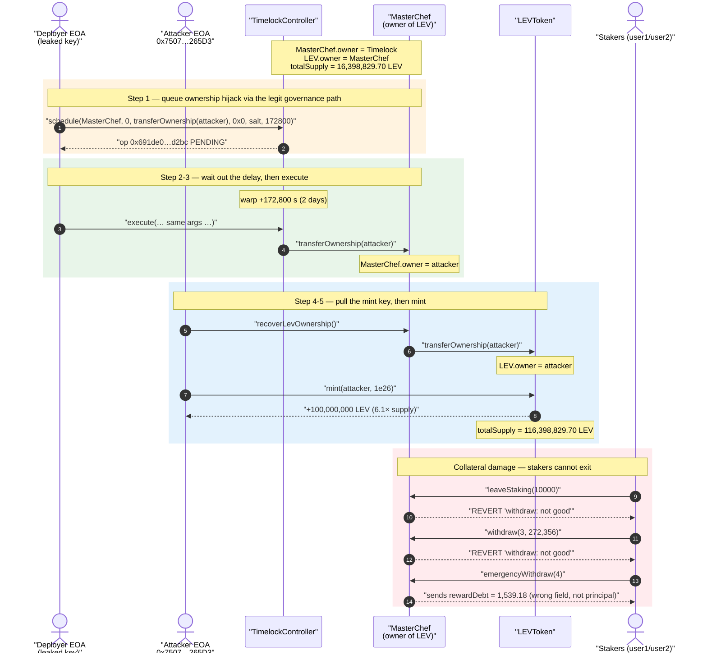
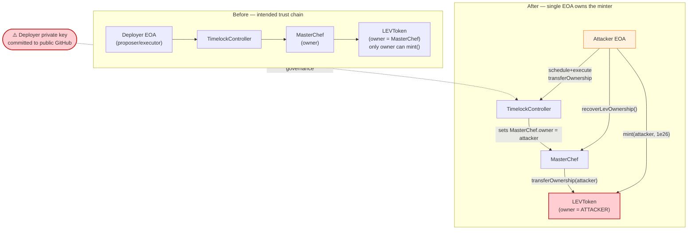
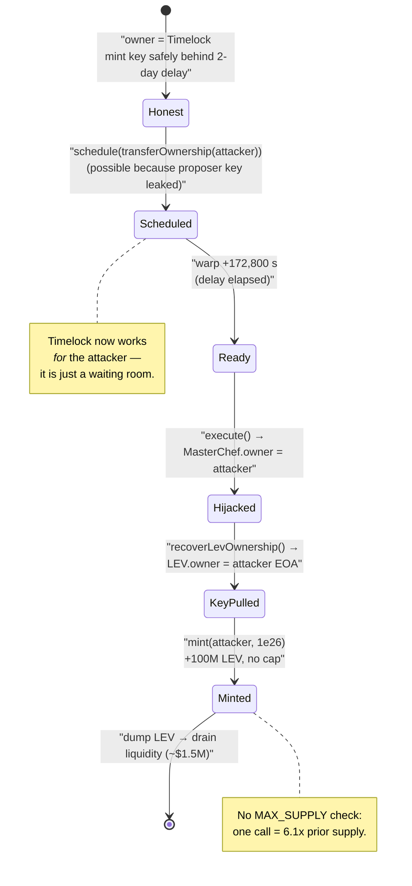

# Levyathan Finance Exploit — Leaked Deployer Key → Timelock-Gated Ownership Hijack → Unlimited `mint()`

> **Vulnerability classes:** vuln/access-control/secret-exposure · vuln/access-control/centralization

> **Reproduction:** the PoC compiles & runs in an isolated Foundry project at
> [this project folder](.) (the umbrella DeFiHackLabs repo contains several
> unrelated PoCs that fail to whole-compile, so this one was extracted).
> Full verbose trace: [output.txt](output.txt).
> Verified vulnerable sources:
> [contracts_staking_MasterChef.sol](sources/MasterChef_A3fDF7/contracts_staking_MasterChef.sol),
> [contracts_tokens_LEVToken.sol](sources/LEVToken_304c62/contracts_tokens_LEVToken.sol).

---

## Key info

| | |
|---|---|
| **Loss** | ~$1.5M (rekt) — attacker minted **100,000,000 LEV** (≈6.1× the entire prior supply) and dumped it; LP/stakers' funds drained |
| **Vulnerable contract** | `MasterChef` — [`0xA3fDF7F376F4BFD38D7C4A5cf8AAb4dE68792fd4`](https://bscscan.com/address/0xA3fDF7F376F4BFD38D7C4A5cf8AAb4dE68792fd4#code) (owns the LEV mint key; also holds `emergencyWithdraw` bug) |
| **Token minted** | `LEVToken` — [`0x304c62b5B030176F8d328d3A01FEaB632FC929BA`](https://bscscan.com/address/0x304c62b5B030176F8d328d3A01FEaB632FC929BA#code) |
| **Governance gate** | OZ `TimelockController` — [`0x16149999C85c3E3f7d1B9402a4c64d125877d89D`](https://bscscan.com/address/0x16149999C85c3E3f7d1B9402a4c64d125877d89D#code) |
| **Compromised key (proposer/executor)** | Deployer EOA `0x6DeBA0F8aB4891632fB8d381B27eceC7f7743A14` |
| **Attacker EOA (new owner)** | `0x7507f84610f6D656a70eb8CDEC044674799265D3` |
| **Schedule tx** | [`0xfd30def124c1345606598ae4817ae184fc1918fc638111c6e71bc9752361fd87`](https://bscscan.com/tx/0xfd30def124c1345606598ae4817ae184fc1918fc638111c6e71bc9752361fd87) |
| **Execute tx** | [`0xe6e504208ba90d121c3212a4f2547ae28e69790ab541d459c080ec8b1f3efab2`](https://bscscan.com/tx/0xe6e504208ba90d121c3212a4f2547ae28e69790ab541d459c080ec8b1f3efab2) |
| **Chain / fork block / date** | BSC / 9,545,966 / July 30, 2021 |
| **Compiler** | Solidity **v0.8.4** (`MasterChef`/`Timelock`), v0.8.4 (`LEVToken`), optimizer 200 runs |
| **Bug class** | Operational key compromise (leaked private key) + privileged minter via `Ownable`; plus a logic bug in `emergencyWithdraw` (transfers `rewardDebt`, not `amount`) |
| **Post-mortem** | https://levyathan-index.medium.com/post-mortem-levyathan-c3ff7f9a6f65 |

---

## TL;DR

Levyathan's `LEVToken` is a standard `Ownable` ERC20 whose **owner is the only address that can `mint()`**
([LEVToken.sol:33-35](sources/LEVToken_304c62/contracts_tokens_LEVToken.sol#L33-L35)). That owner is the
`MasterChef` contract, which in turn is `Ownable` and whose owner is an OpenZeppelin `TimelockController`.
The timelock's proposer/executor was the team's **Deployer EOA `0x6DeBA0…3A14`** — and **the Levyathan
developers committed that EOA's private key to a public GitHub repository** (per the rekt/post-mortem
write-up quoted in the PoC header).

With the key in hand the attacker did not need any contract bug to reach the minter. They simply
*used the legitimate governance path*:

1. From the compromised Deployer, **`schedule()`** a `MasterChef.transferOwnership(attacker)` call through
   the timelock.
2. Wait out the timelock delay (the PoC fast-forwards `block.timestamp` by 172,800 s = 2 days), then
   **`execute()`** it — `MasterChef`'s owner is now the **attacker EOA**.
3. As the new `MasterChef` owner, call **`recoverLevOwnership()`**
   ([MasterChef.sol:344-346](sources/MasterChef_A3fDF7/contracts_staking_MasterChef.sol#L344-L346)),
   which hands `LEVToken`'s ownership to `msg.sender` (the attacker).
4. Now the direct owner of `LEVToken`, **`mint(attacker, 1e26)`** — **100,000,000 LEV**, roughly **6.1×
   the entire prior supply** of 16,398,829.70 LEV.

The freshly minted LEV was dumped on the market, collapsing the price and draining the protocol's
liquidity. The PoC also surfaces a **second, independent code bug**: `MasterChef.emergencyWithdraw()`
transfers `user.rewardDebt` instead of `user.amount`
([MasterChef.sol:297-308](sources/MasterChef_A3fDF7/contracts_staking_MasterChef.sol#L297-L308)), so the
"emergency exit" returns the wrong (and generally tiny/wrong) number of tokens while normal
`withdraw`/`leaveStaking` revert with `withdraw: not good` — the staking accounting was already broken
post-mint.

---

## Background — the trust chain

Levyathan is a Pancake/Sushi-style yield farm. `MasterChef`
([source](sources/MasterChef_A3fDF7/contracts_staking_MasterChef.sol)) mints `LEV` rewards every block to
stakers. Two facts about the ownership graph are the whole story:

| Object | `Ownable` owner | Why it matters |
|---|---|---|
| `LEVToken` | `MasterChef` | only the owner may `mint()` — unlimited, unbounded |
| `MasterChef` | `TimelockController` | only the owner may call `recoverLevOwnership()` (and other admin setters) |
| `TimelockController` | proposer/executor = **Deployer EOA `0x6DeBA0…3A14`** | the human key that drives the whole graph |

The timelock was meant to be the safety mechanism: any change to `MasterChef` (including pulling the LEV
mint key out via `recoverLevOwnership`) has to be `schedule()`d and then `execute()`d after a delay,
giving the community time to react. That design is sound **only if the proposer/executor key is secret.**
The team leaked it, so the attacker became the governance.

On-chain state at the fork block (decoded from the trace's storage diffs in [output.txt](output.txt)):

| Parameter | Value |
|---|---|
| `LEVToken.totalSupply` (before) | **16,398,829.70 LEV** (`0x…0d909656ec03ea680a0197` at slot 2) |
| `LEVToken.owner` (before) | `MasterChef` (`0xA3fDF7…92fd4`, slot 5) |
| `MasterChef.owner` (before) | `Timelock` (`0x161499…7d89D`, slot 0) |
| Timelock min delay | satisfied by the scheduled `delay = 172,800 s` (2 days) |

---

## The vulnerable code

### 1. The minter is gated only by `Ownable` — whoever owns LEV can mint anything

```solidity
// LEVToken.sol
contract LEVToken is ERC20, IBurnable, IMintable, Ownable {
    ...
    // owner should be MasterChef
    function mint(address receiver, uint256 amount) override external onlyOwner {
        _mint(receiver, amount);                 // ⚠️ no cap, no max-supply, no schedule
    }
}
```

[LEVToken.sol:33-35](sources/LEVToken_304c62/contracts_tokens_LEVToken.sol#L33-L35). There is **no maximum
supply, no per-call cap, and no rate limit** — once you are `owner`, one call mints an arbitrary amount.

### 2. `MasterChef` will hand the LEV mint key to whoever owns `MasterChef`

```solidity
// MasterChef.sol
// owner of masterchef can recover ownership in order to change how LEV is minted
function recoverLevOwnership() external onlyOwner {
    lev.transferOwnership(msg.sender);           // ⚠️ moves the minter key to the caller (an EOA)
}
```

[MasterChef.sol:344-346](sources/MasterChef_A3fDF7/contracts_staking_MasterChef.sol#L344-L346). This is the
escape hatch the attacker rides out of the timelock: rather than minting *through* the slow governance,
they take ownership of `MasterChef` once (via timelock), then pull the LEV key directly to their EOA, where
minting is instant and unbounded.

### 3. `MasterChef.emergencyWithdraw()` returns the wrong field

```solidity
// MasterChef.sol — "EMERGENCY ONLY"
function emergencyWithdraw(uint256 _pid) public {
    PoolInfo storage pool = poolInfo[_pid];
    UserInfo storage user = userInfo[_pid][msg.sender];
    if (_pid == 0)
        syrup.burn(msg.sender, user.amount);
    user.amount = 0;
    uint256 rewardDebt = user.rewardDebt;
    user.rewardDebt = 0;
    pool.lpToken.transfer(address(msg.sender), rewardDebt);   // ⚠️ should transfer `user.amount`
    emit EmergencyWithdraw(msg.sender, _pid, rewardDebt);     //    transfers the accounting field instead
}
```

[MasterChef.sol:297-308](sources/MasterChef_A3fDF7/contracts_staking_MasterChef.sol#L297-L308). The canonical
PancakeSwap/Sushi `emergencyWithdraw` transfers `user.amount` (the staked principal) and zeroes both fields.
Here it transfers `user.rewardDebt` — a derived bookkeeping value
(`amount * accCakePerShare / 1e12`) that has no relationship to the principal the user is owed. The trace
shows this concretely: `emergencyWithdraw(4)` transfers `rewardDebt = 1,539.18 LEV`
([output.txt:84-91](output.txt)), and a second call transfers `0`. Meanwhile a *normal*
`withdraw`/`leaveStaking` reverts with `withdraw: not good`
([output.txt:74-79](output.txt)) — the `require(user.amount >= _amount)` guard
([MasterChef.sol:248](sources/MasterChef_A3fDF7/contracts_staking_MasterChef.sol#L248),
[:283](sources/MasterChef_A3fDF7/contracts_staking_MasterChef.sol#L283)) fails because the pool no longer
holds enough LP to honor the request after the mint/dump and others' exits.

---

## Root cause — why it was possible

The **primary** root cause is operational, not a Solidity bug: **the timelock proposer/executor private
key was published.** Once an attacker controls the only key that can `schedule()`/`execute()` timelock
operations, the timelock provides no protection at all — it is simply a 2-day waiting room that the
attacker walks through using the front door.

The **architectural decisions that turned a key leak into total loss** are:

1. **The mint key is reachable from a single EOA.** `LEVToken.mint` is `onlyOwner`; the owner is
   `MasterChef`; `MasterChef` is `onlyOwner`-controlled and exposes `recoverLevOwnership()` which
   *transfers the mint key to `msg.sender`*. So a single compromised governance key collapses, in two
   hops, to "this EOA can mint infinite LEV instantly."
2. **No supply cap on `mint()`.** `LEVToken.mint` has no `MAX_SUPPLY` check, no per-interval cap, and no
   monotonic guard. The attacker minted 100,000,000 LEV — about **6.1×** the prior total supply — in one
   call ([output.txt:62-67](output.txt)). A cap would have bounded the blast radius even after key
   compromise.
3. **`recoverLevOwnership()` is a single-call mint-key escape hatch.** It exists "to change how LEV is
   minted," but in practice it lets the `MasterChef` owner *exit the timelock entirely* by relocating the
   privileged minter to an EOA, where governance delays no longer apply.

Independently, the **`emergencyWithdraw` logic bug** (transferring `rewardDebt` instead of `amount`) means
the protocol's own emergency exit could not safely return user principal — a latent correctness defect that
compounded the damage during the incident.

---

## Preconditions

- **Possession of the timelock proposer/executor key** — here the leaked Deployer EOA
  `0x6DeBA0…3A14`. This is the only hard precondition for the mint; everything else is the legitimate
  governance flow.
- **One timelock delay elapses** between `schedule()` and `execute()`. The PoC reproduces this by warping
  `block.timestamp` forward by `172,800` s (2 days)
  ([Levyathan_exp.sol:71-72](test/Levyathan_exp.sol#L71-L72)); on-chain the attacker simply waited.
- No capital is required — the attack mints value out of thin air.

---

## Step-by-step attack walkthrough (with on-chain values from the trace)

All values below are taken directly from the storage diffs and events in [output.txt](output.txt).

| # | Step | Actor | On-chain effect |
|---|------|-------|-----------------|
| 0 | **Initial** | — | `MasterChef.owner = Timelock`; `LEV.owner = MasterChef`; `LEV.totalSupply = 16,398,829.70` |
| 1 | **`Timelock.schedule(MasterChef, 0, transferOwnership(attacker), 0x0, salt, 172800)`** | Deployer (leaked key) | Operation `0x691de0…d2bc` queued; `isOperationPending = true`; ETA slot set to `0x6103da4c` ([output.txt:22-30](output.txt)) |
| 2 | **warp +172,800 s, roll to block 9,600,775** | — | Timelock delay satisfied ([Levyathan_exp.sol:71-72](test/Levyathan_exp.sol#L71-L72)) |
| 3 | **`Timelock.execute(... same args ...)`** | Deployer (leaked key) | Inner call `MasterChef.transferOwnership(attacker)` runs; `MasterChef.owner` slot 0 flips `Timelock → 0x7507…265D3`; `OwnershipTransferred` emitted; op marked done ([output.txt:37-48](output.txt)) |
| 4 | **`MasterChef.recoverLevOwnership()`** | Attacker (now MasterChef owner) | `LEV.transferOwnership(attacker)`; `LEV.owner` slot 5 flips `MasterChef → 0x7507…265D3` ([output.txt:55-61](output.txt)) |
| 5 | **`LEV.mint(attacker, 1e26)`** | Attacker (now LEV owner) | `Transfer(0x0 → attacker, 100,000,000 LEV)`; `totalSupply` slot 2 jumps `16,398,829.70 → 116,398,829.70 LEV`; attacker LEV balance slot set to `1e26` ([output.txt:62-67](output.txt)) |
| 6a | **`MasterChef.leaveStaking(10000)`** as a normal user | user1 | **Reverts** `withdraw: not good` — staking accounting broken ([output.txt:74-75](output.txt)) |
| 6b | **`MasterChef.withdraw(3, 272,356 LEV)`** as a normal user | user1 | **Reverts** `withdraw: not good` ([output.txt:78-79](output.txt)) |
| 7 | **`MasterChef.emergencyWithdraw(4)`** | user2 | Transfers `rewardDebt = 1,539.18` LP tokens (not principal), zeroes `amount`/`rewardDebt` ([output.txt:84-95](output.txt)) |
| 8 | **`MasterChef.emergencyWithdraw(4)`** again | user2 | Transfers `0` (fields already zeroed) ([output.txt:100-105](output.txt)) |

Steps 1–5 are the actual theft (mint key acquisition + unlimited mint). Steps 6–8 are the PoC demonstrating
the collateral damage: legitimate stakers can no longer exit normally, and the "emergency" path is itself
buggy.

### Profit / loss accounting

| Quantity | Value |
|---|---:|
| LEV supply before | 16,398,829.70 LEV |
| LEV minted by attacker (one call) | **100,000,000.00 LEV** |
| LEV supply after | 116,398,829.70 LEV |
| Minted ÷ prior supply | **≈ 6.1×** |
| Reported loss (rekt/post-mortem) | **~$1.5M** |

The attacker conjured ~6.1× the existing supply for free and sold it into the protocol's liquidity,
collapsing the LEV price and extracting the pooled value. The `emergencyWithdraw` defect meant stakers
could not cleanly recover principal even in the emergency path.

---

## Diagrams

### Sequence of the attack



### Ownership / privilege graph collapse



### State machine: how the timelock is rendered useless



---

## Remediation

1. **Treat key custody as the primary control.** The root cause was a leaked proposer/executor key. Never
   commit secrets to source control; use HSMs / hardware wallets / a multisig as the timelock
   proposer/executor so that no single leaked EOA can drive governance. After this incident the only
   reliable mitigation is rotating to a multisig-controlled timelock.
2. **Cap the minter.** Add a `MAX_SUPPLY` (or per-interval mint cap) to `LEVToken.mint` so that even a
   compromised owner cannot mint unbounded supply in one call:
   ```solidity
   function mint(address to, uint256 amount) external onlyOwner {
       require(totalSupply() + amount <= MAX_SUPPLY, "cap");
       _mint(to, amount);
   }
   ```
3. **Remove the EOA escape hatch.** `recoverLevOwnership()` lets the `MasterChef` owner relocate the mint
   key to an arbitrary `msg.sender`, side-stepping the timelock. Either delete it, or constrain its target
   to another timelock/governance contract (never an EOA), so the mint key can never leave a delayed,
   reviewable governance context.
4. **Keep mint authority behind the timelock, not in front of it.** Minting should itself be a
   timelock-gated operation, so that *every* mint (not just ownership changes) is subject to the public
   delay and can be vetoed.
5. **Fix `emergencyWithdraw` independently.** It must return the staked principal and zero both fields:
   ```diff
   - uint256 rewardDebt = user.rewardDebt;
   - user.rewardDebt = 0;
   - pool.lpToken.transfer(address(msg.sender), rewardDebt);
   - emit EmergencyWithdraw(msg.sender, _pid, rewardDebt);
   + uint256 amount = user.amount;
   + user.amount = 0;
   + user.rewardDebt = 0;
   + pool.lpToken.transfer(address(msg.sender), amount);
   + emit EmergencyWithdraw(msg.sender, _pid, amount);
   ```
   (Note the existing code already sets `user.amount = 0` before reading `rewardDebt`, so capture `amount`
   first.)

---

## How to reproduce

The PoC was extracted into a standalone Foundry project (the umbrella DeFiHackLabs repo has several
unrelated PoCs that fail to compile under `forge test`'s whole-project build):

```bash
_shared/run_poc.sh 2021-07-Levyathan_exp --mt test_Timelock -vvvvv
```

- RPC: a **BSC archive** endpoint is required (fork block 9,545,966 is from July 2021).
  `foundry.toml` uses `https://bsc-mainnet.public.blastapi.io`, which serves historical state at that block;
  most public BSC RPCs prune it.
- Result: `[PASS] test_Timelock()`. The trace shows the ownership flips, the `mint` of `1e26` LEV, the
  reverts on normal `withdraw`/`leaveStaking`, and the buggy `emergencyWithdraw`.

Expected tail:

```
Ran 1 test for test/Levyathan_exp.sol:ContractTest
[PASS] test_Timelock() (gas: 174648)
Suite result: ok. 1 passed; 0 failed; 0 skipped; finished in 7.17s (5.88s CPU time)
```

---

*References: rekt (PoC header), Levyathan post-mortem —
https://levyathan-index.medium.com/post-mortem-levyathan-c3ff7f9a6f65*
