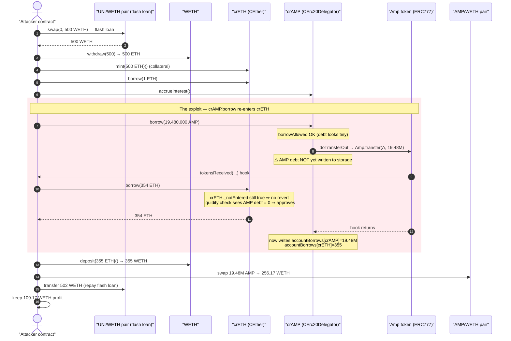
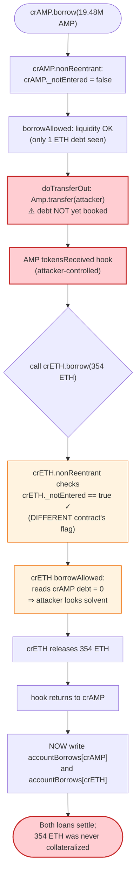
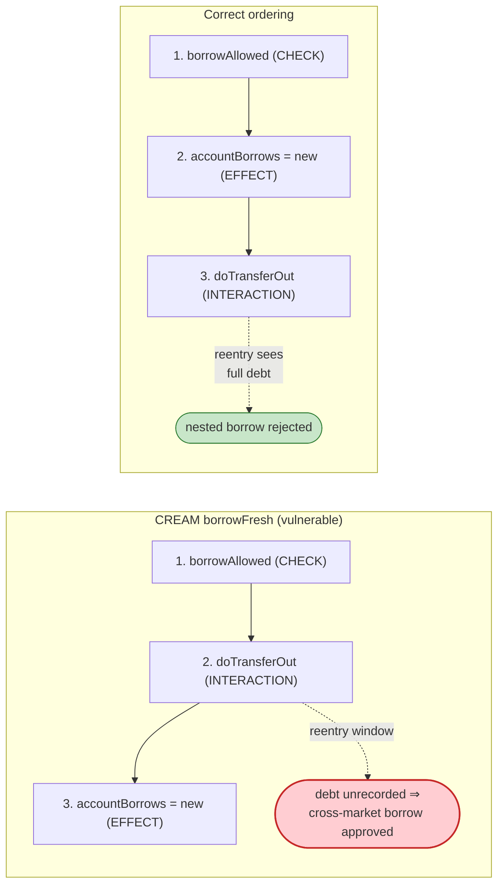

# Cream Finance / AMP Exploit — Cross-Market Reentrancy via ERC777 `tokensReceived`

> **Reproduction:** the PoC compiles & runs in an isolated Foundry project at
> [this project folder](.). Full verbose trace:
> [output.txt](output.txt). Verified vulnerable sources:
> [contracts_CToken.sol](sources/CEther_D06527/contracts_CToken.sol),
> [contracts_CEther.sol](sources/CEther_D06527/contracts_CEther.sol),
> [Amp.sol](sources/Amp_fF2081/Amp.sol).
>
> The on-chain incident drained ~**$18.8M** across the CREAM lending markets via
> 17 nested re-borrows. This extracted PoC reproduces **one round** of the
> reentrancy at fork block 13,125,070, netting **109.17 WETH** to demonstrate the
> mechanism end-to-end; the real attacker simply repeated the inner step many times.

---

## Key info

| | |
|---|---|
| **Loss (full incident)** | ~**$18.8M** (≈ 462,079,976 AMP + 2,875.62 ETH) |
| **Loss (this PoC, single round)** | **109.17 WETH** profit, after a 500 WETH flash loan |
| **Vulnerable contract** | CREAM `CToken.borrowFresh` (Compound v2 fork) — interaction-before-effect + per-market reentrancy guard. crETH proxy `CEther` [`0xD06527D5e56A3495252A528C4987003b712860eE`](https://etherscan.io/address/0xD06527D5e56A3495252A528C4987003b712860eE#code), crAMP delegator `CErc20Delegator` [`0x2Db6c82CE72C8d7D770ba1b5F5Ed0b6E075066d6`](https://etherscan.io/address/0x2Db6c82CE72C8d7D770ba1b5F5Ed0b6E075066d6#code) |
| **Weaponized token** | `Amp` (ERC777-style, ERC1820 `tokensReceived` hook) [`0xfF20817765cB7f73d4bde2e66e067E58D11095C2`](https://etherscan.io/address/0xfF20817765cB7f73d4bde2e66e067E58D11095C2#code) |
| **Victim** | CREAM Finance lenders (crETH cash + crAMP cash) |
| **Attacker (incident)** | EOA `0x24354D31bC9D90F62FE5f2454709C32049cf866b` |
| **Attack tx (incident)** | `0x0fe2542079644e107cbf13690eb9c2c65963ccb79089ff96bfaf8dced2331c92` |
| **Chain / fork block / date** | Ethereum mainnet / 13,125,070 / **2021-08-30** |
| **Compiler** | CToken/CEther `v0.5.17`, optimizer 1 run; Amp `v0.6.10`, optimizer 200 runs |
| **Bug class** | Cross-contract (cross-market) reentrancy — Checks-Effects-**Interactions** violation + per-contract reentrancy lock |

---

## TL;DR

CREAM Finance is a Compound v2 fork. In `CToken.borrowFresh`, the protocol sends
the borrowed asset to the borrower **before** it records the new debt in storage:

```
doTransferOut(borrower, borrowAmount);          // L785  ← INTERACTION first
accountBorrows[borrower].principal = ...New;     // L788  ← EFFECT second
accountBorrows[borrower].interestIndex = ...;    // L789
totalBorrows = vars.totalBorrowsNew;             // L790
```
([contracts_CToken.sol:785-790](sources/CEther_D06527/contracts_CToken.sol#L785-L790))

The single reentrancy guard CREAM relies on is `nonReentrant`, but its
`_notEntered` flag is a **per-contract** state variable
([:1422-1427](sources/CEther_D06527/contracts_CToken.sol#L1422-L1427)) — it locks
the *crAMP* market only. It does nothing to stop a reentrant call into the
*separate* crETH contract, whose own flag is still unlocked.

The attacker listed **AMP** as a borrowable market. AMP is an ERC777-like token
that, on every transfer, looks up an ERC1820 `tokensReceived` recipient hook and
calls it ([Amp.sol:1956-1970](sources/Amp_fF2081/Amp.sol#L1956-L1970)). So when
the attacker borrows AMP, CREAM's `doTransferOut` hands AMP to the attacker, AMP
re-enters the attacker's `tokensReceived`, and from there the attacker calls
`crETH.borrow(...)` **while the AMP debt has not yet been written to storage**.

The collateral/liquidity check for the crETH borrow therefore sees the attacker
as still fully collateralized (the AMP loan is invisible), and approves a second
loan against collateral that is already spoken for. The attacker walks away with
both the AMP **and** the ETH, while CREAM books debt that is no longer backed by
sufficient collateral.

---

## Background — the contracts in play

**CREAM `CToken` (Compound v2 fork).** A money-market token. `borrow()` →
`borrowInternal()` → `accrueInterest()` → `borrowFresh()`. `borrowFresh` checks
liquidity via `comptroller.borrowAllowed(...)`, sends the underlying out with
`doTransferOut`, then records the debt
([contracts_CToken.sol:736-799](sources/CEther_D06527/contracts_CToken.sol#L736-L799)).
There are two market instances involved here:

- **crETH** — a `CEther` whose underlying is native ETH; `doTransferOut` is a plain
  `to.transfer(amount)` ([contracts_CEther.sol:143-146](sources/CEther_D06527/contracts_CEther.sol#L143-L146)).
- **crAMP** — a `CErc20Delegator` (proxy → `CCollateralCapErc20Delegate`) whose
  underlying is AMP. Its `doTransferOut` performs an ERC20 `Amp.transfer(...)`.

**AMP token.** AMP is ERC777-inspired: it registers an `AmpTokensRecipient`
interface in the ERC1820 registry and, after crediting the recipient, calls the
recipient's `tokensReceived` hook if one is registered
([Amp.sol:1956-1970](sources/Amp_fF2081/Amp.sol#L1956-L1970)). This callback is the
reentrancy primitive.

**The reentrancy guard.** Every CToken carries its own `bool _notEntered`. The
`nonReentrant` modifier sets it false on entry and true on exit
([contracts_CToken.sol:1422-1427](sources/CEther_D06527/contracts_CToken.sol#L1422-L1427)).
Because the flag lives on *each* market, a call already inside crAMP can freely
call into crETH — the two contracts do not share a lock.

On-chain market state at the fork block (from the trace):

| Parameter | Value | Source |
|---|---|---|
| crETH minted by attacker | 500 ETH → 2,417,223,613,775 crETH | trace [output.txt:45](output.txt) |
| crETH first borrow (pre-reentry) | 1 ETH | [output.txt:77](output.txt) |
| crAMP borrow (outer) | 19,480,000 AMP | [output.txt:227](output.txt) |
| crETH reentrant borrow | 354 ETH | [output.txt:207](output.txt) |
| AMP oracle price (Chainlink) | 0.005648 ETH (decimals 8) | [output.txt:119-120](output.txt) |
| AMP/WETH pair (`0x0865…`) reserves | 975.0 WETH / 54,500,123 AMP | [output.txt:248](output.txt) |

---

## The vulnerable code

### 1. Interaction-before-effect in `borrowFresh`

```solidity
/////////////////////////
// EFFECTS & INTERACTIONS
// (No safe failures beyond this point)

doTransferOut(borrower, borrowAmount);            // ⚠️ underlying leaves FIRST

/* We write the previously calculated values into storage */
accountBorrows[borrower].principal     = vars.accountBorrowsNew;   // debt booked AFTER
accountBorrows[borrower].interestIndex = borrowIndex;
totalBorrows                           = vars.totalBorrowsNew;
```
([contracts_CToken.sol:775-790](sources/CEther_D06527/contracts_CToken.sol#L775-L790))

The comptroller's collateral check (`borrowAllowed` →
`getHypotheticalAccountLiquidity`) ran *before* `doTransferOut` and used the
**old** debt figures. If `doTransferOut` re-enters the protocol before line 788
executes, any nested liquidity check still reads pre-borrow debt for this market.

### 2. The reentrancy guard is per-market, not protocol-wide

```solidity
modifier nonReentrant() {
    require(_notEntered, "re-entered");   // _notEntered is THIS contract's storage
    _notEntered = false;
    _;
    _notEntered = true;
}
```
([contracts_CToken.sol:1422-1427](sources/CEther_D06527/contracts_CToken.sol#L1422-L1427))

`borrowInternal` is `nonReentrant` ([:714](sources/CEther_D06527/contracts_CToken.sol#L714)),
so re-entering the *same* crAMP `borrow` would revert. But crETH's
`borrowInternal` checks crETH's own `_notEntered`, which is still `true`. The
guard simply does not span the two markets.

### 3. AMP fires a recipient hook mid-transfer

```solidity
address recipientImplementation = interfaceAddr(_to, AMP_TOKENS_RECIPIENT);
if (recipientImplementation != address(0)) {
    IAmpTokensRecipient(recipientImplementation).tokensReceived(
        msg.sig, _toPartition, _operator, _from, _to, _value, _data, _operatorData
    );   // ⚠️ arbitrary call to attacker-controlled recipient, inside crAMP's doTransferOut
}
```
([Amp.sol:1956-1970](sources/Amp_fF2081/Amp.sol#L1956-L1970))

The attacker registers itself as its own AMP recipient via the ERC1820 registry
in the PoC ([test/Cream_exp.sol:42](test/Cream_exp.sol#L42)), so this hook lands
in the attacker's `tokensReceived` ([test/Cream_exp.sol:64-75](test/Cream_exp.sol#L64-L75)).

---

## Root cause — why it was possible

Three independent design facts compose into a critical bug:

1. **Checks-Effects-Interactions is violated.** `borrowFresh` transfers the
   underlying out (`doTransferOut`, [L785](sources/CEther_D06527/contracts_CToken.sol#L785))
   *before* recording the debt ([L788-790](sources/CEther_D06527/contracts_CToken.sol#L788-L790)).
   Any reentrant read of the borrower's liquidity during the transfer sees an
   account with **no debt for this borrow**.

2. **The reentrancy lock is scoped to one contract.** `_notEntered` is per-CToken
   ([L1422](sources/CEther_D06527/contracts_CToken.sol#L1422)). Re-entering a
   *different* market is unguarded. Compound's original design assumed underlying
   transfers were inert ERC20s; CREAM listed an ERC777-style token that breaks
   that assumption.

3. **AMP hands control to the recipient on transfer.** AMP's `_callPostTransferHooks`
   ([Amp.sol:1923-1971](sources/Amp_fF2081/Amp.sol#L1923-L1971)) invokes a
   user-registered `tokensReceived`. Listing AMP as a borrowable asset turned its
   own `doTransferOut` into an attacker-controlled callback.

Put together: the attacker borrows AMP; while AMP is being sent out and the AMP
debt is not yet on the books, the hook fires and the attacker borrows ETH from a
**different**, unlocked market against the **same** collateral. The crETH liquidity
check cannot see the in-flight AMP loan, so it approves. Both debts then settle,
but the second loan was never properly collateralized — the protocol's cash is
gone.

---

## Preconditions

- **An ERC777/hooked token listed as a CREAM market.** AMP's `tokensReceived` is
  the reentrancy primitive; without a hooking underlying, `doTransferOut` is inert.
- **Attacker holds collateral in one market** (here: 500 ETH minted into crETH,
  [output.txt:37-45](output.txt)) so that both the AMP borrow and the reentrant
  ETH borrow individually pass their (stale) liquidity checks.
- **Working capital, fully recoverable intra-transaction** → flash-loanable. The
  PoC borrows 500 WETH from the UNI/WETH pair `0xd3d2…` via a Uniswap V2 flash swap
  ([test/Cream_exp.sol:45](test/Cream_exp.sol#L45)) and repays 502 WETH at the end
  ([test/Cream_exp.sol:60](test/Cream_exp.sol#L60)).
- The attacker must register itself as its own AMP recipient in ERC1820
  ([test/Cream_exp.sol:42](test/Cream_exp.sol#L42)).

---

## Attack walkthrough (with on-chain numbers from the trace)

All figures are taken from [output.txt](output.txt). Numbers are in token base
units; `e18` for ETH/WETH/AMP, `e8`/decimals as noted for oracle prices.

| # | Step | Call | On-chain effect |
|---|------|------|-----------------|
| 0 | **Flash loan** | `uni(0xd3d2).swap(0, 500e18, this)` → 500 WETH out | Attacker holds 500 WETH; must repay ≥ ~501.5 WETH. [output.txt:22-24](output.txt) |
| 1 | **Unwrap** | `weth.withdraw(500e18)` | 500 WETH → 500 ETH. [output.txt:30-36](output.txt) |
| 2 | **Mint collateral** | `crETH.mint{value:500 ETH}()` | Attacker gets 2,417,223,613,775 crETH; enters crETH market. [output.txt:37-45](output.txt) |
| 3 | **Seed a borrow** | `crETH.borrow(1e18)` | 1 ETH borrowed; `accountBorrows[crETH]=1 ETH`. Establishes attacker as a borrower. [output.txt:59-86](output.txt) |
| 4 | **Refresh AMP market** | `crAMP.accrueInterest()` | Updates crAMP indices to current block. [output.txt:87-98](output.txt) |
| 5 | **Outer AMP borrow** | `crAMP.borrow(19,480,000e18)` | `borrowAllowed` passes (collateral = 500 ETH crETH; only 1 ETH debt). Enters `borrowFresh`. [output.txt:99-102](output.txt) |
| 5a | **`doTransferOut` (AMP)** | `Amp.transfer(attacker, 19.48M)` | AMP credited to attacker **before** crAMP debt is written. [output.txt:182](output.txt) |
| 5b | **⚠️ Reentry via hook** | AMP → `attacker.tokensReceived(...)` | ERC1820 lookup resolves attacker as recipient; hook fires inside crAMP's transfer. [output.txt:183-187](output.txt) |
| 5c | **⚠️ Cross-market borrow** | `crETH.borrow(354e18)` | crETH's `_notEntered` is still true → no revert. `borrowAllowed` recomputes liquidity but **crAMP's 19.48M AMP debt is not yet recorded** → attacker still appears solvent → 354 ETH released. [output.txt:188-216](output.txt) |
| 5d | **Hook returns** | back into crAMP `borrowFresh` | Now `accountBorrows[crAMP]=19.48M AMP`, `accountBorrows[crETH]=355 ETH` are written. [output.txt:227-233](output.txt) |
| 6 | **Re-wrap ETH** | `weth.deposit{value:355 ETH}()` | 1 ETH (step 3) + 354 ETH (step 5c) = 355 WETH. [output.txt:235-239](output.txt) |
| 7 | **Liquidate the AMP** | `router.swapExactTokensForTokens(19.48M AMP → WETH)` via pair `0x0865…` | 19,480,000 AMP → **256.17 WETH**. Pair reserves move 975.0/54.5M → 718.85/73.98M WETH/AMP. [output.txt:246-283](output.txt) |
| 8 | **Repay flash loan** | `weth.transfer(uni, 502e18)` | Returns 502 WETH to the UNI/WETH pair (500 + 0.3% fee headroom). [output.txt:284-289](output.txt) |
| 9 | **Take profit** | `weth.transfer(wallet, balance)` | **109.17 WETH** to attacker. [output.txt:290-297, 312](output.txt) |

The crux is **step 5c**: the crETH liquidity check at
[output.txt:188-203](output.txt) reads the attacker's account *while the AMP
debt is in flight*. `getHypotheticalAccountLiquidity` sees 500 ETH of crETH
collateral and only ~1 ETH of debt, so a 354 ETH borrow is well within limits —
even though the attacker is, at that instant, also walking off with 19.48M AMP
(≈ 110 ETH of value) that has not been booked as debt.

### Why the liquidity check is fooled

When `crETH.borrow(354)` recomputes liquidity, it calls
`crAMP.getAccountSnapshot(attacker)` ([output.txt:197-202](output.txt)) and gets
`borrowBalance = 0` — because `accountBorrows[crAMP].principal` has not yet been
assigned (that happens at [L788](sources/CEther_D06527/contracts_CToken.sol#L788),
*after* `doTransferOut`/the hook). The protocol therefore values the attacker's
liabilities as if the 19.48M AMP loan never happened.

---

## Profit / loss accounting (this PoC)

| Direction | WETH |
|---|---:|
| Flash loan in (from UNI/WETH pair) | +500.00 |
| Re-wrapped ETH (1 + 354 borrowed from crETH) | +355.00 |
| AMP sold for WETH (19.48M AMP) | +256.17 |
| **Gross inflow** | **+611.17** |
| Flash-loan repayment | −502.00 |
| **Net profit (single round)** | **+109.17** |

Confirmed by the test log: `Exploit completed, WETH Balance: 109168087922212625919`
(= 109.168 WETH, [output.txt:6](output.txt) / [output.txt:312](output.txt)).

**What CREAM lost in this round:** 355 ETH of crETH cash (against only 500 ETH of
collateral that is *also* backing the AMP loan) **and** 19.48M AMP of crAMP cash.
In the live incident the attacker repeated the inner reentrant borrow ~17 times,
compounding the under-collateralized debt until the markets were drained of
~$18.8M. This PoC executes the loop once to prove the mechanism deterministically.

---

## Diagrams

### Sequence of the attack



### Why the guard fails — per-market lock vs. cross-market reentry



### Checks-Effects-Interactions ordering: vulnerable vs. safe



---

## Remediation

1. **Follow Checks-Effects-Interactions.** Record the debt **before** transferring
   the underlying out. Moving the storage writes at
   [L788-790](sources/CEther_D06527/contracts_CToken.sol#L788-L790) to *above*
   `doTransferOut` at [L785](sources/CEther_D06527/contracts_CToken.sol#L785) closes
   the reentrancy window for both the same-market and cross-market cases — any
   nested liquidity check then sees the full, updated debt. (This is the fix
   Compound/CREAM applied.)
2. **Use a protocol-wide reentrancy guard.** A per-contract `_notEntered`
   ([L1422](sources/CEther_D06527/contracts_CToken.sol#L1422)) cannot stop reentry
   into a sibling market. Add a shared lock at the Comptroller level (e.g., the
   Comptroller sets/checks a global "operation in progress" flag on every
   borrow/mint/redeem/repay) so that no state-changing market action can nest
   inside another.
3. **Vet underlying tokens before listing.** Do not list ERC777/ERC1363/callback
   tokens (or any token whose transfer hands control to an arbitrary recipient) as
   collateral or borrowable assets without a protocol-wide guard. AMP's
   `tokensReceived` ([Amp.sol:1960](sources/Amp_fF2081/Amp.sol#L1960)) is precisely
   such a callback.
4. **Defense in depth: re-check liquidity after interactions.** For markets that
   must support hooking tokens, re-validate the borrower's account liquidity once
   more after `doTransferOut` returns and revert if it is now negative.

---

## How to reproduce

The PoC was extracted into a standalone Foundry project (the umbrella DeFiHackLabs
repo has many unrelated PoCs that fail to whole-compile under `forge test`):

```bash
_shared/run_poc.sh 2021-08-Cream_exp -vvvvv
```

- RPC: a mainnet **archive** endpoint is required (fork block 13,125,070 from
  2021-08). Public pruned RPCs return `header not found` / `missing trie node`.
- The PoC registers the test contract as its own AMP ERC1820 recipient
  ([test/Cream_exp.sol:42](test/Cream_exp.sol#L42)) so the `tokensReceived` hook
  lands in `ContractTest.tokensReceived`, which performs the reentrant
  `crETH.borrow(354 ETH)` ([test/Cream_exp.sol:64-75](test/Cream_exp.sol#L64-L75)).

Expected tail:

```
Ran 1 test for test/Cream_exp.sol:ContractTest
[PASS] test() (gas: 1018595)
Logs:
  Exploit completed, WETH Balance: 109168087922212625919

Suite result: ok. 1 passed; 0 failed; 0 skipped
```

`109168087922212625919` wei = **109.17 WETH** net profit from a single reentrant
round on a 500 WETH flash loan.

---

*References: CREAM Finance AMP reentrancy, 2021-08-30, ~$18.8M. PeckShield /
SlowMist post-mortems; DeFiHackLabs `Cream_exp`.*
