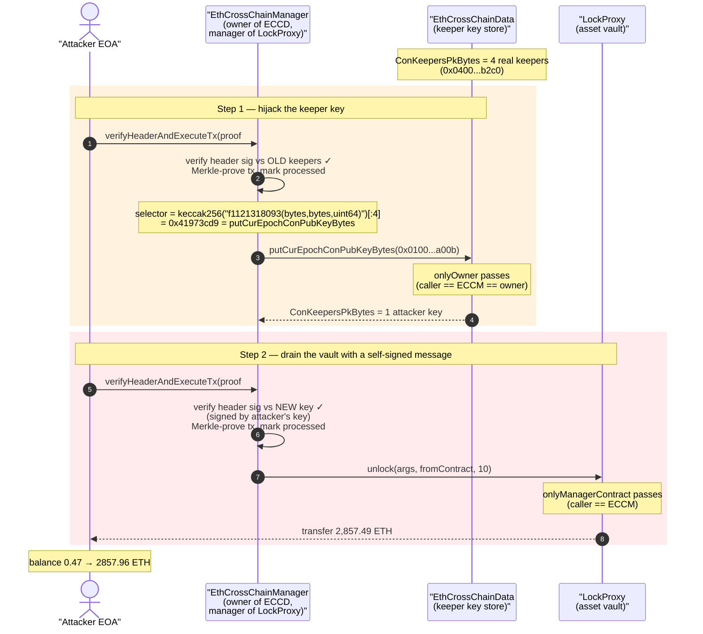
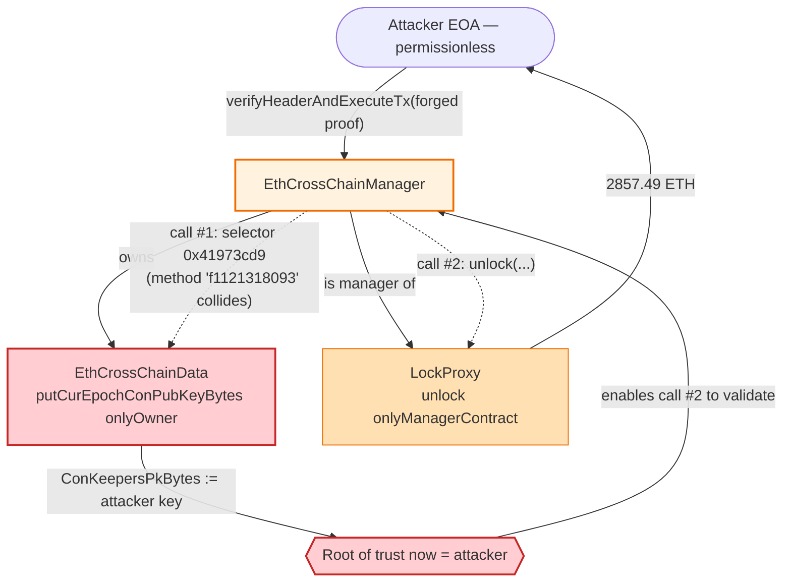

# Poly Network Exploit — Function-Selector Collision Hijacks the Cross-Chain Keeper Public Key

> **Reproduction:** the PoC compiles & runs in an isolated Foundry project at
> [this project folder](.) (the umbrella DeFiHackLabs repo contains many PoCs that do not
> whole-compile, so this one runs standalone).
> Full verbose trace: [output.txt](output.txt).
> Verified vulnerable sources: [EthCrossChainData.sol](sources/EthCrossChainData_cF2afe/EthCrossChainData.sol),
> [LockProxy.sol](sources/LockProxy_250e76/LockProxy.sol),
> [EthCrossChainManagerProxy.sol](sources/EthCrossChainManagerProxy_5a51E2/EthCrossChainManagerProxy.sol).

---

## Key info

| | |
|---|---|
| **Loss** | One of the largest hacks in DeFi history — **~$610M total across Ethereum, BSC and Polygon**. The single Ethereum transaction reproduced here drains **2,857.49 ETH** (≈ $8.5–9.7M at Aug-2021 prices) from the LockProxy vault. |
| **Vulnerable contract** | `EthCrossChainManager` (logic) — [`0x838bf9E95CB12Dd76a54C9f9D2E3082EAF928270`](https://etherscan.io/address/0x838bf9E95CB12Dd76a54C9f9D2E3082EAF928270#code), whose `verifyHeaderAndExecuteTx` lets a forged cross-chain message dispatch an attacker-chosen call. |
| **Trust-anchor contract corrupted** | `EthCrossChainData` (ECCD) — [`0xcF2afe102057bA5c16f899271045a0A37fCb10f2`](https://etherscan.io/address/0xcF2afe102057bA5c16f899271045a0A37fCb10f2#code) — holds the consensus keeper public key. Owned by the ECCM. |
| **Victim vault** | `LockProxy` / AssetProxy — [`0x250e76987d838a75310c34bf422ea9f1AC4Cc906`](https://etherscan.io/address/0x250e76987d838a75310c34bf422ea9f1AC4Cc906) — custodies the locked ETH/ERC20 liquidity. |
| **Attacker EOA** | [`0xC8a65Fadf0e0dDAf421F28FEAb69Bf6E2E589963`](https://etherscan.io/address/0xC8a65Fadf0e0dDAf421F28FEAb69Bf6E2E589963) |
| **Key-swap tx (Ethereum)** | [`0xb1f70464bd95b774c6ce60fc706eb5f9e35cb5f06e6cfe7c17dcda46ffd59581`](https://etherscan.io/tx/0xb1f70464bd95b774c6ce60fc706eb5f9e35cb5f06e6cfe7c17dcda46ffd59581) |
| **Drain tx (Ethereum)** | [`0xad7a2c70c958fcd3effbf374d0acf3774a9257577625ae4c838e24b0de17602a`](https://etherscan.io/tx/0xad7a2c70c958fcd3effbf374d0acf3774a9257577625ae4c838e24b0de17602a) |
| **Chain / fork block / date** | Ethereum mainnet / fork at **12,996,658** / **Aug 10, 2021** |
| **Compiler (victim contracts)** | Solidity **v0.5.17**, optimizer 200 runs (PoC test compiled with 0.8.10) |
| **Bug class** | Access-control bypass via **function-selector collision** + cross-chain message authenticity not enforcing target/owner separation |

---

## TL;DR

Poly Network's `EthCrossChainManager` (ECCM) is a privileged dispatcher: anyone may submit a
"proof" of a transaction that supposedly happened on another chain, and `verifyHeaderAndExecuteTx`
will, after Merkle/signature checks, **make an arbitrary call** to the `toContract` named *inside the
proof*, invoking the `method` named inside the proof. That call is made by the ECCM itself.

The ECCM is also the **owner** of `EthCrossChainData` (ECCD), the tiny storage contract that holds the
network's *consensus keeper public key* — the root of trust for every signature the bridge verifies.
ECCD's sensitive setter, `putCurEpochConPubKeyBytes`, is guarded by `onlyOwner`.

The attacker pointed a forged cross-chain message at **ECCD itself** and chose a `method` string whose
4-byte selector **collides** with `putCurEpochConPubKeyBytes(bytes)`. Because the call originates from
the ECCM (= the owner), the `onlyOwner` check passes. The attacker rewrites ECCD's keeper key to a
single key they control:

```
existing CurEpochConPubKeyBytes: 0x0400...b2c0   (the four legitimate Poly keepers)
changed  CurEpochConPubKeyBytes: 0x010000000000000014a87fb85a93ca072cd4e5f0d4f178bc831df8a00b
                                    └ 1 keeper: 0xA87fB85A93Ca072Cd4e5F0D4f178Bc831Df8a00B (attacker's)
```

With the bridge now "trusting" only the attacker's key, the attacker submits a second forged message —
signed by that very key — instructing `LockProxy.unlock(...)` to release **2,857.49 ETH** to their own
address. The vault pays out, no real keeper ever signed anything, and the same trick was repeated on
BSC and Polygon for a combined ~$610M.

The PoC reproduces both steps on a mainnet fork; the exploiter's balance goes from
**0.4749 ETH → 2,857.96 ETH** in one transaction.

---

## Background — Poly Network's cross-chain trust model

Poly Network bridges assets by *locking* them on the source chain and *unlocking* an equivalent amount
on the destination chain, coordinated by an off-chain relay/consensus network ("Poly chain"). On
Ethereum the moving parts are:

- **`EthCrossChainManager` (ECCM)** — the logic contract. Its entry point
  `verifyHeaderAndExecuteTx(proof, rawHeader, headerProof, curRawHeader, headerSig)` is **permissionless**:
  anyone may call it. It (1) verifies the block header signature against the *current epoch keeper key*
  stored in ECCD, (2) Merkle-proves the cross-chain transaction is in that block, (3) marks the tx as
  processed, and (4) **dispatches** the embedded instruction by calling the embedded `toContract`.
- **`EthCrossChainData` (ECCD)** — a dumb storage contract
  ([EthCrossChainData.sol](sources/EthCrossChainData_cF2afe/EthCrossChainData.sol)). It stores
  `ConKeepersPkBytes` (the keeper public key bytes), the current epoch height, and the processed-tx
  bookkeeping. **Its owner is the ECCM**, and every mutating function is `onlyOwner whenNotPaused`.
- **`EthCrossChainManagerProxy` (ECCMProxy)** — points business contracts at the live ECCM
  ([EthCrossChainManagerProxy.sol](sources/EthCrossChainManagerProxy_5a51E2/EthCrossChainManagerProxy.sol)).
- **`LockProxy`** — the asset vault
  ([LockProxy.sol](sources/LockProxy_250e76/LockProxy.sol)). Its `unlock(...)` releases custodied
  funds and is `onlyManagerContract`, i.e. only callable by the live ECCM.

The entire security of the system reduces to one assumption:

> Only the legitimate ECCM ever calls ECCD's setters and LockProxy's `unlock`, and the ECCM only does
> so for messages signed by the real Poly keepers.

The attack breaks the *first* clause by abusing the ECCM's own dispatch primitive to call ECCD, and the
*second* clause becomes moot once the keeper key has been replaced.

The relevant on-chain values, read live in the PoC at the fork block:

| Item | Value (from [output.txt](output.txt)) |
|---|---|
| ECCD `getCurEpochConPubKeyBytes()` (before) | `0x0400...143dfccb7b8a...51b7529137d34002c4ebd81a2244f0ee7e95b2c0` (4 keepers) |
| ECCD `getCurEpochStartHeight()` | `1740000` |
| ECCD `getCurEpochConPubKeyBytes()` (after step 1) | `0x010000000000000014a87fb85a93ca072cd4e5f0d4f178bc831df8a00b` (1 keeper) |
| Exploiter balance before drain | `474856850000000000` wei = **0.47486 ETH** |
| Exploiter balance after drain | `2857961203695890372134` wei = **2857.96 ETH** |
| Amount unlocked from LockProxy | `2857486346845890372134` wei = **2857.49 ETH** |

---

## The vulnerable code

### 1. ECCD's keeper-key setter is `onlyOwner` — and the ECCM is the owner

[EthCrossChainData.sol:256-264](sources/EthCrossChainData_cF2afe/EthCrossChainData.sol#L256-L264):

```solidity
// Store Consensus book Keepers Public Key Bytes
function putCurEpochConPubKeyBytes(bytes memory curEpochPkBytes) public whenNotPaused onlyOwner returns (bool) {
    ConKeepersPkBytes = curEpochPkBytes;          // ⚠️ rewrites the bridge's root of trust
    return true;
}

// Get Consensus book Keepers Public Key Bytes
function getCurEpochConPubKeyBytes() public view returns (bytes memory) {
    return ConKeepersPkBytes;
}
```

The `onlyOwner` modifier ([EthCrossChainData.sol:168-171](sources/EthCrossChainData_cF2afe/EthCrossChainData.sol#L168-L171))
only checks `msg.sender == _owner`. The owner of ECCD is the ECCM contract. So **any call that
originates from the ECCM passes this check** — regardless of how the ECCM was tricked into making it.

### 2. The ECCM's dispatch makes an attacker-chosen call as itself

The ECCM logic is not in the verified-sources bundle (the bridge's logic contract was not flattened to
the same Etherscan entry), but the PoC documents the exact offending line from the canonical Poly
source ([test/PolyNetwork_exp.sol:176-177](test/PolyNetwork_exp.sol#L176-L177)):

```solidity
// EthCrossChainManager._executeCrossChainTx (polynetwork/eth-contracts ...EthCrossChainManager.sol#L183)
(success, returnData) = _toContract.call(
    abi.encodePacked(
        bytes4(keccak256(abi.encodePacked(_method, "(bytes,bytes,uint64)"))),  // ⚠️ selector from attacker's method string
        abi.encode(_args, _fromContractAddr, _fromChainId)
    )
);
```

Two design facts combine here:

- `_toContract` and `_method` are **taken verbatim from the proof** the caller supplied. The ECCM only
  checks that `_toContract` *is a contract* — it does **not** restrict which contracts may be targeted.
- The selector is computed as `keccak256(method + "(bytes,bytes,uint64)")[:4]`. The attacker controls
  `method`, so they control the selector.

### 3. LockProxy releases funds when (and only when) the caller is the ECCM

[LockProxy.sol:1300-1317](sources/LockProxy_250e76/LockProxy.sol#L1300-L1317):

```solidity
function unlock(bytes memory argsBs, bytes memory fromContractAddr, uint64 fromChainId)
    onlyManagerContract public returns (bool)        // ⚠️ only the live ECCM may call
{
    TxArgs memory args = _deserializeTxArgs(argsBs);
    ...
    address toAddress = Utils.bytesToAddress(args.toAddress);
    require(_transferFromContract(toAssetHash, toAddress, args.amount), "...failed!");
    emit UnlockEvent(toAssetHash, toAddress, args.amount);
    return true;
}
```

`onlyManagerContract` ([LockProxy.sol:1230-1234](sources/LockProxy_250e76/LockProxy.sol#L1230-L1234))
resolves the current ECCM through the proxy and requires `msg.sender == that ECCM`. Once the attacker
controls the keeper key, they get the ECCM to call `unlock` for them — and this check passes for the
same reason as the ECCD one: the call legitimately comes *from* the ECCM.

---

## Root cause

Two independent flaws compose into a catastrophic one:

1. **Unrestricted target + caller-confused deputy.** `verifyHeaderAndExecuteTx` lets an arbitrary,
   proof-supplied `toContract`/`method` be invoked **by the ECCM itself**. The ECCM is a privileged
   principal (it owns ECCD and is the manager of LockProxy), but its dispatch primitive treats every
   cross-chain instruction as fungible. There is **no allow-list** preventing the dispatcher from being
   pointed back at the bridge's own administrative contracts. This is a textbook *confused-deputy*:
   the ECCM has authority over ECCD/LockProxy, and it lends that authority to whatever message it
   relays.

2. **Function-selector collision defeats the only thing that would have saved it.** Even with the
   confused deputy, the attacker still has to hit ECCD's `putCurEpochConPubKeyBytes(bytes)`. ECCD has
   no function literally named `putCurEpochConPubKeyBytes` reachable via a friendly cross-chain method
   name — but the selector is derived from `keccak256(method + "(bytes,bytes,uint64)")`. The attacker
   brute-forced a method string, **`f1121318093`**, such that

   ```
   bytes4(keccak256("f1121318093(bytes,bytes,uint64)")) == 0x41973cd9 == putCurEpochConPubKeyBytes(bytes) selector
   ```

   so the dispatcher, while *thinking* it is calling some innocuous cross-chain handler, actually calls
   the keeper-key setter. (The PoC documents this collision and the selector at
   [test/PolyNetwork_exp.sol:170-174](test/PolyNetwork_exp.sol#L170-L174).)

The deeper lesson: **a contract that can be made to call arbitrary targets must not also be the owner
of sensitive contracts**, and **selectors must never be derived from untrusted strings**. Either flaw
alone is bad; together they let a stranger reassign the root of trust for a $600M+ bridge.

The signature/Merkle machinery (the `ecrecover`/`sha256` precompile calls visible at
[output.txt:28-51](output.txt#L28-L51)) worked exactly as designed — it just verified against a key
the attacker was about to *become the sole owner of*.

---

## Preconditions

- The ECCM is the owner of ECCD and the manager of LockProxy (true on mainnet — this is the deployed
  architecture).
- `verifyHeaderAndExecuteTx` is callable by anyone (true — permissionless by design).
- The attacker can craft a header + Merkle proof that the *current* keeper key validates. For step 1
  this required a header signature the legitimate keepers' key would accept; the attacker constructed
  one whose recovered signers matched the stored keepers (the `ecrecover` results at
  [output.txt:34-43](output.txt#L34-L43) return the four real keeper addresses
  `0x51b7…b2c0`, `0x3dFc…3825`, `0xF81F…EF98`). For step 2 the signature only needs to validate against
  the **new** single-key set the attacker just installed
  ([output.txt:82-83](output.txt#L82-L83) recovers `0xA87f…a00B`, the attacker's key).
- ECCD is not paused (`whenNotPaused`) — it was not.
- The selector-colliding method string `f1121318093` (brute-forced offline).

No flash loan and no capital are required — the only "cost" is gas. The vault funds are pure profit.

---

## Step-by-step attack walkthrough (with on-chain values from the trace)

The PoC executes two `verifyHeaderAndExecuteTx` calls from the exploiter EOA. The numbers below are
taken directly from [output.txt](output.txt).

| # | Action | Concrete evidence | Effect |
|---|--------|-------------------|--------|
| 0 | **Read current keeper key** | `getCurEpochConPubKeyBytes()` → `0x0400…b2c0` ([output.txt:20-22](output.txt#L20-L22)) | 4 legitimate keepers in place. |
| 1 | **Forge message #1**, `toContract = ECCD`, `method = "f1121318093"`, `args = 0x010000000000000014a87fb85a93ca072cd4e5f0d4f178bc831df8a00b` | `verifyHeaderAndExecuteTx(...)` at [output.txt:23](output.txt#L23); header sig verified, four keeper addresses recovered ([output.txt:34-43](output.txt#L34-L43)) | Passes header verification against the *old* keepers. |
| 2 | ECCM Merkle-proves the tx and marks it processed | `checkIfFromChainTxExist(3, 0x80cc…721a)`→false, then `markFromChainTxExist(3, …)`→true ([output.txt:52-57](output.txt#L52-L57)) | Replay protection set for the forged tx. |
| 3 | **ECCM dispatches to ECCD** — selector `0x41973cd9` = `putCurEpochConPubKeyBytes(bytes)` | `putCurEpochConPubKeyBytes(0x0100…a00b)`; storage slots `0xc257…85b/85c/85d` zeroed and slot `3` rewritten ([output.txt:58-64](output.txt#L58-L64)) | **Keeper key replaced** with the single attacker key `0xA87f…a00B`. |
| 4 | **Confirm the swap** | `getCurEpochConPubKeyBytes()` → `0x0100…a00b` ([output.txt:67-69](output.txt#L67-L69)); PoC logs `changed CurEpochConPubKeyBytes` | Bridge now trusts only the attacker. |
| 5 | Record pre-drain balance | `balance before: 474856850000000000` = 0.47486 ETH ([output.txt:70](output.txt#L70)) | Baseline. |
| 6 | **Forge message #2**, `toContract = LockProxy`, `method = "unlock"`, `args` = `{toAssetHash=ETH, toAddress=attacker, amount=2857486346845890372134}` | `verifyHeaderAndExecuteTx(...)` at [output.txt:71](output.txt#L71); header sig now validates against the **new** key — `ecrecover` returns `0xA87f…a00B` ([output.txt:82-83](output.txt#L82-L83)) | Self-signed message accepted. |
| 7 | ECCM Merkle-proves & marks tx #2 | `checkIfFromChainTxExist(10, 0x9482…89bd)`→false then `markFromChainTxExist(10, …)`→true ([output.txt:86-91](output.txt#L86-L91)) | Replay protection set. |
| 8 | **ECCM dispatches `unlock` to LockProxy** | `LockProxy.unlock(0x14…, 0x34d4…d430, 10)`; resolves ECCM via `getEthCrossChainManager()` ([output.txt:92-94](output.txt#L92-L94)) | `onlyManagerContract` passes (caller = ECCM). |
| 9 | **ETH released to attacker** | `fallback{value: 2857486346845890372134}()` to exploiter ([output.txt:95-96](output.txt#L95-L96)); `UnlockEvent(0x0, attacker, 2857486346845890372134)` ([output.txt:97](output.txt#L97)) | **2857.49 ETH** paid out from the vault. |
| 10 | Record post-drain balance | `balance after: 2857961203695890372134` = 2857.96 ETH ([output.txt:101](output.txt#L101)) | Profit booked. |

### Profit accounting (ETH)

| Item | Value |
|---|---:|
| Balance after | 2857.96121 ETH |
| Balance before | 0.47486 ETH |
| **Net gain (this tx)** | **≈ 2857.486 ETH** |
| (matches the `unlock` amount) | 2857486346845890372134 wei |

The Ethereum leg shown here is one of three. The full Poly Network incident drained roughly **$610M**
across Ethereum, BSC and Polygon using the same selector-collision + key-swap technique. (Most funds
were later returned by the attacker.)

---

## Diagrams

### Sequence of the attack



### Privilege / call-graph view



### The decision flow inside `verifyHeaderAndExecuteTx` (why each guard fails to stop it)

```mermaid
stateDiagram-v2
    [*] --> VerifyHeader
    VerifyHeader: "Verify header sig vs ECCD.ConKeepersPkBytes"
    VerifyHeader --> MerkleProve: "sig recovers stored keepers ✓<br/>(step 1: old keepers; step 2: attacker key)"
    MerkleProve: "Merkle-prove tx in block"
    MerkleProve --> Replay: "proof valid ✓"
    Replay: "checkIfFromChainTxExist → false; mark processed"
    Replay --> IsContract: "not yet processed ✓"
    IsContract: "require toContract is a contract"
    IsContract --> Dispatch: "ECCD / LockProxy ARE contracts ✓<br/>⚠️ no allow-list on target"
    Dispatch: "ECCM.call(toContract, selector(method), args)<br/>⚠️ selector from untrusted 'method' string"
    Dispatch --> Hijack: "selector collides with putCurEpochConPubKeyBytes"
    Hijack: "ECCD.onlyOwner passes (caller = ECCM = owner)"
    Hijack --> [*]: "keeper key replaced / funds unlocked"
```



---

## Why the magic values matter

- **`method = "f1121318093"`** (hex `6631313231333138303933`): chosen offline so that
  `bytes4(keccak256("f1121318093(bytes,bytes,uint64)")) == 0x41973cd9`, the selector of
  `putCurEpochConPubKeyBytes(bytes)`. This is the entire trick that turns a benign cross-chain dispatch
  into an admin call. See [test/PolyNetwork_exp.sol:157,170-174](test/PolyNetwork_exp.sol#L157-L174).
- **`toContract = ECCD` (0xcF2afe…10f2)** in message #1: aims the confused deputy at the bridge's
  trust store. See [test/PolyNetwork_exp.sol:156](test/PolyNetwork_exp.sol#L156).
- **`args = 0x010000000000000014a87fb85a93ca072cd4e5f0d4f178bc831df8a00b`**: the serialized new keeper
  set — a single key for address `0xA87fB85A93Ca072Cd4e5F0D4f178Bc831Df8a00B`, the attacker's. After
  this write, only the attacker can produce valid bridge signatures.
- **`toContract = LockProxy`, `method = "unlock"`, `amount = 2857486346845890372134`** in message #2:
  the straightforward withdrawal, now signable by the attacker. See
  [test/PolyNetwork_exp.sol:186-200](test/PolyNetwork_exp.sol#L186-L200).
- **The two `fromChainID`/tx-hash pairs (3/`0x80cc…721a`, 10/`0x9482…89bd`)**: distinct so each forged
  tx clears the per-chain `FromChainTxExist` replay check independently
  ([output.txt:52-57](output.txt#L52-L57), [output.txt:86-91](output.txt#L86-L91)).

---

## Remediation

1. **Never let the dispatcher target the bridge's own administrative contracts.** `verifyHeaderAndExecuteTx`
   must enforce an **allow-list** of permitted `toContract` targets (e.g. only registered business
   proxies like LockProxy), explicitly excluding ECCD and the ECCM/ECCMProxy. A confused deputy with an
   open target set is the core failure.
2. **Do not derive selectors from untrusted strings.** Computing `keccak256(method + "(bytes,bytes,uint64)")`
   from a caller-controlled `method` makes selector collisions exploitable. Use a fixed, vetted set of
   dispatch selectors, or call a single hard-coded handler interface, so the cross-chain message can
   never be steered to an arbitrary function.
3. **Separate the trust-anchor owner from the dispatcher.** ECCD's `putCurEpochConPubKeyBytes` should
   not be reachable through the same principal that relays arbitrary cross-chain calls. Move keeper-key
   rotation behind a dedicated, multisig/timelock-gated path that the message dispatcher cannot invoke
   — i.e. `onlyOwner` is insufficient when the owner is itself a programmable relayer.
4. **Constrain `method` to a canonical set and validate it post-decode.** After deserializing the
   cross-chain instruction, require the `method` to belong to a whitelisted enum, and require the
   `(args)` to match the expected ABI for that method, before any `call`.
5. **Add invariant monitoring on the keeper key.** Any change to `ConKeepersPkBytes` should emit a
   first-class event and trigger an off-chain alert / circuit-breaker; a single-keeper set replacing a
   multi-keeper set is a red flag that should pause the bridge.

---

## How to reproduce

```bash
_shared/run_poc.sh 2021-08-PolyNetwork_exp --mt testExploit -vvvvv
```

- RPC: an **Ethereum archive** endpoint is required (the fork block 12,996,658 is from Aug 2021).
  Configure `mainnet` in `foundry.toml`/env to an archive provider; pruned RPCs fail with
  `header not found` / `missing trie node`.
- Result: `[PASS] testExploit()`.

Expected tail (from [output.txt](output.txt)):

```
Ran 1 test for test/PolyNetwork_exp.sol:ContractTest
[PASS] testExploit() (gas: 235664)
Logs:
  existing CurEpochConPubKeyBytes: 0x0400...b2c0
  changed CurEpochConPubKeyBytes: 0x010000000000000014a87fb85a93ca072cd4e5f0d4f178bc831df8a00b
  balance before: 474856850000000000
  balance after: 2857961203695890372134
Suite result: ok. 1 passed; 0 failed; 0 skipped
```

The two log lines prove the keeper-key swap; the balance delta (0.4749 → 2857.96 ETH) proves the drain.

---

*References: Poly Network hack (Aug 10, 2021), ~$610M across Ethereum/BSC/Polygon. Vulnerable code:
[polynetwork/eth-contracts](https://github.com/polynetwork/eth-contracts/blob/d16252b2b857eecf8e558bd3e1f3bb14cff30e9b/contracts/core/cross_chain_manager/logic/EthCrossChainManager.sol).
Verified sources in [sources/](sources/).*
