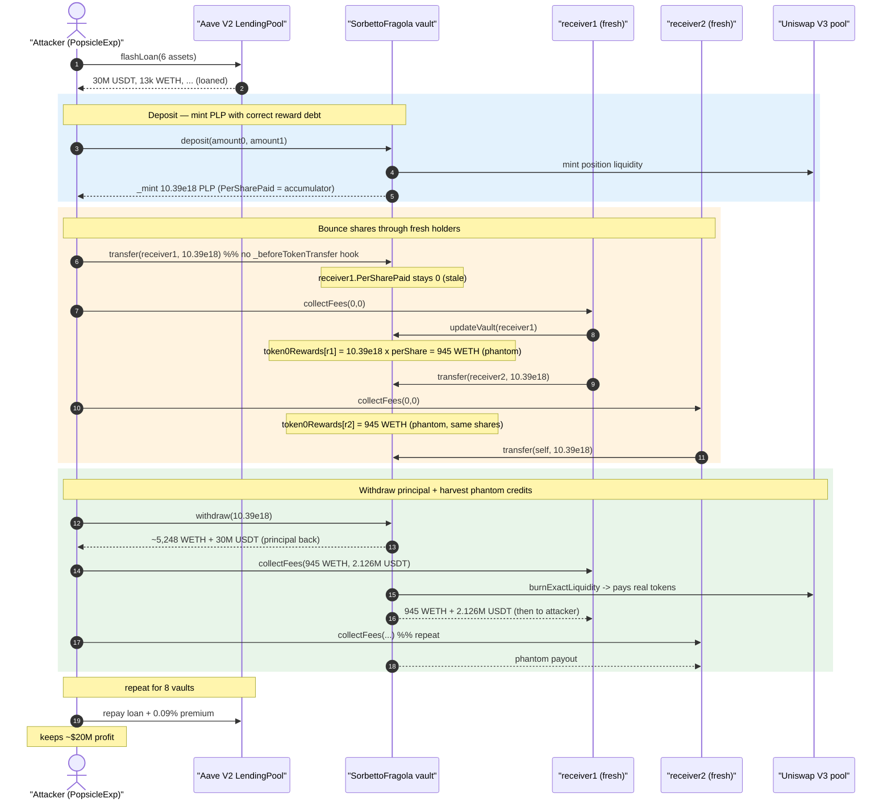
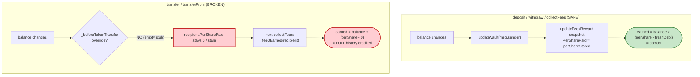
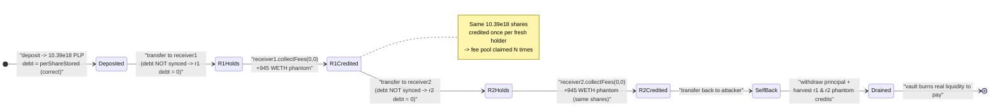

# Popsicle Finance (Sorbetto Fragola) Exploit — LP-Token Transfer Skips Reward-Debt Sync

> **Reproduction:** the PoC compiles & runs in an isolated Foundry project at
> [this project folder](.) (the umbrella DeFiHackLabs repo
> contains many unrelated PoCs that don't whole-compile, so this one was extracted).
> Full verbose trace: [output.txt](output.txt).
> Verified vulnerable source: [SorbettoFragola.sol](sources/SorbettoFragola_c4ff55/SorbettoFragola.sol).

---

## Key info

| | |
|---|---|
| **Loss** | ~$20.7M across 8 vaults — e.g. 2,101,236.92 USDT + 2,203,367.84 USDC + 1,318.94 WETH + 48.37 WBTC + 163,646.20 DAI + 6,630.66 UNI drained by this PoC at the fork block |
| **Vulnerable contract** | `SorbettoFragola` (Popsicle "PLP" vault) — e.g. USDT/WETH vault [`0xc4ff55a4329f84f9Bf0F5619998aB570481EBB48`](https://etherscan.io/address/0xc4ff55a4329f84f9Bf0F5619998aB570481EBB48#code) |
| **Victim vaults** | 8 SorbettoFragola vaults: `0xc4ff55…`, `0xd63b34…`, `0x0A8143…`, `0x98d149…`, `0xB53Dc3…`, `0x6f3F35…`, `0xDD9011…`, `0xE22EAC…` |
| **Attacker EOA** | [`0xf9E3D08196F76f5078882d98941b71C0884BEa52`](https://etherscan.io/address/0xf9E3D08196F76f5078882d98941b71C0884BEa52) |
| **Attacker contract** | [`0xdFb6faB7f4bc9512d5620e679E90D1C91C4EAdE6`](https://etherscan.io/address/0xdFb6faB7f4bc9512d5620e679E90D1C91C4EAdE6) |
| **Attack tx** | [`0xcd7dae143a4c0223349c16237ce4cd7696b1638d116a72755231ede872ab70fc`](https://etherscan.io/tx/0xcd7dae143a4c0223349c16237ce4cd7696b1638d116a72755231ede872ab70fc) |
| **Chain / fork block / date** | Ethereum / 12,955,000 / Aug 3–4, 2021 |
| **Compiler** | Solidity v0.7.6, optimizer 800 runs |
| **Bug class** | Missing reward-debt synchronization on LP-token `transfer` (MasterChef-style accounting bug) |

---

## TL;DR

`SorbettoFragola` is a Uniswap-V3 liquidity-manager vault. It mints an ERC20 receipt token
("PLP") for depositors and tracks each user's claimable trading fees with a MasterChef-style
"reward-per-share / reward-debt" ledger (`UserInfo`,
[SorbettoFragola.sol:2280-2285](sources/SorbettoFragola_c4ff55/SorbettoFragola.sol#L2280-L2285)).

The reward ledger is only ever re-synchronized inside the `updateVault(...)` modifier, which is
attached to `deposit`, `withdraw`, and `collectFees`
([:2752-2755](sources/SorbettoFragola_c4ff55/SorbettoFragola.sol#L2752-L2755)). It is **NOT**
called when PLP tokens move via a plain ERC20 `transfer` — because the vault never overrides
`_beforeTokenTransfer` (the base ERC20 hook at
[:1661](sources/SorbettoFragola_c4ff55/SorbettoFragola.sol#L1661) is an empty stub).

Consequence: when PLP shares are transferred to a **fresh** address, that address inherits the
shares but its reward debt `token{0,1}PerSharePaid` stays at the default **0**. The very next
`collectFees`/`updateVault` call computes its earned fees as

```
earned = balanceOf(account) × (token0PerShareStored − 0) / 1e18
```

i.e. it credits the recipient with **the entire lifetime accumulated fee-per-share** as though it
had held those shares since the vault's inception — even though it received them milliseconds ago
and contributed nothing.

The attacker flash-loans six assets from Aave V2, then for **each** of the 8 vaults:

1. Deposits to mint PLP shares (with correctly-updated reward debt for itself).
2. "Bounces" the PLP shares through two fresh helper contracts (`receiver1`, `receiver2`), calling
   `collectFees(0,0)` from each so that each fresh holder gets credited the full per-share fee pool
   for the duration it momentarily holds the shares.
3. Withdraws its own position, then harvests the phantom fee credits from `receiver1` and
   `receiver2` via `collectFees(...)`.

Because the fee pool's underlying value (the protocol's whole Uniswap-V3 position fee balance +
position liquidity) is finite, each "harvest" pulls real tokens out of the vault — the vault simply
burns position liquidity (`collectFees` else-branch,
[:2741-2745](sources/SorbettoFragola_c4ff55/SorbettoFragola.sol#L2741-L2745)) to honor the inflated,
double/triple-counted claims. The flash loan is repaid and the attacker keeps the difference.

---

## Background — what SorbettoFragola does

`SorbettoFragola` ([source](sources/SorbettoFragola_c4ff55/SorbettoFragola.sol)) is the core vault of
Popsicle Finance's "Sorbetto Fragola" product: an actively-managed Uniswap-V3 LP position.

- **Deposit / Withdraw.** Users `deposit(amount0, amount1)`; the vault mints them into the V3 pool
  position and issues PLP receipt tokens proportional to liquidity
  ([:2427-2484](sources/SorbettoFragola_c4ff55/SorbettoFragola.sol#L2427-L2484)).
- **Fee accounting.** Uniswap-V3 trading fees accrue to the vault's single shared position. The
  vault distributes them to PLP holders with the classic per-share accumulator pattern:
  - `token0PerShareStored` / `token1PerShareStored` — global accumulator of fees-per-share
    ([:2380-2382](sources/SorbettoFragola_c4ff55/SorbettoFragola.sol#L2380-L2382)).
  - per-user `UserInfo { token0Rewards, token1Rewards, token0PerSharePaid, token1PerSharePaid }` —
    pending rewards + the snapshot of the accumulator at the user's last interaction ("reward debt")
    ([:2280-2285](sources/SorbettoFragola_c4ff55/SorbettoFragola.sol#L2280-L2285)).
- **Harvest.** `collectFees(amount0, amount1)` lets a user claim up to `user.token{0,1}Rewards`,
  paying out of the vault's idle balance or — if insufficient — by burning position liquidity
  ([:2727-2749](sources/SorbettoFragola_c4ff55/SorbettoFragola.sol#L2727-L2749)).

The whole design assumes the per-user reward debt is kept in lock-step with PLP balances. That
invariant holds for `deposit`/`withdraw`/`collectFees` but is silently broken for raw transfers.

---

## The vulnerable code

### 1. The reward ledger is only synced inside `updateVault`

```solidity
// Function modifier that calls update fees reward function
modifier updateVault(address account) {
    _updateFeesReward(account);
    _;
}
```
[SorbettoFragola.sol:2752-2755](sources/SorbettoFragola_c4ff55/SorbettoFragola.sol#L2752-L2755)

```solidity
function _updateFeesReward(address account) internal {
    uint liquidity = pool.positionLiquidity(tickLower, tickUpper);
    if (liquidity == 0) return; // we can't poke when liquidity is zero
    (uint256 collect0, uint256 collect1) = _earnFees();

    token0PerShareStored = _tokenPerShare(collect0, token0PerShareStored);
    token1PerShareStored = _tokenPerShare(collect1, token1PerShareStored);

    if (account != address(0)) {
        UserInfo storage user = userInfo[msg.sender];          // (see note)
        user.token0Rewards     = _fee0Earned(account, token0PerShareStored);
        user.token0PerSharePaid = token0PerShareStored;
        user.token1Rewards     = _fee1Earned(account, token1PerShareStored);
        user.token1PerSharePaid = token1PerShareStored;
    }
}
```
[SorbettoFragola.sol:2766-2783](sources/SorbettoFragola_c4ff55/SorbettoFragola.sol#L2766-L2783)

```solidity
function _fee0Earned(address account, uint256 fee0PerShare_) internal view returns (uint256) {
    UserInfo memory user = userInfo[account];
    return
        balanceOf(account)
        .mul(fee0PerShare_.sub(user.token0PerSharePaid))   // ← (perShareStored − rewardDebt)
        .unsafeDiv(1e18)
        .add(user.token0Rewards);
}
```
[SorbettoFragola.sol:2786-2793](sources/SorbettoFragola_c4ff55/SorbettoFragola.sol#L2786-L2793)

For a brand-new account `user.token0PerSharePaid == 0`, so `_fee0Earned` returns
`balanceOf(account) × token0PerShareStored / 1e18` — the *full* historical per-share fee times the
account's balance.

### 2. The ERC20 transfer hook is never overridden

```solidity
function _beforeTokenTransfer(address from, address to, uint256 amount) internal virtual { }
```
[SorbettoFragola.sol:1661](sources/SorbettoFragola_c4ff55/SorbettoFragola.sol#L1661)

`SorbettoFragola is ERC20Permit, ReentrancyGuard, ISorbettoFragola`
([:2262](sources/SorbettoFragola_c4ff55/SorbettoFragola.sol#L2262)) provides **no override** of this
hook. A plain `transfer()`/`transferFrom()` therefore moves PLP balances **without ever calling
`_updateFeesReward`** for the sender or the recipient. The reward debt of both parties is left stale.

### 3. The payout will burn pool liquidity to honor inflated claims

```solidity
function collectFees(uint256 amount0, uint256 amount1) external nonReentrant updateVault(msg.sender) {
    UserInfo storage user = userInfo[msg.sender];
    require(user.token0Rewards >= amount0, "A0R");
    require(user.token1Rewards >= amount1, "A1R");
    ...
    if (balance0 >= amount0 && balance1 >= amount1) {
        if (amount0 > 0) pay(token0, address(this), msg.sender, amount0);
        ...
    } else {
        uint128 liquidity = pool.liquidityForAmounts(amount0, amount1, tickLower, tickUpper);
        (amount0, amount1) = pool.burnExactLiquidity(tickLower, tickUpper, liquidity, msg.sender);  // ← real value out
    }
    user.token0Rewards = user.token0Rewards.sub(amount0);
    user.token1Rewards = user.token1Rewards.sub(amount1);
    emit RewardPaid(msg.sender, amount0, amount1);
}
```
[SorbettoFragola.sol:2727-2749](sources/SorbettoFragola_c4ff55/SorbettoFragola.sol#L2727-L2749)

The `require(user.token{0,1}Rewards >= amount)` check is the only guard, and the attacker has just
inflated `token{0,1}Rewards` on the fresh receiver to an arbitrary value, so the check passes and the
vault drains genuine LP liquidity to the attacker.

---

## Root cause — why it was possible

A MasterChef-style fee-per-share ledger has exactly one invariant that *must* hold:

> Whenever an account's share balance changes, its reward debt must be re-snapshotted to the current
> accumulator *first*. Otherwise the next reward calculation pays out fees for shares the account
> didn't actually hold during accrual.

`SorbettoFragola` enforces this only on the three "official" entry points (`deposit`, `withdraw`,
`collectFees`) but the PLP token is a **transferable ERC20**. The single missing line — an override
of `_beforeTokenTransfer` that calls `_updateFeesReward(from)` and `_updateFeesReward(to)` — turns
the transfer path into an accounting hole:

1. **Transfer doesn't update sender debt** → the sender keeps its pending rewards even after handing
   the shares away (its `token{0,1}Rewards` were set on a prior `updateVault` and aren't reduced).
2. **Transfer doesn't update recipient debt** → the recipient's `PerSharePaid` is left at its old
   (or default-zero) value, so its very next `_fee{0,1}Earned` over-credits it by
   `balanceOf × (perShareStored − staleDebt)`.

By sending the *same* PLP shares to two fresh helper contracts and harvesting from each, the
attacker claims the per-share fee pool **multiple times over** with a single underlying deposit. The
vault has no notion that the same shares are being reused; it only checks the per-account
`token{0,1}Rewards` counters, each of which the attacker freshly inflated.

A secondary code smell (not the primary bug) sits at
[:2776](sources/SorbettoFragola_c4ff55/SorbettoFragola.sol#L2776): `_updateFeesReward` writes to
`userInfo[msg.sender]` while reading via `_fee{0,1}Earned(account, …)` from `userInfo[account]`.
Through the official entry points `account == msg.sender`, so this works; but it shows the ledger was
never designed to be poked for an account other than the caller — exactly what a transfer hook would
require — reinforcing that transfer-time accounting was simply forgotten.

---

## Preconditions

- The vault holds an active Uniswap-V3 position with accrued, undistributed fees — i.e.
  `token{0,1}PerShareStored > 0` and `positionLiquidity > 0` so `_updateFeesReward` does its work.
- PLP is a freely transferable ERC20 (it is) and the attacker controls ≥ 2 fresh recipient addresses
  (deployed `TokenVault` helpers in the PoC,
  [Popsicle_exp.sol:69-80](test/Popsicle_exp.sol#L69-L80)).
- Capital to seed a deposit large enough to corner the position; in the real incident and the PoC
  this is sourced from an Aave V2 flash loan of six assets
  ([Popsicle_exp.sol:166-170](test/Popsicle_exp.sol#L166-L170)), fully repaid intra-transaction,
  making the attack effectively capital-free.

---

## Attack walkthrough (with on-chain numbers from the trace)

The PoC loops over all 8 vaults; the numbers below are for the **USDT/WETH vault**
(`0xc4ff55…`, token0 = WETH, token1 = USDT) read directly from
[output.txt](output.txt). The helper contracts are `receiver1 = 0x5615…b72f` and
`receiver2 = 0x2e23…470b`.

| # | Step | Trace evidence | Effect |
|---|------|----------------|--------|
| 0 | **Flash loan** 30M USDT, 13k WETH, 1,400 WBTC, 30M USDC, 3M DAI, 200k UNI from Aave V2 | [output.txt:1662](output.txt) | Working capital, repaid at end. |
| 1 | **Deposit** 13,000 WETH-side → mint **10.39e18 PLP** to attacker; reward debt set correctly | `deposit(1.3e22, 3e13)` → `_mint(self, 10390775309744788971)` ([:1748](output.txt), [:1822](output.txt)) | Attacker holds shares with `PerSharePaid` snapshot = current accumulator (`token0PerSharePaid = 90946168205376514402`). |
| 2 | **Bounce → receiver1**: `transfer(receiver1, 10.39e18)` then `receiver1.collectFees(0,0)` | transfer at [:1860](output.txt) writes **only balance slots** (no UserInfo); receiver1 `collectFees(0,0)` writes `token0Rewards = 0x333a86afc12359fe6a = 945001199104322829930`, `token1Rewards = 0x1ef2cbb8673 = 2126759298675` ([:1885-1890](output.txt)) | **Phantom credit #1**: receiver1 is owed **945.0 WETH + 2,126,759 USDT** for shares it held for one call. |
| 3 | **Bounce → receiver2**: `receiver1.transfer(receiver2)` then `receiver2.collectFees(0,0)` | [:1893-1922](output.txt) | **Phantom credit #2** accrued on receiver2 for the same shares. |
| 4 | **Bounce back → attacker**: `receiver2.transfer(self)` then `self.collectFees(0,0)` | [:1930-1958](output.txt) | Shares returned to attacker for the withdraw. |
| 5 | **Withdraw** own position: `withdraw(10.39e18)` returns **5,248.9 WETH + 29,999,999,999,999 USDT** (≈ the deposit) | self `userInfo` = `(0,0, 90946…, 204677…)` before withdraw ([:1960-1964](output.txt)); withdraw returns 5.248e21 WETH / 2.999e13 USDT ([:2002-2008](output.txt)) | Attacker recovers its principal deposit. |
| 6 | **Harvest receiver1**: `receiver1.collectFees(945001199104322829930, 2126759298675)` | userInfo(receiver1) = `(945e..., 2126e..., …)` then `collectFees(9.45e20, 2.126e12)` burns pool liquidity ([:2020-2023](output.txt)) | Vault pays out the phantom 945 WETH + 2.126M USDT from real position liquidity. |
| 7 | **Harvest receiver2** identically | per-vault `Receiver2 - Token*Fees` logs ([:1553-1554](output.txt)) | Vault pays out receiver2's phantom credit. |
| 8 | Loop over the other 7 vaults, then **repay flash loan** + 0.09% premium | per-asset `Profit` logs ([:1597-1608](output.txt)) | Net profit kept by attacker. |

### Why the transfer leaves debt stale — storage proof

At [output.txt:1860-1865](output.txt) the `transfer(receiver1, 10.39e18)` emits `Transfer` and shows
storage changes touching **only the two ERC20 balance slots** (`@0x996b86…` set to the moved balance,
`@0x5ff105…` self's balance zeroed). No `userInfo[receiver1]` slot is written — receiver1's
`token0PerSharePaid` is still its default `0`. The subsequent `receiver1.collectFees(0,0)` then
computes `_fee0Earned(receiver1, 90946168205376514402) = 10.39e18 × (90946168205376514402 − 0) / 1e18
= 945001199104322829930` (= 945.0 WETH), exactly the value written to receiver1's `token0Rewards`
slot. That is the phantom fee credit in raw bytes.

---

## Profit / loss accounting

Per-asset net profit after repaying the flash loan (from
[output.txt:1597-1608](output.txt), confirmed by the post-attack balances at
[:1611-1616](output.txt)):

| Asset | Net profit | Decimals |
|---|---:|---|
| Tether USD (USDT) | 2,101,236.919013 | 6 |
| USD Coin (USDC) | 2,203,367.844533 | 6 |
| Wrapped Ether (WETH) | 1,318.942407865459912128 | 18 |
| Wrapped BTC (WBTC) | 48.36756457 | 8 |
| Dai Stablecoin (DAI) | 163,646.196662454128316353 | 18 |
| Uniswap (UNI) | 6,630.661777522581395369 | 18 |

At Aug-2021 prices that aggregates to roughly **$20M** — matching the PoC's
`@KeyInfo - Total Lost : 20M USD` header and BlockSec's post-mortem. The profit is funded entirely by
the eight vaults' real Uniswap-V3 position value: every phantom `collectFees` either pays out the
vault's idle balance or burns position liquidity, so the loss is borne by the honest LPs whose shares
backed those positions.

> Test result: `[PASS] testExploit() (gas: 9223036)` — [output.txt:1537](output.txt).

---

## Diagrams

### Sequence of the per-vault attack



### Reward-debt invariant: official path vs. transfer path



### Why bouncing multiplies the theft



---

## Remediation

1. **Sync reward debt on every balance change.** Override `_beforeTokenTransfer` to poke the ledger
   for both parties before the balances move:
   ```solidity
   function _beforeTokenTransfer(address from, address to, uint256) internal override {
       if (from != address(0)) _updateFeesReward(from);
       if (to   != address(0)) _updateFeesReward(to);
   }
   ```
   This makes `transfer`/`transferFrom` follow the same invariant as `deposit`/`withdraw`.
2. **Fix the account/`msg.sender` mismatch** at
   [:2776](sources/SorbettoFragola_c4ff55/SorbettoFragola.sol#L2776): write to `userInfo[account]`,
   not `userInfo[msg.sender]`, so the ledger can be correctly poked for an arbitrary account (as the
   transfer hook requires).
3. **Make the receipt token non-transferable, or settle on transfer.** If transferable PLP is not a
   product requirement, block transfers; otherwise settling (claiming) pending rewards to `from` on
   transfer also closes the hole.
4. **Add an accounting invariant test/assert.** Sum of all users' `token{0,1}Rewards` plus reward
   debt should reconcile against the vault's actually-collected fees; a unit/invariant test would
   have caught the double-credit immediately.

---

## How to reproduce

The PoC was extracted into a standalone Foundry project (the umbrella DeFiHackLabs repo has many
unrelated PoCs that fail under a whole-project `forge build`):

```bash
_shared/run_poc.sh 2021-08-Popsicle_exp -vvvvv
```

- RPC: an **Ethereum archive** endpoint is required (fork block 12,955,000, Aug 2021); set it in
  `foundry.toml`'s `mainnet` alias. Most pruned RPCs will fail with `header not found` /
  `missing trie node`.
- Result: `[PASS] testExploit()` with six positive `Profit` lines (USDT ≈ 2,101,236.92, etc.).

Expected tail:

```
Ran 1 test for test/Popsicle_exp.sol:PopsicleExp
[PASS] testExploit() (gas: 9223036)
  ...
  Profit : 2101236.919013
   for asset Tether USD
  ...
  Attacker After exploit USDT Balance: 2101236.919013
Suite result: ok. 1 passed; 0 failed; 0 skipped
```

---

*References: BlockSec post-mortem — https://blocksecteam.medium.com/the-analysis-of-the-popsicle-finance-security-incident-9d9d5a3045c1 ; SlowMist Hacked registry (Popsicle Finance, Ethereum, ~$20M).*
