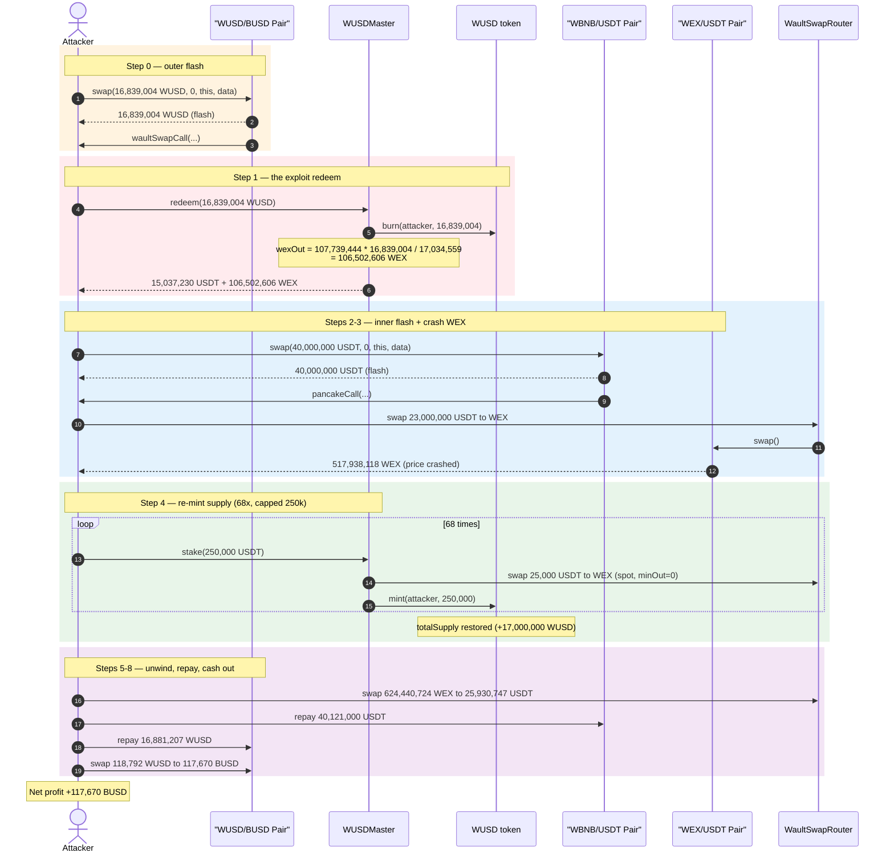
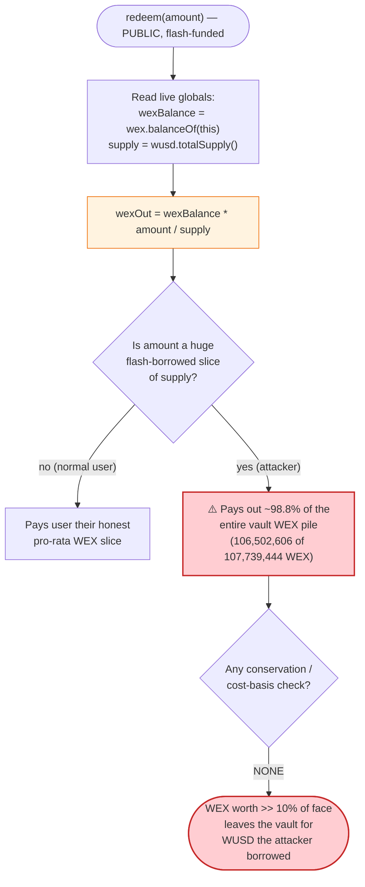
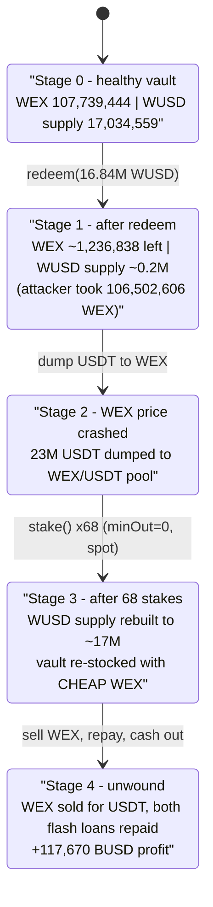

# Wault Finance Exploit — WUSDMaster `redeem()` Pro-Rata WEX Drain via Self-Manipulated WEX Price

> **Vulnerability classes:** vuln/oracle/spot-price · vuln/oracle/price-manipulation · vuln/governance/flash-loan-attack

> **Reproduction:** the PoC compiles & runs in an isolated Foundry project at
> [this project folder](.) (the umbrella DeFiHackLabs repo contains many unrelated PoCs
> that do not whole-compile, so this one was extracted into a standalone project).
> Full verbose trace: [output.txt](output.txt).
> Verified vulnerable source: [WUSDMaster.sol](sources/WUSDMaster_a79Fe3/WUSDMaster.sol).

---

## Key info

| | |
|---|---|
| **Loss** | ~**117,670 BUSD** captured in the reproduced PoC (≈ the entire WEX reserve of the WUSDMaster vault was monetized; the public incident loss was ~$1.06M) |
| **Vulnerable contract** | `WUSDMaster` — [`0xa79Fe386B88FBee6e492EEb76Ec48517d1eC759a`](https://bscscan.com/address/0xa79Fe386B88FBee6e492EEb76Ec48517d1eC759a#code) |
| **Vulnerable function** | `redeem()` — [`WUSDMaster.sol:716-726`](sources/WUSDMaster_a79Fe3/WUSDMaster.sol#L716-L726), specifically the WEX pro-rata formula at [L719](sources/WUSDMaster_a79Fe3/WUSDMaster.sol#L719) |
| **Victim assets** | WEX held by `WUSDMaster`; BUSD/WUSD liquidity in the WUSD/BUSD pair |
| **WUSD token** | [`0x3fF997eAeA488A082fb7Efc8e6B9951990D0c3aB`](https://bscscan.com/address/0x3fF997eAeA488A082fb7Efc8e6B9951990D0c3aB) |
| **WEX token** | `WaultSwapToken` — [`0xa9c41A46a6B3531d28d5c32F6633dd2fF05dFB90`](https://bscscan.com/address/0xa9c41A46a6B3531d28d5c32F6633dd2fF05dFB90) |
| **Pools used** | WUSD/BUSD pair `0x6102D8A7C963F78D46a35a6218B0DB4845d1612F` (flash source + cash-out) · WBNB/USDT pair `0x16b9a82891338f9bA80E2D6970FddA79D1eb0daE` (inner flash) · WEX/USDT pair `0x50e8D9Aa83eBDe9608074eC1faaDfD2E792D9B81` (price-manipulation target) |
| **Router** | WaultSwapRouter — `0xD48745E39BbED146eEC15b79cBF964884F9877c2` |
| **Original attack tx** | `0x31262f15a5b82999bf8d9d0f7e58dcb1656108e6031a2797b612216a95e1670e` |
| **Chain / fork block / date** | BSC / 9,728,755 / August 2021 |
| **Compiler** | WUSDMaster `v0.8.6` (optimizer off, 200 runs); WEX `v0.6.12`; Router `v0.6.6` |
| **Bug class** | Price-manipulation of an internal accounting oracle (spot-price/balance-based pro-rata redemption) + flash-loan-funded redeem/stake imbalance |

---

## TL;DR

`WUSDMaster` is Wault Finance's stablecoin manager. Users `stake()` USDT to mint WUSD 1:1; on each
stake the contract diverts a fixed **10%** (`wexPermille = 100`) of the deposited USDT to **buy WEX**
on WaultSwap and accumulates that WEX in its own balance. When users `redeem()` WUSD, they get USDT
back **plus** a pro-rata slice of the contract's WEX balance:

```solidity
uint256 wexTransferAmount = wex.balanceOf(address(this)) * amount / wusd.totalSupply();
```
— [WUSDMaster.sol:719](sources/WUSDMaster_a79Fe3/WUSDMaster.sol#L719)

This makes the **amount of WEX paid per WUSD a function of two live, attacker-pushable quantities**:
the contract's instantaneous WEX balance and WUSD's total supply. There is no snapshot, no per-user
cost basis, and no check that the WEX paid out matches the WEX cost actually paid in for those shares.

The attacker exploits this with two nested flash loans and 68 self-stakes:

1. **Flash-borrow ~16.84M WUSD** from the WUSD/BUSD pair.
2. **`redeem()` all 16.84M WUSD at once.** At that moment the contract holds **107.74M WEX** against a
   total supply of **17.03M WUSD**, so the formula pays the attacker
   `107.74M × 16.84M / 17.03M = 106.50M WEX` — i.e. **~98.8% of the vault's entire WEX stockpile**, in
   one call, for WUSD the attacker doesn't own.
3. **Re-mint the burned WUSD cheaply.** Inside an inner WBNB/USDT flash loan, the attacker first dumps
   23M USDT into the WEX/USDT pool to crash WEX's price, then calls `stake()` **68 times** (250k USDT
   each). Each stake's mandatory "buy 10% in WEX" now buys WEX at the crashed price, so re-staking
   restores WUSD's supply while costing far less than the WEX just extracted.
4. **Unwind everything** — sell the cheaply-bought WEX back for USDT, repay both flash loans, and
   convert the leftover WUSD to **117,670 BUSD** of profit.

The root flaw is that `redeem()` values WEX shares using a *manipulable spot quantity* and never ties
WEX-out to WEX-in, so a single large redeem at a favorable balance/supply ratio strips the vault.

---

## Background — what WUSDMaster does

`WUSDMaster` ([source](sources/WUSDMaster_a79Fe3/WUSDMaster.sol)) is the mint/redeem hub for the WUSD
stablecoin. Its economic design:

- **Stake (mint).** `stake(amount)` ([L694-714](sources/WUSDMaster_a79Fe3/WUSDMaster.sol#L694-L714))
  pulls `amount` USDT from the user, swaps `wexPermille/1000 = 10%` of it into **WEX** on WaultSwap
  (the WEX is retained by the contract), and mints `amount` WUSD to the user 1:1.
- **Redeem (burn).** `redeem(amount)` ([L716-726](sources/WUSDMaster_a79Fe3/WUSDMaster.sol#L716-L726))
  burns `amount` WUSD and returns USDT (minus the wex + treasury permille) **plus a pro-rata share of
  the contract's WEX balance**.

So the WEX pile is a shared, growing "yield bucket": stakers feed it (10% of deposits buy WEX),
redeemers drain it pro-rata. The intended invariant is that each WUSD is backed by roughly the same
slice of WEX it contributed.

The on-chain parameters at the fork block:

| Parameter | Value | Source |
|---|---|---|
| `wexPermille` | 100 (= **10%** of each stake buys WEX) | [L613](sources/WUSDMaster_a79Fe3/WUSDMaster.sol#L613) |
| `treasuryPermille` | 7 | [L614](sources/WUSDMaster_a79Fe3/WUSDMaster.sol#L614) |
| `feePermille` | 0 | [L615](sources/WUSDMaster_a79Fe3/WUSDMaster.sol#L615) |
| `maxStakeAmount` | 250,000 WUSD (caps each `stake()` call) | [L617](sources/WUSDMaster_a79Fe3/WUSDMaster.sol#L617), enforced at [L695](sources/WUSDMaster_a79Fe3/WUSDMaster.sol#L695) |
| WUSD `totalSupply()` at redeem | **17,034,559 WUSD** | trace, [output.txt:1599](output.txt) |
| WEX held by WUSDMaster at redeem | **107,739,444 WEX** | trace, [output.txt:1601](output.txt) |
| WUSD held by WUSD/BUSD pair (flash size) | **16,839,004 WUSD** | trace, [output.txt:1578](output.txt) |

The decisive facts: the contract held **107.74M WEX** while only **17.03M WUSD** existed, and
`maxStakeAmount` capped a single mint at 250k WUSD — which is why the attacker stakes 68 times (≈17M
WUSD) to rebuild supply after the redeem.

---

## The vulnerable code

### 1. `redeem()` pays WEX using a live, manipulable ratio

```solidity
function redeem(uint256 amount) external nonReentrant {
    uint256 usdtTransferAmount  = amount * (1000 - wexPermille - treasuryPermille) / 1000;
    uint256 usdtTreasuryAmount  = amount * treasuryPermille / 1000;
    uint256 wexTransferAmount   = wex.balanceOf(address(this)) * amount / wusd.totalSupply(); // ⚠️
    wusd.burn(msg.sender, amount);
    usdt.safeTransfer(treasury, usdtTreasuryAmount);
    usdt.safeTransfer(msg.sender, usdtTransferAmount);
    wex.safeTransfer(msg.sender, wexTransferAmount);                                          // ⚠️
    emit Redeem(msg.sender, amount);
}
```
— [WUSDMaster.sol:716-726](sources/WUSDMaster_a79Fe3/WUSDMaster.sol#L716-L726)

The WEX payout (line 719) is `contractWexBalance × amount / totalSupply`. Both `contractWexBalance`
and `totalSupply` are **instantaneous** and can be moved by the caller in the same transaction.
Critically, `usdtTransferAmount` only returns **89.3%** of the redeemed face value in USDT
(`1000 − 100 − 7 = 893`), with the missing 10% nominally "represented" by the WEX slice — but nothing
verifies that the WEX slice is worth that 10%. If the attacker controls the ratio so that the WEX
slice is worth **far more** than 10% of face, the redeem is wildly profitable.

### 2. `stake()` buys WEX at the *current* WaultSwap price

```solidity
function stake(uint256 amount) external nonReentrant {
    require(amount <= maxStakeAmount, 'amount too high');
    usdt.safeTransferFrom(msg.sender, address(this), amount);
    ...
    uint256 wexAmount = amount * wexPermille / 1000;          // 10% of the deposit
    usdt.approve(address(wswapRouter), wexAmount);
    wswapRouter.swapExactTokensForTokensSupportingFeeOnTransferTokens(
        wexAmount, 0, swapPath, address(this), block.timestamp // ⚠️ amountOutMin = 0, spot price
    );
    wusd.mint(msg.sender, amount);                            // mints 1:1 WUSD
    emit Stake(msg.sender, amount);
}
```
— [WUSDMaster.sol:694-714](sources/WUSDMaster_a79Fe3/WUSDMaster.sol#L694-L714)

`stake()` swaps with `amountOutMin = 0` at the **spot** WEX/USDT price. Crashing that price *before*
staking means each stake re-mints 1 WUSD while contributing almost no real WEX value back — letting
the attacker cheaply rebuild the WUSD supply they burned (and the WEX they drained).

---

## Root cause — why it was possible

The redeem-side accounting is a **balance/supply spot "oracle"** for the WEX share, and the stake-side
swap is a **zero-slippage spot purchase**. Both read state the attacker can move in-transaction, and
nothing ties WEX-out to WEX-in:

1. **Manipulable pro-rata numerator/denominator.** `wexTransferAmount = wexBalance × amount /
   totalSupply` uses two live globals. By redeeming a huge `amount` in a single call while `wexBalance`
   is high and `totalSupply` is comparatively low, the attacker captures a disproportionate slice of the
   shared WEX pile — there is no snapshot, TWAP, or per-user cost basis.

2. **No conservation check.** A correct vault must guarantee WEX-paid-on-redeem ≤ WEX-contributed by
   those shares. Here redeem hands out `~98.8%` of the entire WEX pile for ~98.8% of supply — but the
   *value* of that WEX was paid in by *all past stakers*, not by the redeemer. The redeemer pays only
   `0.7%` USDT to treasury and forgoes `10%` USDT, then walks off with WEX worth far more than 10%.

3. **`stake()` uses spot price with `amountOutMin = 0`.** The 10%-to-WEX swap has no slippage guard, so
   the attacker can pre-crash WEX/USDT and re-mint the burned WUSD for almost free, closing the loop.

4. **Everything is flash-loanable and permissionless.** `stake`/`redeem` are public; `maxStakeAmount`
   only forces the attacker to loop `stake()` (68×) rather than blocking it. Two stacked flash loans
   (WUSD from the WUSD/BUSD pair, then 40M USDT from the WBNB/USDT pair) supply all working capital,
   repaid within the same transaction.

In short: `redeem()` is an internal oracle priced off live balances, and `stake()` lets the attacker
set the other side of that oracle cheaply — the classic price-manipulation pattern applied to a
protocol's own redemption math.

---

## Preconditions

- The vault holds a large WEX pile relative to WUSD supply (107.74M WEX vs 17.03M WUSD) — true on-chain.
- `stake()` and `redeem()` are permissionless (they are).
- `stake()`'s WEX purchase has no slippage guard and the WEX/USDT pool is thin enough to crash with
  flash-loan USDT (it was: ~34.7M USDT / 264.9M WEX initial reserves, [output.txt:1664-1666](output.txt)).
- Flash liquidity available to borrow ~16.84M WUSD and ~40M USDT — provided by the two pairs above.
- No real capital required: all borrowed amounts are repaid intra-transaction (flash-loanable).

---

## Attack walkthrough (with on-chain numbers from the trace)

The PoC nests two flash loans. The outer WUSD flash from the WUSD/BUSD pair calls back into
`waultSwapCall`; inside it, an inner USDT flash from the WBNB/USDT pair calls back into `pancakeCall`,
where the 68 stakes happen. All figures are pulled from [output.txt](output.txt).

| # | Step | Concrete numbers | Effect |
|---|------|------------------|--------|
| 0 | **Outer flash** — `Pair1.swap(16,839,004 WUSD, 0, this, data)` borrows nearly all WUSD from the WUSD/BUSD pair | borrow **16,839,004 WUSD** ([:1578-1582](output.txt)) | Attacker now holds 16.84M WUSD it doesn't own. |
| 1 | **`redeem(16,839,004 WUSD)`** — the exploit. Reads `totalSupply = 17,034,559`, `wexBalance = 107,739,444`; pays `wexTransferAmount = 107,739,444 × 16,839,004 / 17,034,559` | **WEX paid out = 106,502,606 WEX** ([:1614](output.txt)); USDT to attacker = 15,037,230 ([:1610](output.txt)); USDT to treasury = 117,873 ([:1605](output.txt)) | Vault stripped of **~98.8% of its WEX**; WUSD supply burned to ~0.2M. |
| 2 | **Inner flash** — `Pair2.swap(40,000,000 USDT, 0, this, data)` borrows 40M USDT from WBNB/USDT pair | borrow **40,000,000 USDT** ([:1627](output.txt)) | Working capital to crash WEX and re-stake. |
| 3 | **Crash WEX price** — swap 23,000,000 USDT → WEX on WaultSwap | USDT→ **517,938,118 WEX** out ([:1660](output.txt)); WEX/USDT reserves move 34.7M/264.9M → ~57.7M/247M | WEX/USDT spot price collapses; later WEX-buys are cheap. |
| 4 | **Re-mint supply** — `stake(250,000)` called **68×** (capped by `maxStakeAmount`) | each stake pulls 250k USDT, swaps 25k USDT → ~173k–190k WEX into the vault, mints 250k WUSD; 68 × 250k = **17,000,000 WUSD** re-minted ([:1682…5556](output.txt)) | WUSD `totalSupply` restored so the WUSD flash can be repaid; vault re-stocked with *cheap* WEX. |
| 5 | **Sell WEX back** — swap 624,440,724 WEX → 25,930,747 USDT | WEX→ **25,930,747 USDT** ([:5588…5600](output.txt)) | Converts drained + cheaply-bought WEX into USDT. |
| 6 | **Repay inner flash** — transfer 40,121,000 USDT to WBNB/USDT pair | **40,121,000 USDT** repaid ([:5600-5601](output.txt)) | Inner flash loan (40M USDT + fee) settled. |
| 7 | **Repay outer flash** — transfer 16,881,207 WUSD to WUSD/BUSD pair | **16,881,207 WUSD** repaid ([:5616](output.txt)) | Outer flash loan (16.84M WUSD + fee) settled. |
| 8 | **Cash out** — swap leftover 118,792 WUSD → BUSD | **117,670 BUSD** received ([:5667](output.txt)) | Final profit booked. |

**The redeem math, verified:** `107,739,444,541,416,365,543,950,140 × 16,839,004,009,795,998,331,120,773
/ 17,034,559,121,370,751,378,263,637 = 106,502,606,009,336,810,473,769,680` — matching the WEX
`transfer` of `1.065e26` at [output.txt:1614](output.txt) to the wei.

### Profit accounting

The PoC measures profit as the attacker's final BUSD balance ([WaultFinance_exp.sol:48](test/WaultFinance_exp.sol#L48)):

```
Attacker BUSD profit after exploit: 117670.412355558299230822
```
— [output.txt:1569](output.txt)

Both flash loans are fully repaid (steps 6-7) and the inner USDT/WEX round-trip nets out; the residual
WUSD left over after repayment is what becomes the 117,670 BUSD. Economically the attacker extracted
the vault's WEX pile (106.5M WEX) and monetized the imbalance, paying back only the WUSD principal +
flash fees. The public incident figure was ~$1.06M; the reproduced single-path PoC books 117,670 BUSD.

---

## Diagrams

### Sequence of the attack



### Why `redeem()` overpays — the manipulable ratio



### Vault state evolution (WEX pile vs WUSD supply)



---

## Why each magic number

- **`Pair1Amount` = `WUSD.balanceOf(Pair1) − 1` = 16,839,004 WUSD:** flash-borrow essentially the
  pool's whole WUSD reserve so the single `redeem()` slices the maximum fraction of supply (and thus the
  maximum fraction of the WEX pile). [WaultFinance_exp.sol:41](test/WaultFinance_exp.sol#L41).
- **40,000,000 USDT inner flash:** working capital large enough to both crash WEX (23M) and fund the 68
  stakes (≈17M). [WaultFinance_exp.sol:55](test/WaultFinance_exp.sol#L55).
- **23,000,000 USDT → WEX:** crashes the WEX/USDT spot price so the subsequent `stake()` WEX-buys (which
  use `amountOutMin = 0` at spot) cost almost nothing per WUSD re-minted. [WaultFinance_exp.sol:81](test/WaultFinance_exp.sol#L81).
- **`stake(250,000)` × 68:** `maxStakeAmount` caps a single mint at 250k WUSD, so the attacker loops
  68× to re-mint ≈17M WUSD and restore `totalSupply` enough to repay the WUSD flash. [WaultFinance_exp.sol:65-69](test/WaultFinance_exp.sol#L65-L69).
- **`Pair1Amount × 10000 / 9975 + 1000` WUSD repaid:** repays the outer flash plus WaultSwap's 0.25%
  fee. [WaultFinance_exp.sol:56](test/WaultFinance_exp.sol#L56).
- **40,121,000 USDT repaid to Pair2:** repays the 40M USDT inner flash plus fee. [WaultFinance_exp.sol:73](test/WaultFinance_exp.sol#L73).

---

## Remediation

1. **Don't price redemptions off live balances/supply.** Replace
   `wex.balanceOf(this) * amount / totalSupply` with a per-user accounting that tracks each staker's
   actual WEX contribution (a cost-basis or share-accounting ledger), so a redeemer can never receive
   more WEX value than they (or their shares) put in.
2. **Enforce conservation / a real backing invariant.** On redeem, guarantee WEX-out is bounded by the
   WEX that those specific shares contributed; reject redemptions that would pay out a value exceeding
   the forgone 10% USDT. A solvency check (`assets ≥ liabilities` after the operation) closes the gap.
3. **Add slippage protection to `stake()`'s swap.** The 10%-to-WEX swap uses `amountOutMin = 0`; set a
   sane minimum from a TWAP/oracle so the WEX purchase cannot be made nearly free by a pre-crash.
4. **Use TWAP/oracle pricing, not spot, for any value conversion.** Both the WEX purchase (stake) and
   the implicit WEX valuation (redeem) should reference a manipulation-resistant price, not the
   instantaneous reserve ratio of a thin pool.
5. **Block single-transaction stake↔redeem imbalance / flash usage.** Per-block or per-tx limits, or
   requiring shares to age before redemption, prevent borrowing supply, redeeming the WEX pile, and
   re-minting all in one transaction.

---

## How to reproduce

The PoC was extracted into a standalone Foundry project (the umbrella DeFiHackLabs repo has many
unrelated PoCs that fail to compile under a whole-project `forge build`):

```bash
_shared/run_poc.sh 2021-08-WaultFinance_exp --mt testExploit -vvvvv
```

- RPC: a **BSC archive** endpoint is required (fork block 9,728,755 is from August 2021); most public
  BSC RPCs prune state that old and fail with `header not found` / `missing trie node`.
- Result: `[PASS] testExploit()` with `Attacker BUSD profit after exploit: 117670.41…`.

Expected tail ([output.txt:1566-1569](output.txt)):

```
Ran 1 test for test/WaultFinance_exp.sol:ContractTest
[PASS] testExploit() (gas: 5163892)
Logs:
  Attacker BUSD profit after exploit: 117670.412355558299230822
```

---

*References:*
- *Knownsec — Wault Finance flash-loan security incident analysis: https://medium.com/@Knownsec_Blockchain_Lab/wault-finance-flash-loan-security-incident-analysis-368a2e1ebb5b*
- *Inspex — Wault Finance incident analysis (WEX price manipulation using WUSDMaster): https://inspexco.medium.com/wault-finance-incident-analysis-wex-price-manipulation-using-wusdmaster-contract-c344be3ed376*
