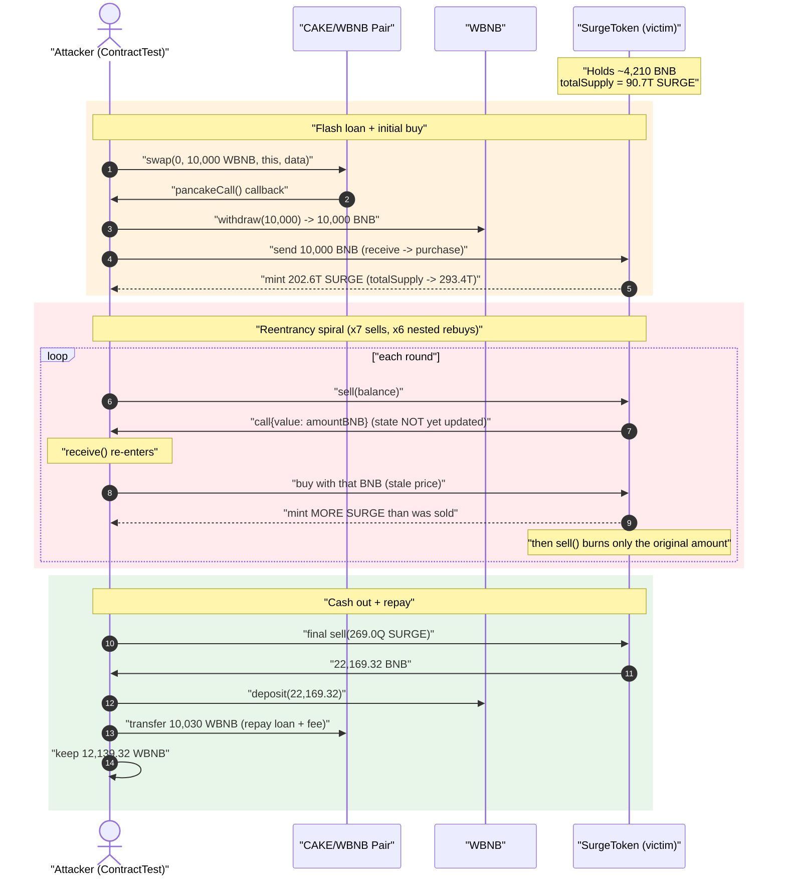
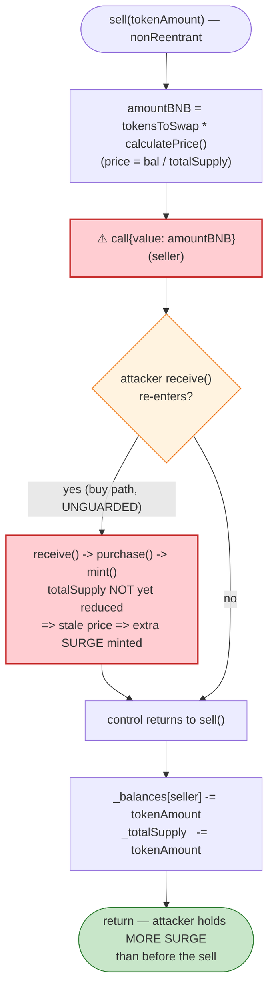
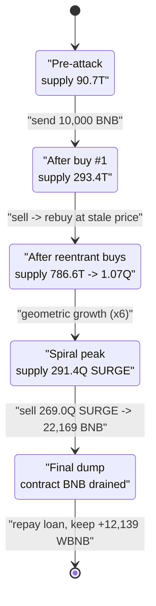

# XSURGE (Surge) Exploit — Reentrancy on a Liquidity-less Bonding-Curve Token

> **Vulnerability classes:** vuln/reentrancy/single-function

> **Reproduction:** the PoC compiles & runs in an isolated Foundry project at
> [this project folder](.) (the umbrella DeFiHackLabs repo contains many unrelated PoCs
> that do not compile together, so this one was extracted).
> Full verbose trace: [output.txt](output.txt).
> Verified vulnerable source: [SurgeToken.sol](sources/SurgeToken_E1E1Aa/SurgeToken.sol).

---

## Key info

| | |
|---|---|
| **Loss** | ~$2.56M at the time — the SurgeToken contract's **entire ~4,210 BNB reserve was drained, and the attacker walked off with 12,139.32 WBNB** (the rest came from the price spiral / repaid flash loan) |
| **Vulnerable contract** | `SurgeToken` (SURGE) — [`0xE1E1Aa58983F6b8eE8E4eCD206ceA6578F036c21`](https://bscscan.com/address/0xE1E1Aa58983F6b8eE8E4eCD206ceA6578F036c21#code) |
| **Victim** | The SURGE token contract itself (it *is* the "DEX" — it holds BNB and mints/burns SURGE against it) |
| **Flash-loan source** | PancakeSwap CAKE/WBNB pair — `0x0eD7e52944161450477ee417DE9Cd3a859b14fD0` |
| **Attacker contract (PoC)** | `ContractTest` — exploit harness reproduces the original |
| **Original attack tx** | `0x45c0ed...` family (XSURGE / Surge, BSC, Aug 16 2021) |
| **Chain / fork block / date** | BSC / 10,087,723 / Aug 16, 2021 |
| **Compiler** | SurgeToken: Solidity **v0.8.5**, optimizer **off** |
| **Bug class** | **Reentrancy** — external value call before balance/supply state update (CEI violation) |

---

## TL;DR

`SurgeToken` is a "liquidity-less" token: it has no AMM pool. Instead, the contract **holds BNB
directly** and acts as its own bonding-curve "DEX" — send BNB and it mints you SURGE at a price
derived from `contractBNB / totalSupply`; call `sell()` and it pays you BNB and burns your SURGE.

The fatal flaw is in `sell()`
([SurgeToken.sol:577-602](sources/SurgeToken_E1E1Aa/SurgeToken.sol#L577-L602)). It computes the BNB
payout from the *current* price, **sends the BNB via a raw `call` first**
([:591](sources/SurgeToken_E1E1Aa/SurgeToken.sol#L591)), and only **afterward** decrements the
seller's balance and reduces `totalSupply`
([:594, :596](sources/SurgeToken_E1E1Aa/SurgeToken.sol#L594-L596)). The `nonReentrant` modifier on
`sell()` does NOT protect the buy path: `receive()`
([:624-628](sources/SurgeToken_E1E1Aa/SurgeToken.sol#L624-L628)) → `purchase()`
([:554-574](sources/SurgeToken_E1E1Aa/SurgeToken.sol#L554-L574)) → `mint()` is a **separate, unguarded
function**.

So during the BNB callback inside `sell()`, the attacker **re-enters by buying** while the supply has
NOT yet been reduced. The price the buy sees is stale — the contract's BNB balance has effectively not
been lowered relative to supply — so the attacker is minted SURGE at an artificially cheap rate. Each
round it accumulates *more* SURGE than it sold, ratcheting its position up. After 7 nested
buy/sell rounds, the attacker holds an enormous SURGE balance that it dumps for **22,169 BNB**, repays
its 10,030-WBNB flash loan, and keeps **12,139.32 WBNB**.

---

## Background — what SurgeToken does

`SurgeToken` ([source](sources/SurgeToken_E1E1Aa/SurgeToken.sol)) markets itself in its own header
comments as a *"Liquidity-less Token, DEX built into Contract … Send BNB to contract and it mints Surge
Token … Price is calculated as a ratio between Total Supply and BNB in Contract."*
([:460-470](sources/SurgeToken_E1E1Aa/SurgeToken.sol#L460-L470)).

Concretely:

- **Buy** — `receive()` ([:624-628](sources/SurgeToken_E1E1Aa/SurgeToken.sol#L624-L628)) forwards any
  BNB sent to the contract into `purchase()`
  ([:554-574](sources/SurgeToken_E1E1Aa/SurgeToken.sol#L554-L574)), which mints SURGE proportional to
  `totalSupply * bnbIn / prevBNBbalance`, then applies a 94% `spreadDivisor`.
- **Sell** — `sell(tokenAmount)`
  ([:577-602](sources/SurgeToken_E1E1Aa/SurgeToken.sol#L577-L602)) pays the seller
  `tokensToSwap * calculatePrice()` BNB (with a 94% `sellFee`), then burns `tokenAmount` from supply.
- **Price** — `calculatePrice() = address(this).balance / totalSupply`
  ([:605-607](sources/SurgeToken_E1E1Aa/SurgeToken.sol#L605-L607)), integer division.

Key parameters / state at the fork block (derived from the trace):

| Parameter | Value |
|---|---|
| `_decimals` | **0** (SURGE is a whole-number token — raw integer == token count) |
| `sellFee` | 94 |
| `spreadDivisor` | 94 |
| Pre-attack `totalSupply` | **90,749,024,918,652 SURGE** |
| Pre-attack SURGE contract BNB balance | **≈ 4,210.25 BNB** (the reserve being attacked) |
| Initial price | ≈ 4.64e7 wei per SURGE |

---

## The vulnerable code

### 1. `sell()` — pays out *before* updating state (reentrancy)

```solidity
function sell(uint256 tokenAmount) public nonReentrant returns (bool) {

    address seller = msg.sender;

    // make sure seller has this balance
    require(_balances[seller] >= tokenAmount, 'cannot sell above token amount');

    // calculate the sell fee from this transaction
    uint256 tokensToSwap = tokenAmount.mul(sellFee).div(10**2);   // 94%

    // how much BNB are these tokens worth?
    uint256 amountBNB = tokensToSwap.mul(calculatePrice());        // price = bal/supply, STALE during callback

    // send BNB to Seller
    (bool successful,) = payable(seller).call{value: amountBNB, gas: 40000}("");   // ⚠️ EXTERNAL CALL FIRST
    if (successful) {
        // subtract full amount from sender
        _balances[seller] = _balances[seller].sub(tokenAmount, '...');             // ⚠️ state update AFTER
        // if successful, remove tokens from supply
        _totalSupply = _totalSupply.sub(tokenAmount);                              // ⚠️ supply update AFTER
    } else {
        revert();
    }
    emit Transfer(seller, address(this), tokenAmount);
    return true;
}
```
[SurgeToken.sol:577-602](sources/SurgeToken_E1E1Aa/SurgeToken.sol#L577-L602)

The `call{value: amountBNB, gas: 40000}` at
[:591](sources/SurgeToken_E1E1Aa/SurgeToken.sol#L591) hands control to the attacker **while
`_balances[seller]` and `_totalSupply` still hold their pre-sale values.** This is a textbook
checks-effects-interactions violation.

### 2. The buy path is NOT covered by `nonReentrant`

```solidity
receive() external payable {
    uint256 val = msg.value;
    address buyer = msg.sender;
    purchase(buyer, val);          // ← no nonReentrant, no inSwap guard
}
```
[SurgeToken.sol:624-628](sources/SurgeToken_E1E1Aa/SurgeToken.sol#L624-L628)

```solidity
function purchase(address buyer, uint256 bnbAmount) internal returns (bool) {
    require(bnbAmount <= address(this).balance, 'purchase not included in balance');
    uint256 prevBNBAmount = (address(this).balance).sub(bnbAmount);
    prevBNBAmount = prevBNBAmount == 0 ? address(this).balance : prevBNBAmount;
    // price-following mint — uses the CURRENT totalSupply, which the in-flight sell hasn't reduced yet
    uint256 nShouldPurchase = hyperInflatePrice
        ? _totalSupply.mul(bnbAmount).div(address(this).balance)
        : _totalSupply.mul(bnbAmount).div(prevBNBAmount);
    uint256 tokensToSend = nShouldPurchase.mul(spreadDivisor).div(10**2);
    if (tokensToSend < 1) revert('Must Buy More Than One Surge');
    mint(buyer, tokensToSend);     // ← inflates supply with attacker's tokens at stale price
    ...
}
```
[SurgeToken.sol:554-574](sources/SurgeToken_E1E1Aa/SurgeToken.sol#L554-L574)

The `nonReentrant` modifier ([:20-25](sources/SurgeToken_E1E1Aa/SurgeToken.sol#L20-L25)) only guards
`sell()`. Because `purchase()`/`mint()` are reachable through the plain `receive()` fallback, the
attacker re-enters through a *different* function and the guard never trips.

---

## Root cause — why it was possible

Two compounding defects:

1. **CEI violation in `sell()`.** The BNB transfer (interaction) happens before the balance/supply
   decrements (effects). During that window the contract's *accounting* is inconsistent: the seller has
   already received BNB, but `totalSupply` still counts the tokens being sold, so `calculatePrice()`
   and the mint formula both see a *stale, attacker-favorable* state.

2. **Incomplete reentrancy guard.** `nonReentrant` is applied to `sell()` only. The buy entry point
   (`receive` → `purchase` → `mint`) is unguarded, so a single-function guard provides zero protection
   against the cross-function reentrancy that actually matters here.

The net effect: each nested **buy mints SURGE as if the supply were still high** (cheap tokens), then
the wrapping **sell burns only the originally-sold amount**. The attacker ends each round holding *more*
SURGE than it started with, while having extracted real BNB. Repeating this drives `totalSupply` (and
the attacker's balance) up geometrically until a final dump captures the contract's whole BNB reserve.

---

## Preconditions

- The SURGE contract holds a meaningful BNB reserve (≈ 4,210 BNB here) — that reserve is the prize.
- Enough working capital to seed the spiral. The PoC obtains it with a **flash loan**: it borrows
  10,000 WBNB from the PancakeSwap CAKE/WBNB pair and repays 10,030 WBNB (0.3% fee) at the end, so the
  attack is **self-funded and atomic**.
- An attacker contract with a `receive()` that re-enters `SurgeToken` on each BNB callback (the harness
  caps the recursion at 6 nested buys via a `time < 6` counter, plus the 7 explicit `sell()` calls).

---

## Attack walkthrough (with on-chain numbers from the trace)

All figures are taken directly from [output.txt](output.txt). SURGE has 0 decimals, so the raw integers
below *are* token counts. The flash-loan source is the CAKE/WBNB pair; the victim is the SURGE contract.

| # | Step | Trace ref | Effect |
|---|------|-----------|--------|
| 0 | **Flash-borrow** 10,000 WBNB from the CAKE/WBNB pair via `pair.swap(0, 1e22, this, data)` | [output.txt:1575](output.txt) | Triggers `pancakeCall` callback. |
| 1 | In `pancakeCall`: `wbnb.withdraw(10,000)` → 10,000 BNB; send all 10,000 BNB to SURGE → **buy #1** mints **202,610,381,112,905 SURGE** | [output.txt:1585-1597](output.txt) | `totalSupply`: 90.7T → **293.4T**. |
| 2 | `sell()` #1 of full balance: SURGE pays **9,066.40 BNB** to attacker via `call` *(state not yet updated)* | [output.txt:1600-1601](output.txt) | Callback fires next ↓ |
| 3 | **Reentrant buy** inside the sell callback: spends the 9,066.40 BNB → mints **290,628,772,542,614 SURGE** at the stale price; *then* sell #1 burns the original amount | [output.txt:1602-1615](output.txt) | Attacker now holds **more** SURGE than before the sell. |
| 4 | Repeat sell→reentrant-buy 5 more times. BNB paid per `sell()`: 11,044.93 → 13,802.31 → 17,260.23 → 20,417.33 → 21,902.00 BNB; SURGE re-minted grows each round | [output.txt:1618-1707](output.txt) | `totalSupply` ratchets: 293T → 786T → 1.07Q → 1.80Q → 25.7Q → **291.4Q SURGE**. |
| 5 | Final `sell()` #7 of the whole accumulated balance (**269,062,300,501,934,837 SURGE**) → **22,169.32 BNB**; callback `time>=6` so no rebuy | [output.txt:1708-1715](output.txt) | Drains the contract's BNB. |
| 6 | `wbnb.deposit{value: 22,169.32}()`; `wbnb.transfer(pair, 10,030)` to repay the flash loan | [output.txt:1716-1726](output.txt) | Loan repaid (10,000 + 0.3%). |
| 7 | `wbnb.transfer(mywallet, 12,139.32 WBNB)` | [output.txt:1729-1733](output.txt) | **Profit booked.** |

### `totalSupply` ratchet (storage slot 4, from the trace)

| Round | Action | `totalSupply` (SURGE) |
|---|---|---:|
| start | (pre-attack) | 90,749,024,918,652 |
| 1 | after buy #1 | 293,359,406,031,557 |
| 2 | after reentrant buy in sell #1 | 786,598,559,687,076 |
| — | after sell #1 burn | 583,988,178,574,171 |
| 3 | after reentrant buy in sell #2 | 1,066,514,883,573,588 |
| 4 | after reentrant buy in sell #3 | 1,802,246,462,268,140 |
| 5 | after reentrant buy in sell #4 | 25,697,051,143,906,614 |
| 6 | after reentrant buy in sell #5 | 291,387,401,940,879,722 |
| end | after final sell #7 burn | 293,359,406,031,557 |

The geometric blow-up of supply (and the attacker's balance) between rounds 4→5→6 is the signature of
the reentrancy: each cheap mint enlarges the base that the next round multiplies.

### Profit accounting (WBNB / BNB)

| Direction | Amount (WBNB) |
|---|---:|
| Flash-borrowed | 10,000.00 |
| **Total BNB pulled out via 7 sells** | **115,662.53** (cycled back in as reentrant buys, except the last) |
| Final sell payout (kept) | 22,169.32 |
| Flash-loan repayment | −10,030.00 (10,000 + 0.3% fee) |
| **Net profit to attacker EOA** | **+12,139.32 WBNB** |

The 12,139.32 WBNB profit exceeds the contract's ~4,210 BNB starting reserve because the reentrancy
spiral also extracts value from the price-following mint formula itself, not just the static reserve —
the final dump captures everything the contract held after the spiral.

---

## Diagrams

### Sequence of the attack



### The reentrancy window inside `sell()`



### Supply ratchet — why each round nets more SURGE



---

## Why the guard failed (key takeaway)

`SurgeToken` *did* import a `ReentrancyGuard` and *did* put `nonReentrant` on `sell()`. The mistake was
believing a per-function guard is sufficient. The attack re-enters through a **different** function
(`receive`/`purchase`), so the `_status` flag set by `sell()` is irrelevant — the buy path never checks
it. A correct guard must cover *every* state-mutating external entry point (buy **and** sell), or the
code must follow checks-effects-interactions so that no inconsistent state is ever visible during an
external call.

---

## Remediation

1. **Follow checks-effects-interactions.** Update `_balances[seller]` and `_totalSupply` **before** the
   `call` that sends BNB in `sell()`. Then even if the attacker re-enters, the price/supply they observe
   already reflects the completed sale.
   ```solidity
   _balances[seller] = _balances[seller].sub(tokenAmount, '...');
   _totalSupply      = _totalSupply.sub(tokenAmount);
   (bool ok,) = payable(seller).call{value: amountBNB}("");
   require(ok);
   ```
2. **Guard the buy path too.** Add `nonReentrant` to the buy entry — either make `receive()` route
   through a guarded external function, or set the `inSwap`/`_status` flag across both buy and sell so a
   cross-function re-entry is rejected.
3. **Use `transfer`/pull-payments cautiously.** The 40,000-gas-capped `call` does not prevent
   reentrancy; it only limits gas. Prefer a pull-payment pattern (credit a withdrawable balance, let the
   user pull) for the BNB payout.
4. **Don't derive price from live balance during a mutating call.** `calculatePrice()` reads
   `address(this).balance / totalSupply`; while a sell's BNB has already left but supply hasn't dropped,
   that ratio is wrong. Snapshot pre-call invariants or compute against post-effect state.
5. **Recognize the architectural risk of "liquidity-less" bonding curves.** A contract that is its own
   AMM and pays out native value on every sell is a high-value reentrancy target by construction; it
   warrants extra-conservative ordering and full-surface guards.

---

## How to reproduce

The PoC was extracted into a standalone Foundry project (the umbrella DeFiHackLabs repo has many
unrelated PoCs that fail to compile under one whole-project build):

```bash
_shared/run_poc.sh 2021-08-XSURGE_exp -vvvvv
```

- RPC: a **BSC archive** endpoint is required (fork block 10,087,723 is from Aug 2021).
  `foundry.toml` uses `https://bsc-mainnet.public.blastapi.io`; most public BSC RPCs prune state that
  old and fail with `header not found` / `missing trie node`.
- Result: `[PASS] testExploit()` with the final log
  `Exploit completed, WBNB Balance: 12139323674904800361884` (≈ 12,139.32 WBNB).

Expected tail:

```
Ran 1 test for test/XSURGE_exp.sol:ContractTest
[PASS] testExploit() (gas: 349411)
Logs:
  Exploit completed, WBNB Balance: 12139323674904800361884

Suite result: ok. 1 passed; 0 failed; 0 skipped; finished in 5.95s
```

---

*Reference: SlowMist / DeFiHackLabs — Surge (XSURGE), BSC, Aug 16 2021. Classic cross-function
reentrancy on a self-AMM bonding-curve token.*
