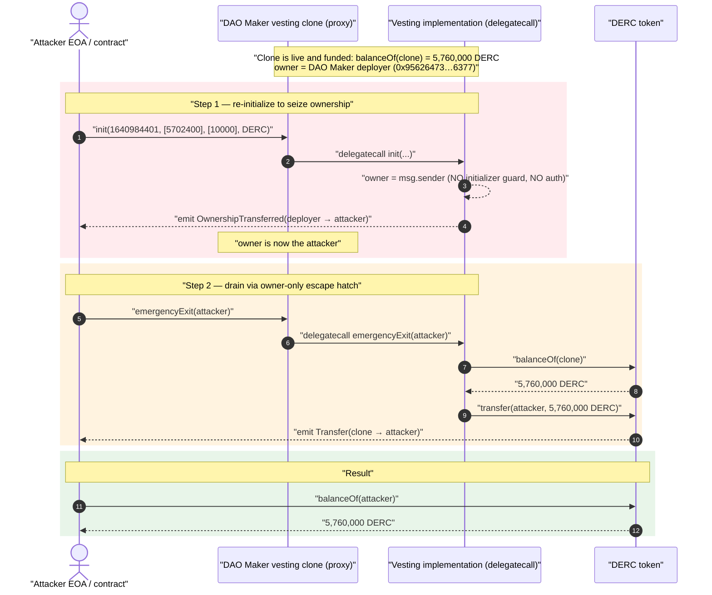
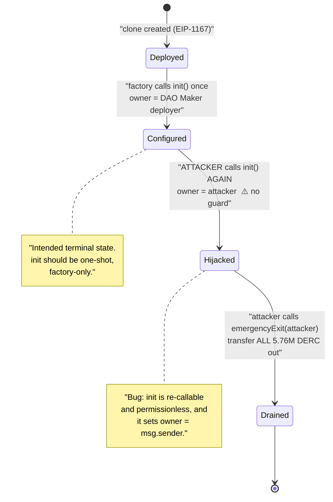
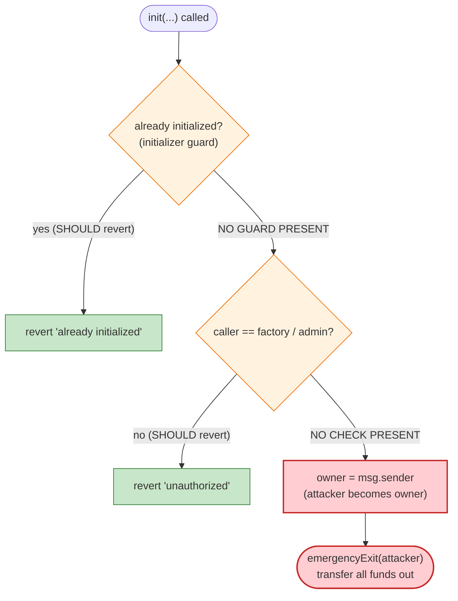

# DAO Maker Exploit — Unprotected `init()` Re-initialization → `emergencyExit` Vesting Drain

> One-line summary: DAO Maker's token-distribution/vesting clone contracts left their `init()` initializer **permissionless and re-callable**; an attacker re-initialized a live vesting contract to make itself the owner, then called the owner-gated `emergencyExit()` to sweep the entire token balance out — **5,760,000 DERC** in this PoC.

> **Reproduction:** the PoC compiles and runs in an isolated Foundry project at
> [this project folder](.) (the umbrella DeFiHackLabs repo contains many unrelated PoCs that do
> not whole-compile, so this one was extracted). Full verbose trace:
> [output.txt](output.txt). PoC: [test/DaoMaker_exp.sol](test/DaoMaker_exp.sol).
> The only verifiable source that resolved on-chain at the fork block is the DERC token itself:
> [sources/ERC20_9fa695/ERC20.sol](sources/ERC20_9fa695/ERC20.sol). The DAO Maker vesting
> proxy/implementation were unverified at the fork block, so the vesting-logic snippets below are
> reconstructed from the storage diff and call trace in `output.txt`, cross-checked against the
> public DAO Maker post-mortems.

---

## Key info

| | |
|---|---|
| **Loss (this PoC)** | **5,760,000 DERC** (DeRace Token) swept from one vesting contract. Across all four contracts the campaign drained ≈ **$4M** (13.5M CAPS, 2× 2.5M CPD, 1.44M DERC, ≈20.6M SHO). |
| **Vulnerable contract** | DAO Maker vesting/distribution proxy `0x2FD602Ed1F8cb6DEaBA9BEDd560ffE772eb85940` → impl (delegatecall) [`0xF17CA0E0F24A5FA27944275Fa0ceDec24Fbf8eE2`](https://etherscan.io/address/0xF17CA0E0F24A5FA27944275Fa0ceDec24Fbf8eE2#code) |
| **Drained token / victims** | DERC = DeRace Token [`0x9fa69536d1cda4A04cFB50688294de75B505a9aE`](https://etherscan.io/address/0x9fa69536d1cda4A04cFB50688294de75B505a9aE#code); the funds were vesting allocations belonging to DERC token holders / DAO Maker SHO participants. |
| **Attacker EOA** | [`0x2708cace7b42302af26f1ab896111d87faeff92f`](https://etherscan.io/address/0x2708cace7b42302af26f1ab896111d87faeff92f) |
| **Attack tx (this contract)** | [`0x96bf6bd14a81cf19939c0b966389daed778c3a9528a6c5dd7a4d980dec966388`](https://etherscan.io/tx/0x96bf6bd14a81cf19939c0b966389daed778c3a9528a6c5dd7a4d980dec966388) |
| **Chain / fork block / date** | Ethereum mainnet / **13,155,320** / **September 3, 2021** |
| **Compiler (DERC token)** | Solidity `v0.8.4+commit.c7e474f2`, optimizer on, 1000 runs |
| **Bug class** | Unprotected / re-callable initializer (missing `initializer` guard + missing access control) → privilege escalation → owner-gated fund drain |

---

## TL;DR

DAO Maker deployed many minimal-proxy ("clone") vesting contracts, one per token sale / SHO
allocation. Each clone is configured **after** deployment by an external `init(...)` function that,
among other things, sets the `owner`. That function had **no `initializer` modifier and no caller
restriction**, so it could be called again at any time by anyone.

The attacker simply:

1. Called `init(...)` on a live, funded vesting contract, passing benign-looking vesting parameters
   but causing the initializer to **overwrite `owner` with the attacker's address** (the trace shows
   `OwnershipTransferred(0x95626473…6367700-owner → attacker)`).
2. Called the now-attacker-owned **`emergencyExit(address)`** — an owner-only escape hatch that
   `transfer`s the contract's *entire* token balance to an arbitrary address — pointing it at
   themselves.

In this PoC that swept the whole DERC balance held by the clone: **5,760,000 DERC** (`5.76e24` wei),
confirmed by the before/after logs in [output.txt:6-7](output.txt) and the `Transfer` event in
[output.txt:43](output.txt). No flash loan, no price manipulation, no math trick — just a forgotten
access-control modifier on an initializer.

---

## Background — what the contract does

DAO Maker is a launchpad. For each token sale ("Strong Holder Offering" / SHO) it deploys a small
**vesting contract** that holds the sold tokens and releases them to beneficiaries over time. To save
gas these were deployed as EIP-1167 minimal proxies (clones) that `delegatecall` into one shared
implementation — visible in the trace as the proxy `0x2FD60…5940` forwarding every call into impl
`0xF17CA…8eE2` via `[delegatecall]` ([output.txt:20](output.txt), [output.txt:39](output.txt)).

A clone has no constructor (the implementation's constructor never runs in the proxy's context), so
its state is set up by an `init(...)` call instead. From the PoC interface and the trace, `init` takes:

```solidity
function init(
    uint256 startTime,            // 1640984401  (vesting start, here 2021-12-31)
    uint256[] calldata periods,   // [5702400]   (one 66-day release period)
    uint256[] calldata percents,  // [10000]     (100.00% released — bps)
    address  token                // DERC token address
) external;                       // ⚠️ no `initializer`, no `onlyOwner`/factory check
```

The owner of the clone is granted an **`emergencyExit(address recipient)`** function whose purpose is
to rescue funds in a stuck state. The trace shows exactly what it does:

```solidity
function emergencyExit(address recipient) external /* onlyOwner */ {
    uint256 bal = token.balanceOf(address(this)); // reads full balance
    token.transfer(recipient, bal);               // sends ALL of it out
}
```

— see the call sequence `balanceOf(self) = 5.76e24` then `transfer(attacker, 5.76e24)` at
[output.txt:40-47](output.txt).

The on-chain facts at the fork block:

| Fact | Value (from trace) |
|---|---|
| Clone's `owner` before attack | `0x95626473b6782292D20f1b07a85a8B7F6aB63677` (DAO Maker deployer) |
| DERC balance held by the clone | `5,760,000` DERC (`5.76e24` wei) |
| `init` re-callable? | **Yes** — call succeeds and emits `OwnershipTransferred` |
| `emergencyExit` access | owner-only — but owner was just overwritten to the attacker |

---

## The vulnerable code

> The vesting implementation was unverified on Etherscan at block 13,155,320, so the exact source is
> not in `sources/`. The two functions below are the *minimal behavior the trace proves*: `init`
> rewrote `owner` (and the vesting schedule) without any guard, and `emergencyExit` moved the entire
> balance under owner authority. The verified DERC token source — the asset that was drained — is in
> [sources/ERC20_9fa695/ERC20.sol](sources/ERC20_9fa695/ERC20.sol); its `_transfer`
> ([ERC20.sol:177-195](sources/ERC20_9fa695/ERC20.sol#L177-L195)) is a plain balance move, so the
> drain is a fully legitimate transfer from the contract's perspective.

### 1. `init` — initializer with no guard (reconstructed from the storage diff)

```solidity
// ⚠️ no `initializer` modifier  ⚠️ no factory/owner caller check
function init(uint256 start, uint256[] calldata periods, uint256[] calldata percents, address token) external {
    owner = msg.sender;        // slot 0  ← privilege escalation happens HERE
    vestingStart = start;      // slot 1
    vestingEnd   = ...;        // slot 2
    releasePeriods  = periods; // slot 3 (length) + 0xc257… (data)
    releasePercents = percents;// slot 4 (length) + 0x8a35… (data)
    // ...
}
```

What the storage diff in [output.txt:22-35](output.txt) proves the call did:

| Slot | Before | After | Meaning |
|---|---|---|---|
| `0` | `…95626473…6367700` | `…7fa9385be1…3e149600` | **owner ← attacker** (high 20 bytes), trailing `00` = packed init flag — **not** preventing re-call |
| `1` | `0x61093038` = 1627912760 (2021-08-02) | `0x61cf6f51` = 1640984401 | vesting start moved to attacker's `start` param |
| `2` | `0x62e3cc38` = 1659169336 (2022-07-30) | `0x62267251` = 1646598737 | vesting end pulled in earlier |
| `3` | `4` | `1` | `releasePeriods.length` 4 → 1 |
| `4` | `4` | `1` | `releasePercents.length` 4 → 1 |
| `0x8a35…19b` | `2500` | `10000` | percents[0] 25.00% → **100.00%** |
| `0x8a35…19c/d/e` | `2500` each | `0` | percents[1..3] zeroed (single 100% tranche) |
| `0xc257…85b` | `0x76a700` = 7,775,000? (period[0]) | `0x570300` = 5,702,400 | periods[0] ← attacker's `5_702_400` |
| `0xc257…85c/d/e` | `0x76a700` each | `0` | periods[1..3] zeroed |

The crucial line is **slot 0**: `init` writes `owner = msg.sender` with no check that the contract was
not already initialized and no check on who is calling. The attacker walks in and becomes owner.

### 2. `emergencyExit` — owner-gated full sweep (reconstructed from the trace)

```solidity
function emergencyExit(address recipient) external onlyOwner {
    IERC20 token = ...;                          // DERC
    uint256 bal = token.balanceOf(address(this));// 5,760,000 DERC
    token.transfer(recipient, bal);              // ALL of it → recipient
}
```

Trace evidence ([output.txt:38-49](output.txt)):

```
emergencyExit(ContractTest)
  ERC20::balanceOf(0x2FD60…5940)            → 5760000000000000000000000   (5.76e24)
  ERC20::transfer(ContractTest, 5.76e24)
    emit Transfer(0x2FD60…5940 → ContractTest, 5.76e24)
```

`emergencyExit` itself is *correctly* `onlyOwner`. The bug is not in `emergencyExit`; it is that
`init` let the attacker *become* the owner.

---

## Root cause

Two independent omissions in the vesting clone compose into a critical bug:

1. **Re-callable initializer.** Clone contracts have no constructor, so initialization is done via an
   external `init`. The standard, mandatory pattern is to guard it with an `initializer` /
   "already-initialized" check (e.g. OpenZeppelin `Initializable`). DAO Maker's `init` had **no such
   guard**, so it could be invoked a second time on an already-live, already-funded contract.
2. **No access control on `init`.** Even a one-shot initializer is dangerous if anyone can be the one
   to shoot it, but here it was *also* re-callable. There was no check that the caller was the
   factory or a privileged role, and `init` set `owner = msg.sender`. Anyone calling `init` therefore
   **makes themselves owner**.

The owner then holds `emergencyExit`, an arbitrary-recipient full-balance withdrawal. The privilege
escalation (omission 1+2) is converted directly into theft by the legitimate-but-powerful escape
hatch (3).

> In short: a function that should have been callable **exactly once, by the factory only**, was
> callable **any number of times, by anyone** — and it grants the keys to the vault.

---

## Preconditions

- The target clone has tokens to steal (`balanceOf(clone) > 0`). At the fork block the DERC clone held
  5,760,000 DERC.
- `init` is callable (no `initializer` guard) — true for every DAO Maker clone of this implementation.
- The attacker can pass any `init` arguments; the values only need to be *accepted*, not sensible —
  the only one that matters for the theft is the implicit `owner = msg.sender`. (The benign-looking
  vesting params in the PoC are cosmetic.)

No flash loan, no capital, no specific block timing, and no victim interaction are required. This is a
single-actor, permissionless attack that any externally-owned account could run.

---

## Step-by-step attack walkthrough

Ground-truth values are taken from [output.txt](output.txt). `clone = 0x2FD60…5940`,
`attacker = ContractTest 0x7FA9385bE1…3e1496` (the live attacker contract in the original tx).

| # | Step | Call (trace line) | State change | Result |
|---|------|-------------------|--------------|--------|
| 0 | **Pre-state** | `DERC.balanceOf(attacker)` | — | Attacker DERC = **0** ([output.txt:16-18](output.txt)) |
| 1 | **Re-initialize & seize ownership** | `clone.init(1640984401, [5702400], [10000], DERC)` ([output.txt:19-37](output.txt)) | slot 0 owner `0x95626473…6377` → `attacker`; emits `OwnershipTransferred(deployer → attacker)` | Attacker is now `owner` of the clone |
| 2 | **Drain via the escape hatch** | `clone.emergencyExit(attacker)` ([output.txt:38-49](output.txt)) | reads `balanceOf(clone)=5.76e24`; `transfer(attacker, 5.76e24)`; emits `Transfer(clone → attacker, 5.76e24)` | Clone DERC → 0, attacker DERC → 5.76e24 |
| 3 | **Confirm** | `DERC.balanceOf(attacker)` ([output.txt:50-52](output.txt)) | — | Attacker DERC = **5,760,000.000000000000000000** |

The whole exploit is **two external calls**. The original on-chain campaign repeated this exact
pattern against four different clones (CAPS, CPD ×2, DERC, SHO) — see the PoC header
([test/DaoMaker_exp.sol:10-14](test/DaoMaker_exp.sol#L10-L14)).

---

## Profit / loss accounting

| Item | Amount |
|---|---:|
| Attacker DERC before | 0 |
| DERC held by clone (= sweep amount) | 5,760,000 DERC |
| Attacker DERC after | **5,760,000 DERC** |
| Net gain (this contract) | **+5,760,000 DERC** |

DERC = DeRace Token (18 decimals), drained 1:1 from the vesting contract — the loss is borne by the
vesting beneficiaries / DERC project. Across all four contracts the published campaign loss is
≈ **$4,000,000** at the time. Gas cost was trivial (PoC ran in 100,437 gas, [output.txt:4](output.txt)).

---

## Diagrams

### Sequence of the attack



### Ownership / privilege state machine



### Where the access control should have been



---

## Remediation

1. **Guard the initializer.** Use OpenZeppelin `Initializable` and the `initializer` modifier on
   `init`, so it reverts on any second call. For clones, set the flag in the clone's own storage, not
   the implementation's.
2. **Restrict who can initialize.** Even one-shot, `init` must be callable only by the factory that
   deploys the clone (e.g. require `msg.sender == factory`, or have the factory call `init` atomically
   inside the same `createClone` transaction so an external caller can never win the race).
3. **Do not derive `owner` from `msg.sender` in an externally-callable initializer.** Pass the intended
   owner explicitly from the trusted factory, or hard-code it; never `owner = msg.sender` in a function
   anyone can call.
4. **Constrain the escape hatch.** `emergencyExit` should at minimum be time-locked / two-step, emit an
   event, and ideally only send to a fixed treasury address rather than an arbitrary `recipient`, so
   that even a compromised owner cannot instantly exfiltrate to an unknown address.
5. **Sweep deployed clones.** Because the bug affected an entire family of already-deployed clones, the
   fix must include pausing/migrating funds out of every existing clone of the vulnerable
   implementation, not just patching the implementation for future deployments.

---

## How to reproduce

The PoC was extracted into a standalone Foundry project (the umbrella DeFiHackLabs repo has many
unrelated PoCs that fail to compile under a whole-project `forge build`):

```bash
_shared/run_poc.sh 2021-09-DaoMaker_exp --mt testExploit -vvvvv
```

- RPC: an **Ethereum mainnet archive** endpoint is required — the fork pins block **13,155,320**
  (Sept 3, 2021), and most public RPCs prune state that old. `foundry.toml` points `mainnet` at an
  Infura archive endpoint.
- Result: `[PASS] testExploit()` with the attacker's DERC balance going from `0` to `5,760,000`.

Expected tail (see [output.txt](output.txt)):

```
Ran 1 test for test/DaoMaker_exp.sol:ContractTest
[PASS] testExploit() (gas: 100437)
Logs:
  Before exploiting, Attacker DERC balance: 0.000000000000000000
  After exploiting, Attacker DERC balance: 5760000.000000000000000000

Suite result: ok. 1 passed; 0 failed; 0 skipped
```

---

*Reference: DAO Maker SHO vesting exploit, Ethereum, September 3, 2021 (~$4M across CAPS/CPD/DERC/SHO).
Bug class: unprotected re-callable initializer → owner takeover → owner-gated drain.*
