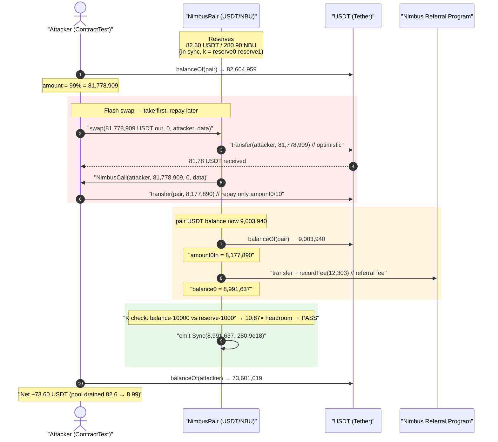
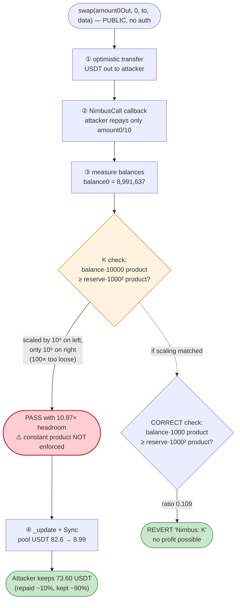
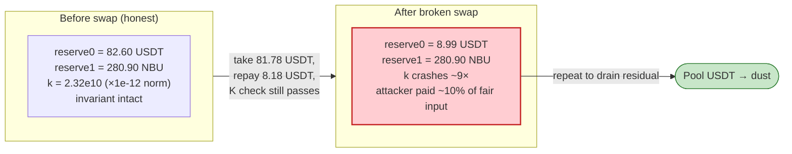

# Nimbus Pair Exploit — Broken `K`-Invariant Check (10000 vs 1000 Scaling Bug)

> **Vulnerability classes:** vuln/arithmetic/decimal-mismatch · vuln/logic/incorrect-order-of-operations

> **Reproduction:** the PoC compiles & runs in an isolated Foundry project at
> [this project folder](.) (the umbrella DeFiHackLabs repo
> contains several unrelated PoCs that do not compile, so this one was extracted).
> Full verbose trace: [output.txt](output.txt).
> Verified vulnerable source: [NimbusPair.sol](sources/NimbusPair_c0A6B8/NimbusPair.sol).

---

## Key info

| | |
|---|---|
| **Loss (this tx)** | **73.60 USDT** drained from the USDT/NBU Nimbus pair in a single `swap()`. The same primitive is repeatable and drains the whole pool over many calls. |
| **Vulnerable contract** | `NimbusPair` — [`0xc0A6B8c534FaD86dF8FA1AbB17084A70F86EDDc1`](https://etherscan.io/address/0xc0A6B8c534FaD86dF8FA1AbB17084A70F86EDDc1#code) |
| **Victim pool** | USDT/NBU Nimbus pair — `0xc0A6B8c534FaD86dF8FA1AbB17084A70F86EDDc1` (token0 = USDT, token1 = NBU `0xEB58343b36C7528F23CAAe63a150240241310049`) |
| **Drained asset** | USDT — [`0xdAC17F958D2ee523a2206206994597C13D831ec7`](https://etherscan.io/address/0xdAC17F958D2ee523a2206206994597C13D831ec7) |
| **Attacker (PoC harness)** | `ContractTest` `0x7FA9385bE102ac3EAc297483Dd6233D62b3e1496` |
| **Chain / fork block / date** | Ethereum mainnet / 13,225,516 / September 2021 |
| **Compiler** | NimbusPair: Solidity v0.8.0, optimizer **999999 runs** (PoC harness: 0.8.10) |
| **Bug class** | Broken constant-product (`x·y ≥ k`) invariant check — wrong numeric scaling factor (`10000` on balances vs `1000²` on reserves) |

---

## TL;DR

`NimbusPair` is a Uniswap-V2 fork. Uniswap's `swap()` enforces the constant-product invariant with a
**0.3% fee** by scaling balances by `1000` and reserves by `1000²`:

```solidity
balance0Adjusted = balance0 * 1000 - amount0In * 3;          // Uniswap V2
require(balance0Adjusted * balance1Adjusted >= reserve0 * reserve1 * (1000**2), 'K');
```

Nimbus changed the fee to 0.15% (`amount0In * 15`) but, instead of multiplying balances by `1000`,
multiplied them by **`10000`** while **leaving the reserve side at `1000²`**
([NimbusPair.sol:405-407](sources/NimbusPair_c0A6B8/NimbusPair.sol#L405-L407)):

```solidity
uint balance0Adjusted = balance0.mul(10000).sub(amount0In.mul(15));
uint balance1Adjusted = balance1.mul(10000).sub(amount1In.mul(15));
require(balance0Adjusted.mul(balance1Adjusted) >= uint(_reserve0).mul(_reserve1).mul(1000**2), 'Nimbus: K');
```

The balance side is now scaled by `10000² = 10⁸` while the reserve side is scaled by `1000² = 10⁶`
— a **100×** mismatch. The `K` requirement is effectively **100× too loose**. An attacker can take
tokens out of the pool while repaying only ~1/10 of what a correct invariant would demand, and the
check still passes.

In the live transaction the attacker called `swap()` to pull out **99% of the pool's USDT
(81.78 USDT)**, repaid only **`amount0Out / 10` (8.18 USDT)** inside the flash callback, and the
broken `K` check passed with **~10.9× headroom**. Net theft: **73.60 USDT** in a single call, with
nothing supplied beyond what was borrowed-and-returned.

---

## Background — what NimbusPair is

`NimbusPair` ([source](sources/NimbusPair_c0A6B8/NimbusPair.sol)) is a near-verbatim Uniswap-V2 pair
contract. It exposes the standard low-level `swap(amount0Out, amount1Out, to, data)`
([:365-412](sources/NimbusPair_c0A6B8/NimbusPair.sol#L365-L412)) with:

- **Optimistic transfers + flash-swap callback** — the pair sends the requested output tokens first,
  then (if `data.length > 0`) invokes the caller's `NimbusCall(...)` callback so the caller can supply
  the input, exactly like Uniswap's `uniswapV2Call`
  ([:376-378](sources/NimbusPair_c0A6B8/NimbusPair.sol#L376-L378)).
- **A referral fee** — a tiny `amount0In * 3 / 1994` slice is routed to the factory's
  `nimbusReferralProgram` ([:387-401](sources/NimbusPair_c0A6B8/NimbusPair.sol#L387-L401)).
- **The `K` invariant check** — the only thing standing between a flash-swap caller and free money
  ([:404-408](sources/NimbusPair_c0A6B8/NimbusPair.sol#L404-L408)).

On-chain state of the pair at the fork block (decoded from the trace's storage slot 8 / `Sync` events):

| Parameter | Value |
|---|---|
| token0 (`reserve0`) | **USDT** — 6 decimals |
| token1 (`reserve1`) | **NBU** — 18 decimals |
| `reserve0` (USDT) | **82,604,959** = 82.60 USDT |
| `reserve1` (NBU) | 280,901,368,924,817,109,893 = 280.90 NBU |
| Pair USDT balance | 82,604,959 (= reserve0; in sync) |

The pool is tiny (82.6 USDT / 280.9 NBU), so the absolute theft in this single tx is small — but the
bug is a *protocol-wide* invariant break: every Nimbus pair was drainable, and a single pair can be
emptied by repeating the primitive.

---

## The vulnerable code

### The broken `K` check inside `swap()`

[NimbusPair.sol:404-408](sources/NimbusPair_c0A6B8/NimbusPair.sol#L404-L408):

```solidity
{ // scope for reserve{0,1}Adjusted, avoids stack too deep errors
uint balance0Adjusted = balance0.mul(10000).sub(amount0In.mul(15));   // ⚠️ 10000, not 1000
uint balance1Adjusted = balance1.mul(10000).sub(amount1In.mul(15));   // ⚠️ 10000, not 1000
require(balance0Adjusted.mul(balance1Adjusted) >= uint(_reserve0).mul(_reserve1).mul(1000**2), 'Nimbus: K');
}
```

For reference, the upstream Uniswap V2 line this was forked from is:

```solidity
uint balance0Adjusted = balance0.mul(1000).sub(amount0In.mul(3));
uint balance1Adjusted = balance1.mul(1000).sub(amount1In.mul(3));
require(balance0Adjusted.mul(balance1Adjusted) >= uint(_reserve0).mul(_reserve1).mul(1000**2), 'UniswapV2: K');
```

The intent in Nimbus was clearly a **0.15% fee** (`amount0In * 15`, where Uniswap uses `amount0In * 3`
for 0.3%). To keep `15/10000 = 0.15%`, the balance multiplier had to become `10000`. **But the
right-hand side `mul(1000**2)` was never updated to match** — it should have been `mul(10000**2)`.

### Why the scaling must match

`getAmountOut`/`K` math relies on the balance scaling factor `F` being **squared** on both sides:

- Balance side: `(balance0·F)·(balance1·F) = balance0·balance1·F²`
- Reserve side: `reserve0·reserve1·F²`

Uniswap uses `F = 1000` on balances and `1000²` on reserves — consistent. Nimbus uses `F = 10000` on
balances but `1000²` on reserves — **`F²` on the left is `10⁸`, on the right `10⁶`**. The invariant
therefore reads:

```
balance0·balance1·10⁸  ≥  reserve0·reserve1·10⁶
⟺  balance0·balance1  ≥  reserve0·reserve1 / 100
```

i.e. the post-swap balance product only has to be **1/100** of the pre-swap reserve product. Because
`k` is a product, an attacker can return only ~`(1/√100)·(1+fee) ≈ 10%` of the tokens it pulled out
and still satisfy the (gutted) check.

### How the attacker reaches it: the flash-swap callback

[NimbusPair.sol:376-378](sources/NimbusPair_c0A6B8/NimbusPair.sol#L376-L378) (optimistic transfer +
callback), combined with the broken check, is the whole exploit:

```solidity
if (amount0Out > 0) _safeTransfer(_token0, to, amount0Out); // ① attacker gets USDT first
...
if (data.length > 0) INimbusCallee(to).NimbusCall(msg.sender, amount0Out, amount1Out, data); // ② callback
balance0 = IERC20(_token0).balanceOf(address(this));        // ③ measure what came back
```

The attacker passes non-empty `data` to trigger the callback, receives the USDT optimistically, and in
`NimbusCall` repays only one tenth of it — far below a correct invariant, but enough for the broken one.

---

## Root cause — why it was possible

A single copy-paste mistake when changing the swap fee:

> The balance scaling factor was raised from `1000` → `10000` (to express a 0.15% fee), but the
> reserve-side scaling on the right of the inequality stayed at `1000**2`. The invariant's two sides
> are no longer dimensionally consistent, so the `K` check is **100× weaker than intended** and stops
> enforcing the constant product.

The two correct fixes are mutually exclusive but either would work:
- keep `mul(10000)` on balances and change the RHS to `mul(10000**2)`, **or**
- keep `mul(1000**2)` on the RHS and change balances back to `mul(1000)` with a fee of `amount0In * X`
  matching the desired fee bps over `1000`.

As deployed, the contract enforces neither — it lets `balance·balance·10⁸ ≥ reserve·reserve·10⁶`,
which is trivially satisfiable while extracting value.

---

## Preconditions

- The pair holds a non-trivial reserve of the target token (here USDT). The bug is a pure invariant
  break: **no special role, oracle, timing, or trading-gate is needed** — anyone can call `swap()`.
- The attacker uses the **flash-swap callback** (non-empty `data`) so it can repay *after* receiving
  the output; this means **zero up-front capital** is required beyond gas. The PoC's harness starts
  with 0 USDT ("Before exploiting 0").
- `amount0Out < reserve0` (the `swap()` guard at
  [:368](sources/NimbusPair_c0A6B8/NimbusPair.sol#L368)) — the PoC takes 99% of the pool, satisfying it.

---

## Step-by-step attack walkthrough (with on-chain numbers from the trace)

token0 = USDT (`reserve0`), token1 = NBU (`reserve1`). All figures are taken directly from
[output.txt](output.txt).

| # | Step | Call / event | USDT effect |
|---|------|-------------|------------:|
| 0 | **Read pool** | `USDT.balanceOf(pair)` → 82,604,959 | pool holds 82.60 USDT |
| 1 | **Size the take** | `amount = 82,604,959 · 99/100 = 81,778,909` | request 99% of pool |
| 2 | **Flash swap** | `pair.swap(81,778,909, 0, attacker, data)` (non-empty `data`) | pair optimistically sends 81.78 USDT to attacker |
| 3 | **Callback fires** | `NimbusCall(attacker, 81,778,909, 0, data)` → `USDT.transfer(pair, amount0/10 = 8,177,890)` | attacker repays only **8.18 USDT** |
| 4 | **Pair measures balance** | `USDT.balanceOf(pair)` → 9,003,940 | `amount0In = 9,003,940 − (82,604,959 − 81,778,909) = 8,177,890` |
| 5 | **Referral fee** | `refFee = 8,177,890 · 3 / 1994 = 12,303` → sent to referral program; `recordFee(...)` | balance0 → 8,991,637 |
| 6 | **Broken K check** | `balance0Adjusted·balance1Adjusted ≥ reserve0·reserve1·1000²` → **PASS (10.87× headroom)** | invariant defeated |
| 7 | **Sync & settle** | `emit Sync(reserve0 = 8,991,637, reserve1 = 280,901,368,924,817,109,893)` | pool USDT crashes 82.6 → 8.99 |
| 8 | **Profit** | `USDT.balanceOf(attacker)` → 73,601,019 | attacker keeps **73.60 USDT** |

### Verifying the invariant arithmetic

Using the on-chain numbers:

```
balance0      = 8,991,637          (after repay − refFee)
balance1      = 280,901,368,924,817,109,893   (NBU untouched)
amount0In     = 8,177,890
reserve0_old  = 82,604,959
reserve1_old  = 280,901,368,924,817,109,893

DEPLOYED (broken) check:
  LHS = (8,991,637·10000 − 8,177,890·15) · (280.9e18·10000 − 0)
      ≈ 2.522e35
  RHS = 82,604,959 · 280.9e18 · 1000²
      ≈ 2.320e34
  LHS / RHS ≈ 10.87   →  PASS ✅  (attacker only returns ~10%)

CORRECT (1000) check (what should have been enforced):
  LHS = (8,991,637·1000 − 8,177,890·3) · (280.9e18·1000)
      ≈ 2.519e33
  RHS = 82,604,959 · 280.9e18 · 1000²
      ≈ 2.320e34
  LHS / RHS ≈ 0.1086  →  FAIL ❌  ('Nimbus: K' would revert)
```

The two checks differ by exactly the **100×** scaling error. Under a correct invariant the attacker
would have to repay essentially the full Uniswap-priced input and there would be no profit; under the
deployed invariant it repays ~10% and walks off with the rest.

---

## Profit / loss accounting (USDT, 6 decimals)

| Direction | Amount (raw) | Human |
|---|---:|---:|
| USDT taken out of pool (`amount0Out`) | 81,778,909 | 81.78 |
| USDT repaid in callback (`amount0/10`) | 8,177,890 | 8.18 |
| **Net profit to attacker** | **73,601,019** | **73.60** |
| Pair USDT reserve before → after | 82,604,959 → 8,991,637 | 82.60 → 8.99 |
| Referral fee siphoned (incidental) | 12,303 | 0.012 |

Harness balances (from logs): **Before exploiting 0 → After exploiting 73,601,019**. No NBU moved; the
entire profit is USDT extracted by violating the constant product. Repeating the primitive on the
residual reserve would drain the pool to dust.

---

## Diagrams

### Sequence of the attack



### Why the scaling mismatch defeats the invariant



### Pool state before vs. after



---

## Why each magic number

- **`amount = balanceOf(pair) · 99/100` (81,778,909):** takes almost the entire USDT reserve in one
  go. The `swap()` guard only requires `amount0Out < reserve0`, so 99% is the largest practical take.
- **`amount0/10` repaid in `NimbusCall` (8,177,890):** this is the key number. Because the `K` check is
  100× too loose, repaying just **one tenth** of the output still leaves ~10.9× of headroom in the
  (broken) invariant. The attacker deliberately repays the minimum that clears the check, maximizing
  profit (90% of the take). Repaying less would risk the check failing on the residual reserve;
  `/10` is a safe, profitable choice.
- **`refFee = amount0In · 3 / 1994` (12,303):** Nimbus's referral skim; incidental to the attack but
  it slightly reduces the measured `balance0` (9,003,940 → 8,991,637) used in the K check.

---

## Remediation

1. **Fix the invariant scaling so both sides square the same factor.** With a 0.15% fee the correct
   line is:
   ```solidity
   uint balance0Adjusted = balance0.mul(10000).sub(amount0In.mul(15));
   uint balance1Adjusted = balance1.mul(10000).sub(amount1In.mul(15));
   require(balance0Adjusted.mul(balance1Adjusted) >= uint(_reserve0).mul(_reserve1).mul(10000**2), 'Nimbus: K');
   //                                                                              ^^^^^^^ was 1000**2
   ```
   The right-hand side must use `10000**2` (= `1e8`) to match `balance·10000` squared. Equivalently,
   revert balances to `mul(1000)` and use a fee numerator over `1000` if 0.15% precision is not needed.
2. **Add a unit/invariant test that fails on scale mismatch.** A single property test — "a swap that
   returns less than the constant product requires must revert" — would have caught this immediately.
   Fuzzing `swap()` against a reference `getAmountOut` is the canonical guard for AMM forks.
3. **Don't silently fork-and-tweak the fee.** Changing the fee in a Uniswap-V2 fork touches two coupled
   constants (the balance multiplier and the reserve multiplier). Any change to one MUST be mirrored in
   the other; treat them as a single dimensioned quantity, ideally derived from named constants
   (`FEE_BPS`, `SCALE`) rather than inline literals.
4. **Re-audit every parameterized invariant after a fork.** The 0.3%→0.15% change also altered the
   referral-fee divisor (`/1994`); any constant that encodes a rate should be reviewed together when a
   fee is re-tuned.

---

## How to reproduce

The PoC was extracted into a standalone Foundry project (the umbrella DeFiHackLabs repo has several
unrelated PoCs that fail to compile under `forge test`'s whole-project build):

```bash
_shared/run_poc.sh 2021-09-Nimbus_exp -vvvvv
```

- RPC: an **Ethereum mainnet archive** endpoint is required (fork block 13,225,516, September 2021).
  `foundry.toml` configures the `mainnet` alias; an archive node is needed to serve historical state at
  that block.
- Result: `[PASS] testExploit()` with `After exploiting 73601019` (≈ 73.60 USDT profit from a 0 USDT
  start).

Expected tail:

```
Ran 1 test for test/Nimbus_exp.sol:ContractTest
[PASS] testExploit() (gas: 155552)
Logs:
  Before exploiting 0
  After exploiting 73601019
```

---

*Reference: Nimbus Platform exploit, Ethereum, September 2021. Root cause: AMM `K`-invariant check
used `mul(10000)` on balances against `mul(1000**2)` on reserves — a 100× scaling mismatch that let the
constant product be violated for profit via the flash-swap callback.*
